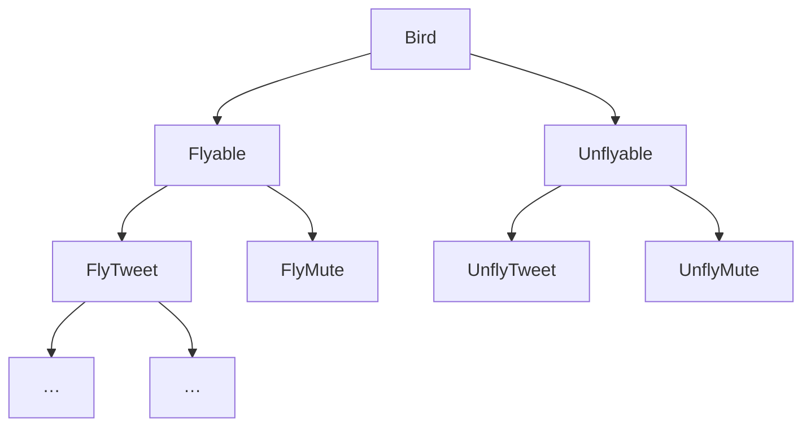
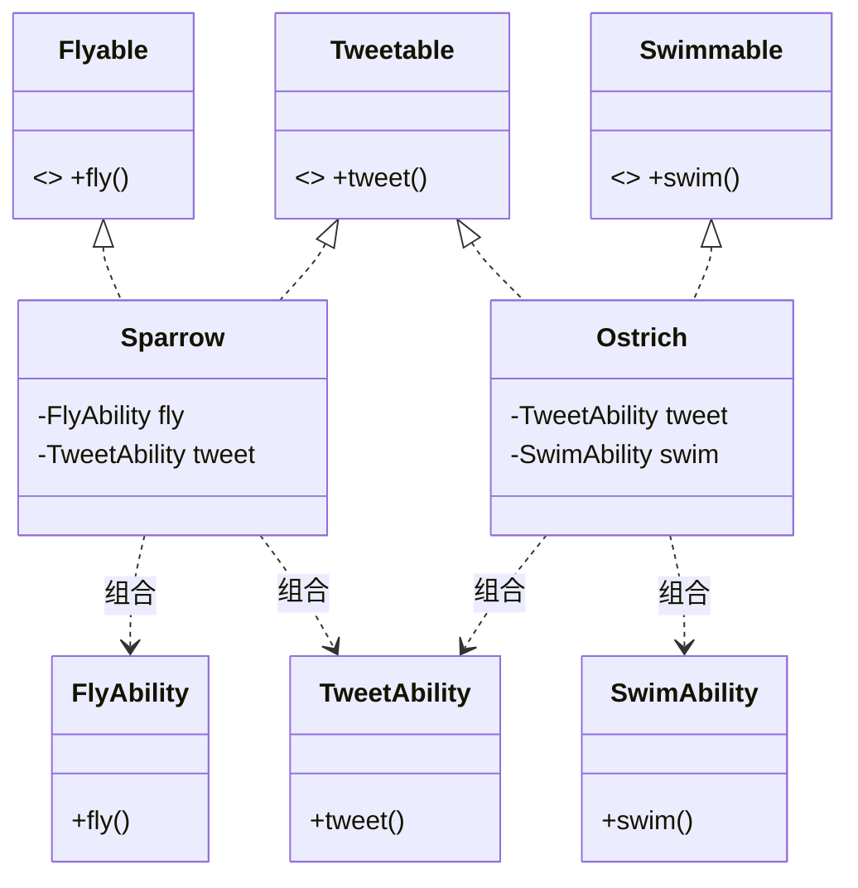
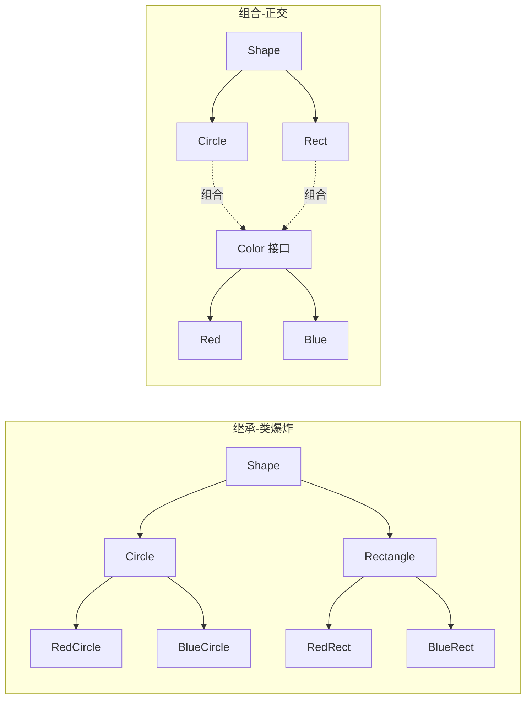
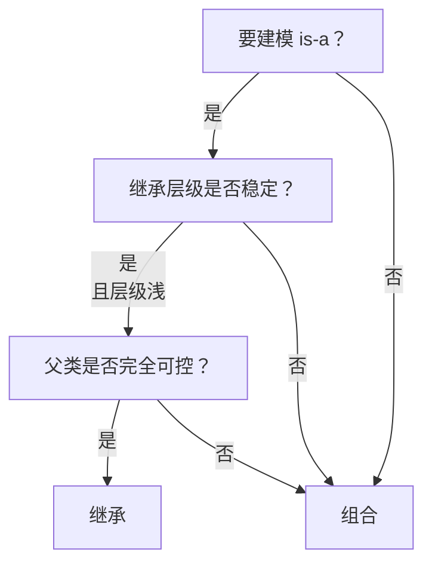
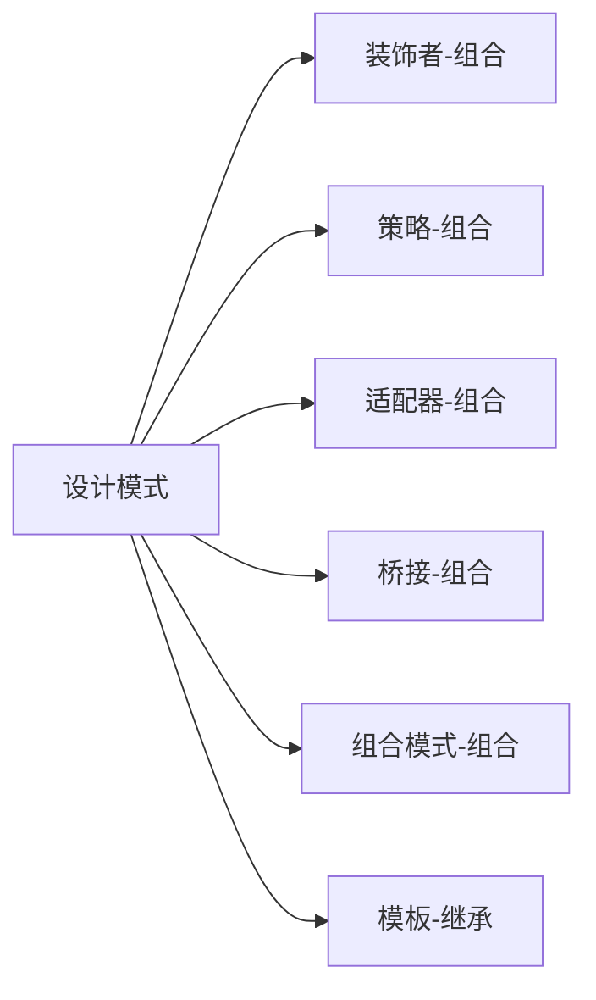
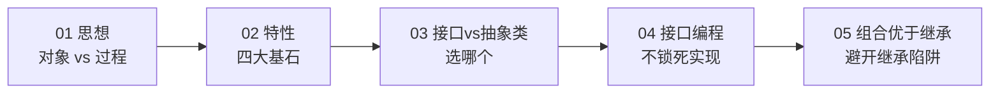

# 05.多用组合和少继承

#### 目录介绍
- [01.从一个翻车说起](#01从一个翻车说起)
  - [1.1 鸟类继承谜题](#11-鸟类继承谜题)
  - [1.2 层级越拆越乱](#12-层级越拆越乱)
  - [1.3 问题的根因](#13-问题的根因)
- [02.继承的三宗罪](#02继承的三宗罪)
  - [2.1 强耦合](#21-强耦合)
  - [2.2 层级膨胀](#22-层级膨胀)
  - [2.3 静态绑定](#23-静态绑定)
- [03.组合解题](#03组合解题)
  - [3.1 用接口拆能力](#31-用接口拆能力)
  - [3.2 用组合复用代码](#32-用组合复用代码)
  - [3.3 鸟类组合方案](#33-鸟类组合方案)
- [04.绘图程序对比](#04绘图程序对比)
  - [4.1 继承的爆炸](#41-继承的爆炸)
  - [4.2 组合的优雅](#42-组合的优雅)
  - [4.3 类图对比](#43-类图对比)
- [05.如何选择](#05如何选择)
  - [5.1 三大判据](#51-三大判据)
  - [5.2 继承适用场景](#52-继承适用场景)
  - [5.3 组合适用场景](#53-组合适用场景)
- [06.设计模式映射](#06设计模式映射)
  - [6.1 装饰者模式](#61-装饰者模式)
  - [6.2 策略模式](#62-策略模式)
  - [6.3 模板方法](#63-模板方法)
- [07.总结与延伸](#07总结与延伸)

---

## 01.从一个翻车说起

### 1.1 鸟类继承谜题

定义抽象类 `AbstractBird`，所有鸟都继承它，并提供 `fly()` 方法：

```java
public abstract class AbstractBird {
    public void fly() { /* 默认会飞 */ }
}
public class Sparrow extends AbstractBird { /* 麻雀，会飞 */ }
public class Ostrich extends AbstractBird {  // 鸵鸟，不会飞
    @Override public void fly() {
        throw new UnsupportedOperationException("鸵鸟不会飞");
    }
}
```

第一处尴尬出现：**鸵鸟仍然继承了 `fly()` 方法，只能靠抛异常"撇清"**。这违反里氏替换原则——客户端拿到一个 `AbstractBird` 调用 `fly()`，结果 RuntimeException。

### 1.2 层级越拆越乱

为了精确建模，再加一层：

```
AbstractBird
   ├── AbstractFlyableBird（会飞）
   │      ├── Sparrow
   │      └── Crow
   └── AbstractUnflyableBird（不会飞）
          ├── Ostrich
          └── Penguin
```

需求继续叠加："是否会叫？是否会游泳？"——
继续按维度切，类的数量呈**笛卡尔积爆炸**：

```
能力组合 = 飞? × 叫? × 游? = 2 × 2 × 2 = 8 个抽象类
再加哺乳/卵生 = 16 个
再加……
```

### 1.3 问题的根因

```mermaid
flowchart LR
    A[继承用来表达<br/>"具有某种能力"] --> B[每加一种能力维度]
    B --> C[就要再切一层继承]
    C --> D[层级爆炸]
    D --> E[可读性差<br/>耦合度高]
```

**根本错误**：用 is-a 关系（继承）去建模 has-a 关系（能力）。鸵鸟"是一种鸟"成立，但"是否会飞"是**能力维度**，不该用类型层级表达。

---

## 02.继承的三宗罪

### 2.1 强耦合

子类与父类是**编译期绑定**：

```java
// 父类改一行：
public abstract class AbstractBird {
    public void fly() {
        System.out.println("拍翅膀");   // 后来改为日志埋点
        flap();
    }
}
// 所有子类的 fly() 行为都被影响，但子类作者可能毫不知情
```

子类**透视到了父类的内部实现**——这正好破坏了封装。

### 2.2 层级膨胀



每多一个**正交维度**，层级就要乘上一倍。这不是"复用"，是**自虐**。

### 2.3 静态绑定

继承结构在编译期就钉死，**运行时不可改**：

```java
// 想让一只鸵鸟暂时"会飞"（魔法状态）→ 不可能
ostrich.fly();   // 永远抛异常，除非改类层级重新编译
```

---

## 03.组合解题

### 3.1 用接口拆能力

把"能力"用**接口**表达：

```java
public interface Flyable   { void fly();   }
public interface Tweetable { void tweet(); }
public interface Swimmable { void swim();  }
```

每只鸟按需实现：

```java
public class Sparrow implements Flyable, Tweetable { /* … */ }
public class Ostrich implements Tweetable, Swimmable { /* 不实现 Flyable */ }
public class Penguin implements Swimmable { /* … */ }
```

**接口让能力维度正交**——加一种能力只需加一个接口，不动任何已有类。

### 3.2 用组合复用代码

接口只声明，没复用代码。把行为实现抽成"能力对象"，再**组合 + 委托**：

```java
public class FlyAbility {
    public void fly() { /* 拍翅膀飞行的通用逻辑 */ }
}
public class TweetAbility {
    public void tweet() { /* 鸣叫逻辑 */ }
}

public class Sparrow implements Flyable, Tweetable {
    private final FlyAbility   fly   = new FlyAbility();    // 组合
    private final TweetAbility tweet = new TweetAbility();  // 组合

    @Override public void fly()   { fly.fly();     }       // 委托
    @Override public void tweet() { tweet.tweet(); }
}
```

### 3.3 鸟类组合方案



继承的三个职能——**类型表达、多态、代码复用**——被分别交给：

| 职能 | 替代方案 |
|------|----------|
| 类型表达（is-a） | 接口（has-a / can-do） |
| 多态 | 接口多态 |
| 代码复用 | 组合 + 委托 |

---

## 04.绘图程序对比

### 4.1 继承的爆炸

绘图系统：形状 × 颜色 → 类爆炸：

```java
class RedCircle extends Circle { /* … */ }
class BlueCircle extends Circle { /* … */ }
class RedRectangle extends Rectangle { /* … */ }
class BlueRectangle extends Rectangle { /* … */ }
// 加一种颜色 → 形状数 × 1 个新类
// 加一种形状 → 颜色数 × 1 个新类
```

### 4.2 组合的优雅

把"颜色"作为正交维度，组合进形状：

```java
interface Color { void apply(); }
class Red  implements Color { public void apply() { /* 红 */ } }
class Blue implements Color { public void apply() { /* 蓝 */ } }

abstract class Shape {
    protected final Color color;     // 组合
    Shape(Color color) { this.color = color; }
    abstract void draw();
}
class Circle extends Shape {
    Circle(Color c) { super(c); }
    void draw() { color.apply(); /* 画圆 */ }
}
class Rectangle extends Shape {
    Rectangle(Color c) { super(c); }
    void draw() { color.apply(); /* 画矩形 */ }
}

// 使用
Shape s = new Circle(new Red());
```

类的数量从 `N×M` 降为 `N+M`。这正是**桥接模式**的精髓。

### 4.3 类图对比



---

## 05.如何选择

### 5.1 三大判据



继承的安全姿势：**层级 ≤ 2 层，关系稳定，父类自己写**。三者缺一就改组合。

### 5.2 继承适用场景

| 场景 | 例子 |
|------|------|
| 框架钩子 | Android `Activity`、Spring `JdbcDaoSupport` |
| 模板方法 | `AbstractList`、`InputStream` |
| 改写第三方类 | 重写 FeignClient.encode() |

### 5.3 组合适用场景

| 场景 | 例子 |
|------|------|
| 能力维度正交 | 鸟、形状+颜色 |
| 行为可运行时切换 | 策略模式 |
| 可叠加多个能力 | 装饰者模式 |
| 跨业务领域复用 | URL 工具类被 Crawler 和 Analyzer 持有 |

---

## 06.设计模式映射

组合优于继承，并不是抽象口号，**23 种设计模式中绝大多数都基于组合**：

### 6.1 装饰者模式

动态叠加能力：

```java
new TimingDecorator(
    new LoggingDecorator(
        new RateLimitDecorator(realService)));
```

每层都"组合"前一层，行为可在运行时拼装。**靠继承做不到**。

### 6.2 策略模式

```java
public class Order {
    private DiscountPolicy discount;   // 组合策略
    public void setDiscount(DiscountPolicy p) { this.discount = p; }   // 运行时切换
}
```

策略对象作为字段被持有，**热替换**毫无压力。

### 6.3 模板方法

模板方法是**继承的合法用法**——父类定义骨架，子类填空：

```java
abstract class HttpClient {
    public final Response send(Request req) {
        beforeSend(req);
        Response r = doSend(req);   // 子类填
        afterSend(r);
        return r;
    }
    protected abstract Response doSend(Request req);
}
```

这种"骨架 + 钩子"的固定流程，正是继承的擅长场景。



---

## 07.总结与延伸

| 维度 | 继承 | 组合 |
|------|------|------|
| 关系 | is-a（编译期） | has-a（运行期） |
| 耦合度 | 强（父类暴露给子类） | 弱（仅依赖接口） |
| 灵活性 | 静态、不可换 | 动态、可热插拔 |
| 复用粒度 | 整块复用 | 细粒度组合 |
| 复杂度 | 易爆炸 | 类多但关系扁平 |

> "多用组合少用继承" 不是"杜绝继承"，而是把继承用在**对的场景**——浅层、稳定、可控。其他时候，组合永远是更安全的默认选项。

到此为止，前 5 篇构成了一条主线：



**有了对象、特性、契约、依赖与组合**，就具备了写出"高内聚低耦合"代码的全部砖头。但砖头怎么砌成稳健的房子？这需要更高层的指导原则——SOLID 五大原则与 23 种设计模式。

下一篇 [06.设计原则全景图](./06.设计原则全景图.md) 将以此前案例为线索，串联 SOLID 与设计模式，把面向对象设计推向工程落地。
