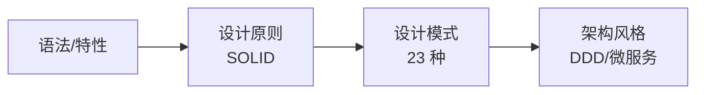
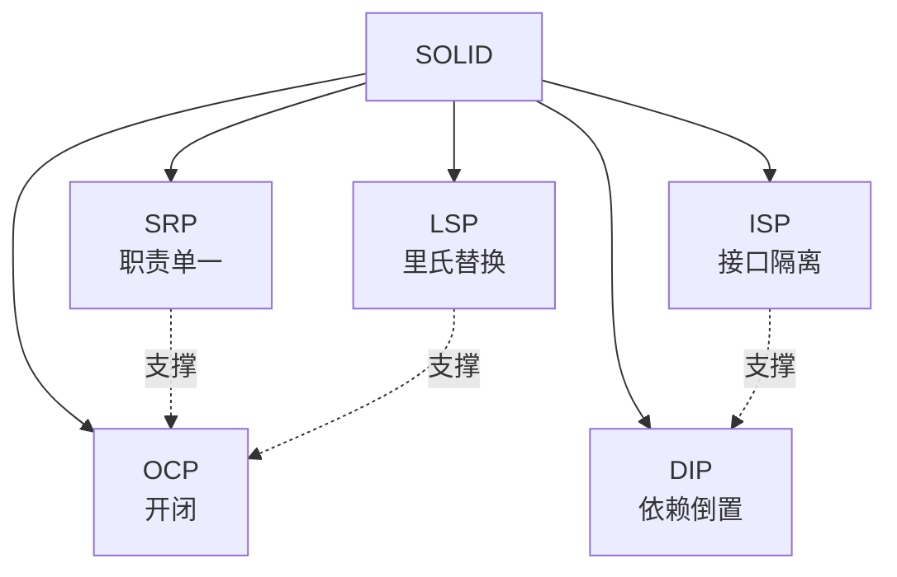
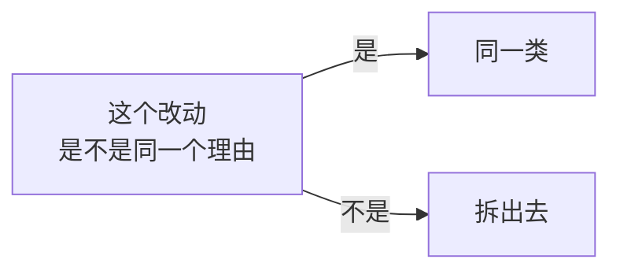
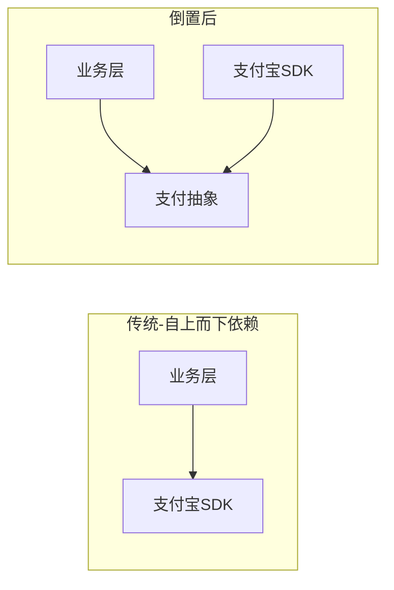
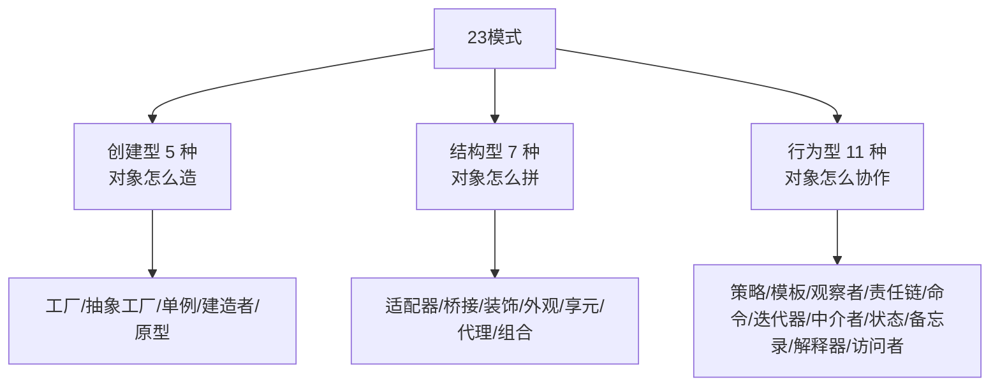
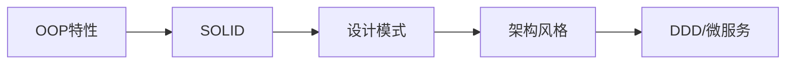

# 06.设计原则全景图

#### 目录介绍
- [01.从砖到房子](#01从砖到房子)
  - [1.1 已有的砖](#11-已有的砖)
  - [1.2 缺什么](#12-缺什么)
  - [1.3 SOLID 总览](#13-solid-总览)
- [02.单一职责 SRP](#02单一职责-srp)
  - [2.1 一句话理解](#21-一句话理解)
  - [2.2 反例与正例](#22-反例与正例)
  - [2.3 边界判断](#23-边界判断)
- [03.开闭原则 OCP](#03开闭原则-ocp)
  - [3.1 一句话理解](#31-一句话理解)
  - [3.2 案例对照](#32-案例对照)
  - [3.3 实现路径](#33-实现路径)
- [04.里氏替换 LSP](#04里氏替换-lsp)
  - [4.1 一句话理解](#41-一句话理解)
  - [4.2 经典反例](#42-经典反例)
  - [4.3 契约不变](#43-契约不变)
- [05.接口隔离 ISP](#05接口隔离-isp)
  - [5.1 一句话理解](#51-一句话理解)
  - [5.2 胖接口拆解](#52-胖接口拆解)
  - [5.3 与 SRP 的差异](#53-与-srp-的差异)
- [06.依赖倒置 DIP](#06依赖倒置-dip)
  - [6.1 一句话理解](#61-一句话理解)
  - [6.2 倒置的方向](#62-倒置的方向)
  - [6.3 IoC 与 DI](#63-ioc-与-di)
- [07.原则与模式](#07原则与模式)
  - [7.1 原则是骨](#71-原则是骨)
  - [7.2 模式是肉](#72-模式是肉)
  - [7.3 23 种模式分类](#73-23-种模式分类)
- [08.总结与下一步](#08总结与下一步)

---

## 01.从砖到房子

### 1.1 已有的砖

走过前五篇，你已经掌握：

- 对象与过程的范式之别（01）
- 四大特性的原理与落地（02）
- 接口与抽象类的取舍（03）
- 面向接口而非实现（04）
- 多用组合少用继承（05）

这些是**砖**——单点技能。

### 1.2 缺什么

砌墙还需要**图纸**：什么样的代码算"好"？什么样的拆分是"合理"？什么时候加一个抽象层是"过度设计"？



设计原则是**判断尺**：写代码时随时拿来对照，发现"违反"就提示重构。

### 1.3 SOLID 总览

| 缩写 | 全称 | 一句话 |
|------|------|--------|
| **S** | Single Responsibility | 一个类只做一件事 |
| **O** | Open/Closed | 对扩展开放，对修改关闭 |
| **L** | Liskov Substitution | 子类必须能替换父类 |
| **I** | Interface Segregation | 接口要小而专 |
| **D** | Dependency Inversion | 依赖抽象，不依赖具体 |



---

## 02.单一职责 SRP

### 2.1 一句话理解

> 一个类应当只有一个引起它变化的理由。

"变化的理由"通常对应**一个角色/一种业务方向**：财务部门改不动技术部门的代码。

### 2.2 反例与正例

```java
// ❌ Order 类既算钱又发邮件又写库
class Order {
    Money total() { /* 计算 */ }
    void save() { /* 写库 */ }
    void sendConfirmEmail() { /* 发邮件 */ }
}

// ✓ 拆成三个职责
class Order { Money total() { /* … */ } }
class OrderRepository { void save(Order o) { /* … */ } }
class EmailNotifier { void sendConfirm(Order o) { /* … */ } }
```

任意改一个，**编译只动一处**——这就是 SRP 的工程价值。

### 2.3 边界判断

不要走极端——不是"一个类一个方法"。判断边界的实操技巧：



例子：`Order.calcDiscount` 和 `Order.calcTax` 都是为"算钱"服务 → 同一类；
`Order.save`（持久化）和 `Order.calcTax`（业务）→ 分属基础设施与领域，应拆。

---

## 03.开闭原则 OCP

### 3.1 一句话理解

> 对扩展开放，对修改关闭。

新增功能 → **加新代码**，不改旧码。

### 3.2 案例对照

回到 04 篇的支付例子：

```java
// ❌ 违反 OCP
void pay(String channel) {
    if ("alipay".equals(channel)) /* … */
    else if ("wechat".equals(channel)) /* … */
}

// ✓ 满足 OCP
void pay(PaymentGateway g, Order o) { g.pay(o); }
```

加 PayPal → 加一个 `PaypalGateway`，**`pay` 函数零改动**。

### 3.3 实现路径

OCP 不是凭空实现的，需要前面所有招式协力：

```mermaid
flowchart LR
    SRP --> 拆出独立扩展点
    LSP --> 子类安全替换
    DIP --> 依赖抽象不依赖具体
    抽象 + 多态 --> OCP[OCP<br/>扩展开放<br/>修改关闭]
```

---

## 04.里氏替换 LSP

### 4.1 一句话理解

> 凡是基类能用的地方，子类必须能用，且行为不会令使用方惊讶。

### 4.2 经典反例

```java
// 鸵鸟继承 Bird，但 fly() 抛异常
class Ostrich extends Bird {
    @Override public void fly() { throw new UnsupportedOperationException(); }
}

void migrate(Bird bird) { bird.fly(); }   // 拿到 Ostrich → 崩溃
```

子类**违背了父类的契约**。修复方式：让 `fly()` 不在父类（参考 05 篇用接口拆能力）。

### 4.3 契约不变

LSP 的核心是**契约不变性**：

| 契约 | 子类约束 |
|------|----------|
| 前置条件 | 不能更严 |
| 后置条件 | 不能更松 |
| 不变量 | 必须保持 |
| 异常 | 不能抛父类未声明的 |

违反任意一条，子类就不再是"合法替代品"，OCP 也就守不住——所以 **LSP 是 OCP 的安全前提**。

---

## 05.接口隔离 ISP

### 5.1 一句话理解

> 客户端不应该被迫依赖它不使用的方法。

### 5.2 胖接口拆解

```java
// ❌ 一个胖接口什么都管
interface UserService {
    void register(User u);
    void login(String u, String p);
    void exportToExcel();
    void sendMarketingEmail();
}
// 客户端只想登录，却被迫看到导出/营销
```

```java
// ✓ 拆成多个小接口
interface UserAuth      { void register(User u); void login(String u, String p); }
interface UserExporter  { void exportToExcel(); }
interface MarketingMail { void sendMarketingEmail(); }
```

### 5.3 与 SRP 的差异

| 原则 | 着眼点 |
|------|--------|
| SRP | **类**只承担一种变化原因 |
| ISP | **接口**只服务于一类客户 |

二者经常被混淆——SRP 看实现，ISP 看契约，是同一思想在不同侧的体现。

---

## 06.依赖倒置 DIP

### 6.1 一句话理解

> 高层模块不应依赖低层模块；二者都应依赖抽象。
> 抽象不应依赖细节；细节应依赖抽象。

### 6.2 倒置的方向



依赖箭头被"倒过来"——业务**不再被 SDK 牵着走**，反而是 SDK 来适配业务定义的抽象。

### 6.3 IoC 与 DI

DIP 在工程上的落地是 **IoC（控制反转）+ DI（依赖注入）**：

```java
// ❌ 类自己 new 依赖
class CheckoutService {
    private AlipayGateway gateway = new AlipayGateway();
}

// ✓ 依赖通过构造注入
class CheckoutService {
    private final PaymentGateway gateway;
    CheckoutService(PaymentGateway gateway) { this.gateway = gateway; }
}
```

Spring/Dagger/Guice 等容器把"装配"职责从业务类剥离，**业务类只声明"我需要什么"，谁给 由容器决定**——这就是 IoC 的字面含义。

---

## 07.原则与模式

### 7.1 原则是骨

SOLID 给了你"判断方向"的尺子，但没告诉你**具体怎么写**。

### 7.2 模式是肉

23 种设计模式正是**SOLID 的具体落地剧本**：

| 模式 | 服务的原则 |
|------|------------|
| 工厂方法 | OCP、DIP |
| 策略模式 | OCP（替代 if-else）|
| 装饰者模式 | OCP、LSP |
| 适配器 | DIP（适配老接口）|
| 模板方法 | OCP（钩子）|
| 观察者 | OCP（事件解耦）|

### 7.3 23 种模式分类



| 类别 | 关注点 | 代表案例 |
|------|--------|----------|
| 创建型 | 解耦"创建"与"使用" | 工厂、建造者 |
| 结构型 | 类与对象的组合关系 | 装饰、代理 |
| 行为型 | 对象间的协作模式 | 策略、观察者 |

---

## 08.总结与下一步



**面向对象设计的全景**：从语言特性 → 通用原则 → 落地模式 → 架构思想，每一层都解决前一层无法回答的问题。

| 阶段 | 解决 |
|------|------|
| 特性 | 怎么写对象 |
| 原则 | 怎么写得"好" |
| 模式 | 已知场景的最佳实践 |
| 架构 | 大规模系统的整体协作 |

至此本系列完结。但学习永不止步——下一站建议方向：

- **23 种设计模式**：每种模式做一次实战，把原则变肌肉记忆；
- **DDD（领域驱动设计）**：把 SOLID 推到团队/限界上下文层级；
- **重构**：以 Martin Fowler《重构》为参照，把"嗅觉"变能力。

> 设计能力的本质是**复杂度治理能力**——在不确定的需求里，做出确定的、可演进的边界。SOLID 只是起点，不是终点。
