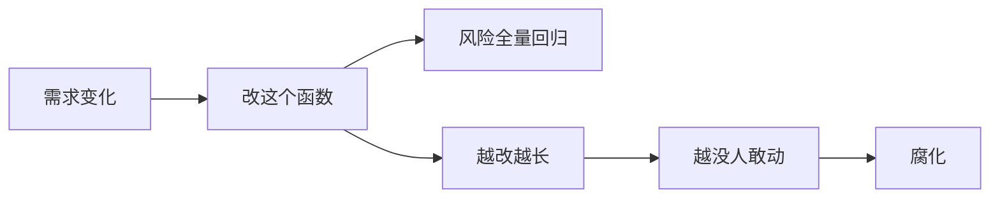
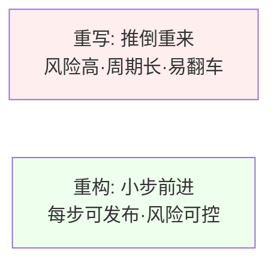
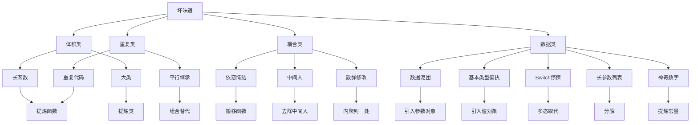
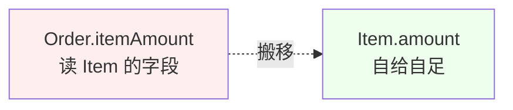
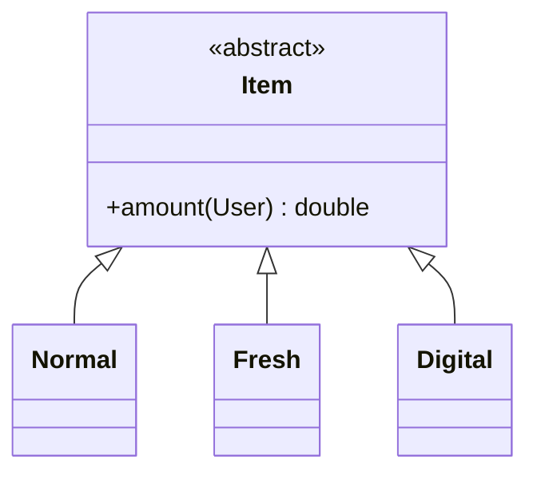
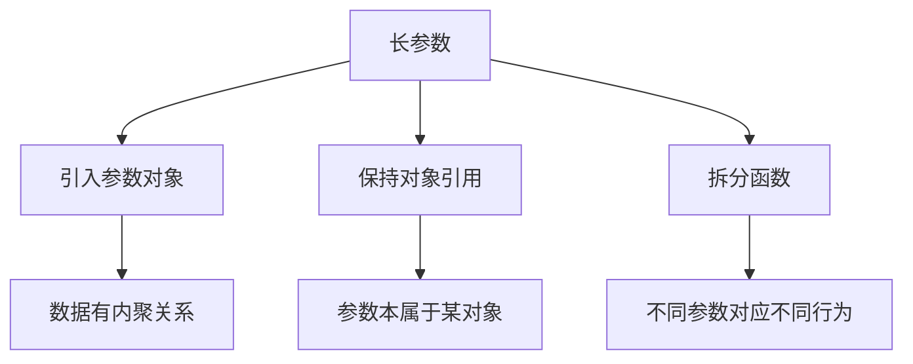
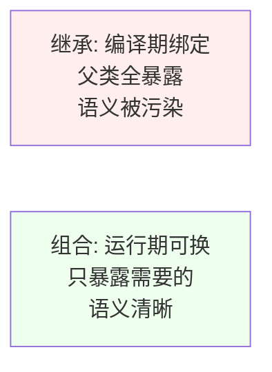
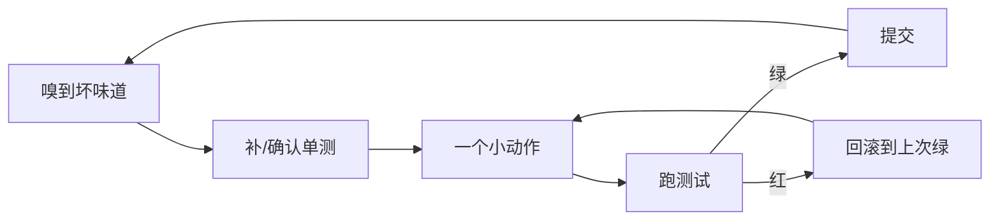
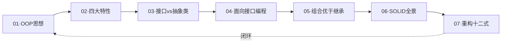

# 07.重构十二式的实战

#### 目录介绍

- 01.从一段烂代码说起
- 02.什么是重构
- 03.坏味道地图
- 04.第一式：提炼函数
- 05.第二式：内联函数
- 06.第三式：搬移函数
- 07.第四式：以查询取代临时变量
- 08.第五式：引入参数对象
- 09.第六式：以多态取代条件
- 10.第七式：以策略取代分支
- 11.第八式：分解长参数列表
- 12.第九式：提炼类
- 13.第十式：内联类
- 14.第十一式：去除中间人
- 15.第十二式：以组合取代继承
- 16.重构的节奏感
- 17.总结与系列收束

---

## 01.从一段烂代码说起

接续上一篇 `06.设计原则全景图`——SOLID 描述了"好代码长什么样"，但实际工作中，我们 80% 的时间面对的是**已经烂掉的代码**。怎么把它救回来？这就是重构。

先看一段真实项目里抠出来的订单结算函数（化名）：

```java
public double calc(Order o) {
    double total = 0;
    for (Item it : o.items) {
        if (it.type == 1) {                    // 普通商品
            total += it.price * it.qty;
        } else if (it.type == 2) {             // 生鲜
            total += it.price * it.qty * 0.95;
            if (o.user.level >= 3) total -= 5;
        } else if (it.type == 3) {             // 数码
            total += it.price * it.qty;
            if (it.price * it.qty > 1000) total -= 50;
        }
    }
    if (o.couponCode != null && o.couponCode.startsWith("VIP")) {
        total = total * 0.9;
    }
    if (total < 0) total = 0;
    System.out.println("订单 " + o.id + " 金额 " + total);
    return total;
}
```

它能跑、有单测、上线一年。但每加一种商品类型都要改它一次，每次改都要全部回归。这就是**坏味道**——代码没坏，但闻起来不对。



本篇要做的，就是用 12 个最常用的重构手法，把这段代码（以及它代表的一类问题）一步步救回来。

---

## 02.什么是重构

> **重构**：在不改变外部行为的前提下，调整代码内部结构，使其更易理解、更易修改。 ——Martin Fowler

四个关键词缺一不可：

| 关键词 | 含义 |
|--------|------|
| 不改外部行为 | 单测必须先在 → 重构后仍全绿 |
| 调整内部结构 | 改的是结构而非功能 |
| 易理解 | 降低读代码的认知负担 |
| 易修改 | 把"将来一定会变"的部分隔离出去 |

### 2.1 重构 ≠ 重写



### 2.2 重构的两顶帽子

写代码时戴**两顶帽子**，但**永远只戴一顶**：

- **加功能帽**：只加新行为，不动旧结构；
- **重构帽**：只调结构，不加新行为。

频繁切换，但绝不混戴——这是 Fowler 的核心纪律。

---

## 03.坏味道地图

重构不是看心情改代码，而是**闻到坏味道才动手**。常见 12 种坏味道与对应的"解药"：



下面 12 式按"由浅入深"排序——前 5 式是函数级，中间 4 式是类型级，后 3 式是关系级。

---

## 04.第一式：提炼函数

### 4.1 嗅觉

一段代码超过 10 行、或需要写注释解释"这一段在干嘛"，就该被提炼出去。

### 4.2 手法

回到开篇代码，第一刀切在循环体：

```java
public double calc(Order o) {
    double total = 0;
    for (Item it : o.items) {
        total += itemAmount(it, o.user);   // ← 提炼
    }
    total = applyCoupon(total, o.couponCode); // ← 提炼
    return Math.max(total, 0);
}

private double itemAmount(Item it, User user) {
    if (it.type == 1) return it.price * it.qty;
    if (it.type == 2) {
        double a = it.price * it.qty * 0.95;
        return user.level >= 3 ? a - 5 : a;
    }
    if (it.type == 3) {
        double a = it.price * it.qty;
        return a > 1000 ? a - 50 : a;
    }
    return 0;
}
```

### 4.3 收益

- `calc` 从 18 行降到 7 行，主流程一眼可见；
- 每个分支可独立单测；
- 给后续"以多态取代条件"铺好路。

> **口诀**：函数应该只做一件事，而且把这件事做好。

---

## 05.第二式：内联函数

提炼的反向操作。当一个函数体本身就比函数名更清晰、或只被调用一次且没有复用价值时，把它**摊回去**。

```java
// 反例：过度提炼
private boolean isPositive(double x) { return x > 0; }
if (isPositive(total)) { ... }

// 内联回去
if (total > 0) { ... }
```

提炼和内联是**对偶**——重构没有"越拆越好"，**只有越合适越好**。

---

## 06.第三式：搬移函数

### 6.1 嗅觉：依恋情结

一个函数对**别人家的字段**比对自己家的还热衷，它就该搬家。

观察上面的 `itemAmount`——它读 `it.price`、`it.qty`、`it.type`，全是 `Item` 的字段，几乎没用 `Order` 的东西。它该搬到 `Item` 里。

### 6.2 手法

```java
class Item {
    double amount(User user) {
        return switch (type) {
            case 1 -> price * qty;
            case 2 -> {
                double a = price * qty * 0.95;
                yield user.level >= 3 ? a - 5 : a;
            }
            case 3 -> {
                double a = price * qty;
                yield a > 1000 ? a - 50 : a;
            }
            default -> 0;
        };
    }
}

// 调用方
total += it.amount(o.user);
```



### 6.3 收益

数据和行为聚到一起——这正是 OOP 封装的初心。

---

## 07.第四式：以查询取代临时变量

### 7.1 嗅觉

临时变量散落在长函数里，命名随意（`tmp`/`a`/`x`），让人不敢删。

```java
double a = price * qty;
return a > 1000 ? a - 50 : a;
```

### 7.2 手法

把 `a` 抽成查询函数：

```java
private double gross() { return price * qty; }

double amount() {
    return gross() > 1000 ? gross() - 50 : gross();
}
```

> 担心多次调用性能？现代 JIT/编译器在纯函数上几乎零成本，**先求清晰，再求性能**。

---

## 08.第五式：引入参数对象

### 8.1 嗅觉：数据泥团

几个参数总是**结伴出现**，就是一个隐藏对象在喊"把我提出来"。

```java
// 反例
sendMail(String city, String street, String zip, String country, String to);

// 正例
sendMail(Address addr, String to);
```

### 8.2 应用到主案例

订单计算里 `(price, qty)` 总是一起出现，可以提炼成 `Money` 值对象：

```java
record Money(double price, int qty) {
    double gross() { return price * qty; }
}
```

值对象把"概念"显式化，是从坏味道"基本类型偏执"里逃出来的关键一步。

---

## 09.第六式：以多态取代条件

### 9.1 嗅觉：Switch 惊悚

`Item.amount()` 仍然有 `switch (type)`——每加一种商品都要回来改它。这是 OCP 的反例。

### 9.2 手法

```java
abstract class Item {
    double price; int qty;
    double gross() { return price * qty; }
    abstract double amount(User user);
}

class Normal extends Item {
    double amount(User u) { return gross(); }
}
class Fresh extends Item {
    double amount(User u) {
        double a = gross() * 0.95;
        return u.level >= 3 ? a - 5 : a;
    }
}
class Digital extends Item {
    double amount(User u) {
        return gross() > 1000 ? gross() - 50 : gross();
    }
}
```



### 9.3 收益

新增"图书"类型？**新建一个类**就行，不再修改 `Item.amount`。这正是 04 篇"接口而非实现编程"在重构层面的回响。

---

## 10.第七式：以策略取代分支

多态适合**对象本身**有差异；但当差异在**算法**而非对象时，更合适用策略。

```java
interface DiscountStrategy {
    double apply(double total, Order o);
}

class CouponVip implements DiscountStrategy {
    public double apply(double total, Order o) {
        return o.couponCode != null && o.couponCode.startsWith("VIP")
            ? total * 0.9 : total;
    }
}

// 主流程
List<DiscountStrategy> strategies = List.of(new CouponVip(), new FullCut(), ...);
for (DiscountStrategy s : strategies) total = s.apply(total, o);
```

策略 vs 多态对比：

| 维度 | 多态 | 策略 |
|------|------|------|
| 差异点 | 对象类型 | 算法/规则 |
| 选择时机 | 编译期由类型决定 | 运行期可注入/替换 |
| 适用 | 商品类型 | 优惠规则 |

---

## 11.第八式：分解长参数列表

参数超过 4 个就该警觉。三种解法：



```java
// 反例
register(name, age, email, phone, address, gender, level, source);

// 正例
register(UserProfile profile, RegisterContext ctx);
```

---

## 12.第九式：提炼类

### 12.1 嗅觉：大类

一个类有 20+ 字段、500+ 行，往往**藏了好几个类**。

```java
// 反例
class User {
    String name; int age;
    String province; String city; String street; String zip;
    String bankName; String cardNo; String cvv;
}
```

### 12.2 手法

```java
class User {
    String name; int age;
    Address address;
    BankCard card;
}
class Address { String province, city, street, zip; }
class BankCard { String bankName, cardNo, cvv; }
```

> 判定标准：**字段是否能形成内聚的小团体**。能，就提一个类。

---

## 13.第十式：内联类

提炼类的反向。当一个类只剩一两个字段、又没有独立行为，就把它内联回去——**保持模型与认知复杂度匹配**。

---

## 14.第十一式：去除中间人

### 14.1 嗅觉：只是转发

```java
class Manager {
    Employee secretary;
    public String getSecretaryName() { return secretary.getName(); }
    public String getSecretaryPhone() { return secretary.getPhone(); }
    public String getSecretaryEmail() { return secretary.getEmail(); }
    // 全是转发……
}
```

### 14.2 手法

让客户直接拿 `secretary` 用：

```java
class Manager {
    public Employee secretary() { return secretary; }
}
// 调用方
manager.secretary().getName();
```

> 但若 `Manager` 真的需要**屏蔽内部结构**（如做权限/审计），中间人是合理的。**不是所有委托都该被打掉**。

---

## 15.第十二式：以组合取代继承

这一式直接呼应 `05.多用组合和少继承`——重构里最常做的就是把误用的继承拆回组合。

### 15.1 经典反例

```java
class ArrayList<E> extends Vector<E>  // ← Java 早期错误
```

`Stack extends Vector` 是 JDK 公认的设计黑历史——`Stack` 因此暴露了 `add(int, E)` 这种**违反栈语义**的方法。

### 15.2 手法

```java
// 反例：用继承复用
class LoggingList<E> extends ArrayList<E> {
    public boolean add(E e) {
        log.info("add " + e);
        return super.add(e);
    }
}

// 正例：用组合 + 委托
class LoggingList<E> implements List<E> {
    private final List<E> delegate = new ArrayList<>();
    public boolean add(E e) {
        log.info("add " + e);
        return delegate.add(e);
    }
    // 其他方法委托 delegate……
}
```



---

## 16.重构的节奏感

12 式不是按顺序做完一遍，而是按**节奏**循环：



三个底线规矩：

1. **测试先行**：没单测的代码先补测，不补不重构；
2. **小步快跑**：每个动作 5–15 分钟内必须能跑通测试；
3. **频繁提交**：每绿一次就 commit，红了直接 reset，不靠脑子记。

### 16.1 什么时候不要重构？

- 已决定推倒重写；
- 距离 deadline 只剩几天；
- 这段代码近期不会再被改动（**最划算的重构永远是高频代码**）。

---

## 17.总结与系列收束



### 17.1 12 式速查

| 编号 | 名字 | 解决的坏味道 |
|------|------|--------------|
| 1 | 提炼函数 | 长函数 |
| 2 | 内联函数 | 过度抽象 |
| 3 | 搬移函数 | 依恋情结 |
| 4 | 查询替临时 | 临时变量乱飞 |
| 5 | 参数对象 | 数据泥团 |
| 6 | 多态替条件 | Switch 惊悚 |
| 7 | 策略替分支 | 算法分支膨胀 |
| 8 | 分解参数 | 长参数列表 |
| 9 | 提炼类 | 大类 |
| 10 | 内联类 | 没事干的小类 |
| 11 | 去除中间人 | 全是转发 |
| 12 | 组合替继承 | 继承被滥用 |

### 17.2 系列七篇的关系

- **01–02** 教你"对象怎么写"；
- **03–05** 教你"对象之间怎么关联"；
- **06** 教你"什么叫写得好"；
- **07** 教你"如何把已经写糟的，慢慢救回来"。

至此面向对象设计专栏正式收束。设计能力的本质——

> **不是一次性写出完美代码，而是有能力让代码持续地变得更好。**

下一站推荐组合阅读：

- 《重构》Martin Fowler（本篇 12 式的完整版）
- 《实现模式》Kent Beck（更小颗粒度的代码哲学）
- 《领域驱动设计》Eric Evans（把 SOLID 推到限界上下文层级）
