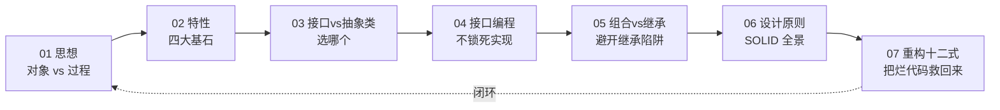
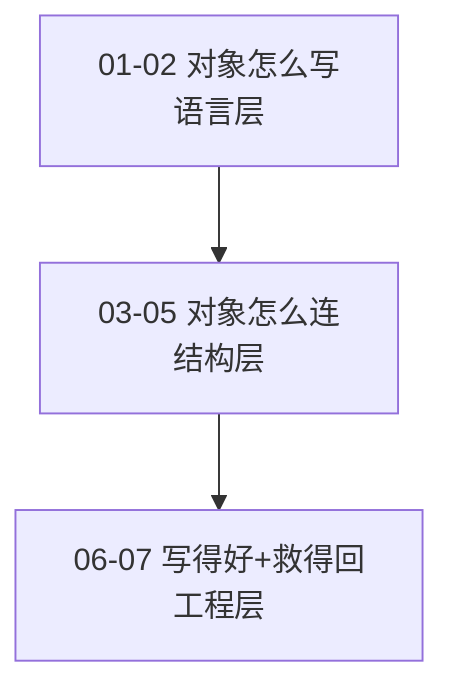

# 面向对象设计

> 一条主线、七篇文章，从对象的本质到工程级的设计原则，再到救活烂代码的重构手法，由浅入深、案例贯穿、Mermaid 图加深理解。

## 阅读路径

## 章节列表

| 章节 | 主题 | 关键案例 | 关键图表 |
|------|------|----------|----------|
| [01.面向对象设计思想](./01.面向对象设计思想.md) | 范式之别 | 订单总价计算 | 网状 vs 线性流程图 |
| [02.面向对象的特性](./02.面向对象的特性.md) | 封装/抽象/继承/多态 | 钱包 Bug 排查 | 四大特性关系图、vtable 内存布局 |
| [03.接口vs抽象类比较](./03.接口vs抽象类比较.md) | 何时选哪个 | 日志器、支付网关 | 决策树、模板方法时序图 |
| [04.接口而非实现编程](./04.接口而非实现编程.md) | 依赖抽象不依赖具体 | 阿里云上云搬迁、多支付渠道 | 三步重构演化图 |
| [05.多用组合和少继承](./05.多用组合和少继承.md) | 继承的陷阱与组合的优雅 | 鸟类继承翻车、绘图程序 | 类爆炸 vs 正交组合 |
| [06.设计原则全景图](./06.设计原则全景图.md) | SOLID + 23 模式 | 串联前 5 篇案例 | SRP/OCP/LSP/ISP/DIP 关系图 |
| [07.重构十二式实战](./07.重构十二式的实战) | 12 个最常用重构手法 | 订单结算长函数救援 | 坏味道地图、重构节奏循环 |

## 写作约定

- **文件名**：5–8 字
- **二级、三级标题**：≤ 9 字
- **每章结构**：案例引入 → 原理拆解 → 代码示例 → Mermaid 图 → 工程取舍 → 与下一章衔接
- **由浅入深**：从一个具体翻车现场出发，先讲 what，再讲 why 与 how，最后给边界与延伸

## 系列三段式

- **01–02**：对象怎么写（思想 + 特性）
- **03–05**：对象怎么连（接口 / 抽象类 / 组合）
- **06–07**：写得好 + 救得回（SOLID + 重构）

## 配套延伸

| 方向 | 推荐 |
|------|------|
| 23 种设计模式 | [设计模式实战](https://github.com/yangchong211/YCDesignBlog) |
| 架构思想 | DDD、整洁架构、六边形架构 |
| 重构进阶 | Martin Fowler《重构》、Kent Beck《实现模式》 |
| 编程进阶网站 | [yccoding.com](https://yccoding.com) |
