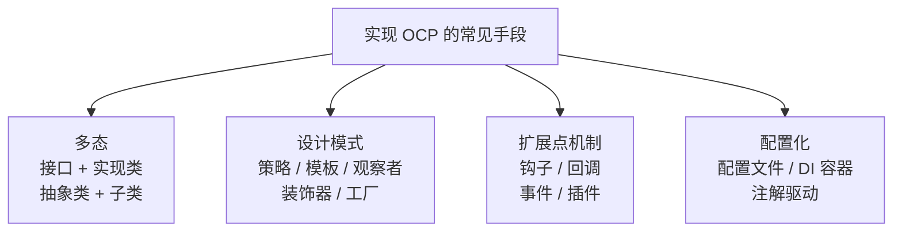
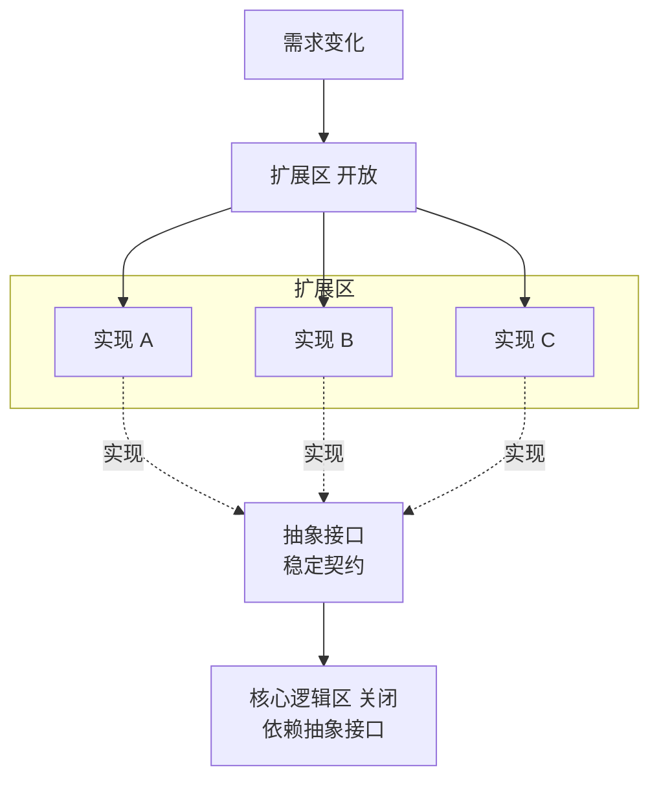

# 03.开闭原则详细介绍

#### 目录介绍
- [1.工作中的一个真实案例](#1工作中的一个真实案例)
- [2.问题思考的分析](#2问题思考的分析)
- [3.如何理解开闭原则](#3如何理解开闭原则)
- [4.开闭原则的背景](#4开闭原则的背景)
- [5.为什么说 OCP 最难学](#5为什么说-ocp-最难学)
- [6.实现开闭原则的方式](#6实现开闭原则的方式)
- [7.画图形案例分析](#7画图形案例分析)
- [8.银行业务案例分析](#8银行业务案例分析)
- [9.OCP 的本质：隔离变化点](#9ocp-的本质隔离变化点)
- [10.OCP 在工业级框架中的体现](#10ocp-在工业级框架中的体现)
- [11.开闭原则优缺点](#11开闭原则优缺点)
- [12.回到开篇的促销折扣案例](#12回到开篇的促销折扣案例)
- [13.本篇收获](#13本篇收获)
- [14.思考题](#14思考题)
- [15.课后作业](#15课后作业)


## 1.工作中的一个真实案例

终端开发在"促销活动 / 运营模块"里几乎一定会遇到下面这段心路历程：

> V1：只有一种折扣 → `price * 0.8`，写在 `OrderPresenter` 里。
> V2：运营要"满 99 减 10"，加一个 `if (total >= 99) total -= 10;`
> V3：要"会员 7 折"，再加一个 `if (isVip) total = total * 0.7;`
> V4：大促期间"满减 + 会员折上折 + 新人券"叠加，又加了一堆嵌套 if-else，还要小心顺序不能反。
> V5：某次紧急上线，把两个 if 的先后顺序写反了，导致**全量用户多扣钱**。

每加一种运营玩法就要**打开**同一段代码改一次，**每一次修改都有机会把以前的逻辑改坏**——这不是业务复杂，而是**代码不能"不改就扩展"**。

上一篇 SRP 解决了"一堆东西塞一个类"的问题；但就算每件事都只塞了一个类，新需求来了还是要"**改那一个类**"。本篇要解决的就是这一步——**开闭原则（OCP）**：对扩展开放、对修改关闭。读完本篇再回头看那堆促销 if-else，你会知道它本来应该长成什么样、下次大促加一种新玩法**只需要"加一个文件，不动任何旧文件"**。


## 2.问题思考的分析

1. 什么叫开闭原则，它的主要用途是什么？
2. 如何做到"对扩展开放、对修改关闭"？结合案例说一下怎么实现？
3. 你平常是如何理解开闭原则的？判断的标准是什么？


## 3.如何理解开闭原则

开闭原则（Open-Closed Principle，OCP）英文定义：

> Software entities (modules, classes, functions, etc.) should be open for extension, but closed for modification.

翻译成中文：**软件实体（模块、类、方法等）应该对扩展开放、对修改关闭**。

更详细一点：**添加一个新功能应该是在已有代码基础上扩展（新增模块/类/方法），而非修改已有代码**。


## 4.开闭原则的背景

在软件的生命周期内，因为变化、升级和维护等原因需要对原有代码进行修改时，可能会把错误引入原本已经测试过的旧代码里，破坏原有系统。因此当软件需要变化时，应该尽量**通过扩展的方式**来实现变化，而不是通过修改已有代码来实现。

现实开发中"只通过继承来升级"只是一个理想愿景，修改原有代码和扩展代码往往是同时存在的。软件开发最不变的就是"变化"本身——产品一直在升级，修改旧代码就会带来引入 Bug 的风险，**答案就是尽量遵守开闭原则**。


## 5.为什么说 OCP 最难学

OCP 是 SOLID 中**最难理解、最难掌握、也最有用**的一条：

- **难理解**：怎样的代码改动算"扩展"？怎样的算"修改"？修改就一定违反 OCP 吗？
- **难掌握**：如何做到"对扩展开放、对修改关闭"？如何在追求扩展性的同时不让代码过于复杂？
- **最有用**：扩展性是代码质量最重要的衡量标准之一。**23 种经典设计模式中，大部分都是为了解决扩展性问题**，遵循的主要就是 OCP。


## 6.实现开闭原则的方式




## 7.画图形案例分析

### 7.1 违反 OCP 的初版

图形绘制程序要支持矩形、圆形、三角形等。初版设计：

```java
public class GraphicEditor {

    public void draw(Shape shape) {
        if (shape.type == 1)       drawRectangle();
        else if (shape.type == 2)  drawCircle();
    }

    public void drawRectangle() { System.out.println("画长方形"); }
    public void drawCircle()    { System.out.println("画圆形"); }

    static class Shape     { int type; }
    static class Rectangle extends Shape { Rectangle() { type = 1; } }
    static class Circle    extends Shape { Circle()    { type = 2; } }
}
```

要增加一种三角形：① 加 `Triangle` 类 ② 加 `drawTriangle()` 方法 ③ 改 `draw()` 加个 `if`——**每增加一种类型就要改 3 处**。这违反了 OCP。

### 7.2 遵循 OCP 的版本

```java
public interface Shape {
    void draw();
}

public class Rectangle implements Shape {
    public void draw() { System.out.println("画矩形"); }
}

public class Circle implements Shape {
    public void draw() { System.out.println("画圆形"); }
}

public class GraphicEditor {
    public void draw(Shape shape) { shape.draw(); }
}
```

各种形状自己规范自己的行为，`GraphicEditor.draw()` 只负责转发。新增三角形时：

```java
public class Triangle implements Shape {
    public void draw() { System.out.println("画三角形"); }
}
```

**`GraphicEditor` 一行都不用动**——这就是 OCP。


## 8.银行业务案例分析

### 8.1 违反 OCP 的初版

银行业务：存钱、取钱、转账。

```java
public class BankBusiness {
    public void operate(int type) {
        if (type == 1)      save();
        else if (type == 2) take();
        else if (type == 3) transfer();
    }
    public void save()     { System.out.println("存钱"); }
    public void take()     { System.out.println("取钱"); }
    public void transfer() { System.out.println("转账"); }
}
```

新增"理财"业务 → 新增方法 → 改 `operate()`。**典型的 OCP 违反**。

### 8.2 遵循 OCP 的版本

```java
public interface Business {
    void operate();
}

public class Save     implements Business { public void operate() { System.out.println("存钱业务"); } }
public class Take     implements Business { public void operate() { System.out.println("取钱业务"); } }
public class Transfer implements Business { public void operate() { System.out.println("转账业务"); } }

public class BankBusiness {
    public void operate(Business business) {
        System.out.println("处理银行业务");
        business.operate();
    }
}
```

新增"理财"：

```java
public class Finance implements Business {
    public void operate() { System.out.println("理财业务"); }
}
```

原有代码一行未改。业务写多了就会发现：**业务增加到 3 个的时候，就该停下来想"怎么写才能让它方便扩展"**。


## 9.OCP 的本质：隔离变化点

### 9.1 "变化点"模型

OCP 的真正含义不是"永远不改代码"，而是**识别变化点，将变化封装在扩展中**。关键是区分：哪些代码是稳定的（关闭修改），哪些是易变的（开放扩展）。



### 9.2 Meyer 的原始 OCP vs Martin 的现代 OCP

OCP 最早由 Bertrand Meyer 在 1988 年的《Object-Oriented Software Construction》中提出，但他的定义与今天的通用理解有重要区别：

| 维度 | Meyer 的 OCP（1988） | Martin 的 OCP（2000s） |
|---|---|---|
| 扩展方式 | 通过**继承**实现 | 通过**抽象 + 多态 + 组合**实现 |
| "关闭"含义 | 发布后模块不再修改源码 | 核心逻辑不因新增功能而改动 |
| 实现手段 | 继承为主 | 接口、策略模式、插件机制 |

> **关键演进**：现代 OCP 更推荐**组合优于继承**。过度继承会让类层次膨胀，应更多使用接口 + 组合。

### 9.3 用策略模式改造折扣系统

```java
// 抽象：折扣策略（稳定契约）
public interface DiscountStrategy {
    double calculate(double price);
    String name();
}

// 实现 1：无折扣
public class NoDiscount implements DiscountStrategy {
    public double calculate(double price) { return price; }
    public String name() { return "无折扣"; }
}

// 实现 2：百分比折扣
public class PercentageDiscount implements DiscountStrategy {
    private final double percent;
    public PercentageDiscount(double percent) { this.percent = percent; }
    public double calculate(double price) { return price * (1 - percent / 100); }
    public String name() { return percent + "% 折扣"; }
}

// 实现 3：满减
public class FullReductionDiscount implements DiscountStrategy {
    private final double threshold, reduction;
    public FullReductionDiscount(double t, double r) { this.threshold = t; this.reduction = r; }
    public double calculate(double price) {
        return price >= threshold ? price - reduction : price;
    }
    public String name() { return "满 " + threshold + " 减 " + reduction; }
}

// 核心逻辑（对修改关闭）
public class OrderCalculator {
    public double calculateTotal(double price, DiscountStrategy discount) {
        double finalPrice = discount.calculate(price);
        System.out.println("原价 " + price + "，策略：" + discount.name() + "，折后 " + finalPrice);
        return finalPrice;
    }
}
```

新增"VIP 七折"策略？加一个文件就行，`OrderCalculator` 毫无感知：

```java
public class VipDiscount implements DiscountStrategy {
    public double calculate(double price) { return price * 0.7; }
    public String name() { return "VIP 七折"; }
}
```


## 10.OCP 在工业级框架中的体现

| 框架/系统 | OCP 体现 | 扩展机制 |
|---|---|---|
| Spring Boot | 不修改框架，通过注解和配置扩展 | `@Bean`、`@Configuration`、`BeanPostProcessor` |
| Gin (Go) | 不修改框架，通过中间件扩展 | `router.Use(middleware)` |
| Webpack | 不修改核心，通过 Plugin/Loader 扩展 | `plugins: [new MyPlugin()]` |
| VSCode | 不修改编辑器，通过插件扩展 | Extension API |
| Linux 内核 | 不修改内核，通过模块扩展 | `insmod / modprobe` |

**结论**：优秀的框架设计本身就是 OCP 的最佳实践——稳定的核心 + 丰富的扩展点，用户通过扩展而非修改来满足需求。


## 11.开闭原则优缺点

### 11.1 优点

1. **可维护性与复用性**：扩展而不改源码，不影响其他模块；
2. **可扩展性**：方便添加新功能、改进现有功能；
3. **可测试性**：降低耦合度，测试更容易——只需测试新增的代码。

### 11.2 缺点

1. **对设计能力要求高**：需要良好的抽象和封装，设计不好反而会让代码更复杂；
2. **可能增加代码量**：扩展会带来更多的类和接口；
3. **可能带来设计上的限制**：引入更多抽象层会限制表达灵活性。


## 12.回到开篇的促销折扣案例

回头看 V1→V5 那段 if-else 进化史：

| 版本 | 本来的改法 | 遵循 OCP 后的改法 |
|---|---|---|
| 加"满减" | 改 `OrderPresenter`，新增 if | 新建 `FullReductionDiscount` 实现 `DiscountStrategy`，注册进去 |
| 加"会员折扣" | 再改 `OrderPresenter`，新增 if | 新建 `VipDiscount`，注册 |
| 加"新人券" | 又改 `OrderPresenter` | 新建 `NewUserCoupon`，注册 |
| 促销叠加 | 在 if-else 里写优先级 | 新建 `CompositeDiscount`，内部按顺序组合策略 |

业务侧的实际效果：**新增一种玩法 = 新建一个文件 + 改一行注册代码**。`OrderPresenter` 自此"关闭修改"，你再也不会因为加新活动而把老活动改坏。

**这正是开闭原则的威力：让稳定的核心和易变的扩展彻底分开**。


## 13.本篇收获

1. **一句话本质**：OCP 不是"永远不改代码"，而是"**识别变化点，把变化封装在扩展中**"——核心逻辑稳定、扩展区开放。
2. **一条实现主路**：抽象接口（稳定契约）+ 具体实现（可增删）+ 依赖注入/注册。策略模式 / 模板方法 / 观察者 / 插件机制都是这条主路的不同姿态。
3. **一条反向约束**：**不是所有代码都值得 OCP**。先有"会频繁变"的证据，再抽扩展点；否则就是过度设计，违反 YAGNI。
4. **一组健康信号**：加功能时手在哪里？如果基本只在"新增文件"上，OCP 良好；如果每次都要回老类里加 `if`，就已经在违反 OCP 了。


## 14.思考题

1. **识别题**：你最近一次加需求改动了几个文件？其中有几个是"新增"、几个是"修改"？修改 vs 新增的比例越高，违反 OCP 越严重。给自己打个分。
2. **辨析题**：如果一个功能只有一种实现、而且未来几乎不会变，还要不要为它抽接口走 OCP？提示：参考 YAGNI 与 Rule of Three。
3. **权衡题**：策略模式能用继承实现，也能用函数（Lambda / `Function<T,R>`）实现。在 Java 8+ 里，你会选哪种？为什么？


## 15.课后作业

在你当前项目里挑一处**你最讨厌的 if-else / switch** 做改造：

1. **找变化点**：把所有 case 列出来，问自己"这几个 case 以后还会再加吗？"。如果会，它就是值得 OCP 化的变化点。
2. **抽抽象**：为这组 case 抽一个接口（或策略契约），给它取一个能说清楚"它约定了什么"的名字。
3. **换实现**：每个 case 写成一个实现类/函数。原先的 if-else 改成"根据 key 从注册表取策略 → 执行"。
4. **加新 case**：再加一个新的业务 case，验证你能**不改老代码**，只新增一个文件就搞定。

做完，再进入下一篇《04.里式替换原则介绍》——一旦开始用"抽象 + 多种实现"，立刻会面对一个新问题：**这些子类真的能互相替换吗？行为一致吗？**


## 16.更多内容推荐

| 模块 | 描述 | 备注 |
|---|---|---|
| GitHub | 多个 YC 系列开源项目，包含 Android 组件库及多个案例 | [GitHub](https://github.com/yangchong211) |
| 博客汇总 | Java、Android、C/C++、网络协议、算法、编程总结 | [YCBlogs](https://github.com/yangchong211/YCBlogs) |
| 设计模式 | 六大设计原则，23 种设计模式，面向对象思想 | [设计模式](https://github.com/yangchong211/YCDesignBlog) |
| Java 进阶 | 数据设计和原理，OOP 核心思想，IO，异常，并发，JVM | [Java 高级](https://github.com/yangchong211/YCJavaBlog) |
| 网络协议 | 网络实际案例，原理分层，Https，请求，故障排查 | [网络协议](https://github.com/yangchong211/YCNetwork) |
| Android | 基础入门，开源库解读，性能优化，Framework，方案设计 | [Android](https://github.com/yangchong211/YCAndroidBlog) |
