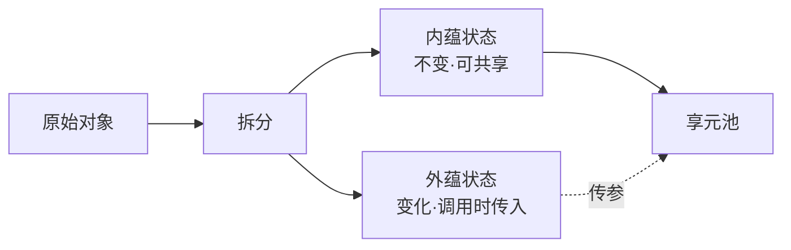
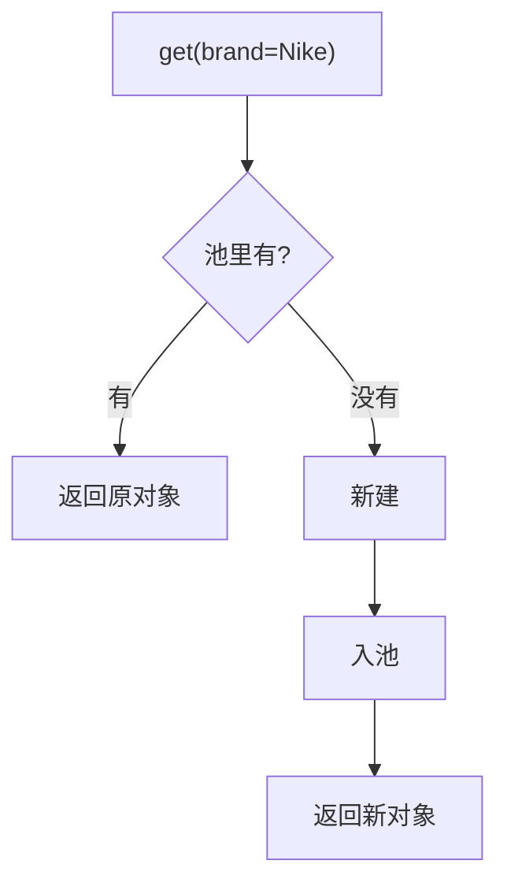
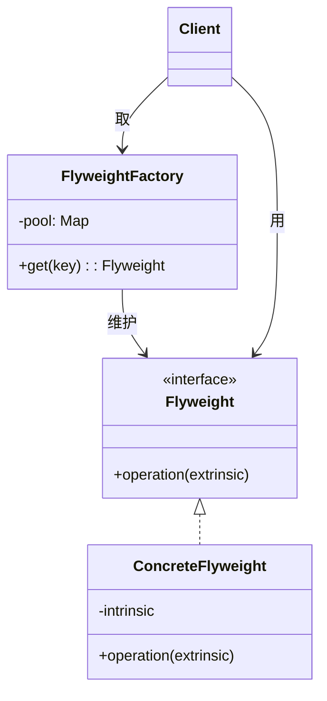
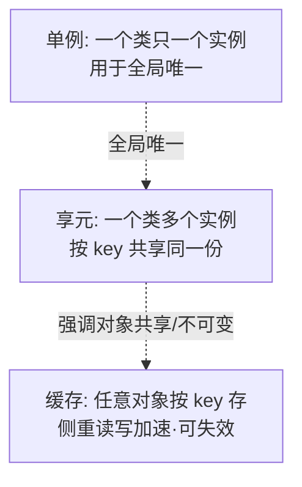

# 12.享元模式设计思想

#### 目录介绍

- 01.享元模式基础介绍
- 02.享元模式原理
- 03.享元模式结构
- 04.享元模式案例
- 05.享元模式分析
- 06.享元模式总结

---

## 引子：电商主线里的它

> 接续主线：在我们的电商系统里，**首页商品瀑布流**一次拉取 500 个商品卡片，每个卡片都包含品牌图标、品类标签、店铺等级图标。如果每张卡片都 new 一份品牌 Logo / 等级图标对象，500 张卡片会瞬间产生几千个**几乎完全相同**的对象，内存暴涨、GC 频繁。
>
> 此时，享元模式登场——**让相同的对象只保留一份，被所有卡片共享**。

它解决一句话：**"大量重复对象 → 共享同一份实例，节省内存。"**

---

## 01.享元模式基础介绍

### 1.1 模式动机

当系统中存在大量**结构相同、内容相同**或**结构相同、内容不同但部分字段相同**的对象时，逐个 new 既浪费内存又拖慢创建。享元模式让这些对象的"共有部分"只保留一份。

### 1.2 模式定义

> 运用共享技术有效地支持大量细粒度对象的复用。被共享的对象称为**享元（Flyweight）**。



### 1.3 关键概念

| 概念 | 含义 | 电商案例 |
|------|------|----------|
| 内蕴状态 | 与上下文无关、可共享 | 品牌图标 URL、品类名、店铺等级图标 |
| 外蕴状态 | 与上下文有关、不可共享 | 商品价格、库存、卡片位置 |
| 享元工厂 | 维护享元池，按 key 取/造 | `BrandIconFactory.get("Nike")` |

### 1.4 何时考虑

- 系统有**大量相似对象**（一般 ≥ 千级）；
- 这些对象的**大部分状态可外移**；
- 创建/销毁开销不可忽略（如图标、字体、棋盘格、SQL 词法 token）。

---

## 02.享元模式原理

### 2.1 朴素实现的问题

```java
// 反例：每张卡片都 new
class ProductCard {
    Image brandIcon = new Image("nike.png");  // 500 张卡片 = 500 份
    Image levelIcon = new Image("gold.png");
    String title;
    double price;
}
```

500 张卡 × 2 张图 = 1000 个 Image 对象，但实际不同的图标可能只有 10 张。

### 2.2 享元改造思路



**关键**：享元对象必须**不可变**（immutable）——一旦被共享，任何修改都会污染所有引用它的地方。

---

## 03.享元模式结构

### 3.1 结构图



### 3.2 角色

- **享元接口（Flyweight）**：定义共享对象的行为；
- **具体享元（ConcreteFlyweight）**：内蕴状态 + `operation`；
- **享元工厂（FlyweightFactory）**：管理对象池；
- **客户端**：负责管理外蕴状态，调用时传入。

---

## 04.享元模式案例

### 4.1 商品卡片图标享元

```java
// 享元：图标，不可变
public final class Icon {
    private final String url;
    private final byte[] data;  // 真正占内存的部分

    Icon(String url, byte[] data) {
        this.url = url;
        this.data = data;
    }
    public void render(int x, int y) {  // x,y 是外蕴
        // 在 (x,y) 位置画
    }
}

// 享元工厂
public class IconFactory {
    private static final Map<String, Icon> POOL = new ConcurrentHashMap<>();

    public static Icon get(String url) {
        return POOL.computeIfAbsent(url,
            u -> new Icon(u, IO.load(u)));
    }
}

// 商品卡片
public class ProductCard {
    Icon brand;  // 享元引用
    Icon level;
    String title;
    double price;
    int x, y;    // 外蕴状态

    void draw() {
        brand.render(x, y);
        level.render(x + 30, y);
    }
}

// 使用
ProductCard c = new ProductCard();
c.brand = IconFactory.get("nike.png");   // 同款 Nike 卡片复用同一个 Icon
c.level = IconFactory.get("gold.png");
```

### 4.2 内存效果

| 卡片数 | 朴素方式 Icon 实例 | 享元方式 Icon 实例 |
|--------|-------------------|-------------------|
| 500 | 1000 | ~10–20 |
| 5000 | 10000 | ~10–20 |

### 4.3 JDK 内置享元

享元在标准库里随处可见，不必自己造轮子：

| 例子 | 享元池 |
|------|--------|
| `Integer.valueOf(127)` | -128~127 缓存池 |
| `String` 字面量 | 字符串常量池 |
| `Boolean.TRUE / FALSE` | 全局两个实例 |
| `Long.valueOf(1L)` | -128~127 缓存池 |

```java
Integer a = 127, b = 127;
System.out.println(a == b);   // true，享元
Integer c = 128, d = 128;
System.out.println(c == d);   // false，超出池
```

> 这也解释了"`Integer == ` 比较为什么有时候是 true 有时候是 false"——享元边界踩坑点。

---

## 05.享元模式分析

### 5.1 优点

- **节省内存**：相同实例只保留一份；
- **创建快**：池里直接拿；
- **天然不可变**：线程安全。

### 5.2 缺点

- **代码复杂度上升**：要拆分内蕴/外蕴，工厂多了一层；
- **共享必须不可变**：一旦可变就是大坑；
- **池本身要管理**：长期运行要考虑过期/清理（弱引用、LRU）。

### 5.3 享元 vs 单例 vs 缓存



| 维度 | 单例 | 享元 | 缓存 |
|------|------|------|------|
| 实例数 | 1 | 多个共享 | 多个，可淘汰 |
| 重点 | 唯一性 | 节省内存 | 加速访问 |
| 是否要不可变 | 否 | **是** | 否 |

### 5.4 模式联动（跟之前的连）

- 与**工厂模式**：享元工厂本质是工厂模式的特化，多了"池查询"一步；
- 与**装饰器模式**：装饰器外层可变、内层享元不变，是常见组合；
- 与**单例**：享元工厂自己经常做成单例。

---

## 06.享元模式总结

### 6.1 一句话记忆

> 享元 = **不可变 + 池化 + 内/外蕴拆分**。

### 6.2 适用环境

- 大量相似对象，能拆出公共内蕴；
- 对内存/创建成本敏感的场景：图标、字体、棋盘、连接、Token、词法元素等。

### 6.3 思考题

我们的电商首页用享元解决了图标问题。再思考一步：**商品 SKU 的属性（颜色/尺码/材质）**，能不能也用享元？这又会和哪个模式联动？（提示：策略 + 工厂）

下一站建议阅读 [13.观察者模式](./13.观察者模式设计思想.md)——结构型告一段落，进入"对象间协作"的行为型世界。
