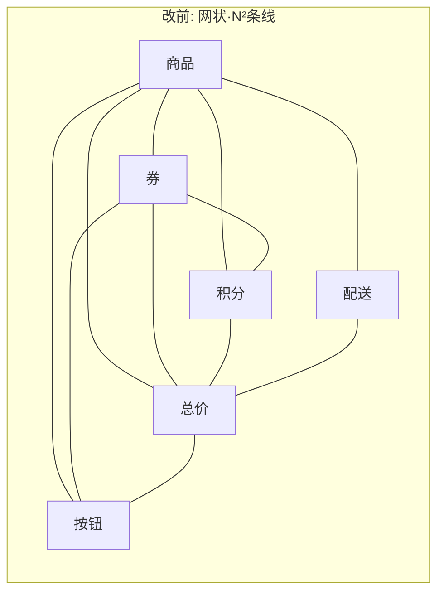
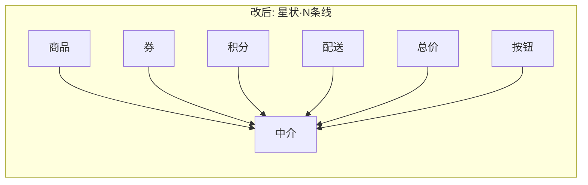
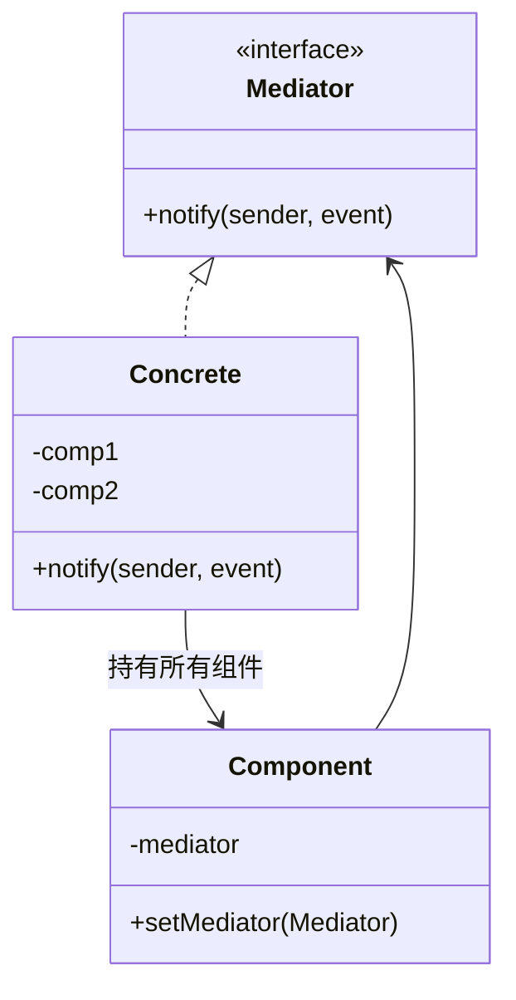
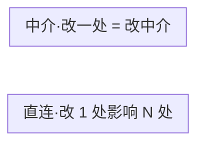

# 21.中介者模式设计思想

#### 目录介绍

- 01.中介者模式基础介绍
- 02.中介者模式原理
- 03.中介者模式结构
- 04.中介者模式案例
- 05.中介者模式分析
- 06.中介者模式总结

---

## 引子：电商主线里的它

> 接续主线：电商**收银页**有这些组件：
>
> - **商品列表**：勾选、改数量
> - **优惠券**：选用/取消
> - **积分抵扣**：拉条调节抵扣
> - **配送方式**：标准/极速
> - **总价区**：实时算总价
> - **下单按钮**：随条件可点/置灰
>
> 任何一个动作，几乎都要联动其他人——商品改数量，要刷新总价、检验券、判断按钮可用性。如果让它们**两两直接调用**，N 个组件就是 N×(N-1) 条线，最后变成"任何一处改动都要改一片"的网状地狱。
>
> 中介者模式：**让大家都不互相喊，统一向"主持人"喊**。

它解决一句话：**"把多对多的网状协作，转成一对多的星型协作。"**

---

## 01.中介者模式基础介绍

### 1.1 模式动机





### 1.2 模式定义

> 用一个中介对象封装一系列对象之间的交互。中介使各对象不需要显式地相互引用，从而使其耦合松散，且可以独立地改变它们之间的交互。

### 1.3 何时考虑

- 一组对象**关系复杂**且耦合明显（典型：复杂表单、对话框）；
- 协作逻辑**会随版本演变**，不希望散落各处；
- 想做一个**业务编排层**，把"谁通知谁"集中管理。

---

## 02.中介者模式原理

### 2.1 朴素方案的问题

```java
// 反例：商品组件直接调券、总价、按钮
public class ItemPanel {
    private CouponPanel coupon;
    private PointsPanel points;
    private TotalPanel total;
    private SubmitButton btn;

    public void onQtyChange() {
        coupon.refresh();
        points.refresh();
        total.recalc();
        btn.refreshState();
    }
}
```

- 商品面板被迫认识所有兄弟；
- 加新组件（如发票），所有面板都要改；
- 单测一个组件，要 mock 一票兄弟。

### 2.2 引入中介

```java
public class ItemPanel {
    private Mediator mediator;
    public void onQtyChange() {
        mediator.notify(this, "qtyChange");
    }
}
```

每个组件**只认识中介**，互不见面。"谁联动谁"全在中介里。

---

## 03.中介者模式结构

### 3.1 结构图



### 3.2 角色

- **Mediator**：中介接口；
- **ConcreteMediator**：业务编排逻辑；
- **Component**：每个组件持有 Mediator，事件向它汇报。

---

## 04.中介者模式案例

### 4.1 收银页中介

```java
public interface Mediator {
    void notify(String event, Object payload);
}

public class CheckoutMediator implements Mediator {
    private ItemPanel    items;
    private CouponPanel  coupon;
    private PointsPanel  points;
    private TotalPanel   total;
    private SubmitButton btn;

    public void notify(String e, Object p) {
        switch (e) {
            case "qtyChange" -> {
                coupon.recheck(items.amount());
                points.recheck(items.amount());
                total.recalc(items.amount(), coupon.discount(), points.deduct());
                btn.setEnabled(canSubmit());
            }
            case "couponSelect" -> {
                points.recheck(items.amount() - coupon.discount());
                total.recalc(...);
                btn.setEnabled(canSubmit());
            }
            // …… 每个事件 → 一组联动
        }
    }

    private boolean canSubmit() {
        return items.notEmpty() && total.amount() > 0;
    }
}
```

每个面板只发事件：

```java
public class ItemPanel {
    private Mediator m;
    public void onQtyChange() { m.notify("qtyChange", null); }
}
```

新增"发票面板"？只在 `CheckoutMediator` 加一段编排，**其他组件零改动**。

### 4.2 中介者 vs 直接调用对比



| 维度 | 直连 | 中介 |
|------|------|------|
| 组件认识谁 | 兄弟全员 | 只认识中介 |
| 加组件成本 | 改 N 个 | 改 1 个中介 |
| 测试 | mock 一片 | mock 中介 |
| 代码集中度 | 业务逻辑散在各处 | 集中在中介 |

### 4.3 真实世界的中介

| 场景 | 中介 |
|------|------|
| MVC 中的 Controller | 模型/视图协调者 |
| Android `Fragment` 间通信 | `ViewModel`/`Activity` |
| 工作流引擎 | 流程编排器 |
| 微服务编排 | 编排器（Orchestrator）模式 |
| 聊天室 | 房间服务（房主/服务端转发） |
| 飞控 | 飞控总线 |

---

## 05.中介者模式分析

### 5.1 优点

- **解耦组件**：N² 关系 → N 关系；
- **集中协作逻辑**：业务规则有家可归；
- **组件可复用**：每个面板单独可在另一页用。

### 5.2 缺点

- **中介容易膨胀成"上帝类"**——如果什么都往里塞，最后变成新的祖传代码；
- 协作逻辑都集中后，**单点修改风险变高**；
- 极简场景下属于过度设计。

> 防止上帝类：**业务一旦超过 ~300 行，按子域拆多个中介**（结算中介、地址中介、发票中介）。

### 5.3 中介 vs 观察者

两者都为解耦，但思路不同：


| 维度 | 中介 | 观察者 |
|------|------|--------|
| 关系 | 多对多变星型 | 一对多 |
| 谁主导 | 中介 | 发布者 |
| 是否知道对方 | 都只认识中介 | 发布者完全不知 |

### 5.4 中介 vs 外观

容易混。看意图：

| 维度 | 中介 | 外观 |
|------|------|------|
| 目的 | 减少**对象间**耦合 | 减少**子系统使用**复杂度 |
| 内部对象是否互感 | 不感知 | 感知（只是外部不感知）|
| 内部是否需要协作 | 是 | 不一定 |

### 5.5 模式联动

- **与命令模式**：中介里把每条联动包装成命令 → 可记录/回放；
- **与观察者**：中介内部用观察者实现事件分发 → 解耦"事件 → 处理"；
- **与状态模式**：中介常持有"页面状态机"，按状态分发事件。

---

## 06.中介者模式总结

### 6.1 一句话记忆

> 中介者 = **网状协作星型化的协调者**。

### 6.2 适用环境

复杂表单/收银页、对话框、工作流编排、聊天室、组件间高频联动场景。

### 6.3 思考题

收银页中介运行良好。但 PM 提出新需求：**用户每次操作要发埋点**——埋点该写在中介里，还是各组件里？为什么？（提示：开闭原则 + AOP 思路）

下一站建议阅读 [22.访问者模式](./22.访问者模式设计思想.md)——经典而冷门的"双分派"模式，看看它到底解决了什么独特问题。
