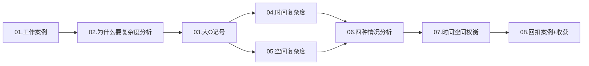
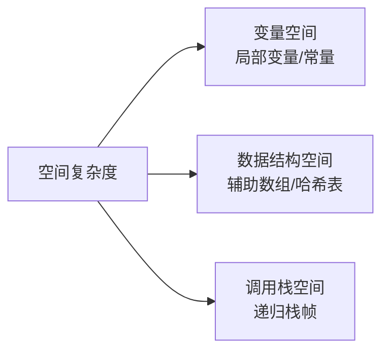

# 01.数据结构算法指导

> 本篇是数据结构与算法专栏的起点。从一次线上事故出发，系统建立复杂度分析的直觉与方法论，为后续所有数据结构的选型与性能分析打下地基。

---

## 01. 从一个工作案例说起

### 1.1 一次被 "O(N²)" 坑惨的线上事故

某电商后台里，我接到一个看起来无害的需求："商品列表页要做关键词高亮。"同事交接的代码是这样的：

```java
// 关键词高亮：看起来合情合理
String highlight(List<String> titles, String keyword) {
    String html = "";
    for (String t : titles) {
        html += t.replace(keyword, "<b>" + keyword + "</b>") + "\n";
    }
    return html;
}
```

灰度时看不出问题，预发一切 OK。全量那天，SKU 从 200 涨到 5 万，接口 P99 从 30ms 飙到 **12s**，下游超时雪崩。

事后复盘只改了一行——`String html = ""` 换成 `StringBuilder sb = new StringBuilder()`，接口恢复到 40ms。

**为什么一个看似 O(N) 的循环，实际运行出 O(N²) 的代价？** 我当时没答上来。直到把时间复杂度的定义、均摊分析、空间权衡这三块打通，才真正明白：**不是代码写错了，是对复杂度没有感觉**。

### 1.2 本篇目标

学完本篇，你将能够：

- 说清 "大 O 记号" 的数学含义，而不只是背口诀
- 判断任意一段代码的时间/空间复杂度，识别隐藏陷阱（字符串拼接、`contains` 嵌套、递归栈）
- 区分最好/最坏/平均/均摊四种复杂度，知道什么时候用哪一种
- 在时间与空间冲突时，做出有理有据的工程取舍

### 1.3 本篇结构导航



---

## 02. 为什么要复杂度分析

### 2.1 事后统计法的局限

最直觉的做法是"跑一遍看耗时"，业界叫**事后统计法**。它有两个致命短板：

1. 强依赖环境：换台机器、换个 JDK 版本，结论就变
2. 强依赖数据规模：小数据插入排序反而比快排快

| 评估方式 | 事后统计法 | 复杂度分析 |
|---------|-----------|-----------|
| 是否需要运行 | 需要编码 + 运行 | 纸上推导即可 |
| 是否依赖硬件 | 强依赖 | 无关 |
| 不同规模的结论 | 可能完全不同 | 描述增长趋势，适用所有规模 |
| 适用阶段 | 开发完成后 | 设计阶段即可评估 |

### 2.2 复杂度分析的价值

```
你写了个排序算法，测试 1 万条数据用了 50ms，看起来不错。
但如果它是 O(N²)，复杂度分析能告诉你：
  10 万条 → 5 秒
  100 万条 → 500 秒（8 分钟）
  1000 万条 → 50000 秒（14 小时）

没有复杂度分析，你只知道"现在够快"；有了它，你能预测"未来会不会崩"。
```

### 2.3 对数与指数的直觉

对数的核心是"每一步砍掉一半"：

- 二分查找：100 万条数据 → `log₂(10⁶) ≈ 20` 次比较
- 平衡 BST：100 万个节点 → 最多 20 层
- 归并排序：每轮合并减半 → `log₂N` 轮

**底数不影响复杂度等级**：`log₂N = log₃N × 1.585`，只差常数倍。所以统一写 `O(log N)`，不指定底数。

反之，指数 `2^N` 增长极其恐怖——`N=60` 时，每步 1ns 也要跑 36 年。**把指数级优化成多项式级甚至对数级**，就是算法设计的核心目标。

| 数学关系 | 典型场景 | N=10⁶ 时量级 |
|---------|---------|-------------|
| `log N` | 二分查找 / 平衡树 | ~20 |
| `N` | 线性扫描 | 10⁶ |
| `N log N` | 归并 / 快排 | ~2×10⁷ |
| `N²` | 冒泡 / 朴素两两比较 | 10¹² |
| `2^N` | 子集枚举 | 天文数字 |

---

## 03. 大 O 记号

### 3.1 从两个小例子说起

```c
// 案例 1：1 到 n 的累加
int sum(int n) {
    int s = 0;
    for (int i = 1; i <= n; i++) s += i;
    return s;
}
// 总执行次数：2 + 2n → T(n) = O(n)

// 案例 2：乘法表
int mul(int n) {
    int s = 0;
    for (int i = 1; i <= n; i++)
        for (int j = 1; j <= n; j++) s += i * j;
    return s;
}
// 总执行次数：3 + 2n + 2n² → T(n) = O(n²)
```

### 3.2 提炼三条实用规则

```
规则1：只保留最高阶项
  T(n) = 3n² + 5n + 100  →  O(n²)

规则2：去掉常数系数
  T(n) = 100n  →  O(n)

规则3：多段代码取最大
  O(n²) + O(n)  →  O(n²)
```

### 3.3 为什么可以忽略低阶项？

以 `f(n) = 3n² + 5n + 100` 为例：

- `n = 10`：低阶项占比 33%
- `n = 100`：低阶项占比 2%
- `n = 10⁴`：低阶项占比 0.002%

规模一大，低阶项和常数的影响趋近于零——这就是大 O 只关心"主导项"的数学依据。

### 3.4 渐近符号体系

工程中 99% 用大 O，但严谨表达还有另外几个：

| 符号 | 含义 | 通俗理解 |
|------|------|---------|
| `O(f(n))` | 上界 | 最坏也不会比 f(n) 差 |
| `Ω(f(n))` | 下界 | 最好也不会比 f(n) 好 |
| `Θ(f(n))` | 紧确界 | 刚好就是这个量级 |

---

## 04. 时间复杂度

### 4.1 三条分析法则

**法则 1——关注执行最多的那段**：

```kotlin
fun sum(arr: IntArray): Int {
    var total = 0              // O(1)
    for (x in arr) total += x  // O(n) ← 取它
    return total               // O(1)
}
// → O(n)
```

**法则 2——加法：取最大量级**：多段串行代码的总复杂度 = 量级最大的那段。

**法则 3——乘法：嵌套相乘**：

```c
for (int i = 0; i < n; i++)      // O(n)
    for (int j = 0; j < n; j++)  // O(n)
        op();                    // O(1)
// → O(n²)
```

### 4.2 常见量级对照

| 复杂度 | 代表算法 | N=10⁶ 的操作数 |
|-------|---------|---------------|
| `O(1)` | 数组访问 / 哈希查找 | 1 |
| `O(log N)` | 二分查找 / 平衡树 | 20 |
| `O(N)` | 遍历 / 线性查找 | 10⁶ |
| `O(N log N)` | 归并 / 快排 / 堆排 | 2×10⁷ |
| `O(N²)` | 冒泡 / 选择排序 | 10¹² |
| `O(2^N)` | 暴力子集枚举 | 爆炸 |
| `O(N!)` | 全排列 / TSP 暴力 | 无法计算 |

### 4.3 典型示例（精简版）

```python
# O(1) —— 无论 n 多大，操作数固定
def first(arr): return arr[0] if arr else None

# O(log n) —— 步长翻倍
def bin_step(n):
    i = 1
    while i < n: i *= 2

# O(n) —— 单层循环
def max_of(arr):
    m = arr[0]
    for x in arr: m = max(m, x)
    return m

# O(n²) —— 嵌套循环
def bubble(arr):
    n = len(arr)
    for i in range(n):
        for j in range(n - i - 1):
            if arr[j] > arr[j+1]: arr[j], arr[j+1] = arr[j+1], arr[j]

# O(n log n) —— 归并排序（核心代码）
def merge_sort(a):
    if len(a) <= 1: return a
    m = len(a) // 2
    return merge(merge_sort(a[:m]), merge_sort(a[m:]))
```

### 4.4 非标准循环的套路

```python
# 步长翻倍 → O(log n)
i = 1
while i < n: i *= 2

# 步长递增 → O(√n)
i, s = 0, 0
while s < n:
    i += 1; s += i
# s = i(i+1)/2，s ≥ n 时 i ≈ √(2n)
```

### 4.5 隐藏的复杂度陷阱

**陷阱 1：字符串拼接**（开篇事故的本质）

```java
// 看似 O(n)，实际 O(n²)
String s = "";
for (int i = 0; i < n; i++) s += "a";
// 第 i 次拼接要复制 i 个字符，总和 = n(n+1)/2

// 正解
StringBuilder sb = new StringBuilder();
for (int i = 0; i < n; i++) sb.append('a');
```

**陷阱 2：循环里套 `contains`**

```java
// 看似 O(n)，实际 O(n²)，因为 ArrayList.contains 是 O(n)
for (int x : arr) if (!list.contains(x)) list.add(x);

// 正解：HashSet 的 contains 是 O(1)
Set<Integer> set = new HashSet<>();
for (int x : arr) set.add(x);
```

**陷阱 3：参数是两个独立规模**

```c
for (int i = 0; i < m; i++) f();
for (int j = 0; j < n; j++) g();
// T = O(m + n)，不能简化成 O(max(m,n))，
// 因为无法假设 m、n 谁大
```

### 4.6 快速判断复杂度是否"可接受"

现代 CPU 每秒约 10⁸~10⁹ 次简单操作。**面试/工程速查表**：

```
输入规模          可接受复杂度
n ≤ 10           → O(n!)
n ≤ 20           → O(2^n)
n ≤ 500          → O(n³)
n ≤ 5000         → O(n²)
n ≤ 10⁶          → O(n log n)
n ≤ 10⁸          → O(n)
n > 10⁸          → O(log n) 或 O(1)
```

---

## 05. 空间复杂度

### 5.1 空间复杂度到底算什么

空间复杂度只算**额外分配**的空间，不算输入本身。来源有三：



### 5.2 常见量级示例

```java
// O(1) —— 只用常数个变量
int sum(int[] arr) {
    int t = 0;
    for (int x : arr) t += x;
    return t;
}

// O(N) —— 新开与输入同规模的数组
int[] copy(int[] arr) {
    int[] r = new int[arr.length];
    for (int i = 0; i < arr.length; i++) r[i] = arr[i];
    return r;
}

// O(N) —— 递归栈深度 = N
int factorial(int n) {
    return n <= 1 ? 1 : n * factorial(n - 1);
}

// O(N²) —— 二维数组
int[][] matrix(int n) { return new int[n][n]; }

// O(2^N) —— 枚举所有子集
List<List<Integer>> subsets(int[] nums) { /* 2^n 个结果 */ }
```

### 5.3 递归为什么特别容易吃空间

栈区通常只有 1~8 MB。深度递归每层都压栈（返回地址 + 局部变量），一不小心就 **StackOverflow**。

```c
// 每层压栈，同时存在 N 个栈帧 → O(N) 空间
int rec(int n) {
    if (n <= 1) return 1;
    return rec(n - 1) + 1;
}
```

典型优化——**尾递归化循环**（多数语言 JIT 不会自动做，需手写）：

```c
// 快排最坏空间从 O(N) 降到 O(log N)：总是先递归较小的一半
void qsort(int a[], int lo, int hi) {
    while (lo < hi) {
        int p = partition(a, lo, hi);
        if (p - lo < hi - p) { qsort(a, lo, p - 1); lo = p + 1; }
        else                 { qsort(a, p + 1, hi); hi = p - 1; }
    }
}
```

### 5.4 `O(log N)` 空间都出现在哪

- 二分查找的递归版（迭代版是 O(1)）
- 平衡快排的递归栈（平均）
- 整数转字符串：一个整数 N 有 `log₁₀N` 位

---

## 06. 最好 / 最坏 / 平均 / 均摊

### 6.1 四个概念一张表

| 类型 | 定义 | 典型用途 |
|------|------|---------|
| 最好情况 | 最理想输入下的代价 | 参考意义不大 |
| 最坏情况 | 最糟糕输入下的代价 | 性能保证 / SLA |
| 平均情况 | 输入按概率分布加权平均 | 期望性能 |
| 均摊情况 | 一串操作的总代价 / 次数 | 动态数组 / 伸展树 |

### 6.2 用线性查找看前三种

```c
int find(int a[], int n, int x) {
    for (int i = 0; i < n; i++)
        if (a[i] == x) return i;
    return -1;
}
```

- 最好：`x` 在第 0 位 → `O(1)`
- 最坏：`x` 不存在 → `O(n)`
- 平均：假设 `x` 在数组中的概率 1/2，且位置等概率分布，推出约 `(3n+1)/4` 次比较 → `O(n)`

### 6.3 均摊分析：动态数组是典型

```
ArrayList 添加元素（初始容量 4）：
add  1~4  → O(1)
add  5    → 扩容到 8，拷贝 4 个 → O(4)
add  6~8  → O(1)
add  9    → 扩容到 16，拷贝 8 个 → O(8)
...

总代价 = n + (4 + 8 + 16 + ...) ≈ n + 2n = 3n
均摊到每次 = 3n / n = O(1)
```

**均摊 vs 平均**：均摊不涉及概率，只看"操作序列的总代价除以操作数"；平均要假设输入的概率分布。

### 6.4 随机化让"最坏"几乎不出现

快排最坏是 `O(n²)`（输入已排好序时），但**随机选 pivot** 后，对任意输入的**期望**比较次数都是 `2n ln n ≈ 1.39 n log₂ n`——这是对输入无假设的"期望复杂度"。

```python
def rand_quicksort(a, lo, hi):
    if lo >= hi: return
    r = random.randint(lo, hi)
    a[r], a[hi] = a[hi], a[r]  # 随机化
    p = partition(a, lo, hi)
    rand_quicksort(a, lo, p - 1)
    rand_quicksort(a, p + 1, hi)
```

---

## 07. 时间与空间的权衡

### 7.1 时空权衡的本质

```
    高 │ ● 暴力（省空间，慢）
 时间  │
 复杂度 │         ● 平衡方案
       │
    低 │                  ● 空间换时间（费空间，快）
       └──────────────────────────→
        低       空间复杂度       高
```

大多数场景下两者不可兼得——沿曲线选一个对当前业务最优的平衡点。

### 7.2 空间换时间三大经典

**①  哈希表代替双重循环**

```python
# O(N²) 空间 O(1)
def two_sum_brute(nums, t):
    for i in range(len(nums)):
        for j in range(i+1, len(nums)):
            if nums[i] + nums[j] == t: return [i, j]

# O(N) 空间 O(N)
def two_sum_hash(nums, t):
    seen = {}
    for i, x in enumerate(nums):
        if t - x in seen: return [seen[t-x], i]
        seen[x] = i
```

**②  记忆化让斐波那契从 `O(2^N)` 降到 `O(N)`**

```java
int[] memo;
int fib(int n) {
    if (n <= 1) return n;
    if (memo[n] != 0) return memo[n];
    return memo[n] = fib(n-1) + fib(n-2);
}
```

**③  数据库索引**：B+ 树索引多占 10%~30% 磁盘，把等值查询从 `O(N)` 降到 `O(log N)`。

### 7.3 时间换空间的经典

- **压缩算法**：CPU 时间换更小的文件 / 更短的传输
- **外部排序**：磁盘 IO 换有限内存下对 TB 数据排序
- **布隆过滤器**：10 亿 URL 去重，HashSet 要 80GB，布隆只要 1.2GB（代价是 1% 误判率）

### 7.4 三步决策框架

```
Step 1: 识别瓶颈
  ├── CPU 密集（加解密/编码） → 时间是瓶颈
  ├── IO 密集（DB/网络）     → 延迟是瓶颈
  └── 内存密集（嵌入式/移动） → 空间是瓶颈

Step 2: 评估约束
  └── 响应时间？内存上限？规模增长趋势？

Step 3: 选策略
  ├── 瓶颈在时间 + 内存充足 → 空间换时间（缓存/预计算）
  ├── 瓶颈在空间 + 时间宽裕 → 时间换空间（流式/压缩）
  └── 两头都紧 → 换算法（O(N²) → O(N log N)）
```

---

## 08. 本篇收获与案例回扣

### 8.1 回到开篇那个线上事故

还记得第 1 节那段 `html += ...` 的代码吗？现在我们能给出严谨的解释了：

- Java 的 `String` 是不可变对象，`html += t` 实际是 `html = new String(html + t)`
- 第 `i` 次拼接需要复制已有的 `i-1` 段 + 新的一段，复制代价 `O(i)`
- 总代价 `1 + 2 + ... + n = n(n+1)/2 = O(n²)`
- **5 万条 SKU 对应 25 亿次字符复制**——这就是 P99 从 30ms 飙到 12s 的元凶

`StringBuilder` 用动态数组实现，采用的正是第 6.3 节的**均摊分析**：每次 `append` 均摊 `O(1)`，全程 `O(n)`。一个常识层面的改动背后，是完整的复杂度与均摊分析理论在撑。

### 8.2 本篇核心收获

学完本篇你应该带走这七个锚点：

1. **大 O 只看趋势**：保留最高阶，丢弃常数与低阶
2. **循环决定时间**：嵌套乘，串行取最大，循环变量非线性变化要单独分析
3. **三大陷阱**：字符串拼接、循环内 `contains`、两个独立规模 `m+n`
4. **递归深度 = 空间**：注意栈溢出，必要时尾递归化循环
5. **四种复杂度用在哪**：SLA 看最坏，日常看平均，动态扩容看均摊
6. **随机化打散最坏**：把 `O(n²)` 的最坏出现概率压到接近 0
7. **时空权衡有框架**：识别瓶颈 → 评估约束 → 选策略

---

## 09. 思考题

> 建议先独立思考再查资料。

1. **基础理解**：一段代码先 `O(N)` 循环，再 `O(N²)` 嵌套循环。整体复杂度为何是 `O(N²)` 而不是 `O(N + N²)`？
2. **陷阱辨析**：下面这段代码的时间复杂度？
   ```java
   for (int i = 1; i < n; i = i * 2) {
       for (int j = 0; j < i; j++) { /* O(1) */ }
   }
   ```
   提示：内层总次数 = `1 + 2 + 4 + ... + 2^k`，k ≈ log₂n。
3. **均摊进阶**：如果 ArrayList 的扩容倍数从 1.5 改成 1.1，均摊复杂度还是 `O(1)` 吗？从 1.5 改成 2 呢？写出定量推导。
4. **空间换时间的边界**：布隆过滤器误判率公式 `(1 - e^(-kn/m))^k`，最优哈希函数个数 `k = (m/n) ln 2`。如果要把 10 亿 URL 的误判率从 1% 降到 0.01%，需要的位数组大约翻几倍？
5. **开放思考**：你见过哪些"理论复杂度很优但实际性能很差"的情况？（提示：缓存局部性、内存分配、分支预测、GC）

---

## 10. 课后作业

> 动手写代码，才能真正建立复杂度直觉。

**作业 1（必做）——识别陷阱**

拿到下面这段生产代码，指出其真实时间复杂度，并给出一个最小改动的优化版，做前后对比基准测试（至少 N = 1000/10000/100000 三组数据）：

```java
List<String> dedup(List<String> in) {
    List<String> out = new ArrayList<>();
    for (String s : in) if (!out.contains(s)) out.add(s);
    return out;
}
```

**作业 2（必做）——手写均摊验证**

用任意语言实现一个动态数组（支持 `add` / `get`），扩容倍数可配置。在倍数分别为 `1.1` / `1.5` / `2` / `3` 时，插入 100 万个元素，统计：

- 总的拷贝字节数
- 每次 `add` 的平均耗时
- 内存峰值

思考：倍数越大越好吗？为什么 Go 的 slice 用 `2x`，Java 的 ArrayList 用 `1.5x`？

**作业 3（进阶）——时空权衡实战**

给定一个有 1000 万条记录的用户表（字段：`userId, phone`），需要支持：

1. 根据手机号查 userId
2. 判断某个手机号是否存在（允许 0.1% 误判）

请分别设计并实现：

- 方案 A：纯 `HashMap`（空间优先）
- 方案 B：布隆过滤器前置 + DB 回查（空间最省）
- 方案 C：内存 + 磁盘分层（折中）

给出三个方案的内存占用、QPS、P99 对比表，并解释在什么场景下选哪个。

