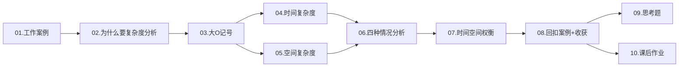
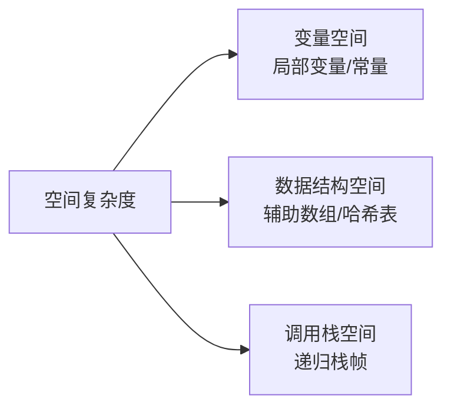

# 01.数据结构算法指导

> 本篇是数据结构与算法专栏的起点。从一次线上事故出发，系统建立复杂度分析的直觉与方法论，为后续所有数据结构的选型与性能分析打下地基。

---

## 目录指引与导读

> 阅读建议：先扫一遍二级目录建立全景，再逐节展开三级目录精读。每节末尾有"小结"段，可快速回顾。

- [01. 从工作案例说起](#01-从工作案例说起)
  - [1.1 线上事故复盘](#11-线上事故复盘)
  - [1.2 本篇学习目标](#12-本篇学习目标)
  - [1.3 全文结构导航](#13-全文结构导航)
- [02. 复杂度分析价值](#02-复杂度分析价值)
  - [2.1 事后统计法局限](#21-事后统计法局限)
  - [2.2 复杂度分析价值](#22-复杂度分析价值)
  - [2.3 对数指数的直觉](#23-对数指数的直觉)
- [03. 大O记号详解](#03-大o记号详解)
  - [3.1 两个入门小例子](#31-两个入门小例子)
  - [3.2 三条实用规则](#32-三条实用规则)
  - [3.3 忽略低阶项原理](#33-忽略低阶项原理)
  - [3.4 渐近符号的体系](#34-渐近符号的体系)
- [04. 时间复杂度分析](#04-时间复杂度分析)
  - [4.1 三条分析法则](#41-三条分析法则)
  - [4.2 常见量级对照](#42-常见量级对照)
  - [4.3 典型示例代码](#43-典型示例代码)
  - [4.4 非标准循环套路](#44-非标准循环套路)
  - [4.5 隐藏复杂度陷阱](#45-隐藏复杂度陷阱)
  - [4.6 复杂度可接受性](#46-复杂度可接受性)
- [05. 空间复杂度分析](#05-空间复杂度分析)
  - [5.1 空间复杂度组成](#51-空间复杂度组成)
  - [5.2 常见量级示例](#52-常见量级示例)
  - [5.3 递归吃空间原理](#53-递归吃空间原理)
  - [5.4 对数空间的来源](#54-对数空间的来源)
- [06. 四种复杂度情况](#06-四种复杂度情况)
  - [6.1 概念汇总一张表](#61-概念汇总一张表)
  - [6.2 线性查找四视角](#62-线性查找四视角)
  - [6.3 动态数组均摊分析](#63-动态数组均摊分析)
  - [6.4 随机化打散最坏](#64-随机化打散最坏)
- [07. 时间空间的权衡](#07-时间空间的权衡)
  - [7.1 时空权衡的本质](#71-时空权衡的本质)
  - [7.2 空间换时间经典](#72-空间换时间经典)
  - [7.3 时间换空间经典](#73-时间换空间经典)
  - [7.4 三步决策框架](#74-三步决策框架)
- [08. 案例回扣与收获](#08-案例回扣与收获)
  - [8.1 回扣开篇事故](#81-回扣开篇事故)
  - [8.2 七个核心锚点](#82-七个核心锚点)
- [09. 思考题深度练](#09-思考题深度练)
- [10. 课后作业实战](#10-课后作业实战)

---

## 01. 从工作案例说起

### 1.1 线上事故复盘

某电商后台里，我接到一个看起来无害的需求："商品列表页要做关键词高亮。"同事交接的代码是这样的：

```java
// 关键词高亮：看起来合情合理
public class HighlightService {
    public String highlight(List<String> titles, String keyword) {
        String html = "";
        for (String t : titles) {
            html += t.replace(keyword, "<b>" + keyword + "</b>") + "\n";
        }
        return html;
    }
}
```

灰度时看不出问题，预发一切 OK。全量那天，SKU 从 200 涨到 5 万，接口 P99 从 30ms 飙到 **12s**，下游超时雪崩。

事后复盘只改了一行——`String html = ""` 换成 `StringBuilder sb = new StringBuilder()`，接口恢复到 40ms。

**为什么一个看似 O(N) 的循环，实际运行出 O(N²) 的代价？** 我当时没答上来。直到把时间复杂度的定义、均摊分析、空间权衡这三块打通，才真正明白：**不是代码写错了，是对复杂度没有感觉**。

> **延伸思考**：这个案例的痛点不是单一算法错误，而是"语言抽象层"和"内存模型层"之间的认知断层。Java 的 `String` 是不可变（immutable），`+=` 看起来是赋值，底层实际是"分配新内存 → 复制旧内容 → 复制新内容 → 释放旧内存"。这种**抽象泄漏（leaky abstraction）**正是高级程序员和初级程序员之间的最大鸿沟之一。

### 1.2 本篇学习目标

学完本篇，你将能够：

- 说清"大 O 记号"的数学含义，而不只是背口诀；
- 判断任意一段代码的时间/空间复杂度，识别隐藏陷阱（字符串拼接、`contains` 嵌套、递归栈）；
- 区分最好/最坏/平均/均摊四种复杂度，知道什么时候用哪一种；
- 在时间与空间冲突时，做出有理有据的工程取舍；
- 建立"性能预测"的工程能力——给定输入规模，能口算出最坏耗时是否可接受。

### 1.3 全文结构导航



---

## 02. 复杂度分析价值

### 2.1 事后统计法局限

最直觉的做法是"跑一遍看耗时"，业界叫**事后统计法**。它有两个致命短板：

1. **强依赖环境**：换台机器、换个 JVM 版本，结论就变；
2. **强依赖数据规模**：小数据插入排序反而比快排快。

| 评估方式 | 事后统计法 | 复杂度分析 |
|---------|-----------|-----------|
| 是否需要运行 | 需要编码 + 运行 | 纸上推导即可 |
| 是否依赖硬件 | 强依赖 | 无关 |
| 不同规模的结论 | 可能完全不同 | 描述增长趋势，适用所有规模 |
| 适用阶段 | 开发完成后 | 设计阶段即可评估 |
| 误差来源 | GC、JIT、缓存预热 | 无 |

> **底层原因**：现代 CPU 引入了三级缓存、分支预测、乱序执行、SIMD 指令等优化，使得"操作次数 × 单次耗时"这种朴素估算严重失真。两个完全相同复杂度的算法，可能因为内存访问模式不同（顺序 vs 随机）而产生 10 倍以上的实际性能差距——但这些都不影响渐近复杂度的相对优劣判断，这正是大 O 的价值所在。

### 2.2 复杂度分析价值

```
你写了个排序算法，测试 1 万条数据用了 50ms，看起来不错。
但如果它是 O(N²)，复杂度分析能告诉你：
  10 万条 → 5 秒
  100 万条 → 500 秒（8 分钟）
  1000 万条 → 50000 秒（14 小时）

没有复杂度分析，你只知道"现在够快"；有了它，你能预测"未来会不会崩"。
```

这就是为什么 BAT 的系统设计面试上来就问"你这方案能撑多大流量"——本质考的就是复杂度建模能力。

> **进一步**：复杂度分析还能指导**容量规划**。当业务方告诉你"明年用户翻 10 倍"，你能立刻判断：
>
> - 如果接口里有 O(N²) 操作，那就是 100 倍劣化，必须重构；
> - 如果是 O(N log N)，约 13 倍，加机器能扛；
> - 如果是 O(log N)，几乎没影响，原架构稳。
>
> **没有复杂度感觉的程序员，做不了架构师**。

### 2.3 对数指数的直觉

对数的核心是"每一步砍掉一半"：

- 二分查找：100 万条数据 → `log₂(10⁶) ≈ 20` 次比较；
- 平衡 BST：100 万个节点 → 最多 20 层；
- 归并排序：每轮合并减半 → `log₂N` 轮。

**底数不影响复杂度等级**：`log₂N = log₃N × 1.585`，只差常数倍。所以统一写 `O(log N)`，不指定底数。

反之，指数 `2^N` 增长极其恐怖——`N=60` 时，每步 1ns 也要跑 36 年。**把指数级优化成多项式级甚至对数级**，就是算法设计的核心目标。

| 数学关系 | 典型场景 | N=10⁶ 时量级 | 对应耗时（每步1ns） |
|---------|---------|-------------|------------------|
| `log N` | 二分查找 / 平衡树 | ~20 | 20ns |
| `N` | 线性扫描 | 10⁶ | 1ms |
| `N log N` | 归并 / 快排 | ~2×10⁷ | 20ms |
| `N²` | 冒泡 / 朴素两两比较 | 10¹² | 16分钟 |
| `2^N` | 子集枚举（注意 N 取小值） | 当 N=60 已天文 | 36年 |

> **直觉构建技巧**：背下来一个锚点——"现代 CPU 1 秒可以做约 `10⁸` 次简单整型操作"。所有复杂度估算都从这个锚点推导。例如要解 `N=10⁵` 的题目，`O(N²)` 是 `10¹⁰`，约 100 秒，超时；`O(N log N)` 是 `10⁵ × 17 ≈ 2×10⁶`，约 20ms，通过。

---

## 03. 大O记号详解

### 3.1 两个入门小例子

```java
// 案例 1：1 到 n 的累加
class Sample1 {
    static int sum(int n) {
        int s = 0;                          // 1 次
        for (int i = 1; i <= n; i++) s += i; // 2n 次
        return s;                           // 1 次
    }
    // 总执行次数：2 + 2n → T(n) = O(n)
}

// 案例 2：乘法表
class Sample2 {
    static int mul(int n) {
        int s = 0;                                // 1 次
        for (int i = 1; i <= n; i++)              // n 次
            for (int j = 1; j <= n; j++)          // n² 次
                s += i * j;                       // n² 次
        return s;
    }
    // 总执行次数：3 + 2n + 2n² → T(n) = O(n²)
}
```

> **关键观察**：哪怕你把"加法、乘法、赋值"三种操作分别按真实 CPU 周期计费（约 1、3、1 周期），最终的复杂度结论一模一样。**这就是大 O 抹掉常数的妙处——让我们能跨越机器、跨越实现细节，专注算法本身的增长趋势。**

### 3.2 三条实用规则

```
规则 1：只保留最高阶项
  T(n) = 3n² + 5n + 100  →  O(n²)

规则 2：去掉常数系数
  T(n) = 100n  →  O(n)

规则 3：多段代码取最大
  O(n²) + O(n)  →  O(n²)
```

这三条是日常分析的"三板斧"，掌握后 90% 的代码可以心算出复杂度。

> **数学严谨化**：大 O 的正式定义是 `T(n) = O(f(n))` 当且仅当存在常数 `c > 0` 和 `n₀ ≥ 0`，使得对所有 `n ≥ n₀`，都有 `T(n) ≤ c·f(n)`。换言之，**当 n 足够大时，T(n) 被 c·f(n) 限制住**。这就解释了为什么常数和低阶项可以丢弃——它们都被这个 `c` 吸收了。

### 3.3 忽略低阶项原理

以 `f(n) = 3n² + 5n + 100` 为例：

| n | `3n²` | `5n` | `100` | 低阶占比 |
|---|------|-----|------|---------|
| 10 | 300 | 50 | 100 | 33% |
| 100 | 30000 | 500 | 100 | 2% |
| 10⁴ | 3×10⁸ | 5×10⁴ | 100 | 0.002% |

规模一大，低阶项和常数的影响趋近于零——这就是大 O 只关心"主导项"的数学依据。

> **工程提醒**：但在**小数据量**下，低阶项和常数完全不能忽略！比如 STL 的 `std::sort` 在元素数 < 16 时切换为插入排序，因为虽然插入排序是 `O(n²)`，但常数因子小，缓存友好，在小规模下反而更快。**理论复杂度低 ≠ 实测更快**——这是面试官最爱问的点。

### 3.4 渐近符号的体系

工程中 99% 用大 O，但严谨表达还有另外几个：

| 符号 | 含义 | 通俗理解 | 类比 |
|------|------|---------|------|
| `O(f(n))` | 上界 | 最坏也不会比 f(n) 差 | "≤" |
| `Ω(f(n))` | 下界 | 最好也不会比 f(n) 好 | "≥" |
| `Θ(f(n))` | 紧确界 | 刚好就是这个量级 | "=" |
| `o(f(n))` | 严格上界 | 增长**严格慢于** f(n) | "<" |
| `ω(f(n))` | 严格下界 | 增长**严格快于** f(n) | ">" |

> **学术派常用 Θ，工程派常用 O**——因为我们关心的就是"最坏多差"。但**面试时如果有人问比较排序的下界**，你要能说出 `Ω(N log N)`（基于比较的排序，信息论可以证明这个下界），这是经典区分点。

---

## 04. 时间复杂度分析

### 4.1 三条分析法则

**法则 1——关注执行最多的那段**：

```java
class SumDemo {
    static int sum(int[] arr) {
        int total = 0;             // O(1)
        for (int x : arr) total += x;  // O(n) ← 取它
        return total;              // O(1)
    }
    // → O(n)
}
```

**法则 2——加法：取最大量级**：多段串行代码的总复杂度 = 量级最大的那段。

```java
// 第一段 O(n)
for (int i = 0; i < n; i++) op1();
// 第二段 O(n²)
for (int i = 0; i < n; i++)
    for (int j = 0; j < n; j++) op2();
// 总：O(n) + O(n²) = O(n²)
```

**法则 3——乘法：嵌套相乘**：

```cpp
for (int i = 0; i < n; i++)      // O(n)
    for (int j = 0; j < n; j++)  // O(n)
        op();                    // O(1)
// → O(n²)
```

> **隐含假设**：法则 3 的"嵌套相乘"成立，前提是**内层循环的执行次数与外层无关**。如果内层依赖外层（如 `for j = i to n`），需要单独求和——例如冒泡排序内层 `n-i` 次，总和 `n + (n-1) + ... + 1 = n(n+1)/2 = O(n²)`，而不是简单的 `n × n`。

### 4.2 常见量级对照

| 复杂度 | 代表算法 | N=10⁶ 的操作数 | 单核耗时估算 |
|-------|---------|---------------|------------|
| `O(1)` | 数组访问 / 哈希查找 | 1 | <1ns |
| `O(log N)` | 二分查找 / 平衡树 | 20 | 20ns |
| `O(N)` | 遍历 / 线性查找 | 10⁶ | 1ms |
| `O(N log N)` | 归并 / 快排 / 堆排 | 2×10⁷ | 20ms |
| `O(N²)` | 冒泡 / 选择排序 | 10¹² | 16分钟 |
| `O(2^N)` | 暴力子集枚举 | 爆炸 | 不可计算 |
| `O(N!)` | 全排列 / TSP 暴力 | 无法计算 | 不可计算 |

> **经验原则**：在线 OLTP 接口要求 99.9% 请求 < 100ms，因此**主链路上不允许出现超过 `O(N log N)` 的算法（除非 N 很小）**。批量任务可以放宽到 `O(N²)`，但要标明"离线任务"。这是技术评审中最常见的 Code Review 红线。

### 4.3 典型示例代码

```java
// O(1) —— 无论 n 多大，操作数固定
class O1 {
    static Integer first(int[] arr) {
        return arr.length > 0 ? arr[0] : null;
    }
}

// O(log n) —— 步长翻倍
class OLogN {
    static int log2Steps(int n) {
        int i = 1, cnt = 0;
        while (i < n) { i *= 2; cnt++; }
        return cnt;
    }
}

// O(n) —— 单层循环
class ON {
    static int maxOf(int[] arr) {
        int m = arr[0];
        for (int x : arr) m = Math.max(m, x);
        return m;
    }
}

// O(n²) —— 嵌套循环（冒泡排序）
class ON2 {
    static void bubble(int[] arr) {
        int n = arr.length;
        for (int i = 0; i < n; i++)
            for (int j = 0; j < n - i - 1; j++)
                if (arr[j] > arr[j + 1]) {
                    int t = arr[j];
                    arr[j] = arr[j + 1];
                    arr[j + 1] = t;
                }
    }
}

// O(n log n) —— 归并排序（核心代码）
class ONLogN {
    static int[] mergeSort(int[] a) {
        if (a.length <= 1) return a;
        int m = a.length / 2;
        int[] left  = mergeSort(Arrays.copyOfRange(a, 0, m));
        int[] right = mergeSort(Arrays.copyOfRange(a, m, a.length));
        return merge(left, right);
    }
    static int[] merge(int[] a, int[] b) {
        int[] r = new int[a.length + b.length];
        int i = 0, j = 0, k = 0;
        while (i < a.length && j < b.length)
            r[k++] = a[i] <= b[j] ? a[i++] : b[j++];
        while (i < a.length) r[k++] = a[i++];
        while (j < b.length) r[k++] = b[j++];
        return r;
    }
}
```

> **C++ 等价版**（重点观察 `qsort` 标准库已是 `O(N log N)`）：
>
> ```cpp
> #include <algorithm>
> std::sort(v.begin(), v.end());  // 内省排序：快排 + 堆排兜底，保证 O(N log N) 最坏
> ```

### 4.4 非标准循环套路

```java
// 步长翻倍 → O(log n)
int i = 1;
while (i < n) i *= 2;
// 设循环 k 次，则 2^k = n，k = log₂n

// 步长递增 → O(√n)
int i = 0, s = 0;
while (s < n) {
    i += 1;
    s += i;
}
// s = i(i+1)/2，s ≥ n 时 i ≈ √(2n)
```

> **更高阶套路**：
>
> ```java
> // 双重循环但内层依赖外层
> for (int i = 1; i < n; i *= 2)         // log₂n 次
>     for (int j = 0; j < i; j++) op();  // 内层共 1 + 2 + 4 + ... + n/2 ≈ n
> // 总：O(n)，不是 O(n log n)！
> ```
>
> **判定关键**：盯住每个循环变量的"绝对增长方式"，再用等比/等差数列公式求总操作数。**永远不要凭直觉相乘**。

### 4.5 隐藏复杂度陷阱

**陷阱 1：字符串拼接**（开篇事故的本质）

```java
// 看似 O(n)，实际 O(n²)
String s = "";
for (int i = 0; i < n; i++) s += "a";
// 第 i 次拼接要复制 i 个字符，总和 = n(n+1)/2

// 正解
StringBuilder sb = new StringBuilder();
for (int i = 0; i < n; i++) sb.append('a');
```

**陷阱 2：循环里套 `contains`**

```java
// 看似 O(n)，实际 O(n²)，因为 ArrayList.contains 是 O(n)
List<Integer> list = new ArrayList<>();
for (int x : arr) {
    if (!list.contains(x)) list.add(x);
}

// 正解：HashSet 的 contains 是 O(1)
Set<Integer> set = new HashSet<>();
for (int x : arr) set.add(x);
```

**陷阱 3：参数是两个独立规模**

```cpp
for (int i = 0; i < m; i++) f();
for (int j = 0; j < n; j++) g();
// T = O(m + n)，不能简化成 O(max(m,n))
// 因为无法假设 m、n 谁大
```

**陷阱 4：递归栈复用错觉**

```java
// 递归打印链表（看起来一行很短）
void print(Node head) {
    if (head == null) return;
    print(head.next);          // 先递归
    System.out.println(head.val);
}
// 时间 O(n)，但空间 O(n)！每层都压栈
```

> **如何系统性识别陷阱**：
>
> 1. **看每次循环体内的隐式调用**——`String +=`、`list.contains`、`map.containsKey` 都可能藏 O(N)；
> 2. **看 API 文档明确给出的复杂度**——`LinkedList.get(i)` 是 O(N)，不是 O(1)；
> 3. **写完循环立刻问自己**：内层操作真的是 O(1) 吗？

### 4.6 复杂度可接受性

现代 CPU 每秒约 10⁸~10⁹ 次简单操作。**面试/工程速查表**：

```
输入规模          可接受复杂度
n ≤ 10           → O(n!)
n ≤ 20           → O(2^n)
n ≤ 500          → O(n³)
n ≤ 5000         → O(n²)
n ≤ 10⁶          → O(n log n)
n ≤ 10⁸          → O(n)
n > 10⁸          → O(log n) 或 O(1)
```

> **使用方法**：拿到题目先看数据范围，立刻反推目标复杂度，再倒推算法选择。
>
> - 看到 `n=20`，立刻想到状压 DP（`O(2^n × n)`）；
> - 看到 `n=10⁶`，立刻想到归并排序 / 线段树 / 单调栈；
> - 看到 `n=10¹²`，立刻想到二分答案、快速幂、矩阵快速幂。
>
> **这张表是面试和打竞赛的"作弊条"**。

---

## 05. 空间复杂度分析

### 5.1 空间复杂度组成

空间复杂度只算**额外分配**的空间，不算输入本身。来源有三：



> **为什么不算输入空间**：因为输入是"题目给的"，不是"你算法用的"。空间复杂度衡量的是**算法本身的额外开销**——这才能反映两个算法的优劣。例如归并排序需要 `O(N)` 额外空间，堆排序只要 `O(1)`，这才是核心差异。

### 5.2 常见量级示例

```java
// O(1) —— 只用常数个变量
int sum(int[] arr) {
    int t = 0;
    for (int x : arr) t += x;
    return t;
}

// O(N) —— 新开与输入同规模的数组
int[] copy(int[] arr) {
    int[] r = new int[arr.length];
    for (int i = 0; i < arr.length; i++) r[i] = arr[i];
    return r;
}

// O(N) —— 递归栈深度 = N
int factorial(int n) {
    return n <= 1 ? 1 : n * factorial(n - 1);
}

// O(N²) —— 二维数组
int[][] matrix(int n) { return new int[n][n]; }

// O(2^N) —— 枚举所有子集（结果集占用）
List<List<Integer>> subsets(int[] nums) {
    List<List<Integer>> ans = new ArrayList<>();
    int n = nums.length;
    for (int mask = 0; mask < (1 << n); mask++) {
        List<Integer> sub = new ArrayList<>();
        for (int i = 0; i < n; i++)
            if ((mask & (1 << i)) != 0) sub.add(nums[i]);
        ans.add(sub);
    }
    return ans;
}
```

> **经验比例**：业务系统中 80% 的算法是 `O(1)` 或 `O(N)` 空间，10% 是 `O(N²)`（动态规划二维表），剩下 10% 涉及递归栈 `O(log N)` 或 `O(N)`。空间炸裂往往出现在**笛卡尔积 / 全排列 / 二维 DP**这三类场景。

### 5.3 递归吃空间原理

栈区通常只有 1~8 MB。深度递归每层都压栈（返回地址 + 局部变量），一不小心就 **StackOverflow**。

```cpp
// 每层压栈，同时存在 N 个栈帧 → O(N) 空间
int rec(int n) {
    if (n <= 1) return 1;
    return rec(n - 1) + 1;
}
```

典型优化——**尾递归化循环**（多数语言 JIT 不会自动做，需手写）：

```cpp
// 快排最坏空间从 O(N) 降到 O(log N)：总是先递归较小的一半
void qsort(int a[], int lo, int hi) {
    while (lo < hi) {
        int p = partition(a, lo, hi);
        if (p - lo < hi - p) {
            qsort(a, lo, p - 1);  // 较小一半递归
            lo = p + 1;           // 较大一半循环（不压栈）
        } else {
            qsort(a, p + 1, hi);
            hi = p - 1;
        }
    }
}
```

> **栈帧到底装了什么**：每个栈帧 = 返回地址 + 保存的寄存器 + 局部变量 + 参数 + 对齐填充。Java 函数调用平均一帧约 64-128 字节，所以 1MB 栈大概可以撑 10000 层递归。**写递归一定要估算最大深度**：链表 100 万节点的递归遍历必崩，必须改迭代或显式栈。
>
> **C++ 的栈优化**：GCC 的 `-O2` 会做尾调用优化（TCO），但只有当尾递归处于**最后位置且没有其它操作**时才生效。Java 至今不支持 TCO（设计哲学问题：栈帧用于异常追踪）。所以 Scala / Clojure 这些 JVM 语言要自己实现 trampoline 来避免栈溢出。

### 5.4 对数空间的来源

`O(log N)` 空间都出现在哪？

- 二分查找的递归版（迭代版是 O(1)）；
- 平衡快排的递归栈（平均）；
- 整数转字符串：一个整数 N 有 `log₁₀N` 位；
- 二进制表示：N 有 `log₂N` 位；
- 平衡 BST 的查找路径（最多 log N 层）。

> **隐藏知识点**：哈希函数族 `MurmurHash`、`xxHash` 的内部状态都是 `O(log N)` 量级（用 64 位整数累积），看起来是 `O(1)`，但严格说是与 N 的比特数相关。在密码学里这种区分很重要，业务开发可以忽略。

---

## 06. 四种复杂度情况

### 6.1 概念汇总一张表

| 类型 | 定义 | 典型用途 | 例子 |
|------|------|---------|------|
| 最好情况 | 最理想输入下的代价 | 参考意义不大 | `find()` 第一个就命中 |
| 最坏情况 | 最糟糕输入下的代价 | 性能保证 / SLA | 哈希表全部冲突退化为 O(N) |
| 平均情况 | 输入按概率分布加权平均 | 期望性能 | 快排平均 O(N log N) |
| 均摊情况 | 一串操作的总代价 / 次数 | 动态数组 / 伸展树 | ArrayList add 均摊 O(1) |

> **何时该用哪个**：对外承诺 SLA 用最坏（保底兜底），日常优化看平均（实际表现），动态结构看均摊（连续操作的真实代价）。**面试时被问到红黑树 / 哈希表，一定要主动区分平均和最坏**——这是分级筛选的关键题。

### 6.2 线性查找四视角

```cpp
int find(int a[], int n, int x) {
    for (int i = 0; i < n; i++)
        if (a[i] == x) return i;
    return -1;
}
```

- **最好**：`x` 在第 0 位 → `O(1)`；
- **最坏**：`x` 不存在 → `O(n)`；
- **平均**：假设 `x` 在数组中的概率 1/2，且位置等概率分布，推出约 `(3n+1)/4` 次比较 → `O(n)`；
- **均摊**：单次操作不适用均摊概念。

> **平均的严格推导**：
>
> 设 `x` 存在的概率 `p = 1/2`，存在时位置等概率为 `1/n`。
> - 不存在时：比较 `n` 次；
> - 存在时：平均比较 `(1+2+...+n)/n = (n+1)/2` 次。
> - 期望 = `1/2 × n + 1/2 × (n+1)/2 = (3n+1)/4 ≈ O(n)`。
>
> **课堂常见错误**：忘记乘概率，直接平均所有可能。

### 6.3 动态数组均摊分析

```
ArrayList 添加元素（初始容量 4）：
add  1~4  → O(1)
add  5    → 扩容到 8，拷贝 4 个 → O(4)
add  6~8  → O(1)
add  9    → 扩容到 16，拷贝 8 个 → O(8)
add  10~16→ O(1)
add  17   → 扩容到 32，拷贝 16 个 → O(16)
...

总代价 = n + (4 + 8 + 16 + ...) ≈ n + 2n = 3n
均摊到每次 = 3n / n = O(1)
```

**均摊 vs 平均**：均摊不涉及概率，只看"操作序列的总代价除以操作数"；平均要假设输入的概率分布。

> **会计法（Accounting Method）形象解释**：
>
> 想象每次 `add` 你交 3 元给银行：
> - 1 元用于本次 add；
> - 2 元存起来（准备给未来扩容时被复制用）。
>
> 当扩容触发，把所有元素从旧数组复制到新数组——每个被复制的元素都用之前自己存的钱付账。账户永远不会透支。
>
> **结论**：均摊 O(1) 不是平均 O(1)，而是"任意 N 次操作总代价不超过 3N"——这是更强的保证。

### 6.4 随机化打散最坏

快排最坏是 `O(n²)`（输入已排好序时），但**随机选 pivot** 后，对任意输入的**期望**比较次数都是 `2n ln n ≈ 1.39 n log₂ n`——这是对输入无假设的"期望复杂度"。

```java
class RandQuickSort {
    static Random rnd = new Random();
    static void sort(int[] a, int lo, int hi) {
        if (lo >= hi) return;
        int r = lo + rnd.nextInt(hi - lo + 1);
        int t = a[r]; a[r] = a[hi]; a[hi] = t;     // 随机化
        int p = partition(a, lo, hi);
        sort(a, lo, p - 1);
        sort(a, p + 1, hi);
    }
    static int partition(int[] a, int lo, int hi) {
        int pivot = a[hi], i = lo - 1;
        for (int j = lo; j < hi; j++)
            if (a[j] <= pivot) {
                i++;
                int t = a[i]; a[i] = a[j]; a[j] = t;
            }
        int t = a[i + 1]; a[i + 1] = a[hi]; a[hi] = t;
        return i + 1;
    }
}
```

> **随机化的本质**：把"对手控制的最坏输入"变成"算法控制的随机选择"。攻击者无论给什么输入，都无法稳定逼出 `O(n²)`——这在密码学和分布式系统里非常重要（如哈希表的 SipHash 抗 HashDoS 攻击）。
>
> **面试拓展题**：为什么 Java 7+ 的 HashMap 在 JDK 8 引入了红黑树？因为攻击者构造特殊键值让所有元素哈希到同一桶，链表长度退化到 N，单次查询 `O(N)` → 集群被打挂。改红黑树后退化为 `O(log N)`，攻击成本陡增。

---

## 07. 时间空间的权衡

### 7.1 时空权衡的本质

```
    高 │ ● 暴力（省空间，慢）
 时间  │
 复杂度 │         ● 平衡方案
       │
    低 │                  ● 空间换时间（费空间，快）
       └──────────────────────────→
        低       空间复杂度       高
```

大多数场景下两者不可兼得——沿曲线选一个对当前业务最优的平衡点。

> **理论极限：信息论下界**。某些问题存在**时空乘积**的恒定下界。例如已排序数组的搜索问题，如果你只用 `O(1)` 空间，时间至少 `O(log N)`（二分查找）；如果你用 `O(N)` 哈希表空间，时间可降到 `O(1)`。但**时间×空间的乘积不会低于 N**——这是数学上不可绕开的天花板。

### 7.2 空间换时间经典

**①  哈希表代替双重循环**

```java
// O(N²) 空间 O(1)
class TwoSumBrute {
    static int[] solve(int[] nums, int t) {
        for (int i = 0; i < nums.length; i++)
            for (int j = i + 1; j < nums.length; j++)
                if (nums[i] + nums[j] == t) return new int[]{i, j};
        return null;
    }
}

// O(N) 空间 O(N)
class TwoSumHash {
    static int[] solve(int[] nums, int t) {
        Map<Integer, Integer> seen = new HashMap<>();
        for (int i = 0; i < nums.length; i++) {
            if (seen.containsKey(t - nums[i]))
                return new int[]{seen.get(t - nums[i]), i};
            seen.put(nums[i], i);
        }
        return null;
    }
}
```

**②  记忆化让斐波那契从 `O(2^N)` 降到 `O(N)`**

```java
class Fib {
    int[] memo;
    int fib(int n) {
        if (n <= 1) return n;
        if (memo[n] != 0) return memo[n];
        return memo[n] = fib(n - 1) + fib(n - 2);
    }
}
```

**③  数据库索引**：B+ 树索引多占 10%~30% 磁盘，把等值查询从 `O(N)` 降到 `O(log N)`。

> **空间换时间的副作用**：
>
> - **缓存一致性问题**：哈希表占大量内存可能导致 L2/L3 缓存命中率下降，反而变慢（这是 Java 大对象 GC 卡顿的元凶之一）；
> - **维护成本**：索引要更新，写操作变慢（写多读少场景反而不应建索引）；
> - **冷启动**：预计算的缓存重建期间性能会跌入低谷。
>
> **设计原则**：先找到读写比，再决定换不换。**读写比 > 10:1 才考虑加缓存**，否则维护开销可能抵消收益。

### 7.3 时间换空间经典

- **压缩算法**：CPU 时间换更小的文件 / 更短的传输。Snappy / Zstd 在 Hadoop 中是默认配置；
- **外部排序**：磁盘 IO 换有限内存下对 TB 数据排序。MySQL 的 `ORDER BY` 大表就是典型；
- **布隆过滤器**：10 亿 URL 去重，`HashSet` 要 80GB，布隆只要 1.2GB（代价是 1% 误判率）。

> **HyperLogLog 极端版**：估算 10 亿个不同元素的"基数"（distinct count），`HashSet` 80GB，HLL 仅需 12KB，误差 0.81%。Redis `PFCOUNT` 命令就是基于 HLL，每秒可处理千万级请求——典型的"用精度换空间换时间"的三方权衡。

### 7.4 三步决策框架

```
Step 1: 识别瓶颈
  ├── CPU 密集（加解密/编码） → 时间是瓶颈
  ├── IO 密集（DB/网络）     → 延迟是瓶颈
  └── 内存密集（嵌入式/移动） → 空间是瓶颈

Step 2: 评估约束
  └── 响应时间？内存上限？规模增长趋势？

Step 3: 选策略
  ├── 瓶颈在时间 + 内存充足 → 空间换时间（缓存/预计算）
  ├── 瓶颈在空间 + 时间宽裕 → 时间换空间（流式/压缩）
  └── 两头都紧 → 换算法（O(N²) → O(N log N)）
```

> **真实业务案例**：
>
> 1. **CDN 边缘节点**：内存稀缺（128MB 容器），用布隆过滤器代替 HashMap 做缓存命中检查，省 95% 内存；
> 2. **支付清结算**：数据量百万级、必须秒级出结果，用红黑树 + 内存索引，不查 DB；
> 3. **风控规则引擎**：规则数百万条但更新慢，预编译成决策树 + 缓存，查询从 `O(N)` 降到 `O(log N)`。
>
> **三步框架的精髓**：先量化瓶颈再选策略——拍脑袋上缓存/上索引是最大的反模式。

---

## 08. 案例回扣与收获

### 8.1 回扣开篇事故

还记得第 1 节那段 `html += ...` 的代码吗？现在我们能给出严谨的解释了：

- Java 的 `String` 是不可变对象，`html += t` 实际是 `html = new String(html + t)`；
- 第 `i` 次拼接需要复制已有的 `i-1` 段 + 新的一段，复制代价 `O(i)`；
- 总代价 `1 + 2 + ... + n = n(n+1)/2 = O(n²)`；
- **5 万条 SKU 对应 25 亿次字符复制**——这就是 P99 从 30ms 飙到 12s 的元凶。

`StringBuilder` 用动态数组实现，采用的正是第 6.3 节的**均摊分析**：每次 `append` 均摊 `O(1)`，全程 `O(n)`。一个常识层面的改动背后，是完整的复杂度与均摊分析理论在撑。

| 维度 | 错误代码 (`+=`) | 正确代码 (`StringBuilder`) |
|------|---------------|--------------------------|
| 单次拼接 | `O(i)` | 均摊 `O(1)` |
| 总复杂度 | `O(N²)` | `O(N)` |
| 5 万条耗时 | 12s | 40ms |
| GC 次数 | 数千次 (临时对象多) | 个位数 |
| 元凶 | String 不可变 + 朴素累加 | 字符数组动态扩容 |

### 8.2 七个核心锚点

学完本篇你应该带走这七个锚点：

1. **大 O 只看趋势**：保留最高阶，丢弃常数与低阶；
2. **循环决定时间**：嵌套乘，串行取最大，循环变量非线性变化要单独分析；
3. **三大陷阱**：字符串拼接、循环内 `contains`、两个独立规模 `m+n`；
4. **递归深度 = 空间**：注意栈溢出，必要时尾递归化循环；
5. **四种复杂度用在哪**：SLA 看最坏，日常看平均，动态扩容看均摊；
6. **随机化打散最坏**：把 `O(n²)` 的最坏出现概率压到接近 0；
7. **时空权衡有框架**：识别瓶颈 → 评估约束 → 选策略。

---

## 09. 思考题深度练

> 建议先独立思考再查资料。

**1. 复杂度合并**：一段代码先 `O(N)` 循环，再 `O(N²)` 嵌套循环。整体复杂度为何是 `O(N²)` 而不是 `O(N + N²)`？写出严格的数学定义证明。

**2. 陷阱辨析**：下面这段代码的时间复杂度？

```java
for (int i = 1; i < n; i = i * 2) {
    for (int j = 0; j < i; j++) {
        // O(1) 操作
    }
}
```

提示：内层总次数 = `1 + 2 + 4 + ... + 2^k`，k ≈ log₂n。

**3. 均摊进阶**：如果 ArrayList 的扩容倍数从 1.5 改成 1.1，均摊复杂度还是 `O(1)` 吗？从 1.5 改成 2 呢？写出定量推导。

**4. 空间换时间的边界**：布隆过滤器误判率公式 `(1 - e^(-kn/m))^k`，最优哈希函数个数 `k = (m/n) ln 2`。如果要把 10 亿 URL 的误判率从 1% 降到 0.01%，需要的位数组大约翻几倍？

**5. 反直觉性能**：你见过哪些"理论复杂度很优但实际性能很差"的情况？提示：缓存局部性、内存分配、分支预测、GC。

**6. 期望分析**：随机化快排的"期望复杂度"为什么是 `O(N log N)`？给出概率分析的核心步骤。

**7. 复杂度建模**：你用 Redis 做了一个排行榜（ZSET），维护 1000 万用户分数。`ZADD`、`ZRANK`、`ZRANGE 0 9` 三个操作的复杂度分别是多少？为什么 Redis 选择跳表而不是红黑树？

---

## 10. 课后作业实战

> 动手写代码，才能真正建立复杂度直觉。

### 作业 1：识别陷阱（必做）

拿到下面这段生产代码，指出其真实时间复杂度，并给出一个最小改动的优化版，做前后对比基准测试（至少 N = 1000/10000/100000 三组数据）：

```java
public class DedupBuggy {
    public static List<String> dedup(List<String> in) {
        List<String> out = new ArrayList<>();
        for (String s : in) if (!out.contains(s)) out.add(s);
        return out;
    }
}
```

要求：

- 用 JMH 跑基准；
- 输出 P50 / P99 / 总耗时；
- 写一段不超过 200 字的复盘报告。

### 作业 2：手写均摊验证（必做）

用 Java 或 C++ 实现一个动态数组（支持 `add` / `get`），扩容倍数可配置。在倍数分别为 `1.1` / `1.5` / `2` / `3` 时，插入 100 万个元素，统计：

- 总的拷贝字节数；
- 每次 `add` 的平均耗时；
- 内存峰值。

思考：倍数越大越好吗？为什么 Go 的 slice 用 `2x`（小容量时），Java 的 ArrayList 用 `1.5x`？

### 作业 3：时空权衡实战（进阶）

给定一个有 1000 万条记录的用户表（字段：`userId, phone`），需要支持：

1. 根据手机号查 userId；
2. 判断某个手机号是否存在（允许 0.1% 误判）。

请分别设计并实现：

- **方案 A**：纯 `HashMap`（空间优先）；
- **方案 B**：布隆过滤器前置 + DB 回查（空间最省）；
- **方案 C**：内存 + 磁盘分层（折中）。

给出三个方案的内存占用、QPS、P99 对比表，并解释在什么场景下选哪个。

### 作业 4：LeetCode 复杂度专项

| # | 题目 | 推荐复杂度 | 考点 |
|---|------|-----------|------|
| 53 | 最大子序和 | O(N) | DP / 分治对比 |
| 215 | 数组中第 K 大 | O(N) 期望 | 快速选择 |
| 295 | 数据流的中位数 | O(log N) | 双堆 |
| 460 | LFU Cache | O(1) | 哈希 + 双链表 |
| 480 | 滑动窗口中位数 | O(N log K) | 平衡 BST / 双堆 |
| 715 | Range 模块 | O(log N) | 区间树 |

要求：每题先用大 O 分析三种解法的复杂度，再实现最优解，最后实测验证。
