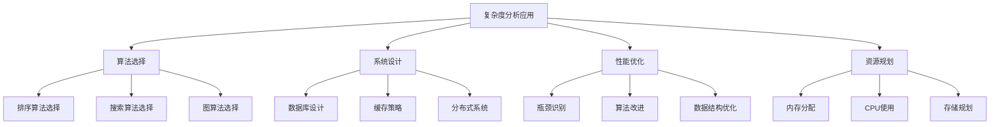
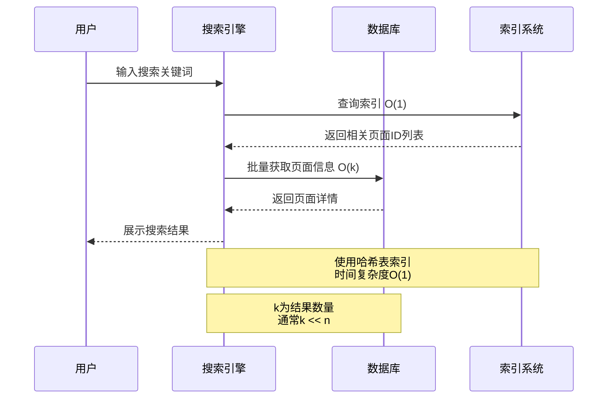
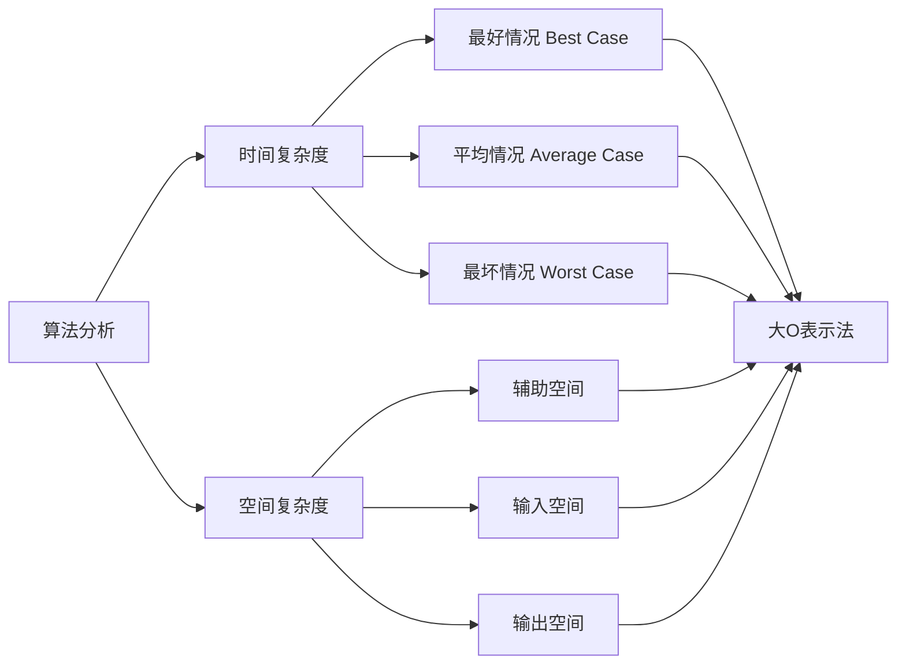
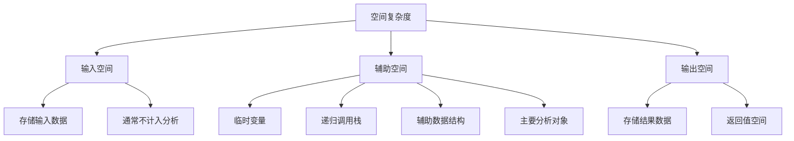

# 01.数据结构算法指导
#### 目录介绍
- [01.为何要复杂度分析](#01为何要复杂度分析)
  - [1.1 复杂度分析好处](#11-复杂度分析好处)
  - [1.2 复杂度分析原因](#12-复杂度分析原因)
  - [1.3 对数和指数](#13-对数和指数)
  - [1.4 复杂度分析场景](#14-复杂度分析场景)
  - [1.5 搜索引擎案例](#15-搜索引擎案例)
- [02.算法分析基础概念](#02算法分析基础概念)
  - [2.1 时间复杂度](#21-时间复杂度)
  - [2.2 空间复杂度](#22-空间复杂度)
  - [2.3 算法分析框架](#23-算法分析框架)
  - [2.4 分析方法论](#24-分析方法论)
- [03.大O复杂度表示法](#03大o复杂度表示法)
  - [3.1 先分析两个案例](#31-先分析两个案例)
  - [3.2 总结案例的规律](#32-总结案例的规律)
- [04.时间复杂度](#04时间复杂度)
  - [4.1 复杂度分析方法](#41-复杂度分析方法)
  - [4.2 时间复杂度分类](#42-时间复杂度分类)
  - [4.3 常数O(1)案例](#43-常数o1案例)
  - [4.4 线性O(N)案例](#44-线性on案例)
  - [4.5 平方O(N^2)案例](#45-平方on2案例)
  - [4.6 对数O(logN)案例](#46-对数ologn案例)
  - [4.7 指数O(2^N)案例](#47-指数o2n案例)
  - [4.8 线性对数O(NlogN)](#48-线性对数onlogn)
  - [4.9 复杂度增长对比](#49-复杂度增长对比)
  - [4.10 时间分析技巧](#410-时间分析技巧)
- [05.空间复杂度](#05空间复杂度)
  - [5.1 空间复杂度定义](#51-空间复杂度定义)
  - [5.2 空间复杂度分析方法](#52-空间复杂度分析方法)
  - [5.3 暂存空间指什么](#53-暂存空间指什么)
  - [5.4 符号表示的含义](#54-符号表示的含义)
  - [5.5 常数O(1)案例](#55-常数o1案例)
  - [5.6 线性O(N)案例](#56-线性on案例)
  - [5.7 平方O(N^2)案例](#57-平方on2案例)
  - [5.8 指数O(2^N)案例](#58-指数o2n案例)
  - [5.9 对数O(logN)案例](#59-对数ologn案例)
- [06.最好和最坏分析](#06最好和最坏分析)
  - [6.1 复杂度分析概念](#61-复杂度分析概念)
  - [6.2 最好情况复杂度](#62-最好情况复杂度)
  - [6.3 最坏情况复杂度](#63-最坏情况复杂度)
  - [6.4 平均情况复杂度](#64-平均情况复杂度)
  - [6.5 均摊情况复杂度](#65-均摊情况复杂度)
- [07.时间和空间权衡](#07时间和空间权衡)
  - [7.1 疑惑：时间和空间能兼得吗](#71-疑惑时间和空间能兼得吗)
  - [7.2 空间换时间的经典案例](#72-空间换时间的经典案例)
  - [7.3 时间换空间的经典案例](#73-时间换空间的经典案例)
  - [7.4 如何做权衡决策](#74-如何做权衡决策)


## 01.为何要复杂度分析

### 1.1 复杂度分析好处

把代码跑一遍，通过统计、监控，就能得到算法执行的时间和占用的内存大小。为什么还要做时间、空间复杂度分析呢？

首先肯定的说，这种评估算法执行效率的方法是正确的。很多书籍管这种方法叫"事后统计法"。但是这种方法有很大的局限性：

1. 测试结果非常依赖测试环境：如测试环境中的硬件对测试结果影响很大。
2. 测试结果受数据规模的影响很大。如小规模的数据，插入排序反而比快速排序快。 

使用复杂度分析有什么好处？复杂度分析是一种评估算法性能和效率的方法。它的目的是帮助开发人员了解算法在不同输入规模下的运行时间和空间消耗。不用具体数据来测试，就可以粗略的估算执行效率的方法。

| 评估方式 | 事后统计法（实测） | 复杂度分析（理论） |
|---------|-----------------|-----------------|
| 是否需要运行 | 需要编码+运行 | 纸上推导即可 |
| 是否依赖硬件 | 强依赖（CPU/内存/磁盘） | 完全无关 |
| 是否依赖数据规模 | 不同规模结论可能不同 | 描述增长趋势，适用所有规模 |
| 能否比较不同语言实现 | 不能（运行环境不同） | 可以（算法本质相同） |
| 适用阶段 | 开发完成后 | 设计阶段即可评估 |

### 1.2 复杂度分析原因

复杂度分析对于评估算法性能、预测行为、优化算法、以及推动算法改进和创新都非常重要。

1. **性能比较**：通过分析算法的时间复杂度和空间复杂度，可以确定哪个算法在给定的输入规模下更高效。
2. **预测算法行为**：复杂度分析可以帮助开发人员预测算法在不同输入规模下的行为。
3. **优化算法**：复杂度分析可以帮助开发人员识别算法中的瓶颈和低效之处。
4. **算法改进和创新**：复杂度分析可以激发算法改进和创新的灵感。提出更高效的解决方案。

```
实际案例：为什么复杂度分析比实测更重要？

场景：你写了一个排序算法，测试10000条数据用了50ms，看起来不错。
但如果你分析出它是O(N²)，就能预测：
  - 10万条 → 5秒
  - 100万条 → 500秒（8分钟！）
  - 1000万条 → 50000秒（14小时！）

没有复杂度分析，你只知道"现在够快"；有了复杂度分析，你能预测"未来会不会崩"。
```

### 1.3 对数和指数

什么是对数：在数学中，对数是对求幂的逆运算，正如除法是乘法的倒数，反之亦然。这意味着一个数字的对数是必须产生另一个固定数字（基数）的指数。在简单的情况下，乘数中的对数计数因子。更一般来说，乘幂允许将任何正实数提高到任何实际功率，总是产生正的结果，因此可以对于b不等于1的任何两个正实数b和x计算对数。

如果a的x次方等于N（a>0，且a≠1），那么x叫做以a为底N的对数（logarithm），记作x=logaN。读作以a为底N的对数，a叫做对数的底数，N叫做真数。

一般地，函数y=logaX（a>0，且a≠1）叫做对数函数，也就是说以幂（真数）为自变量，指数为因变量，底数为常量的函数，叫对数函数。

其中x是自变量，函数的定义域是（0，+∞），即x>0。它实际上就是指数函数的反函数，可表示为x=ay。因此指数函数里对于a的规定，同样适用于对数函数。

通常我们将以10为底的对数叫常用对数（common logarithm），并把log10N记为lgN。另外，在科学计数中常使用以无理数e=2.71828···为底数的对数，以e为底的对数称为自然对数（natural logarithm），并且把logeN 记为In N。

根据对数的定义，可以得到对数与指数间的关系：当a>0，a≠1时，a^X=N <--> X=logaN。（N>0）。在实数范围内，负数和零没有对数；loga1，log以a为底1的对数为0（a为常数） 恒过点（1，0）。

### 1.4 复杂度分析场景



### 1.5 搜索引擎案例

考虑一个搜索引擎需要在10亿个网页中查找关键词：

- **线性搜索**：O(n) - 需要检查每个网页，耗时巨大
- **哈希表搜索**：O(1) - 几乎瞬时完成
- **二分搜索**：O(log n) - 在有序数据中快速定位



## 02.算法分析基础概念

### 2.1 时间复杂度

**时间复杂度（Time Complexity）**：算法执行所需的时间随输入规模增长的趋势。

**核心原理**：时间复杂度并不是计算程序运行的"实际秒数"，而是描述算法执行操作次数与输入规模 n 之间的**函数关系**。这是一种渐近分析方法，关注的是 n 趋于无穷大时的增长趋势。

**为什么不用实际运行时间？** 因为实际运行时间受硬件（CPU主频、缓存大小、内存带宽）、操作系统（调度策略、中断）、编译器优化、输入数据分布等多种因素影响。同一个算法在不同机器上运行时间可能相差数百倍，但它的时间复杂度是确定不变的。

**数学基础——渐近符号体系**：

| 符号 | 含义 | 通俗理解 |
|------|------|---------|
| O(f(n)) | 上界（upper bound） | 最坏情况下不会比 f(n) 差 |
| Ω(f(n)) | 下界（lower bound） | 最好情况下也不会比 f(n) 好 |
| Θ(f(n)) | 紧确界（tight bound） | 刚好是 f(n) 这个量级 |
| o(f(n)) | 严格上界 | 严格比 f(n) 增长慢 |
| ω(f(n)) | 严格下界 | 严格比 f(n) 增长快 |

工程中最常用的是大 O 表示法（上界），因为我们通常关心算法在**最坏情况**下的性能保证。

**CPU 层面的理解**：在现代处理器上，一个基本操作（加法、比较、赋值）通常对应一条或几条 CPU 指令。时间复杂度本质上是在计算"算法需要执行多少条基本指令"。例如 O(n) 意味着指令数与 n 成正比，O(n²) 意味着指令数与 n² 成正比。

### 2.2 空间复杂度

**空间复杂度（Space Complexity）**：算法执行所需的额外存储空间随输入规模增长的趋势。

**核心原理**：空间复杂度衡量的是算法在运行过程中**临时占用的额外存储空间**与输入规模 n 之间的函数关系。注意是"额外"空间——输入数据本身占用的空间通常不计入分析。

**空间消耗的三个来源**：

1. **变量空间**：函数中声明的局部变量、常量。如果变量数量固定，则为 O(1)；如果创建了长度为 n 的数组，则为 O(n)
2. **数据结构空间**：算法运行中创建的辅助数据结构（哈希表、额外数组、树节点等）
3. **调用栈空间**：递归调用产生的栈帧。每一层递归调用都会在栈上分配一个栈帧（存储返回地址、局部变量、参数等），递归深度为 d 时，栈空间为 O(d)

**内存层面的理解**：在操作系统中，程序的内存布局分为栈区（stack）、堆区（heap）、数据段（data）和代码段（text）。空间复杂度主要关注的是栈区（递归调用）和堆区（动态分配的数据结构）的使用量。栈区大小通常有限（Linux 默认 8MB，Windows 默认 1MB），这就是为什么深度递归容易导致栈溢出（Stack Overflow）的原因。

**实际案例——空间复杂度的工程意义**：

```python
# 方案A：O(1) 空间 —— 原地反转数组
def reverse_in_place(arr):
    left, right = 0, len(arr) - 1
    while left < right:
        arr[left], arr[right] = arr[right], arr[left]
        left += 1
        right -= 1

# 方案B：O(N) 空间 —— 创建新数组
def reverse_copy(arr):
    return arr[::-1]  # Python 切片会创建新的列表
```

在嵌入式设备（内存仅 256KB）上，方案 A 是唯一可行的选择。在服务器端（内存 64GB），方案 B 的代码更简洁，牺牲一点空间换取可读性是合理的。

### 2.3 算法分析框架

复杂度也叫渐进复杂度，包括时间复杂度和空间复杂度，用来分析算法执行效率与数据规模之间的增长关系，可以粗略地表示，越高阶复杂度的算法，执行效率越低。

常见的复杂度并不多，从低阶到高阶有：O(1)、O(logn)、O(n)、O(nlogn)、O(n^2)。



### 2.4 分析方法论

**渐近分析三原则**：

1. **渐近分析**：关注输入规模趋于无穷时的行为
2. **忽略常数因子**：关注增长趋势而非具体数值
3. **关注主导项**：忽略低阶项和常数项

**原则背后的数学推导**：

为什么可以忽略低阶项和常数？以 f(n) = 3n² + 5n + 100 为例：

- 当 n = 10 时，3n² = 300，5n = 50，100 = 100，低阶项占比 33%
- 当 n = 100 时，3n² = 30000，5n = 500，100 = 100，低阶项占比 2%
- 当 n = 10000 时，3n² = 3亿，5n = 50000，100 = 100，低阶项占比 0.002%

随着 n 的增长，低阶项和常数项的影响趋近于零。因此 f(n) = 3n² + 5n + 100 的复杂度就是 O(n²)。

**常用分析技巧**：

| 技巧 | 说明 | 示例 |
|------|------|------|
| 循环计数法 | 数循环次数和嵌套层数 | 双重 for 循环 → O(n²) |
| 递推关系法 | 建立递推方程，用主定理求解 | T(n)=2T(n/2)+O(n) → O(nlogn) |
| 递归树法 | 画出递归树，逐层求和 | 归并排序的 log n 层 |
| 均摊分析法 | 多次操作的平均代价 | 动态数组扩容 |
| 势能分析法 | 定义势能函数，分析操作序列 | 伸展树（Splay Tree） |

**主定理（Master Theorem）**——分治算法复杂度分析利器：

对于递推关系 T(n) = aT(n/b) + O(n^d)，其中 a ≥ 1，b > 1：

- 若 d < log_b(a)，则 T(n) = O(n^(log_b(a)))
- 若 d = log_b(a)，则 T(n) = O(n^d × log n)
- 若 d > log_b(a)，则 T(n) = O(n^d)

```
归并排序：T(n) = 2T(n/2) + O(n)
→ a=2, b=2, d=1 → log₂2 = 1 = d
→ T(n) = O(n × log n) ✓

二分查找：T(n) = T(n/2) + O(1)
→ a=1, b=2, d=0 → log₂1 = 0 = d
→ T(n) = O(log n) ✓
```

## 03.大O复杂度表示法

大O记号描述函数的上界，即算法在最坏情况下的性能表现。

**数学定义**：存在正常数c和n₀，使得对所有n ≥ n₀，都有f(n) ≤ c·g(n)，则f(n) = O(g(n))

### 3.1 先分析两个案例

算法的执行效率，粗略的讲，就是算法的执行时间。

> **案例1：这里有段简单的代码，求1到n的累加和**。

```c
int cla(int n){
    int sum = 0;
    for (int i=1 ;i<=n; i++){
        sum = sum + 1;
    }
    return sum;
}
```

现在我们来估算下，上述代码的执行时间：尽管每行代码对应cpu执行的个数、执行的时间都不一样，但是我们这里只是粗略的估计，所以我们可以假设每行代码执行的时间都一样，都为unit_time。在这个假设的基础上，我们进行分析！

第2、3行都执行了一次，第4、5行都执行了n次。所以这段代码总执行 2 * unit_time + 2n * unit_time。可以看出代码的执行时间（T(n)）与代码的执行次数成正比。

> **案例2：打印9*9乘法表**。

```c
int cal(int n){
    int sum = 0;
    int i = 9; 
    int j = 9;
    for(; i<= n ;i++){
        j = 1;
        for(; j <= n ; j++){
            sum = sum + i*j;
        }
    }
}
```

进行分析。 2、3、4 行代码分别需要 1 个 unit_time 的执行时间，第 5、6 行都运行了 n 遍，所以需要 2n * unit_time 的执行时间，第 7、8 行代码循环执行了 n^2遍，所以需要 2n^2 * unit_time 的执行时间。

所以，整段代码总的执行时间 T(n) = (2n^2+2n+3) * unit_time。

通过两个例子，我们可以得出一个规律：所有代码的执行时间T(n)与每行代码的执行次数n成正比。

### 3.2 总结案例的规律

> 可以把这个规律总结成一个公式。注意，大 O 就要登场了！

T(n)=O(f(n))，来解释一下这个公式。T(n)表示代码的执行时间；n表示数据规模的大小；f(n)表示每行代码执行次数的总和。因为这是一个公式，所以用f(n)表示。公式中的O，表示代码的执行时间T(n)与f(n)表达式成正比。

所以，第一个例子中Tn=O(2n+1)，第二个例子中的Tn=O(2n^2+2n+3)。这就是大O时间复杂度表示法。大O时间复杂度实际上并不代表代码的具体执行时间，而是表示代码的执行时间随数据规模增长的变化趋势，所以也叫做时间渐进复杂度（asymptotic time complexity），简称时间复杂度。

注意要点：当 n 很大时，公式中的低阶、常量、系数三部分并不左右增长趋势，所以都可以忽略。我们只需要记录一个最大量级就可以了，如果用大 O 表示法表示刚讲的那两段代码的时间复杂度，就可以记为：T(n) = O(n)； T(n) = O(n*n)。

**提炼三条实用规则**：

```
规则1：只保留最高阶项
  T(n) = 3n² + 5n + 100  →  O(n²)

规则2：去掉常数系数
  T(n) = 100n  →  O(n)，不是O(100n)

规则3：多段代码取最大
  代码段A: O(n²) + 代码段B: O(n)  →  总体O(n²)
```

## 04.时间复杂度

### 4.1 复杂度分析方法

前面介绍了大 O 时间复杂度的由来和表示方法。现在来看下，如何分析一段代码的时间复杂度？这儿有三个比较实用的方法。

#### 4.1.1 关注执行最多代码

刚才说了，大 O 这种复杂度表示方法只是表示一种变化趋势。我们通常会忽略掉公式中的常量、低阶、系数，只需要记录一个最大阶的量级就可以了。

所以，我们在分析一个算法、一段代码的时间复杂度的时候，也只关注循环执行次数最多的那一段代码就可以了。这段核心代码执行次数的 n 的量级，就是整段要分析代码的时间复杂度。

```c
fun sum(array: IntArray): Int {
    var total = 0              // O(1)
    for (i in array.indices) { // O(n)
        total += array[i]      // O(1)
    }
    return total               // O(1)
}
```

在上述代码中：

- var total = 0 的时间复杂度是O(1)。
- for (i in array.indices) 的循环执行了n次，时间复杂度是O(n)。
- total += array[i] 在循环中执行，每次的时间复杂度是O(1)，总的时间复杂度是O(n)。
- return total 的时间复杂度是O(1)。

总体时间复杂度是O(n)。

#### 4.1.2 加法计算时间复杂度

加法法则：总复杂度等于量级最大的那段代码的复杂度

```c
int cal(int n) {
    int sum_1 = 0;
    int p = 1;
    for (; p < 100; ++p) {
        sum_1 = sum_1 + p;
    }
    int sum_2 = 0;
    int q = 1;
    for (; q < n; ++q) {
        sum_2 = sum_2 + q;
    }
    int sum_3 = 0;
    int i = 1;
    int j = 1;
    for (; i <= n; ++i) {
        j = 1;
        for (; j <= n; ++j) {
            sum_3 = sum_3 + i * j;
        }
    }
    return sum_1 + sum_2 + sum_3;
}
```

这个代码分为三部分，分别是求 sum_1、sum_2、sum_3。

1. 第一段代码循环执行了 100 次，所以是一个常量的执行时间，跟 n 的规模无关。
2. 第二段代码时间复杂度是O(n)；第三段代码的时间复杂度是O(n*n)。

综合这三段代码的时间复杂度，我们取其中最大的量级。所以，整段代码的时间复杂度就为 O(n*n)。也就是说：总的时间复杂度就等于量级最大的那段代码的时间复杂度。

那我们将这个规律抽象成公式就是：如果 T1(n)=O(f(n))，T2(n)=O(g(n))；那么 T(n)=T1(n)+T2(n)=max(O(f(n)), O(g(n))) =O(max(f(n), g(n)))。

#### 4.1.3 乘法计算时间复杂度

乘法法则：嵌套代码的复杂度等于嵌套内外代码复杂度的乘积。 落实到具体的代码上，可以把乘法法则看成是嵌套循环，这种会经常看到：

```c
int cal(int n) {
    int ret = 0; 
    int i = 1;
    for (; i < n; ++i) {
        ret = ret + f(i);
    } 
} 

int f(int n) {
    int sum = 0;
    int i = 1;
    for (; i < n; ++i) {
        sum = sum + i;
    } 
    return sum;
}
```

假设 f() 只是一个普通的操作，那第 4～6 行的时间复杂度就是，T1(n) = O(n)。但 f() 函数本身不是一个简单的操作，它的时间复杂度是 T2(n) = O(n)，所以，整个 cal() 函数的时间复杂度就是，T(n) = T1(n) * T2(n) = O(n*n) = O(n^2)。

刚讲了三种复杂度的分析技巧。不过，你并不用刻意去记忆。实际上，复杂度分析这个东西关键在于"熟练"。你只要多看案例，多分析，就能做到"无招胜有招"。

### 4.2 时间复杂度分类

常见的时间复杂度从低到高依次为：

1. O(1): 常数时间复杂度，无论输入规模多大，算法的运行时间都不变。 
2. O(log n): 对数时间复杂度，问题规模逐步减半,例如二分查找算法。 
3. O(n): 线性时间复杂度，例如遍历数组。 
4. O(n log n): 线性对数时间复杂度，例如归并排序和快速排序的平均情况。 
5. O(n^k): k次方时间复杂度,例如K层嵌套循环 
6. O(2^n): 指数时间复杂度，例如解决背包问题的暴力算法。 
7. O(n!): 阶乘时间复杂度，例如解决旅行商问题的暴力算法。

**复杂度的"可计算性"边界**：

在算法理论中，O(1) 到 O(n log n) 被认为是"高效"的算法；O(n²) 在数据量不大时可以接受；而 O(2^n) 和 O(n!) 被称为"不可处理的"（intractable），只能处理极小规模的输入。

```
实际可接受的最大数据规模参考（1秒时限，约10^8次操作）：

O(n)        → n ≈ 10^8（一亿）
O(n log n)  → n ≈ 10^6（百万）
O(n²)       → n ≈ 10^4（一万）
O(n³)       → n ≈ 500
O(2^n)      → n ≈ 25
O(n!)       → n ≈ 11
```

**疑惑**：为什么有些 O(n²) 的算法在实际中反而比 O(n log n) 快？

**答疑**：大 O 记号隐藏了常数因子。例如插入排序的实际操作是 T(n) ≈ n²/4（平均情况），而归并排序是 T(n) ≈ 2n log n。当 n 较小（如 n < 64）时，n²/4 < 2n log n，所以插入排序更快。这就是为什么 Java 的 Arrays.sort() 和 Python 的 Timsort 在小数组上会切换到插入排序。

```java
// Java Arrays.sort 源码中的切换逻辑
private static final int INSERTION_SORT_THRESHOLD = 47;

static void sort(int[] a, int left, int right) {
    // 小数组使用插入排序
    if (right - left < INSERTION_SORT_THRESHOLD) {
        insertionSort(a, left, right);
        return;
    }
    // 大数组使用双轴快排
    dualPivotQuicksort(a, left, right);
}
```

### 4.3 常数O(1)案例

O(1) 只是常量级时间复杂度的一种表示方法，并不是指只执行了一行代码。只要代码的执行时间不随 n 的增大而增长，这样代码的时间复杂度我们都记作 O(1)。

或者说，一般情况下，只要算法中不存在循环语句、递归语句，即使有成千上万行的代码，其时间复杂度也是Ο(1)。

**特点**：执行时间不随输入规模变化

**典型操作**：

- 数组元素访问
- 哈希表查找（平均情况）
- 栈的push/pop操作
- 基本算术运算

```python
# 案例：数组元素访问
def get_first_element(arr):
    if len(arr) > 0:
        return arr[0]  # O(1) - 直接索引访问
    return None

# 案例：哈希表操作
def hash_lookup(hash_table, key):
    return hash_table.get(key)  # O(1) - 平均情况
```

### 4.4 线性O(N)案例

**特点**：执行时间与输入规模成正比

**典型操作**：
- 数组遍历
- 线性搜索
- 链表操作

```python
# 案例：线性搜索
def linear_search(arr, target):
    for i, value in enumerate(arr):  # 最多遍历n个元素
        if value == target:
            return i
    return -1

# 案例：数组求最大值
def find_max(arr):
    if not arr:
        return None
    
    max_val = arr[0]
    for i in range(1, len(arr)):  # 遍历n-1个元素
        if arr[i] > max_val:
            max_val = arr[i]
    return max_val
```

### 4.5 平方O(N^2)案例

**特点**：嵌套循环，每个元素与其他元素比较

**典型算法**：
- 冒泡排序
- 选择排序
- 插入排序

```python
# 案例：冒泡排序
def bubble_sort(arr):
    n = len(arr)
    for i in range(n):              # 外层循环n次
        for j in range(0, n-i-1):   # 内层循环最多n-1次
            if arr[j] > arr[j+1]:
                arr[j], arr[j+1] = arr[j+1], arr[j]
    return arr

# 总比较次数：n(n-1)/2 ≈ n²/2 = O(n²)

# 案例：矩阵相加
def matrix_add(A, B):
    n = len(A)
    C = [[0] * n for _ in range(n)]
    
    for i in range(n):      # 外层循环n次
        for j in range(n):  # 内层循环n次
            C[i][j] = A[i][j] + B[i][j]  # O(1)操作
    
    return C
# 总操作次数：n × n = O(n²)
```

### 4.6 对数O(logN)案例

**特点**：每次操作将问题规模减半

**典型算法**：
- 二分搜索
- 平衡二叉搜索树操作
- 堆的插入/删除操作

```python
# 案例：二分搜索
def binary_search_recursive(arr, target, left, right):
    if left > right:
        return -1
    
    mid = (left + right) // 2
    if arr[mid] == target:
        return mid
    elif arr[mid] > target:
        return binary_search_recursive(arr, target, left, mid - 1)
    else:
        return binary_search_recursive(arr, target, mid + 1, right)

# 递归深度：log₂(n)，每层O(1)操作
```

### 4.7 指数O(2^N)案例

**特点**：每增加一个输入，计算量翻倍

**典型问题**：
- 递归计算斐波那契数列
- 子集生成
- 汉诺塔问题

```python
# 案例：递归斐波那契
def fibonacci_recursive(n):
    if n <= 1:
        return n
    return fibonacci_recursive(n-1) + fibonacci_recursive(n-2)

# 递归树深度：n，每层节点数翻倍，总节点数：O(2ⁿ)

# 案例：生成所有子集
def generate_subsets(arr):
    if not arr:
        return [[]]
    
    first = arr[0]
    rest_subsets = generate_subsets(arr[1:])  # T(n-1)
    
    new_subsets = []
    for subset in rest_subsets:               # 2^(n-1)个子集
        new_subsets.append([first] + subset)
    
    return rest_subsets + new_subsets
# 总子集数：2ⁿ个
```


### 4.8 线性对数O(NlogN)

**特点**：结合了线性和对数特性

**典型算法**：
- 归并排序
- 堆排序
- 快速排序（平均情况）

```python
# 案例：归并排序
def merge_sort(arr):
    if len(arr) <= 1:
        return arr
    
    mid = len(arr) // 2
    left = merge_sort(arr[:mid])      # T(n/2)
    right = merge_sort(arr[mid:])     # T(n/2)
    
    return merge(left, right)         # O(n)

def merge(left, right):
    result = []
    i = j = 0
    
    while i < len(left) and j < len(right):  # 最多n次比较
        if left[i] <= right[j]:
            result.append(left[i])
            i += 1
        else:
            result.append(right[j])
            j += 1
    
    result.extend(left[i:])
    result.extend(right[j:])
    return result

# 递推关系：T(n) = 2T(n/2) + O(n) = O(n log n)
```


2. O(logn)、O(nlogn) 对数阶

对数阶时间复杂度非常常见，同时也是最难分析的一种时间复杂度。通过一个例子来说明一下。

```c
i=1;
while (i <= n) {
    i = i * 2;
}
```

从代码中可以看出，变量 i 的值从 1 开始取，每循环一次就乘以 2。当大于 n 时，循环结束。还记得高中学过的等比数列吗？实际上，变量 i 的取值就是一个等比数列。这段代码的时间复杂度就是 O(log 2^n)。

现在，把代码稍微改下，你再看看，这段代码的时间复杂度是多少？

```c
i=1;
while (i <= n) {
    i = i * 3;
}
```

很简单就能看出来，这段代码的时间复杂度为 O(log 3^n)。

实际上，不管是以 2 为底、以 3 为底，还是以 10 为底，我们可以把所有对数阶的时间复杂度都记为 O(logn)。

基于我们前面的一个理论：在采用大 O 标记复杂度的时候，可以忽略系数，即 O(Cf(n)) = O(f(n))。所以，O(log2n) 就等于 O(log3n)。因此，在对数阶时间复杂度的表示方法里，我们忽略对数的"底"，统一表示为 O(logn)。

3. O(m+n)、O(m*n)

O(m+n)、O(m*n)：再来讲一种跟前面都不一样的时间复杂度，代码的复杂度由两个数据的规模来决定。

```c
int cal(int m, int n) {
  int sum_1 = 0;
  int i = 1;
  for (; i < m; ++i) {
    sum_1 = sum_1 + i;
  }
 
  int sum_2 = 0;
  int j = 1;
  for (; j < n; ++j) {
    sum_2 = sum_2 + j;
  }
 
  return sum_1 + sum_2;
}
```

从代码中可以看出，m 和 n 是表示两个数据规模。我们无法事先评估 m 和 n 谁的量级大，所以我们在表示复杂度的时候，就不能简单地利用加法法则，省略掉其中一个。所以，上面代码的时间复杂度就是 O(m+n)。

针对这种情况，原来的加法法则就不正确了，我们需要将加法规则改为：T1(m) + T2(n) = O(f(m) + g(n))。但是乘法法则继续有效：T1(m)*T2(n) = O(f(m) * f(n))。

### 4.9 复杂度增长对比

| 输入规模n | O(1) | O(log n) | O(n) | O(n log n) | O(n²) | O(2ⁿ) |
|-----------|------|----------|------|------------|-------|-------|
| 10        | 1    | 3        | 10   | 33         | 100   | 1024  |
| 100       | 1    | 7        | 100  | 664        | 10K   | 10³⁰  |
| 1000      | 1    | 10       | 1K   | 9966       | 1M    | 10³⁰¹ |
| 10000     | 1    | 13       | 10K  | 132K       | 100M  | -     |

**数据的直观感受**：

- O(log n) 增长极其缓慢：即使数据量从 10 增长到 10000（增长 1000 倍），操作次数仅从 3 增长到 13（增长约 4 倍）
- O(n²) 的爆炸性增长：数据量从 1000 增长到 10000（增长 10 倍），操作次数从 100 万增长到 1 亿（增长 100 倍）
- O(2ⁿ) 的"不可计算性"：当 n = 100 时，2^100 ≈ 1.27 × 10³⁰，即使每秒执行 10 亿次操作，也需要约 4 × 10¹³ 年——远超宇宙年龄（约 138 亿年）

**疑惑**：在面试或工程中，如何快速判断一个复杂度是否"可接受"？

**答疑**：一个实用的经验法则——**10^8 原则**：现代计算机每秒大约能执行 10^8 ~ 10^9 次简单操作。如果算法在给定输入规模下的操作次数超过 10^8，通常就需要优化。

```
面试中的快速判断公式：

给定 n 的范围        → 推断期望的复杂度
n ≤ 10              → O(n!) 或 O(2^n) 可接受
n ≤ 20              → O(2^n) 可接受
n ≤ 500             → O(n³) 可接受
n ≤ 5000            → O(n²) 可接受
n ≤ 10^6            → O(n log n) 可接受
n ≤ 10^8            → O(n) 可接受
n > 10^8            → O(log n) 或 O(1) 才行
```

### 4.10 时间分析技巧

```mermaid
flowchart TD
    A[循环分析] --> B[单层循环]
    A --> C[嵌套循环]
    A --> D[递归循环]
    
    B --> B1[for i in range(n): O(n)]
    C --> C1[双重嵌套: O(n²)]
    C --> C2[三重嵌套: O(n³)]
    D --> D1[分治递归: O(n log n)]
    D --> D2[线性递归: O(n)]
    D --> D3[指数递归: O(2ⁿ)]
```

**技巧1：非标准循环的分析**

并不是所有循环都是 i++ 这样的标准步进，需要仔细分析循环变量的变化模式：

```python
# 案例1：步长翻倍 → O(log n)
i = 1
while i < n:
    # 操作
    i *= 2
# i 的取值：1, 2, 4, 8, ... 2^k，当 2^k ≥ n 时停止
# k = log₂n，所以循环 log n 次

# 案例2：步长递增 → O(√n)
i = 0
s = 0
while s < n:
    i += 1
    s += i
# s 的取值：1, 3, 6, 10, ... k(k+1)/2
# 当 k(k+1)/2 ≥ n 时停止，k ≈ √(2n)，所以是 O(√n)

# 案例3：多个循环变量 → 需要分别分析
i = 0
j = 0
while i < n:
    if j < n:
        j += 1      # j 从 0 到 n
    else:
        i += 1       # i 从 0 到 n
        j = 0
# 总操作次数：i 每增加 1，j 走完 n 步 → 总共 n × n = O(n²)
```

**技巧2：递归复杂度分析的三种方法**

```python
# 递归案例：计算 2^n
def power(n):
    if n == 0:
        return 1
    return 2 * power(n - 1)

# 方法1——递推法：
# T(n) = T(n-1) + O(1)
# T(n) = T(n-2) + 2×O(1)
# ...
# T(n) = T(0) + n×O(1) = O(n)

# 方法2——递归树法：
# 树只有一条链，深度为 n，每层 O(1) → 总计 O(n)

# 方法3——主定理法：
# T(n) = 1×T(n-1) + O(1)
# 这是减法递推（不是除法），不能直接用主定理
# 但展开后显然是 O(n)
```

**技巧3：隐藏的复杂度陷阱**

```java
// 陷阱1：字符串拼接
String result = "";
for (int i = 0; i < n; i++) {
    result += "a";  // 每次拼接都创建新字符串！
}
// 看起来是 O(n)，实际是 O(n²)！
// 因为第 i 次拼接需要复制 i 个字符
// 总操作：1 + 2 + 3 + ... + n = n(n+1)/2 = O(n²)
// 解决方案：使用 StringBuilder，真正的 O(n)

// 陷阱2：ArrayList 的 contains
ArrayList<Integer> list = new ArrayList<>();
for (int i = 0; i < n; i++) {
    if (!list.contains(target)) {  // contains 是 O(n)
        list.add(i);
    }
}
// 看起来是 O(n)，实际是 O(n²)
// 解决方案：使用 HashSet，contains 为 O(1)
```


## 05.空间复杂度

### 5.1 空间复杂度定义

空间复杂度涉及的空间类型有：

1. 输入空间： 存储输入数据所需的空间大小；
2. 暂存空间： 算法运行过程中，存储所有中间变量和对象等数据所需的空间大小；
3. 输出空间： 算法运行返回时，存储输出数据所需的空间大小；

通常情况下，空间复杂度指在输入数据大小为 N 时，算法运行所使用的「暂存空间」+「输出空间」的总体大小。



### 5.2 空间复杂度分析方法

空间复杂度的分析方法与时间复杂度类似，核心关注算法运行期间**额外分配**的空间大小随输入规模N的增长关系。

**分析要点**：

1. **忽略输入本身**：输入数据占用的空间不计入空间复杂度（除非算法修改了输入）
2. **关注额外空间**：只看算法执行过程中新创建的变量、数据结构、递归调用栈
3. **取最大阶**：与时间复杂度一样，只保留最高阶项

```java
// 示例：空间复杂度 O(1) —— 只用了常数个变量
public int sum(int[] arr) {
    int total = 0;           // O(1)
    for (int x : arr) {
        total += x;
    }
    return total;
}

// 示例：空间复杂度 O(N) —— 创建了与输入同规模的数组
public int[] copy(int[] arr) {
    int[] result = new int[arr.length];  // O(N)
    for (int i = 0; i < arr.length; i++) {
        result[i] = arr[i];
    }
    return result;
}

// 示例：空间复杂度 O(N) —— 递归调用栈深度为N
public int factorial(int n) {
    if (n <= 1) return 1;
    return n * factorial(n - 1);  // 调用栈深度 O(N)
}
```

### 5.3 暂存空间指什么

算法使用的内存空间分为三类：

指令空间：编译后，程序指令所使用的内存空间。

数据空间：算法中的各项变量使用的空间，包括：声明的常量、变量、动态数组、动态对象等使用的内存空间。

```c
struct Node {
    int val;
    Node *next;
    Node(int x) : val(x), next(NULL) {}
};
 
void algorithm(int N) {
    int num = N;              // 变量
    int nums[N];              // 动态数组
    Node* node = new Node(N); // 动态对象
}
```

栈帧空间：程序调用函数是基于栈实现的，函数在调用期间，占用常量大小的栈帧空间，直至返回后释放。如以下代码所示，在循环中调用函数，每轮调用 test() 返回后，栈帧空间已被释放，因此空间复杂度仍为 O(1)。

```c
int test() {
    return 0;
}
 
void algorithm(int N) {
    for (int i = 0; i < N; i++) {
        test();
    }
}
```

栈帧空间的累计常出现于递归调用。如以下代码所示，通过递归调用，会同时存在 N 个未返回的函数 algorithm() ，此时累计使用 O(N) 大小的栈帧空间。

```c
int algorithm(int N) {
    if (N <= 1) return 1;
    return algorithm(N - 1) + 1;
}
```

### 5.4 符号表示的含义

通常情况下，空间复杂度统计算法在 "最差情况" 下使用的空间大小，以体现算法运行所需预留的空间量，使用符号 O 表示。

最差情况有两层含义，分别为「最差输入数据」、算法运行中的「最差运行点」。

最差输入数据：

当 N≤10 时，数组 nums 的长度恒定为 10 ，空间复杂度为 O(10) = O(1)；当 N > 10 时，数组 nums 长度为 N ，空间复杂度为 O(N) ；因此，空间复杂度应为最差输入数据情况下的 O(N) 。

最差运行点：

在执行 nums = [0] * 10 时，算法仅使用 O(1) 大小的空间；而当执行 nums = [0] * N 时，算法使用 O(N) 的空间；因此，空间复杂度应为最差运行点的 O(N) 。

```c
void algorithm(int N) {
    int num = 5;           // O(1)
    vector<int> nums(10);  // O(1)
    if (N > 10) {
        nums.resize(N);    // O(N)
    }
}
```

根据从小到大排列，常见的算法空间复杂度有：O(1) < O(logN) < O(N) < O(N^2) < O(2^N)

### 5.5 常数O(1)案例

普通常量、变量、对象、元素数量与输入数据大小 N 无关的集合，皆使用常数大小的空间。

```c
void algorithm(int N) {
    int num = 0;
    int nums[10000];
    Node* node = new Node(0);
    unordered_map<int, string> dic;
    dic.emplace(0, "0");
}
```

如以下代码所示，虽然函数 test() 调用了 N 次，但每轮调用后 test() 已返回，无累计栈帧空间使用，因此空间复杂度仍为 O(1) 。

```c
void algorithm(int N) {
    for (int i = 0; i < N; i++) {
        test();
    }
}
```

### 5.6 线性O(N)案例

元素数量与 N 呈线性关系的任意类型集合（常见于一维数组、链表、哈希表等），皆使用线性大小的空间。

```c
void algorithm(int N) {
    int nums_1[N];
    int nums_2[N / 2 + 1];
 
    vector<Node*> nodes;
    for (int i = 0; i < N; i++) {
        nodes.push_back(new Node(i));
    }
 
    unordered_map<int, string> dic;
    for (int i = 0; i < N; i++) {
        dic.emplace(i, to_string(i));
    }
}
```

如下图与代码所示，此递归调用期间，会同时存在 N 个未返回的 algorithm() 函数，因此使用 O(N) 大小的栈帧空间。

```c
int algorithm(int N) {
    if (N <= 1) return 1;
    return algorithm(N - 1) + 1;
}
```

### 5.7 平方O(N^2)案例

元素数量与 N 呈平方关系的任意类型集合（常见于矩阵），皆使用平方大小的空间。

```c
void algorithm(int N) {
    vector<vector<int>> num_matrix;
    for (int i = 0; i < N; i++) {
        vector<int> nums;
        for (int j = 0; j < N; j++) {
            nums.push_back(0);
        }
        num_matrix.push_back(nums);
    }
 
    vector<vector<Node*>> node_matrix;
    for (int i = 0; i < N; i++) {
        vector<Node*> nodes;
        for (int j = 0; j < N; j++) {
            nodes.push_back(new Node(j));
        }
        node_matrix.push_back(nodes);
    }
}
```

如下图与代码所示，递归调用时同时存在 N 个未返回的 algorithm() 函数，使用 O(N) 栈帧空间；每层递归函数中声明了数组，平均长度为 N/2 , 使用 O(N) 空间；因此总体空间复杂度为 O(N^2) 。

```
int algorithm(int N) {
    if (N <= 0) return 0;
    int nums[N];
    return algorithm(N - 1);
}
```

### 5.8 指数O(2^N)案例

指数阶常见于二叉树、多叉树。例如，高度为 N 的「满二叉树」的节点数量为 2^N，占用 O(2^N) 大小的空间；同理，高度为 N 的「满 m 叉树」的节点数量为 m^N，占用 O(m^N) = O(2^N) 大小的空间。

**核心原理**：指数空间复杂度通常出现在需要"枚举所有可能性"的场景。每多一个元素，状态空间就翻倍，导致空间需求呈指数级增长。

**典型案例1——子集枚举**：

```python
def generate_all_subsets(nums):
    """生成所有子集，空间 O(2^N)"""
    result = []
    n = len(nums)
    for mask in range(1 << n):  # 2^n 个子集
        subset = []
        for i in range(n):
            if mask & (1 << i):
                subset.append(nums[i])
        result.append(subset)  # 存储 2^n 个子集
    return result

# nums = [1,2,3] → result 有 2³=8 个子集
# [[], [1], [2], [1,2], [3], [1,3], [2,3], [1,2,3]]
# 空间复杂度：O(2^N × N)（2^N 个子集，每个子集平均长度 N/2）
```

**典型案例2——递归建树**：

```c
// 构建高度为 N 的满二叉树
struct TreeNode* buildFullTree(int height) {
    if (height == 0) return NULL;
    struct TreeNode* node = malloc(sizeof(struct TreeNode));
    node->left = buildFullTree(height - 1);
    node->right = buildFullTree(height - 1);
    return node;
}
// 高度为 N 的满二叉树有 2^N - 1 个节点
// 空间复杂度：O(2^N)（节点占用）+ O(N)（递归栈）= O(2^N)
```

**工程启示**：指数空间意味着问题规模极度受限。当 N = 20 时，2^20 ≈ 100万，还勉强可行；N = 30 时，2^30 ≈ 10亿，单个对象 8 字节的话就需要约 8GB 内存，通常已经不可接受。

### 5.9 对数O(logN)案例

对数阶常出现于分治算法的栈帧空间累计、数据类型转换等，例如：

**1）快速排序的空间复杂度分析**

快速排序的平均空间复杂度为 Θ(logN)，最差空间复杂度为 O(N)。

```python
def quicksort(arr, low, high):
    if low < high:
        pivot_idx = partition(arr, low, high)
        quicksort(arr, low, pivot_idx - 1)   # 左子数组
        quicksort(arr, pivot_idx + 1, high)   # 右子数组

# 平均情况：每次 partition 将数组均分
# 递归深度 = log₂N → 空间 O(log N)
# 
# 最坏情况：每次 partition 极度不均（已排序数组）
# 递归深度 = N → 空间 O(N)
```

**优化技巧——尾递归优化**：通过总是先递归较小的子数组，可以将最坏空间复杂度从 O(N) 优化到 O(logN)。这是因为较大的子数组可以用循环处理（尾调用优化），只有较小的子数组才需要递归调用：

```c
// 尾递归优化版快速排序
void quicksort_optimized(int arr[], int low, int high) {
    while (low < high) {
        int pivot = partition(arr, low, high);
        // 总是先递归较小的一半
        if (pivot - low < high - pivot) {
            quicksort_optimized(arr, low, pivot - 1);
            low = pivot + 1;  // 尾递归 → 循环
        } else {
            quicksort_optimized(arr, pivot + 1, high);
            high = pivot - 1; // 尾递归 → 循环
        }
    }
}
// 每次递归的子数组最多是原来的一半
// 所以递归深度最多 log₂N → 空间 O(log N)
```

**2）数字转化为字符串**

设某正整数为 N，则字符串的空间复杂度为 O(logN)。推导如下：正整数 N 的位数为 log(10,N)，即转化的字符串长度为 log(10,N)，因此空间复杂度为 O(logN)。

```python
def int_to_string(n):
    """将整数转为字符串，空间 O(log N)"""
    if n == 0:
        return "0"
    digits = []
    while n > 0:
        digits.append(chr(ord('0') + n % 10))
        n //= 10
    digits.reverse()
    return ''.join(digits)

# N = 12345 → 位数 = ⌊log₁₀(12345)⌋ + 1 = 5
# digits 数组长度 = 5 = O(log N)
```

**3）二分查找的递归实现**

```python
def binary_search(arr, target, low, high):
    if low > high:
        return -1
    mid = (low + high) // 2
    if arr[mid] == target:
        return mid
    elif arr[mid] < target:
        return binary_search(arr, target, mid + 1, high)
    else:
        return binary_search(arr, target, low, mid - 1)

# 每次递归将搜索范围减半
# 递归深度 = log₂N → 空间 O(log N)
# 注意：迭代版本的二分查找空间复杂度是 O(1)
```

## 06.最好和最坏分析

### 6.1 复杂度分析概念

复杂度分析的4个概念

- 1.最坏情况时间复杂度：代码在最理想情况下执行的时间复杂度。
- 2.最好情况时间复杂度：代码在最坏情况下执行的时间复杂度。
- 3.平均时间复杂度：用代码在所有情况下执行的次数的加权平均值表示。
- 4.均摊时间复杂度：在代码执行的所有复杂度情况中绝大部分是低级别的复杂度，个别情况是高级别复杂度且发生具有时序关系时，可以将个别高级别复杂度均摊到低级别复杂度上。基本上均摊结果就等于低级别复杂度。

为何引入这4个概念？

- 1.同一段代码在不同情况下时间复杂度会出现量级差异，为了更全面，更准确的描述代码的时间复杂度，所以引入这4个概念。
- 2.代码复杂度在不同情况下出现量级差别时才需要区别这四种复杂度。大多数情况下，是不需要区别分析它们的。

### 6.2 最好情况复杂度

最好情况时间复杂度：在最理想的情况下，执行这段代码的时间复杂度。就像接下来讲到的，在最理想的情况下，要查找的变量 x 正好是数组的第一个元素，这个时候对应的时间复杂度就是最好情况时间复杂度。

```c
// n 表示数组 array 的长度
int find(int[] array, int n, int x) {
  int i = 0;
  int pos = -1;
  for (; i < n; ++i) {
    if (array[i] == x) {
       pos = i;
       break;
    }
  }
  return pos;
}
```

如果数组中第一个元素正好是要查找的变量x，那就不需要继续遍历剩下的n-1个数据了，那时间复杂度就是 O(1)。这个就是最好情况复杂度！

### 6.3 最坏情况复杂度

最坏情况时间复杂度：在最糟糕的情况下，执行这段代码的时间复杂度。就像接下来举的那个例子，如果数组中没有要查找的变量 x，我们需要把整个数组都遍历一遍才行，所以这种最糟糕情况下对应的时间复杂度就是最坏情况时间复杂度。

```c
// n 表示数组 array 的长度
int find(int[] array, int n, int x) {
  int i = 0;
  int pos = -1;
  for (; i < n; ++i) {
    if (array[i] == x) {
       pos = i;
       break;
    }
  }
  return pos;
}
```

但如果数组中不存在变量 x，那我们就需要把整个数组都遍历一遍，时间复杂度就成了 O(n)。

### 6.4 平均情况复杂度

最好情况时间复杂度和最坏情况时间复杂度对应的都是极端情况下的代码复杂度，发生的概率其实并不大。为了更好地表示平均情况下的复杂度，需要引入另一个概念：平均时间复杂度。

**核心原理**：平均时间复杂度是在所有可能输入的概率分布下，算法执行时间的**数学期望值**（Expected Value）。它比最好/最坏情况更能反映算法的"真实"性能。

**用概率论推导查找算法的平均复杂度**：

继续用前面的线性查找代码为例。分析要查找的变量 x 在数组中的位置有 n+1 种情况：在位置 0、1、2...n-1，或者不在数组中。

假设 x 在数组中和不在数组中的概率各为 1/2。如果 x 在数组中，出现在每个位置的概率相等，都是 1/n。

```
平均查找次数 = P(在数组中) × E(在数组中的查找次数) + P(不在数组中) × E(不在数组中的查找次数)

P(在数组中) = 1/2
E(在数组中的查找次数) = (1/n)(1 + 2 + 3 + ... + n) = (1/n) × n(n+1)/2 = (n+1)/2

P(不在数组中) = 1/2
E(不在数组中的查找次数) = n（需要遍历完整个数组）

平均查找次数 = 1/2 × (n+1)/2 + 1/2 × n
             = (n+1)/4 + n/2
             = (3n+1)/4
```

用大 O 表示法，去掉常数和系数，平均时间复杂度就是 O(n)。

**疑惑**：为什么快速排序的平均复杂度是 O(n log n)，最坏是 O(n²)，但实际中几乎总是 O(n log n)？

**答疑**：快速排序的最坏情况（O(n²)）发生在每次选取的 pivot 都是最大或最小元素时（如对已排序数组排序）。但通过**随机化选取 pivot**，可以数学证明：对于任意输入，随机快排的**期望**比较次数为 2n ln n ≈ 1.39n log₂n，即 O(n log n)。

```python
import random

def randomized_quicksort(arr, low, high):
    if low < high:
        # 随机选择 pivot，避免最坏情况
        rand_idx = random.randint(low, high)
        arr[rand_idx], arr[high] = arr[high], arr[rand_idx]
        
        pivot_idx = partition(arr, low, high)
        randomized_quicksort(arr, low, pivot_idx - 1)
        randomized_quicksort(arr, pivot_idx + 1, high)

# 随机化后，最坏情况 O(n²) 发生的概率极低：
# 连续 n 次都选到最值的概率 = (2/n) × (2/(n-1)) × ... ≈ 0
# 实际中可以认为"总是" O(n log n)
```

**平均复杂度 vs 期望复杂度**：

- **平均复杂度**（Average Case）：假设输入服从某种分布（通常是均匀分布），计算所有输入的平均开销
- **期望复杂度**（Expected Time）：算法本身是随机化的（如随机快排），对**任意**输入，计算随机选择的期望开销

区别在于：平均复杂度依赖输入分布的假设，期望复杂度对所有输入都成立（因为随机性来自算法本身）。

### 6.5 均摊情况复杂度

讲一个更加高级的概念，均摊时间复杂度，以及它对应的分析方法，摊还分析（或者叫平摊分析）。

均摊时间复杂度，听起来跟平均时间复杂度有点儿像。对于初学者来说，这两个概念确实非常容易弄混。

大部分情况下，我们并不需要区分最好、最坏、平均三种复杂度。平均复杂度只在某些特殊情况下才会用到，而均摊时间复杂度应用的场景比它更加特殊、更加有限。

```java
// array 表示一个长度为 n 的数组
// 代码中的 array.length 就等于 n
int[] array = new int[n];
int count = 0;

void insert(int val) {
  if (count == array.length) {
     int sum = 0;
     for (int i = 0; i < array.length; ++i) {
        sum = sum + array[i];
     }
     array[0] = sum;
     count = 1;
  }

  array[count] = val;
  ++count;
}
```

这段代码实现了一个往数组中插入数据的功能。当数组满了之后，也就是代码中的 count == array.length 时，我们用 for 循环遍历数组求和，并清空数组，将求和之后的 sum 值放到数组的第一个位置，然后再将新的数据插入。但如果数组一开始就有空闲空间，则直接将数据插入数组。

先用我们刚讲到的三种时间复杂度的分析方法来分析一下：

- 最理想的情况下，数组中有空闲空间，我们只需要将数据插入到数组下标为 count 的位置就可以了，所以最好情况时间复杂度为 O(1)。
- 最坏的情况下，数组中没有空闲空间了，我们需要先做一次数组的遍历求和，然后再将数据插入，所以最坏情况时间复杂度为 O(n)。
- 那平均时间复杂度是多少呢？答案是O(1)。我们还是可以通过前面讲的概率论的方法来分析：假设数组的长度是 n，根据数据插入的位置的不同，我们可以分为n种情况，每种情况的时间复杂度是O(1)。除此之外，还有一种"额外"的情况，就是在数组没有空闲空间时插入一个数据，这个时候的时间复杂度是 O(n)。而且，这 n+1 种情况发生的概率一样，都是1/(n+1)。

**均摊分析的核心思想**：

我们观察这个insert()函数，可以发现一个规律：前n次插入都是O(1)，第n+1次插入是O(n)（需要遍历求和+清空）。这n+1次操作，总的时间复杂度是O(n)（n次O(1) + 1次O(n)），均摊到每次操作就是O(1)。

```
操作序列：O(1) O(1) O(1) ... O(1) O(n)  O(1) O(1) ... O(1) O(n)
           ←── n次O(1) ──→  1次O(n)    ←── n次O(1) ──→  1次O(n)
           
均摊到每次操作：(n × 1 + 1 × n) / (n + 1) ≈ 2 = O(1)
```

**疑惑**：均摊复杂度和平均复杂度有什么区别？

**答疑**：
- **平均复杂度**：考虑所有可能输入的概率分布，计算加权平均
- **均摊复杂度**：考虑一系列操作的总代价，平均到每次操作。不涉及概率，而是通过操作序列的整体分析

均摊分析适用于这样的场景：大多数操作代价很低，偶尔有一次代价很高的操作，且高代价操作和低代价操作之间有明确的时序关系。

**经典的均摊分析案例——动态数组扩容**：

```
ArrayList添加元素的操作序列（初始容量4）：
add(1)  → O(1)
add(2)  → O(1)
add(3)  → O(1)
add(4)  → O(1)
add(5)  → O(4)  扩容！复制4个元素，新容量8
add(6)  → O(1)
add(7)  → O(1)
add(8)  → O(1)
add(9)  → O(8)  扩容！复制8个元素，新容量16
...

总操作代价 = n + (4 + 8 + 16 + ... ) ≈ n + 2n = 3n
均摊到每次操作 = 3n / n = O(1)
```

## 07.时间和空间权衡

### 7.1 疑惑：时间和空间能兼得吗

在算法设计中，我们经常面临一个矛盾：想要算法跑得更快（时间复杂度低），往往需要更多的内存（空间复杂度高）；想要节省内存，往往需要更多的计算时间。

**答疑**：大多数情况下，时间和空间不可兼得。这就是著名的**时空权衡（Time-Space Tradeoff）**。选择哪个方向，取决于具体的应用场景和资源约束。

```
时空权衡的本质：

            高
            │  ● 暴力算法
    时间     │      （少用内存，多花时间）
    复杂度   │
            │          ● 平衡方案
            │
            │                  ● 空间换时间
            │                    （多用内存，少花时间）
            低─────────────────────────→
               低       空间复杂度      高

理想情况下，我们希望在左下角（时间少、空间少），
但这通常不可能——只能沿着曲线选一个平衡点。
```

### 7.2 空间换时间的经典案例

**案例1：哈希表 vs 线性查找**

```python
# 方案A：O(N²)时间，O(1)空间 —— 暴力搜索
def two_sum_brute(nums, target):
    for i in range(len(nums)):
        for j in range(i+1, len(nums)):
            if nums[i] + nums[j] == target:
                return [i, j]

# 方案B：O(N)时间（均摊O(1)查找），O(N)空间 —— 哈希表
def two_sum_hash(nums, target):
    seen = {}
    for i, num in enumerate(nums):
        complement = target - num
        if complement in seen:
            return [seen[complement], i]
        seen[num] = i
```

方案B用O(N)的额外空间（哈希表），将时间从O(N²)降到O(N)。

**案例2：缓存/记忆化**

将计算结果缓存起来，避免重复计算。斐波那契数列的记忆化就是典型例子，用O(N)空间换取了从O(2^N)到O(N)的时间提升。

```java
// 无缓存：O(2^N) 时间，O(N) 空间
int fib(int n) {
    if (n <= 1) return n;
    return fib(n-1) + fib(n-2);  // 大量重复计算
}

// 有缓存：O(N) 时间，O(N) 空间
int[] memo = new int[n+1];
int fib(int n) {
    if (n <= 1) return n;
    if (memo[n] != 0) return memo[n];  // O(1)查缓存
    return memo[n] = fib(n-1) + fib(n-2);
}
```

**案例3：数据库索引**

数据库索引占用额外的磁盘空间（B+树结构），但将查询时间从O(N)降到O(log N)。

| 场景 | 无索引 | 有B+树索引 | 空间代价 |
|------|-------|-----------|---------|
| 等值查询 | O(N) 全表扫描 | O(log N) | 约表大小的10%-30% |
| 范围查询 | O(N) 全表扫描 | O(log N + K) | K为结果集大小 |

### 7.3 时间换空间的经典案例

**案例1：压缩算法**

数据压缩用CPU时间换取更少的存储空间。ZIP、GZIP等算法消耗CPU时间来压缩/解压数据，换取更小的文件大小。

```
文件传输场景的权衡：
  原始文件 100MB，网络带宽 10MB/s

  不压缩：传输 10s，总时间 10s
  压缩到 30MB：压缩 2s + 传输 3s + 解压 1s = 总时间 6s ← 更快！
  极限压缩到 10MB：压缩 30s + 传输 1s + 解压 20s = 总时间 51s ← 反而更慢

结论：压缩不是越狠越好，存在最优压缩比。
```

**案例2：外部排序**

当数据量太大无法全部放入内存时，使用外部排序：将数据分块读入内存排序，写回磁盘，再多路归并。用更多的磁盘IO时间换取有限内存下对大数据的排序能力。

**案例3：位运算代替查表**

```java
// 空间换时间：预计算的查找表（256字节空间）
int[] popcount_table = new int[256]; // 预先算好每个byte有几个1

// 时间换空间：逐位计算（0字节额外空间）
int popcount(int x) {
    int count = 0;
    while (x != 0) { count++; x &= (x - 1); }
    return count;
}
```

### 7.4 如何做权衡决策

| 场景 | 推荐策略 | 原因 |
|------|---------|------|
| 内存充足，追求响应速度 | 空间换时间 | Web服务器、游戏引擎 |
| 内存受限（嵌入式） | 时间换空间 | 单片机、传感器设备 |
| 大数据处理 | 两者兼顾 | 分布式计算、流式处理 |
| 实时系统 | 空间换时间 | 自动驾驶、金融交易 |

**总结**：复杂度分析不是纸上谈兵，它是工程决策的理论基础。理解时间复杂度和空间复杂度，才能在实际开发中做出正确的技术选择。


