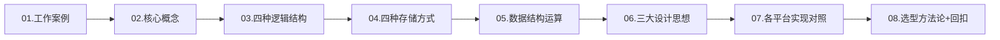
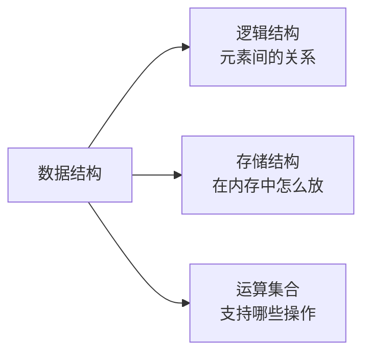
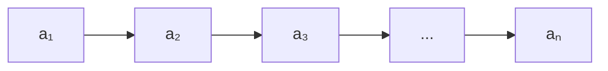
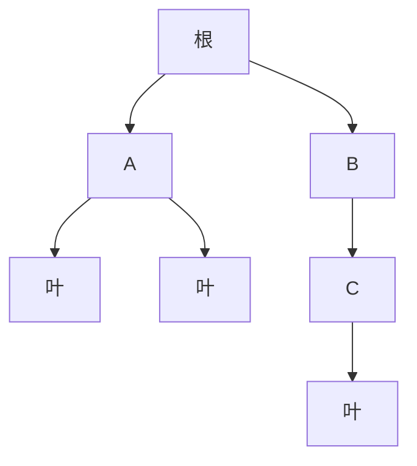
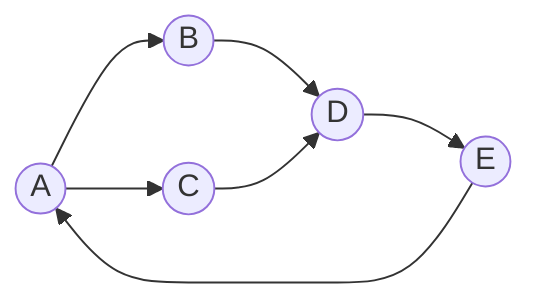
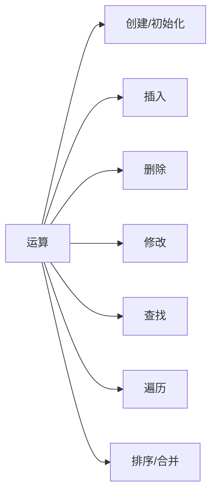
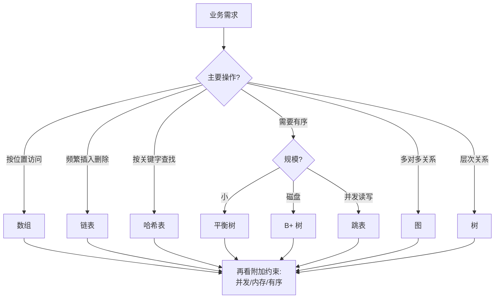

# 02.数据结构设计思想

> 上一篇我们打通了"复杂度分析"的理论地基。本篇往上一层——数据结构本身是如何被设计出来的？四种逻辑结构、四种存储方式、三大核心思想，以及 "面对业务该选哪个" 的方法论。

---

## 目录指引与导读

> 阅读建议：扫一眼二级标题建立全景，再带着"业务怎么选"的问题精读三级。

- [01. 从工作案例说起](#01-从工作案例说起)
  - [1.1 选错结构的事故](#11-选错结构的事故)
  - [1.2 本篇要解决问题](#12-本篇要解决问题)
  - [1.3 全篇结构导航](#13-全篇结构导航)
- [02. 核心概念体系](#02-核心概念体系)
  - [2.1 四个基础术语](#21-四个基础术语)
  - [2.2 数据结构三要素](#22-数据结构三要素)
  - [2.3 程序两大基石](#23-程序两大基石)
- [03. 四种逻辑结构](#03-四种逻辑结构)
  - [3.1 集合结构特性](#31-集合结构特性)
  - [3.2 线性表逻辑](#32-线性表逻辑)
  - [3.3 树形层次关系](#33-树形层次关系)
  - [3.4 图的多对多](#34-图的多对多)
- [04. 四种存储方式](#04-四种存储方式)
  - [4.1 顺序存储原理](#41-顺序存储原理)
  - [4.2 链式存储代价](#42-链式存储代价)
  - [4.3 索引存储应用](#43-索引存储应用)
  - [4.4 散列存储机制](#44-散列存储机制)
- [05. 数据结构运算](#05-数据结构运算)
- [06. 三大设计思想](#06-三大设计思想)
  - [6.1 抽象化ADT思想](#61-抽象化adt思想)
  - [6.2 分治思想运用](#62-分治思想运用)
  - [6.3 权衡取舍法则](#63-权衡取舍法则)
- [07. 各平台实现对照](#07-各平台实现对照)
  - [7.1 标准库映射表](#71-标准库映射表)
  - [7.2 移动端特化版](#72-移动端特化版)
  - [7.3 复杂度速查表](#73-复杂度速查表)
  - [7.4 业务结构映射](#74-业务结构映射)
- [08. 案例回扣收获](#08-案例回扣收获)
- [09. 思考题深练](#09-思考题深练)
- [10. 课后作业实战](#10-课后作业实战)

---

## 01. 从工作案例说起

### 1.1 选错结构的事故

我曾经接手过一个通讯录服务，老代码用 `ArrayList<Contact>` 存全部联系人（约 20 万条），需求是按手机号查人。核心代码：

```java
Contact find(String phone) {
    for (Contact c : list)           // O(N) 全表扫描
        if (c.phone.equals(phone)) return c;
    return null;
}
```

单次查询约 40ms，看起来还能接受。直到某天出了个"导入 50 万联系人后批量比对"的需求——代码变成 `O(N²)`，5 分钟跑不完，直接超时。

我当时做了一个一行代码的改动：`ArrayList` → `HashMap<String, Contact>`，查询 `40ms → 0.01ms`，比对任务 `5 分钟 → 2 秒`。

**问题不在代码写得差，而在数据结构没选对**：线性表擅长"按位置访问"，但对"按关键字查找"束手无策——这是由它**一对一的逻辑结构**决定的先天缺陷。选对结构，比优化代码有用得多。

### 1.2 本篇要解决的问题

- 数据结构 = 逻辑结构 + 存储结构 + 运算集合，三者到底指什么
- 四种逻辑结构（集合/线性/树/图）对应什么业务关系
- 四种存储方式（顺序/链式/索引/散列）在内存中长什么样
- 三大核心设计思想（抽象、分治、权衡）如何指导选型
- 一套可复用的"数据结构选型"决策框架

### 1.3 全篇结构导航



---

## 02. 核心概念体系

### 2.1 四个最基础的术语

| 术语 | 定义 | 案例（学生管理） |
|------|------|----------------|
| 数据（Data） | 能被计算机识别处理的符号集合 | 整个学生库的所有信息 |
| 数据项（Data Item） | 不可再分的最小标识单位 | `学号=20230001` |
| 数据元素（Data Element） | 若干数据项构成的一个整体 | 一条完整的学生记录 |
| 数据结构（Data Structure） | 多个数据元素按某种关系构成的集合 | `List<Student>` / `TreeMap<id, Student>` |

```java
// 数据项 → 数据元素
class Student { int id; String name; int age; }

// 数据元素 → 数据结构
List<Student>            list;   // 线性结构
TreeMap<Integer,Student> tree;   // 树形结构
Map<Integer,Student>     index;  // 散列结构
```

### 2.2 数据结构三要素



三者关系：**同一种逻辑结构可以有多种存储实现，不同存储实现支持的运算效率不同**。例如二叉树（逻辑）既可以用数组存（堆），也可以用指针存（普通 BST），选择取决于业务。

### 2.3 程序两大基石

> Niklaus Wirth，1976：**程序 = 数据结构 + 算法**。

数据结构决定数据如何**存储与关联**，算法决定数据如何**操作与处理**。两者选择相互制约：

| 数据结构 | 查找 | 插入 | 限制 |
|---------|------|------|------|
| 数组 | `O(log N)` 二分 | `O(N)` | 不支持高效插入 |
| 链表 | `O(N)` | `O(1)` | 不支持随机访问 |
| 哈希表 | `O(1)` | `O(1)` | 不支持有序遍历 |
| 平衡树 | `O(log N)` | `O(log N)` | 实现复杂 |

---

## 03. 四种逻辑结构

按数据元素间的关系划分，所有数据结构归为 4 类：

| 结构 | 关系 | 代表 | 业务原型 |
|------|------|------|---------|
| 集合 | 无关系 | Set | 一袋弹珠、在线用户集合 |
| 线性表 | 一对一 | 数组 / 链表 | 排队、日程表 |
| 树 | 一对多 | 二叉树 / B 树 | 组织架构、文件系统 |
| 图 | 多对多 | 邻接表 / 邻接矩阵 | 社交网络、路网 |

### 3.1 集合结构特性

**数学三性**：确定性、互异性、无序性。

> **底层原理**：集合本身只关心"是不是属于"——这是一种**纯关系判断**。HashSet 用哈希函数把元素映射到桶，TreeSet 用红黑树把元素按序组织——同样是集合，"无序集合"和"有序集合"在内存中长得完全不同。

核心操作及复杂度：

| 操作 | HashSet | TreeSet |
|------|---------|---------|
| `add` / `remove` / `contains` | O(1) | O(log N) |
| 交集 ∩ | O(min(m,n)) | O(m log n) |
| 并集 ∪ | O(m+n) | O(m log n) |
| 差集 − | O(m) | O(m log n) |

```java
Set<String> online  = new HashSet<>(Arrays.asList("alice", "bob", "charlie"));
Set<String> premium = new HashSet<>(Arrays.asList("bob", "david", "eve"));

Set<String> inter = new HashSet<>(online); inter.retainAll(premium);  // 交：{bob}
Set<String> union = new HashSet<>(online); union.addAll(premium);     // 并：5 个
Set<String> diff  = new HashSet<>(online); diff.removeAll(premium);   // 差：{alice, charlie}
```

### 3.2 线性表逻辑

一对一关系，除首尾外每个元素都有唯一前驱和后继。



顺序表 vs 链表的核心对比：

| 维度 | 顺序表（数组） | 链表 |
|------|--------------|------|
| 内存布局 | 连续 | 离散 |
| 随机访问 | `O(1)` | `O(N)` |
| 头部插入 | `O(N)` | `O(1)` |
| 尾部插入 | 均摊 `O(1)` | `O(1)`（有尾指针） |
| CPU 缓存 | 友好 | 不友好 |
| 内存开销 | 仅数据 | 数据 + 指针（32B 节点仅存 4B 数据时浪费 50%+） |

### 3.3 树

**定义**：n 个节点的有限集，具有层次关系。



关键子类：二叉树、BST、AVL、红黑树、B+ 树、堆、Trie。后续章节会逐一展开。

### 3.4 图的多对多

顶点 + 边，多对多关系。分为有向/无向、有权/无权。

> **图的存储两难**：邻接矩阵 `O(V²)` 空间但查"任意两点是否相连"是 `O(1)`；邻接表 `O(V+E)` 空间但查邻接需要遍历。**稠密图用矩阵，稀疏图用邻接表**——社交网络通常稀疏（每人朋友数远小于总人数），所以微博/微信的关系数据底层都用邻接表 + 哈希索引。



典型场景：社交关系、路径规划、依赖分析、知识图谱。

---

## 04. 四种存储方式

逻辑结构说的是"关系"，存储方式说的是"内存里长什么样"。

### 4.1 顺序存储

**连续内存 + 下标计算地址**。

```
地址计算：a[i] 的地址 = base_addr + i × sizeof(elem)
int 数组 base=0x1000：
  a[0]→0x1000  a[1]→0x1004  a[2]→0x1008  a[3]→0x100C
```

**隐藏优势——CPU 缓存友好**：CPU 每次加载一整个缓存行（通常 64 字节），连续内存一次加载能覆盖多个元素，遍历命中率 > 95%。

```
顺序：[a₀][a₁][a₂][a₃][a₄][a₅][a₆][a₇]
      ├──── 缓存行1 ───┤├─── 缓存行2 ───┤
      ↑ 加载 a₀ 时 a₁~a₃ 自动进缓存
```

### 4.2 链式存储代价

**离散内存 + 指针链接**。

```cpp
struct Node {
    int data;          // 4 字节
    Node* next;        // 8 字节（64位系统）
};
// 每节点 16 字节（含对齐），指针占 50%
```

代价：空间开销大、缓存不友好。收益：插入删除 O(1)、动态扩展。

> **指针膨胀**：节点数据越小，指针占比越离谱。存 `int` 时指针占 50%，存 `bool` 时甚至到 80%。**这就是为什么 Linux 内核 list_head 选择"侵入式链表"（指针嵌入业务结构体内部）——本质就是把指针成本平摊到原本就要分配的对象上。**

### 4.3 索引存储应用

**数据 + 索引表**，索引表告诉你数据在哪。数据库的 B+ 树索引是典型。

```
B+ 树索引查 ID=35 的流程：
  根 → [30,40] → 叶子数据页
  通常 3 次磁盘 IO，而全表扫描可能上万次
```

> **索引为什么是 B+ 树而不是红黑树**：磁盘 IO 单位是页（4KB-16KB），一次磁盘读能拉回大量数据。B+ 树每个节点装数百个 key，树高 3-4 层就能索引十亿条数据；红黑树每节点 1 个 key，索引十亿要 30 层——磁盘 IO 是百倍差距。

### 4.4 散列存储机制

**哈希函数直接算出地址**：`key → hash(key) → 地址`。

```
常用散列函数：
  除留余数法：h(k) = k % p           （p 取质数）
  乘法散列：  h(k) = ⌊m·(k·A mod 1)⌋（A≈0.618）
  全域散列：  h(k) = ((a·k+b) mod p) mod m

冲突解决：
  链地址法（Java HashMap）
  开放寻址（Python dict）
  再散列
```

哈希表是平均 O(1) 的明星，但没有"免费"的 O(1)——换来的是空间浪费（负载因子 < 1）和冲突处理开销。

> **负载因子的物理含义**：Java HashMap 默认 0.75，意为"装 75% 就扩容"——这是空间和时间的折中。装得太满冲突率指数上升（链表退化），装得太空浪费内存。0.75 是 Doug Lea 经过大量实验得出的经验最优。

---

## 05. 数据结构运算

一组标准运算构成数据结构的接口：



每种运算在不同存储结构上的复杂度差异巨大。这正是**选型的决策依据**。

---

## 06. 三大核心设计思想

### 6.1 抽象化——ADT 思想

把"是什么"（接口）和"怎么做"（实现）分离。

```java
interface Stack<E> {
    void push(E e);
    E pop();
    E peek();
    boolean isEmpty();
}

class ArrayStack<E> implements Stack<E> { /* 数组实现 */ }
class LinkedStack<E> implements Stack<E> { /* 链表实现 */ }

// 用户代码无感切换
Stack<Integer> s = new ArrayStack<>();
// 性能不满足？换一行：
Stack<Integer> s = new LinkedStack<>();
```

抽象的层次：现实问题 → 识别实体关系 → 选择逻辑结构 → 选择存储结构 → 编码。

### 6.2 分治思想运用

```
solve(problem):
    if 基本情况: return 直接求解
    subs   = divide(problem)
    result = [solve(s) for s in subs]
    return combine(result)
```

归并排序是教科书级例子：

```java
static int[] mergeSort(int[] a) {
    if (a.length <= 1) return a;
    int m = a.length / 2;
    int[] left  = mergeSort(Arrays.copyOfRange(a, 0, m));
    int[] right = mergeSort(Arrays.copyOfRange(a, m, a.length));
    return merge(left, right);
}
// T(n) = 2T(n/2) + O(n) → O(n log n)
```

> **主定理（Master Theorem）**：递归式 `T(n) = aT(n/b) + f(n)` 的解由 `f(n)` 与 `n^(log_b a)` 的大小关系决定。归并排序 `a=2, b=2, f(n)=O(n)`，恰好平衡，得 `O(n log n)`——这是分治算法复杂度分析的核心工具。

分治在数据结构中的化身：

| 结构 | 分治体现 |
|------|---------|
| BST | 左子树 < 根 < 右子树，每次排除一半 |
| 堆 | 只处理根到叶一条路径（log N） |
| B 树 | 多路分支，每层比较 O(log m) |
| 跳表 | 多层索引，每层跳过约一半 |
| 线段树 | 区间递归二分 |

### 6.3 权衡——No Free Lunch

没有一种结构在所有操作上都最优。以"有序数据存储"为例：

| 方案 | 查找 | 插入 | 删除 | 代价 |
|------|------|------|------|------|
| 有序数组 | `O(log N)` | `O(N)` | `O(N)` | 写太慢 |
| BST | `O(log N)` | `O(log N)` | `O(log N)` | 可能退化成链表 |
| 红黑树 | `O(log N)` | `O(log N)` | `O(log N)` | 实现复杂 |
| 跳表 | `O(log N)` | `O(log N)` | `O(log N)` | 额外 O(N) 空间 |
| B+ 树 | `O(log N)` | `O(log N)` | `O(log N)` | 内存大、磁盘友好 |

**工程决策矩阵**：

| 约束 | 推荐 | 理由 |
|------|------|------|
| 读多写少 | 数组 / B+ 树 | 缓存友好 |
| 写多读少 | 链表 / LSM 树 | 顺序写 |
| 内存紧张 | 位图 / 布隆过滤器 | 极省空间 |
| 需要排序 | 平衡树 / 跳表 | 天然有序 |
| 追求极快查找 | 哈希表 | `O(1)` |
| 磁盘存储 | B / B+ 树 | 减少 IO |

---

## 07. 各平台实现对照

### 7.1 标准库映射表

| 抽象 | Java | C++ STL | Go | Swift | Kotlin | Rust |
|-----|------|--------|----|-------|--------|------|
| 动态数组 | ArrayList | vector | slice | Array | MutableList | Vec |
| 链表 | LinkedList | list | container/list | — | LinkedList | LinkedList |
| 哈希表 | HashMap | unordered_map | map | Dictionary | HashMap | HashMap |
| 有序映射 | TreeMap | map | — | — | TreeMap | BTreeMap |
| 哈希集合 | HashSet | unordered_set | — | Set | HashSet | HashSet |
| 栈 | ArrayDeque | stack | slice | Array | ArrayDeque | Vec |
| 队列 | ArrayDeque | queue | list | Array | ArrayDeque | VecDeque |
| 优先队列 | PriorityQueue | priority_queue | heap | — | PriorityQueue | BinaryHeap |

### 7.2 移动端特化实现

Android 对小规模 / int key 的内存优化：

```java
SparseArray<String>      sparse = new SparseArray<>();   // 替代 HashMap<Integer,V>，免装箱
ArrayMap<String,Integer> map    = new ArrayMap<>();      // 替代 HashMap<String,V>，小数据量省内存
SparseBooleanArray       flags  = new SparseBooleanArray();
```

Swift 的 COW（写时复制）让值类型集合也能零拷贝共享：

```swift
var a = [1,2,3,4,5]
var b = a        // 共享底层存储
b.append(6)      // 此时才真正拷贝
```

### 7.3 复杂度速查表

| 结构 | 访问 | 搜索 | 插入 | 删除 | 空间 |
|------|------|------|------|------|------|
| 数组 | O(1) | O(N) | O(N) | O(N) | O(N) |
| 链表 | O(N) | O(N) | O(1) | O(1) | O(N) |
| 栈/队列 | — | O(N) | O(1) | O(1) | O(N) |
| 哈希表 | — | O(1) | O(1) | O(1) | O(N) |
| BST | O(log N) | O(log N) | O(log N) | O(log N) | O(N) |
| 红黑树 | O(log N) | O(log N) | O(log N) | O(log N) | O(N) |
| 堆 | O(1)* | O(N) | O(log N) | O(log N) | O(N) |
| B+ 树 | O(log N) | O(log N) | O(log N) | O(log N) | O(N) |

> *堆的 O(1) 指获取最值。

### 7.4 业务结构映射

| 业务 | 推荐结构 | 原因 |
|------|---------|------|
| 列表展示 | ArrayList | 随机访问快 |
| 撤销重做 | 栈 | LIFO |
| 任务调度 | 优先队列 | 按优先级出队 |
| 社交关系 | 邻接表 | 多对多 |
| 缓存（LRU） | HashMap + 双向链表 | O(1) 查 + O(1) 淘汰 |
| 自动补全 | Trie | 前缀匹配 |
| 排行榜 | 跳表 / 红黑树 | 有序 + O(log N) |
| 大规模去重 | 布隆过滤器 | 极省空间 |
| 文件系统 / DB 索引 | B+ 树 | 磁盘友好 |
| URL 路由 | 前缀树 / 基数树 | 路径匹配 |

---

## 08. 本篇收获与案例回扣

### 8.1 回到开篇的通讯录事故

我当时把 `ArrayList` 换成 `HashMap` 的那一秒，其实在做的是：

- **逻辑结构**：从"线性表（一对一）"换成"集合/映射（按关键字存取）"
- **存储结构**：从"顺序存储"换成"散列存储"
- **运算复杂度**：按 `phone` 查找 `O(N) → O(1)`

为什么老代码跑了很久都没出问题？因为数据规模没到阈值——`N = 2000` 时，`O(N)` 才 2000 次比较，40ms 能接受；`N = 500000` 时就是 25 万次 × N，直接雪崩。**选错数据结构不一定当场出问题，但规模一涨就是炸**。

### 8.2 三大核心收获

一套可迁移的选型决策流程：



**三条黄金法则**：

1. **先问操作，再选结构**：哪个操作最频繁，就优先保证它是 `O(1)` 或 `O(log N)`
2. **规模决定代价**：`N < 100` 时什么结构都够用；过 10⁴ 就必须认真选
3. **抽象先于实现**：先想清楚要的是 "Stack / Queue / Map / Set"，再谈用数组还是链表实现

---

## 09. 思考题

1. **基础理解**：为什么说所有复杂结构（树、图、哈希表）最终都可以用数组或链表实现？分别画出"数组表示完全二叉树"和"邻接表表示有向图"的内存布局。
2. **抽象思维**：如果要设计一个"浏览器前进/后退"功能，你会把它抽象成 List 还是 Deque？为什么说"选对 ADT 比选对底层实现更重要"？
3. **设计权衡**：Redis ZSet 用的是跳表而非红黑树。从①实现复杂度 ②范围查询效率 ③并发友好度 三个维度，解释这个决策。
4. **演进思考**：2010s 的无锁数据结构解决了多核并发，下一代数据结构可能要解决什么问题？（提示：PMem 持久化内存、AI 向量检索、CRDT 最终一致性）
5. **开放思考**：有没有一种"神奇"的数据结构，在所有操作上都优于其他？如果没有，为什么？（提示：信息论的下界）

---

## 10. 课后作业实战

**作业 1（必做）——替身实验**

用你熟悉的语言实现三个版本的 `Contact find(String phone)`，数据集 50 万条：

- V1：`ArrayList` 全表扫描
- V2：`HashMap<String, Contact>` 按手机号查
- V3：`TreeMap<String, Contact>` 按手机号查

分别测 10 万次随机查询的 P50/P99，画成柱状图。回答：为什么 V2 比 V3 还快？什么时候应该选 V3？

**作业 2（必做）——选型决策矩阵**

针对下列 5 个业务需求，各写出一份"推荐数据结构 + 理由 + 拒选的备选方案"分析：

1. 秒杀系统的黑名单（判断某用户是否被拉黑）
2. 订单状态机的历史变更日志
3. 游戏实时排行榜（插入分数、查排名、Top 100）
4. IM 未读消息数
5. 配置中心的多级 key（`app.module.feature.name`）

**作业 3（进阶）——设计抽象层**

为"短链服务"设计一套 ADT，要求：

- 支持 `shorten(longUrl) → shortCode`
- 支持 `expand(shortCode) → longUrl`
- 支持 `stats(shortCode) → 点击次数`
- 支持"过期自动清理"

给出：ADT 接口定义、至少两种底层实现方案（纯内存 vs 内存+Redis+MySQL 分层）、每种方案的各操作复杂度分析。

