# 02.数据结构设计思想
#### 目录介绍
- [01.数据结构概念](#01数据结构概念)
  - [1.1 数据结构介绍](#11-数据结构介绍)
  - [1.2 数据结构定义](#12-数据结构定义)
  - [1.3 数据发展历程](#13-数据发展历程)
- [02.核心概念体系](#02核心概念体系)
  - [2.1 基本概念](#21-基本概念)
  - [2.2 数据](#22-数据)
  - [2.3 数据项](#23-数据项)
  - [2.4 数据元素](#24-数据元素)
  - [2.5 数据结构](#25-数据结构)
  - [2.6 算法](#26-算法)
  - [2.7 概念间关系](#27-概念间关系)
- [03.四种基本类型](#03四种基本类型)
  - [3.1 数据结构分类](#31-数据结构分类)
  - [3.2 集合类型](#32-集合类型)
  - [3.3 线性表](#33-线性表)
  - [3.4 树类型](#34-树类型)
  - [3.5 图类型](#35-图类型)
- [04.数据存储方式](#04数据存储方式)
  - [4.1 顺序存储](#41-顺序存储)
  - [4.2 链式存储](#42-链式存储)
  - [4.3 索引存储](#43-索引存储)
  - [4.4 散列存储](#44-散列存储)
- [05.数据结构运算](#05数据结构运算)
  - [5.1 基本运算](#51-基本运算)
  - [5.2 运算时序图](#52-运算时序图)
- [06.核心设计思想](#06核心设计思想)
  - [6.1 抽象化原则](#61-抽象化原则)
  - [6.2 分治思想](#62-分治思想)
  - [6.3 权衡思想](#63-权衡思想)
  - [6.4 选择的原则](#64-选择的原则)
- [07.各平台数据结构实现](#07各平台数据结构实现)
  - [7.1 标准库数据结构对照](#71-标准库数据结构对照)
  - [7.2 移动端数据结构选择](#72-移动端数据结构选择)
  - [7.3 数据结构复杂度速查表](#73-数据结构复杂度速查表)
  - [7.4 数据结构与业务场景映射](#74-数据结构与业务场景映射)


## 01.数据结构概念

### 1.1 数据结构介绍

数据结构不是一门研究数据计算的学科，而是研究数据与数据之间关系的。

数据结构的起源：美国的高纳德教授，于1968年开设一门《基本算法》的课程，开创的数据结构和算法的先河。

提出一个公式：**数据结构 + 算法 = 程序**

这个公式由 Niklaus Wirth 提出（《Algorithms + Data Structures = Programs》，1976年），揭示了程序设计的两大核心支柱：

```
数据结构 → 决定数据如何组织、存储和关联
算法     → 决定数据如何被操作和处理
程序     → 两者的结合，解决实际问题

类比：
  数据结构 = 仓库的货架布局
  算法     = 取货/放货的流程
  程序     = 整个仓库管理系统
```

**为什么学数据结构？** 选择合适的数据结构，往往比优化算法本身更有效。同样的问题，用数组解可能是 O(N²)，换成哈希表就能变成 O(N)。数据结构的选择是算法效率的基石。

### 1.2 数据结构定义

数据结构（Data Structure）是计算机存储、组织数据的方式。它是数据元素相互之间存在的一种或多种特定关系的集合。数据结构反映了数据元素之间的逻辑关系和在计算机中的存储关系。

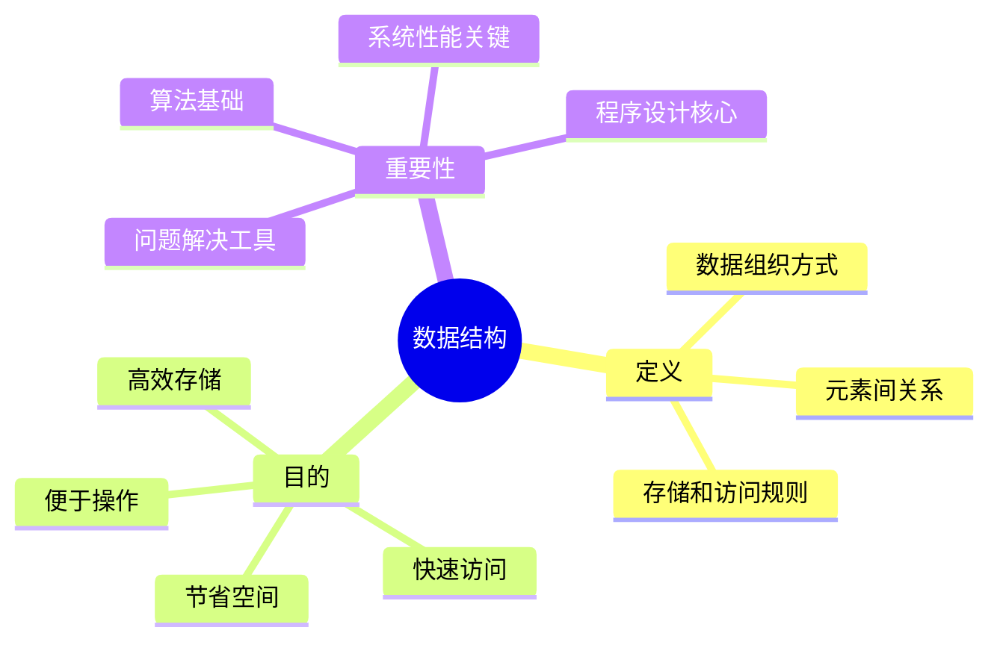

### 1.3 数据发展历程

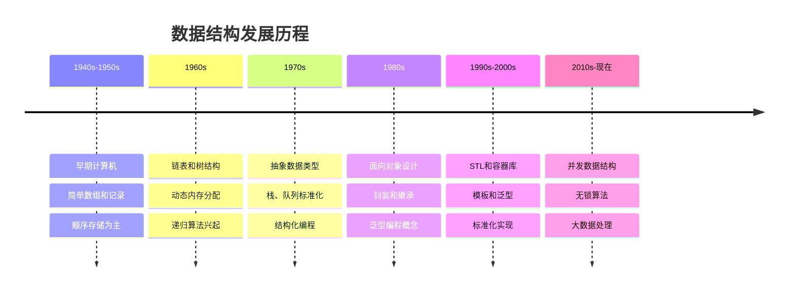

## 02.核心概念体系

### 2.1 基本概念

数据：能够输入计算机的描述客观事物的符号。

数据项：描述事物的其中一项指标。

数据元素：用于描述一个完整的事物。

数据结构：由数据元素和元素之间的关系构成的一个整体。

算法：数据结构所具备的功能（解决问题的方法）。

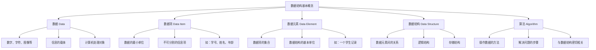

### 2.2 数据

**定义**：数据是信息的载体，是描述客观事物属性的数、字符以及所有能输入到计算机中并被计算机程序识别和处理的符号的集合。

**特点**：

- 多样性：数字、文本、图像、音频、视频等
- 可处理性：能被计算机识别和操作
- 信息性：承载着有意义的信息

**深入理解——数据在计算机中的本质**：

在计算机底层，所有数据最终都是**二进制位（bit）**的序列。一个整数 42 在内存中是 `00101010`，字符 'A' 是 `01000001`（ASCII 编码），浮点数 3.14 则遵循 IEEE 754 标准编码。数据结构的本质就是**约定这些二进制位的组织方式和解读规则**。

```
数据的层次抽象：

物理层：电压高低 → 0/1
位层：    01000001 01000010 01000011
字节层：  0x41      0x42      0x43
编码层：  'A'       'B'       'C'
语义层：  成绩等级 A、B、C

同样的二进制 01000001：
  作为整数解读 → 65
  作为字符解读 → 'A'
  作为颜色分量 → 透明度 25.5%
```

### 2.3 数据项

**定义**：数据项是数据的最小单位，是不可分割的最小标识单位。

**特征**：

- 原子性：不可再分
- 标识性：具有独特含义
- 基础性：构成数据元素的基础

**具体案例**：

```
以"学生"为例：
数据项：学号(20230001)、姓名(张三)、年龄(20)、性别(男)、成绩(95.5)

数据项有两类：
1. 初等数据项：不可再分的原子项
   - 学号：20230001（一个整数）
   - 年龄：20（一个整数）

2. 组合数据项：由多个初等数据项构成
   - 出生日期：年(2003) + 月(05) + 日(15)
   - 地址：省(广东) + 市(深圳) + 区(南山) + 街道(科技园)
```

### 2.4 数据元素

**定义**：数据元素是数据的基本单位，由若干数据项组成，是数据结构中讨论的基本单位。

**组成**：

- 由多个相关数据项构成
- 在数据结构中作为整体处理
- 具有完整的语义含义

**案例——不同场景下的数据元素**：

| 应用场景 | 数据元素 | 包含的数据项 |
|---------|---------|------------|
| 学生管理系统 | 一条学生记录 | 学号、姓名、年龄、专业 |
| 电商系统 | 一个商品 | 商品ID、名称、价格、库存 |
| 社交网络 | 一个用户 | 用户ID、昵称、头像URL、关注列表 |
| 操作系统 | 一个进程 | PID、状态、优先级、内存地址 |

```java
// 在编程中，数据元素通常对应一个对象或结构体
public class Student {        // 数据元素：一个学生
    int id;                   // 数据项：学号
    String name;              // 数据项：姓名
    int age;                  // 数据项：年龄
    String major;             // 数据项：专业
}

// 数据结构：由多个数据元素按特定关系组成
List<Student> students;       // 线性结构
TreeMap<Integer, Student> studentTree; // 树形结构
```

### 2.5 数据结构

**定义**：数据结构是相互之间存在一种或多种特定关系的数据元素的集合。

**三要素**：

1. **逻辑结构**：数据元素间的逻辑关系
2. **存储结构**：数据在计算机中的存储方式
3. **运算集合**：对数据结构的操作方法

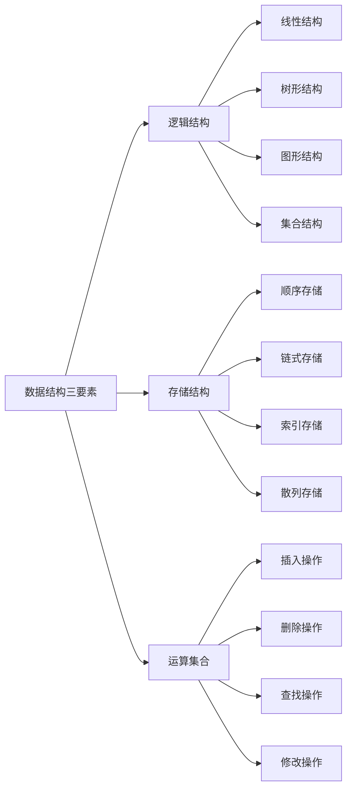

### 2.6 算法

**定义**：算法是解决特定问题求解步骤的描述，是指令的有限序列。

**特性**：

- **有穷性**：算法必须在有限步骤内结束
- **确定性**：每一步都有确切的定义
- **可行性**：每一步都能够执行
- **输入**：有零个或多个输入
- **输出**：有一个或多个输出

### 2.7 概念间关系

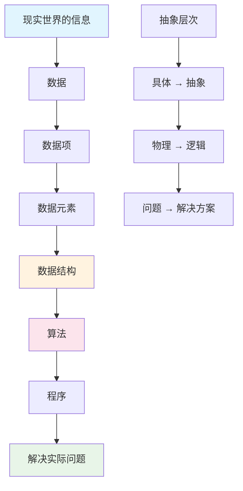

## 03.四种基本类型

根据数据元素间关系的不同，数据结构可以分为四种基本类型：

1. 集合：元素之间没有任何关系 
2. 线性表：元素之间存在一对一关系（数组）。数组、链表、功能受限的表（栈，队列） 
3. 树：元素之间存在一对多关系。普通树、二叉树、完全二叉树、满二叉树、有序二叉树 
4. 图：元素之间存在多对多关系。邻接表、表的遍历（深度优先、广度优先）、最短路径

### 3.1 数据结构分类

**按逻辑结构分类**：逻辑结构描述的是数据元素之间的逻辑关系，与数据在计算机中的存储方式无关。

```
逻辑结构分类：

1. 集合结构（无关系）
   - 元素之间除了"同属一个集合"外无其他关系
   - 例：一袋弹珠、一个班级的学生

2. 线性结构（一对一）
   - 元素之间存在前驱和后继关系
   - 例：排队、日程表、通话记录

3. 树形结构（一对多）
   - 元素之间存在层次关系
   - 例：组织架构、文件系统、HTML DOM

4. 图形结构（多对多）
   - 元素之间存在任意关系
   - 例：社交网络、交通路网、互联网
```

**按存储结构分类**：存储结构描述的是数据在计算机内存中的存储方式。

```
存储结构分类：

1. 顺序存储：连续内存块，通过偏移量访问
   逻辑关系 → 物理位置相邻来表达

2. 链式存储：离散内存块，通过指针链接
   逻辑关系 → 指针/引用来表达

3. 索引存储：数据 + 索引表
   逻辑关系 → 索引表来表达

4. 散列存储：通过哈希函数直接定位
   逻辑关系 → 哈希函数来表达
```

**疑惑**：逻辑结构和存储结构是什么关系？

**答疑**：逻辑结构是"问题空间"的抽象，存储结构是"解决空间"的实现。同一种逻辑结构可以用不同的存储结构实现。例如二叉树（逻辑结构）既可以用数组（顺序存储）实现，也可以用链表（链式存储）实现。选择哪种存储结构取决于应用场景——数组实现的二叉树适合完全二叉树（如堆），链表实现适合一般二叉树。

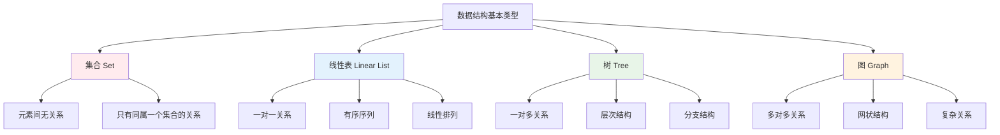

### 3.2 集合类型

**定义**：集合是数据元素间除了"同属一个集合"外，没有任何其他关系的数据结构。

**特征**：

- 元素间无序
- 元素唯一性
- 无结构关系
- 只关心元素的存在性

**设计原理——集合的数学基础**：

集合（Set）源自数学中的集合论，满足三个基本性质：确定性（元素是否属于集合是确定的）、互异性（集合中没有重复元素）、无序性（元素没有先后顺序）。

**集合的核心操作及复杂度**：

| 操作 | 说明 | HashSet | TreeSet |
|------|------|---------|---------|
| add | 添加元素 | O(1) | O(log N) |
| remove | 删除元素 | O(1) | O(log N) |
| contains | 判断是否存在 | O(1) | O(log N) |
| 交集（intersection） | 两集合共有元素 | O(min(m,n)) | O(m log n) |
| 并集（union） | 两集合所有元素 | O(m+n) | O(m log n) |
| 差集（difference） | A有B没有的 | O(m) | O(m log n) |

```python
# 集合操作在实际开发中极为常用
users_online = {"alice", "bob", "charlie"}
users_premium = {"bob", "david", "eve"}

# 交集：既在线又是会员的用户
users_online & users_premium  # {"bob"}

# 并集：所有相关用户
users_online | users_premium  # {"alice", "bob", "charlie", "david", "eve"}

# 差集：在线但非会员的用户
users_online - users_premium  # {"alice", "charlie"}
```

### 3.3 线性表

**定义**：线性表是由n个数据元素组成的有限序列，元素间存在一对一的关系。

**特征**：

- 有序性：元素有先后顺序
- 有限性：元素个数有限
- 同质性：元素类型相同
- 线性关系：除首尾元素外，每个元素都有唯一前驱和后继

**设计原理——线性表的抽象数据类型（ADT）**：

```
ADT LinearList {
    数据：n 个元素 a₁, a₂, ..., aₙ（n ≥ 0）
    
    操作：
        init()              → 创建空线性表
        isEmpty()           → 判断是否为空
        size()              → 返回元素个数
        get(index)          → 获取第 index 个元素
        insert(index, elem) → 在 index 处插入元素
        remove(index)       → 删除第 index 个元素
        find(elem)          → 查找元素的位置
        traverse()          → 遍历所有元素
}
```

**顺序表 vs 链表——选择的核心依据**：

| 维度 | 顺序表（数组） | 链表 |
|------|--------------|------|
| 内存布局 | 连续 | 离散 |
| 随机访问 | O(1)，直接计算偏移 | O(N)，必须遍历 |
| 头部插入 | O(N)，需要移动所有元素 | O(1)，修改指针 |
| 尾部插入 | 均摊 O(1) | O(1)（持有尾指针时） |
| 中间插入 | O(N) | O(1)（已定位时） |
| CPU 缓存 | 友好（连续内存，预取有效） | 不友好（随机跳转） |
| 内存开销 | 数据本身 | 数据 + 每个节点一个/两个指针 |

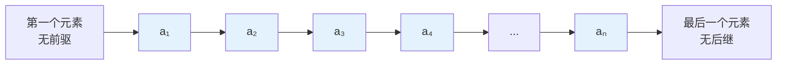

线性表的分类

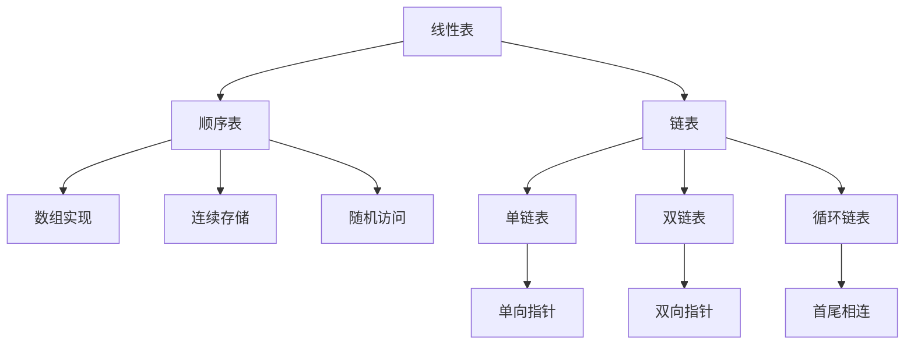

### 3.4 树类型

**定义**：树是n个节点的有限集合，具有层次关系的数据结构。

**特征**：

- 层次性：有明确的层次结构
- 递归性：子树也是树
- 有序性：子树有左右顺序
- 连通性：任意两节点间有唯一路径

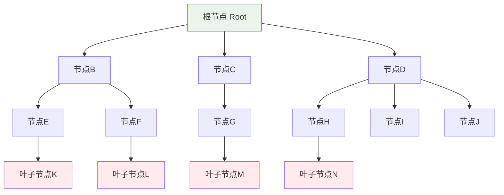

### 3.5 图类型

**定义**：图是由顶点集合和边集合组成的数据结构，表示多对多的关系。

**特征**：

- 复杂关系：顶点间可以有任意关系
- 网状结构：非线性、非层次
- 连通性：可达性分析
- 路径概念：顶点间的连接序列

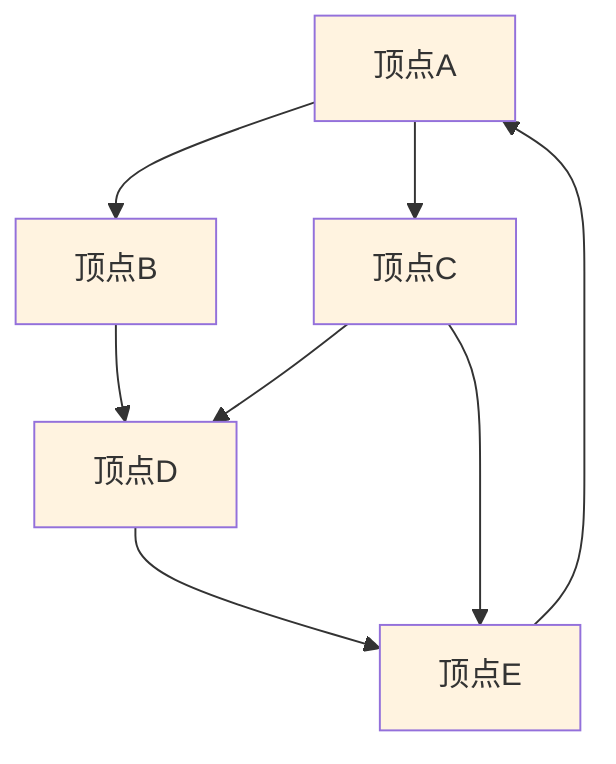


## 04.数据存储方式

1. 顺序：在一块连续的内存空间上存储元素与元素之间的关系。优点是查找速度快（随机访问），不易产生内存碎片，但是对内存要求高，添加删除不方便。 
2. 非顺序（链式）：元素随机存储内存空间中，元素中存储指向其他元素的地址。优点是对内存要求低，添加删除方便，查找速度慢，不能随机访问，容易产生内存碎片。

数据结构在计算机中的存储方式决定了数据的组织形式和访问效率。主要有四种基本存储方式：

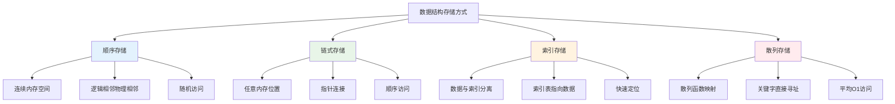

### 4.1 顺序存储

**定义**：将数据元素存放在地址连续的存储单元里，逻辑关系和物理关系是一致的。

**优点**：

- 随机访问：可以通过下标直接访问
- 存储密度高：不需要额外的指针空间
- 实现简单：数组是最典型的实现

**缺点**：

- 插入删除效率低：需要移动大量元素
- 存储空间预分配：可能造成浪费或不足
- 大小固定：难以动态调整

**内存级别的理解——地址计算公式**：

```
假设数组起始地址为 base_addr，每个元素占 size 字节：

元素 a[i] 的内存地址 = base_addr + i × size

例如：int 数组（size=4字节），base_addr = 0x1000
  a[0] → 0x1000
  a[1] → 0x1004
  a[2] → 0x1008
  a[3] → 0x100C

这就是 O(1) 随机访问的原理：一次乘法 + 一次加法 = 直接得到地址
```

**CPU 缓存友好性——顺序存储的隐藏优势**：

现代 CPU 存在多级缓存（L1/L2/L3），当访问某个内存地址时，CPU 会将该地址附近的一整个**缓存行（Cache Line，通常 64 字节）**都加载进缓存。顺序存储的元素在内存中紧密排列，一次缓存加载就能获取多个元素，后续访问直接命中缓存，速度极快。

```
顺序存储的缓存表现：
[a₀][a₁][a₂][a₃][a₄][a₅][a₆][a₇]  ← 连续内存
├──── 缓存行1 ────┤├──── 缓存行2 ────┤

访问 a₀ 时：加载缓存行1，a₁~a₃ 自动进入缓存
访问 a₁ 时：缓存命中！无需访问主存
→ 遍历数组时，缓存命中率极高（>95%）

链式存储的缓存表现：
[a₀]        [a₃]    [a₁]         [a₂]  ← 分散内存
                                          
访问 a₀ 时：加载的缓存行可能不包含 a₁
访问 a₁ 时：缓存未命中，需要访问主存
→ 遍历链表时，缓存命中率很低
```

### 4.2 链式存储

**定义**：数据元素存储在任意的存储单元里，通过指针来表示元素间的逻辑关系。

**优点**：

- 动态分配：根据需要分配内存
- 插入删除高效：只需修改指针
- 灵活性强：大小可动态调整

**缺点**：

- 顺序访问：不能随机访问元素
- 额外空间：需要存储指针
- 内存不连续：缓存性能较差

**设计原理——指针的本质**：

指针本质上就是一个**内存地址**（64 位系统上占 8 字节）。链式存储通过在每个节点中存储下一个节点的地址，将物理上分散的节点在逻辑上串联起来。

```c
// 单链表节点的内存布局（64位系统）
struct Node {
    int data;          // 4 字节（数据域）
    // 4 字节 padding  // 对齐填充
    struct Node* next; // 8 字节（指针域）
};
// 每个节点总共 16 字节，其中指针占 50%！
// 如果数据是 char（1字节），指针的开销占比高达 8/16 = 50%

// 这就是链表"空间开销大"的原因
// 对比数组：存 1000 个 int 只需 4000 字节
// 链表：存 1000 个 int 需要 16000 字节（4倍）
```

### 4.3 索引存储

**定义**：除了存储数据元素外，还建立附加的索引表来指示元素的存储地址。

**优点**：

- 快速定位：通过索引快速找到数据
- 灵活访问：支持多种访问方式
- 空间效率：数据和索引分离

**缺点**：

- 额外开销：需要维护索引表
- 复杂性：实现相对复杂
- 更新成本：修改数据需要更新索引

**工业实践——数据库索引**：

```
数据库 B+ 树索引的结构：

              [索引根节点]
              /    |    \
         [10,20] [30,40] [50,60]
          / | \   / | \   / | \
        数据页  数据页  数据页

查找 ID=35 的记录：
1. 根节点：35 > 20，走右子树 [30,40]
2. 中间节点：30 ≤ 35 ≤ 40，走中间
3. 叶子节点：定位到具体数据页
→ 只需 3 次磁盘IO，而全表扫描可能需要上万次
```

### 4.4 散列存储

**定义**：根据元素的关键字直接计算出该元素的存储地址，也称为哈希存储。

**优点**：

- 快速访问：平均O(1)时间复杂度
- 直接寻址：通过散列函数直接定位
- 高效查找：适合大量数据的快速检索

**缺点**：

- 散列冲突：不同关键字可能映射到同一地址
- 空间浪费：可能有空闲的存储位置
- 散列函数设计：需要设计好的散列函数

**核心原理——散列函数的设计**：

```
散列存储的核心思想：key → hash(key) → 存储地址

理想情况：每个 key 映射到唯一地址 → O(1) 访问
实际情况：不同 key 可能映射到同一地址（冲突）→ 需要冲突解决策略

常用散列函数：
1. 除留余数法：h(key) = key % p（p 通常取质数）
2. 乘法散列法：h(key) = ⌊m × (key × A mod 1)⌋（A 推荐 0.6180339...）
3. 全域散列法：h(key) = ((a×key + b) mod p) mod m（随机选 a,b）

冲突解决：
1. 链地址法：每个槽位维护一个链表（Java HashMap 采用）
2. 开放寻址法：冲突时探测下一个空槽（Python dict 采用）
3. 再散列法：使用第二个散列函数
```

## 05.数据结构运算

### 5.1 基本运算

数据结构的运算是指对数据结构中的数据元素进行的各种操作。这些运算构成了数据结构的接口，定义了如何使用数据结构。

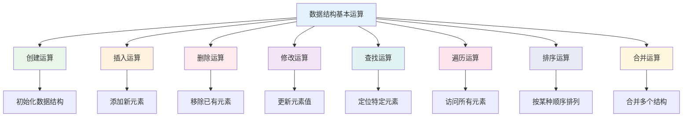

### 5.2 运算时序图

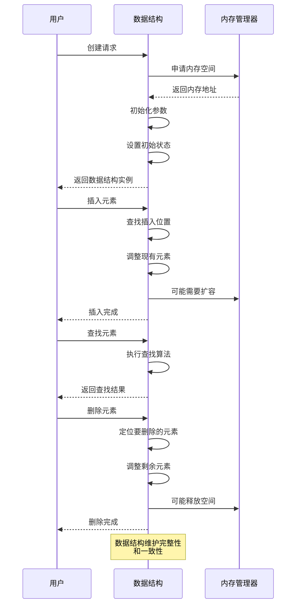

## 06.核心设计思想

### 6.1 抽象化原则

**定义**：将复杂的现实问题抽象为数学模型，隐藏实现细节，突出本质特征。

**体现**：

- **数据抽象**：将现实中的对象抽象为数据元素
- **操作抽象**：将复杂操作抽象为简单接口
- **结构抽象**：将复杂关系抽象为简单的逻辑结构

**核心设计原则——ADT（抽象数据类型）**：

ADT 是数据结构设计中最重要的概念之一。它将数据的"是什么"（接口）和"怎么做"（实现）分离，使得用户只关心操作，不关心底层实现。

```java
// ADT 的典型体现——Java 接口
public interface Stack<E> {
    void push(E element);    // 入栈
    E pop();                 // 出栈
    E peek();                // 查看栈顶
    boolean isEmpty();       // 是否为空
    int size();              // 元素个数
}

// 实现1：基于数组
public class ArrayStack<E> implements Stack<E> { ... }

// 实现2：基于链表
public class LinkedStack<E> implements Stack<E> { ... }

// 用户代码完全不需要知道底层实现是什么
Stack<Integer> stack = new ArrayStack<>();
// 如果性能不满足，只需切换实现：
Stack<Integer> stack = new LinkedStack<>();
// 其余代码完全不用修改！
```

**抽象的层次——从问题域到代码**：

```
现实问题：图书馆管理系统
  ↓ 第一层抽象：识别实体和关系
实体：书籍、读者、借阅记录
关系：读者 ←→ 书籍（多对多）
  ↓ 第二层抽象：选择逻辑结构
书籍列表 → 线性表（按编号排序）
借阅关系 → 图/映射
  ↓ 第三层抽象：选择存储结构
书籍列表 → 数组（支持按编号快速查找）
借阅索引 → 哈希表（支持按读者ID快速查找）
  ↓ 第四层：编码实现
具体语言的类和方法
```

### 6.2 分治思想

**定义**：将复杂问题分解为若干个规模较小的相同问题，递归求解，然后合并结果。

**应用场景**：

- 树的遍历和操作
- 归并排序和快速排序
- 二分查找
- 图的深度优先搜索

**分治的三步骤——Divide、Conquer、Combine**：

```
分治算法框架：

function solve(problem):
    if problem 是基本情况:
        return 直接求解
    
    // 1. Divide（分解）
    sub_problems = divide(problem)
    
    // 2. Conquer（递归求解）
    sub_results = []
    for sub in sub_problems:
        sub_results.append(solve(sub))
    
    // 3. Combine（合并）
    return combine(sub_results)
```

**经典案例——归并排序的分治设计**：

```python
def merge_sort(arr):
    # 基本情况
    if len(arr) <= 1:
        return arr
    
    # 1. Divide：将数组一分为二
    mid = len(arr) // 2
    left = arr[:mid]
    right = arr[mid:]
    
    # 2. Conquer：递归排序左右两半
    left_sorted = merge_sort(left)
    right_sorted = merge_sort(right)
    
    # 3. Combine：合并两个有序数组
    return merge(left_sorted, right_sorted)

# 分治的关键洞察：
# 合并两个有序数组只需 O(n)
# 每次分一半，分 log n 层
# 每层总工作量 O(n)
# 总复杂度：O(n log n)
```

**分治思想在数据结构中的体现**：

| 数据结构 | 分治的体现 |
|---------|----------|
| 二叉搜索树 | 左子树 < 根 < 右子树，查找时每次排除一半 |
| 堆 | 每次操作只需处理一条从根到叶的路径（log N） |
| B 树 | 多路分支，每层只需比较 O(log m) 次 |
| 跳表 | 多层索引，每层跳过约一半节点 |
| 线段树 | 将区间递归分为左右两半 |

### 6.3 权衡思想

**定义**：在设计数据结构时，需要在多个目标之间进行权衡，找到最适合特定应用场景的解决方案。

**主要权衡**：

- **时间 vs 空间**：用空间换时间，或用时间换空间
- **简单 vs 复杂**：简单易懂 vs 功能强大
- **通用 vs 专用**：适用范围广 vs 特定场景优化

**No Free Lunch 定理在数据结构中的体现**：

没有一种数据结构能在所有操作上都是最优的。每种数据结构都有其擅长和不擅长的操作，选择就是在这些操作之间做权衡。

```
权衡案例：有序数据的存储

方案1：有序数组
  查找 O(log N) ✓  插入 O(N) ✗  删除 O(N) ✗
  
方案2：二叉搜索树
  查找 O(log N) ✓  插入 O(log N) ✓  删除 O(log N) ✓
  但可能退化为链表 → 最坏 O(N)
  
方案3：红黑树
  查找 O(log N) ✓  插入 O(log N) ✓  删除 O(log N) ✓
  保证平衡 ✓  但实现复杂 ✗
  
方案4：跳表
  查找 O(log N) ✓  插入 O(log N) ✓  删除 O(log N) ✓
  实现简单 ✓  但额外空间 O(N) ✗
  
方案5：B+ 树
  查找 O(log N) ✓  磁盘友好 ✓  
  但内存开销大 ✗  实现非常复杂 ✗
```

**工程决策矩阵**：

| 约束条件 | 推荐选择 | 理由 |
|---------|---------|------|
| 读多写少 | 数组、B+ 树 | 查找快，缓存友好 |
| 写多读少 | 链表、LSM 树 | 插入快，顺序写 |
| 内存受限 | 压缩数据结构 | 位图、布隆过滤器 |
| 需要排序 | 平衡树、跳表 | 天然有序 |
| 需要极快查找 | 哈希表 | O(1) 查找 |
| 磁盘存储 | B/B+ 树 | 减少磁盘IO |

### 6.4 选择的原则

**疑惑**：面对一个实际问题，如何选择合适的数据结构？

**答疑**：数据结构的选择本质上是一个**权衡**的过程。没有"最好"的数据结构，只有"最合适"的。选择的核心依据是：**哪些操作最频繁？对时间和空间有什么约束？**

**论证——用一个实际例子说明选择过程**：

假设要设计一个通讯录系统，需要支持：按姓名查找联系人、添加新联系人、删除联系人。

| 数据结构 | 查找 | 添加 | 删除 | 是否合适 |
|---------|------|------|------|---------|
| 无序数组 | O(N) | O(1) | O(N) | 查找太慢 |
| 有序数组 | O(log N) | O(N) | O(N) | 添加太慢 |
| 链表 | O(N) | O(1) | O(1) | 查找太慢 |
| 哈希表 | O(1) | O(1) | O(1) | **最佳选择** |
| BST/红黑树 | O(log N) | O(log N) | O(log N) | 需要排序时选择 |

如果还需要按姓名排序显示所有联系人，那么红黑树（TreeMap）比哈希表更合适，因为它天然支持有序遍历。

**选择的黄金法则**：
1. 先明确**操作频率**——哪个操作最多？
2. 再考虑**数据规模**——数据量是百级、万级还是亿级？
3. 最后考虑**附加需求**——是否需要有序？是否需要线程安全？

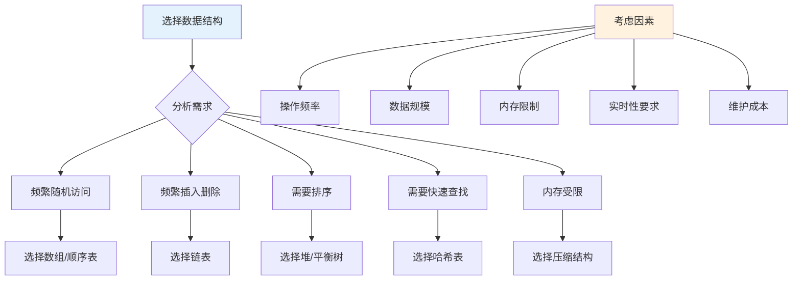

**技术演变过程**：

```
问题出现 → 选择最简单的结构（数组/链表）
  ↓ 发现性能瓶颈
引入索引结构（树、哈希表）
  ↓ 发现并发问题
引入线程安全结构（ConcurrentHashMap、CopyOnWriteArrayList）
  ↓ 发现分布式问题
引入分布式数据结构（一致性哈希、分布式B+树）
```

数据结构的学习不是记忆每种结构的API，而是理解每种结构的**设计思想**和**适用场景**。掌握了这些，面对任何新问题都能做出正确的选择。


## 07.各平台数据结构实现

### 7.1 标准库数据结构对照

不同语言和平台提供的标准库数据结构各有特色，理解其底层实现对跨平台开发至关重要：

| 数据结构 | Java | C++ STL | Go | Swift | JavaScript | Kotlin | Rust |
|---------|------|---------|-----|-------|-----------|--------|------|
| 动态数组 | ArrayList | vector | slice | Array | Array | MutableList | Vec |
| 链表 | LinkedList | list | container/list | 手动实现 | 手动实现 | LinkedList | LinkedList |
| 哈希表 | HashMap | unordered_map | map | Dictionary | Map/Object | HashMap | HashMap |
| 有序映射 | TreeMap | map | — | — | — | TreeMap | BTreeMap |
| 哈希集合 | HashSet | unordered_set | — | Set | Set | HashSet | HashSet |
| 栈 | Stack/Deque | stack | 用slice | 用Array | 用Array | ArrayDeque | Vec |
| 队列 | Queue/Deque | queue | container/list | 用Array | 用Array | ArrayDeque | VecDeque |
| 优先队列 | PriorityQueue | priority_queue | container/heap | — | 手动实现 | PriorityQueue | BinaryHeap |

### 7.2 移动端数据结构选择

**Android特有优化**：

```java
// Android提供了针对移动端优化的数据结构
// 1. SparseArray — 替代HashMap<Integer, Object>，避免int装箱
SparseArray<String> sparse = new SparseArray<>();
sparse.put(42, "answer");

// 2. ArrayMap — 替代HashMap<String, Object>，小数据量更省内存
ArrayMap<String, Integer> map = new ArrayMap<>();
map.put("key", 100);

// 3. SparseBooleanArray — 专门存int→boolean映射
SparseBooleanArray flags = new SparseBooleanArray();
flags.put(1, true);
```

**iOS内存管理特性**：

```swift
// Swift的值类型集合——写时复制（Copy-on-Write）
var original = [1, 2, 3, 4, 5]
var copy = original  // 此时不拷贝，共享内存
copy.append(6)       // 写操作触发拷贝

// NSOrderedSet — 有序且不重复的集合（Objective-C/Swift桥接）
let orderedSet = NSMutableOrderedSet()
orderedSet.add("a")
orderedSet.add("b")
orderedSet.add("a")  // 不会重复添加
// orderedSet: ["a", "b"]，保持插入顺序
```

### 7.3 数据结构复杂度速查表

这是每个开发者都应该记住的核心复杂度表：

| 数据结构 | 访问 | 搜索 | 插入 | 删除 | 空间 |
|---------|------|------|------|------|------|
| 数组 | O(1) | O(N) | O(N) | O(N) | O(N) |
| 链表 | O(N) | O(N) | O(1) | O(1) | O(N) |
| 栈/队列 | O(N) | O(N) | O(1) | O(1) | O(N) |
| 哈希表 | — | O(1) | O(1) | O(1) | O(N) |
| BST | O(logN) | O(logN) | O(logN) | O(logN) | O(N) |
| 红黑树 | O(logN) | O(logN) | O(logN) | O(logN) | O(N) |
| 堆 | O(1)* | O(N) | O(logN) | O(logN) | O(N) |
| B树 | O(logN) | O(logN) | O(logN) | O(logN) | O(N) |

> *堆的O(1)是获取最大/最小值

### 7.4 数据结构与业务场景映射

**疑惑**：实际业务开发中，到底什么场景用什么数据结构？

**答疑**：以下是常见业务场景的数据结构推荐：

| 业务场景 | 推荐数据结构 | 原因 |
|---------|------------|------|
| 用户列表展示 | 动态数组（ArrayList） | 按索引随机访问，适合UI列表绑定 |
| 消息撤回/重做 | 栈（Stack） | 后进先出，天然匹配撤回操作 |
| 任务调度队列 | 优先队列（PriorityQueue） | 按优先级自动排序 |
| 社交关系图 | 邻接表（HashMap+List） | 表示多对多关系 |
| 缓存系统 | 哈希表+双向链表（LRU） | O(1)查找+O(1)淘汰 |
| 自动补全 | 前缀树（Trie） | 按前缀高效匹配 |
| 排行榜 | 跳表/红黑树（SortedSet） | 有序+O(logN)插入 |
| 去重判断 | 布隆过滤器/HashSet | 大数据量下极省内存 |
| 文件系统 | B+树 | 磁盘友好，顺序访问高效 |
| 路由匹配 | 前缀树/基数树 | URL路径匹配 |

**技术演变总结**：

```
1950s 数组、链表 — 解决基本的数据存储问题
  ↓
1960s 树、图 — 解决层次和网络关系问题
  ↓
1970s 哈希表、B树 — 解决快速查找和磁盘存储问题
  ↓
1980s 红黑树、跳表 — 解决平衡和概率性查找问题
  ↓
1990s STL、Java集合框架 — 标准化和工业化
  ↓
2000s 并发数据结构 — 解决多核并行问题
  ↓
2010s 无锁数据结构、CRDT — 解决分布式一致性问题
  ↓
今天 持久化数据结构、函数式数据结构 — 不可变性和并发安全
```

数据结构是计算机科学的基石。理解每种数据结构的**设计思想**、**适用场景**和**权衡取舍**，比记住API更加重要。当面对新的业务问题时，能够从本质出发选择合适的数据结构，才是一个优秀工程师的核心能力。

