# 02.数据结构设计思想
- 01.数据结构概念
  - 1.1 什么是数据结构
  - 1.2 数据结构定义
  - 1.3 数据发展历程
- 02.核心概念体系
  - 2.1 基本概念
  - 2.2 数据
  - 2.3 数据项
  - 2.4 数据元素
  - 2.5 数据结构
  - 2.6 算法
  - 2.7 概念间关系
- 03.四种基本类型
  - 3.1 数据结构分类
  - 3.2 集合类型
  - 3.3 线性表
  - 3.4 树类型
  - 3.5 图类型
- 04.数据存储方式
  - 4.1 顺序存储
  - 4.2 链式存储
  - 4.3 索引存储
  - 4.4 散列存储
- 05.数据结构的运算

## 01.数据结构概念

### 1.1 什么是数据结构

数据结构不是一门研究数据计算的学科，而是研究数据与数据之间关系的。

数据结构的起源：美国的高纳德教授，于1968年开设一门《基本算法》的课程，开创的数据结构和算法的先河。

提出一个公式：数据结构 + 算法 = 程序

### 1.2 数据结构定义

数据结构（Data Structure）是计算机存储、组织数据的方式。它是数据元素相互之间存在的一种或多种特定关系的集合。数据结构反映了数据元素之间的逻辑关系和在计算机中的存储关系。

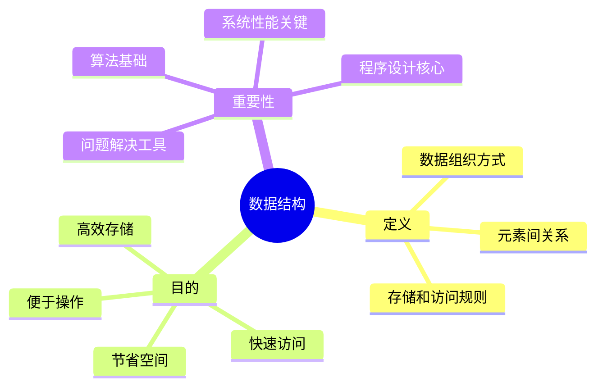

### 1.3 数据发展历程

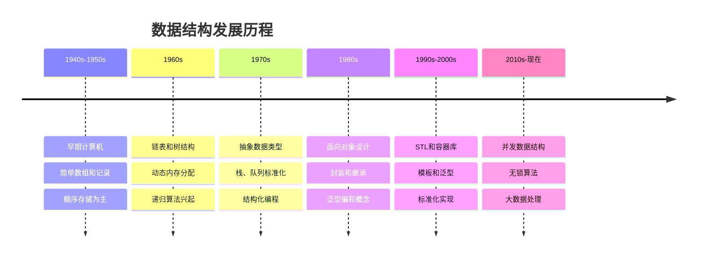

## 02.核心概念体系

### 2.1 基本概念

数据：能够输入计算机的描述客观事物的符号。

数据项：描述事物的其中一项指标。

数据元素：用于描述一个完整的事物。

数据结构：由数据元素和元素之间的关系构成的一个整体。

算法：数据结构所具备的功能（解决问题的方法）。

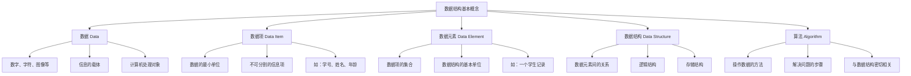

### 2.2 数据

**定义**：数据是信息的载体，是描述客观事物属性的数、字符以及所有能输入到计算机中并被计算机程序识别和处理的符号的集合。

**特点**：

- 多样性：数字、文本、图像、音频、视频等
- 可处理性：能被计算机识别和操作
- 信息性：承载着有意义的信息

### 2.3 数据项

**定义**：数据项是数据的最小单位，是不可分割的最小标识单位。

**特征**：
- 原子性：不可再分
- 标识性：具有独特含义
- 基础性：构成数据元素的基础

### 2.4 数据元素

**定义**：数据元素是数据的基本单位，由若干数据项组成，是数据结构中讨论的基本单位。

**组成**：

- 由多个相关数据项构成
- 在数据结构中作为整体处理
- 具有完整的语义含义

### 2.5 数据结构

**定义**：数据结构是相互之间存在一种或多种特定关系的数据元素的集合。

**三要素**：

1. **逻辑结构**：数据元素间的逻辑关系
2. **存储结构**：数据在计算机中的存储方式
3. **运算集合**：对数据结构的操作方法

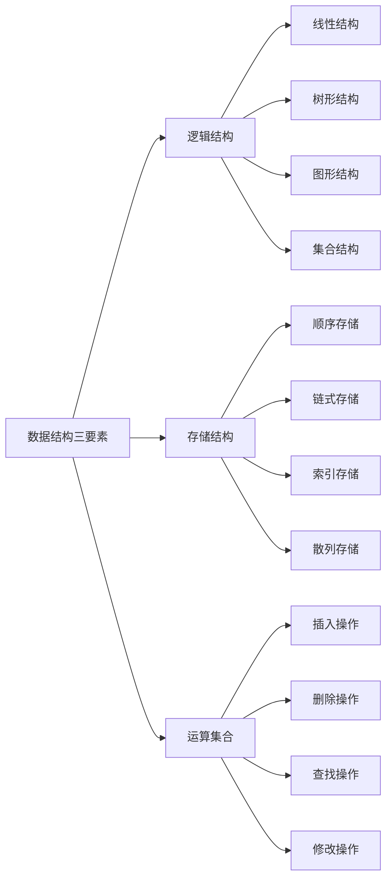

### 2.6 算法

**定义**：算法是解决特定问题求解步骤的描述，是指令的有限序列。

**特性**：
- **有穷性**：算法必须在有限步骤内结束
- **确定性**：每一步都有确切的定义
- **可行性**：每一步都能够执行
- **输入**：有零个或多个输入
- **输出**：有一个或多个输出

### 2.7 概念间关系

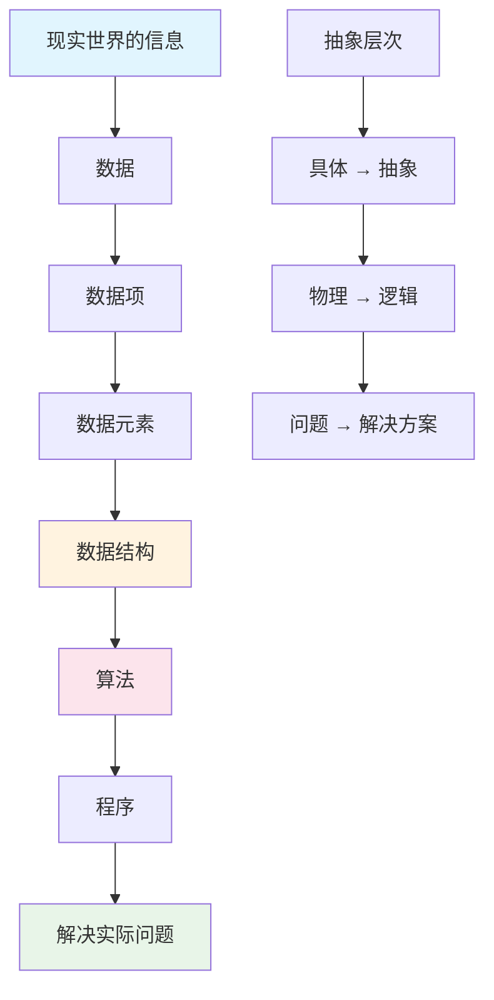

## 03.四种基本类型

根据数据元素间关系的不同，数据结构可以分为四种基本类型：

1. 集合：元素之间没有任何关系 
2. 线性表：元素之间存在一对一关系（数组）。数组、链表、功能受限的表（栈，队列） 
3. 树：元素之间存在一对多关系。普通树、二叉树、完全二叉树、满二叉树、有序二叉树 
4. 图：元素之间存在多对多关系。邻接表、表的遍历（深度优先、广度优先）、最短路径

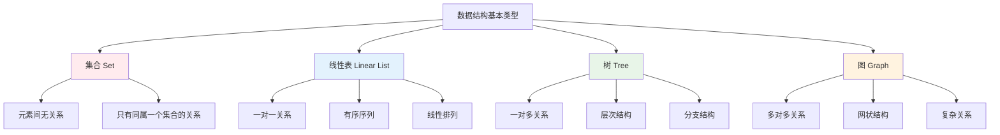

### 3.2 集合类型

**定义**：集合是数据元素间除了"同属一个集合"外，没有任何其他关系的数据结构。

**特征**：

- 元素间无序
- 元素唯一性
- 无结构关系
- 只关心元素的存在性

### 3.3 线性表

**定义**：线性表是由n个数据元素组成的有限序列，元素间存在一对一的关系。

**特征**：

- 有序性：元素有先后顺序
- 有限性：元素个数有限
- 同质性：元素类型相同
- 线性关系：除首尾元素外，每个元素都有唯一前驱和后继

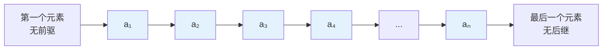

线性表的分类

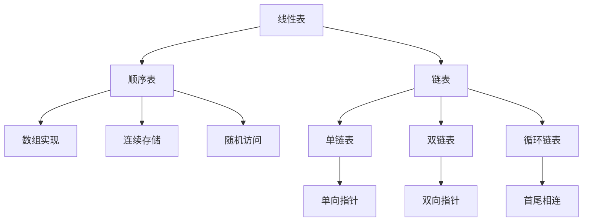

### 3.4 树类型

**定义**：树是n个节点的有限集合，具有层次关系的数据结构。

**特征**：

- 层次性：有明确的层次结构
- 递归性：子树也是树
- 有序性：子树有左右顺序
- 连通性：任意两节点间有唯一路径

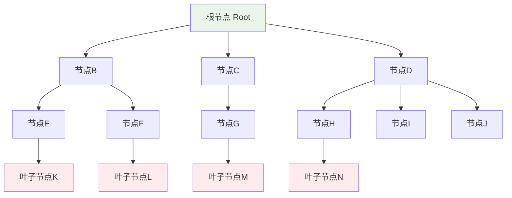

### 3.5 图类型

**定义**：图是由顶点集合和边集合组成的数据结构，表示多对多的关系。

**特征**：

- 复杂关系：顶点间可以有任意关系
- 网状结构：非线性、非层次
- 连通性：可达性分析
- 路径概念：顶点间的连接序列

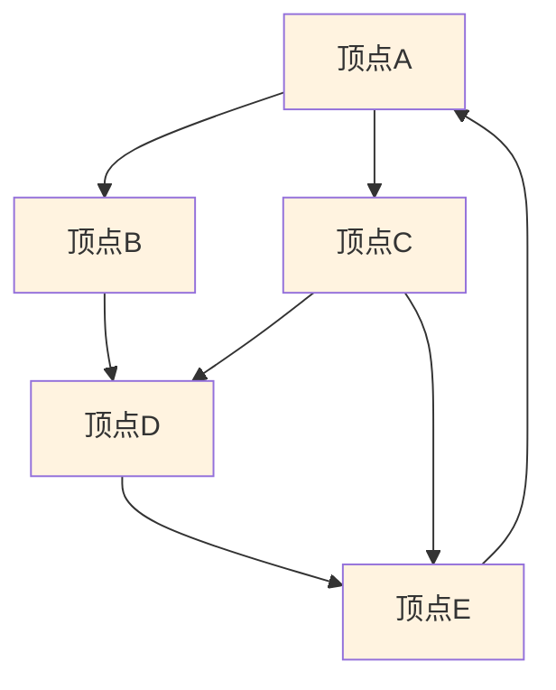

## 04.数据存储方式

1. 顺序：在一块连续的内存空间上存储元素与元素之间的关系。优点是查找速度快（随机访问），不易产生内存碎片，但是对内存要求高，添加删除不方便。 
2. 非顺序（链式）：元素随机存储内存空间中，元素中存储指向其他元素的地址。优点是对内存要求低，添加删除方便，查找速度慢，不能随机访问，容易产生内存碎片。

数据结构在计算机中的存储方式决定了数据的组织形式和访问效率。主要有四种基本存储方式：

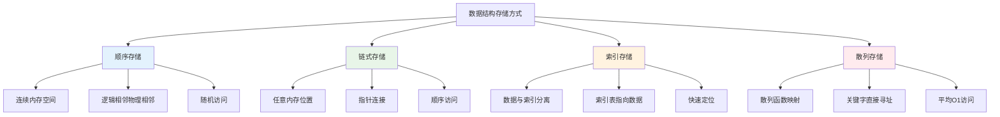

### 4.1 顺序存储

**定义**：将数据元素存放在地址连续的存储单元里，逻辑关系和物理关系是一致的。

**优点**：
- 随机访问：可以通过下标直接访问
- 存储密度高：不需要额外的指针空间
- 实现简单：数组是最典型的实现

**缺点**：
- 插入删除效率低：需要移动大量元素
- 存储空间预分配：可能造成浪费或不足
- 大小固定：难以动态调整

### 4.2 链式存储

**定义**：数据元素存储在任意的存储单元里，通过指针来表示元素间的逻辑关系。

**优点**：
- 动态分配：根据需要分配内存
- 插入删除高效：只需修改指针
- 灵活性强：大小可动态调整

**缺点**：
- 顺序访问：不能随机访问元素
- 额外空间：需要存储指针
- 内存不连续：缓存性能较差

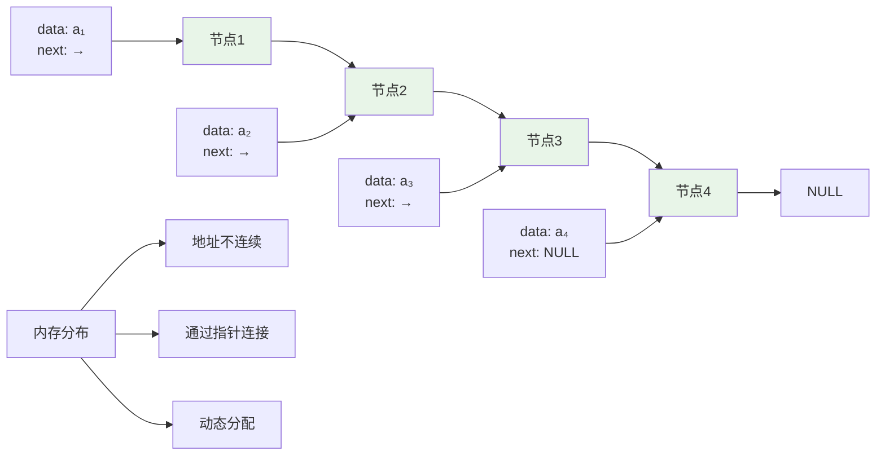

### 4.3 索引存储

**定义**：除了存储数据元素外，还建立附加的索引表来指示元素的存储地址。

**优点**：
- 快速定位：通过索引快速找到数据
- 灵活访问：支持多种访问方式
- 空间效率：数据和索引分离

**缺点**：
- 额外开销：需要维护索引表
- 复杂性：实现相对复杂
- 更新成本：修改数据需要更新索引

### 4.4 散列存储

**定义**：根据元素的关键字直接计算出该元素的存储地址，也称为哈希存储。

**优点**：
- 快速访问：平均O(1)时间复杂度
- 直接寻址：通过散列函数直接定位
- 高效查找：适合大量数据的快速检索

**缺点**：
- 散列冲突：不同关键字可能映射到同一地址
- 空间浪费：可能有空闲的存储位置
- 散列函数设计：需要设计好的散列函数

## 05.数据结构的运算

1、创建
2、销毁
3、添加元素
4、删除元素
5、修改元素
6、查找元素
7、排序
8、遍历
9、访问

表：
顺序表（存储结构）
1、设计数据结构
2、分析所具备的算法
3、实现算法
4、使用算法
链式表（存储结构）

功能受限的表：
栈（逻辑结构）
限制为只有一个端口进出元素，就导致先进后出的特性。
顺序栈
链式栈
队列（逻辑结构）
限制为只有2个端口进出元素,一个只管进，另一个只管出，就导致先进先出和特征。
顺序队列
链式队列