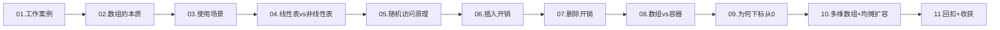
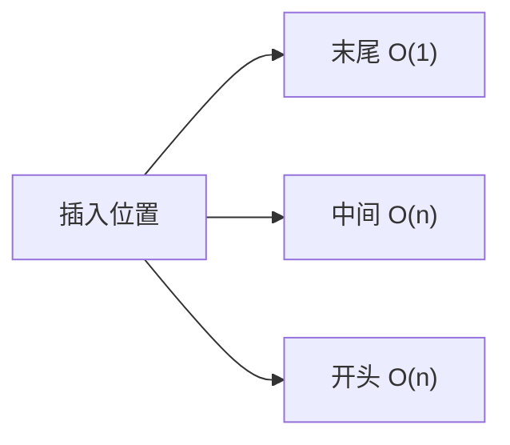

# 03.数组深入浅出分析

> 数据结构里最基础、也最被低估的一种。看似平平无奇，却是动态数组、栈、队列、堆、矩阵、图、哈希表等几乎所有高级结构的底层物理承载。本篇从一个真实事故切入，彻底讲透它。

---

## 目录指引与导读

> 阅读建议：先抓住"连续内存 + 下标计算"这条主线，再读各节细节会更有体感。

- [01. 从工作案例说起](#01-从工作案例说起)
  - [1.1 中间插入的事故](#11-中间插入的事故)
  - [1.2 全篇结构导航](#12-全篇结构导航)
- [02. 数组的本质剖析](#02-数组的本质剖析)
  - [2.1 定义与硬约束](#21-定义与硬约束)
  - [2.2 栈堆内存分配](#22-栈堆内存分配)
  - [2.3 访问与查找区别](#23-访问与查找区别)
  - [2.4 缓存与SIMD优势](#24-缓存与simd优势)
- [03. 数组的使用场景](#03-数组的使用场景)
  - [3.1 业务侧典型场景](#31-业务侧典型场景)
  - [3.2 哪些容器底层数组](#32-哪些容器底层数组)
  - [3.3 各语言数组速览](#33-各语言数组速览)
- [04. 线性表与非线性](#04-线性表与非线性)
  - [4.1 线性表两种实现](#41-线性表两种实现)
  - [4.2 非线性数组扁平化](#42-非线性数组扁平化)
- [05. 随机访问的原理](#05-随机访问的原理)
  - [5.1 地址计算公式](#51-地址计算公式)
  - [5.2 硬件专门指令](#52-硬件专门指令)
  - [5.3 验证内存连续](#53-验证内存连续)
  - [5.4 各语言越界检查](#54-各语言越界检查)
- [06. 插入低效的原因](#06-插入低效的原因)
  - [6.1 插入复杂度分析](#61-插入复杂度分析)
  - [6.2 三种插入优化思路](#62-三种插入优化思路)
- [07. 删除低效的原因](#07-删除低效的原因)
  - [7.1 经典删除两优化](#71-经典删除两优化)
- [08. 数组与容器对比](#08-数组与容器对比)
  - [8.1 原生数组核心差异](#81-原生数组核心差异)
  - [8.2 必用原生数组场景](#82-必用原生数组场景)
  - [8.3 安卓特化SparseArray](#83-安卓特化sparsearray)
- [09. 下标为何从0开始](#09-下标为何从0开始)
  - [9.1 下标即内存偏移](#91-下标即内存偏移)
  - [9.2 半开区间论证](#92-半开区间论证)
  - [9.3 各语言起始选择](#93-各语言起始选择)
- [10. 多维数组与扩容](#10-多维数组与扩容)
  - [10.1 行优先列优先](#101-行优先列优先)
  - [10.2 扩容倍数取舍](#102-扩容倍数取舍)
  - [10.3 客户端广泛应用](#103-客户端广泛应用)
  - [10.4 数组解题四模式](#104-数组解题四模式)
- [11. 案例回扣与收获](#11-案例回扣与收获)
- [12. 思考题深度练](#12-思考题深度练)
- [13. 课后作业实战](#13-课后作业实战)

---

## 01. 从工作案例说起

### 1.1 中间插入的事故

某个后台服务需要每次请求时，把一条新记录插到"最近操作列表"的最前面（首位是最新）。最初的实现：

```java
LinkedList<Op> recent = new LinkedList<>();

void onRequest(Op o) {
    recent.addFirst(o);           // O(1)，选 LinkedList 的原因
    if (recent.size() > 200) recent.removeLast();
    pushToClient(recent);          // 问题在这
}
```

听起来很合理——`LinkedList` 的头插 `O(1)`。但 `pushToClient` 里做了这么一件事：

```java
for (int i = 0; i < recent.size(); i++) {
    buffer.append(recent.get(i).toString());   // 链表的 get(i) = O(N)
}
```

`LinkedList.get(i)` 要从头遍历 i 次，整个循环退化成 **O(N²)**。200 条时还能跑，放到一个热点用户（实际会堆到 2000+）上，P99 从 5ms 直飙 200ms。

改动：`LinkedList → ArrayDeque`（底层是循环数组），头插仍 `O(1)`，随机访问退化到 `O(N)` 但这里根本不需要；或者干脆把 `recent.get(i)` 换成 `for-each`。问题根除。

**这件事让我真正理解数组的核心价值**：不是"能动态增长"，而是 **连续内存 + 下标直算地址**，这两个硬件级特性决定了它的优劣。本篇把这件事说透。

### 1.2 全篇结构导航



---

## 02. 数组的本质

### 2.1 定义与两个硬约束

**数组（Array）** 是一种线性数据结构，用一组 **连续的内存空间** 存储一组 **类型相同** 的数据。

两个硬约束缺一不可：

- 连续内存 → 地址可计算 → 随机访问 `O(1)`
- 类型相同 → 每个元素大小一致 → 无需 padding，也能直接 `base + i × size` 寻址

### 2.2 栈堆内存分配

```
栈分配（~1ns，自动释放，大小编译期确定）：
┌─────────────┐
│ int arr[5]  │
│ [0][1][2][3][4]
└─────────────┘

堆分配（~100ns，手动/GC释放，运行期决定大小）：
┌──────┐       ┌─────────────────┐
│ *arr │──ptr─→│ [0][1][2][3][4] │
└──────┘       └─────────────────┘
```

各语言差异：

| 语言 | 默认位置 | 机制 |
|-----|---------|------|
| C/C++ | 栈或堆，程序员控制 | `int a[N]` 栈；`malloc` 堆 |
| Java | 堆 | 所有对象都在堆，GC 回收 |
| Go | 编译器逃逸分析决定 | 不逃逸→栈；否则→堆 |
| Swift | 小数组内联，大的上堆 | 值类型 + COW |

### 2.3 访问 vs 查找：两个常被混淆的概念

| 操作 | 输入 | 复杂度 |
|------|------|--------|
| 访问（Access）`arr[i]` | 已知下标 | **O(1)** |
| 查找（Search）`find(v)` | 已知值 | 无序 O(N)、有序 O(log N) |
| 包含（Contains） | 判断是否存在 | 同查找 |

"数组查找 O(1)" 是错的。正确说法：**数组的随机访问是 O(1)**。

### 2.4 缓存与SIMD优势

现代 CPU 每次加载一整条 **缓存行（Cache Line，通常 64B）**。顺序数组遍历，首次 miss 之后接下来十几个元素全部缓存命中；链表因为离散，基本每跳都 miss。

```
数组遍历：
[a₀][a₁][a₂]...[a₇]  ← 一次缓存加载 8 个 int
命中率 > 95%

链表遍历：
[node₀]   [node₃]   [node₁]   ← 每节点位置不可预测
命中率 ≈ 0%，每次 miss 约 100ns
```

连续内存还让编译器可以生成 **SIMD 指令**（AVX2 一次处理 8 个 int），速度再翻数倍。NumPy 能比 Python 原生 list 快 100 倍，根源就在这。

---

## 03. 数组的使用场景

### 3.1 谁在用数组

业务层："按索引存取 + 按顺序遍历" 为主的场景：

| 业务 | 为何用数组 |
|------|-----------|
| 音视频帧缓冲 | 零拷贝 / DMA / SIMD 都要求连续内存 |
| 图像像素处理 | 二维矩阵天然数组 |
| 游戏地图格子 | `map[x][y]` 坐标 O(1) |
| 时间序列 / K 线 | 等间距采样 + 范围查询 |
| 列表分页展示 | 按 index 随机访问 |

### 3.2 哪些容器底层数组

| 集合 | 底层 | 备注 |
|------|------|------|
| Java `ArrayList` | `Object[]` | 1.5 倍扩容 |
| Java `ArrayDeque` | 循环数组 + 位运算代替取模 | 容量必须 2 的幂 |
| C++ `vector` | `T*` | 2 倍扩容（GCC） |
| Go slice | 指向数组的 header | 动态扩容 |
| Python `list` | `PyObject**` | 约 1.125 倍 |
| Rust `Vec<T>` | `RawVec` | 2 倍 |
| Java `PriorityQueue` | `Object[]` | 堆的数组实现 |
| String | `char[]` / `byte[]` | — |

`ArrayDeque` 那个细节值得一提：

```java
// (head - 1) & (len - 1) 等价于对 2 的幂取模，但只需 1 个时钟周期
head = (head - 1) & (elements.length - 1);
```

取模要 20~40 周期，这就是为什么它强制容量是 2 的幂。

### 3.3 各语言数组速览

| 语言 | 声明 | 大小 | 边界检查 | 特性 |
|------|------|------|---------|------|
| C | `int a[10]` | 固定 | ❌ | 不检查越界（缓冲区溢出根源） |
| Java | `int[] a = new int[10]` | 固定 | ✅ | 抛 `AIOBE` |
| Swift | `[Int]` | 动态 | ✅ | 值类型 + COW |
| Go | `[10]int` 数组 / `[]int` 切片 | 前者固定后者动态 | ✅ | 数组传参拷贝 |
| JS | `Array` | 动态 | ❌ | 越界返 `undefined`，稀疏时退化为哈希表 |
| Rust | `[i32; 10]` | 固定 | ✅ | 编译期保障 |

---

## 04. 线性表与非线性表

### 4.1 线性表：逻辑概念的两种实现

**线性表**是逻辑结构——元素排成一条线。物理上有两种实现：

```
顺序存储（数组）：
[A][B][C][D][E]    连续内存，下标定位

链式存储（链表）：
[A|→] ... [B|→] ... [C|∅]    指针串联
```

| 维度 | 数组 | 链表 |
|------|------|------|
| 存储密度 | 高 | 低（每节点多一个指针） |
| 随机访问 | O(1) | O(N) |
| 插入删除（已定位） | O(N) | O(1) |
| 空间灵活性 | 需预分配 | 按需 |
| 缓存友好 | 极好 | 极差 |

### 4.2 非线性数组扁平化

完全二叉树用数组存：

```
       1            index: 0 1 2 3 4 5 6
      / \           value: 1 2 3 4 5 6 7
     2   3
    / \ / \         parent(i) = (i-1)/2
   4  5 6  7        left(i)   = 2i+1
                    right(i)  = 2i+2
```

省掉每个节点 16B 的指针，缓存友好——`PriorityQueue`、堆排序、Go `heap` 包都是这么做的。

| 非线性结构 | 数组实现 | 应用 |
|-----------|---------|------|
| 完全二叉树 / 堆 | 层序存 | `PriorityQueue` |
| 图（稠密） | 邻接矩阵 `adj[i][j]` | Floyd |
| 并查集 | `parent[i]` | Kruskal |
| 线段树 | 一维（4N 空间） | 区间查询 |
| Trie | `children[node][char]` | 自动补全 |

---

## 05. 随机访问的原理

### 5.1 地址计算公式

```
一维：addr(a[i])       = base + i × size
二维：addr(a[i][j])    = base + (i × cols + j) × size（行优先）
三维：addr(a[i][j][k]) = base + (i × d₂d₃ + j × d₃ + k) × size
```

### 5.2 硬件为这事做过专门指令

```asm
; x86：一条指令完成基址+变址+缩放
mov eax, [rbx + rcx * 4]    ; base=rbx, index=rcx, size=4

; ARM：同样一条指令
LDR R0, [R1, R2, LSL #2]
```

ALU 一个时钟周期搞定。这就是 O(1) 的硬件根基。

### 5.3 验证内存连续

```c
int arr[5] = {10, 20, 30, 40, 50};
for (int i = 0; i < 5; i++)
    printf("a[%d] addr=%p offset=%ld\n",
           i, &arr[i], (char*)&arr[i] - (char*)&arr[0]);
// 偏移严格 0, 4, 8, 12, 16
```

### 5.4 各语言越界检查

| 语言 | 越界 | 性能损耗 |
|------|------|---------|
| C/C++ | 未定义行为 | 0 |
| Java / Swift / Rust / Go | 抛异常 / panic | 3%~5%（JIT 可消除大部分） |
| JS | 返 `undefined` | 0 |

---

## 06. 插入低效的原因

### 6.1 插入复杂度分析



平均代价 `(1+2+...+n)/n = O(n)`。

### 6.2 三种优化思路

**① 无序数组的 O(1) 插入——尾部交换法**

```java
// 不要求保序时，把目标位置元素搬到末尾
void insertFast(int[] a, int size, int idx, int v) {
    a[size] = a[idx];   // 原值挪到末尾
    a[idx]  = v;        // 新值放进去
    // 2 次赋值，O(1)
}
```

**② 用 `System.arraycopy` 代替手写 for**

```java
// 底层 memcpy/memmove，比 for 循环快 5~10 倍
System.arraycopy(arr, index, arr, index + 1, size - index);
arr[index] = value;
```

**③ 分块数组（C++ `std::deque` 思路）**

把大数组切成若干小块，块内数组、块间链表。插入只需在一个块里移 `√N` 个元素，整体 `O(√N)`。数据库 B+ 树本质上就是这思路的极致。

---

## 07. 删除低效的原因

同插入，平均 `O(N)`，需要把后面的元素向前搬。

```java
// ArrayList.remove(index) 核心
public E remove(int index) {
    E old = (E) elementData[index];
    int numMoved = size - index - 1;
    if (numMoved > 0)
        System.arraycopy(elementData, index + 1, elementData, index, numMoved);
    elementData[--size] = null;   // 置空帮助 GC
    return old;
}
```

### 7.1 两个经典优化

**① 无序数组：末尾覆盖法，O(1)**

```java
void removeFast(int[] a, int idx, int size) {
    a[idx] = a[size - 1];   // 末尾覆盖目标位置
    // 逻辑 size--
}
```

游戏 ECS 架构大量用这招。

**② 标记删除 + 批量整理**

先打标记不搬数据，空间不够时再集中整理一次——**这就是 JVM 标记清除 GC、数据库 MVCC 软删除、SSD FTL 的核心思想**。

| 场景 | 标记方式 | 整理触发 |
|------|---------|---------|
| JVM GC | 可达性分析 | 内存阈值 |
| 数据库 | `is_deleted=1` | vacuum |
| 文件系统 | inode 标记 | trim |
| SSD | 页级标记 | 垃圾块阈值 |

**结论**：数组的 O(1) 访问是绝对优势，O(N) 的插入删除是绝对代价——**承认代价，再用"不保序 / memcpy / 分块 / 标记"四招优化**。

---

## 08. 数组与容器对比

### 8.1 原生数组核心差异

| 维度 | 原生数组 | 容器（ArrayList/vector/slice） |
|------|---------|----------------|
| 大小 | 固定 | 动态（扩容） |
| 类型 | 原始类型（Java 免装箱） | 对象类型（Java 需装箱） |
| 便捷方法 | 无 | `add/remove/sort/stream` |
| 跨 JNI / 网络 IO | 原生数组必需 | 不可用 |

### 8.2 什么时候必须用原生数组

1. **JNI / FFI**：跨语言调用必须传 `byte[]`
2. **NIO `ByteBuffer` / Netty `ByteBuf`**：网络 IO 缓冲
3. **音视频编解码**：PCM / YUV 数据就是字节数组
4. **Android `Bitmap`**：像素数据 `int[]`
5. **密码学**：AES 固定长度 byte 数组

### 8.3 安卓特化SparseArray

```java
// 替代 HashMap<Integer, V>，底层是两个平行数组
SparseArray<String> map = new SparseArray<>();
map.put(1, "one");   // int[] keys + Object[] values，二分查找 O(log N)
// 比 HashMap<Integer,V> 省 40% 内存（无 Entry 对象、免装箱）
```

---

## 09. 为何下标从 0 开始

### 9.1 本质：下标是"偏移量"不是"序号"

`arr[3]` 的含义是"从首地址偏移 3 × size"。偏移量天然从 0 起，第一个元素的偏移恰好是 0。

从 1 开始需要每次寻址多一次减法：`base + (i-1) × size`。C 诞生在 PDP-11（几 MHz）上，这一次减法是实打实的开销。

### 9.2 Dijkstra 的半开区间论证

半开区间 `[0, N)` 的长度 = `N - 0 = N`，直观；闭区间 `[1, N]` 长度 = `N - 1 + 1`，容易出 off-by-one。

### 9.3 各语言起始选择

| 起始 | 语言 | 说明 |
|-----|------|------|
| 0 | C/C++/Java/Go/Rust/Swift/Kotlin/JS | 主流 |
| 0（+负数语法糖） | Python | `arr[-1]` 即 `arr[len-1]` |
| 1 | Lua / MATLAB / Fortran | 数学家思维 |

---

## 10. 多维数组与动态扩容

### 10.1 行优先 vs 列优先

```
逻辑 3×4 矩阵：
  col0 col1 col2 col3
row0 1   2    3    4
row1 5   6    7    8
row2 9   10  11  12

行优先（C/Java/Go/Swift）：[1,2,3,4,5,6,7,8,9,10,11,12]
列优先（Fortran/MATLAB）：[1,5,9,2,6,10,3,7,11,4,8,12]
```

**重要实践**：**按存储顺序遍历**。Java/C 写二维循环时，外层应该是 `i`（行），内层是 `j`（列）——反了缓存命中率能差 3~5 倍。

### 10.2 扩容倍数取舍

| 容器 | 倍数 | 最坏空间浪费 | N 次插入扩容次数 |
|------|-----|------------|-----------------|
| Java ArrayList | 1.5× | 33% | `log₁.₅N` |
| C++ vector (GCC) | 2× | 50% | `log₂N` |
| Go slice | <256: 2× ; ≥256: 1.25× | 50%/20% | 介于两者 |
| Python list | ~1.125× | 12.5% | ~8 logN |

**均摊 O(1) 证明**（以 2 倍扩容为例）：

```
总拷贝 = 1 + 2 + 4 + 8 + ... + N = 2N - 1
N 次 append 总代价 = (2N - 1) 拷贝 + N 实际赋值 ≈ 3N
均摊每次 = 3N / N = O(1) ✓
```

**实战建议**：能预估数据量就指定初始容量，零扩容。

```java
// 差：默认容量 10，插 1w 条扩容 ~24 次
List<String> a = new ArrayList<>();

// 好：一步到位
List<String> a = new ArrayList<>(10000);
```

### 10.3 数组在客户端的广泛应用

- Android `RecyclerView.Adapter.getItemCount() / onBindViewHolder(position)`：靠 `List.get(position)` 的 O(1) 随机访问
- iOS `UITableView` 的 `cellForRowAt indexPath`：同理
- 前端虚拟列表：`Math.floor(scrollTop / itemHeight)` 算出可见区间首尾 index，然后 `data.slice(start, end)`——数组 O(1) 访问是虚拟滚动的根基

### 10.4 数组解题四模式

| 模式 | 核心 | 典型题 |
|------|------|-------|
| 双指针 | 一快一慢 / 左右夹逼 | 两数之和（有序）、移除元素、合并有序数组 |
| 原地哈希 | 用下标当哈希键 | First Missing Positive、Find Duplicate |
| 前缀和 | 预计算区间和 | 子数组和、区间更新 |
| 滑动窗口 | 可变窗口滑动 | 最大子数组和、最小覆盖子串 |

示例——**三次反转实现旋转数组**，空间 O(1)：

```java
void rotate(int[] a, int k) {
    k %= a.length;
    reverse(a, 0, a.length - 1);
    reverse(a, 0, k - 1);
    reverse(a, k, a.length - 1);
}
```

---

## 11. 本篇收获与案例回扣

### 11.1 回到开篇的 LinkedList 事故

回过头看那段代码：

```java
for (int i = 0; i < recent.size(); i++)
    buffer.append(recent.get(i).toString());
```

问题的本质是 **把"按下标访问"施加在一个根本不支持 O(1) 随机访问的结构上**。`ArrayList`（数组底层）的 `get(i)` 是 O(1)，`LinkedList` 的 `get(i)` 是 O(N)——同样的代码，底层结构不一样，复杂度天差地别。

修复有两条路：

1. 换成 for-each（链表遍历用迭代器，O(N)）
2. 换底层结构成 `ArrayDeque`（循环数组，头插 O(1)、下标访问 O(1)）

第二条路才是最彻底的——因为这个业务要的就是"频繁头插 + 顺序读"，循环数组正是为此而生。

### 11.2 八个核心收获

八个带走点：

1. **数组的本质是"连续内存 + 类型相同"**，两者合力撑起 O(1) 随机访问
2. **访问 ≠ 查找**：访问 O(1)，查找无序 O(N)
3. **缓存友好性是数组被低估的最大优势**，实际性能优势远大于理论复杂度
4. **插入删除 O(N)**，但不保序时可优化到 O(1)（末尾交换）
5. **`System.arraycopy` 比手写 for 快 5~10 倍**
6. **动态数组均摊 O(1)**，预估容量能免扩容
7. **行优先语言按行遍历**，否则缓存命中率掉几倍
8. **下标是偏移量不是序号**，从 0 开始是硬件一致性选择

---

## 12. 思考题

1. **下标设计**：除了"少一次减法"，从 0 开始还有什么优势？（提示：半开区间 `[0, N)` 表达长度的简洁性、空区间、切片）
2. **缓存实验**：用你熟悉的语言测 1000×1000 二维数组的行遍历与列遍历，解释耗时差异。Java 的 `int[][]`（本质是"数组的数组"，每行独立对象）和 C 的真二维数组相比，缓存表现差在哪？
3. **扩容策略**：若扩容倍数取 1.0（每次只多一个位置），N 次 append 的总拷贝次数是多少？和 2 倍相比差在哪？这说明了什么？
4. **并发数组**：多线程同时 `add()` ArrayList 会出什么问题？`CopyOnWriteArrayList` 解决的代价是什么？有更好的方案吗？（提示：分段数组、Disruptor 的无锁环形缓冲）
5. **算法设计**：LeetCode 41「缺失的第一个正整数」要求 O(N) 时间 O(1) 空间。它利用了数组的什么特性？为什么链表做不到？

---

## 13. 课后作业实战

**作业 1（必做）——链表 vs 数组实测**

分别用 `LinkedList` 和 `ArrayList` 实现开篇的"最近 200 条记录"需求，压测 QPS 5000、持续 1 分钟下：

- 平均耗时 / P99
- GC 次数、Old Gen 增长
- 尝试把 `for (int i; i < n; i++) list.get(i)` 换成 `for-each`，再次压测

写一份分析报告，解释每一组数字背后的原因。

**作业 2（必做）——实现一个 ArrayDeque**

从零实现一个循环数组版的双端队列，要求：

- `addFirst` / `addLast` / `removeFirst` / `removeLast` 都是 O(1)
- 容量自动扩容（2 倍，且必须保持 2 的幂）
- 用位运算代替取模
- 编写单元测试覆盖"绕圈"边界场景

对比你自己实现的性能与 JDK `ArrayDeque`，分析差距来源。

**作业 3（进阶）——设计帧缓冲**

给你一个视频解码回调，每 1/30 秒产生一帧 1080p RGBA 图像（约 8MB）。要求：

- 缓冲最新 30 帧（1 秒），旧帧覆盖
- 支持多消费者并发读取任一帧
- 不允许在回调里分配内存

请基于"环形数组 + 预分配 + 版本号"设计方案，给出核心数据结构与主要操作的伪代码，并分析其内存峰值、最坏延迟、多消费者一致性。

