# 03.数组深入浅出分析
#### 目录介绍
- [01.什么是数组](#01什么是数组)
  - [1.1 数组内存设计](#11-数组内存设计)
  - [1.2 内存分配原理](#12-内存分配原理)
  - [1.3 数组复杂度思考](#13-数组复杂度思考)
- [02.数组优缺点](#02数组优缺点)
  - [2.1 高效随机访问](#21-高效随机访问)
  - [2.2 数组的优点](#22-数组的优点)
  - [2.3 数组的缺点](#23-数组的缺点)
- [03.数组使用场景](#03数组使用场景)
  - [3.1 那些使用场景](#31-那些使用场景)
  - [3.2 那些集合用数组](#32-那些集合用数组)
  - [3.3 各平台数组对比](#33-各平台数组对比)
- [04.线性表和非线性表](#04线性表和非线性表)
  - [4.1 什么是线性表](#41-什么是线性表)
  - [4.2 什么是非线性表](#42-什么是非线性表)
- [05.数组的访问](#05数组的访问)
  - [5.1 设计访问元素](#51-设计访问元素)
  - [5.2 数组地址值设计](#52-数组地址值设计)
  - [5.3 用例子来理解](#53-用例子来理解)
- [06.数组低效插入](#06数组低效插入)
  - [6.1 插入操作复杂度](#61-插入操作复杂度)
  - [6.2 分析插入效率低](#62-分析插入效率低)
  - [6.3 如何提高插入效率](#63-如何提高插入效率)
- [07.数组低效删除](#07数组低效删除)
  - [7.1 普通删除元素](#71-普通删除元素)
  - [7.2 集中删除多个元素](#72-集中删除多个元素)
- [08.容器和数组](#08容器和数组)
  - [8.1 问题思考分析](#81-问题思考分析)
  - [8.2 集合的优势](#82-集合的优势)
  - [8.3 两者特性比较](#83-两者特性比较)
  - [8.4 数组和集合总结](#84-数组和集合总结)
  - [8.5 使用场景](#85-使用场景)
  - [8.6 如何选择](#86-如何选择)
- [09.为何数组从0开始](#09为何数组从0开始)
  - [9.1 下标的设计](#91-下标的设计)
  - [9.2 从0开始访问](#92-从0开始访问)
  - [9.3 历史原因导致](#93-历史原因导致)
  - [9.4 下标计算数学原理](#94-下标计算数学原理)
  - [9.5 数组与CPU缓存的亲和性](#95-数组与cpu缓存的亲和性)
- [10.多维数组与实际应用](#10多维数组与实际应用)
  - [10.1 多维数组的内存布局](#101-多维数组的内存布局)
  - [10.2 动态数组的扩容策略](#102-动态数组的扩容策略)
  - [10.3 数组在移动端的应用](#103-数组在移动端的应用)
  - [10.4 数组经典面试题](#104-数组经典面试题)


## 01.什么是数组

数组（Array）是一种线性数据结构，它用一组连续的内存空间来存储一组具有相同类型的数据。

### 1.1 数组内存设计

数据存储中的连续空间是指数据在物理存储介质（如硬盘、内存等）上被连续地存储。这意味着数据在存储介质上的存储位置是相邻的，没有间隔或间隔很小。

连续空间的使用有以下几个原因：

1. 读写效率：在连续空间中存储数据可以提高读写操作的效率。
2. 内存分配：在内存中，连续空间的使用可以简化内存分配和管理。当数据在内存中连续存储时，可以通过指针和偏移量等方式轻松访问和操作数据。
3. 缓存利用：现代计算机系统通常具有缓存层次结构，连续存储可以提高缓存的利用率，因为连续的数据通常会更好地利用缓存行。

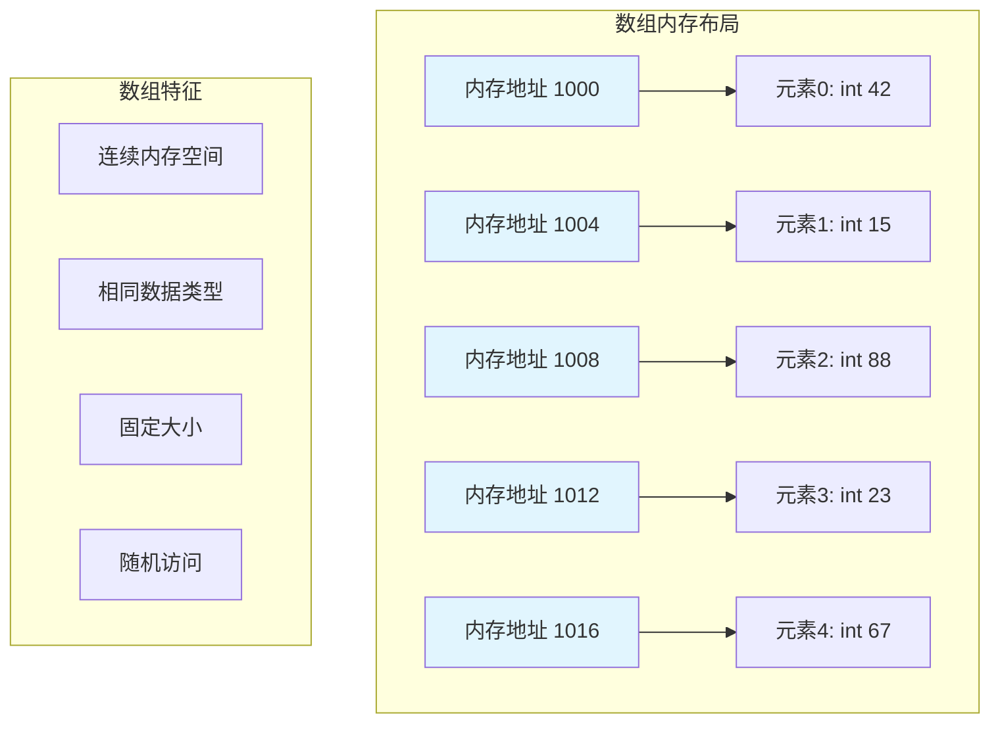

**内存对齐原理**

数组的连续存储还涉及一个关键的底层概念——内存对齐（Memory Alignment）。CPU并不是逐字节读取内存的，而是以**字长**（32位系统4字节、64位系统8字节）为单位读取。如果数据没有对齐到字长边界，CPU可能需要两次内存访问才能读取一个数据，性能会下降。

```
内存对齐示例（64位系统）：

未对齐的结构体数组（浪费且低效）：
struct Bad { char a; int b; };  // sizeof = 8（不是5！编译器插入3字节填充）
地址: [a][pad][pad][pad][b   b   b   b] [a][pad][pad][pad][b   b   b   b]
      0                  4              8                  12

对齐的int数组（紧凑高效）：
int arr[4];  // 每个元素自然对齐到4字节边界
地址: [arr0    ] [arr1    ] [arr2    ] [arr3    ]
      0         4         8         12
```

这就是为什么数组要求"相同类型"——相同类型保证了每个元素大小一致，自然满足内存对齐要求，不需要额外的填充字节（padding），内存利用率最高。

**各语言中数组的内存对齐策略**：

| 语言 | 对齐策略 | 可否手动控制 |
|------|---------|------------|
| C/C++ | 编译器自动对齐，可用 `#pragma pack` 或 `alignas` 控制 | 是 |
| Java | JVM自动对齐到8字节，对象头16字节 | 否（JVM内部优化） |
| Go | 编译器自动对齐，`unsafe.Alignof()` 查询 | 否 |
| Rust | 编译器自动对齐，`#[repr(C)]` 可指定C兼容布局 | 是 |
| Swift | 编译器自动对齐，`MemoryLayout<T>.alignment` 查询 | 有限 |

### 1.2 内存分配原理

一维数组表示代码如下

```java
int[] arr1 = new int[5];
int[] arr2 = {1,2,3,4,5};
```

数组一定要确定长度，连续内存空间

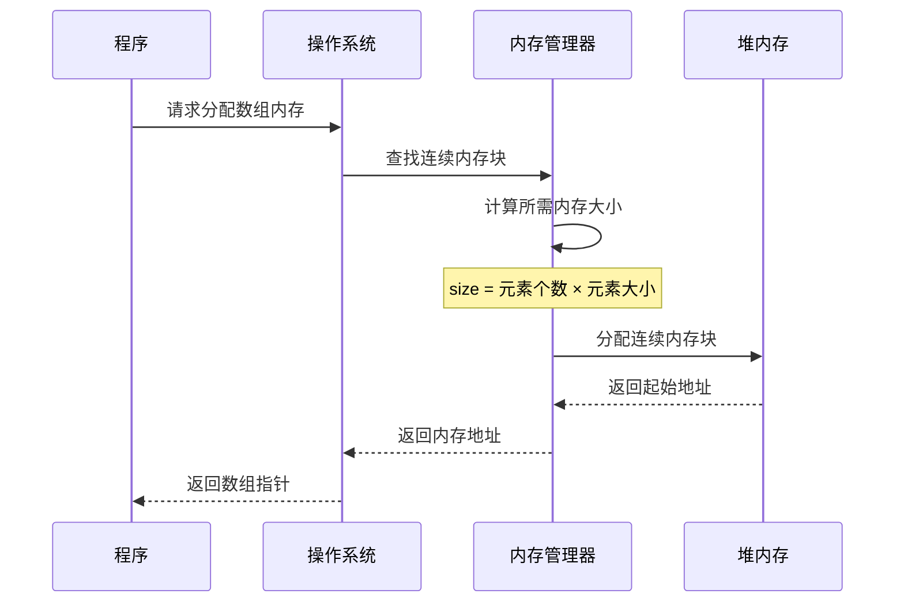

**栈分配 vs 堆分配**

数组的内存分配方式在不同语言中差异很大，核心区别在于栈（Stack）和堆（Heap）：

```
栈分配（速度极快，自动释放）：
┌─────────────────────────┐
│  栈帧（Stack Frame）     │
│  ┌───────────────────┐  │
│  │ int arr[5]        │  │ ← 编译期确定大小，直接在栈上分配
│  │ [0][1][2][3][4]   │  │ ← 函数返回时自动释放
│  └───────────────────┘  │
│  局部变量...             │
└─────────────────────────┘
分配耗时：~1ns（仅移动栈指针）

堆分配（灵活但较慢，需手动或GC释放）：
┌──────────┐        ┌─────────────────────┐
│ 栈帧     │        │  堆内存（Heap）       │
│ ┌──────┐ │   ptr  │  ┌───────────────┐  │
│ │ *arr │─┼───────→│  │ [0][1][2][3]  │  │
│ └──────┘ │        │  └───────────────┘  │
└──────────┘        └─────────────────────┘
分配耗时：~100ns（需要内存管理器搜索可用块）
```

**各语言的数组分配策略**：

```c
// C语言 —— 栈分配（自动释放，但大小必须编译期确定）
int arr_stack[100];

// C语言 —— 堆分配（需手动释放，大小可运行时确定）
int *arr_heap = (int *)malloc(100 * sizeof(int));
free(arr_heap);  // 忘记释放 → 内存泄漏！
```

```java
// Java —— 数组对象始终在堆上分配，由GC回收
int[] arr = new int[100];  // 堆分配 + 对象头(16B) + 长度字段(4B)
// 实际内存占用 = 16(对象头) + 4(length) + 4(padding) + 100×4 = 424字节
// JIT编译器可能会做逃逸分析，将未逃逸的小数组优化到栈上
```

```go
// Go —— 编译器通过逃逸分析自动决定栈/堆
func example() {
    arr := [5]int{1, 2, 3, 4, 5}  // 小数组，不逃逸 → 栈分配
    slice := make([]int, 10000)    // 大切片 → 堆分配
    _ = arr
    _ = slice
}
```

```swift
// Swift —— Array是值类型，小数组内联存储，大数组堆分配
var arr = [1, 2, 3]  // 小数组可能内联在栈上（编译器优化）
// 写时复制(COW)：赋值不立即拷贝，修改时才真正分配新内存
```

**疑惑**：为什么Java的数组一定在堆上，而C可以在栈上？

**答疑**：这是语言设计哲学的差异。C追求极致性能控制，允许程序员选择栈/堆；Java追求安全性和简洁性，所有对象（包括数组）统一在堆上由GC管理，避免了悬挂指针和栈溢出的风险。Go则通过逃逸分析兼顾两者——编译器自动判断：如果数组不会被函数外部引用，就放栈上（快）；否则放堆上（安全）。

### 1.3 数组复杂度思考

数组和链表的复杂度，很多人都回答说，"链表适合插入、删除，时间复杂度O(1)；数组适合查找，查找时间复杂度为 O(1)"。

实际上，这种表述是不准确的。数组是适合查找操作，但是查找的时间复杂度并不为O(1)。即便是排好序的数组，你用二分查找，时间复杂度也是O(logn)。

所以，正确的表述应该是，数组支持随机访问，根据下标随机访问的时间复杂度为 O(1)。

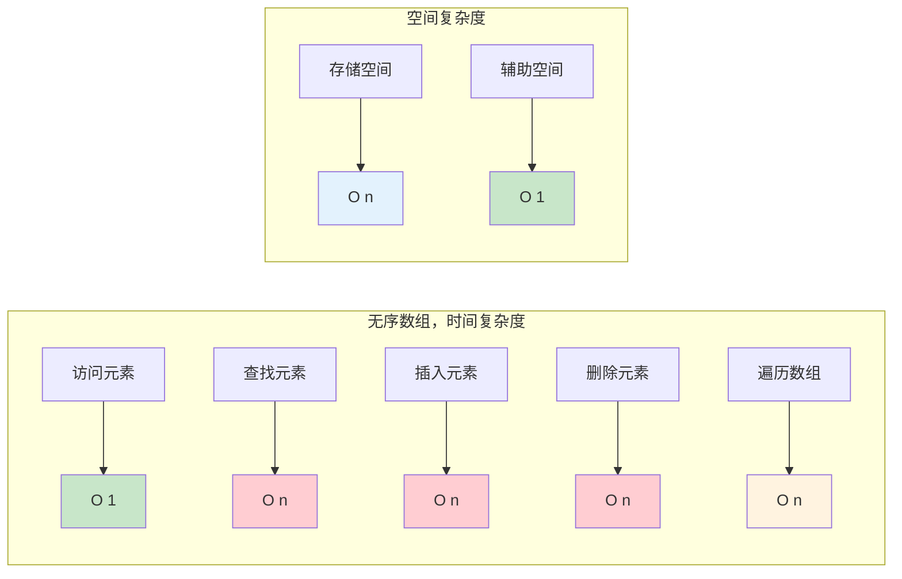

**深入理解"访问"和"查找"的区别**

很多初学者把"访问"和"查找"混为一谈，但它们是完全不同的操作：

| 操作 | 含义 | 前提条件 | 时间复杂度 |
|------|------|---------|-----------|
| **访问**（Access） | 已知下标i，获取arr[i] | 必须知道下标 | O(1) |
| **查找**（Search） | 已知值v，找到v在哪个位置 | 只知道值 | O(N)无序 / O(logN)有序 |
| **包含**（Contains） | 判断值v是否存在 | 只知道值 | O(N)无序 / O(logN)有序 |

```java
int[] arr = {10, 20, 30, 40, 50};

// 访问 O(1)：知道下标，直接取值
int val = arr[2];  // val = 30，一步到位

// 查找 O(N)：知道值，要遍历找下标
int target = 40;
for (int i = 0; i < arr.length; i++) {
    if (arr[i] == target) return i;  // 最坏遍历全部
}
```

**疑惑**：有序数组的二分查找O(logN)已经很快了，为什么还需要哈希表O(1)的查找？

**答疑**：因为二分查找要求数组有序，维护有序性的代价是——每次插入都需要O(N)的移动操作。如果数据频繁变动，维护有序的成本远大于二分查找带来的收益。哈希表在查找、插入、删除上都是均摊O(1)，但代价是额外的空间开销和不支持范围查询。

**结论**：没有完美的数据结构，只有最适合场景的数据结构。

## 02.数组优缺点

### 2.1 高效随机访问

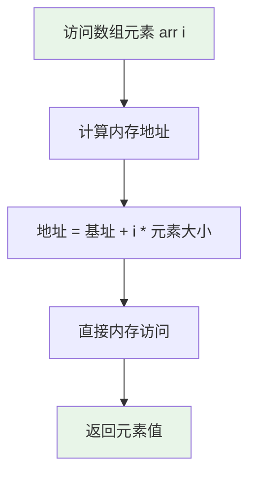

**随机访问的硬件级原理**

数组随机访问之所以是O(1)，不仅是因为地址计算公式简单，更因为现代CPU的硬件架构天然支持这种寻址模式。x86/ARM处理器都有专门的**基址+变址寻址**指令：

```
x86汇编中的数组访问：
; 访问 arr[i]，其中 arr 基址在 rbx，索引 i 在 rcx
mov eax, [rbx + rcx * 4]    ; 一条指令完成：基址 + 索引×元素大小
; CPU在一个时钟周期内完成地址计算和内存请求

ARM汇编中的数组访问：
LDR R0, [R1, R2, LSL #2]    ; R1=基址，R2=索引，LSL #2 即 ×4
```

这意味着数组元素访问在CPU层面就是一条指令的事情——地址计算由ALU（算术逻辑单元）完成，不需要额外的循环或跳转。这就是O(1)的根本保证。

**与链表的对比**：链表访问第i个元素需要从头遍历i次，每次都是一个**间接寻址**——先读当前节点的next指针，再根据这个指针去访问下一个节点。这是i次内存访问，每次还可能触发缓存未命中。

### 2.2 数组的优点

1. 随机访问：数组通过索引可以快速访问和修改元素，时间复杂度为O(1)。这使得数组在需要频繁访问元素的场景中非常高效。 
2. 连续存储：数组的元素在内存中是连续存储的，这有利于缓存的利用，提高访问效率。 
3. 简单：数组的操作相对简单，可以快速进行插入、删除和搜索等操作。 
4. 有序性：数组中的元素按照索引顺序排列，这使得数组在需要有序数据的场景中非常有用。

**缓存预取（Prefetching）优势**

数组最被低估的优点是它对CPU缓存的亲和性。现代CPU有硬件预取器（Hardware Prefetcher），当检测到顺序内存访问模式时，会自动提前加载后续数据到缓存中：

```
数组顺序遍历时的缓存行为：
时刻1: 访问arr[0] → Cache Miss → 从内存加载缓存行（64B = 16个int）
       CPU预取器检测到顺序模式，自动预加载下一个缓存行
时刻2: 访问arr[1]~arr[15] → Cache Hit（全部在缓存中）
时刻3: 访问arr[16] → Cache Hit（预取器已提前加载！）
       → 整个遍历几乎零延迟

链表遍历时的缓存行为：
时刻1: 访问node1(addr=0x100) → Cache Miss → 加载缓存行
时刻2: 访问node2(addr=0x500) → Cache Miss（不连续！预取器无法预测）
时刻3: 访问node3(addr=0x200) → Cache Miss（地址回跳！）
       → 每一步都可能是100ns级别的延迟
```

**SIMD向量化优势**

数组的连续内存还允许编译器使用SIMD（Single Instruction Multiple Data）指令，一次处理多个数组元素：

```c
// 编译器可以将这个循环自动向量化
for (int i = 0; i < n; i++) {
    result[i] = a[i] + b[i];
}
// 优化后（AVX2指令集）：一次加8个int，速度提升8倍
// vpaddd ymm0, ymm1, ymm2  — 一条指令完成8个int的加法
```

链表因为内存不连续，完全无法使用SIMD优化。这也是为什么NumPy（Python科学计算库）底层全部用C数组实现，而不是Python列表——性能差距可达100倍。

### 2.3 数组的缺点

1. 固定大小：数组的大小在创建时就确定，无法动态调整。如果需要存储的元素数量超过数组的初始大小，就需要重新分配更大的数组并进行数据复制，这可能会导致性能损失。
2. 插入和删除效率低：在数组中插入或删除元素时，需要移动其他元素来保持连续性，这可能导致较高的时间复杂度，尤其是在大规模数据的情况下。 
3. 内存浪费：如果数组的大小远远超过实际存储的元素数量，会造成内存的浪费。 
4. 不适用于关联性数据：数组适用于按索引访问元素的场景，但对于需要关联性数据的情况，使用其他数据结构（如字典或哈希表）可能更合适。

详细一点来说：数组作为数据存储结构有一定的缺陷。在无序数组中，搜索性能差，在有序数组中，插入效率又很低，而且这两种数组的删除效率都很低，并且数组在创建后，其大小是固定了，设置的过大会造成内存的浪费，过小又不能满足数据量的存储。

连续的内存空间和相同类型的数据。正是因为这两个限制，它才有了一个堪称"杀手锏"的特性："随机访问"。但有利就有弊，这两个限制也让数组的很多操作变得非常低效，比如要想在数组中删除、插入一个数据，为了保证连续性，就需要做大量的数据搬移工作。

**内存碎片化问题**

数组要求连续内存空间，这在内存碎片化严重时会导致分配失败——即使总空闲内存足够，也可能找不到一块足够大的连续空间：

```
内存碎片化示例：
总空闲：300KB，但分散在多个位置

地址:  [已用100KB][空闲80KB][已用50KB][空闲120KB][已用200KB][空闲100KB]

此时想分配一个200KB的数组 → 失败！
虽然空闲总量300KB > 200KB，但最大的连续空闲块只有120KB

这就是 OOM（OutOfMemoryError）的常见原因之一
```

**疑惑**：Android开发中为什么加载大图片容易OOM？

**答疑**：一张1920×1080的ARGB图片需要 1920×1080×4 = 8MB的**连续内存**。在32位Android系统中，每个进程的堆内存通常限制在256~512MB。如果内存碎片化严重，就算剩余内存大于8MB，也可能找不到连续的8MB空间。这就是为什么Android推荐使用BitmapFactory的inSampleSize来降低分辨率，以及使用Glide/Fresco等图片库的内存池技术——它们通过预分配和复用大内存块来避免碎片化。

**各平台应对碎片化的策略**：

| 平台 | 策略 | 原理 |
|------|------|------|
| JVM | 标记-压缩GC | 移动存活对象消除碎片 |
| Go | 分级内存管理（mcache/mcentral/mheap） | 按大小分级减少碎片 |
| iOS/Swift | ARC + jemalloc | 内存分配器优化 |
| Linux | 伙伴系统 + slab分配器 | 按2的幂次管理内存块 |
| Android | LargeHeap + 内存池 | 预分配复用避免碎片 |

## 03.数组使用场景

### 3.1 那些使用场景

1.数组适用于需要按照索引顺序存储和访问元素的场景。例如，存储学生成绩、员工工资等有序数据时，可以使用数组。

2.由于数组的元素在内存中是连续存储的，这有利于缓存的利用。在需要频繁访问数组元素的场景中，数组可以提供更好的性能。

3.数组是一种通用的数据结构，能用来实现栈、队列等很多数据结构。

**具体业务场景深度分析**：

| 业务场景 | 为何适合数组 | 核心操作 | 实际案例 |
|---------|------------|---------|---------|
| 音视频帧缓冲 | 帧数据大小固定，按顺序读写 | 顺序写入+随机读取 | Android MediaCodec的ByteBuffer |
| 图像像素处理 | 像素矩阵天然是二维数组 | 遍历+随机修改 | iOS CoreImage滤镜处理 |
| 游戏地图格子 | 地图大小确定，需快速定位格子 | O(1)坐标访问 | Unity TileMap底层 |
| 时间序列数据 | 按时间戳等间距采样，适合数组索引 | 范围查询 | 股票K线图、传感器数据 |
| 排行榜/分页 | 按排名/页号随机访问 | 按索引访问 | App热搜榜、商品列表 |

**音视频帧缓冲的案例**：

```java
// Android视频解码 —— 环形缓冲区（本质是数组）
class RingBuffer {
    private byte[] buffer;      // 固定大小的数组
    private int readPos = 0;    // 读指针
    private int writePos = 0;   // 写指针
    
    public RingBuffer(int size) {
        buffer = new byte[size];  // 预分配连续内存，避免GC抖动
    }
    
    public void write(byte[] data) {
        for (byte b : data) {
            buffer[writePos % buffer.length] = b;  // O(1) 取模映射
            writePos++;
        }
    }
    
    public byte read() {
        byte b = buffer[readPos % buffer.length];  // O(1) 随机访问
        readPos++;
        return b;
    }
}
// 为什么不用链表？因为音视频需要零拷贝、SIMD加速、DMA传输——都要求连续内存
```

### 3.2 那些集合用数组

许多集合类的底层实现都使用了数组，例如 ArrayList、Vector、ArrayDeque、PriorityQueue 等。数组提供了高效的随机访问能力，而集合类在此基础上增加了动态扩容、线程安全、排序等功能。

1. ArrayList。底层实现：动态数组。需要频繁访问元素，但插入和删除操作较少的场景。
2. Stack。底层实现：基于 数组 实现。需要实现栈操作的场景。
3. ArrayDeque。底层实现：循环数组。需要高效的双端队列操作。
4. CopyOnWriteArrayList。底层实现：动态数组。
5. String 的字符数组。底层实现：char[] 数组。字符串操作。

**底层实现原理深度剖析**

**ArrayList的数组封装**：

```java
// java.util.ArrayList 核心源码（简化）
public class ArrayList<E> {
    transient Object[] elementData;  // 就是一个普通数组！
    private int size;                // 实际元素个数
    
    // 关键：扩容机制
    private void grow(int minCapacity) {
        int oldCapacity = elementData.length;
        int newCapacity = oldCapacity + (oldCapacity >> 1);  // 1.5倍扩容
        // >> 1 等价于 ÷2，用位运算比除法快
        elementData = Arrays.copyOf(elementData, newCapacity);
        // Arrays.copyOf 底层调用 System.arraycopy（native方法，C实现，利用memcpy）
    }
    
    // get操作：直接数组下标访问
    public E get(int index) {
        rangeCheck(index);           // 边界检查
        return (E) elementData[index]; // O(1)
    }
    
    // add操作：可能触发扩容
    public boolean add(E e) {
        ensureCapacityInternal(size + 1);  // 检查容量
        elementData[size++] = e;            // 数组尾部插入 O(1)均摊
        return true;
    }
}
```

**ArrayDeque的循环数组技巧**：

```java
// java.util.ArrayDeque 使用数组实现双端队列
// 关键技巧：用位运算代替取模，要求容量必须是2的幂
public class ArrayDeque<E> {
    transient Object[] elements;
    transient int head;  // 头指针
    transient int tail;  // 尾指针
    
    public void addFirst(E e) {
        // (head - 1) & (elements.length - 1) 等价于取模，但更快
        head = (head - 1) & (elements.length - 1);
        elements[head] = e;
    }
    
    public void addLast(E e) {
        elements[tail] = e;
        tail = (tail + 1) & (elements.length - 1);
    }
}
// 为什么用位运算？因为 x & (2^n - 1) == x % 2^n，但位运算只需1个时钟周期
// 而取模运算需要20~40个时钟周期（依赖除法器）
```

**跨语言集合与数组的关系**：

| 语言 | 动态数组集合 | 底层实现 | 扩容策略 |
|------|------------|---------|---------|
| Java | ArrayList | Object[] | 1.5倍 |
| C++ | std::vector | T* | 2倍（GCC）/ 1.5倍（MSVC） |
| Go | slice | 指向数组的指针 | <256:2倍，>=256:~1.25倍 |
| Swift | Array | ContiguousArrayStorage | 2倍 |
| Kotlin | MutableList | 委托Java ArrayList | 1.5倍 |
| JavaScript | Array | V8 FixedArray / HashTable | 按需增长 |
| Rust | Vec<T> | RawVec(heap pointer) | 2倍 |
| Python | list | PyObject** | ~1.125倍 |

### 3.3 各平台数组对比

不同语言和平台对数组的实现有本质区别，理解这些差异对跨平台开发非常重要：

| 语言/平台 | 数组类型 | 是否固定大小 | 内存管理 | 特殊说明 |
|-----------|---------|------------|---------|---------|
| **C/C++** | `int arr[10]` | 固定 | 栈/堆手动管理 | 无边界检查 |
| **Java** | `int[]` | 固定 | GC自动管理 | 有边界检查，抛IndexOutOfBounds |
| **Kotlin** | `IntArray` | 固定 | JVM GC | 原始类型数组避免装箱 |
| **Swift** | `[Int]` | **动态** | ARC引用计数 | Array是值类型（COW优化） |
| **Go** | `[10]int` | 固定 | GC自动管理 | 数组是值类型，传参会拷贝 |
| **JavaScript** | `Array` | **动态** | V8 GC | 实际是对象，稀疏数组是哈希表 |
| **Python** | `list` | **动态** | 引用计数+GC | 可存异构类型，不是真正数组 |
| **Rust** | `[i32; 10]` | 固定 | 所有权系统 | 编译期检查边界 |

**疑惑**：JavaScript的Array真的是数组吗？

**答疑**：不完全是。V8引擎根据使用方式自动选择底层实现：

```javascript
// 密集数组 → V8使用真正的连续内存（快速）
const dense = [1, 2, 3, 4, 5];

// 稀疏数组 → V8使用哈希表存储（慢）
const sparse = [];
sparse[0] = 1;
sparse[10000] = 2;  // 中间9999个空位不占内存

// 混合类型 → V8退化为通用对象数组（最慢）
const mixed = [1, "hello", true, {name: "test"}];
```

**Go数组 vs 切片**：

```go
// Go的数组是值类型，大小是类型的一部分
var arr [5]int       // 数组，固定大小，传参会拷贝
var slice []int      // 切片，动态大小，传参传引用

// 切片的底层：指向数组的指针 + 长度 + 容量
type slice struct {
    array unsafe.Pointer  // 指向底层数组
    len   int             // 当前长度
    cap   int             // 容量
}
```

**Swift数组的写时复制（COW）**：

```swift
var a = [1, 2, 3]
var b = a        // b和a共享同一块内存（不拷贝）
b.append(4)      // 写操作触发拷贝，b获得独立副本
// 此时a=[1,2,3]，b=[1,2,3,4]，各自独立
```

## 04.线性表和非线性表

### 4.1 什么是线性表

用于存储一组有序的元素。在线性表中，元素之间存在顺序关系，每个元素都有唯一的前驱和后继元素（除了第一个元素和最后一个元素）。线性表中的元素通常按照其插入顺序排列。

数据排成像一条线一样的结构。每个线性表上的数据最多只有前后两个方向。除了数组，链表、队列、栈也是线性表结构。


**线性表的两种物理实现**

线性表是逻辑概念，物理上有两种截然不同的实现方式，这个区别对性能影响深远：

```
顺序存储（数组）—— 逻辑相邻 = 物理相邻
┌───┬───┬───┬───┬───┐
│ A │ B │ C │ D │ E │   元素在内存中连续存放
└───┴───┴───┴───┴───┘
addr: 100 104 108 112 116   每个元素通过偏移量定位

链式存储（链表）—— 逻辑相邻 ≠ 物理相邻
┌───┬──┐    ┌───┬──┐    ┌───┬──┐
│ A │ ─┼───→│ B │ ─┼───→│ C │ ∅│   元素通过指针连接
└───┴──┘    └───┴──┘    └───┴──┘
addr: 100      500      200        物理地址不连续
```

| 比较维度 | 顺序存储（数组） | 链式存储（链表） |
|---------|---------------|---------------|
| 存储密度 | 高（不需要额外指针） | 低（每个节点多存一个指针） |
| 随机访问 | O(1) | O(N) |
| 插入删除 | O(N)需移动元素 | O(1)已定位时 |
| 空间灵活性 | 需预分配 | 按需分配 |
| 缓存友好 | 极好 | 极差 |

**结论**：数组是线性表在顺序存储方式下的实现。理解"线性表是逻辑结构，数组/链表是物理结构"这个区分，是理解数据结构的第一道门槛。

### 4.2 什么是非线性表

在非线性表中，元素之间的关系不是简单的前后顺序，而是以其他方式相互连接或组织的。非线性表中的元素之间可以存在多种关系，如父子关系、兄弟关系等，不受严格的顺序限制。

非线性表，比如二叉树、堆、图等。之所以叫非线性，是因为，在非线性表中，数据之间并不是简单的前后关系。


**疑惑**：非线性表能否用数组实现？

**答疑**：可以！这是一个极其精妙的设计思想。虽然树和图在逻辑上是非线性的，但很多时候可以用数组作为物理存储：

```
完全二叉树的数组存储（堆的实现）：
逻辑结构：          数组存储：
       1              index: [0]  [1]  [2]  [3]  [4]  [5]  [6]
      / \             value: [1]  [2]  [3]  [4]  [5]  [6]  [7]
     2   3
    / \ / \           父节点: parent = (i - 1) / 2
   4  5 6  7          左子节点: left = 2 * i + 1
                      右子节点: right = 2 * i + 2
```

这种设计的优点是：不需要额外的指针开销（每个节点省2个指针=16字节），而且数组的缓存友好性使得堆排序、优先队列的实际性能非常优秀。Java的PriorityQueue、Go的heap包底层都是这种数组实现。

**数组能实现的非线性结构**：

| 非线性结构 | 数组实现方式 | 实际应用 |
|-----------|------------|---------|
| 完全二叉树/堆 | 按层序存储 | PriorityQueue、堆排序 |
| 图（邻接矩阵） | 二维数组 `adj[i][j]` | 稠密图、Floyd算法 |
| 并查集 | 一维数组 `parent[i]` | 连通性判断、Kruskal算法 |
| 线段树 | 一维数组（4N空间） | 区间查询、RMQ问题 |
| 字典树（Trie） | 二维数组 `children[node][char]` | 自动补全、拼写检查 |

## 05.数组的访问

### 5.1 设计访问元素

数组是如何实现根据下标随机访问元素的吗？

1. 使用方括号[]来访问数组元素，后面跟上要访问的元素的下标。例如，array[5]表示访问数组array中的第六个元素。
2. 数组会根据给定的下标计算出元素在内存中的地址，这个是元素的地址值。
3. 最后通过元素地址值直接精确找到元素值。

通过下标访问数组元素的时间复杂度是O(1)，你可以通过简单的地址计算来直接访问。

### 5.2 数组地址值设计

在数组中，元素的地址值是根据数组的起始地址和元素的下标计算得出的。数组的起始地址是数组在内存中的首地址，而元素的下标表示元素在数组中的位置。

当访问数组元素时，计算元素的地址值的一般公式如下：**元素地址 = 数组起始地址 + (元素下标 * 单个元素的大小)**

单个元素的大小是指数组中每个元素所占用的字节数。通过将元素的下标乘以单个元素的大小，可以得到元素在数组中的偏移量。然后，将数组的起始地址与偏移量相加，即可得到元素的地址值。

数组访问的核心是地址计算，这是数组能够实现O(1)随机访问的根本原因。

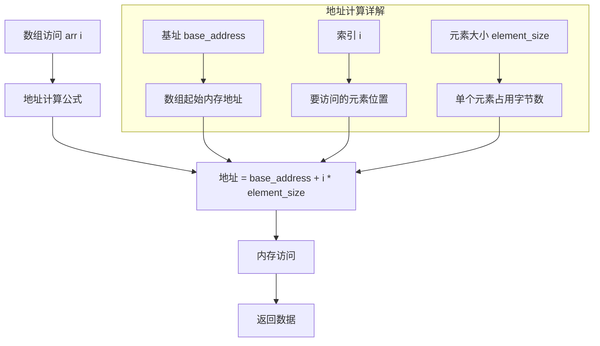

**多维数组的寻址公式**

一维数组的寻址公式容易理解，但多维数组的寻址涉及更复杂的地址映射。以行优先的二维数组为例：

```
一维数组：addr(a[i]) = base + i × size
二维数组：addr(a[i][j]) = base + (i × cols + j) × size
三维数组：addr(a[i][j][k]) = base + (i × dim2 × dim3 + j × dim3 + k) × size
N维数组：本质上是将多维下标"展平"为一维偏移量
```

**疑惑**：为什么说数组的"随机访问"能力是O(1)？这个地址计算本身不需要时间吗？

**答疑**：地址计算涉及一次乘法和一次加法，但这两个操作在CPU上都是**固定时间**完成的——无论数组有10个元素还是1亿个元素，计算量完全一样。"固定时间"就是O(1)的含义。而链表的第i个元素需要遍历i步，遍历步数随i增大而增大，所以是O(N)。

**各语言的边界检查机制**

地址计算虽然是O(1)，但很多语言会在访问时做额外的边界检查，这会带来微小的性能开销：

| 语言 | 边界检查 | 越界行为 | 性能影响 |
|------|---------|---------|---------|
| C/C++ | **不检查** | 未定义行为（可能读写任意内存） | 零开销 |
| Java | 每次访问检查 | 抛出 ArrayIndexOutOfBoundsException | ~5%开销（JIT可优化） |
| Go | 每次访问检查 | panic: runtime error | ~3%开销 |
| Rust | 每次访问检查 | panic（可用unsafe跳过） | ~3%开销 |
| Swift | 每次访问检查 | fatal error: Index out of range | ~3%开销 |
| JavaScript | **不检查** | 返回undefined | 零开销 |

```c
// C语言：不检查边界，可能导致严重安全漏洞
int arr[5] = {1, 2, 3, 4, 5};
int val = arr[10];  // 未定义行为！读取了数组之外的内存
// 这正是缓冲区溢出攻击的根源

// Java：每次访问都检查边界
int[] arr = new int[5];
int val = arr[10];  // 立即抛出 ArrayIndexOutOfBoundsException
// 安全，但有性能开销
```

### 5.3 用例子来理解

我们拿一个长度为 10 的 int 类型的数组 int[ ] a = new int[10] 来举例。在我画的这个图中，计算机给数组 a[10]，分配了一块连续内存空间 1000～1039，其中，内存块的首地址为 base_address = 1000。


计算机会给每个内存单元分配一个地址，计算机通过地址来访问内存中的数据。当计算机需要随机访问数组中的某个元素时，它会首先通过下面的寻址公式，计算出该元素存储的内存地址，最后找到元素。

```java
int 类型的数据，字节的大小是4
a[0] = 4，那么，地址值 = 1000 + 0 * 4 = 1000
a[1] = 5，那么，地址值 = 1000 + 1 * 4 = 1004
a[2] = 7，那么，地址值 = 1000 + 2 * 4 = 1008
```

**多语言验证地址计算**

理论不如实践，以下代码可以直接验证数组的内存地址是否连续：

```c
// C语言 —— 直接打印内存地址
#include <stdio.h>
int main() {
    int arr[5] = {10, 20, 30, 40, 50};
    for (int i = 0; i < 5; i++) {
        printf("arr[%d] = %d, 地址 = %p, 偏移 = %ld\n",
               i, arr[i], &arr[i], (char*)&arr[i] - (char*)&arr[0]);
    }
    return 0;
}
// 输出示例：
// arr[0] = 10, 地址 = 0x7fff5e8a0, 偏移 = 0
// arr[1] = 20, 地址 = 0x7fff5e8a4, 偏移 = 4   ← 每个int占4字节
// arr[2] = 30, 地址 = 0x7fff5e8a8, 偏移 = 8
// arr[3] = 40, 地址 = 0x7fff5e8ac, 偏移 = 12
// arr[4] = 50, 地址 = 0x7fff5e8b0, 偏移 = 16
```

```go
// Go语言 —— 验证数组和切片的地址
package main
import (
    "fmt"
    "unsafe"
)
func main() {
    arr := [5]int{10, 20, 30, 40, 50}
    base := uintptr(unsafe.Pointer(&arr[0]))
    for i := 0; i < 5; i++ {
        addr := uintptr(unsafe.Pointer(&arr[i]))
        fmt.Printf("arr[%d] = %d, 偏移 = %d字节\n", i, arr[i], addr-base)
    }
}
// 输出：偏移分别为 0, 8, 16, 24, 32（64位系统int占8字节）
```

```swift
// Swift —— 验证Array的内存布局
var arr = [10, 20, 30, 40, 50]
arr.withUnsafeBufferPointer { buffer in
    let base = buffer.baseAddress!
    for i in 0..<arr.count {
        let addr = base + i
        print("arr[\(i)] = \(addr.pointee), 偏移 = \(i * MemoryLayout<Int>.stride)字节")
    }
}
```

这些验证结果都证明了同一个事实：数组元素在内存中是**严格连续**存放的，每个元素之间的间距恰好等于一个元素的字节大小。

## 06.数组低效插入

### 6.1 插入操作复杂度

假设数组的长度为 n，现在，如果我们需要将一个数据插入到数组中的第 k 个位置。为了把第 k 个位置腾出来，给新来的数据，我们需要将第 k～n 这部分的元素都顺序地往后挪一位。那插入操作的时间复杂度是多少呢？

1. 如果在数组的末尾插入元素，那就不需要移动数据了，这时的时间复杂度为 O(1)。
2. 如果在数组的开头插入元素，那所有的数据都需要依次往后移动一位，所以最坏时间复杂度是 O(n)。
3. 如果在数组中间插入元素也需要将插入位置后的元素向后移动，以便为新元素腾出空间。在这种情况下，时间复杂度也是 O(n)，因为需要移动 n/2 个元素（平均情况）。

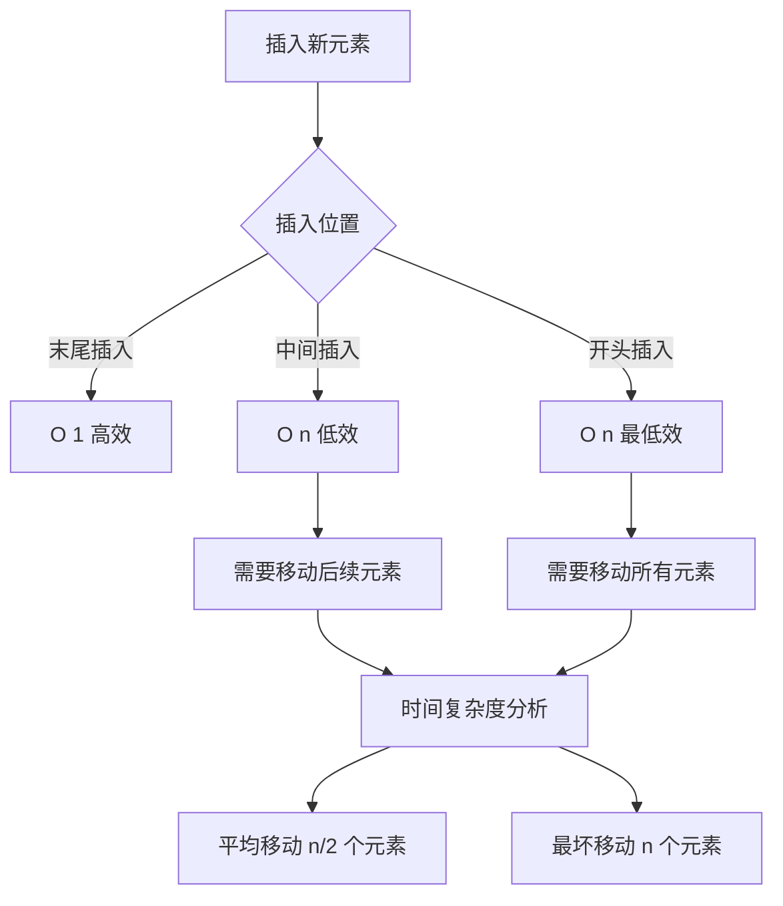

因为我们在每个位置插入元素的概率是一样的，所以平均情况时间复杂度为 (1+2+…n)/n=O(n)。建议：因此，在频繁执行插入操作的情况下，可能需要考虑使用其他数据结构，如链表，以避免频繁的元素移动。

### 6.2 分析插入效率低

数组插入数据效率低的原因主要是由于数组的内部实现方式。在大多数编程语言中，数组是一种连续的内存块，插入数据需要做：

1. 移动元素：由于数组是连续的内存块，插入数据会导致插入位置之后的元素都需要向后移动，以腾出空间给新插入的元素。 
2. 空间开销：如果数组已经满了，无法容纳更多的元素，那么需要重新分配更大的内存空间，并将原有的元素复制到新的内存空间中。
3. 内存拷贝：元素移动实际上是一种内存拷贝操作，需要将一部分元素复制到新的位置。这种内存拷贝操作会消耗额外的时间，尤其是在数组规模较大时，影响插入操作的效率。

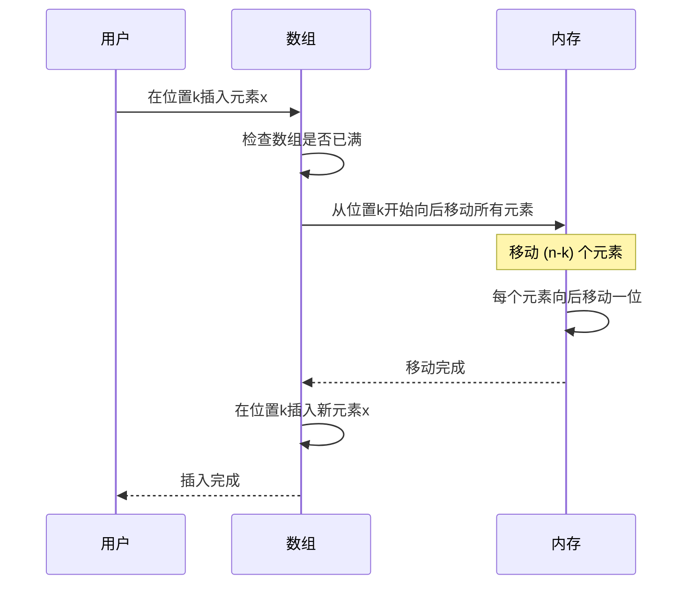

这三个操作都需要耗费时间，特别是在大型数组中插入数据时，效率会更低。因此，频繁地在数组中插入数据可能会导致性能下降。如果需要频繁地进行插入操作，可以考虑使用其他数据结构来提高性能。

### 6.3 如何提高插入效率

插入操作性能优化策略

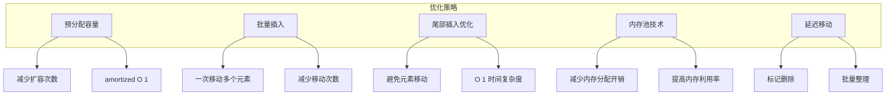

**策略一：无序数组的O(1)插入**

如果数组元素的顺序不重要，可以用一个巧妙的技巧将中间位置的插入从O(N)优化到O(1)——把目标位置的元素搬到数组末尾，然后在目标位置放入新元素：

```java
// 普通插入 O(N)：在index位置插入value
void insertNormal(int[] arr, int size, int index, int value) {
    // 需要移动 size-index 个元素
    for (int i = size; i > index; i--) {
        arr[i] = arr[i - 1];
    }
    arr[index] = value;
}

// 优化插入 O(1)：如果不要求有序
void insertFast(int[] arr, int size, int index, int value) {
    arr[size] = arr[index];  // 原位置元素搬到末尾
    arr[index] = value;      // 新元素放入目标位置
    // 仅2次赋值，无论数组多大
}
```

**策略二：System.arraycopy的底层优化**

Java中大量元素搬移时，不要手写for循环——`System.arraycopy`是native方法，底层用C实现的`memcpy`/`memmove`，可以利用CPU的块拷贝指令，比逐元素拷贝快5~10倍：

```java
// 低效：逐元素拷贝
for (int i = size; i > index; i--) {
    arr[i] = arr[i - 1];  // 每次循环：数组边界检查 + 寻址 + 赋值
}

// 高效：System.arraycopy（底层用memcpy/memmove）
System.arraycopy(arr, index, arr, index + 1, size - index);
arr[index] = value;
// 底层一次DMA传输完成所有搬移，利用CPU缓存行批量操作
```

**策略三：分块数组（Block Array）**

如果频繁在中间插入，可以将大数组分成多个小块，每块内部是数组，块之间用链表连接。这样插入只需移动一个块内的元素（块大小通常√N），时间复杂度从O(N)降到O(√N)：

```
传统数组：插入需移动N个元素
[1][2][3][4][5][6][7][8][9]  → 插入到位置3，需移动6个元素

分块数组：每块3个元素
[1][2][3] → [4][5][6] → [7][8][9]
              ↑ 插入到这个块，只需移动块内2个元素
[1][2][3] → [X][4][5] → [6][] [] → [7][8][9]
              块满了就分裂，类似B树的思想
```

这就是C++的`std::deque`和数据库B+树的核心思想——在数组的O(1)随机访问和链表的O(1)插入之间取得平衡。

## 07.数组低效删除

### 7.1 普通删除元素

跟插入数据类似，如果我们要删除第k个位置的数据，为了内存的连续性，也需要搬移数据，不然中间就会出现空洞，内存就不连续了。

和插入类似，如果删除数组末尾的数据，则最好情况时间复杂度为 O(1)；如果删除开头的数据，则最坏情况时间复杂度为 O(n)；平均情况时间复杂度也为 O(n)。

**各语言的删除实现对比**

```java
// Java ArrayList —— 使用System.arraycopy批量搬移
public E remove(int index) {
    E oldValue = elementData[index];
    int numMoved = size - index - 1;
    if (numMoved > 0)
        System.arraycopy(elementData, index + 1, elementData, index, numMoved);
    elementData[--size] = null;  // 置空帮助GC回收
    return oldValue;
}
```

```go
// Go slice —— 利用copy函数（底层是memmove）
func removeAt(s []int, index int) []int {
    copy(s[index:], s[index+1:])  // 向前覆盖
    return s[:len(s)-1]           // 缩小长度
    // 注意：底层数组容量不变，不会释放内存
}
```

```swift
// Swift Array —— remove(at:) 方法
var arr = [1, 2, 3, 4, 5]
arr.remove(at: 2)  // 移除index=2的元素，后续元素前移
// Swift的COW机制：如果arr有多个引用，会先拷贝再删除
```

**无序数组的O(1)删除**

和插入一样，如果不要求保序，可以将末尾元素覆盖到删除位置，实现O(1)删除：

```java
void removeFast(int[] arr, int[] sizeRef, int index) {
    arr[index] = arr[sizeRef[0] - 1];  // 末尾元素覆盖到删除位置
    sizeRef[0]--;                        // 逻辑大小减1
    // 仅1次赋值操作，O(1)
}
```

这个技巧在游戏开发中非常常见——ECS（Entity Component System）架构中，实体删除就是用这种"交换到末尾再缩小"的方式，保证组件数组紧凑且删除高效。

### 7.2 集中删除多个元素

实际上，在某些特殊场景下，我们并不一定非得追求数组中数据的连续性。如果我们将多次删除操作集中在一起执行，删除的效率是不是会提高很多呢？

我们继续来看例子。数组 a[10]中存储了 8 个元素：a，b，c，d，e，f，g，h。现在，我们要依次删除 a，b，c 三个元素。

**为了避免 d，e，f，g，h+这几个数据会被搬移三次，我们可以先记录下已经删除的数据。每次的删除操作并不是真正地搬移数据，只是记录数据已经被删除。当数组没有更多空间存储数据时，我们再触发执行一次真正的删除操作，这样就大大减少了删除操作导致的数据搬移**。

核心思想是，使用缓冲区：在删除操作频繁的情况下，可以考虑使用缓冲区，将多个删除操作合并为一次性的批量删除，减少元素移动次数，提高效率。


**如果你了解 JVM，你会发现，这不就是JVM标记清除垃圾回收算法的核心思想吗**？没错，数据结构和算法的魅力就在于此，很多时候我们并不是要去死记硬背某个数据结构或者算法，而是要学习它背后的思想和处理技巧，这些东西才是最有价值的。

如果你细心留意，不管是在软件开发还是架构设计中，总能找到某些算法和数据结构的影子。

**标记删除思想在各领域的应用**

这种"延迟删除+批量整理"的思想绝不仅限于数组，它是计算机科学中一种通用的优化模式：

```
数组标记删除：
[a][b][c][d][e][f]  → 删除b,d → [a][×][c][×][e][f]
                     → 标记阶段完成，实际数据未移动
                     → 整理阶段：[a][c][e][f][ ][ ]
                     → 一次批量移动，而非两次独立移动

JVM标记-清除GC：
堆内存: [obj1][obj2][obj3][obj4][obj5]
         ↓ 标记阶段：遍历GC Root，标记存活对象
        [存活][垃圾][存活][垃圾][存活]
         ↓ 清除阶段：回收垃圾对象的内存
        [obj1][空洞][obj3][空洞][obj5]

JVM标记-压缩GC（更类似数组的集中删除）：
         ↓ 压缩阶段：移动存活对象消除空洞
        [obj1][obj3][obj5][空闲空间...]
```

| 应用场景 | 标记方式 | 整理触发条件 | 实际案例 |
|---------|---------|-------------|---------|
| 数组集中删除 | 标记位/特殊值 | 空间不足时 | ArrayList的批量remove |
| JVM GC | 可达性分析 | 内存阈值 | CMS、G1、ZGC |
| 数据库 | 删除标记位(is_deleted) | 定期vacuum | MySQL InnoDB、PostgreSQL |
| 文件系统 | 标记inode为空闲 | 磁盘空间回收 | ext4、NTFS的trim |
| SSD垃圾回收 | 页级标记 | 垃圾块达阈值 | SSD FTL层的GC |

**疑惑**：数据库中的"软删除"（`is_deleted=1`）和数组的标记删除是同一思想吗？

**论证**：是的！数据库的软删除本质上就是数组标记删除思想的扩展。行数据在磁盘上的物理存储就是一种"数组"（InnoDB的页内行记录是顺序存放的）。标记删除后，这些"空洞"会在后台通过compaction（压缩）或vacuum（清理）操作集中回收。这避免了每次DELETE都触发数据页的重组，大幅提高了删除吞吐量。

**结果**：无论是数组操作、JVM GC还是数据库存储，"先标记后整理"的核心思想都是——**用空间换时间，用批量操作替代单次操作，降低均摊成本**。

## 08.容器和数组

### 8.1 问题思考分析

针对数组类型，很多语言都提供了容器类，比如 Java 中的 ArrayList、C++ 中的 vector。在项目开发中，什么时候适合用数组，什么时候适合用容器呢？

这里我拿 Java 语言来举例。如果你是 Java 工程师，几乎天天都在用 ArrayList，对它应该非常熟悉。那它与数组相比，到底有哪些优势呢？

### 8.2 集合的优势

个人觉得，ArrayList 最大的优势就是可以将很多数组操作的细节封装起来。比如前面提到的数组插入、删除数据时需要搬移其他数据等。另外，它还有一个优势，就是支持动态扩容。

数组本身在定义的时候需要预先指定大小，因为需要分配连续的内存空间。如果我们申请了大小为 10 的数组，当第 11 个数据需要存储到数组中时，我们就需要重新分配一块更大的空间，将原来的数据复制过去，然后再将新的数据插入。

如果使用 ArrayList，我们就完全不需要关心底层的扩容逻辑，ArrayList 已经帮我们实现好了。每次存储空间不够的时候，它都会将空间自动扩容为 1.5+倍大小。

不过，这里需要注意一点，因为扩容操作涉及内存申请和数据搬移，是比较耗时的。所以，如果事先能确定需要存储的数据大小，最好在创建 ArrayList 的时候事先指定数据大小。比如我们要从数据库中取出 10000 条数据放入 ArrayList。

### 8.3 两者特性比较

| 特性          | 数组              | 容器                          |
|-------------|-----------------|-----------------------------|
| **大小**      | 固定大小，声明时确定      | 动态大小，可以自动调整                 |
| **内存管理**    | 手动管理（如 C/C++）   | 自动管理（如 C++ 的 `std::vector`） |
| **元素类型**    | 必须相同            | 可以相同，也可以不同（如 `std::any`）    |
| **访问方式**    | 通过索引直接访问        | 通过迭代器或索引访问                  |
| **插入/删除效率** | 低效，需要移动元素       | 高效，容器内部优化了插入和删除操作           |
| **功能**      | 基本功能（存储和访问）     | 提供丰富功能（如排序、查找、遍历等）          |
| **内存连续性**   | 元素在内存中连续存储      | 元素在内存中可能不连续存储               |
| **性能**      | 访问速度快，适合固定大小的场景 | 灵活性高，适合动态大小的场景              |

### 8.4 数组和集合总结

**数组**：

- 数据量固定且已知。
- 需要高效的随机访问。
- 对内存占用有严格要求（如嵌入式系统）。
- 示例：存储一周的天数、图像像素数据等。

**容器**：

- 数据量动态变化。
- 需要频繁插入、删除或修改数据。
- 需要高级功能（如排序、查找、遍历等）。
- 示例：存储用户输入、管理动态列表、实现复杂数据结构等。

作为高级语言编程者，是不是数组就无用武之地了呢？当然不是，有些时候，用数组会更合适些，我总结了几点自己的经验。

- 1.Java+ArrayList 无法存储基本类型，比如 int、long，需要封装为 Integer、Long 类，而 Autoboxing、Unboxing 则有一定的性能消耗，所以如果特别关注性能，或者希望使用基本类型，就可以选用数组。
- 2.如果数据大小事先已知，并且对数据的操作非常简单，用不到 ArrayList 提供的大部分方法，也可以直接使用数组。
- 3.还有一个是个人的喜好，当要表示多维数组时，用数组往往会更加直观。比如 Object[][] array；而用容器的话则需要这样定义：ArrayList<ArrayList >+array。

对于业务开发，直接使用容器就足够了，省时省力。毕竟损耗一丢丢性能，完全不会影响到系统整体的性能。但如果你是做一些非常底层的开发，比如开发网络框架，性能的优化需要做到极致，这个时候数组就会优于容器，成为首选。

### 8.5 使用场景

**必须用原生数组的场景**：

1. **JNI/FFI跨语言调用**：Java通过JNI调用C/C++时，传递的必须是原生数组（如`byte[]`），ArrayList无法直接传递
2. **网络IO缓冲区**：NIO的ByteBuffer底层是byte数组，Netty的ByteBuf也是基于数组
3. **音视频编解码**：音频PCM数据、视频YUV像素数据本质都是字节数组
4. **Android Bitmap**：像素数据存储在`int[]`或`byte[]`中，通过`getPixels()`获取
5. **密码学运算**：加密算法操作的是固定长度的字节数组（如AES的128/192/256位密钥）

**各平台的性能敏感场景**：

```java
// Android性能敏感场景：SparseArray替代HashMap<Integer, Object>
// SparseArray底层就是两个平行数组，避免了Integer装箱
SparseArray<String> sparse = new SparseArray<>();
sparse.put(1, "one");     // 底层：int[] keys, Object[] values
sparse.get(1);            // 二分查找keys数组，O(logN)
// 比HashMap节省40%内存（无Entry对象开销、无Integer装箱）
```

```swift
// iOS性能敏感场景：ContiguousArray
// 当元素类型不是类（class）时，Array和ContiguousArray相同
// 但当元素是协议类型时，ContiguousArray保证连续存储，性能更好
var arr: ContiguousArray<Int> = [1, 2, 3, 4, 5]
// 保证底层是连续的C数组，不会退化为NSArray的桥接
```

### 8.6 如何选择

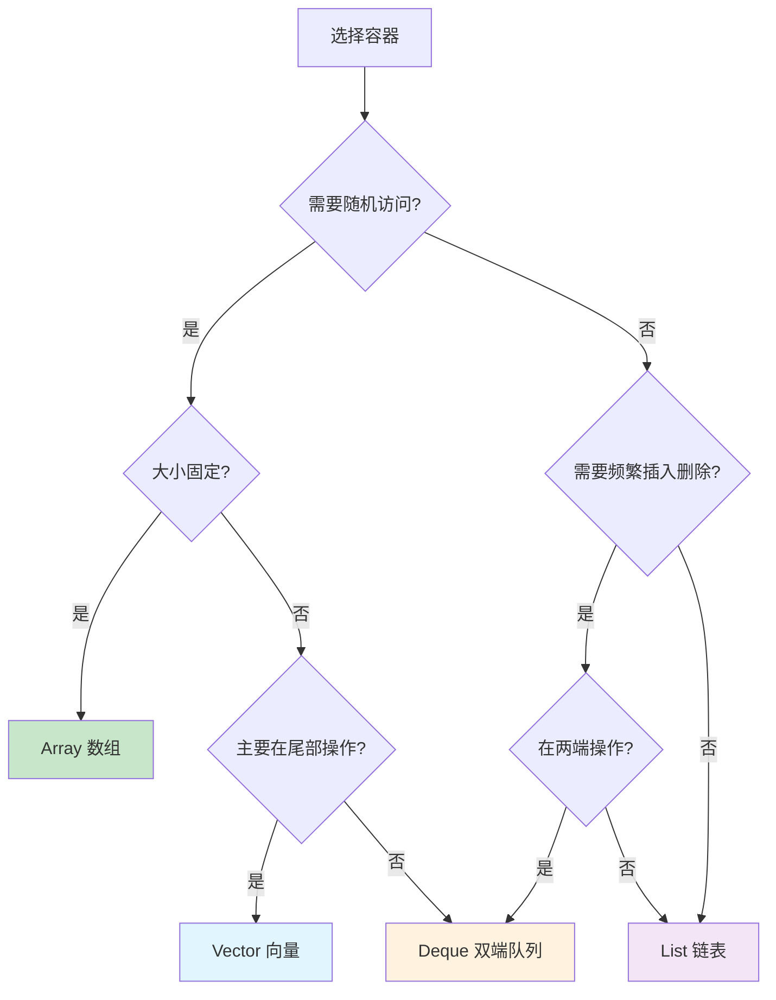

**实战决策指南**

| 需求场景 | 推荐选择 | 理由 |
|---------|---------|------|
| 存储100万条日志，只追加不删除 | 数组/ArrayList | 尾部追加O(1)，顺序遍历缓存友好 |
| 实现消息队列，头部出队尾部入队 | ArrayDeque/循环数组 | 双端O(1)，比LinkedList快数倍 |
| 频繁在中间插入删除（如文本编辑器） | 链表/Gap Buffer | 避免大量元素搬移 |
| 需要O(1)查找且数据频繁变动 | HashMap/HashSet | 牺牲顺序换取查找性能 |
| 需要有序+快速查找 | TreeMap/有序数组+二分 | 有序数组适合静态数据 |
| 游戏中管理大量实体（ECS架构） | 紧凑数组+swap-remove | 缓存友好+O(1)删除 |

## 09.为何数组从0开始

### 9.1 下标的设计

数组下标是编程中非常重要的概念，它们可以用于访问和修改数组中的元素。通过操作数组下标，可以对数组进行排序、搜索、删除和插入等操作，使得我们可以灵活地处理数据。

**下标的本质——偏移量（Offset）**

理解下标最关键的一点是：下标**不是序号**，而是**偏移量**。`arr[3]`的含义是"从数组起始位置偏移3个元素大小的位置"，而不是"第3个元素"。

```
偏移量视角：
基址 → [偏移0][偏移1][偏移2][偏移3][偏移4]
        arr[0]  arr[1]  arr[2]  arr[3]  arr[4]

序号视角（人类直觉）：
        第1个   第2个   第3个   第4个   第5个
```

这个"偏移量"的本质决定了：
- C指针运算 `*(arr + 3)` 等价于 `arr[3]`——指针前进3个元素大小
- 下标从0开始是最自然的——第一个元素的偏移量就是0

**各语言的下标起始设计**：

| 语言 | 起始下标 | 负数下标 | 设计理由 |
|------|---------|---------|---------|
| C/C++ | 0 | 不支持（但指针可回退） | 与指针运算一致 |
| Java | 0 | 不支持 | 沿袭C传统 |
| Python | 0 | 支持（-1表示末尾） | 0起始 + 负数语法糖 |
| Lua | **1** | 不支持 | 数学家设计，更符合人类直觉 |
| MATLAB | **1** | 不支持 | 数学矩阵从1开始 |
| Fortran | **1**（可自定义） | 不支持 | 科学计算传统 |
| Swift | 0 | 不支持 | 沿袭C传统 |
| Go | 0 | 不支持 | 沿袭C传统 |
| Rust | 0 | 不支持 | 沿袭C传统 |

Python的负数下标是一个精巧的设计——`arr[-1]`实际上是`arr[len(arr)-1]`的语法糖，底层仍然转换为正偏移量。

### 9.2 从0开始访问

为什么大多数编程语言中，数组要从 0 开始编号，而不是从 1 开始呢？+从数组存储的内存模型上来看，"下标"最确切的定义应该是"偏移（offset）"。

数组下标从0开始的设计有深刻的数学和工程原理。

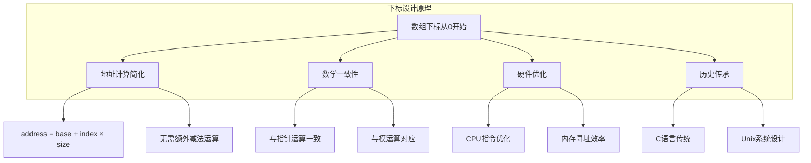

前面也讲到，如果用 a 来表示数组的首地址，a[0] 就是偏移为 0 的位置，也就是首地址，a[k] 就表示偏移 k 个 type_size 的位置，所以计算 a[k] 的内存地址只需要用这个公式：a[k]_address = base_address + k * type_size

但是，如果数组从+1+开始计数，那我们计算数组元素+a%5Bk%5D+的内存地址就会变为：a[k]_address = base_address + (k-1)*type_size

对比两个公式，我们不难发现，从 1 开始编号，每次随机访问数组元素都多了一次减法运算，对于 CPU 来说，就是多了一次减法指令。

数组作为非常基础的数据结构，通过下标随机访问数组元素又是其非常基础的编程操作，效率的优化就要尽可能做到极致。所以为了减少一次减法操作，数组选择了从 0 开始编号，而不是从 1 开始。

### 9.3 历史原因导致

上面解释得再多其实都算不上压倒性的证明，说数组起始编号非 0 开始不可。

所以我觉得最主要的原因可能是历史原因。 C 语言设计者用 0 开始计数数组下标，之后的 Java、JavaScript 等高级语言都效仿了 C 语言，或者说，为了在一定程度上减少 C 语言程序员学习 Java 的学习成本，因此继续沿用了从 0 开始计数的习惯。甚至还有一些语言支持负数下标，比如 Python。

**C语言之父的设计考量**

Dennis Ritchie（C语言之父）设计数组从0开始，有一个更深层的原因——C语言中数组名就是指针。`arr[i]`被编译器翻译为`*(arr + i)`，其中`arr`是首元素的指针。如果从1开始，每次寻址都要多一步`*(arr + i - 1)`的减法运算。

在PDP-11（C语言诞生的硬件平台）上，一条减法指令的开销是可测量的——当时CPU频率只有几MHz。Dennis Ritchie的设计哲学是：**让最常见的操作最高效**。

```
技术演变时间线：
1957 - Fortran：下标从1开始（数学家思维）
1964 - BCPL：下标从0开始（Ken Thompson）
1972 - C语言：继承BCPL，下标从0开始（Dennis Ritchie）
1983 - C++：继承C
1991 - Python：从0开始，但增加负数下标
1993 - Lua：从1开始（反其道而行）
1995 - Java/JavaScript：继承C传统
2009 - Go：继承C传统
2010 - Rust：继承C传统
2014 - Swift：继承C传统
```

**Dijkstra的数学论证**

计算机科学家Dijkstra在1982年的手稿中严格论证了为什么范围表示应该用半开区间`[0, N)`而不是闭区间`[1, N]`。核心论点是：半开区间的长度等于`上界 - 下界 = N - 0 = N`，公式最简洁；而闭区间的长度是`上界 - 下界 + 1 = N - 1 + 1 = N`，多了一步加1操作，容易出现"差一错误"（off-by-one error）。

### 9.4 下标计算数学原理

**疑惑**：数组寻址为什么能做到O(1)，而链表不行？

**答疑**：关键在于数组的**连续内存+固定元素大小**这两个前提条件。有了这两个前提，地址计算就是一个简单的算术运算（一次乘法+一次加法），而算术运算的时间是固定的，不随数组大小变化。

链表做不到O(1)随机访问，因为链表节点在内存中是分散的，无法通过计算得到第i个节点的地址——只能从头节点开始，沿着指针一个一个"跳"过去。

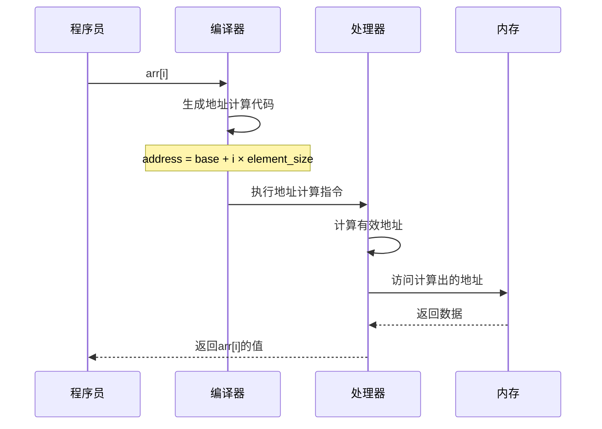

### 9.5 数组与CPU缓存的亲和性

**疑惑**：为什么实际性能测试中，数组遍历往往比链表遍历快得多，甚至快10倍以上？

**论证**：这涉及到CPU缓存机制。

现代CPU有多级缓存（L1/L2/L3），当CPU需要读取内存中的数据时，不是只读一个字节，而是读取一整个**缓存行（Cache Line）**，通常是64字节。

```
数组遍历：
内存: [1][2][3][4][5][6][7][8][9][10][11]...
       └───── 缓存行1 ─────┘└── 缓存行2 ──

第一次访问arr[0]：缓存未命中（Cache Miss），从内存加载整个缓存行
  → arr[0]~arr[15]（假设int=4B，一个缓存行16个int）全部加载到缓存
访问arr[1]~arr[15]：缓存命中（Cache Hit），直接从缓存读取，快100倍！

链表遍历：
内存: [node1]      [node3]  [node2]      [node4]
       addr=100    addr=500  addr=300     addr=800
       └── 缓存行1 ──┘       └── 缓存行2 ──┘

每个节点可能在不同的缓存行中 → 每次访问都可能是缓存未命中
```

**结果**：数组遍历的缓存命中率远高于链表，因此实际性能差距比理论上的O(N) vs O(N)大得多。

| 度量 | 数组遍历 | 链表遍历 |
|------|---------|---------|
| 理论复杂度 | O(N) | O(N) |
| 缓存命中率 | ~99% | ~0%（最坏） |
| 实际速度（大数据量） | 基准 | 慢5~10倍 |

这就是为什么很多高性能系统偏爱数组（即使需要做一些插入删除的额外工作），以及为什么完全二叉树（堆）选择用数组而不是指针实现。


## 10.多维数组与实际应用

### 10.1 多维数组的内存布局

**疑惑**：二维数组在内存中是如何存储的？行优先和列优先有什么区别？

**答疑**：二维数组在逻辑上是一个表格，但内存是一维的线性空间。需要将二维映射到一维，有两种方式：

```
逻辑视图（3×4矩阵）：
    col0  col1  col2  col3
row0 [1]   [2]   [3]   [4]
row1 [5]   [6]   [7]   [8]
row2 [9]   [10]  [11]  [12]

行优先（Row-major，C/C++/Java/Go/Swift/Kotlin）：
内存: [1][2][3][4] | [5][6][7][8] | [9][10][11][12]
      ← row0 →     ← row1 →       ← row2 →

列优先（Column-major，Fortran/MATLAB/Julia）：
内存: [1][5][9] | [2][6][10] | [3][7][11] | [4][8][12]
      ← col0 →   ← col1 →    ← col2 →    ← col3 →
```

**地址计算**：
- 行优先：`addr[i][j] = base + (i * numCols + j) * elemSize`
- 列优先：`addr[i][j] = base + (j * numRows + i) * elemSize`

**论证**：遍历二维数组时，按照存储顺序遍历（行优先语言按行遍历）比逆序遍历快数倍，原因同样是CPU缓存命中率：

```java
// Java中按行遍历（缓存友好）
for (int i = 0; i < rows; i++) {
    for (int j = 0; j < cols; j++) {
        sum += arr[i][j];  // 内存连续访问
    }
}

// Java中按列遍历（缓存不友好）
for (int j = 0; j < cols; j++) {
    for (int i = 0; i < rows; i++) {
        sum += arr[i][j];  // 内存跳跃访问
    }
}
// 大矩阵(10000×10000)下，按行遍历比按列快3~5倍！
```

### 10.2 动态数组的扩容策略

**疑惑**：Java ArrayList每次扩容1.5倍，Go slice每次扩容2倍，为什么选择不同的倍数？

**答疑**：扩容倍数是**时间与空间的权衡**。

```
扩容策略对比：
┌──────────────┬───────────────┬───────────────┬───────────────┐
│ 语言/容器     │ 扩容倍数        │ 空间浪费率(最坏) │ 扩容次数(N次插入) │
├──────────────┼───────────────┼───────────────┼───────────────┤
│ Java ArrayList │ 1.5倍         │ 33%           │ log₁.₅N       │
│ Go slice      │ 2倍(小)/1.25倍 │ 50%/20%       │ log₂N         │
│ C++ vector    │ 2倍           │ 50%           │ log₂N         │
│ Swift Array   │ 2倍           │ 50%           │ log₂N         │
│ Python list   │ ~1.125倍       │ 12.5%         │ ~8logN        │
│ Rust Vec      │ 2倍           │ 50%           │ log₂N         │
└──────────────┴───────────────┴───────────────┴───────────────┘

倍数越大 → 扩容次数越少（时间更好） → 空间浪费越多
倍数越小 → 扩容次数越多（时间更差） → 空间利用更好
```

**Go在1.18之后改进了扩容策略**：小容量（<256）翻倍，大容量增长约1.25倍，平滑过渡避免大数组过度浪费。

**均摊分析（Amortized Analysis）**

**疑惑**：ArrayList每次扩容需要O(N)的拷贝，那append操作不是O(N)吗？为什么说是"均摊O(1)"？

**论证**：假设初始容量为1，扩容倍数为2。插入N个元素的过程中，扩容发生在第1, 2, 4, 8, 16...次插入时：

```
插入过程（容量从1开始，2倍扩容）：
第1次插入: 扩容，拷贝1个元素    → 费用1
第2次插入: 扩容，拷贝2个元素    → 费用2
第3次插入: 无需扩容              → 费用0
第4次插入: 扩容，拷贝4个元素    → 费用4
第5~8次:   无需扩容              → 费用0
第8次插入: 扩容，拷贝8个元素    → 费用8
...

总拷贝费用 = 1 + 2 + 4 + 8 + ... + N = 2N - 1
N次插入的总费用 = 2N - 1（拷贝）+ N（实际赋值）= 3N - 1
均摊每次费用 = (3N - 1) / N ≈ 3 = O(1)
```

**结果**：虽然单次扩容是O(N)，但把成本均摊到所有插入操作上，每次操作的均摊成本是O(1)。这就是为什么ArrayList.add()被称为"均摊O(1)"——大部分时候是O(1)，偶尔一次O(N)的扩容被分摊到之前的所有O(1)操作中。

**实际开发建议**：如果能预估数据量，一定要在创建时指定初始容量，避免扩容：

```java
// 差：默认容量10，存入10000个元素需要扩容约24次
List<String> list1 = new ArrayList<>();

// 好：直接指定容量，零扩容
List<String> list2 = new ArrayList<>(10000);
```

### 10.3 数组在移动端的应用

**Android RecyclerView**：基于数组（List）存储数据源，通过ViewHolder复用机制高效渲染列表。核心是数组的随机访问能力——根据position直接获取数据项。

```java
// Android RecyclerView Adapter
public class MyAdapter extends RecyclerView.Adapter<MyViewHolder> {
    private List<String> dataList;  // 底层是数组
    
    @Override
    public void onBindViewHolder(MyViewHolder holder, int position) {
        // O(1)随机访问，position直接定位数据
        holder.textView.setText(dataList.get(position));
    }
    
    @Override
    public int getItemCount() {
        return dataList.size();
    }
}
```

**iOS UITableView**：同样依赖数组的随机访问能力实现高效列表滚动。

```swift
// iOS UITableView DataSource
func tableView(_ tableView: UITableView, 
               cellForRowAt indexPath: IndexPath) -> UITableViewCell {
    let cell = tableView.dequeueReusableCell(withIdentifier: "cell")!
    // O(1)随机访问
    cell.textLabel?.text = dataArray[indexPath.row]
    return cell
}
```

**Web前端虚拟列表**：大量数据列表渲染时，只渲染可视区域的DOM节点。数组的O(1)随机访问让"根据滚动位置计算应该渲染哪些元素"变得高效：

```javascript
// 虚拟列表核心逻辑
function getVisibleItems(scrollTop, viewportHeight, itemHeight, data) {
    const startIndex = Math.floor(scrollTop / itemHeight);
    const endIndex = Math.min(
        startIndex + Math.ceil(viewportHeight / itemHeight) + 1,
        data.length
    );
    // O(1)计算起始和结束索引，O(k)渲染可见项（k << N）
    return data.slice(startIndex, endIndex);
}
```

### 10.4 数组经典面试题

掌握数组的核心面试题，有助于深入理解数组的特性和技巧：

**1. 两数之和（Two Sum）**：给定数组和目标值，找到两个数使其和等于目标值。

```java
// 哈希表法 O(N) — 利用哈希表弥补数组查找的O(N)劣势
public int[] twoSum(int[] nums, int target) {
    Map<Integer, Integer> map = new HashMap<>();
    for (int i = 0; i < nums.length; i++) {
        int complement = target - nums[i];
        if (map.containsKey(complement)) {
            return new int[]{map.get(complement), i};
        }
        map.put(nums[i], i);
    }
    return new int[]{};
}
```

**2. 合并两个有序数组**：利用数组有序性，双指针从后向前填充。

```java
// 双指针法 O(M+N) — 从后往前避免覆盖
public void merge(int[] nums1, int m, int[] nums2, int n) {
    int p1 = m - 1, p2 = n - 1, p = m + n - 1;
    while (p2 >= 0) {
        if (p1 >= 0 && nums1[p1] > nums2[p2]) {
            nums1[p--] = nums1[p1--];
        } else {
            nums1[p--] = nums2[p2--];
        }
    }
}
```

**3. 原地删除元素**：利用数组连续性，快慢指针原地操作避免额外空间。

```java
// 快慢指针法 O(N) — 空间O(1)
public int removeElement(int[] nums, int val) {
    int slow = 0;
    for (int fast = 0; fast < nums.length; fast++) {
        if (nums[fast] != val) {
            nums[slow++] = nums[fast];
        }
    }
    return slow;
}
```

这些题目的共同点：都在利用或克服数组的核心特性——连续内存、随机访问、固定大小。掌握了数组的本质，这些算法题就不再是死记硬背，而是水到渠成。

**4. 旋转数组**：将数组向右旋转k步。利用"三次反转"技巧实现O(1)空间原地旋转。

```java
// 三次反转法 O(N)时间 O(1)空间
public void rotate(int[] nums, int k) {
    k %= nums.length;
    reverse(nums, 0, nums.length - 1);  // 整体反转
    reverse(nums, 0, k - 1);            // 前k个反转
    reverse(nums, k, nums.length - 1);  // 后n-k个反转
}

private void reverse(int[] nums, int left, int right) {
    while (left < right) {
        int temp = nums[left];
        nums[left++] = nums[right];
        nums[right--] = temp;
    }
}
// 示例：[1,2,3,4,5,6,7], k=3
// 整体反转: [7,6,5,4,3,2,1]
// 前3反转:  [5,6,7,4,3,2,1]
// 后4反转:  [5,6,7,1,2,3,4] ✓
```

**5. 找到数组中的重复元素**：利用数组下标和值的映射关系，用数组自身做哈希表。

```java
// 原地标记法 O(N)时间 O(1)空间
// 前提：数组长度n，元素值范围[1, n]
public int findDuplicate(int[] nums) {
    for (int i = 0; i < nums.length; i++) {
        int index = Math.abs(nums[i]) - 1;
        if (nums[index] < 0) return Math.abs(nums[i]);  // 已被标记过
        nums[index] = -nums[index];  // 标记为负数，表示这个下标对应的值出现过
    }
    return -1;
}
// 核心思想：利用数组下标和值的映射 —— 值v对应下标v-1
// 这是数组特有的O(1)随机访问能力带来的算法优势
```

**数组面试题的四大解题模式**

| 模式 | 核心思想 | 利用的数组特性 | 典型题目 |
|------|---------|-------------|---------|
| **双指针** | 一快一慢或左右夹逼 | 连续内存+随机访问 | 移除元素、有序数组去重、三数之和 |
| **原地哈希** | 用下标做哈希表 | 下标和值的映射 | 缺失数字、重复元素、first missing positive |
| **前缀和** | 预计算区间和 | O(1)随机访问 | 子数组和、连续子数组 |
| **滑动窗口** | 固定/可变窗口滑动 | 连续子数组 | 最大子数组和、最小覆盖子串 |

理解了数组的底层原理，你就会发现这些算法技巧不是凭空冒出来的——它们都是在巧妙利用数组"连续内存+O(1)随机访问"这两个核心特性。
