# 04.链表的设计和实践
#### 目录介绍
- [01.链表的设计介绍](#01链表的设计介绍)
  - [1.1 什么是链表](#11-什么是链表)
  - [1.2 为何设计链表](#12-为何设计链表)
  - [1.3 链表设计思想](#13-链表设计思想)
  - [1.4 链表优缺点](#14-链表优缺点)
  - [1.5 链表的属性](#15-链表的属性)
  - [1.6 链表适用场景](#16-链表适用场景)
- [02.链表结构设计](#02链表结构设计)
  - [2.1 链表基本结构](#21-链表基本结构)
  - [2.2 链表一般节点](#22-链表一般节点)
  - [2.3 链表内存分配](#23-链表内存分配)
  - [2.4 核心设计理念](#24-核心设计理念)
- [03.指针和引用](#03指针和引用)
  - [3.1 指针的本质](#31-指针的本质)
  - [3.2 指针与引用区别](#32-指针与引用区别)
  - [3.3 链表中指针](#33-链表中指针)
- [04.彻底搞懂链表设计](#04彻底搞懂链表设计)
  - [4.1 链表基础节点](#41-链表基础节点)
  - [4.2 链表插入设计](#42-链表插入设计)
  - [4.3 链表删除设计](#43-链表删除设计)
  - [4.4 链表指针丢失](#44-链表指针丢失)
  - [4.5 边界条件处理](#45-边界条件处理)
- [05.链表边界处理](#05链表边界处理)
  - [5.1 常见边界条件](#51-常见边界条件)
  - [5.2 空链表处理策略](#52-空链表处理策略)
  - [5.3 边界条件检查](#53-边界条件检查)
- [06.链表的多种分类](#06链表的多种分类)
  - [3.1 单链表使用](#31-单链表使用)
  - [3.2 双链表使用](#32-双链表使用)
  - [3.3 循环链表使用](#33-循环链表使用)
- [07.链表的性能分析](#07链表的性能分析)
  - [7.1 插入元素性能](#71-插入元素性能)
  - [7.2 删除元素性能](#72-删除元素性能)
  - [7.3 检索元素性能](#73-检索元素性能)
  - [7.4 链表与数组综合对比](#74-链表与数组综合对比)
- [08.链表使用场景](#08链表使用场景)
  - [8.1 哪些用到链表](#81-哪些用到链表)
- [09.链表实际示例](#09链表实际示例)
  - [9.1 链表实现队列](#91-链表实现队列)
  - [9.2 实现LRU缓存](#92-实现lru缓存)


## 01.链表的设计介绍

### 1.1 什么是链表

链表（Linked List）是一种常见的线性数据结构，由一系列节点组成，每个节点包含数据元素和指向下一个节点的指针（引用）。

链表中的节点在内存中不必是连续存储的，而是通过指针相互连接起来，形成一个链式结构。

```
数组 vs 链表的内存模型：

数组：连续的内存块，像一排紧挨的柜子
┌──────┬──────┬──────┬──────┬──────┐
│ 数据0 │ 数据1 │ 数据2 │ 数据3 │ 数据4 │
└──────┴──────┴──────┴──────┴──────┘
  0x100  0x104  0x108  0x10C  0x110    ← 地址连续

链表：散落的内存块，通过指针串联
┌──────┬──┐   ┌──────┬──┐   ┌──────┬──┐
│ 数据0 │ ─┼──→│ 数据1 │ ─┼──→│ 数据2 │∅ │
└──────┴──┘   └──────┴──┘   └──────┴──┘
  0x100         0x300         0x180       ← 地址不连续
```

### 1.2 为何设计链表

使用链表结构可以克服数组需要预先知道数据大小的缺点，链表结构可以充分利用计算机内存空间，实现灵活的内存动态管理。

设计链表这种数据结构可以提高数据操作的效率、灵活性和空间利用率，使得在不同场景下处理数据更加方便和高效。

**数组的三大痛点，正是链表的设计动机**：

| 数组痛点 | 链表解决方案 |
|---------|------------|
| 插入/删除需要移动大量元素 O(N) | 只需修改指针 O(1) |
| 容量固定，扩容需要整体复制 | 天然动态，按需分配 |
| 需要大块连续内存 | 利用零散内存碎片 |

**典型使用场景**：操作系统的进程调度链、浏览器历史记录、LRU缓存淘汰、多项式运算、大整数运算、音乐播放器的播放列表等。

### 1.3 链表设计思想

链表是一种常见的数据结构，其设计思想主要包括以下几个方面：

1. 节点结构：链表由节点组成，每个节点包含两部分，数据域和指针域。数据域用于存储数据，指针域用于指向下一个节点（单向链表）或前一个节点（双向链表）。
2. 动态性：链表具有动态性，可以根据需要动态地分配和释放内存空间，不需要预先指定链表的大小。
3. 插入和删除：链表适合频繁的插入和删除操作，因为在链表中插入或删除节点只需要调整节点的指针，不需要移动其他节点。
4. 遍历：遍历链表时，从头节点开始，依次沿着指针访问每个节点，直到到达尾节点。这种遍历方式适合查找、修改和删除操作。
5. 空间利用：链表可以充分利用内存空间，不会像数组那样存在固定大小的限制，可以根据需要动态增长。

设计链表时需要考虑节点结构、插入和删除操作、遍历操作、异常处理、内存管理和性能优化等关键思想，以实现高效、稳定和易于维护的链表数据结构。

### 1.4 链表优缺点

看第一个案例理解链表优点：假设我们需要实现一个任务管理器，用户可以随时添加、删除和移动任务，这时链表的优点就会显现出来。

优点：插入和删除比较方便(不需移动其他元素, 只需改变指针)，可以动态增长和缩减无需预先分配空间，链表可以充分利用内存空间不会浪费空间。

看第二个案例理解链表缺点：假设我们有一个需要频繁访问链表中倒数第K个节点的需求，这时链表的缺点就会显现出来。在链表中，要找到倒数第K个节点，通常需要从头节点开始遍历整个链表，直到找到倒数第K个节点。这种操作的时间复杂度是O(n)，其中n是链表的长度。

缺点：链表的缺点是访问任意位置的元素时效率较低，因为需要从头节点开始遍历到目标位置。另外，链表需要额外的指针空间来存储节点之间的连接关系因此存储空间利用率低。

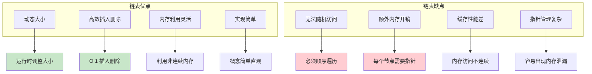

### 1.5 链表的属性

主要有哪些属性呢，如下所示：

- 链表是由内存中一系列不相连的结构组成
- 一种线性表，但是并不会按线性的顺序存储数据
- 每一个结构均含有表元素和next指针，最后一个元素的后续指针是NULL
- 程序执行过程中，链表长度可以增加和缩小
- 没有内存空间的浪费，但是指针需要一些额外的内存开销

**链表属性的内存级理解**：

```
一个典型的单链表节点的内存布局（Java）：

class Node<E> {
    E item;       // 8字节（引用） → 指向堆上的实际数据对象
    Node<E> next; // 8字节（引用） → 指向下一个Node对象
}
对象头：12字节（mark word + klass pointer，64位压缩指针）
对齐填充：4字节
────────────────
总计：32字节/节点（仅Node壳，不含item数据本身）

对比数组：存储一个int只需4字节
链表节点：存储一个int需要 32 + 16(Integer对象) = 48字节
    → 内存膨胀12倍！这就是"指针开销"的真实代价
```

**关键属性对编程的影响**：

| 属性 | 编程影响 | 常见陷阱 |
|------|---------|---------|
| 非连续存储 | 不能用下标访问 | `list.get(i)` 在LinkedList中是O(N) |
| 动态长度 | 无需预分配 | 频繁分配小对象加重GC负担 |
| 单向可达 | 只能从头向尾遍历 | 无法高效获取前驱节点 |
| NULL终止 | 遍历终止条件 | 忘记判空导致NullPointerException |
| 指针互连 | 支持灵活的拓扑结构 | 指针操作顺序错误导致断链或环 |

### 1.6 链表适用场景

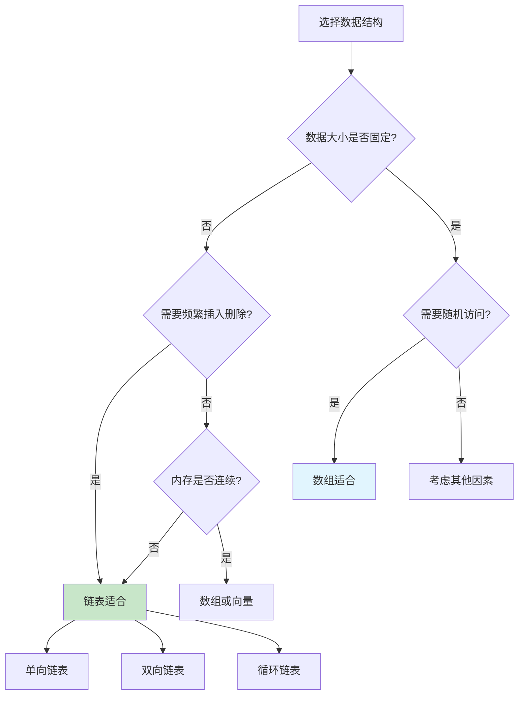

## 02.链表结构设计

### 2.1 链表基本结构

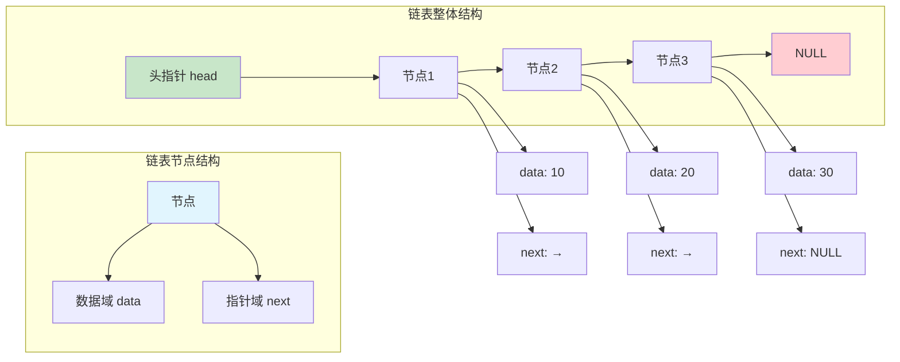

### 2.2 链表一般节点

```java
class Node<T> {
    T data;
    Node next;

    public Node(T data) {
        this.data = data;
        this.next = null;
    }
}
```

### 2.3 链表内存分配

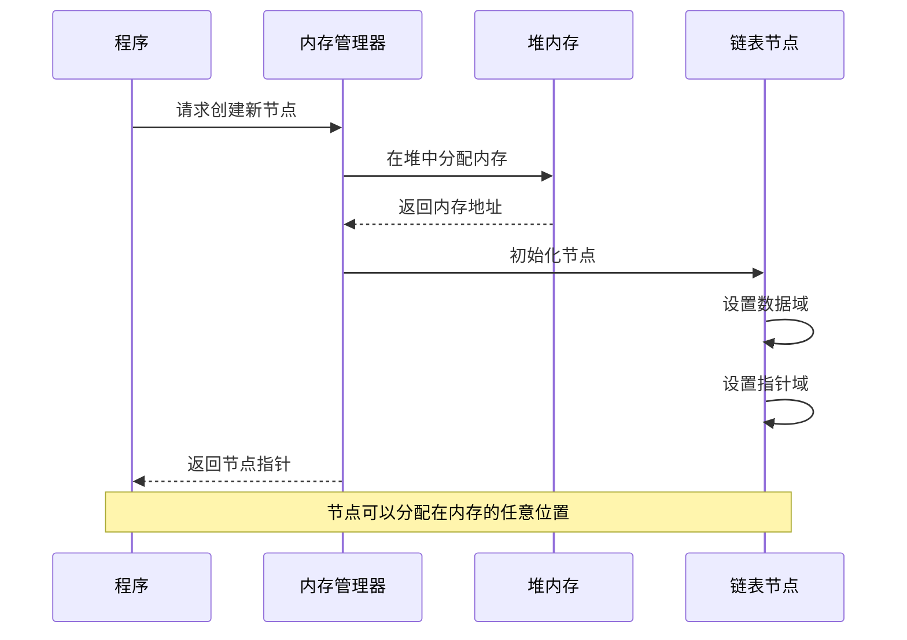

### 2.4 核心设计理念

链表的设计体现了计算机科学中的几个重要思想：

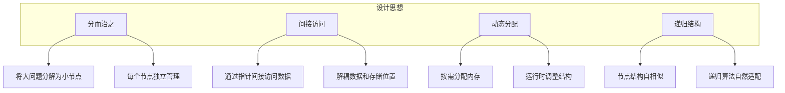

## 03.指针和引用

### 3.1 指针的本质

指针是链表实现的核心概念，理解指针对于掌握链表至关重要。

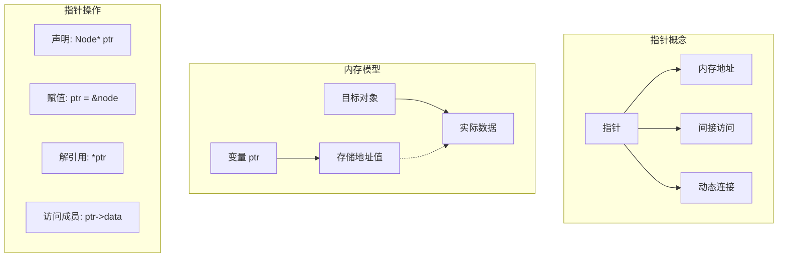

### 3.2 指针与引用区别

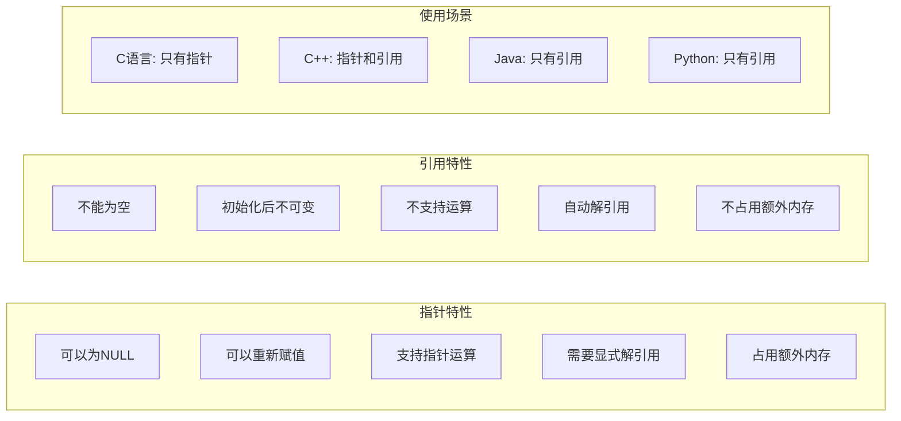

### 3.3 链表中指针

事实上，看懂链表的结构并不是很难，但是一旦把它和指针混在一起，就很容易让人摸不着头脑。所以，要想写对链表代码，首先就要理解好指针。

有些语言有“指针”的概念，比如 C 语言；有些语言没有指针，取而代之的是“引用”，比如 Java、Python。不管是“指针”还是“引用”，实际上，它们的意思都是一样的，都是存储所指对象的内存地址。

接下来，拿 C 语言中的“指针”来讲解，如果你用的是Java或者其他没有指针的语言也没关系，你把它理解成“引用”就可以了。

实际上，对于指针的理解，你只需要记住下面这句话就可以了：

将某个变量赋值给指针，实际上就是将这个变量的地址赋值给指针，或者反过来说，指针中存储了这个变量的内存地址，指向了这个变量，通过指针就能找到这个变量。

在编写链表代码的时候，我们经常会有这样的代码：p->next=q。这行代码是说，p 结点中的 next 指针存储了 q 结点的内存地址。

还有一个更复杂的，也是我们写链表代码经常会用到的：p->next=p->next->next。这行代码表示，p 结点的 next 指针存储了 p 结点的下下一个结点的内存地址。


## 04.彻底搞懂链表设计

### 4.1 链表基础节点

链表节点是链表最核心的组成单位。不同类型的链表，节点结构也不同。

**单链表节点——跨语言实现**：

```java
// Java 实现
class SinglyNode<T> {
    T data;           // 数据域
    SinglyNode<T> next;  // 指针域
    
    SinglyNode(T data) {
        this.data = data;
        this.next = null;
    }
}
```

```go
// Go 实现
type SinglyNode struct {
    Data interface{}
    Next *SinglyNode
}
```

```c
// C 语言实现
typedef struct SinglyNode {
    int data;                    // 数据域
    struct SinglyNode* next;     // 指针域：指向下一个节点的指针
} SinglyNode;
```

**双向链表节点**：

```java
// 双向链表节点多一个 prev 指针
class DoublyNode<T> {
    T data;
    DoublyNode<T> prev;   // 指向前驱节点
    DoublyNode<T> next;   // 指向后继节点
    
    DoublyNode(T data) {
        this.data = data;
        this.prev = null;
        this.next = null;
    }
}
```

**节点内存布局分析**：

```
单链表节点（64位系统，存储 int）：
+--------+---------+----------+
| data   | padding | next     |
| 4 字节 | 4 字节  | 8 字节   |
+--------+---------+----------+
总计 16 字节，有效数据仅 4 字节（利用率 25%）

双向链表节点：
+--------+---------+----------+----------+
| data   | padding | prev     | next     |
| 4 字节 | 4 字节  | 8 字节   | 8 字节   |
+--------+---------+----------+----------+
总计 24 字节，有效数据仅 4 字节（利用率 17%）
```

这就是链表"空间开销大"的根本原因：每个节点都需要额外的指针域，而且由于内存对齐（alignment），还可能产生填充字节（padding）。


### 4.2 链表插入设计

链表插入操作分类

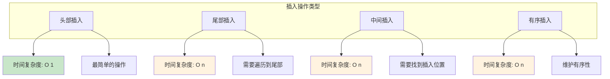

#### 头部插入详细流程

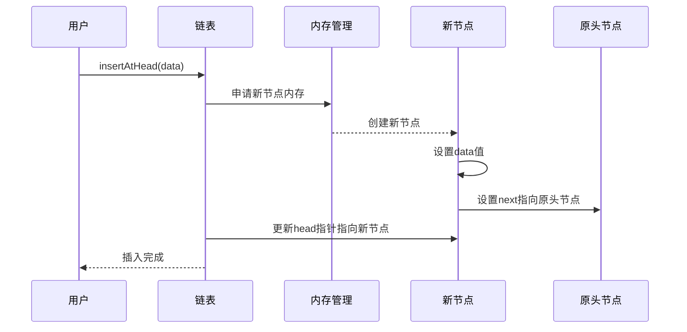

#### 头部插入可视化

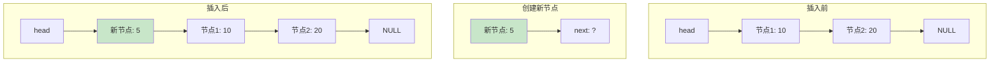

### 4.3 链表删除设计

#### 删除节点的核心步骤

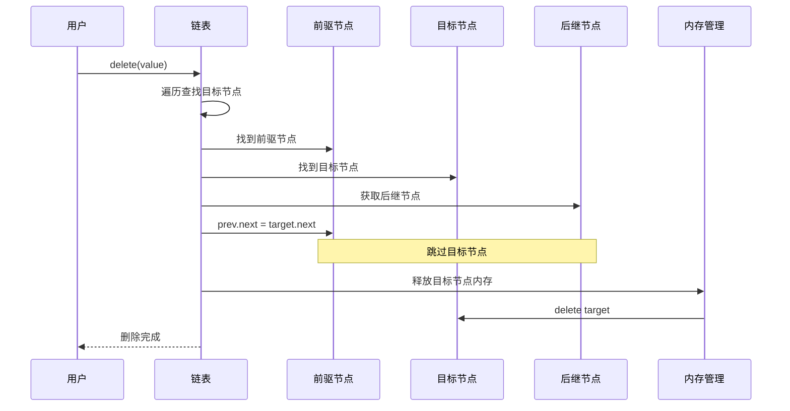

#### 删除操作可视化

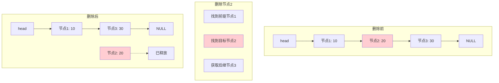

### 4.4 链表指针丢失

#### 指针丢失的常见场景

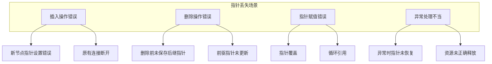

#### 插入操作中的指针丢失

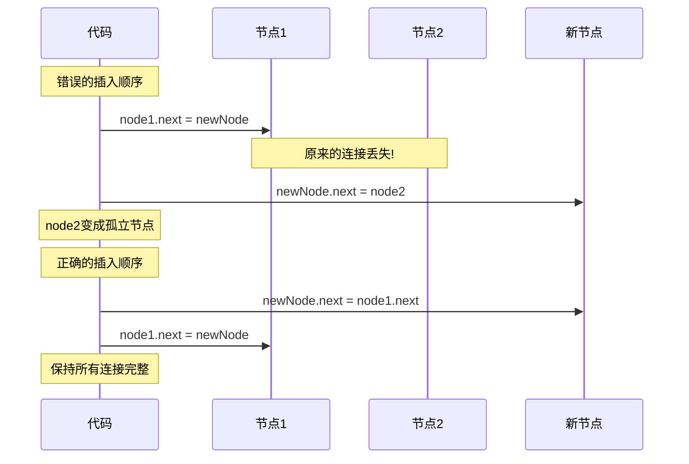

### 4.5 边界条件处理

链表编程中最容易出错的就是边界条件。以下是一套系统化的边界检查方法论：

**黄金五问法——写完链表代码后必须逐一验证**：

1. **空链表**（head == null）：代码是否会空指针异常？
2. **单节点链表**：操作后链表状态是否正确？head 和 tail 是否一致？
3. **两节点链表**：对头和尾的操作是否都正确？
4. **头节点操作**：插入/删除头节点后，head 指针是否更新？
5. **尾节点操作**：插入/删除尾节点后，尾节点的 next 是否为 null？

**哨兵节点（Sentinel/Dummy Node）——消除边界判断的利器**：

```java
// 不使用哨兵节点——需要大量边界判断
public void insert(int data, int position) {
    Node newNode = new Node(data);
    if (head == null) {          // 特殊处理1：空链表
        head = newNode;
        return;
    }
    if (position == 0) {         // 特殊处理2：头部插入
        newNode.next = head;
        head = newNode;
        return;
    }
    // 一般情况
    Node current = head;
    for (int i = 0; i < position - 1 && current.next != null; i++) {
        current = current.next;
    }
    newNode.next = current.next;
    current.next = newNode;
}

// 使用哨兵节点——代码统一简洁
public class LinkedListWithSentinel {
    private Node sentinel;  // 哨兵节点，不存数据
    
    public LinkedListWithSentinel() {
        sentinel = new Node(0);  // 哨兵永远存在
    }
    
    public void insert(int data, int position) {
        Node newNode = new Node(data);
        // 无需特殊处理！所有情况统一逻辑
        Node current = sentinel;
        for (int i = 0; i < position && current.next != null; i++) {
            current = current.next;
        }
        newNode.next = current.next;
        current.next = newNode;
    }
}
```


## 05.链表边界处理

### 5.1 常见边界条件


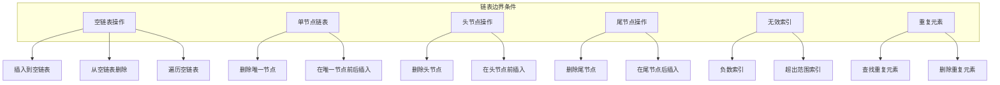


### 5.2 空链表处理策略

**空链表是链表操作中最常见的边界条件**。几乎所有链表操作都需要首先判断链表是否为空。

```java
// 策略1：条件判断法（最常用）
public Node findElement(Node head, int target) {
    if (head == null) {
        return null;  // 空链表直接返回
    }
    Node current = head;
    while (current != null) {
        if (current.data == target) return current;
        current = current.next;
    }
    return null;
}

// 策略2：哨兵节点法（推荐）
// 链表初始化时创建哨兵，永远不为空
// 此时 isEmpty() 判断为 sentinel.next == null

// 策略3：Optional 包装（函数式风格）
public Optional<Node> safeFindElement(Node head, int target) {
    if (head == null) return Optional.empty();
    Node current = head;
    while (current != null) {
        if (current.data == target) return Optional.of(current);
        current = current.next;
    }
    return Optional.empty();
}
```

### 5.3 边界条件检查

**系统化的链表测试清单**：

```
对于任何链表操作函数，必须测试以下场景：

✅ 空链表（0 个节点）
✅ 单节点链表（1 个节点）
✅ 两节点链表（2 个节点）
✅ 一般链表（多个节点）
✅ 操作头节点
✅ 操作尾节点
✅ 操作中间节点
✅ 目标元素不存在
✅ 所有元素相同
✅ 链表只有一个元素且就是目标
```

**经典面试题——用边界思维解决问题**：

```java
// 反转链表——边界条件处理示范
public Node reverseList(Node head) {
    // 边界1：空链表
    if (head == null) return null;
    // 边界2：单节点
    if (head.next == null) return head;
    
    // 一般情况
    Node prev = null;
    Node current = head;
    while (current != null) {
        Node nextTemp = current.next;
        current.next = prev;
        prev = current;
        current = nextTemp;
    }
    return prev;
}

// 实际上，上面的"一般情况"代码已经能正确处理空链表和单节点
// 当 head == null 时：current == null，直接返回 prev(null) ✓
// 当只有一个节点时：循环执行一次，prev 指向头节点 ✓
// 所以可以简化为：
public Node reverseListSimplified(Node head) {
    Node prev = null;
    Node current = head;
    while (current != null) {
        Node nextTemp = current.next;
        current.next = prev;
        prev = current;
        current = nextTemp;
    }
    return prev;
}
```

- 如果我们在结点p后面插入一个新的结点，只需要下面两行代码就可以搞定。
    ```
    new_node->next = p->next;
    p->next = new_node;
    ```
- 当我们要向一个空链表中插入第一个结点，刚刚的逻辑就不能用了。我们需要进行下面这样的特殊处理，其中 head 表示链表的头结点。所以，从这段代码，我们可以发现，对于单链表的插入操作，第一个结点和其他结点的插入逻辑是不一样的。
    ```
    if (head == null) {
      head = new_node;
    }
    ```
- 再来看单链表结点删除操作。如果要删除结点 p 的后继结点，我们只需要一行代码就可以搞定。
    ```
    p->next = p->next->next;
    ```
  - 但是，如果我们要删除链表中的最后一个结点，前面的删除代码就不work了。跟插入类似，我们也需要对于这种情况特殊处理。写成代码是这样子的：
    ```
    if (head->next == null) {
       head = null;
    }
    ```
- 从前面的一步一步分析，我们可以看出，针对链表的插入、删除操作，需要对插入第一个结点和删除最后一个结点的情况进行特殊处理。这样代码实现起来就会很繁琐，不简洁，而且也容易因为考虑不全而出错。如何来解决这个问题呢？
  - 还记得如何表示一个空链表吗？head=null 表示链表中没有结点了。其中 head 表示头结点指针，指向链表中的第一个结点。
  - 如果我们引入哨兵结点，在任何时候，不管链表是不是空，head 指针都会一直指向这个哨兵结点。我们也把这种有哨兵结点的链表叫带头链表。相反，没有哨兵结点的链表就叫作不带头链表。
  - 画了一个带头链表，你可以发现，哨兵结点是不存储数据的。因为哨兵结点一直存在，所以插入第一个结点和插入其他结点，删除最后一个结点和删除其他结点，都可以统一为相同的代码实现逻辑了。
  - 
- 实际上，这种利用哨兵简化编程难度的技巧，在很多代码实现中都有用到，比如插入排序、归并排序、动态规划等。这些内容我们后面才会讲，现在为了让你感受更深，我再举一个非常简单的例子。代码我是用 C 语言实现的，不涉及语言方面的高级语法，很容易看懂，你可以类比到你熟悉的语言。
  - 代码一：
    ```
    int find(char* a, int n, char key) {
      int i = 0;
      while (i < n) {
        if (a[i] == key) {
          return i;
        }
        ++i;
      }
      return -1;
    }
    ```
  - 代码二：
    ```
    inf find(char* a, int n, int key) {
      if (a[n-1] == key) {
        return n-1;
      }
      char tmp = a[n-1];
      a[n-1] = key;
      int i = 0;
      while (a[i] != key) {
        ++i;
      }
      a[n-1] = tmp;
      if (i == n-1) return -1;
      return i;
    }
    ```
  - 对比两段代码，在字符串a很长的时候，比如几万、几十万，你觉得哪段代码运行得更快点呢？答案是代码二，因为两段代码中执行次数最多就是 while 循环那一部分。第二段代码中，我们通过一个哨兵  a[n-1] = key，成功省掉了一个比较语句i<n，不要小看这一条语句，当累积执行万次、几十万次时，累积的时间就很明显了。


### 2.4 链表指针丢失

- 不知道你有没有这样的感觉，写链表代码的时候，指针指来指去，一会儿就不知道指到哪里了。所以，我们在写的时候，一定注意不要弄丢了指针。+指针往往都是怎么弄丢的呢？我拿单链表的插入操作为例来给你分析一下
  - 
  - 如图所示，我们希望在结点 a 和相邻的结点 b 之间插入结点 x，假设当前指针 p 指向结点 a。
- 如果我们将代码实现变成下面这个样子，就会发生指针丢失和内存泄露。
    ```
    p->next = x;  // 将 p 的 next 指针指向 x 结点；
    x->next = p->next;  // 将 x 的结点的 next 指针指向 b 结点；
    ```
  - 初学者经常会在这儿犯错。p->next+指针在完成第一步操作之后，已经不再指向结点 b 了，而是指向结点 x。第 2 行代码相当于将 x 赋值给 x->next，自己指向自己。因此，整个链表也就断成了两半，从结点 b 往后的所有结点都无法访问到了。
- 对于有些语言来说，比如 C 语言，内存管理是由程序员负责的，如果没有手动释放结点对应的内存空间，就会产生内存泄露。所以，我们插入结点时，一定要注意操作的顺序，要先将结点 x 的 next 指针指向结点 b，再把结点 a 的 next 指针指向结点 x，这样才不会丢失指针，导致内存泄漏。所以，对于刚刚的插入代码，我们只需要把第 1 行和第 2 行代码的顺序颠倒一下就可以了。
- 同理，删除链表结点时，也一定要记得手动释放内存空间，否则，也会出现内存泄漏的问题。当然，对于像 Java 这种虚拟机自动管理内存的编程语言来说，就不需要考虑这么多了。


### 2.5 边界条件处理

- 软件开发中，代码在一些边界或者异常情况下，最容易产生 Bug。链表代码也不例外。要实现没有 Bug 的链表代码，一定要在编写的过程中以及编写完成之后，检查边界条件是否考虑全面，以及代码在边界条件下是否能正确运行。
- 我经常用来检查链表代码是否正确的边界条件有这样几个：
  - 如果链表为空时，代码是否能正常工作？
  - 如果链表只包含一个结点时，代码是否能正常工作？
  - 如果链表只包含两个结点时，代码是否能正常工作？
  - 代码逻辑在处理头结点和尾结点的时候，是否能正常工作？
- 当你写完链表代码之后，除了看下你写的代码在正常的情况下能否工作，还要看下在上面我列举的几个边界条件下，代码仍然能否正确工作。如果这些边界条件下都没有问题，那基本上可以认为没有问题了。
- 当然，边界条件不止我列举的那些。针对不同的场景，可能还有特定的边界条件，这个需要你自己去思考，不过套路都是一样的。+实际上，不光光是写链表代码，你在写任何代码时，也千万不要只是实现业务正常情况下的功能就好了，一定要多想想，你的代码在运行的时候，可能会遇到哪些边界情况或者异常情况。遇到了应该如何应对，这样写出来的代码才够健壮！


## 06.链表的多种分类

主要的链表类型包括：

1. 单向链表（Singly Linked List）：每个节点包含数据和指向下一个节点的指针。
2. 双向链表（Doubly Linked List）：每个节点包含数据、指向前一个节点的指针和指向下一个节点的指针。
3. 循环链表（Circular Linked List）：尾节点指向头节点，形成一个环形结构。

### 3.1 单链表使用

单链表是链表中结构最简单的。一个单链表的节点(Node)分为两个部分，第一个部分(data)保存或者显示关于节点的信息，另一个部分存储下一个节点的地址。最后一个节点存储地址的部分指向空值。

插入一个节点，对于单向链表，我们只提供在链表头插入，只需要将当前插入的节点设置为头节点，next指向原头节点即可。

删除一个节点，我们将该节点的上一个节点的next指向该节点的下一个节点。

单向链表只可向一个方向遍历，一般查找一个节点的时候需要从第一个节点开始每次访问下一个节点，一直访问到需要的位置。

单链表的节点类

```java
//链表的每个节点类
public class Node{
    private Object data;//每个节点的数据
    private Node next;//每个节点指向下一个节点的连接
    public Node(Object data){
        this.data = data;
    }
}
```

关于单链表添加，删除，查找等操作的代码

```java
public class SingleLinkedList {

    private int size;//链表节点的个数
    private Node head;//头节点
    
    public SingleLinkedList(){
        size = 0;
        head = null;
    }
    
    //在链表头添加元素
    public Object addHead(Object obj){
        Node newHead = new Node(obj);
        if(size == 0){
            head = newHead;
        }else{
            newHead.next = head;
            head = newHead;
        }
        size++;
        return obj;
    }
    
    //在链表头删除元素
    public Object deleteHead(){
        Object obj = head.data;
        head = head.next;
        size--;
        return obj;
    }
    
    //查找指定元素，找到了返回节点Node，找不到返回null
    public Node find(Object obj){
        Node current = head;
        int tempSize = size;
        while(tempSize > 0){
            if(obj.equals(current.data)){
                return current;
            }else{
                current = current.next;
            }
            tempSize--;
        }
        return null;
    }
    
    //删除指定的元素，删除成功返回true
    public boolean delete(Object value){
        if(size == 0){
            return false;
        }
        Node current = head;
        Node previous = head;
        while(current.data != value){
            if(current.next == null){
                return false;
            }else{
                previous = current;
                current = current.next;
            }
        }
        //如果删除的节点是第一个节点
        if(current == head){
            head = current.next;
            size--;
        }else{//删除的节点不是第一个节点
            previous.next = current.next;
            size--;
        }
        return true;
    }
    
    //判断链表是否为空
    public boolean isEmpty(){
        return (size == 0);
    }
    
    //显示节点信息
    public void display(){
        if(size >0){
            Node node = head;
            int tempSize = size;
            if(tempSize == 1){//当前链表只有一个节点
                System.out.println("["+node.data+"]");
                return;
            }
            while(tempSize>0){
                if(node.equals(head)){
                    System.out.print("["+node.data+"->");
                }else if(node.next == null){
                    System.out.print(node.data+"]");
                }else{
                    System.out.print(node.data+"->");
                }
                node = node.next;
                tempSize--;
            }
            System.out.println();
        }else{//如果链表一个节点都没有，直接打印[]
            System.out.println("[]");
        }
    }
}
```

测试代码

```java
public void testSingleLinkedList(){
    SingleLinkedList singleList = new SingleLinkedList();
    singleList.addHead("A");
    singleList.addHead("B");
    singleList.addHead("C");
    singleList.addHead("D");
    //打印当前链表信息
    singleList.display();
    //删除C
    singleList.delete("C");
    singleList.display();
    //查找B
    System.out.println(singleList.find("B"));
}
```

### 3.2 双链表使用

双向链表（Doubly Linked List）每个节点有两个指针：`next` 指向后继节点，`prev` 指向前驱节点。

**单链表 vs 双链表的核心区别**：

| 维度 | 单链表 | 双链表 |
|------|--------|--------|
| 节点大小 | 较小（1个指针） | 较大（2个指针） |
| 正向遍历 | 支持 | 支持 |
| 反向遍历 | 不支持 | 支持 |
| 删除已知节点 | O(N)需找前驱 | O(1)直接访问prev |
| 实现复杂度 | 简单 | 稍复杂 |
| 典型应用 | Java LinkedList | Java LinkedList 的底层 |

**为何 Java LinkedList 选择双向链表？** 因为 LinkedList 同时实现了 List 和 Deque 接口，需要支持双端操作（头尾插入/删除）和根据索引双向查找（靠近头部从头找，靠近尾部从尾找）。双向链表可以将按索引查找的平均时间从 O(N) 优化到 O(N/2)。

```java
public class DoublePointLinkedList {
    private Node head;//头节点
    private Node tail;//尾节点
    private int size;//节点的个数
    
    private class Node{
        private Object data;
        private Node next;
        
        public Node(Object data){
            this.data = data;
        }
    }
    
    public DoublePointLinkedList(){
        size = 0;
        head = null;
        tail = null;
    }
    
    //链表头新增节点
    public void addHead(Object data){
        Node node = new Node(data);
        if(size == 0){//如果链表为空，那么头节点和尾节点都是该新增节点
            head = node;
            tail = node;
            size++;
        }else{
            node.next = head;
            head = node;
            size++;
        }
    }
    
    //链表尾新增节点
    public void addTail(Object data){
        Node node = new Node(data);
        if(size == 0){//如果链表为空，那么头节点和尾节点都是该新增节点
            head = node;
            tail = node;
            size++;
        }else{
            tail.next = node;
            tail = node;
            size++;
        }
    }
    
    //删除头部节点，成功返回true，失败返回false
    public boolean deleteHead(){
        if(size == 0){//当前链表节点数为0
            return false;
        }
        if(head.next == null){//当前链表节点数为1
            head = null;
            tail = null;
        }else{
            head = head.next;
        }
        size--;
        return true;
    }
    
    //判断是否为空
    public boolean isEmpty(){
        return (size ==0);
    }
    //获得链表的节点个数
    public int getSize(){
        return size;
    }
    
    //显示节点信息
    public void display(){
        if(size >0){
            Node node = head;
            int tempSize = size;
            if(tempSize == 1){//当前链表只有一个节点
                System.out.println("["+node.data+"]");
                return;
            }
            while(tempSize>0){
                if(node.equals(head)){
                    System.out.print("["+node.data+"->");
                }else if(node.next == null){
                    System.out.print(node.data+"]");
                }else{
                    System.out.print(node.data+"->");
                }
                node = node.next;
                tempSize--;
            }
            System.out.println();
        }else{//如果链表一个节点都没有，直接打印[]
            System.out.println("[]");
        }
    }
}
```


### 3.3 循环链表使用

循环链表是一种特殊的链表，其尾节点的next指针不是指向null，而是指向头节点，形成一个环形结构。

**疑惑**：循环链表有什么特殊的用途？

**答疑**：循环链表特别适合处理具有"循环"性质的问题：
1. **约瑟夫环问题**：一群人围成圈，每隔K个人淘汰一个
2. **轮询调度**：多个任务循环执行（操作系统进程调度）
3. **循环缓冲区**：音视频流的缓冲区

```python
class CircularLinkedList:
    def __init__(self):
        self.head = None
    
    def append(self, data):
        new_node = Node(data)
        if self.head is None:
            self.head = new_node
            new_node.next = self.head  # 指向自己，形成环
        else:
            current = self.head
            while current.next != self.head:
                current = current.next
            current.next = new_node
            new_node.next = self.head  # 新节点指向头节点
    
    def display(self):
        if self.head is None:
            return
        current = self.head
        while True:
            print(current.data, end=" -> ")
            current = current.next
            if current == self.head:
                break
        print("(回到头节点)")
```

**约瑟夫环问题实现**：

```python
def josephus(n, k):
    """n个人围成圈，每隔k个人淘汰，返回最后幸存者"""
    # 构建循环链表
    head = Node(1)
    current = head
    for i in range(2, n + 1):
        current.next = Node(i)
        current = current.next
    current.next = head  # 形成环

    # 模拟淘汰过程
    prev = current  # current是尾节点
    current = head
    while current.next != current:  # 还剩不止一个人
        for _ in range(k - 1):
            prev = current
            current = current.next
        prev.next = current.next  # 淘汰current
        current = prev.next
    return current.data
```


## 07.链表的性能分析

### 7.1 插入元素性能

链表的插入操作性能取决于插入位置：

| 操作 | 时间复杂度 | 说明 |
|------|-----------|------|
| 头部插入 | O(1) | 只需修改头指针和新节点指针 |
| 尾部插入（有尾指针） | O(1) | 直接通过尾指针操作 |
| 尾部插入（无尾指针） | O(N) | 需要遍历到最后一个节点 |
| 指定位置插入（已定位） | O(1) | 已有目标节点引用，直接修改指针 |
| 指定位置插入（未定位） | O(N) | 需要先遍历到目标位置 |

**疑惑**：链表插入是O(1)，为何有时还不如数组快？

**答疑**：O(1)的前提是"已经定位到插入点"。如果需要先查找再插入，总时间是O(N) + O(1) = O(N)。而且链表的每次插入都需要内存分配（malloc/new），这个开销在高频插入场景中不可忽略。数组的批量插入可以利用CPU缓存预取和内存连续性，实际性能可能更优。

### 7.2 删除元素性能

| 操作 | 时间复杂度 | 说明 |
|------|-----------|------|
| 删除头节点 | O(1) | 移动头指针即可 |
| 删除尾节点（单链表） | O(N) | 需要找到倒数第二个节点 |
| 删除尾节点（双链表） | O(1) | 通过尾指针的prev直接定位 |
| 删除指定节点（已定位） | O(1)（双链表） | 直接修改前后节点指针 |
| 删除指定节点（单链表已定位） | O(N) | 需要找到前驱节点 |

**关键对比**：这也是为什么Java的 `LinkedList` 使用双向链表而非单向链表——双向链表在已知节点的情况下，插入和删除都是O(1)。

### 7.3 检索元素性能

| 操作 | 链表 | 数组 | 说明 |
|------|------|------|------|
| 按索引访问 | O(N) | O(1) | 链表必须从头遍历 |
| 按值查找 | O(N) | O(N) | 都需要线性扫描 |
| 按值查找（有序） | O(N) | O(log N) | 数组可用二分查找，链表不行 |

**论证**：链表不支持随机访问是其最大劣势。即便是"跳表"（Skip List）也只能将查找优化到O(log N)，无法达到O(1)。这是由链表的非连续内存布局决定的——CPU缓存无法预取下一个节点。

**深入分析——为什么链表无法二分查找？**

```
二分查找的前提条件：
  1. 数据有序 ✓ （链表也可以维护有序性）
  2. 能O(1)访问中间元素 ✗ （链表做不到！）

数组二分查找：mid = (low + high) / 2 → arr[mid] → O(1)
链表"二分查找"：找中间节点 → 从头遍历N/2步 → O(N)
  第一轮：遍历N/2步找中点
  第二轮：遍历N/4步找中点
  总计：N/2 + N/4 + N/8 + ... = N → 还是O(N)！
```

**跳表是如何突破这个限制的**：

```
普通链表：  1 → 3 → 5 → 7 → 9 → 11 → 13 → 15
                         查找13：需要遍历7步

跳表（多层索引）：
Level 3:  1 ─────────────────────→ 9 ─────────────→ null
Level 2:  1 ─────→ 5 ─────────→ 9 ─────→ 13 ──→ null  
Level 1:  1 → 3 → 5 → 7 → 9 → 11 → 13 → 15 → null

查找13：Level3: 1→9 → Level2: 9→13 → 命中！仅3步
空间代价：每个节点平均多1个指针（概率提升）
时间复杂度：O(log N)，空间复杂度：O(N)

本质：用空间换时间，在链表上"模拟"二分查找
```

Redis 的有序集合（Sorted Set）底层就使用跳表而非平衡树，原因是跳表实现更简单、范围查询更自然、并发友好（局部锁即可）。

### 7.4 链表与数组综合对比

```
+----------+--------+--------+--------+--------+
| 操作     | 数组   | 单链表 | 双链表 | 跳表   |
+----------+--------+--------+--------+--------+
| 随机访问 | O(1)   | O(N)   | O(N)   | O(logN)|
| 头部插入 | O(N)   | O(1)   | O(1)   | O(logN)|
| 尾部插入 | O(1)*  | O(N)   | O(1)   | O(logN)|
| 中间插入 | O(N)   | O(N)   | O(N)   | O(logN)|
| 头部删除 | O(N)   | O(1)   | O(1)   | O(logN)|
| 尾部删除 | O(1)   | O(N)   | O(1)   | O(logN)|
| 按值查找 | O(N)   | O(N)   | O(N)   | O(logN)|
| 空间开销 | 低     | 中     | 高     | 高     |
+----------+--------+--------+--------+--------+
* 数组尾部插入在不扩容时为O(1)，扩容时为O(N)
```


## 08.链表使用场景

### 8.1 哪些用到链表

链表在计算机科学中被广泛应用，常用于实现其他数据结构和算法，如栈、队列、图等。

**各平台链表使用场景**：

| 平台/语言 | 场景 | 具体实现 |
|-----------|------|---------|
| Java | 集合框架 | LinkedList、LinkedHashMap、ConcurrentLinkedQueue |
| Android | 消息机制 | MessageQueue（单链表实现消息队列） |
| iOS | 响应链 | UIResponder Chain（事件传递链） |
| Linux | 内核 | list_head（侵入式双向循环链表） |
| Go | 标准库 | container/list（双向链表） |
| JavaScript | DOM | 兄弟节点（previousSibling/nextSibling） |
| 数据库 | 索引 | B+树叶子节点通过链表连接 |
| 操作系统 | 内存 | 空闲链表（Free List）管理可用内存块 |


## 09.链表实际示例

### 9.1 链表实现队列

队列是一种先进先出（FIFO）的数据结构，链表可以高效地实现队列。

```java
class Node {
    int data;
    Node next;

    Node(int data) {
        this.data = data;
        this.next = null;
    }
}

class Queue {
    private Node front, rear;

    Queue() {
        this.front = this.rear = null;
    }

    void enqueue(int data) {
        Node newNode = new Node(data);
        if (rear == null) {
            front = rear = newNode;
        } else {
            rear.next = newNode;
            rear = newNode;
        }
    }

    int dequeue() {
        if (front == null) {
            throw new IllegalStateException("Queue is empty");
        }
        int data = front.data;
        front = front.next;
        if (front == null) {
            rear = null;
        }
        return data;
    }
}
```

### 9.2 实现LRU缓存

LRU（Least Recently Used）缓存可以通过哈希表和双向链表实现。

```java
import java.util.HashMap;
import java.util.Map;

class Node {
    int key, value;
    Node prev, next;

    Node(int key, int value) {
        this.key = key;
        this.value = value;
    }
}

class LRUCache {
    private final int capacity;
    private final Map<Integer, Node> cache;
    private final Node head, tail;

    public LRUCache(int capacity) {
        this.capacity = capacity;
        this.cache = new HashMap<>();
        this.head = new Node(0, 0);
        this.tail = new Node(0, 0);
        head.next = tail;
        tail.prev = head;
    }

    public int get(int key) {
        if (cache.containsKey(key)) {
            Node node = cache.get(key);
            remove(node);
            addToHead(node);
            return node.value;
        }
        return -1;
    }

    public void put(int key, int value) {
        if (cache.containsKey(key)) {
            Node node = cache.get(key);
            node.value = value;
            remove(node);
            addToHead(node);
        } else {
            if (cache.size() >= capacity) {
                cache.remove(tail.prev.key);
                remove(tail.prev);
            }
            Node newNode = new Node(key, value);
            cache.put(key, newNode);
            addToHead(newNode);
        }
    }

    private void addToHead(Node node) {
        node.next = head.next;
        node.prev = head;
        head.next.prev = node;
        head.next = node;
    }

    private void remove(Node node) {
        node.prev.next = node.next;
        node.next.prev = node.prev;
    }
}
```


## 思考题

> 以下问题由浅入深，建议先独立思考再查阅资料。

**1. 基础理解**：单链表只能从头到尾遍历，双向链表可以双向遍历但每个节点多了一个 `prev` 指针（多 8 字节）。在什么场景下这 8 字节的额外开销是"值得"的？在什么场景下应该坚持使用单链表？

**2. 哨兵节点的价值**：本文提到哨兵节点可以简化边界处理。请将"不带哨兵的单链表删除节点"和"带哨兵的单链表删除节点"的代码写出来对比。思考：哨兵节点的本质是什么设计思想？在其他数据结构中还有类似的"哨兵"设计吗？

**3. 经典问题**：如何判断一个单链表是否有环？如何找到环的入口节点？请用 Floyd 判圈算法（快慢指针）解决，并严格证明：当快指针每次走 2 步、慢指针每次走 1 步时，如果存在环，它们一定会相遇。相遇后，为什么从头节点和相遇点同时出发、每次各走一步，最终会在环入口相遇？

**4. 内存与性能**：链表的每个节点都需要独立的内存分配（`malloc`/`new`），这导致节点在内存中不连续。请分析这对 CPU 缓存命中率的影响。Linux 内核的链表实现（`list_head`）为什么要把链表节点嵌入到数据结构内部，而不是让数据结构包含链表节点的指针？

**5. 设计挑战**：Java 的 `LinkedList` 实现了 `List` 和 `Deque` 两个接口，但在实际开发中几乎不推荐使用。请分析：在哪些理论上"链表更优"的场景中，`ArrayList` 在实际测试中反而更快？这说明了理论分析和实际性能之间存在什么鸿沟？


