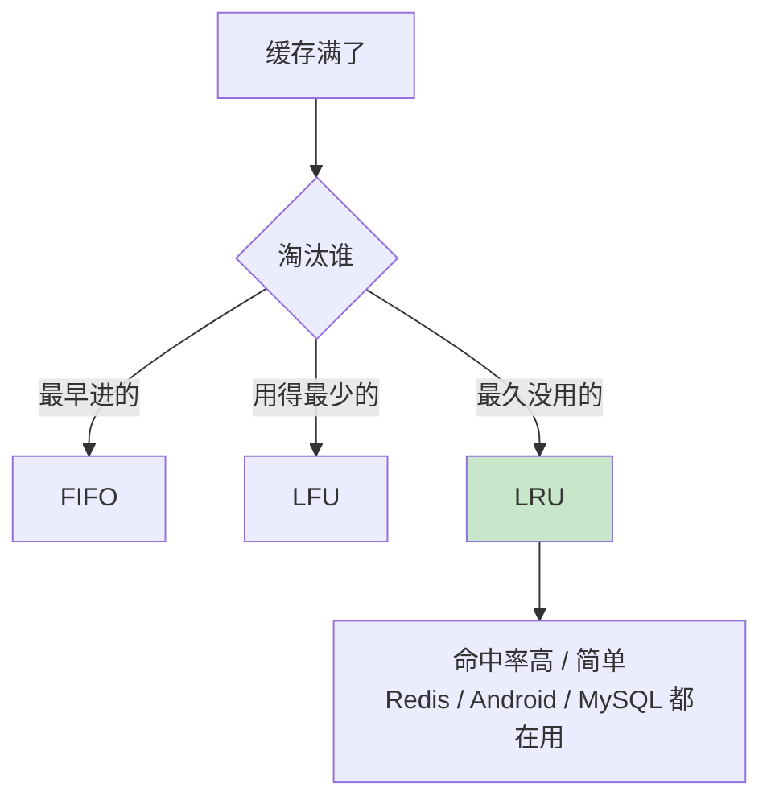
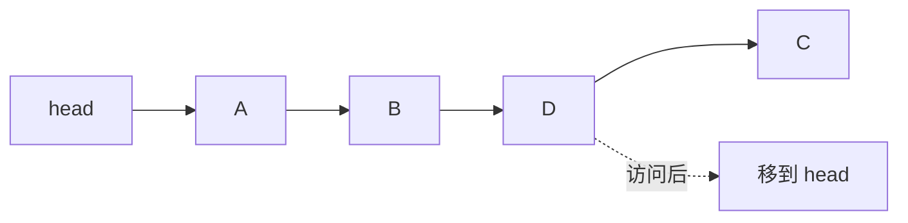
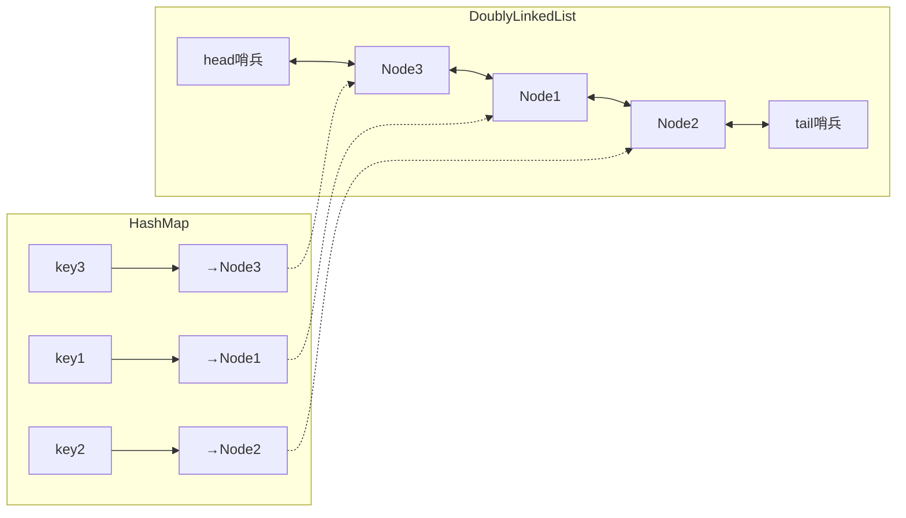
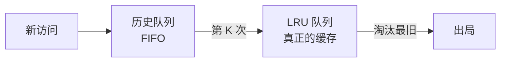

# 05.链表实现 LRU 原理

## 目录介绍

- 01. 从一个工作案例说起
- 02. 缓存淘汰与三大经典策略
- 03. 为什么 LRU 偏爱链表
- 04. 单链表实现 LRU（原理版）
- 05. 哈希表 + 双向链表（工业版）
- 06. LRU 的缺陷与 LRU-K / 2Q / LFU
- 07. 工业界的 LRU 身影
- 08. 本篇收获与案例回扣
- 09. 思考题
- 10. 课后作业

---

## 01. 从一个工作案例说起

> 真实踩坑：一个列表页图片刷不停，用户说"翻回去又要重新加载，体验太差"。

背景：一个商品列表 App，每屏大概 8 张图。我们在首页做了个**全局图片缓存**以减少网络请求。

最初实现用 `HashMap<String, Bitmap>` 直接存，"无容量上限"，理由是内存足够大。上线一周后监控告警：

- 稍长时间使用，App 内存飙到 500MB+
- 滚到列表末尾再返回顶部，**顶部图片仍然重新下载**（本该命中缓存）
- 偶发 OOM

原因一查就明白：

1. 只有放入、没有淘汰 → 内存持续膨胀，Android 系统直接把进程杀了，缓存一并清空；
2. 进程重启后 `HashMap` 是空的，老图片自然要重新下载。

正确做法是给缓存**设容量上限**，当超限时按照"最近最少使用"淘汰旧图片。这就是 LRU。

Android 官方的 `LruCache` 底层正是 **`LinkedHashMap(accessOrder=true)`**——哈希表 + 双向链表。本篇的目标就是把这套结构亲手拆一遍，学完你能：

- 说清楚为什么 LRU 必须是 **哈希 + 双向链表**；
- 独立写出 LeetCode 146 的满分解；
- 给开篇案例换上带容量上限的 LRU，解决 OOM 与命中率问题。

---

## 02. 缓存淘汰与三大经典策略

### 2.1 为什么必须淘汰

缓存空间远小于底层存储：

| 介质 | 典型容量 | 访问延迟 |
|-----|---------|---------|
| L1 / L2 Cache | 几十 KB~1 MB | 1~5 ns |
| 内存 | GB 级 | 100 ns |
| SSD | TB 级 | 100 μs |
| 磁盘 | TB 级 | 10 ms |

"有限的快资源要放最有价值的数据"——缓存淘汰策略要解决的就是这件事。

### 2.2 三大策略对比

| 策略 | 依据 | 假设 | 常见反例 |
|-----|-----|-----|---------|
| FIFO | 进入顺序 | 越老越没用 | 内核代码老但一直要用 |
| LFU | 访问频率 | 用得少就没用 | 昨天热搜、今天凉了 |
| **LRU** | 最近访问时间 | 最近用过 → 还会用 | 全表扫描污染缓存 |

LRU 依据的是 **时间局部性原理**——大量程序行为实测都符合 80/20：80% 的访问集中在 20% 的数据上。所以 LRU 在 Web、App、DB 查询缓存等通用场景命中率最佳、实现也最简单，是工业界默认首选。



---

## 03. 为什么 LRU 偏爱链表

### 3.1 LRU 的两种核心操作

- **命中时**：把被访问的元素"移到最前面"
- **未命中 + 容量满**：删掉"最后面那个"

### 3.2 用数组？会崩

```text
数组：[A B C D E]
访问 D → 需要把 D 移到队首
        → 搬移 A B C 三个元素 → O(N)
```

10 万容量时平均每次访问要搬 5 万个元素，线上绝对扛不住。

### 3.3 用链表？天然合适



链表移动一个节点只改几个指针，是 **O(1)**。这正是 LRU 偏爱链表的根本原因。

### 3.4 但链表查找仍是 O(N)

单靠链表无法解决"怎么快速找到那个节点"的问题，**所以还差一个哈希表**。

---

## 04. 单链表实现 LRU（原理版）

### 4.1 思路

维护一条单链表：越靠头越新，越靠尾越旧。访问时遍历、找到就移到头；没找到就头插入，超容量就丢尾巴。

```java
public class SimpleLRUCache<K> {
    private Node<K> head;
    private int size, capacity;
    static class Node<K> { K key; Node<K> next; Node(K k){key=k;} }

    public SimpleLRUCache(int cap) { this.capacity = cap; }

    public boolean access(K key) {
        Node<K> prev = null, cur = head;
        while (cur != null) {
            if (cur.key.equals(key)) {           // 命中：摘出来放到头
                if (prev != null) {
                    prev.next = cur.next;
                    cur.next = head;
                    head = cur;
                }
                return true;
            }
            prev = cur; cur = cur.next;
        }
        // 未命中：头插入
        Node<K> n = new Node<>(key);
        n.next = head; head = n; size++;
        if (size > capacity) removeTail();
        return false;
    }

    private void removeTail() {
        if (head == null || head.next == null) { head = null; size--; return; }
        Node<K> c = head;
        while (c.next.next != null) c = c.next;
        c.next = null; size--;
    }
}
```

### 4.2 性能瓶颈

| 操作 | 复杂度 | 原因 |
|-----|-------|-----|
| 查找是否命中 | O(N) | 必须遍历 |
| 摘除已定位节点 | O(N) | 单链表要找前驱 |
| 删尾节点 | O(N) | 要找倒数第二 |

结论：**单链表 LRU 只适合教学 / 面试手写**。工业级必须升级。

---

## 05. 哈希表 + 双向链表（工业版）

### 5.1 结构全貌



- **HashMap**：`key → Node` 的直接引用，让"查找"降到 O(1)；
- **双向链表**：维护访问顺序，队首是最新，队尾是最旧；
- **双端哨兵**：消除所有头尾空判断。

### 5.2 为什么一定要"**双向**"链表

摘除某个已定位节点，要改它前驱的 next。单链表找前驱要 O(N)；双向链表 prev 直接给，O(1)。哈希 + 双向链表组合才能让 **get / put 全部 O(1)**。

### 5.3 Java 实现（LeetCode 146 标准解）

```java
public class LRUCache<K, V> {
    static class Node<K, V> {
        K key; V value; Node<K,V> prev, next;
        Node() {}
        Node(K k, V v) { key = k; value = v; }
    }

    private final int capacity;
    private final Map<K, Node<K, V>> map = new HashMap<>();
    private final Node<K, V> head = new Node<>(), tail = new Node<>();

    public LRUCache(int capacity) {
        this.capacity = capacity;
        head.next = tail; tail.prev = head;
    }

    public V get(K key) {
        Node<K, V> n = map.get(key);
        if (n == null) return null;
        moveToHead(n);
        return n.value;
    }

    public void put(K key, V value) {
        Node<K, V> n = map.get(key);
        if (n != null) { n.value = value; moveToHead(n); return; }
        Node<K, V> nn = new Node<>(key, value);
        map.put(key, nn); addToHead(nn);
        if (map.size() > capacity) {
            Node<K, V> last = tail.prev;
            remove(last); map.remove(last.key);
        }
    }

    private void addToHead(Node<K,V> n) {
        n.prev = head; n.next = head.next;
        head.next.prev = n; head.next = n;
    }
    private void remove(Node<K,V> n) {
        n.prev.next = n.next; n.next.prev = n.prev;
    }
    private void moveToHead(Node<K,V> n) { remove(n); addToHead(n); }
}
```

### 5.4 Go 实现（精简版）

```go
type node struct {
    key, value int
    prev, next *node
}

type LRUCache struct {
    cap  int
    m    map[int]*node
    head, tail *node
}

func New(cap int) *LRUCache {
    h, t := &node{}, &node{}
    h.next, t.prev = t, h
    return &LRUCache{cap: cap, m: map[int]*node{}, head: h, tail: t}
}

func (c *LRUCache) Get(k int) (int, bool) {
    if n, ok := c.m[k]; ok { c.moveToHead(n); return n.value, true }
    return 0, false
}

func (c *LRUCache) Put(k, v int) {
    if n, ok := c.m[k]; ok { n.value = v; c.moveToHead(n); return }
    n := &node{key: k, value: v}
    c.m[k] = n; c.addToHead(n)
    if len(c.m) > c.cap {
        last := c.tail.prev
        c.remove(last); delete(c.m, last.key)
    }
}

func (c *LRUCache) addToHead(n *node) {
    n.prev, n.next = c.head, c.head.next
    c.head.next.prev = n; c.head.next = n
}
func (c *LRUCache) remove(n *node) { n.prev.next = n.next; n.next.prev = n.prev }
func (c *LRUCache) moveToHead(n *node) { c.remove(n); c.addToHead(n) }
```

### 5.5 JavaScript 一行 Map 取巧版

```javascript
class LRUCache {
    constructor(cap) { this.cap = cap; this.m = new Map(); }
    get(k) {
        if (!this.m.has(k)) return -1;
        const v = this.m.get(k);
        this.m.delete(k); this.m.set(k, v);   // Map 按插入顺序遍历
        return v;
    }
    put(k, v) {
        if (this.m.has(k)) this.m.delete(k);
        this.m.set(k, v);
        if (this.m.size > this.cap) this.m.delete(this.m.keys().next().value);
    }
}
```

### 5.6 操作复杂度对比

| 操作 | 单链表 LRU | 哈希 + 双链 LRU |
|-----|-----------|----------------|
| get / put | O(N) | **O(1)** |
| 淘汰最旧 | O(N) | **O(1)** |
| 空间 | O(N) | O(N) |

---

## 06. LRU 的缺陷与 LRU-K / 2Q / LFU

### 6.1 LRU 的死穴：缓存污染

```text
缓存容量 100，现有 100 个热点 key，命中率 99%
突然跑一次全表扫描，顺序访问 10000 条冷数据
→ 前 100 条直接把热点全部挤走
→ 扫描完毕后缓存全是冷数据
→ 命中率骤降到 0%
```

### 6.2 LRU-K：进门要刷卡两次

只访问过一次的数据不进正式缓存，而是进"历史队列"；第 K 次访问才提升到 LRU 队列。全表扫描的数据访问一次即止，不会污染热点。



### 6.3 2Q = LRU-2 的简化

两条队列：FIFO 放一次性数据，LRU 放热点；FIFO 中再次命中时升级到 LRU。

### 6.4 LFU：按频率淘汰

优点是对"真正的热 key"很友好，缺点是**频率衰减问题**——昨天热搜的访问次数太高，导致它今天凉了也不容易被淘汰。

### 6.5 各策略选型矩阵

| 你的场景 | 推荐 | 说明 |
|---------|-----|-----|
| 通用（Web / App 查询缓存） | **LRU** | 80% 场景直接用 |
| 有扫描 / 批量读风险 | 2Q / LRU-2 | 抗污染 |
| 命中率要极致、冷热分层明显 | **W-TinyLFU**（Caffeine） | 兼顾 LRU + LFU |
| 自适应负载变化 | ARC | ZFS / PostgreSQL 用 |
| 数据带 TTL | LRU + 过期时间 | Redis 默认思路 |

---

## 07. 工业界的 LRU 身影

| 系统 | 实现 | 备注 |
|-----|------|-----|
| **Android `LruCache`** | `LinkedHashMap(accessOrder=true)` | 图片 / View 缓存标配 |
| **iOS `NSCache`** | 近似 LRU + 内存压力自动清理 | 不保证严格顺序 |
| **Redis** | 近似 LRU（随机采样 N 个取最旧） | 真正链表太耗内存 |
| **MySQL InnoDB Buffer Pool** | 带 midpoint 的分段 LRU（类 2Q） | 防全表扫描污染 |
| **Linux Page Cache** | active / inactive 双链表 | 近似 LRU |
| **Glide / SDWebImage** | LRU + 磁盘二级缓存 | 图片加载框架标配 |
| **Caffeine (Java)** | W-TinyLFU | 当前 JVM 最快的缓存 |

### Redis 的采样 LRU（为什么不用真链表）

为每个 key 加 prev / next 指针意味着百万 key 多出几十 MB 指针开销，Redis 作者不愿付这个代价。折中方案：**每个 key 记录 `lru` 时间戳，淘汰时随机采样 N 个取最旧**。采样数（`maxmemory-samples`）默认 5，越大越接近真实 LRU、也越慢。

---

## 08. 本篇收获与案例回扣

回到开篇的"列表图片总是重下载 / OOM"：

- **问题本质**：用无上限的 `HashMap` 当缓存 → 要么 OOM、要么被系统干掉清空，从来没进入"淘汰—保留热点"循环。
- **正确解法**：`LruCache<String, Bitmap>`（底层 `LinkedHashMap(accessOrder=true)`）+ 按 `bitmap.getByteCount()` 计量容量 → 内存稳定、热图命中率高、冷图自动让位。
- **进一步优化**：本地内存 LRU + 磁盘二级缓存（与 Glide 一致），冷启动时也能命中。

通过本篇你应该拿到以下能力：

1. 说清楚 LRU 必须用 **哈希 + 双向链表** 的底层原因；
2. 手写 `get / put` 全 O(1) 的 LRU，通过 LeetCode 146；
3. 识别 LRU 缓存污染并选出 LRU-K / 2Q / W-TinyLFU 等合适的进阶策略；
4. 读懂 Android `LruCache`、Redis maxmemory-policy、InnoDB midpoint 等工业实现差异。

---

## 09. 思考题

> 建议先独立思考，再查资料验证。

1. **LRU 假设失效**：请举出"最近访问过的数据，将来更可能被访问"这个假设明显不成立的真实场景；在这个场景下，你会用什么策略替代 LRU？
2. **复杂度验真**：仔细分析 `put` 中"容量满时淘汰尾节点"的每一步，确认真的是 O(1)。如果把双向链表换成单链表，这一步还能 O(1) 吗？哈希表能否帮单链表拿到前驱？
3. **并发 LRU**：在 `get / put` 外部套一把 `synchronized` 是否可行？高并发下会怎样？Caffeine 为了做到高并发采用了什么思路？（提示：Ring Buffer + 异步 replay）
4. **Redis 近似 LRU**：在 100 万 key 中随机采样 5 个并淘汰最旧，对真正的 LRU 精度大概损失多少？把采样数提到 10 / 20，边际收益是什么形状？为什么不继续增加？
5. **LRU-K 设计**：实现 K=2 的 LRU-2 需要几个数据结构？其 `get / put` 复杂度？与标准 LRU 相比，它在"一次性冷扫描"场景下的命中率会如何变化？

---

## 10. 课后作业

### 作业一｜手写 LRU 过 LeetCode 146

- 用 Java / Go / Python 任选一种，手写"哈希 + 双向链表 + 双端哨兵"的 LRU；
- 提交 LeetCode 146 AC；
- 写一份 200 字的自测报告：哪里最容易错？（一般是 `moveToHead` 的顺序、put 中 map 与链表是否都更新、哨兵是否初始化）

### 作业二｜还原开篇 Android 图片缓存

1. 写一个 demo：`HashMap<String, Bitmap>` 无限缓存版本，滚动列表 1000 张图，观察内存曲线；
2. 换成 `LruCache`（按 byte 大小计算容量，上限 64MB），对比内存曲线和重复下载次数；
3. 加上磁盘二级缓存（本地文件），再对比冷启动命中率；
4. 写一份 300 字踩坑总结。

### 作业三｜抗扫描污染实验

- 以作业一的 LRU 为基础，扩展成 **2Q / LRU-2**；
- 构造负载：80% 请求命中 20% 热点 key + 偶发 1 次 10 万次冷扫描；
- 对比 LRU、LRU-2、W-TinyLFU（可用 Caffeine）三种策略的命中率曲线；
- 得出你自己的"在我们业务场景里，XXX 最合适，因为……"结论。

