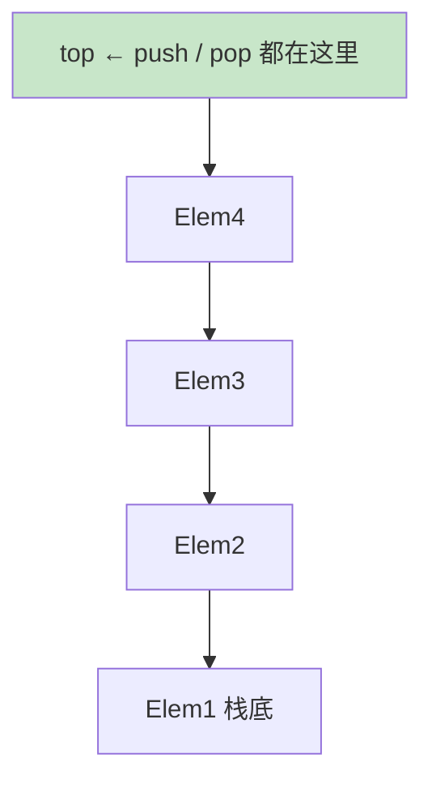
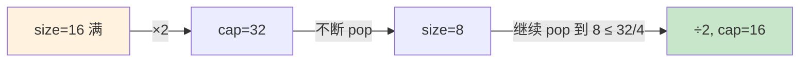

# 06.栈常见的操作实践

## 目录指引与导读

> 阅读建议：本篇围绕"栈的工业实现 + LIFO 经典模板"展开，建议按顺序通读；如果只想速查某一段，直接点对应锚点即可。

- [01. 从工作案例说起](#01-从工作案例说起)
- [02. 栈的定义与操作](#02-栈的定义与操作)
  - [2.1 栈的本质定义](#21-栈的本质定义)
  - [2.2 栈的核心API](#22-栈的核心api)
  - [2.3 LIFO匹配嵌套语义](#23-lifo匹配嵌套语义)
- [03. 数组实现顺序栈](#03-数组实现顺序栈)
- [04. 链表实现链式栈](#04-链表实现链式栈)
- [05. 动态扩容均摊O1](#05-动态扩容均摊o1)
  - [5.1 翻倍与四分之一缩容](#51-翻倍与四分之一缩容)
  - [5.2 动态扩容栈实现](#52-动态扩容栈实现)
  - [5.3 均摊O1的证明](#53-均摊o1的证明)
  - [5.4 缩容选四分之一](#54-缩容选四分之一)
- [06. 调用栈与递归本质](#06-调用栈与递归本质)
  - [6.1 操作系统调用栈](#61-操作系统调用栈)
  - [6.2 递归即系统管栈](#62-递归即系统管栈)
  - [6.3 递归深度与栈大小](#63-递归深度与栈大小)
- [07. 栈的经典工业应用](#07-栈的经典工业应用)
  - [7.1 括号匹配实战题](#71-括号匹配实战题)
  - [7.2 双栈表达式求值](#72-双栈表达式求值)
  - [7.3 单调栈三大模板](#73-单调栈三大模板)
  - [7.4 栈的应用速查表](#74-栈的应用速查表)
- [08. 本篇收获与回扣](#08-本篇收获与回扣)
- [09. 思考题深度练](#09-思考题深度练)
- [10. 课后作业实战](#10-课后作业实战)

---

## 01. 从工作案例说起

> 真实需求：给一个内部管理后台加「操作审计」的 **撤销 / 重做** 能力。

背景：一个配置管理后台，运维同学会批量修改机房、机柜、机器的归属。业务方提的新需求：

- 编辑过程中，按 `Ctrl + Z` 可以一步步撤销；
- 按 `Ctrl + Y` 能把刚撤销的再重做回来；
- 一旦在"撤销到一半"时产生了新修改，所有"可以重做的操作"必须立刻作废。

最早的同事用了一个 `List<Operation>` + 一个下标指针来回移动，逻辑很快就写乱了——涉及"从中间截断再追加"的操作散落在好几处，上线一周收到了 3 个「操作丢失 / 撤销后又跳回去」的线上 bug。

**其实这就是栈的教科书级应用**：

- 所有"已做"操作压入 `undoStack`；
- `Ctrl + Z`：从 `undoStack` 弹出最近一个，反向执行，压入 `redoStack`；
- `Ctrl + Y`：从 `redoStack` 弹出一个，重新执行，压回 `undoStack`；
- 一旦产生新操作：压入 `undoStack`，**直接清空 `redoStack`**。

```java
class UndoManager {
    private final Deque<Op> undo = new ArrayDeque<>();
    private final Deque<Op> redo = new ArrayDeque<>();

    public void doOp(Op op) { op.apply(); undo.push(op); redo.clear(); }
    public void undo() { if (!undo.isEmpty()) { Op o = undo.pop(); o.revert(); redo.push(o); } }
    public void redo() { if (!redo.isEmpty()) { Op o = redo.pop(); o.apply();  undo.push(o); } }
}
```

换成双栈后，上面 3 个线上 bug 一次性消失：代码只有 3 行核心逻辑，"语义"和"实现"正好对上。

> 本篇就把"栈"讲透：从怎么实现，到函数调用栈与递归的关系，再到括号匹配、表达式求值、单调栈这些工业高频套路。学完你能独立实现开篇的撤销管理器，并在 LeetCode 20 / 150 / 496 这类题上秒写答案。

---

## 02. 栈的定义与操作

### 2.1 栈的本质定义

栈 = **只允许一端操作的线性表**，遵循 **LIFO（Last In First Out，后进先出）**。



> **延伸原理**：栈的"单端约束"看似限制，反而带来三大红利——所有操作 O(1)、内存访问局部性好（数组栈尤甚）、与系统调用栈 / 解释器栈天然同构，可以无缝把递归改成迭代。

### 2.2 栈的核心API

| 操作 | 含义 | 复杂度 |
|-----|-----|-------|
| `push(x)` | 入栈 | O(1) |
| `pop()` | 出栈（取出并返回） | O(1) |
| `peek()` / `top()` | 看一眼栈顶 | O(1) |
| `isEmpty()` | 判空 | O(1) |
| `size()` | 元素个数 | O(1) |

栈的全部魅力就在于：**通过限制操作位置，换来所有动作都是 O(1)**。

> **底层说明**：`peek` 不应改变栈状态；很多面试 bug 来自于"以为 peek 也会弹出"。Java `Deque` 提供 `peek()`（不抛异常）和 `element()`（空时抛 `NoSuchElementException`）两套 API，工程里推荐 `peek` + 显式 null 判断，避免异常控制流。

### 2.3 LIFO匹配嵌套语义

| 场景 | LIFO 体现 |
|-----|---------|
| 函数调用 | 最后进入的函数最先返回 |
| 括号 / 标签 | 最后打开的最先关闭 |
| 撤销 / 重做 | 撤销最近一次 |
| 表达式求值 | 先算优先级最高的 |
| DFS 回溯 | 回退到最近的分支点 |

---

## 03. 数组实现顺序栈

思路：一个数组 + 一个指向"下一个空位"的 `top`。

```java
public class ArrayStack<T> {
    private Object[] data;
    private int top;

    public ArrayStack(int capacity) { this.data = new Object[capacity]; }

    public void push(T v) {
        if (top == data.length) throw new StackOverflowError();
        data[top++] = v;
    }

    @SuppressWarnings("unchecked")
    public T pop() {
        if (top == 0) throw new RuntimeException("empty");
        T v = (T) data[--top];
        data[top] = null;          // 帮 GC
        return v;
    }

    @SuppressWarnings("unchecked")
    public T peek() {
        if (top == 0) throw new RuntimeException("empty");
        return (T) data[top - 1];
    }

    public boolean isEmpty() { return top == 0; }
    public int size() { return top; }
}
```

优点：连续内存，CPU 缓存友好，实际性能最快。
缺点：容量固定，需要扩容（见 §05）。

---

## 04. 链表实现链式栈

思路：把链表头当作栈顶，push / pop 只改 head。

```java
public class LinkedStack<T> {
    static class Node<T> { T data; Node<T> next; Node(T d, Node<T> n){data=d; next=n;} }
    private Node<T> top;
    private int size;

    public void push(T v)  { top = new Node<>(v, top); size++; }
    public T pop() {
        if (top == null) throw new RuntimeException("empty");
        T v = top.data; top = top.next; size--; return v;
    }
    public T peek() {
        if (top == null) throw new RuntimeException("empty");
        return top.data;
    }
    public boolean isEmpty() { return top == null; }
}
```

优点：天然动态，不用扩容。
缺点：每次 push 都 new 节点（开销 + GC），缓存不友好。

### 两种实现的选型对照

| 维度 | 数组栈 | 链表栈 |
|-----|-------|-------|
| 内存 | 连续、预分配 | 离散、按需 |
| 缓存命中率 | 高 | 低 |
| 扩容 | 要搬移 | 不用 |
| 小对象开销 | 低 | 高（节点指针） |
| 工业默认 | ✅（`ArrayDeque`、`Vec`、Python `list`）| 很少直接使用 |

> **底层原因**：链表栈每次 `push` 都要 `new Node`，触发堆分配 + GC；而数组栈 `data[top++] = v` 是一条访存指令，紧贴 CPU L1 缓存。**结论**：如果没有特殊理由，一律用 **数组栈**。Java 里用 `ArrayDeque`，不要用古老的 `Stack`（基于 `Vector`，每个方法都带 `synchronized` 拖性能）。

---

## 05. 动态扩容均摊O1

### 5.1 翻倍与四分之一缩容

- 满了就 ×2；
- 元素数降到容量的 1/4 时 ÷2 缩容；
- 两个阈值之间留出缓冲区，避免 **扩缩乒乓**。



### 5.2 动态扩容栈实现

```java
public class DynamicStack<T> {
    private Object[] data;
    private int top;

    public DynamicStack() { data = new Object[4]; }

    public void push(T v) {
        if (top == data.length) resize(data.length * 2);
        data[top++] = v;
    }

    @SuppressWarnings("unchecked")
    public T pop() {
        if (top == 0) throw new RuntimeException("empty");
        T v = (T) data[--top];
        data[top] = null;
        if (data.length > 4 && top <= data.length / 4) resize(data.length / 2);
        return v;
    }

    private void resize(int cap) {
        Object[] nd = new Object[cap];
        System.arraycopy(data, 0, nd, 0, top);
        data = nd;
    }
}
```

### 5.3 均摊O1的证明

连续做 N 次 push，扩容发生在第 1、2、4、8、…、N 次，每次搬 1、2、4、…、N 个元素：

```text
搬移总次数 = 1 + 2 + 4 + ... + N ≈ 2N
总代价    = N 次 push + 2N 次搬移 = 3N
均摊到每次 push → O(1)
```

> **数学严谨化**：用聚合分析法（aggregate analysis）证明 N 次操作总代价为 O(N)，单次均摊代价 O(1)；如果用账户法（accounting method），可以给每次 push 多收 2 个"币"——1 个用于现在，1 个未来用于搬移自己 + 帮一个老元素搬走。两种证法结论一致。

### 5.4 缩容选四分之一

如果用 1/2，恰好满的栈里 push→扩容→pop→缩容→push→扩容…… 每次都 O(N)，出现 **复杂度震荡**。选 1/4，在扩容点和缩容点之间留出一倍空间作为缓冲。

> **工程提醒**：JDK `ArrayDeque` 永远不缩容（容量只增不减）——典型工程权衡：大多数场景容量稳定后不再增长，缩容收益小、复杂度高，干脆不做。如果你写一个长生命周期、容量波动大的服务，可以考虑加缩容。

---

## 06. 调用栈与递归本质

### 6.1 操作系统调用栈

每个线程都有一块独立的 **调用栈**。每次函数调用，都会把一个 **栈帧（Stack Frame）** 压入调用栈；函数返回，栈帧被弹出。

```text
┌───────────────┐  ← 栈顶（当前正在执行的函数）
│ 栈帧: factorial(1) │
├───────────────┤
│ 栈帧: factorial(2) │
├───────────────┤
│ 栈帧: main()       │  ← 栈底
└───────────────┘
```

每个栈帧里存：**返回地址、参数、局部变量、保存的寄存器**。

> **栈帧到底装了什么**：以 x86-64 SysV ABI 为例，一个栈帧自高地址向低地址依次包含：调用者保存的返回地址 → 旧 RBP → 被调用者保存寄存器（callee-saved）→ 本地变量 → 参数传递区。理解这一点，"栈溢出攻击 / canary 保护 / 异常栈展开"才能真正读懂。

### 6.2 递归即系统管栈

```java
// 经典递归
public static long factorial(int n) {
    if (n <= 1) return 1;
    return n * factorial(n - 1);
}
```

调用 `factorial(4)` 时，调用栈自底向上依次压入 `factorial(4) / 3 / 2 / 1`，触底返回 1 后逐层出栈：1 → 2 → 6 → 24。

**任何递归都可以用显式栈改写为迭代**（这正是"递归转迭代"的通用套路）：

```java
public static long factorialIter(int n) {
    Deque<Integer> stack = new ArrayDeque<>();
    while (n > 1) { stack.push(n); n--; }
    long res = 1;
    while (!stack.isEmpty()) res *= stack.pop();
    return res;
}
```

> **延伸思考**：有些递归（如尾递归）甚至不需要显式栈——编译器可以把"调用栈"折叠成单个变量。Scala / Kotlin 通过 `@tailrec` 注解强制做尾递归优化；C++ / Rust 依赖编译器优化级别；Java 至今仍**不做**尾调用优化，所以 JVM 上递归深度受限于线程栈大小。

### 6.3 递归深度与栈大小

| 平台 | 默认栈大小 | 大致可递归层数 |
|-----|-----------|-------------|
| Linux 线程 | 8 MB | ~10 万 |
| Windows 线程 | 1 MB | ~1 万 |
| JVM 线程 | 512 KB ~ 1 MB | 5 千 ~ 1 万 |
| Python | 软限制 1000 层 | 默认 1000 |
| Go goroutine | 起始 2 KB，动态增长 | 百万级 |

"爆栈"的 3 个典型原因：**递归太深 / 无限递归 / 栈上局部变量过大**。

---

## 07. 栈的经典应用

### 7.1 括号匹配（LeetCode 20）

左括号压栈、右括号比对栈顶。

```python
def is_valid(s: str) -> bool:
    pair = {')': '(', ']': '[', '}': '{'}
    stack = []
    for ch in s:
        if ch in '([{':
            stack.append(ch)
        else:
            if not stack or stack[-1] != pair[ch]:
                return False
            stack.pop()
    return not stack
```

### 7.2 表达式求值（Dijkstra 双栈算法）

两条栈：**数栈 nums + 符栈 ops**。遇到运算符时，只要栈顶运算符优先级 ≥ 当前，就先把栈顶的算掉。

```python
def evaluate(expr: str) -> int:
    def prec(op): return 2 if op in '*/' else 1 if op in '+-' else 0
    def apply(ops, nums):
        b, a = nums.pop(), nums.pop()
        op = ops.pop()
        nums.append({'+':a+b, '-':a-b, '*':a*b, '/':int(a/b)}[op])

    nums, ops = [], []
    i, n = 0, len(expr)
    while i < n:
        c = expr[i]
        if c.isdigit():
            v = 0
            while i < n and expr[i].isdigit():
                v = v*10 + int(expr[i]); i += 1
            nums.append(v); continue
        if c == '(': ops.append(c)
        elif c == ')':
            while ops[-1] != '(': apply(ops, nums)
            ops.pop()
        elif c in '+-*/':
            while ops and ops[-1] != '(' and prec(ops[-1]) >= prec(c):
                apply(ops, nums)
            ops.append(c)
        i += 1
    while ops: apply(ops, nums)
    return nums[0]
```

### 7.3 单调栈（LeetCode 496 / 739 / 84）

**下一个更大元素**：栈底到栈顶单调递减，O(N) 完成。

```python
def next_greater(nums):
    res = [-1] * len(nums)
    stack = []                # 存下标
    for i, x in enumerate(nums):
        while stack and nums[stack[-1]] < x:
            res[stack.pop()] = x
        stack.append(i)
    return res
```

一句话口诀：**"求下一个更大 / 更小、柱状图最大矩形、接雨水"——都是单调栈**。

### 7.4 栈能做什么

| 问题形态 | 解法 |
|---------|-----|
| 括号 / HTML 标签匹配 | 栈 |
| 函数调用、DFS 回溯 | 栈（或递归） |
| 撤销 / 重做 | 双栈 |
| 浏览器前进 / 后退 | 双栈 |
| 表达式求值 / 逆波兰 | 双栈 |
| 下一个更大 / 更小 | 单调栈 |
| 最大矩形、接雨水 | 单调栈 |

核心模板：**"LIFO 语义 / 嵌套结构 / 递归可迭代化"**，三者之一就用栈。

---

## 08. 本篇收获与案例回扣

回到开篇的"撤销 / 重做"需求：

- **问题本质**：撤销是"倒回最近一次"→ LIFO；而"一旦产生新操作，原本的重做作废"本就是栈的特性（新 push 让旧 redo 天然断链）。
- **正确解法**：`Deque<Op> undo` + `Deque<Op> redo`；新操作 `undo.push + redo.clear`；撤销 `undo.pop → redo.push`；重做 `redo.pop → undo.push`。
- **为什么之前代码乱**：用"List + 下标"模拟栈，等于自己手写了个半吊子的栈，所有"截断 / 丢弃"逻辑散落在好几处。**一选对数据结构，代码就从"多处特判"塌缩成 3 行**。

通过本篇你应该拿到以下能力：

1. 看到"LIFO / 嵌套 / 撤销 / 后进先出"就立刻反应出"栈"；
2. 能分别用**数组和链表**实现栈，并讲清楚为什么工业默认用数组；
3. 理解 **均摊 O(1)** 的证明，知道为什么缩容阈值是 1/4 而不是 1/2；
4. 理解调用栈 / 栈帧结构，知道"递归就是系统在帮你管理栈"，并能手工把递归改写成迭代；
5. 能在面试和真实代码里熟练使用 **括号匹配 / 双栈表达式求值 / 单调栈**。

---

## 09. 思考题

> 建议先独立思考，再查资料验证。

1. **两种栈的真实差异**：数组栈和链表栈理论都是 O(1)。但实测中，往一个 LinkedStack 里连续 push 一亿次，比 ArrayStack 慢几倍。为什么？（请结合堆分配、GC、缓存行一起说）
2. **两栈模拟队列**：如何用两个栈实现一个 FIFO 队列？`enqueue / dequeue` 的均摊复杂度分别是多少？反过来，用两个队列实现栈，哪种方向"更自然"？
3. **Go 的分段栈**：Linux / JVM 线程栈是固定大小的，为什么 Go goroutine 可以从 2KB 自动长到几百 MB？它是怎么做到"函数里访问局部变量"时还能判断要不要扩栈的？（提示：morestack、栈复制）
4. **最小栈 O(1)**：设计一个栈，支持 `push / pop / top / getMin` 全部 O(1)。空间最省的方案是什么？如果还要同时支持 `getMax`，你会怎么组织数据？
5. **中缀转后缀**：逆波兰表达式在计算机里比中缀更"好算"。请写出"中缀 → 后缀"转换的栈算法，并回答：为什么 JVM、Python、各种栈式虚拟机都选择基于后缀（栈式）的指令集，而不是类似 `a = b + c` 的三地址形式？

---

## 10. 课后作业

### 作业一｜还原开篇的撤销重做

1. 定义一个 `interface Op { void apply(); void revert(); }`；
2. 实现 `UndoManager`：`doOp / undo / redo`；
3. 写单元测试，至少覆盖"连续撤销 3 次 → 重做 2 次 → 做一个新动作 → redo 栈必须为空"这条路径；
4. 想想：如果要做"只保留最近 100 条"，你会用什么数据结构替代 `ArrayDeque`？

### 作业二｜手写 ArrayDeque-style 动态栈

1. 写一个支持泛型的 `DynamicStack<T>`：容量翻倍扩容 + 1/4 缩容；
2. 跑一个测试：push 一千万次再全部 pop，记录总耗时；
3. 同样用 `LinkedList` 当栈跑同一个测试，对比耗时；
4. 写 200 字总结，解释为什么有差异。

### 作业三｜单调栈三连

在 LeetCode 上依次 AC 以下三题，均用单调栈解法：

- 496. Next Greater Element I
- 739. Daily Temperatures
- 84. Largest Rectangle in Histogram

提交后总结：三题的**栈中元素单调性方向**与**弹出时机**，找出共同模板。

