# 栈常见的操作实践
#### 目录介绍
- [01.先看道思考题](#01先看道思考题)
  - [1.1 浏览器功能](#11-浏览器功能)
  - [1.2 如何去实现](#12-如何去实现)
  - [1.3 叠盘子游戏](#13-叠盘子游戏)
- [02.什么是栈](#02什么是栈)
  - [2.1 栈的定义](#21-栈的定义)
  - [2.2 栈基本结构](#22-栈基本结构)
  - [2.3 栈基本操作](#23-栈基本操作)
  - [2.4 栈可视化演示](#24-栈可视化演示)
  - [2.5 数据结构关系](#25-数据结构关系)
- [03.如何实现栈](#03如何实现栈)
  - [3.1 栈实现策略](#31-栈实现策略)
  - [3.2 数组实现栈](#32-数组实现栈)
  - [3.3 链表实现栈](#33-链表实现栈)
- [04.栈的操作](#04栈的操作)
  - [4.1 Push操作](#41-push操作)
  - [4.2 Pop操作](#42-pop操作)
  - [4.3 Peek操作](#43-peek操作)
- [05.动态扩容栈](#05动态扩容栈)
  - [5.1 扩容必要性](#51-扩容必要性)
  - [5.2 动态扩容策略](#52-动态扩容策略)
  - [5.3 动态扩容实现](#53-动态扩容实现)
  - [5.4 动态栈完整实现](#54-动态栈完整实现)
  - [5.5 扩容内存视图](#55-扩容内存视图)
- [06.函数调用栈](#06函数调用栈)
  - [6.1 看一个案例](#61-看一个案例)
  - [6.2 调用栈概念](#62-调用栈概念)
  - [6.3 函数调用栈结构](#63-函数调用栈结构)
  - [6.4 函数调用过程](#64-函数调用过程)
  - [6.5 递归函数的栈](#65-递归函数的栈)
  - [6.6 栈溢出问题](#66-栈溢出问题)
- [07.栈实现浏览器](#07栈实现浏览器)


## 01.先看道思考题

### 1.1 浏览器功能

浏览器的前进、后退功能。当你依次访问完一串页面 a-b-c 之后，点击浏览器的后退按钮，就可以查看之前浏览过的页面 b 和 a。当你后退到页面 a，点击前进按钮，就可以重新查看页面 b 和 c。

但是，如果你后退到页面 b 后，点击了新的页面 d，那就无法再通过前进、后退功能查看页面 c 了。

### 1.2 如何去实现

假设你是 Chrome 浏览器的开发工程师，你会如何实现这个功能呢？这就要用到我们今天要讲的“栈”这种数据结构。

### 1.3 叠盘子游戏

关于“栈”，一个非常贴切的例子，就是一摞叠在一起的盘子。

平时放盘子的时候，都是从下往上一个一个放；取的时候，我们也是从上往下一个一个地依次取，不能从中间任意抽出。

后进者先出，先进者后出，这就是典型的“栈”结构。

## 02.什么是栈

### 2.1 栈的定义

栈（Stack）是一种线性数据结构，它遵循后进先出（LIFO - Last In First Out）的原则。

栈只允许在一端（称为栈顶）进行插入和删除操作，另一端（称为栈底）是固定的。

### 2.2 栈基本结构

栈是一种“操作受限”的线性表，只允许在一端插入和删除数据。

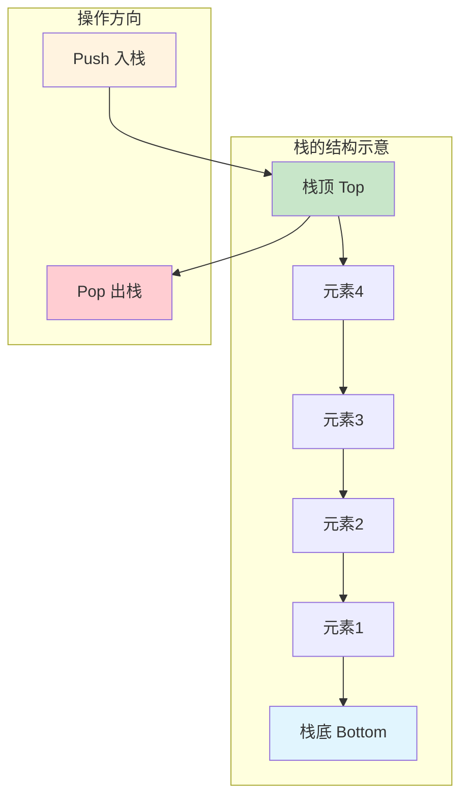

### 2.3 栈基本操作

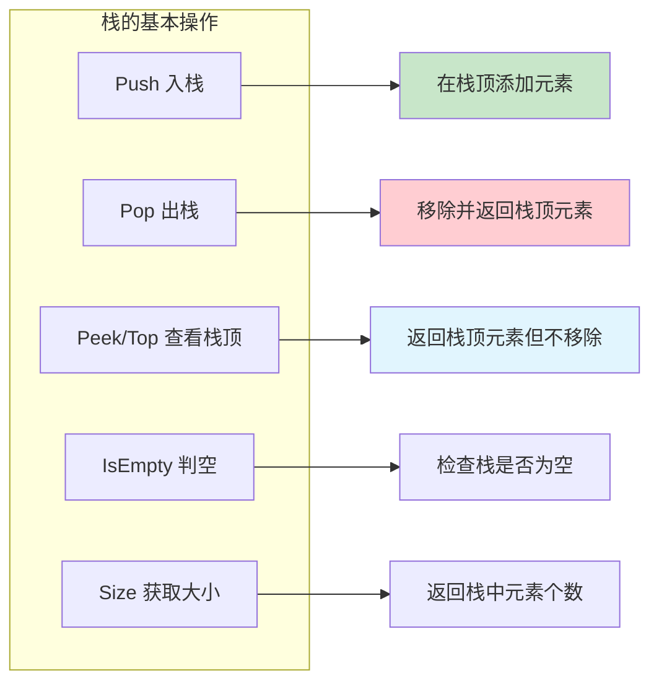

### 2.4 栈可视化演示

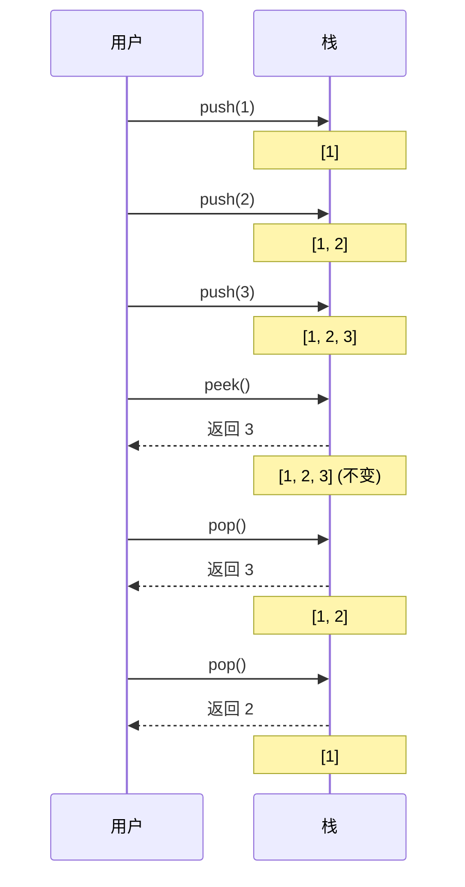

### 2.5 数据结构关系

栈与其他数据结构的关系

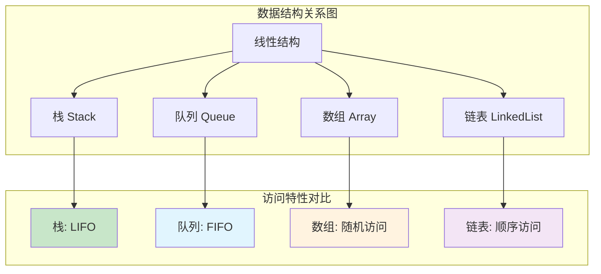

## 03.如何实现栈

- 栈主要包含两个操作
  - 入栈和出栈，也就是在栈顶插入一个数据和从栈顶删除一个数据。
- 栈如何实现
  - 栈既可以用数组来实现，也可以用链表来实现。用数组实现的栈，我们叫作**顺序栈**，用链表实现的栈，我们叫作**链式栈**。
- 它的操作的时间、空间复杂度是多少呢？
  - 不管是顺序栈还是链式栈，我们存储数据只需要一个大小为 n 的数组就够了。在入栈和出栈过程中，只需要一两个临时变量存储空间，所以空间复杂度是 O(1)。
  - 空间复杂度分析是不是很简单？时间复杂度也不难。不管是顺序栈还是链式栈，入栈、出栈只涉及栈顶个别数据的操作，所以时间复杂度都是 O(1)。

### 3.1 栈实现策略

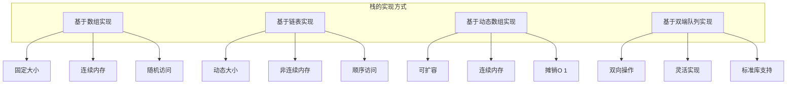

## 04.栈的操作

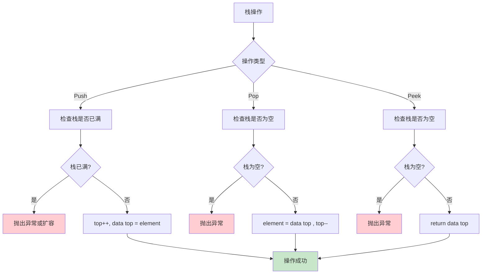

### 4.1 Push操作

**疑惑**：Push 操作看起来很简单，为什么还要单独拿出来讲？

**答疑**：Push 虽然逻辑简单，但涉及 **边界判断**（栈满）和 **指针维护**（top 的含义），不同实现策略下细节差异不小。

**论证**：以数组栈为例，`top` 有两种约定——指向栈顶元素，或指向栈顶元素的下一个位置。约定不同，push/pop 的写法就不同。

```
约定一：top 指向栈顶元素（初始 top = -1）
  push: top++; data[top] = element;
  
约定二：top 指向下一个空位（初始 top = 0）
  push: data[top] = element; top++;
```

**多语言实现**：

```python
# Python —— 数组栈 Push
class ArrayStack:
    def __init__(self, capacity=16):
        self._data = [None] * capacity
        self._top = 0          # 约定：top 指向下一个空位
        self._capacity = capacity

    def push(self, value):
        if self._top == self._capacity:
            raise OverflowError("Stack is full")
        self._data[self._top] = value
        self._top += 1
```

```c
// C —— 数组栈 Push
#define MAX_SIZE 1024
typedef struct {
    int data[MAX_SIZE];
    int top;            // 初始 -1，指向栈顶元素
} Stack;

int push(Stack *s, int value) {
    if (s->top == MAX_SIZE - 1) return -1;  // 栈满
    s->data[++(s->top)] = value;
    return 0;
}
```

```java
// Java —— 数组栈 Push
public class ArrayStack<T> {
    private Object[] data;
    private int top;       // 指向下一个空位
    private int capacity;

    public void push(T value) {
        if (top == capacity) {
            throw new StackOverflowError("Stack is full");
        }
        data[top++] = value;
    }
}
```

```go
// Go —— 切片栈 Push（天然支持动态扩容）
type Stack[T any] struct {
    data []T
}

func (s *Stack[T]) Push(value T) {
    s.data = append(s.data, value)
}
```

**时间复杂度**：O(1)（不考虑扩容）。若触发扩容，单次 O(N)，但**均摊** O(1)。

### 4.2 Pop操作

Pop 是 Push 的逆操作：取出栈顶元素并移动 `top` 指针。

**关键问题**：Pop 之后原位置的数据要不要清理？

- **C/C++**：必须关注，如果存的是指针，Pop 后应置 NULL 避免悬挂指针
- **Java/Python/Go**：有 GC，但最好置 null/None，帮助 GC 及时回收（Java ArrayList.remove 也是这样做的）

```python
# Python
def pop(self):
    if self._top == 0:
        raise IndexError("Stack is empty")
    self._top -= 1
    value = self._data[self._top]
    self._data[self._top] = None  # 帮助 GC
    return value
```

```c
// C
int pop(Stack *s, int *out) {
    if (s->top == -1) return -1;  // 栈空
    *out = s->data[s->top--];
    return 0;
}
```

```java
// Java
@SuppressWarnings("unchecked")
public T pop() {
    if (top == 0) throw new EmptyStackException();
    T value = (T) data[--top];
    data[top] = null;   // 防止内存泄漏
    return value;
}
```

```go
// Go
func (s *Stack[T]) Pop() (T, bool) {
    if len(s.data) == 0 {
        var zero T
        return zero, false
    }
    n := len(s.data) - 1
    value := s.data[n]
    s.data = s.data[:n]
    return value, true
}
```

### 4.3 Peek操作

Peek（也叫 Top）只查看栈顶元素，不弹出。它是只读操作，比 Pop 更安全。

```python
# Python
def peek(self):
    if self._top == 0:
        raise IndexError("Stack is empty")
    return self._data[self._top - 1]
```

```c
// C
int peek(Stack *s, int *out) {
    if (s->top == -1) return -1;
    *out = s->data[s->top];
    return 0;
}
```

```java
// Java
@SuppressWarnings("unchecked")
public T peek() {
    if (top == 0) throw new EmptyStackException();
    return (T) data[top - 1];
}
```

**Peek 的工程价值**：很多算法中需要「看一眼栈顶但不取走」，比如表达式求值、括号匹配、单调栈等，Peek 避免了 Pop 后还要 Push 回去的额外操作。


## 05.动态扩容栈

如何基于数组实现一个可以支持动态扩容的栈呢？

当数组空间不够时，我们就重新申请一块更大的内存，将原来数组中数据统统拷贝过去。这样就实现了一个支持动态扩容的数组。

如果要实现一个支持动态扩容的栈，只需要底层依赖一个支持动态扩容的数组就可以了。当栈满了之后，就申请一个更大的数组，将原来的数据搬移到新数组中。

### 5.1 扩容必要性

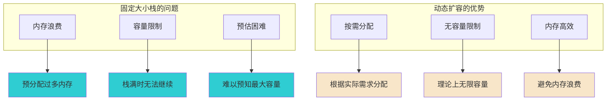

### 5.2 动态扩容策略

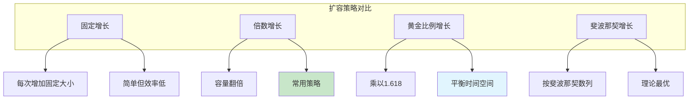

### 5.3 动态扩容实现

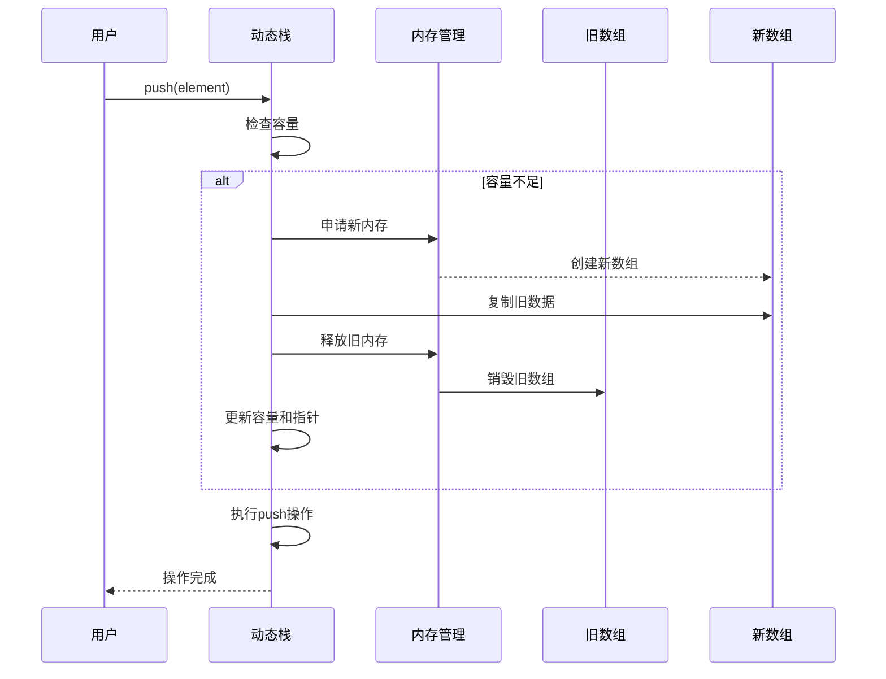

### 5.4 动态栈完整实现

下面给出一个完整的动态扩容栈实现，采用 **倍增策略**（容量翻倍），同时支持 **缩容**（当元素数量低于容量的 1/4 时缩容为一半，避免频繁扩缩的抖动）。

```python
# Python —— 动态扩容栈完整实现
class DynamicStack:
    """支持自动扩容和缩容的栈"""
    
    def __init__(self, init_capacity=4):
        self._capacity = init_capacity
        self._data = [None] * self._capacity
        self._top = 0
    
    def push(self, value):
        if self._top == self._capacity:
            self._resize(self._capacity * 2)   # 扩容为 2 倍
        self._data[self._top] = value
        self._top += 1
    
    def pop(self):
        if self._top == 0:
            raise IndexError("Stack is empty")
        self._top -= 1
        value = self._data[self._top]
        self._data[self._top] = None
        # 缩容：元素数 <= 容量/4 且容量大于初始值
        if self._top > 0 and self._top <= self._capacity // 4 and self._capacity > 4:
            self._resize(self._capacity // 2)
        return value
    
    def peek(self):
        if self._top == 0:
            raise IndexError("Stack is empty")
        return self._data[self._top - 1]
    
    def is_empty(self):
        return self._top == 0
    
    def size(self):
        return self._top
    
    def _resize(self, new_capacity):
        """核心：数据搬移"""
        new_data = [None] * new_capacity
        for i in range(self._top):
            new_data[i] = self._data[i]
        self._data = new_data
        self._capacity = new_capacity
```

```c
// C —— 动态扩容栈
#include <stdlib.h>
#include <string.h>

typedef struct {
    int *data;
    int top;
    int capacity;
} DynamicStack;

DynamicStack* stack_create(int init_cap) {
    DynamicStack *s = (DynamicStack*)malloc(sizeof(DynamicStack));
    s->data = (int*)malloc(sizeof(int) * init_cap);
    s->top = -1;
    s->capacity = init_cap;
    return s;
}

static void stack_resize(DynamicStack *s, int new_cap) {
    int *new_data = (int*)malloc(sizeof(int) * new_cap);
    memcpy(new_data, s->data, sizeof(int) * (s->top + 1));
    free(s->data);
    s->data = new_data;
    s->capacity = new_cap;
}

int stack_push(DynamicStack *s, int value) {
    if (s->top + 1 == s->capacity) {
        stack_resize(s, s->capacity * 2);
    }
    s->data[++(s->top)] = value;
    return 0;
}

int stack_pop(DynamicStack *s, int *out) {
    if (s->top == -1) return -1;
    *out = s->data[s->top--];
    // 缩容
    if (s->top + 1 > 0 && s->top + 1 <= s->capacity / 4 && s->capacity > 4) {
        stack_resize(s, s->capacity / 2);
    }
    return 0;
}

void stack_destroy(DynamicStack *s) {
    free(s->data);
    free(s);
}
```

**均摊复杂度分析**：

假设初始容量为 1，连续 Push N 次。扩容发生在第 1、2、4、8、...、N 次（假设 N 是 2 的幂），搬移总次数为：

```
1 + 2 + 4 + 8 + ... + N = 2N - 1
```

总操作次数 = N 次 Push + (2N-1) 次搬移 ≈ 3N，均摊到每次 Push 是 O(1)。

**疑惑**：为什么缩容阈值选 1/4 而不是 1/2？

**答疑**：如果在 1/2 时缩容，考虑一个恰好满的栈：Push→扩容，Pop→缩容，Push→扩容... 反复在边界上抖动，每次都是 O(N)。选 1/4 作为缩容阈值，在扩容点和缩容点之间留出了足够的缓冲区，避免了这种 **复杂度震荡** 问题。

### 5.5 扩容内存视图

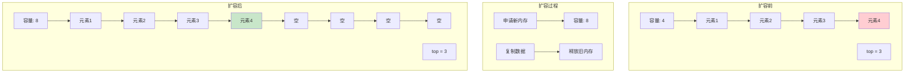

## 06.函数调用栈

### 6.1 看一个案例

经典的一个应用场景就是函数调用栈

操作系统给每个线程分配了一块独立的内存空间，这块内存被组织成“栈”这种结构, 用来存储函数调用时的临时变量。

每进入一个函数，就会将临时变量作为一个栈帧入栈，当被调用函数执行完成，返回之后，将这个函数对应的栈帧出栈。

```java
int main() {
   int a = 1; 
   int ret = 0;
   int res = 0;
   ret = add(3, 5);
   res = a + ret;
   printf("%d", res);
   reuturn 0;
}

int add(int x, int y) {
   int sum = 0;
   sum = x + y;
   return sum;
}
```

从代码中我们可以看出，main() 函数调用了 add() 函数，获取计算结果，并且与临时变量 a 相加，最后打印 res 的值。

为了让你清晰地看到这个过程对应的函数栈里出栈、入栈的操作，我画了一张图。图中显示的是，在执行到 add() 函数时，函数调用栈的情况。


### 6.2 调用栈概念

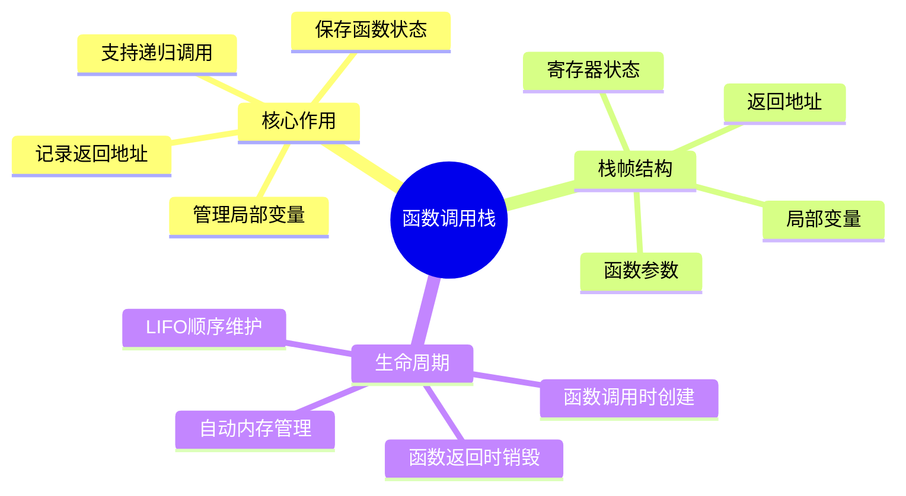

### 6.3 函数调用栈结构

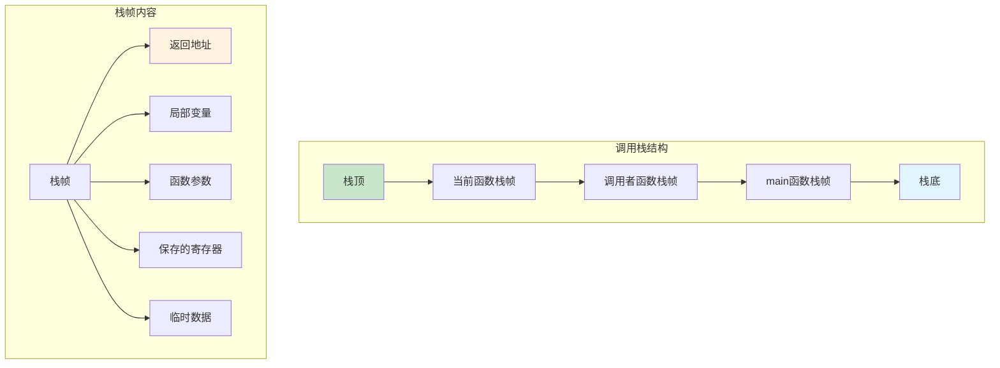

### 6.4 函数调用过程

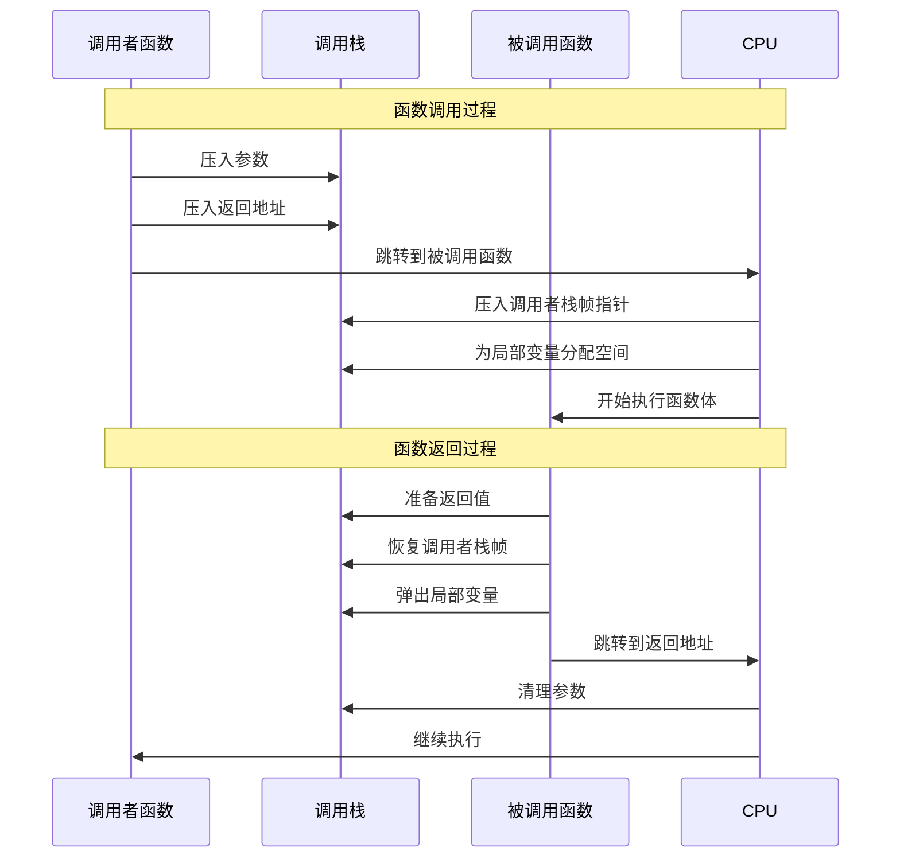

### 6.5 递归函数的栈

**疑惑**：递归和栈有什么本质关系？为什么说「递归本质上就是栈」？

**答疑**：每一次函数调用，操作系统都会在调用栈上分配一个 **栈帧（Stack Frame）**。递归调用 N 层，就会有 N 个栈帧同时存在于内存中，形成一个「调用链」。这就是为什么 **任何递归都可以用显式栈改写为迭代**。

**以阶乘函数为例**：

```python
def factorial(n):
    if n <= 1:
        return 1
    return n * factorial(n - 1)
```

调用 `factorial(4)` 时，调用栈的变化过程：

```
调用阶段（压栈）：
┌─────────────────────┐
│ factorial(1) → 返回1 │ ← 栈顶（最后调用）
├─────────────────────┤
│ factorial(2)  n=2    │
├─────────────────────┤
│ factorial(3)  n=3    │
├─────────────────────┤
│ factorial(4)  n=4    │ ← 栈底（最先调用）
└─────────────────────┘

返回阶段（出栈）：
factorial(1) 返回 1       → 弹出
factorial(2) 返回 2*1=2   → 弹出
factorial(3) 返回 3*2=6   → 弹出
factorial(4) 返回 4*6=24  → 弹出，最终结果
```

**用显式栈模拟递归**：

```python
def factorial_iterative(n):
    stack = []
    # 模拟递归调用——压栈
    while n > 1:
        stack.append(n)
        n -= 1
    # 模拟递归返回——出栈
    result = 1
    while stack:
        result *= stack.pop()
    return result
```

**递归深度与栈空间的关系**：

| 平台/语言 | 默认栈大小 | 大约可递归层数 |
|-----------|-----------|--------------|
| Linux（C/C++） | 8 MB | ~10万层（取决于栈帧大小） |
| Windows（C/C++） | 1 MB | ~1万层 |
| Java（JVM） | 512 KB ~ 1 MB | ~5000~10000层 |
| Python | 无硬限制，但有递归深度限制 | 默认 1000 层（可调） |
| Go | 初始 8 KB，动态增长到 1 GB | 理论上百万层 |

**关键结论**：递归的空间复杂度 = O(递归深度)。理解了「递归就是系统帮你管理栈」，就能明白为什么手动用栈改写递归是等价的。

### 6.6 栈溢出问题

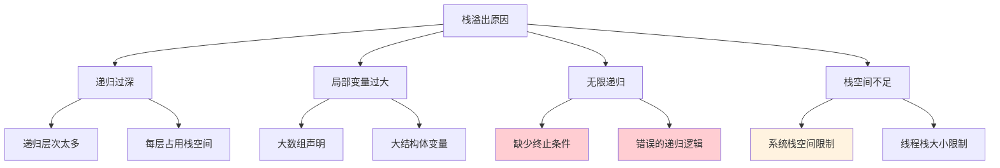


### 08.栈实现浏览器
- 如何实现浏览器的前进、后退功能？
    - 其实，用两个栈就可以非常完美地解决这个问题。
- 使用两个栈实现浏览器前进和后退
    - 使用两个栈，X 和 Y，我们把首次浏览的页面依次压入栈 X，当点击后退按钮时，再依次从栈X 中出栈，并将出栈的数据依次放入栈 Y。
    - 当我们点击前进按钮时，我们依次从栈 Y 中取出数据，放入栈 X 中。当栈 X 中没有数据时，那就说明没有页面可以继续后退浏览了。
    - 当栈 Y 中没有数据，那就说明没有页面可以点击前进按钮浏览了。
- 查看页面的操作
    - 比如你顺序查看了 a，b，c 三个页面，我们就依次把 a，b，c 压入栈，这个时候，两个栈的数据就是这个样子：
    - 
    - 当你通过浏览器的后退按钮，从页面 c 后退到页面 a 之后，我们就依次把 c 和 b 从栈 X 中弹出，并且依次放入到栈 Y。这个时候，两个栈的数据就是这个样子：
    - 
    - 这个时候你又想看页面 b，于是你又点击前进按钮回到 b 页面，我们就把 b 再从栈 Y 中出栈，放入栈 X 中。此时两个栈的数据是这个样子：
    - 
    - 这个时候，你通过页面 b 又跳转到新的页面 d 了，页面 c 就无法再通过前进、后退按钮重复查看了，所以需要清空栈 Y。此时两个栈的数据这个样子：
    - 


## 09.栈的经典应用

### 9.1 括号匹配

**问题**：给定一个只包含 `()`、`[]`、`{}` 的字符串，判断是否有效。

**核心思路**：遇到左括号压栈，遇到右括号弹栈比较。

```python
def is_valid_brackets(s):
    stack = []
    mapping = {')': '(', ']': '[', '}': '{'}
    for ch in s:
        if ch in '([{':
            stack.append(ch)
        elif ch in ')]}':
            if not stack or stack[-1] != mapping[ch]:
                return False
            stack.pop()
    return len(stack) == 0

# 测试
print(is_valid_brackets("({[]})"))   # True
print(is_valid_brackets("([)]"))     # False
```

### 9.2 表达式求值

**疑惑**：计算器是怎么理解 `3 + 5 * 2 - 4` 这样的表达式并正确算出结果的？它怎么知道先算乘法？

**答疑**：编译器使用 **两个栈**——操作数栈和运算符栈，配合运算符优先级来实现。这就是经典的 **Dijkstra 双栈算法**。

**算法流程**：

1. 从左到右扫描表达式
2. 遇到数字：压入操作数栈
3. 遇到运算符：
   - 若运算符栈为空，或当前运算符优先级 > 栈顶运算符，直接压栈
   - 否则，弹出栈顶运算符和两个操作数进行计算，结果压回操作数栈，重复比较
4. 扫描完后，依次弹出运算符栈中剩余的运算符进行计算

```python
def evaluate_expression(expr):
    """中缀表达式求值（支持 + - * / 和括号）"""
    def precedence(op):
        if op in ('+', '-'): return 1
        if op in ('*', '/'): return 2
        return 0
    
    def apply_op(ops_stack, nums_stack):
        b = nums_stack.pop()
        a = nums_stack.pop()
        op = ops_stack.pop()
        if   op == '+': nums_stack.append(a + b)
        elif op == '-': nums_stack.append(a - b)
        elif op == '*': nums_stack.append(a * b)
        elif op == '/': nums_stack.append(int(a / b))
    
    nums, ops = [], []
    i, n = 0, len(expr)
    
    while i < n:
        if expr[i].isdigit():
            num = 0
            while i < n and expr[i].isdigit():
                num = num * 10 + int(expr[i])
                i += 1
            nums.append(num)
            continue
        elif expr[i] == '(':
            ops.append('(')
        elif expr[i] == ')':
            while ops[-1] != '(':
                apply_op(ops, nums)
            ops.pop()  # 弹出 '('
        elif expr[i] in '+-*/':
            while ops and ops[-1] != '(' and precedence(ops[-1]) >= precedence(expr[i]):
                apply_op(ops, nums)
            ops.append(expr[i])
        i += 1
    
    while ops:
        apply_op(ops, nums)
    return nums[0]

# 测试
print(evaluate_expression("3+5*2-4"))      # 9
print(evaluate_expression("(3+5)*(2-4)"))  # -16
```

### 9.3 单调栈

**疑惑**：如何在 O(N) 时间内找到数组中每个元素「下一个更大的元素」？

**答疑**：暴力法是 O(N²)，而 **单调栈** 可以做到 O(N)。单调栈维护一个从栈底到栈顶单调递减的序列，每个元素最多入栈一次、出栈一次。

```python
def next_greater_element(nums):
    """对于每个元素，找到右边第一个比它大的元素"""
    n = len(nums)
    result = [-1] * n
    stack = []  # 存储下标
    
    for i in range(n):
        while stack and nums[i] > nums[stack[-1]]:
            idx = stack.pop()
            result[idx] = nums[i]
        stack.append(i)
    
    return result

# 示例：[2, 1, 5, 3, 6, 4]
# 输出：[5, 5, 6, 6, -1, -1]
print(next_greater_element([2, 1, 5, 3, 6, 4]))
```

**应用场景**：股票价格跨度、柱状图最大矩形面积、接雨水问题等。

### 9.4 栈的设计总结

**疑惑**：栈这么简单的结构，为什么被称为「最有用的数据结构之一」？

**答疑**：栈的威力不在于它的结构复杂度，而在于 **LIFO 模式与「嵌套」结构天然匹配**。现实世界中大量问题本质上是嵌套的：

| 领域 | 嵌套结构 | 栈的应用 |
|------|---------|---------|
| 编译器 | 嵌套的括号、作用域 | 语法分析、符号表 |
| 操作系统 | 嵌套的函数调用 | 调用栈 |
| 浏览器 | 嵌套的页面访问 | 前进后退 |
| 文本编辑器 | 嵌套的撤销操作 | Undo/Redo |
| 算法 | 嵌套的子问题（DFS） | 深度优先搜索 |
| 语言虚拟机 | 嵌套的字节码执行 | JVM 操作数栈 |

**一句话总结**：遇到「后进先出」或「嵌套匹配」的问题，第一反应就是用栈。
