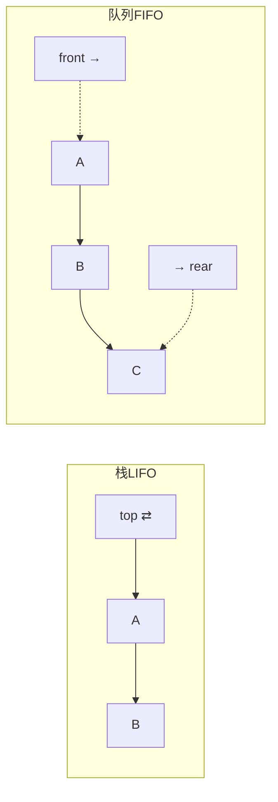
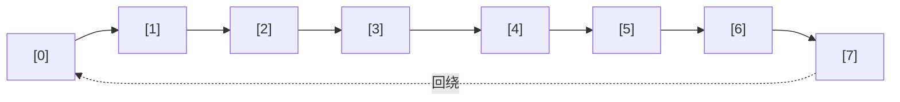
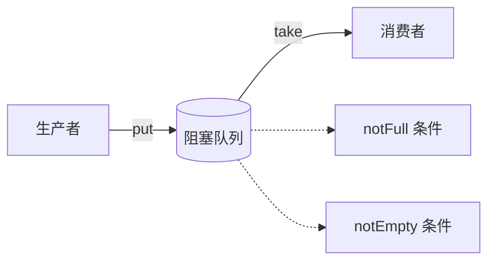

# 07.队列常见操作实践

## 目录介绍

- 01. 从一个工作案例说起
- 02. 队列的定义与 FIFO 本质
- 03. 顺序队列：假溢出问题
- 04. 循环队列：彻底解决假溢出
- 05. 阻塞队列：生产者-消费者模型
- 06. 并发队列：双锁、无锁与 Disruptor
- 07. 优先队列与双端队列
- 08. 队列的经典应用
- 09. 本篇收获与案例回扣
- 10. 思考题
- 11. 课后作业

---

## 01. 从一个工作案例说起

> 真实事故：一个订单导出服务把整个 JVM 打爆了。

背景：后台有一个 **订单导出** 功能，运营同学一次可以勾选最多 100 万条订单导出 Excel。初期用的是最朴素的实现：

- 前端点"导出"后，直接在线程里**同步**跑；
- 一个 Tomcat 工作线程从接到请求到生成文件可能要 30 秒；
- 用户偶尔会频繁点，同一用户点几次就会开好几个同样重的任务。

结果：

- Tomcat 工作线程被导出任务占光 → 所有业务接口超时；
- 用户按"退出"后任务没被清掉 → 继续跑、继续占内存；
- 某天某运营点了 20 次，进程直接 OOM。

正确的做法：**请求入队 → 工作线程按 FIFO 消费 → 同一用户最多只能排一个任务 → 队列满了就拒新**。核心就是把同步改成异步：

```java
BlockingQueue<ExportTask> queue = new ArrayBlockingQueue<>(200);
ExecutorService workers = Executors.newFixedThreadPool(8);

// 接口层
public void submit(ExportTask t) {
    if (!queue.offer(t)) throw new BusyException("当前导出任务繁忙，请稍后再试");
}

// 消费层
workers.submit(() -> {
    while (true) {
        ExportTask t = queue.take();        // 空就阻塞，不忙等
        t.run();
    }
});
```

上线后：

- 接口 P99 从 30s 降到 10ms（只做入队）；
- 内存稳定，不再 OOM；
- 同一用户只会消耗一个排队位。

> 本篇就从这个案例切进去，把队列从"基本数组实现"讲到"阻塞 / 无锁 / Disruptor 极致性能"，学完你能从 0 搭出一个像样的异步任务系统，并独立选型 `ArrayBlockingQueue` / `LinkedBlockingQueue` / `ConcurrentLinkedQueue` / Kafka / RocketMQ。

---

## 02. 队列的定义与 FIFO 本质

### 2.1 核心 API

| 操作 | 含义 | 复杂度 |
|-----|-----|-------|
| `enqueue(x)` | 从队尾入队 | O(1) |
| `dequeue()` | 从队头出队 | O(1) |
| `peek()` | 看一眼队头 | O(1) |
| `isEmpty()` / `size()` | 判空 / 大小 | O(1) |

### 2.2 FIFO vs LIFO



- 栈关注"时间邻近"：最近进的先出（撤销 / 回溯）；
- 队列关注"时间公平"：先进的先出（调度 / 消息）。

### 2.3 常见变种

| 变种 | 特征 | 典型应用 |
|-----|-----|---------|
| 普通队列 | 严格 FIFO | 打印任务 |
| 循环队列 | 数组首尾相接 | 内核 kfifo、Disruptor |
| 双端队列 | 两端都能进出 | 滑动窗口最大值、ForkJoin work-stealing |
| 优先队列 | 按优先级出 | Dijkstra、任务调度 |
| 阻塞队列 | 空等 / 满等 | 生产者-消费者 |
| 延迟队列 | 到期才能出 | 订单超时、定时任务 |

---

## 03. 顺序队列：假溢出问题

用一维数组 + 双指针（head / tail）最朴素的实现：

```java
public class ArrayQueue<T> {
    private Object[] items;
    private int n, head, tail;

    public ArrayQueue(int cap) { items = new Object[cap]; n = cap; }

    public boolean enqueue(T v) {
        if (tail == n) return false;              // 假溢出！
        items[tail++] = v; return true;
    }
    @SuppressWarnings("unchecked")
    public T dequeue() {
        if (head == tail) return null;
        T v = (T) items[head];
        items[head++] = null;
        return v;
    }
}
```

### 3.1 什么是假溢出

```text
容量 8: [A B C D E . . .]
              ↑        ↑
             head     tail=5

出队3次: [. . . D E . . .]
                ↑     ↑
              head=3 tail=5

再入队3次: [. . . D E F G H]
                  ↑           ↑
                 head=3       tail=8

→ tail 顶到 n 了，其实前面还有 3 个空位
```

### 3.2 折中：入队时集中搬移

出队时不搬，tail 顶到头时一次性把 [head, tail) 搬到 [0, tail-head)：

```java
public boolean enqueue(T v) {
    if (tail == n) {
        if (head == 0) return false;              // 真的满了
        for (int i = head; i < tail; i++) items[i - head] = items[i];
        tail -= head; head = 0;
    }
    items[tail++] = v; return true;
}
```

均摊复杂度仍是 O(1)——但每次搬移都是突刺，不够稳定。**根治方案见循环队列**。

---

## 04. 循环队列：彻底解决假溢出

### 4.1 核心思想

物理上还是一维数组，但 head / tail 用 **模运算** 回绕，逻辑上首尾相接成环。



### 4.2 四个关键公式

| 操作 | 公式 |
|-----|-----|
| 入队推进 | `tail = (tail + 1) % cap` |
| 出队推进 | `head = (head + 1) % cap` |
| 判空 | `head == tail` |
| 判满（牺牲一格） | `(tail + 1) % cap == head` |

"牺牲一格"是因为 `head == tail` 需要同时表达"空"和"满"中的一种，最简单的办法是让队列永远留一个空位——代价仅 1 个槽位，逻辑最清晰。

### 4.3 参考实现

```java
public class CircularQueue<T> {
    private final Object[] data;
    private final int cap;                     // 实际分配 capacity + 1
    private int head, tail;

    public CircularQueue(int capacity) {
        cap = capacity + 1;
        data = new Object[cap];
    }

    public boolean enqueue(T v) {
        int nextTail = (tail + 1) % cap;
        if (nextTail == head) return false;    // 满
        data[tail] = v; tail = nextTail;
        return true;
    }

    @SuppressWarnings("unchecked")
    public T dequeue() {
        if (head == tail) return null;         // 空
        T v = (T) data[head];
        data[head] = null;
        head = (head + 1) % cap;
        return v;
    }

    public int size() { return (tail - head + cap) % cap; }
}
```

> Linux 内核的 `kfifo`、Disruptor 的 RingBuffer 都是循环队列的工业级进化版本。

---

## 05. 阻塞队列：生产者-消费者模型

### 5.1 语义

- 队列**空**时，`take()` 阻塞，直到有数据；
- 队列**满**时，`put()` 阻塞，直到有空位；
- 生产者和消费者通过队列解耦。



### 5.2 经典实现（ReentrantLock + 两个 Condition）

```java
public class MyBlockingQueue<T> {
    private final Object[] data;
    private int head, tail, count;
    private final ReentrantLock lock = new ReentrantLock();
    private final Condition notFull  = lock.newCondition();
    private final Condition notEmpty = lock.newCondition();

    public MyBlockingQueue(int cap) { data = new Object[cap]; }

    public void put(T v) throws InterruptedException {
        lock.lock();
        try {
            while (count == data.length) notFull.await();   // ← 必须 while
            data[tail] = v;
            tail = (tail + 1) % data.length;
            count++;
            notEmpty.signal();
        } finally { lock.unlock(); }
    }

    @SuppressWarnings("unchecked")
    public T take() throws InterruptedException {
        lock.lock();
        try {
            while (count == 0) notEmpty.await();
            T v = (T) data[head];
            data[head] = null;
            head = (head + 1) % data.length;
            count--;
            notFull.signal();
            return v;
        } finally { lock.unlock(); }
    }
}
```

### 5.3 两个易错点

- **`while` 而不是 `if`**：存在 **虚假唤醒**，线程被唤醒时条件可能并未满足，必须循环再判一次；
- **`signal` 还是 `signalAll`**：单生产单消费用 `signal` 即可；多生产多消费若只用一个 Condition，要用 `signalAll` 防止"错过唤醒"（这也是为什么推荐用两个 Condition）。

### 5.4 工业实现对照

| 实现 | 底层 | 特点 |
|-----|------|-----|
| `ArrayBlockingQueue` | 数组 + 一把锁 | 有界、公平锁可选 |
| `LinkedBlockingQueue` | 链表 + 两把锁 | 可选有界，吞吐稍高 |
| Go `chan` | runtime 调度 | 语言级支持，CSP 模型 |
| Python `queue.Queue` | 链表 + 锁 | 标准库开箱即用 |

---

## 06. 并发队列：双锁、无锁与 Disruptor

### 6.1 双锁：为什么 LinkedBlockingQueue 能用两把锁

入队在 tail、出队在 head，两端在绝大多数时刻互不干扰。给 tail / head 分别加锁，**生产者和消费者不再互斥**，吞吐大幅提升。

`ArrayBlockingQueue` 用数组，head / tail 共享同一块内存，无法做到像链表这样彻底分离。

### 6.2 无锁：CAS 的 Michael-Scott 队列

用 `AtomicReference` 自旋 + CAS 代替锁（Java `ConcurrentLinkedQueue` 原型）：

```java
public class LockFreeQueue<T> {
    static class Node<T> {
        final T value;
        final AtomicReference<Node<T>> next = new AtomicReference<>();
        Node(T v) { value = v; }
    }

    private final AtomicReference<Node<T>> head, tail;

    public LockFreeQueue() {
        Node<T> dummy = new Node<>(null);
        head = new AtomicReference<>(dummy);
        tail = new AtomicReference<>(dummy);
    }

    public void enqueue(T v) {
        Node<T> n = new Node<>(v);
        for (;;) {
            Node<T> t = tail.get();
            Node<T> nx = t.next.get();
            if (nx == null) {
                if (t.next.compareAndSet(null, n)) {
                    tail.compareAndSet(t, n);                // 帮忙推进
                    return;
                }
            } else {
                tail.compareAndSet(t, nx);                    // 别人推进到一半，帮一把
            }
        }
    }
}
```

### 6.3 ABA 问题

CAS 只比较"值是否变化"，但**值从 A → B → A 再回来，CAS 依然成功**，可能导致逻辑错误。
解决：加版本号 —— Java `AtomicStampedReference`。

### 6.4 Disruptor：极致性能的环形队列

LMAX 交易所开源，标称比 `ArrayBlockingQueue` 快约 **100 倍**。

| 优化 | 说明 |
|-----|-----|
| **RingBuffer** | 环形数组预分配，无 GC |
| **CAS 获取序号** | 生产者通过 CAS 抢占 slot 的 sequence |
| **缓存行填充** | 用 padding 把 head / tail 放到不同缓存行，消除 **伪共享（False Sharing）** |
| **批量消费** | 消费者一次取多个可用事件 |

> 典型吞吐参考（单生产单消费，百万次操作）：`ArrayBlockingQueue ≈ 5 μs / op`，`LinkedBlockingQueue ≈ 8 μs / op`，**Disruptor ≈ 50 ns / op**。

### 6.5 五种方案选型

| 队列 | 线程安全机制 | 吞吐 | 场景 |
|-----|-----------|-----|-----|
| 普通队列 | 无 | 最快 | 单线程 |
| `ArrayBlockingQueue` | 一把锁 | 中 | 生产消费、一般并发 |
| `LinkedBlockingQueue` | 双锁 | 较高 | 线程池任务队列（JDK 默认） |
| `ConcurrentLinkedQueue` | CAS 无锁 | 高 | 高并发、非阻塞 |
| Disruptor | 序号 + 缓存行填充 | 极致 | 交易、游戏、低延迟系统 |

---

## 07. 优先队列与双端队列

### 7.1 优先队列（堆）

语义：**出队的永远是优先级最高（或最低）的元素**，典型用二叉堆实现，入 / 出 均为 O(log N)。

```python
import heapq
pq = []
heapq.heappush(pq, (3, "低"))
heapq.heappush(pq, (1, "高"))
heapq.heappush(pq, (2, "中"))
print(heapq.heappop(pq))  # (1, '高')
```

工业应用：Dijkstra 最短路、Huffman 编码、线程池中的"定时任务"、消息调度的"优先级 + 时间"模型。

### 7.2 双端队列（Deque）

两端都能入 / 出：既是栈、又是队列、还是滑动窗口的基础数据结构。Java 里用 `ArrayDeque`（注意不是 `LinkedList`，前者基于数组循环队列，缓存友好且更快）。

**滑动窗口最大值**是经典的单调双端队列应用，O(N) 搞定：

```python
from collections import deque

def max_sliding_window(nums, k):
    dq, res = deque(), []
    for i, x in enumerate(nums):
        while dq and nums[dq[-1]] <= x: dq.pop()
        dq.append(i)
        if dq[0] <= i - k: dq.popleft()
        if i >= k - 1: res.append(nums[dq[0]])
    return res
```

---

## 08. 队列的经典应用

| 场景 | 队列的角色 |
|-----|----------|
| 线程池任务调度 | `BlockingQueue` 承接未执行任务 |
| BFS / 层次遍历 | 先进先出自然表达"按层次展开" |
| 消息队列（Kafka / RocketMQ） | 跨服务异步解耦、削峰填谷 |
| 打印任务 | 严格 FIFO 保证公平 |
| CPU 指令流水线 | 多级队列串联各阶段 |
| 网卡缓冲区 | 环形队列缓存数据包 |
| 订单超时 / 定时任务 | 延迟队列 / 时间轮 |
| 滑动窗口 | 双端队列 |

---

## 09. 本篇收获与案例回扣

回到开篇"订单导出打爆 JVM"的案例：

- **问题本质**：同步直跑 → 线程资源被长耗时任务霸占 → 请求堆积 → OOM。
- **正确解法**：`ArrayBlockingQueue(200)` 作为任务缓冲 + 固定大小工作线程池消费 + 用户级排队去重 + 队满快速拒绝。
- **队列在这里做的三件事**：
  1. **削峰**：瞬时涌入挡在队列前，不直接打到处理层；
  2. **解耦**：接口层只管入队，处理层只管出队；
  3. **限流**：队列有上限 + `offer` 非阻塞 → 自然拒绝多余请求。

通过本篇你应该拿到以下能力：

1. 能独立讲清 **FIFO 本质 + 假溢出 + 循环队列**，知道为什么工业里更偏爱循环队列；
2. 能用 `ReentrantLock + Condition` 手写阻塞队列，并理解为什么用 `while` 不用 `if`；
3. 能在 `ArrayBlockingQueue / LinkedBlockingQueue / ConcurrentLinkedQueue / Disruptor` 之间做有依据的选型；
4. 理解 CAS / ABA / 伪共享 / 缓存行填充等无锁并发的关键概念；
5. 在任何遇到"异步 + 生产消费 + 限流 + 削峰"的工程场景，第一反应就是队列。

---

## 10. 思考题

> 建议先独立思考，再查资料验证。

1. **判空 / 判满**：循环队列中 `head == tail` 既可能空也可能满。请列出**三种**区分方式，并对比各自优缺点；`Disruptor` 的 RingBuffer 采用的是哪一种，为什么？
2. **双锁可行性**：`LinkedBlockingQueue` 能用两把锁，`ArrayBlockingQueue` 却只能一把，为什么？如果你一定要给数组版也加"双锁"，会遇到什么边界问题？
3. **ABA 的隐蔽 Bug**：请构造一个能因 ABA 导致数据错乱的场景（例如无锁栈 pop 出 A、别人 push B、pop B、又 push 回 A），并说明 `AtomicStampedReference` 是如何解决的。
4. **伪共享**：两个 volatile 变量恰好落在同一个 64 字节缓存行，为什么会"互相拖后腿"？给 `head` 和 `tail` 各自做 padding 后，吞吐提升能达到怎样的量级？（可以用 `@Contended` 或手写 long 填充做对照实验）
5. **延迟队列实战**：订单 30 分钟未支付自动取消。请设计至少两套方案：**堆 + 轮询** vs **时间轮**；它们的时间 / 空间复杂度各是多少？Kafka / RocketMQ 分别选了什么思路？

---

## 11. 课后作业

### 作业一｜还原开篇案例，对比同步 vs 异步

1. 用纯同步实现一个"耗时 3 秒的假导出"接口，开 100 并发，观察接口 P99 与线程数；
2. 引入 `ArrayBlockingQueue(50) + ThreadPoolExecutor(8)` 改成异步，接口仅入队立即返回 `requestId`；
3. 客户端轮询 `requestId` 拿结果；
4. 记录改造前后 **P99、可用线程数、错误率** 三项指标并写 300 字总结。

### 作业二｜手写循环 + 阻塞队列

1. 实现一个泛型 `BoundedBlockingQueue<T>`：底层循环数组 + ReentrantLock + 两个 Condition；
2. 至少支持 `put / take / offer(timeout) / poll(timeout) / size / clear`；
3. 写 JMH 基准，比较你的实现与 `ArrayBlockingQueue` 在单生产单消费、多生产多消费两种负载下的吞吐。

### 作业三｜选型决策矩阵

针对下面 4 个真实场景，给出你推荐的队列并说明理由：

1. 双十一秒杀的订单接收缓冲（百万 QPS，要求绝不丢单）；
2. 一个 WebSocket 网关，每连接一个线程安全的待发送消息队列，平均负载较低；
3. LMAX 式的高频交易匹配引擎，要求延迟 < 1μs；
4. 一个延迟 10min 自动通知的定时器（总量百万、峰值 1 万 QPS）。

最后写一份"我们项目如果要新增一个队列，选型流程应该是这样"的 300 字 SOP。

