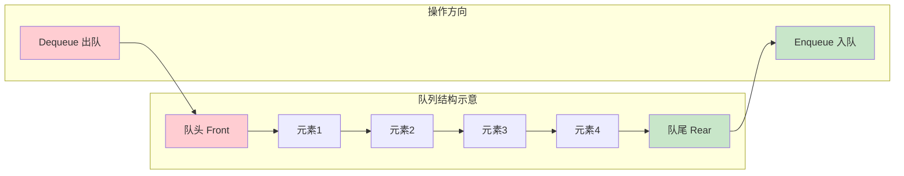
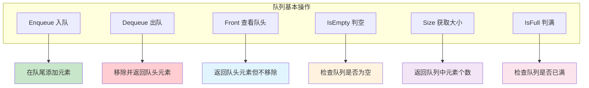
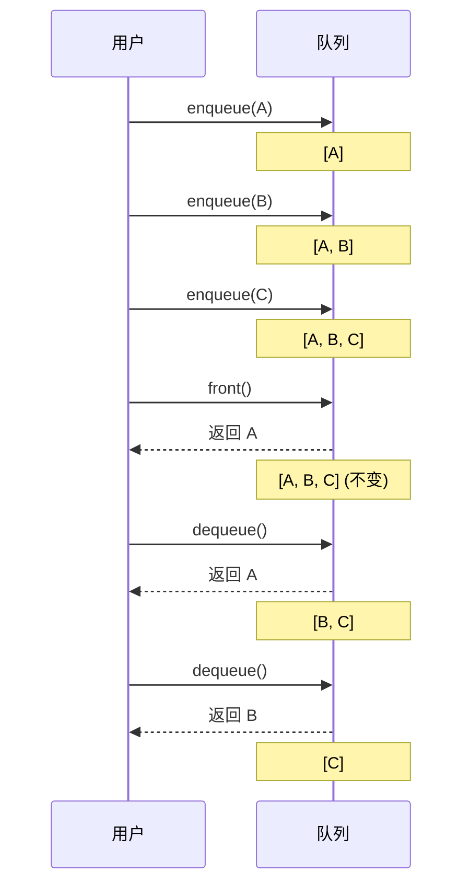
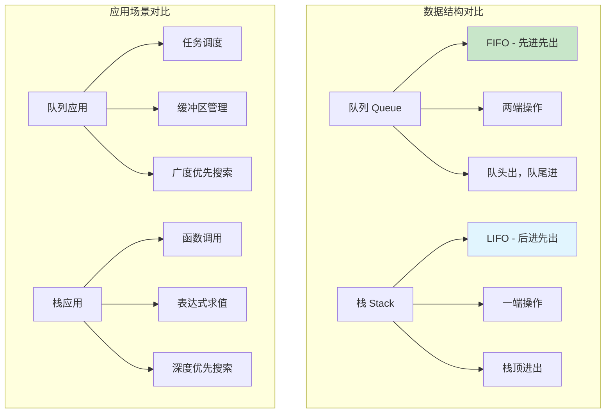

#### 目录介绍
- 1.先看个场景
    - 1.1 线程池场景
    - 1.2 买票场景
- 2.什么是队列
    - 2.1 队列的定义
    - 2.2 队列基本结构
    - 2.3 队列基本操作
    - 2.4 可视化演示
    - 2.5 队列与栈


## 01.先看个场景

### 1.1 线程池场景

线程池处理任务的场景。当我们向固定大小的线程池中请求一个线程时，如果线程池中没有空闲资源了，这个时候线程池如何处理这个请求？是拒绝请求还是排队请求？各种处理策略又是怎么实现的呢？

### 1.2 买票场景

买票的场景。可以把它想象成排队买票，先来的先买，后来的人只能站末尾，不允许插队。先进者先出，这就是典型的“队列”。

## 2.什么是队列

### 2.1 队列的定义

队列（Queue）是一种线性数据结构，它遵循先进先出（FIFO - First In First Out）的原则。

队列只允许在一端（称为队尾/rear）进行插入操作，在另一端（称为队头/front）进行删除操作。

### 2.2 队列基本结构



### 2.3 队列基本操作



### 2.4 可视化演示




### 2.5 队列与栈




### 02.理解什么是队列
- 队列，最基本的操作也是两个：
    - 入队 enqueue()，放一个数据到队列尾部；出队dequeue()，从队列头部取一个元素。所以，队列是一种操作受限的线性表数据结构。
- 看一下队列图
    - 


### 03.队列的使用场景
- 队列的概念很好理解，基本操作也很容易掌握。
    - 作为一种非常基础的数据结构，队列的应用也非常广泛，特别是一些具有某些额外特性的队列，比如循环队列、阻塞队列、并发队列。
    - 比如高性能队列+Disruptor，用到了循环并发队列；Java+concurrent+并发包利用+ArrayBlockingQueue+来实现公平锁等。
- 常见常使用的队列有
    - 顺序队列：
    - 循环队列：
    - 阻塞队列：
    - 并发队列：


### 04.什么是顺序队列
- 队列跟栈一样，也是一种抽象的数据结构。
    - 它具有先进先出的特性，支持在队尾插入元素，在队头删除元素，那究竟该如何实现一个队列呢？
    - 跟栈一样，队列可以用数组来实现，也可以用链表来实现。用数组实现的栈叫作顺序栈，用链表实现的栈叫作链式栈。
    - 同样，用数组实现的队列叫作顺序队列，用链表实现的队列叫作链式队列。+我们先来看下基于数组的实现方法。


#### 4.1 用数组实现队列
- 实现队列的思路
    - 队列需要两个指针：一个是 head 指针，指向队头；一个是 tail 指针，指向队尾。
- 基于数组的实现方法
    ```java
    public class ArrayQueue{
    	
    	private String[] items; // 声明一个数组
    	private int n; // 数组大小
    	private int head = 0; // 队头下标
    	private int tail = 0; // 队尾下标
    	
    	public ArrayQueue(int capacity) {
    		items = new String[capacity];
    		n = capacity;
    	}
    	
    	// 入队
    	public boolean enqueue(String item) {
    		if (tail == n) { // tail == n 表示队列已经满了
    			return false;
    		}
    		items[tail] = item;
    		++tail;
    		return true;
    	}
    	
    	// 出队
    	public String dequeue() {
    		if(head == tail) { // head == tail 表示队列为空
    			return null;
    		}
    		String ret = items[head];
    		++head;
    		return ret;
    	}
    }
    ```
- 来看一下用数组实现队列的草图
    - 当 a、b、c、d 依次入队之后，队列中的 head 指针指向下标为 0 的位置，tail 指针指向下标为 4 的位置。
    - 
    - 当我们调用两次出队操作之后，队列中 head 指针指向下标为 2 的位置，tail 指针仍然指向下标为 4 的位置。
    - 
- 遇到的问题和分析
    - 随着不停地进行入队、出队操作，head 和 tail 都会持续往后移动。当tail 移动到最右边，即使数组中还有空闲空间，也无法继续往队列中添加数据了。这个问题该如何解决呢？
    - 数组的删除操作也会导致数据的不连续，这时的解决方法是数据搬移。相对于队列来说，每次进出队操作就相当于删除数组下标为0的数据，要搬移整个队列中的数据，这样的出队操作的时间复杂度就会从原来的 O(1) 变为 O(n)。能不能优化一下呢？
    - 在出队时可以不用搬移数据，如果没有空闲空间了，我们只需要在入队时，在集中触发一次数据的搬移操作。
    ``` java
    // 入队操作，将 item 放入队尾
    public boolean enqueue(String item) {
         // tail == n 表示队列末尾没有空间了
         if (tail == n) {
             // tail ==n && head==0，表示整个队列都占满了
            if (head == 0) return false;
             // 数据搬移
             for (int i = head; i < tail; ++i) {
                 items[i-head] = items[i];
             }
             // 搬移完之后重新更新 head 和 tail
             tail -= head;
             head = 0;
         }
         items[tail] = item;
         ++tail;
         return true;
    }
    ```
    - 当队列的 tail 指针移动到数组的最右边后，如果有新的数据入队，我们可以将 head 到 tail 之间的数据，整体搬移到数组中 0 到 tail-head 的位置。
    - 


#### 4.2 用链表实现队列
- 基于链表的实现，我们同样需要两个指针：head 指针和 tail 指针。
    - 它们分别指向链表的第一个结点和最后一个结点。如图所示，入队时，tail->next= new_node, tail = tail->next；出队时，head = head->next。
    - 


### 05.什么是循环队列


### 06.什么是阻塞队列


### 07.什么是并发队列


### 03.实现原理介绍分析
- 比起栈的数组实现，队列的数组实现稍微有点儿复杂，但是没关系。对于栈来说，我们只需要一个栈顶指针就可以了。但是队列需要两个指针：一个是 head 指针，指向队头；一个是 tail 指针，指向队尾。
- 举个例子，当 a、b、c、d+依次入队之后，队列中的 head 指针指向下标为 0 的位置，tail 指针指向下标为 4 的位置。当我们调用两次出队操作之后，队列中 head 指针指向下标为 2 的位置，tail 指针仍然指向下标为 4 的位置。
- 你肯定已经发现了，随着不停地进行入队、出队操作，head 和 tail 都会持续往后移动。当 tail 移动到最右边，即使数组中还有空闲空间，也无法继续往队列中添加数据了。这个问题该如何解决呢？
- 你是否还记得，在数组那一节，我们也遇到过类似的问题，就是数组的删除操作会导致数组中的数据不连续。你还记得我们当时是怎么解决的吗？对，用数据搬移！但是，每次进行出队操作都相当于删除数组下标为 0 的数据，要搬移整个队列中的数据，这样出队操作的时间复杂度就会从原来的 O(1) 变为 O(n)。能不能优化一下呢？
- 实际上，我们在出队时可以不用搬移数据。如果没有空闲空间了，我们只需要在入队时，再集中触发一次数据的搬移操作。借助这个思想，出队函数 dequeue() 保持不变，我们稍加改造一下入队函数 enqueue() 的实现，就可以轻松解决刚才的问题了。下面是具体的代码：
    ``` java
    // 入队
    public boolean enqueue(String item) {
    	if (tail == n) { 
    		if (head == 0) {
    			return false;
    		}
    		// 数据搬移
    		for (int i = head; i < tail; i++) {
    			items[i-head] = items[i];
    		}
    		// 搬移后，重置指针位置
    		tail -= head;
    		head = 0;
    	}
    	items[tail] = item;
    	++tail;
    	return true;
    }
    ```
- 从代码中我们看到，当队列的 tail 指针移动到数组的最右边后，如果有新的数据入队，我们可以将 head 到 tail 之间的数据，整体搬移到数组中 0 到 tail-head 的位置。这种实现思路中，出队操作的时间复杂度仍然是 O(1)，但入队操作的时间复杂度还是 O(1) 吗？思考一下……


### 01.什么是链式队列
- 队列跟栈一样，也是一种抽象的数据结构。它具有先进先出的特性，支持在队尾插入元素，在队头删除元素，那究竟该如何实现一个队列呢？
- 跟栈一样，队列可以用数组来实现，也可以用链表来实现。用数组实现的栈叫作顺序栈，用链表实现的栈叫作链式栈。同样，用数组实现的队列叫作顺序队列，用链表实现的队列叫作链式队列。我们先来看下基于链表的实现方法。


### 02.链式队列实现
- 基于链表的实现，同样需要两个指针：head+指针和+tail+指针。它们分别指向链表的第一个结点和最后一个结点。如图所示，入队时，tail->=new_node，tail=ail->next；出队时，head=head->next。
- 


