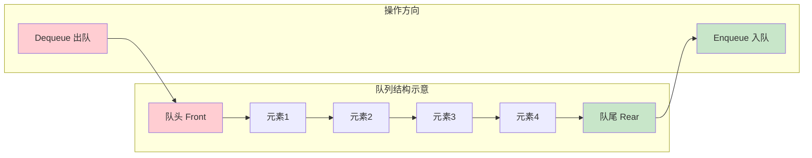
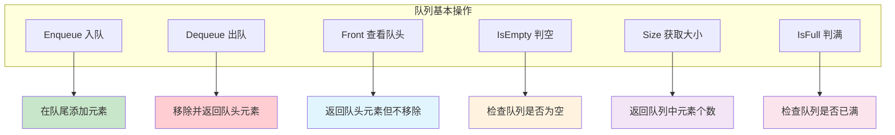
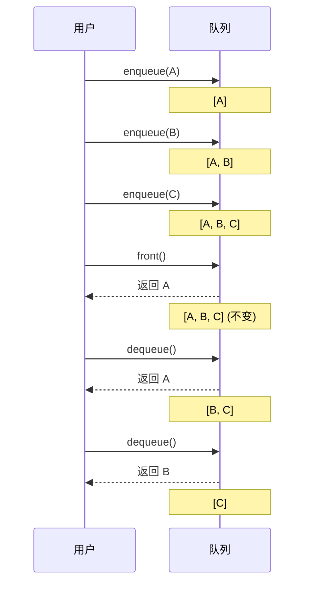
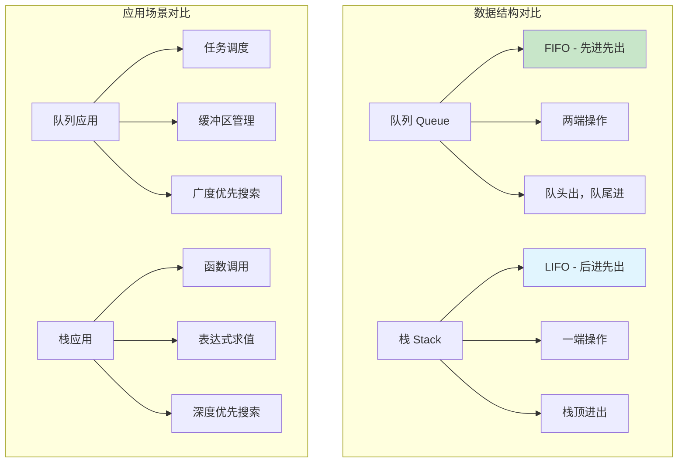
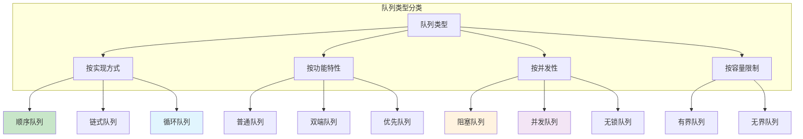

# 07.队列常见操作实践
#### 目录介绍
- [1.先看个场景](#1先看个场景)
  - [1.1 线程池场景](#11-线程池场景)
  - [1.2 买票场景](#12-买票场景)
- [02.什么是队列](#02什么是队列)
  - [2.1 队列的定义](#21-队列的定义)
  - [2.2 队列基本结构](#22-队列基本结构)
  - [2.3 队列基本操作](#23-队列基本操作)
  - [2.4 可视化演示](#24-可视化演示)
  - [2.5 队列与栈](#25-队列与栈)
- [03.队列核心操作](#03队列核心操作)
  - [3.1](#31) 
- [04.常见队列类型](#04常见队列类型)
  - [4.1 队列类型分类](#41-队列类型分类)
  - [4.2 顺序队列详解](#42-顺序队列详解)
  - [4.3 循环队列详解](#43-循环队列详解)
  - [4.4 阻塞队列详解](#44-阻塞队列详解)
- [05.队列安全设计](#05队列安全设计)
  - [5.1 并发队列设计](#51-并发队列设计)
  - [5.2 无锁队列设计](#52-无锁队列设计)


## 01.先看个场景

### 1.1 线程池场景

线程池处理任务的场景。当我们向固定大小的线程池中请求一个线程时，如果线程池中没有空闲资源了，这个时候线程池如何处理这个请求？是拒绝请求还是排队请求？各种处理策略又是怎么实现的呢？

```
线程池的任务队列工作模式：

  任务提交 → [任务队列（Queue）] → 空闲线程取任务执行
              FIFO：先提交的先执行
  
  当队列满了怎么办？（Java ThreadPoolExecutor的策略）
  ├── AbortPolicy:       直接拒绝，抛异常
  ├── CallerRunsPolicy:  让提交者自己执行
  ├── DiscardPolicy:     静默丢弃新任务
  └── DiscardOldestPolicy: 丢弃队列头部（最老的）任务
```

### 1.2 买票场景

买票的场景。可以把它想象成排队买票，先来的先买，后来的人只能站末尾，不允许插队。先进者先出，这就是典型的"队列"。

队列在生活中无处不在：银行叫号系统、打印机任务调度、消息队列（Kafka/RabbitMQ）、操作系统的进程调度、网络数据包的缓冲区等等。

**队列 vs 栈——FIFO vs LIFO 的本质区别**：

```
栈（LIFO）：处理"最近"的事务
  适用：撤销、回溯、递归、括号匹配
  类比：弹夹——最后装入的子弹最先射出

队列（FIFO）：保证"公平性"
  适用：任务调度、消息传递、BFS、缓冲
  类比：排队——先来的先服务

核心区别：
  栈关注"时间邻近性"——最近发生的最先处理
  队列关注"时间公平性"——先发生的先处理
```

**队列变种及其应用场景**：

| 变种 | 特点 | 典型应用 |
|------|------|---------|
| 普通队列 | FIFO严格有序 | 打印机任务队列 |
| 双端队列（Deque） | 两端都可入队出队 | 滑动窗口最大值、工作窃取 |
| 优先队列 | 按优先级出队 | Dijkstra算法、任务调度 |
| 循环队列 | 数组实现，避免假溢出 | 操作系统缓冲区 |
| 阻塞队列 | 空时等待，满时阻塞 | 生产者-消费者模型 |
| 延迟队列 | 元素到期才能出队 | 订单超时取消、定时任务 |

### 2.1 队列的定义

队列（Queue）是一种线性数据结构，它遵循**先进先出（FIFO - First In First Out）** 的原则。

队列只允许在一端（称为队尾/rear）进行插入操作，在另一端（称为队头/front）进行删除操作。

**队列的核心操作**：

| 操作 | 描述 | 时间复杂度 |
|------|------|-----------|
| `enqueue(x)` | 将元素 x 插入队尾 | O(1) |
| `dequeue()` | 移除并返回队头元素 | O(1) |
| `peek()/front()` | 查看队头元素但不移除 | O(1) |
| `isEmpty()` | 判断队列是否为空 | O(1) |
| `size()` | 返回队列中元素数量 | O(1) |

**栈 vs 队列**：栈是 LIFO（后进先出），队列是 FIFO（先进先出）。栈像一摞盘子，队列像排队买票。两者都是"操作受限的线性表"，通过限制操作位置来保证特定的访问顺序。

### 2.2 队列基本结构

队列最基本的操作也是两个：入队 enqueue()，放一个数据到队列尾部；出队dequeue()，从队列头部取一个元素。所以，队列是一种操作受限的线性表数据结构。



### 2.3 队列基本操作



### 2.4 可视化演示



### 2.5 队列与栈



## 03.队列核心操作

### 3.1 队列操作实现

**疑惑**：队列和栈都是「操作受限」的线性表，为什么队列需要两个指针而栈只需要一个？

**答疑**：栈的入和出都在同一端（栈顶），一个指针就够了。而队列的入和出在不同端——队尾进、队头出，必须用两个指针分别追踪。

**数组队列（Python 实现）**：

```python
class ArrayQueue:
    def __init__(self, capacity=16):
        self._data = [None] * capacity
        self._capacity = capacity
        self._head = 0    # 队头指针
        self._tail = 0    # 队尾指针（指向下一个空位）
        self._size = 0
    
    def enqueue(self, value):
        if self._size == self._capacity:
            raise OverflowError("Queue is full")
        self._data[self._tail] = value
        self._tail = (self._tail + 1) % self._capacity  # 循环
        self._size += 1
    
    def dequeue(self):
        if self._size == 0:
            raise IndexError("Queue is empty")
        value = self._data[self._head]
        self._data[self._head] = None
        self._head = (self._head + 1) % self._capacity
        self._size -= 1
        return value
    
    def front(self):
        if self._size == 0:
            raise IndexError("Queue is empty")
        return self._data[self._head]
```

**链式队列（C 实现）**：

```c
#include <stdlib.h>

typedef struct Node {
    int data;
    struct Node *next;
} Node;

typedef struct {
    Node *head;
    Node *tail;
    int size;
} LinkedQueue;

void enqueue(LinkedQueue *q, int value) {
    Node *node = (Node*)malloc(sizeof(Node));
    node->data = value;
    node->next = NULL;
    if (q->tail) {
        q->tail->next = node;
    } else {
        q->head = node;
    }
    q->tail = node;
    q->size++;
}

int dequeue(LinkedQueue *q, int *out) {
    if (!q->head) return -1;
    Node *tmp = q->head;
    *out = tmp->data;
    q->head = q->head->next;
    if (!q->head) q->tail = NULL;
    free(tmp);
    q->size--;
    return 0;
}
```

**时间复杂度**：enqueue O(1)，dequeue O(1)。

## 04.常见队列类型

### 4.1 队列类型分类

作为一种非常基础的数据结构，队列的应用也非常广泛，特别是一些具有某些额外特性的队列，比如循环队列、阻塞队列、并发队列。

比如高性能队列+Disruptor，用到了循环并发队列；Java+concurrent+并发包利用+ArrayBlockingQueue+来实现公平锁等。



### 4.2 顺序队列详解

顺序队列用数组实现，两个指针 head 和 tail 分别指向队头和队尾。

**核心问题——假溢出**：随着入队出队操作，head 和 tail 都向右移动。当 tail 到达数组末尾时，即使数组前面有大量空闲空间也无法入队——这就是"假溢出"。

```
假溢出示意（容量8）：

初始状态：      [A][B][C][D][E][ ][ ][ ]
                 ↑               ↑
                head            tail

出队3次：       [ ][ ][ ][D][E][ ][ ][ ]
                          ↑     ↑
                         head  tail

入队3次：       [ ][ ][ ][D][E][F][G][H]
                          ↑              ↑
                         head           tail=8

再入队 → 失败！tail == capacity
但前面还有3个空位！这就是假溢出。
```

**解决方案**：
1. 出队时搬移数据 → 每次出队 O(N)，太慢
2. 入队时集中搬移 → 均摊 O(1)，可接受
3. 循环队列 → 彻底解决，O(1)，最优

### 4.3 循环队列详解

循环队列通过取模运算让 head 和 tail 在数组中"回绕"，从根本上解决了假溢出问题。

**设计原理**：在逻辑上把数组的首尾相连形成环形结构。当指针到达数组末尾后，自动回到开头。

```
循环队列的逻辑视图：

       ┌───┐
    ┌──┤ 7 ├──┐
    │  └───┘  │
  ┌─┴─┐    ┌─┴─┐
  │ 6 │    │ 0 │ ← head
  └─┬─┘    └─┬─┘
    │  ┌───┐  │
    └──┤ 5 ├──┘
       └─┬─┘
    ┌──┐ │ ┌──┐
    │ 4│─┘ │ 1│
    └──┘   └──┘
       ┌───┐
       │ 3 │ ← tail
       └───┘
       
物理上还是线性数组：[0][1][2][3][4][5][6][7]
```

**关键设计决策——如何区分"空"和"满"？**

当 head == tail 时，队列可能是空的，也可能是满的。有三种解决方案：

| 方案 | 判空 | 判满 | 代价 |
|------|------|------|------|
| 牺牲一个空间 | head == tail | (tail+1)%cap == head | 浪费 1 个槽位 |
| 维护 size 变量 | size == 0 | size == capacity | 多一个变量 |
| 使用标志位 flag | head==tail && !flag | head==tail && flag | 多一个布尔值 |

工业实现中最常用第一种（牺牲一个空间），因为最简单且没有并发问题。

### 4.4 阻塞队列详解

阻塞队列在普通队列基础上增加了阻塞语义：**队列为空时出队操作会等待，队列满时入队操作会等待**。

**生产者-消费者模式的核心**：

```
生产者线程 ──put──→ [阻塞队列] ──take──→ 消费者线程

队列满时：生产者 wait()，直到消费者 take() 后 signal()
队列空时：消费者 wait()，直到生产者 put() 后 signal()
```

**为什么用 while 循环而不是 if 判断？**

```java
// 错误写法：
if (count == capacity) notFull.await();

// 正确写法：
while (count == capacity) notFull.await();

// 原因：存在"虚假唤醒（Spurious Wakeup）"
// 线程可能在没有被 signal 的情况下醒来
// 用 while 确保条件真的满足才继续执行
```

## 05.队列安全设计

### 5.1 并发队列设计

**核心挑战**：多个线程同时读写队列时，如何保证数据一致性？

**三种并发策略的对比**：

| 策略 | 原理 | 优点 | 缺点 | 代表实现 |
|------|------|------|------|---------|
| 全局锁 | 一把锁保护整个队列 | 实现简单 | 并发度低 | synchronized |
| 分段锁 | 入队出队分别加锁 | 并发度翻倍 | 实现稍复杂 | LinkedBlockingQueue |
| 无锁（CAS） | 原子操作替代锁 | 极高并发 | 实现复杂，ABA问题 | ConcurrentLinkedQueue |

```java
// Java 各并发队列的使用场景
// 1. 低并发场景——synchronized 包装
Queue<Task> queue = Collections.synchronizedList(new LinkedList<>());

// 2. 中并发场景——阻塞队列（生产消费模式）
BlockingQueue<Task> queue = new ArrayBlockingQueue<>(1000);

// 3. 高并发场景——无锁队列
Queue<Task> queue = new ConcurrentLinkedQueue<>();
```

### 5.2 无锁队列设计

**CAS（Compare-And-Swap）的工作原理**：

```
CAS 是 CPU 提供的原子指令，操作如下：
1. 读取内存地址 addr 当前的值 current
2. 比较 current 是否等于预期值 expected
3. 如果相等，将 addr 的值更新为 new_value → 返回成功
4. 如果不等（说明被其他线程修改了），不更新 → 返回失败

整个过程是原子的，不可被中断。
```

**ABA 问题与解决方案**：

```
线程A 读取值 = A，准备 CAS 更新
线程B 将值从 A 改为 B，再改回 A
线程A 执行 CAS，发现值仍为 A，成功！

但实际上值已经被改过了——这就是 ABA 问题。

解决方案：加版本号
  值从 (A, v1) → (B, v2) → (A, v3)
  CAS 同时比较值和版本号，版本号不同则失败
  Java: AtomicStampedReference（带版本号的原子引用）
```

**无锁队列的性能优势**：无锁队列在高并发场景下避免了线程上下文切换（context switch）的开销。一次上下文切换约需 1~10 微秒，而一次 CAS 操作仅需约 10 纳秒。当并发线程数增加时，锁竞争导致的上下文切换成为主要瓶颈，无锁方案的优势就愈发明显。


### 04.什么是顺序队列
- 队列跟栈一样，也是一种抽象的数据结构。
    - 它具有先进先出的特性，支持在队尾插入元素，在队头删除元素，那究竟该如何实现一个队列呢？
    - 跟栈一样，队列可以用数组来实现，也可以用链表来实现。用数组实现的栈叫作顺序栈，用链表实现的栈叫作链式栈。
    - 同样，用数组实现的队列叫作顺序队列，用链表实现的队列叫作链式队列。+我们先来看下基于数组的实现方法。


#### 4.1 用数组实现队列
- 实现队列的思路
    - 队列需要两个指针：一个是 head 指针，指向队头；一个是 tail 指针，指向队尾。
- 基于数组的实现方法
    ```java
    public class ArrayQueue{
    	
    	private String[] items; // 声明一个数组
    	private int n; // 数组大小
    	private int head = 0; // 队头下标
    	private int tail = 0; // 队尾下标
    	
    	public ArrayQueue(int capacity) {
    		items = new String[capacity];
    		n = capacity;
    	}
    	
    	// 入队
    	public boolean enqueue(String item) {
    		if (tail == n) { // tail == n 表示队列已经满了
    			return false;
    		}
    		items[tail] = item;
    		++tail;
    		return true;
    	}
    	
    	// 出队
    	public String dequeue() {
    		if(head == tail) { // head == tail 表示队列为空
    			return null;
    		}
    		String ret = items[head];
    		++head;
    		return ret;
    	}
    }
    ```
- 来看一下用数组实现队列的草图
    - 当 a、b、c、d 依次入队之后，队列中的 head 指针指向下标为 0 的位置，tail 指针指向下标为 4 的位置。
    - 
    - 当我们调用两次出队操作之后，队列中 head 指针指向下标为 2 的位置，tail 指针仍然指向下标为 4 的位置。
    - 
- 遇到的问题和分析
    - 随着不停地进行入队、出队操作，head 和 tail 都会持续往后移动。当tail 移动到最右边，即使数组中还有空闲空间，也无法继续往队列中添加数据了。这个问题该如何解决呢？
    - 数组的删除操作也会导致数据的不连续，这时的解决方法是数据搬移。相对于队列来说，每次进出队操作就相当于删除数组下标为0的数据，要搬移整个队列中的数据，这样的出队操作的时间复杂度就会从原来的 O(1) 变为 O(n)。能不能优化一下呢？
    - 在出队时可以不用搬移数据，如果没有空闲空间了，我们只需要在入队时，在集中触发一次数据的搬移操作。
    ``` java
    // 入队操作，将 item 放入队尾
    public boolean enqueue(String item) {
         // tail == n 表示队列末尾没有空间了
         if (tail == n) {
             // tail ==n && head==0，表示整个队列都占满了
            if (head == 0) return false;
             // 数据搬移
             for (int i = head; i < tail; ++i) {
                 items[i-head] = items[i];
             }
             // 搬移完之后重新更新 head 和 tail
             tail -= head;
             head = 0;
         }
         items[tail] = item;
         ++tail;
         return true;
    }
    ```
    - 当队列的 tail 指针移动到数组的最右边后，如果有新的数据入队，我们可以将 head 到 tail 之间的数据，整体搬移到数组中 0 到 tail-head 的位置。
    - 


#### 4.2 用链表实现队列
- 基于链表的实现，我们同样需要两个指针：head 指针和 tail 指针。
    - 它们分别指向链表的第一个结点和最后一个结点。如图所示，入队时，tail->next= new_node, tail = tail->next；出队时，head = head->next。
    - 


### 05.什么是循环队列

**疑惑**：顺序队列有「假溢出」问题——head 和 tail 都向右移动，左边空出来的空间白白浪费了。怎么办？

**答疑**：把数组首尾相连，在逻辑上形成一个「环」——这就是 **循环队列**。物理上还是一个一维数组，但通过 **取模运算** 让指针回绕。

**核心公式**：
- 入队：`tail = (tail + 1) % capacity`
- 出队：`head = (head + 1) % capacity`
- 判空：`head == tail`
- 判满：`(tail + 1) % capacity == head`（牺牲一个空间区分空和满）

```
循环队列内存示意（容量8，当前存了5个元素）：

    下标:  0   1   2   3   4   5   6   7
    内容: [空] [空] [空] [A] [B] [C] [D] [E]
                         ↑               ↑
                        head            tail
                        
    head = 3, tail = 8 % 8 = 0 → 实际 tail 回绕到 0
```

**完整实现（多语言）**：

```python
# Python —— 循环队列
class CircularQueue:
    def __init__(self, capacity):
        self._capacity = capacity + 1  # 多分配一个空间用于区分空和满
        self._data = [None] * self._capacity
        self._head = 0
        self._tail = 0
    
    def enqueue(self, value):
        if self.is_full():
            raise OverflowError("Queue is full")
        self._data[self._tail] = value
        self._tail = (self._tail + 1) % self._capacity
    
    def dequeue(self):
        if self.is_empty():
            raise IndexError("Queue is empty")
        value = self._data[self._head]
        self._head = (self._head + 1) % self._capacity
        return value
    
    def is_empty(self):
        return self._head == self._tail
    
    def is_full(self):
        return (self._tail + 1) % self._capacity == self._head
    
    def size(self):
        return (self._tail - self._head + self._capacity) % self._capacity
```

```c
// C —— 循环队列
typedef struct {
    int *data;
    int head, tail;
    int capacity;   // 实际分配 capacity + 1
} CircularQueue;

CircularQueue* cq_create(int cap) {
    CircularQueue *q = (CircularQueue*)malloc(sizeof(CircularQueue));
    q->capacity = cap + 1;
    q->data = (int*)malloc(sizeof(int) * q->capacity);
    q->head = q->tail = 0;
    return q;
}

int cq_is_full(CircularQueue *q) {
    return (q->tail + 1) % q->capacity == q->head;
}

int cq_is_empty(CircularQueue *q) {
    return q->head == q->tail;
}

int cq_enqueue(CircularQueue *q, int val) {
    if (cq_is_full(q)) return -1;
    q->data[q->tail] = val;
    q->tail = (q->tail + 1) % q->capacity;
    return 0;
}

int cq_dequeue(CircularQueue *q, int *out) {
    if (cq_is_empty(q)) return -1;
    *out = q->data[q->head];
    q->head = (q->head + 1) % q->capacity;
    return 0;
}
```

```java
// Java —— 循环队列
public class CircularQueue<T> {
    private Object[] data;
    private int head, tail;
    private int capacity;
    
    public CircularQueue(int cap) {
        this.capacity = cap + 1;
        this.data = new Object[capacity];
        this.head = 0;
        this.tail = 0;
    }
    
    public void enqueue(T value) {
        if ((tail + 1) % capacity == head) {
            throw new RuntimeException("Queue is full");
        }
        data[tail] = value;
        tail = (tail + 1) % capacity;
    }
    
    @SuppressWarnings("unchecked")
    public T dequeue() {
        if (head == tail) {
            throw new RuntimeException("Queue is empty");
        }
        T value = (T) data[head];
        head = (head + 1) % capacity;
        return value;
    }
}
```

**关键要点**：循环队列是高性能队列（如 Disruptor、Linux 内核 kfifo）的基础。它避免了数据搬移，所有操作都是 O(1)。


### 06.什么是阻塞队列

**疑惑**：普通队列满了就丢弃或报错，但实际系统中生产者不能丢数据、消费者没数据也不能空转。怎么解决？

**答疑**：**阻塞队列** = 普通队列 + 阻塞机制。队列满时生产者阻塞等待（直到消费者取走数据腾出空间）；队列空时消费者阻塞等待（直到生产者放入数据）。

这就是经典的 **生产者-消费者模式**。

**核心设计要素**：

1. **互斥锁（Mutex）**：保证同一时刻只有一个线程操作队列
2. **条件变量（Condition）**：让线程在特定条件不满足时休眠，避免忙等待
3. **有界容量**：防止内存无限增长

```python
# Python —— 阻塞队列实现
import threading

class BlockingQueue:
    def __init__(self, capacity):
        self._queue = []
        self._capacity = capacity
        self._lock = threading.Lock()
        self._not_full = threading.Condition(self._lock)
        self._not_empty = threading.Condition(self._lock)
    
    def put(self, item):
        """生产者调用：队列满时阻塞"""
        with self._not_full:
            while len(self._queue) >= self._capacity:
                self._not_full.wait()        # 阻塞，释放锁
            self._queue.append(item)
            self._not_empty.notify()         # 唤醒消费者
    
    def take(self):
        """消费者调用：队列空时阻塞"""
        with self._not_empty:
            while len(self._queue) == 0:
                self._not_empty.wait()       # 阻塞，释放锁
            item = self._queue.pop(0)
            self._not_full.notify()          # 唤醒生产者
            return item
```

```java
// Java —— 使用 ReentrantLock + Condition 实现阻塞队列
import java.util.concurrent.locks.*;

public class BlockingQueue<T> {
    private Object[] items;
    private int head, tail, count;
    private final ReentrantLock lock = new ReentrantLock();
    private final Condition notFull = lock.newCondition();
    private final Condition notEmpty = lock.newCondition();
    
    public BlockingQueue(int capacity) {
        items = new Object[capacity];
    }
    
    public void put(T item) throws InterruptedException {
        lock.lock();
        try {
            while (count == items.length) {
                notFull.await();           // 队列满，生产者等待
            }
            items[tail] = item;
            tail = (tail + 1) % items.length;
            count++;
            notEmpty.signal();             // 唤醒消费者
        } finally {
            lock.unlock();
        }
    }
    
    @SuppressWarnings("unchecked")
    public T take() throws InterruptedException {
        lock.lock();
        try {
            while (count == 0) {
                notEmpty.await();          // 队列空，消费者等待
            }
            T item = (T) items[head];
            items[head] = null;
            head = (head + 1) % items.length;
            count--;
            notFull.signal();              // 唤醒生产者
            return item;
        } finally {
            lock.unlock();
        }
    }
}
```

**工业应用**：

| 实现 | 语言/框架 | 特点 |
|------|----------|------|
| ArrayBlockingQueue | Java | 数组实现，有界，公平锁可选 |
| LinkedBlockingQueue | Java | 链表实现，可选有界 |
| channel | Go | 语言内置，CSP 并发模型 |
| queue.Queue | Python | 线程安全阻塞队列 |
| BlockingCollection | C# | 支持多种底层集合 |


### 07.什么是并发队列

**疑惑**：阻塞队列用锁保证安全，但锁的开销大、性能低。高并发场景下有没有更快的方案？

**答疑**：有两条路——**细粒度锁** 和 **无锁（Lock-Free）**。

#### 方案一：入队和出队用不同的锁

阻塞队列的 put 和 take 操作分别在队尾和队头，理论上不冲突。可以用两把锁分别保护 head 和 tail，减少锁竞争。

```
传统方案：1 把锁 → 入队和出队互斥
优化方案：2 把锁 → 入队锁 + 出队锁，只有在两端同时操作同一元素时才冲突
```

Java 的 `LinkedBlockingQueue` 就采用了这种双锁策略。

#### 方案二：CAS 无锁队列

利用硬件提供的 **CAS（Compare-And-Swap）** 原子指令，完全消除锁。

```
CAS 操作伪代码：
bool CAS(addr, expected, new_value):
    if *addr == expected:
        *addr = new_value
        return true
    return false
```

```java
// Java —— 无锁队列核心思想（简化版）
import java.util.concurrent.atomic.AtomicReference;

public class LockFreeQueue<T> {
    private static class Node<T> {
        final T value;
        final AtomicReference<Node<T>> next;
        Node(T value) {
            this.value = value;
            this.next = new AtomicReference<>(null);
        }
    }
    
    private final AtomicReference<Node<T>> head;
    private final AtomicReference<Node<T>> tail;
    
    public LockFreeQueue() {
        Node<T> sentinel = new Node<>(null);  // 哨兵节点
        head = new AtomicReference<>(sentinel);
        tail = new AtomicReference<>(sentinel);
    }
    
    public void enqueue(T value) {
        Node<T> newNode = new Node<>(value);
        while (true) {
            Node<T> curTail = tail.get();
            Node<T> next = curTail.next.get();
            if (next == null) {
                // 尝试将新节点挂到 tail.next
                if (curTail.next.compareAndSet(null, newNode)) {
                    // 成功后尝试移动 tail（失败也没关系，其他线程会帮忙）
                    tail.compareAndSet(curTail, newNode);
                    return;
                }
            } else {
                // tail 落后了，帮忙推进
                tail.compareAndSet(curTail, next);
            }
        }
    }
}
```

这就是 **Michael-Scott 无锁队列** 的核心思想，Java 的 `ConcurrentLinkedQueue` 就基于此算法。

#### 方案三：Disruptor 高性能环形队列

Disruptor 是 LMAX 交易所开源的高性能队列框架：

- **环形数组**：预分配内存，无 GC 压力
- **无锁设计**：生产者用 CAS 竞争序号，消费者无竞争
- **缓存行填充**：消除 CPU 缓存的伪共享（False Sharing）
- **批量消费**：一次获取多个可用事件

```
性能对比（单生产者单消费者，百万次操作）：
ArrayBlockingQueue: ~5,000 ns/op
LinkedBlockingQueue: ~8,000 ns/op
Disruptor:          ~50 ns/op  ← 快 100 倍
```

**总结**：

| 队列类型 | 线程安全机制 | 适用场景 | 性能 |
|---------|-------------|---------|------|
| 普通队列 | 无 | 单线程 | 最快 |
| 阻塞队列 | 互斥锁+条件变量 | 中低并发生产消费 | 中等 |
| 双锁队列 | 入队锁+出队锁 | 中等并发 | 较好 |
| CAS无锁队列 | CAS原子操作 | 高并发 | 很好 |
| Disruptor | 序号屏障+缓存行填充 | 超高并发、低延迟 | 极致 |


## 06.优先队列与双端队列

### 8.1 优先队列

**疑惑**：普通队列是 FIFO，但现实中很多场景需要「按优先级出队」——急诊病人优先、高优先级任务先执行。怎么实现？

**答疑**：**优先队列（Priority Queue）** 在逻辑上是队列，但出队时总是取出优先级最高（或最低）的元素。底层通常用 **堆（Heap）** 实现。

```
优先队列 vs 普通队列：
普通队列：入队 A(3), B(1), C(2) → 出队顺序 A, B, C
优先队列：入队 A(3), B(1), C(2) → 出队顺序 B(1), C(2), A(3)  （最小优先）
```

| 操作 | 数组（无序） | 数组（有序） | 堆 |
|------|-----------|------------|-----|
| 入队 | O(1) | O(N) | O(log N) |
| 出队（取最值） | O(N) | O(1) | O(log N) |

堆是最均衡的选择，入队出队都是 O(log N)。

```python
# Python —— 使用 heapq 模块
import heapq

class PriorityQueue:
    def __init__(self):
        self._heap = []
    
    def push(self, priority, item):
        heapq.heappush(self._heap, (priority, item))
    
    def pop(self):
        return heapq.heappop(self._heap)

# 任务调度示例
pq = PriorityQueue()
pq.push(3, "低优先级任务")
pq.push(1, "高优先级任务")
pq.push(2, "中优先级任务")
print(pq.pop())  # (1, '高优先级任务')
print(pq.pop())  # (2, '中优先级任务')
```

### 8.2 双端队列（Deque）

双端队列（Double-ended Queue）允许在 **两端** 同时进行插入和删除操作，是栈和队列的推广。

```
普通队列：    队头出 ← [a, b, c, d] ← 队尾进
栈：         栈顶进出 → [a, b, c, d]
双端队列：    ←进出→ [a, b, c, d] ←进出→
```

**应用场景**：
- **滑动窗口最大值**：使用单调双端队列，O(N) 解决
- **工作窃取（Work Stealing）**：Java ForkJoinPool 中每个线程有自己的双端队列，忙的线程从自己队列头部取，空闲线程从别人队列尾部偷
- **回文检测**：从两端同时取字符比较


### 03.实现原理深入分析

**疑惑**：顺序队列出队操作的数据搬移，入队时集中触发一次搬移，均摊时间复杂度是多少？

**答疑**：这和动态数组扩容的均摊分析思路一致。假设队列容量为 N：
- 大多数入队操作：O(1)
- 只有当 tail 到达末尾且 head > 0 时触发搬移：搬移 (tail - head) 个元素
- 两次搬移之间至少有 head 次不搬移的入队
- 因此均摊下来每次入队仍是 **O(1)**

这就是 **均摊分析** 的魅力——看似偶尔很慢的操作，分摊到每次操作上成本很低。

**论证**：比较三种队列实现的核心指标：

| 实现方式 | 入队 | 出队 | 空间利用率 | 实现复杂度 |
|---------|------|------|-----------|-----------|
| 顺序队列（搬移） | 均摊 O(1) | O(1) | 较低（有假溢出） | 简单 |
| 循环队列 | O(1) | O(1) | 高（浪费1格） | 中等 |
| 链式队列 | O(1) | O(1) | 高（额外指针开销） | 简单 |

**结论**：对于固定容量场景，循环队列是最优解；对于不确定容量场景，链式队列更灵活。


## 07.队列的设计总结

**疑惑**：什么时候该用队列而不是栈？

**答疑**：核心区别是语义：

- **需要保持顺序**（先到先处理）→ 队列
- **需要嵌套/回溯**（后到先处理）→ 栈

| 场景 | 数据结构 | 原因 |
|------|---------|------|
| 任务调度 | 队列 | 公平性：先提交先执行 |
| BFS（广度优先搜索） | 队列 | 逐层展开 |
| 消息队列（MQ） | 队列 | 消息顺序性保证 |
| CPU 缓存淘汰 | 队列 | FIFO 淘汰最老数据 |
| 打印队列 | 队列 | 先发送先打印 |
| 函数调用 | 栈 | 最后调用最先返回 |
| DFS（深度优先搜索） | 栈 | 深入到底再回溯 |

**技术演变过程**：

```
简单数组队列 → 循环队列（解决假溢出）
    → 阻塞队列（解决并发同步）
        → 无锁队列（解决锁性能瓶颈）
            → Disruptor（解决缓存伪共享，极致性能）
```

每一步演变都是为了解决上一步遗留的性能或功能问题，这就是数据结构持续进化的动力。


