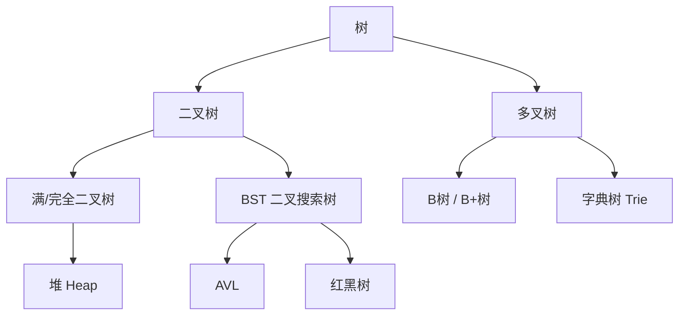
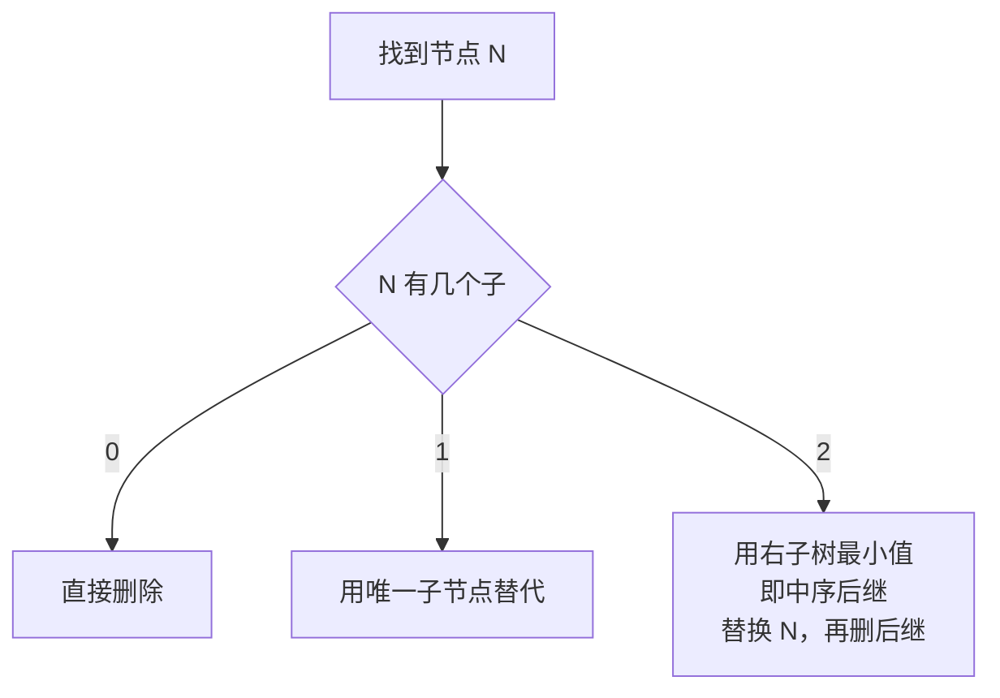
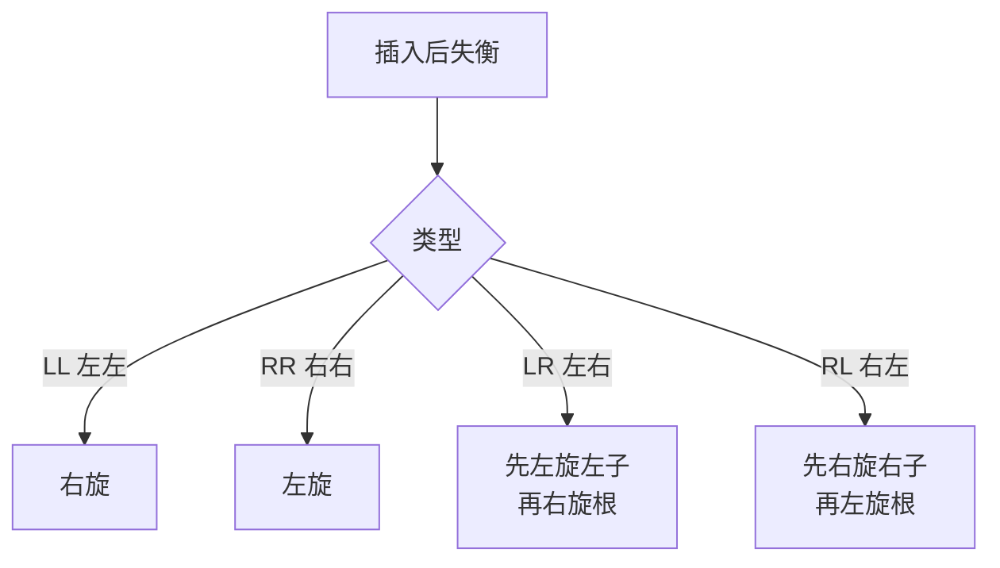

# 08.二叉树的操作实践

## 目录介绍

- 01. 从一个工作案例说起
- 02. 树与二叉树：为什么需要分层结构
- 03. 二叉树的存储与节点设计
- 04. 二叉树的四种遍历
- 05. 二叉搜索树 BST
- 06. 平衡二叉树 AVL
- 07. 堆与优先队列
- 08. 二叉树的工业应用
- 09. 本篇收获与案例回扣
- 10. 思考题
- 11. 课后作业

---

## 01. 从一个工作案例说起

> 真实需求：给 IM 服务接入一个"**离线消息排行榜 Top-100**"——在 10 亿条消息里找出"未读数最多"的前 100 个群。

第一版实现，组内新同学直接用：

```java
// 把 10 亿条消息按未读数倒排全量排序，再取前 100
messages.sort((a, b) -> b.unread - a.unread);
List<Msg> top100 = messages.subList(0, 100);
```

压测时直接崩：

1. 时间复杂度 **O(N log N)**，10 亿级数据在 JVM 里几乎跑不完；
2. 要把 10 亿对象同时驻留内存，OOM 分分钟的事；
3. 场景只要 Top 100，却支付了 99.99% 无用排序的成本。

**正确解法：维护一个容量为 100 的 "小顶堆"**

- 堆顶永远是当前 Top 100 里的 "第 100 名"；
- 新来一条消息：若未读数 ≤ 堆顶，直接丢；否则弹出堆顶、把它插进堆；
- 全程内存 O(K = 100)，时间 **O(N log K)**。

```java
PriorityQueue<Msg> minHeap = new PriorityQueue<>(100, Comparator.comparingInt(m -> m.unread));
for (Msg m : messages) {
    if (minHeap.size() < 100) minHeap.offer(m);
    else if (m.unread > minHeap.peek().unread) {
        minHeap.poll();
        minHeap.offer(m);
    }
}
```

10 亿级流式数据秒级完成，内存不到 1 MB。堆 / 优先队列本质就是一棵 **完全二叉树**，是这一篇二叉树知识的核心落脚点。

> 本篇从"为什么需要树"讲到"BST / AVL / 堆"，再到 B+ 树、哈夫曼、表达式树等工业应用。学完你能轻松拿下 LeetCode 94 / 98 / 102 / 215 / 236 等高频题，并独立设计开篇的 Top-K 服务。

---

## 02. 树与二叉树：为什么需要分层结构

### 2.1 线性结构的天花板

| 结构 | 查找 | 插入 | 删除 |
|-----|-----|-----|-----|
| 有序数组 | **O(log N)** | O(N) | O(N) |
| 链表 | O(N) | **O(1)**（已定位） | **O(1)**（已定位） |
| 平衡二叉树 | **O(log N)** | **O(log N)** | **O(log N)** |

线性结构逼不出"查找、插入、删除全都 O(log N)"这种均衡；**树通过分层** 把这三件事捏在一起。

### 2.2 log N 的威力

| 数据量 N | O(N) | O(log N) | 加速比 |
|---------|-----|---------|-------|
| 1 千 | 500 | 10 | 50× |
| 100 万 | 50 万 | 20 | 2.5 万× |
| 10 亿 | 5 亿 | 30 | 1600 万× |

一层分层判断 = 排除一半候选，这是树结构的效率本源。

### 2.3 基本术语

```text
        A          根
       / \
      B   C        B、C 兄弟
     / \   \
    D   E   F      叶子: E/F/G
   /
  G
```

| 术语 | 定义 |
|-----|-----|
| 根节点 | 没有父节点 |
| 叶子节点 | 没有子节点 |
| 节点的度 | 子节点数量 |
| 深度 | 根到该节点的边数（从上往下） |
| 高度 | 该节点到最远叶子的边数（从下往上） |

### 2.4 常见树家族



红黑树单独在下一篇展开。

---

## 03. 二叉树的存储与节点设计

### 3.1 数学性质速记

| 性质 | 公式 |
|-----|-----|
| 第 i 层最多节点数 | 2^i |
| 深度 h 满二叉树节点数 | 2^(h+1) - 1 |
| 叶子 / 度 2 关系 | n₀ = n₂ + 1 |
| N 节点最小高度 | ⌊log₂ N⌋ |
| N 节点最大高度 | N - 1（退化链表） |

### 3.2 完全二叉树与数组存储

**完全二叉树**：除最后一层外每层都满，最后一层从左到右连续。这使它能用数组紧凑存储（下标从 0 起）：

```text
     50(0)
    /      \
  30(1)    70(2)
   / \      / \
 20(3) 40(4) 60(5) 80(6)
```

下标关系：`parent(i) = (i-1)/2`、`left(i) = 2i+1`、`right(i) = 2i+2`。堆就是靠这个特性成立的。

### 3.3 链式节点

```java
class TreeNode {
    int val;
    TreeNode left, right;
    TreeNode(int v) { val = v; }
}
```

```python
class TreeNode:
    def __init__(self, val=0, left=None, right=None):
        self.val = val
        self.left = left
        self.right = right
```

### 3.4 两种存储对比

| 方式 | 优点 | 缺点 | 适用 |
|-----|-----|-----|-----|
| 链式 | 灵活、不浪费 | 指针开销 | 一般树、BST、AVL、红黑树 |
| 数组 | 无指针、缓存友好 | 非完全树浪费 | 完全二叉树、堆 |

---

## 04. 二叉树的四种遍历

```text
        1
       / \
      2   3
     / \ / \
    4  5 6  7

前序（根左右）: 1 2 4 5 3 6 7
中序（左根右）: 4 2 5 1 6 3 7
后序（左右根）: 4 5 2 6 7 3 1
层序（逐层） : 1 2 3 4 5 6 7
```

### 4.1 三种 DFS 遍历（递归）

```python
def preorder(n):
    if not n: return
    visit(n); preorder(n.left); preorder(n.right)

def inorder(n):
    if not n: return
    inorder(n.left); visit(n); inorder(n.right)

def postorder(n):
    if not n: return
    postorder(n.left); postorder(n.right); visit(n)
```

### 4.2 迭代版（用显式栈）

**前序**（"先压右再压左"）：

```python
def preorder_iter(root):
    res, stk = [], [root] if root else []
    while stk:
        n = stk.pop(); res.append(n.val)
        if n.right: stk.append(n.right)
        if n.left:  stk.append(n.left)
    return res
```

**中序**（"一路向左压栈，弹出访问再转右"）：

```python
def inorder_iter(root):
    res, stk, cur = [], [], root
    while cur or stk:
        while cur: stk.append(cur); cur = cur.left
        cur = stk.pop(); res.append(cur.val)
        cur = cur.right
    return res
```

**后序**（技巧：按"根右左"采集后反转 = "左右根"）：

```python
def postorder_iter(root):
    res, stk = [], [root] if root else []
    while stk:
        n = stk.pop(); res.append(n.val)
        if n.left:  stk.append(n.left)
        if n.right: stk.append(n.right)
    return res[::-1]
```

### 4.3 层序遍历（BFS，用队列）

```python
from collections import deque
def level_order(root):
    if not root: return []
    res, q = [], deque([root])
    while q:
        layer = []
        for _ in range(len(q)):
            n = q.popleft(); layer.append(n.val)
            if n.left:  q.append(n.left)
            if n.right: q.append(n.right)
        res.append(layer)
    return res
```

### 4.4 什么时候用哪种

| 需求 | 遍历方式 |
|-----|---------|
| 先处理父、再处理子（复制、序列化、打印目录） | 前序 |
| 得到有序序列 / 验证 BST | 中序 |
| 先处理子、再汇总父（删树、目录大小、表达式求值、LCA） | 后序 |
| 最短深度、按层打印、最短路径、LeetCode 二叉树序列化 | 层序 |

---

## 05. 二叉搜索树 BST

### 5.1 定义

- 左子树所有值 < 根
- 右子树所有值 > 根
- 左右子树本身也是 BST

**核心性质**：中序遍历 BST 得到 **有序序列**。

### 5.2 查找（迭代版最省栈）

```python
def search(root, t):
    cur = root
    while cur:
        if t == cur.val: return cur
        cur = cur.left if t < cur.val else cur.right
    return None
```

### 5.3 插入

```python
def insert(root, v):
    if not root: return TreeNode(v)
    if v < root.val: root.left  = insert(root.left,  v)
    elif v > root.val: root.right = insert(root.right, v)
    return root
```

### 5.4 删除（三种情况）



```python
def delete(root, key):
    if not root: return None
    if key < root.val:     root.left  = delete(root.left,  key)
    elif key > root.val:   root.right = delete(root.right, key)
    else:
        if not root.left:  return root.right
        if not root.right: return root.left
        succ = root.right
        while succ.left: succ = succ.left
        root.val = succ.val
        root.right = delete(root.right, succ.val)
    return root
```

### 5.5 BST 的致命弱点：退化

按有序序列插入，BST 会变成链表，所有操作退化为 O(N)：

```text
插入 1,2,3,4,5:     理想 BST:
1                       3
 \                     / \
  2                   1   4
   \                   \   \
    3                   2   5
     \
      4
       \
        5
高度 N-1          高度 O(log N)
```

→ 催生了自平衡 BST：AVL、红黑树、Treap、Splay……

---

## 06. 平衡二叉树 AVL

### 6.1 核心：平衡因子 ∈ {-1, 0, 1}

平衡因子 = 左高 - 右高。任何一次插入 / 删除后破坏了这个约束，就要通过旋转修复。

### 6.2 四种失衡与旋转



```python
def right_rotate(z):
    y = z.left; z.left = y.right; y.right = z
    update_height(z); update_height(y); return y

def left_rotate(z):
    y = z.right; z.right = y.left; y.left = z
    update_height(z); update_height(y); return y
```

### 6.3 插入后再平衡

```python
def insert_avl(root, v):
    if not root: return Node(v)
    if v < root.val: root.left  = insert_avl(root.left,  v)
    elif v > root.val: root.right = insert_avl(root.right, v)
    else: return root
    update_height(root); b = balance(root)
    if b >  1 and v < root.left.val:  return right_rotate(root)           # LL
    if b < -1 and v > root.right.val: return left_rotate(root)            # RR
    if b >  1 and v > root.left.val:                                      # LR
        root.left = left_rotate(root.left);  return right_rotate(root)
    if b < -1 and v < root.right.val:                                     # RL
        root.right = right_rotate(root.right); return left_rotate(root)
    return root
```

### 6.4 AVL vs 红黑树

| 维度 | AVL | 红黑树 |
|-----|-----|-------|
| 平衡严格度 | 高（高差 ≤ 1） | 低（最长 ≤ 2×最短） |
| 查找 | 略优 | 略差 |
| 插入 / 删除旋转次数 | 多 | **最多 3 次** |
| 工业应用 | 少（个别 DB） | **Java TreeMap、Linux CFS、Linux epoll** |

→ 红黑树是"**工程最优解**"，详见下一篇。

---

## 07. 堆与优先队列

### 7.1 堆 = 完全二叉树 + 堆序

- **大顶堆**：父 ≥ 子，堆顶最大；
- **小顶堆**：父 ≤ 子，堆顶最小。

用数组紧凑存储，所有操作沿着 log N 条路径走。

### 7.2 上浮与下沉

**插入：放末尾 → 向上浮**

```python
def push(heap, v):
    heap.append(v); i = len(heap) - 1
    while i > 0:
        p = (i - 1) // 2
        if heap[i] > heap[p]:         # 大顶堆
            heap[i], heap[p] = heap[p], heap[i]
            i = p
        else: break
```

**弹顶：末尾填顶 → 向下沉**

```python
def pop(heap):
    if not heap: return None
    top = heap[0]; heap[0] = heap[-1]; heap.pop()
    i, n = 0, len(heap)
    while True:
        l, r, big = 2*i+1, 2*i+2, i
        if l < n and heap[l] > heap[big]: big = l
        if r < n and heap[r] > heap[big]: big = r
        if big == i: break
        heap[i], heap[big] = heap[big], heap[i]; i = big
    return top
```

### 7.3 建堆为什么是 O(N) 不是 O(N log N)

从最后一个非叶子节点开始"下沉"：叶子（N/2 个）0 步、倒数第二层（N/4 个）≤1 步……累加为 **O(N)**。

### 7.4 Top-K 的小顶堆套路（回扣开篇案例）

```java
// 从 N 大流找最大的 K 个，N >> K
PriorityQueue<Integer> q = new PriorityQueue<>();    // 默认小顶
for (int x : stream) {
    if (q.size() < K) q.offer(x);
    else if (x > q.peek()) { q.poll(); q.offer(x); }
}
// q 里就是最大 K 个，时间 O(N log K)，空间 O(K)
```

**"前 K 大用小顶堆，前 K 小用大顶堆"**——口诀记住就行。

### 7.5 典型用堆的场景

| 问题 | 堆的用法 |
|-----|---------|
| Top-K | 小 / 大顶堆 |
| 合并 K 个有序链表 | 小顶堆装每路头结点 |
| 流式中位数 | 大顶堆 + 小顶堆各持一半 |
| Dijkstra 最短路 | 小顶堆按距离出队 |
| Huffman 编码 | 小顶堆反复取最小两个 |
| 定时任务 / 延迟队列 | 小顶堆按到期时间 |

---

## 08. 二叉树的工业应用

### 8.1 文件系统 = 多叉树

目录大小计算就是 **后序遍历**——先算子目录再加自己。

### 8.2 B 树 / B+ 树：数据库索引为什么不用 BST

**磁盘按页（4 KB）读**。二叉树每节点仅存一 key，导致树高、磁盘 IO 多。B 树一个节点可以存几十到几百个 key，把 **1 亿数据的高度压到 3~4 层**。

B+ 树进一步：
- 非叶子只放索引，叶子才放数据；
- 叶子之间链表相连，**范围查询沿链扫即可**；
- MySQL InnoDB 和大多数 RDBMS 都使用 B+ 树索引。

```text
     [30 | 70]         非叶子（索引）
    /    |    \
 [10 20] [40 50 60] [80 90]   叶子（数据）
   →       →         →        叶子间链表
```

### 8.3 哈夫曼树：数据压缩

**频率高的字符用短编码**，频率低的用长编码。ZIP、JPEG、gzip 等都用哈夫曼做最后一步熵编码。

### 8.4 表达式树

`(3+4)*5` → 二叉树：

```text
     *
    / \
   +   5
  / \
 3   4
```

后序遍历 = 逆波兰 `3 4 + 5 *`——这就是 JVM、计算器核心用的那套算法。

### 8.5 高频面试题速览

```python
# 最大深度
def max_depth(r): return 0 if not r else 1 + max(max_depth(r.left), max_depth(r.right))

# 翻转二叉树
def invert(r):
    if not r: return None
    r.left, r.right = invert(r.right), invert(r.left); return r

# 校验 BST（上下界法）
def is_bst(r, lo=float('-inf'), hi=float('inf')):
    if not r: return True
    if not lo < r.val < hi: return False
    return is_bst(r.left, lo, r.val) and is_bst(r.right, r.val, hi)

# LCA 最近公共祖先
def lca(r, p, q):
    if not r or r is p or r is q: return r
    L, R = lca(r.left, p, q), lca(r.right, p, q)
    return r if L and R else (L or R)
```

---

## 09. 本篇收获与案例回扣

回到开篇的"10 亿消息 Top-100"需求：

- **问题本质**：错用"全量排序"解决"局部排序"，付出 N log N 的代价。
- **正确解法**：维护容量为 K 的小顶堆（完全二叉树），时间 O(N log K)、空间 O(K)。
- **更一般的规律**：凡"从海量数据中要 Top-K / Bottom-K / 第 K 大"，优先反应 → **堆**；凡"要有序+增改删混合"→ **平衡 BST / 红黑树**；凡"按前缀匹配"→ **Trie**；凡"按磁盘页查"→ **B+ 树**。

通过本篇你应该拿到以下能力：

1. 说清楚"为什么需要树"——线性结构的均衡天花板；
2. 能熟练写出三种 DFS 的递归+迭代、层序的 BFS；
3. 理解 BST、AVL、红黑树的演进关系，知道工业首选红黑树的原因；
4. 能用堆解 Top-K、合并 K 路、中位数、Dijkstra 等常见题；
5. 能讲清楚数据库为什么用 B+ 树、文件系统为什么是多叉树。

---

## 10. 思考题

> 建议先独立思考，再查资料验证。

1. **迭代遍历**：请分别写出前 / 中 / 后序的非递归实现，并说明后序最难写的本质原因是什么？（提示：后序要"访问时机"在两个子树都处理完之后）
2. **AVL vs RB**：为什么更严格的 AVL 反而在高频插入删除场景比红黑树慢？用"摊还旋转次数"视角解释。
3. **Top-K 两方案**：从 N 个元素取 Top-K，「全量建堆取 K 次」 vs 「维护大小 K 的堆」，两者时间和空间复杂度分别是多少？为什么 N ≫ K 时后者显著更好？
4. **序列化唯一性**：前序 + 中序可以唯一确定二叉树；前序 + 后序一般不行。请给出反例；对满二叉树（每个节点要么 0 个要么 2 个子）是否行？为什么？
5. **DB 索引**：为什么数据库不用红黑树做索引？B+ 树相比 B 树的两大工业优势是什么？叶子链表对 `SELECT ... WHERE id BETWEEN ? AND ?` 有怎样的 IO 意义？

---

## 11. 课后作业

### 作业一｜还原开篇 Top-K 服务

1. 用 1 亿随机整数流，分别用「全量排序」「全量大顶堆」「容量 100 的小顶堆」三种方案求 Top-100；
2. 记录耗时 + 峰值内存；
3. 写 300 字总结，尤其量化 `O(N log N)` 与 `O(N log K)` 的差距。

### 作业二｜从零写 BST + AVL

1. 手写一个 `BST`，支持 `insert / search / delete / inorderList`；
2. 扩展成 `AVLTree`，新增旋转与再平衡；
3. 构造"按顺序插入 1..10000"，对比 BST 高度 ≈ 10000 与 AVL 高度 ≈ log₂10000；
4. 总结: AVL 的旋转行为在哪些 case 触发？

### 作业三｜LeetCode 连做

在 LeetCode 上 AC 以下题目并写 150 字感悟：

- 94（中序迭代）、102（层序）、236（LCA）、98（校验 BST）、215（数组第 K 大，堆法）、297（序列化 / 反序列化）。

完成后你应该能在面试白板上 20 分钟内搞定这六题。

