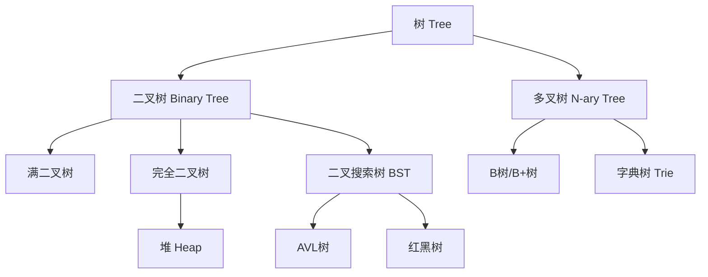

# 08.二叉树的操作实践
#### 目录介绍
- [01.二叉树由来和设计](#01二叉树由来和设计)
  - [1.1 疑惑：为什么需要树结构](#11-疑惑为什么需要树结构)
  - [1.2 从线性到非线性的演变](#12-从线性到非线性的演变)
  - [1.3 树结构的核心优势](#13-树结构的核心优势)
  - [1.4 树的基本术语定义](#14-树的基本术语定义)
  - [1.5 树结构的分类体系](#15-树结构的分类体系)
- [02.二叉树核心原理](#02二叉树核心原理)
  - [2.1 二叉树的定义与性质](#21-二叉树的定义与性质)
  - [2.2 满二叉树与完全二叉树](#22-满二叉树与完全二叉树)
  - [2.3 二叉树的存储方式](#23-二叉树的存储方式)
  - [2.4 链式存储的节点设计](#24-链式存储的节点设计)
  - [2.5 顺序存储与编号规律](#25-顺序存储与编号规律)
- [03.二叉树的遍历算法](#03二叉树的遍历算法)
  - [3.1 疑惑：为什么遍历有多种方式](#31-疑惑为什么遍历有多种方式)
  - [3.2 前序遍历（根左右）](#32-前序遍历根左右)
  - [3.3 中序遍历（左根右）](#33-中序遍历左根右)
  - [3.4 后序遍历（左右根）](#34-后序遍历左右根)
  - [3.5 层序遍历（BFS）](#35-层序遍历bfs)
  - [3.6 遍历的递归与迭代实现](#36-遍历的递归与迭代实现)
  - [3.7 遍历方式的选择策略](#37-遍历方式的选择策略)
- [04.二叉搜索树（BST）](#04二叉搜索树bst)
  - [4.1 疑惑：如何高效查找数据](#41-疑惑如何高效查找数据)
  - [4.2 BST的定义与核心性质](#42-bst的定义与核心性质)
  - [4.3 查找操作的设计](#43-查找操作的设计)
  - [4.4 插入操作的设计](#44-插入操作的设计)
  - [4.5 删除操作的设计](#45-删除操作的设计)
  - [4.6 BST的退化问题](#46-bst的退化问题)
- [05.平衡二叉树（AVL）](#05平衡二叉树avl)
  - [5.1 疑惑：BST退化怎么办](#51-疑惑bst退化怎么办)
  - [5.2 AVL树的平衡因子](#52-avl树的平衡因子)
  - [5.3 四种旋转操作](#53-四种旋转操作)
  - [5.4 插入后的再平衡](#54-插入后的再平衡)
  - [5.5 AVL树的性能分析](#55-avl树的性能分析)
- [06.堆与优先队列](#06堆与优先队列)
  - [6.1 堆的定义与性质](#61-堆的定义与性质)
  - [6.2 大顶堆与小顶堆](#62-大顶堆与小顶堆)
  - [6.3 堆的插入（上浮）](#63-堆的插入上浮)
  - [6.4 堆的删除（下沉）](#64-堆的删除下沉)
  - [6.5 堆排序算法](#65-堆排序算法)
  - [6.6 优先队列的工业实现](#66-优先队列的工业实现)
- [07.二叉树的实际应用](#07二叉树的实际应用)
  - [7.1 文件系统的树形结构](#71-文件系统的树形结构)
  - [7.2 数据库索引（B树/B+树简介）](#72-数据库索引b树b树简介)
  - [7.3 哈夫曼编码与数据压缩](#73-哈夫曼编码与数据压缩)
  - [7.4 表达式树](#74-表达式树)
  - [7.5 二叉树经典面试题](#75-二叉树经典面试题)


## 01.二叉树由来和设计

### 1.1 疑惑：为什么需要树结构

我们已经学过数组和链表这两种线性数据结构。数组随机访问快但插入删除慢，链表插入删除快但随机访问慢。有没有一种数据结构能同时兼顾查找和修改的效率？

**核心矛盾**：线性结构只能在"快速访问"和"快速修改"之间做权衡，无法同时满足。

| 操作 | 有序数组 | 链表 | 理想结构 |
|------|---------|------|---------|
| 查找 | O(log N) 二分查找 | O(N) | O(log N) |
| 插入 | O(N) 需要搬移 | O(1) 找到位置后 | O(log N) |
| 删除 | O(N) 需要搬移 | O(1) 找到位置后 | O(log N) |

**答疑**：树结构正是为了解决这个矛盾而诞生的。通过"分层"的思想，树结构可以在查找、插入、删除操作上都达到 O(log N) 的时间复杂度。

### 1.2 从线性到非线性的演变

数据结构的发展遵循一个清晰的脉络：

```
集合 → 线性结构 → 树形结构 → 图结构
 ↑       ↑          ↑          ↑
无关系  一对一     一对多     多对多
```

**线性结构的局限**：现实世界中很多关系并非线性的。比如公司的组织架构、文件系统的目录层级、网页的DOM结构——这些都是"一对多"的关系，用线性结构无法自然表达。

**树结构的本质**：树是一种**分层**的数据组织方式。每个节点可以有多个子节点，形成了自然的层次关系。这种层次关系带来的核心优势是——**每次决策可以排除一半（或更多）的数据**，这就是树结构效率的根源。

**论证——生活中的树结构类比**：

想象你在图书馆找一本书。你不会从第一个书架开始逐本翻找（线性查找），而是：
1. 先确定是哪个楼层（人文/理工/...）
2. 再确定哪个区域（计算机/物理/...）
3. 再确定哪个书架（数据结构/操作系统/...）
4. 最后在书架上定位

每一步都将搜索范围缩小了一个数量级。这就是树结构的核心思想——**层层过滤，逐步缩小范围**。

### 1.3 树结构的核心优势

1. **高效的查找**：二叉搜索树的查找时间复杂度为 O(log N)
2. **高效的插入/删除**：不需要像数组那样搬移大量数据
3. **天然的层次关系**：能自然表达一对多的关系
4. **递归的天然载体**：树的定义本身就是递归的（节点+子树）

### 1.4 树的基本术语定义

```
        A          ← 根节点（root），深度=0，高度=3
       / \
      B   C        ← B是A的子节点，A是B的父节点
     / \   \
    D   E   F      ← D、E是兄弟节点（sibling）
   /
  G                ← 叶子节点（leaf），没有子节点
```

| 术语 | 定义 | 上图示例 |
|------|------|---------|
| **根节点** | 没有父节点的节点 | A |
| **叶子节点** | 没有子节点的节点 | E、F、G |
| **父/子节点** | 直接连接的上下关系 | A是B的父节点 |
| **兄弟节点** | 同一个父节点的节点 | D和E |
| **节点的度** | 子节点的个数 | A的度=2 |
| **树的深度** | 根到该节点的边数 | G的深度=3 |
| **树的高度** | 该节点到最远叶子的边数 | A的高度=3 |
| **层** | 根为第0层(或第1层) | G在第3层 |
| **子树** | 以某节点为根的子集 | 以B为根的子树含B,D,E,G |

**注意**：深度从上往下计算（根到该节点），高度从下往上计算（该节点到最远叶子）。

### 1.5 树结构的分类体系



本文重点讲解二叉树，红黑树将在下一篇中深入分析。


## 02.二叉树核心原理

### 2.1 二叉树的定义与性质

**定义**：二叉树是每个节点最多有两个子节点的树，分别称为**左子节点**和**右子节点**。

**疑惑**：为什么"最多两个子节点"这个限制如此重要？为什么不是三叉树、四叉树？

**答疑**：二叉树的"二"是核心。二分（binary）是计算中最基本的决策——是/否、左/右、0/1。每次二分决策可以排除一半数据，N个数据最多需要 log₂N 次决策。这是信息论的基本原理：二分查找是比较操作下的**最优策略**。

**二叉树的数学性质**：

| 性质 | 公式 | 说明 |
|------|------|------|
| 第i层最多节点数 | 2^i | 第0层1个，第1层2个，第2层4个... |
| 深度为h的最多节点数 | 2^(h+1) - 1 | 满二叉树的节点数 |
| 叶子数与度2节点数 | n₀ = n₂ + 1 | 叶子节点数 = 度为2的节点数 + 1 |
| N个节点的最小高度 | ⌊log₂N⌋ | 完全二叉树的高度 |
| N个节点的最大高度 | N - 1 | 退化为链表 |

**性质 n₀ = n₂ + 1 的证明**：

设二叉树有 n₀ 个叶子节点（度为0），n₁ 个度为1的节点，n₂ 个度为2的节点。
- 总节点数：n = n₀ + n₁ + n₂
- 总边数：n - 1 = n₁ + 2·n₂（每个度1节点贡献1条边，度2节点贡献2条边）
- 联立：n₀ + n₁ + n₂ - 1 = n₁ + 2·n₂
- 化简：n₀ = n₂ + 1

### 2.2 满二叉树与完全二叉树

**满二叉树（Full/Perfect Binary Tree）**：每一层的节点数都达到最大值。深度为h的满二叉树有 2^(h+1) - 1 个节点。

```
满二叉树（深度2）：         非满二叉树：
        1                      1
       / \                    / \
      2   3                  2   3
     / \ / \                / \
    4  5 6  7              4   5
```

**完全二叉树（Complete Binary Tree）**：除了最后一层外，每一层都是满的，且最后一层的节点从左到右连续排列。

```
完全二叉树：               非完全二叉树：
        1                      1
       / \                    / \
      2   3                  2   3
     / \  /                 / \   \
    4  5 6                 4   5   7   ← 最后一层不连续
```

**疑惑**：完全二叉树为什么要求"最后一层从左到右连续"这么奇怪的条件？

**答疑**：这个条件使得完全二叉树可以用**数组**高效存储。如果节点编号从1开始：
- 节点 i 的左子节点 = 2i
- 节点 i 的右子节点 = 2i + 1
- 节点 i 的父节点 = i / 2（向下取整）

如果最后一层不连续，数组中会出现"空洞"，浪费空间且破坏编号规律。堆（Heap）正是利用这个性质用数组实现的。

### 2.3 二叉树的存储方式

**方式一：链式存储**

每个节点包含数据域和两个指针域（指向左右子节点）。

```
节点结构：
┌──────┬──────┬──────┐
│ left  │ data │ right│
└──┬───┴──────┴───┬──┘
   ↓              ↓
  左子树         右子树
```

**方式二：顺序存储（数组）**

用数组按层序存储，利用下标关系表示父子关系。

```
树结构：            数组存储（下标从1开始）：
      A            [_, A, B, C, D, E, F]
     / \            0  1  2  3  4  5  6
    B   C
   / \ /
  D  E F
```

| 存储方式 | 优势 | 劣势 | 适用场景 |
|---------|------|------|---------|
| 链式存储 | 灵活，不浪费空间 | 需要额外指针空间 | 一般二叉树、BST |
| 顺序存储 | 无指针开销，缓存友好 | 非完全树浪费空间 | 完全二叉树、堆 |

### 2.4 链式存储的节点设计

**Python实现**：

```python
class TreeNode:
    def __init__(self, val=0, left=None, right=None):
        self.val = val
        self.left = left
        self.right = right
```

**C语言实现**：

```c
typedef struct TreeNode {
    int val;
    struct TreeNode* left;
    struct TreeNode* right;
} TreeNode;

TreeNode* createNode(int val) {
    TreeNode* node = (TreeNode*)malloc(sizeof(TreeNode));
    node->val = val;
    node->left = NULL;
    node->right = NULL;
    return node;
}
```

**Java实现**：

```java
public class TreeNode {
    int val;
    TreeNode left;
    TreeNode right;
    
    public TreeNode(int val) {
        this.val = val;
    }
}
```

**Go实现**：

```go
type TreeNode struct {
    Val   int
    Left  *TreeNode
    Right *TreeNode
}
```

### 2.5 顺序存储与编号规律

对于完全二叉树，用数组存储是最优方案。编号从1开始（0号位置空置或用哨兵）：

```
下标:   1    2    3    4    5    6    7
节点:  [50] [30] [70] [20] [40] [60] [80]

对应的树：
           50(1)
          /      \
       30(2)    70(3)
       / \      / \
    20(4) 40(5) 60(6) 80(7)
```

**编号规律**（下标从1开始）：

```python
def parent(i):    return i // 2
def left(i):      return 2 * i
def right(i):     return 2 * i + 1
def is_leaf(i, n): return left(i) > n  # n为总节点数
```

**编号规律**（下标从0开始）：

```python
def parent(i):    return (i - 1) // 2
def left(i):      return 2 * i + 1
def right(i):     return 2 * i + 2
```

**论证——为什么堆用数组而不用链表**：
1. 堆是完全二叉树，数组存储无空间浪费
2. 数组的内存连续，CPU缓存命中率高
3. 通过下标计算父子关系，比维护指针更高效
4. 堆操作（上浮/下沉）主要是"沿着路径"操作，数组按下标跳转比指针跳转快


## 03.二叉树的遍历算法

### 3.1 疑惑：为什么遍历有多种方式

线性结构（数组、链表）的遍历只有一种自然方式——从头到尾。但树是非线性结构，从根节点出发，面临"先访问左子树还是右子树"的选择。不同的选择产生了不同的遍历序列，适用于不同的场景。

**四种基本遍历**：

```
        1
       / \
      2   3
     / \ / \
    4  5 6  7

前序（根左右）: 1 2 4 5 3 6 7    → 先处理自身，再处理子问题
中序（左根右）: 4 2 5 1 6 3 7    → 对BST来说是有序序列
后序（左右根）: 4 5 2 6 7 3 1    → 先处理子问题，再汇总
层序（逐层）:   1 2 3 4 5 6 7    → 按距离根节点的远近处理
```

### 3.2 前序遍历（根左右）

**定义**：先访问根节点，再递归遍历左子树，最后递归遍历右子树。

**递归实现**（简洁直观）：

```python
def preorder(root):
    if root is None:
        return
    print(root.val)        # 访问根
    preorder(root.left)    # 遍历左子树
    preorder(root.right)   # 遍历右子树
```

**迭代实现**（用显式栈模拟递归）：

```python
def preorder_iterative(root):
    if root is None:
        return []
    result = []
    stack = [root]
    while stack:
        node = stack.pop()
        result.append(node.val)
        # 先压右再压左，出栈时就是先左后右
        if node.right:
            stack.append(node.right)
        if node.left:
            stack.append(node.left)
    return result
```

**C语言迭代实现**：

```c
void preorder_iterative(TreeNode* root) {
    if (root == NULL) return;
    
    TreeNode* stack[1000];
    int top = -1;
    stack[++top] = root;
    
    while (top >= 0) {
        TreeNode* node = stack[top--];
        printf("%d ", node->val);
        if (node->right) stack[++top] = node->right;
        if (node->left)  stack[++top] = node->left;
    }
}
```

**应用场景**：序列化/反序列化二叉树、复制二叉树、生成前缀表达式。

### 3.3 中序遍历（左根右）

**定义**：先递归遍历左子树，再访问根节点，最后递归遍历右子树。

**递归实现**：

```python
def inorder(root):
    if root is None:
        return
    inorder(root.left)     # 遍历左子树
    print(root.val)        # 访问根
    inorder(root.right)    # 遍历右子树
```

**迭代实现**（关键思路：一路向左压栈，弹出时访问并转向右子树）：

```python
def inorder_iterative(root):
    result = []
    stack = []
    current = root
    while current or stack:
        # 一路向左，把沿途节点都压入栈
        while current:
            stack.append(current)
            current = current.left
        # 弹出栈顶（最左的节点）
        current = stack.pop()
        result.append(current.val)
        # 转向右子树
        current = current.right
    return result
```

**核心性质**：对于**二叉搜索树**，中序遍历得到的序列是**有序**的。这是BST最重要的性质之一。

```
BST：         中序遍历结果：
      50      → [20, 30, 40, 50, 60, 70, 80]
     / \        有序！
   30   70
   / \ / \
  20 40 60 80
```

**应用场景**：BST的有序遍历、检验BST是否合法、查找BST中第K小的元素。

### 3.4 后序遍历（左右根）

**定义**：先递归遍历左子树，再递归遍历右子树，最后访问根节点。

**递归实现**：

```python
def postorder(root):
    if root is None:
        return
    postorder(root.left)   # 遍历左子树
    postorder(root.right)  # 遍历右子树
    print(root.val)        # 访问根
```

**迭代实现**（巧妙方法：前序的镜像翻转）：

```python
def postorder_iterative(root):
    """
    前序是 根→左→右
    修改为 根→右→左，再反转得到 左→右→根（后序）
    """
    if root is None:
        return []
    result = []
    stack = [root]
    while stack:
        node = stack.pop()
        result.append(node.val)
        if node.left:           # 先压左
            stack.append(node.left)
        if node.right:          # 再压右
            stack.append(node.right)
    return result[::-1]         # 反转
```

**应用场景**：计算目录大小（先算子目录）、释放树的内存（先释放子节点）、后缀表达式求值。

### 3.5 层序遍历（BFS）

**定义**：按层从上到下、从左到右依次访问。

**实现**（使用队列）：

```python
from collections import deque

def level_order(root):
    if root is None:
        return []
    result = []
    queue = deque([root])
    while queue:
        level_size = len(queue)
        level = []
        for _ in range(level_size):
            node = queue.popleft()
            level.append(node.val)
            if node.left:
                queue.append(node.left)
            if node.right:
                queue.append(node.right)
        result.append(level)
    return result
```

**Java实现**：

```java
public List<List<Integer>> levelOrder(TreeNode root) {
    List<List<Integer>> result = new ArrayList<>();
    if (root == null) return result;
    
    Queue<TreeNode> queue = new LinkedList<>();
    queue.offer(root);
    
    while (!queue.isEmpty()) {
        int size = queue.size();
        List<Integer> level = new ArrayList<>();
        for (int i = 0; i < size; i++) {
            TreeNode node = queue.poll();
            level.add(node.val);
            if (node.left != null) queue.offer(node.left);
            if (node.right != null) queue.offer(node.right);
        }
        result.add(level);
    }
    return result;
}
```

**层序遍历结果**：

```
输入：       1
           / \
          2   3
         / \ / \
        4  5 6  7

输出：[[1], [2, 3], [4, 5, 6, 7]]
```

**应用场景**：求树的最大/最小深度、判断完全二叉树、序列化、最短路径问题。

### 3.6 遍历的递归与迭代实现

**疑惑**：递归实现简洁明了，为什么还需要迭代实现？

**答疑**：
1. **栈溢出风险**：递归使用系统调用栈，深度过大（如10万层的倾斜树）会栈溢出
2. **性能**：递归有函数调用的开销（参数传递、栈帧分配）；迭代用显式栈更可控
3. **面试要求**：理解迭代实现意味着真正理解了遍历的本质

**统一迭代框架**（Morris遍历——O(1)空间复杂度）：

```python
def morris_inorder(root):
    """
    Morris遍历的核心思想：利用叶子节点的空指针（线索化），
    不用栈也不用递归就能完成遍历。
    时间O(N)，空间O(1)。
    """
    result = []
    current = root
    while current:
        if current.left is None:
            result.append(current.val)
            current = current.right
        else:
            # 找到当前节点的前驱（左子树的最右节点）
            predecessor = current.left
            while predecessor.right and predecessor.right != current:
                predecessor = predecessor.right
            
            if predecessor.right is None:
                # 建立线索：前驱的右指针指向当前节点
                predecessor.right = current
                current = current.left
            else:
                # 删除线索：已经回来了，恢复树结构
                predecessor.right = None
                result.append(current.val)
                current = current.right
    return result
```

### 3.7 遍历方式的选择策略

| 遍历方式 | 本质思想 | 典型应用 | 时间/空间 |
|---------|---------|---------|----------|
| 前序 | 先处理自身 | 序列化、复制树 | O(N) / O(H) |
| 中序 | 左-根-右 | BST有序遍历 | O(N) / O(H) |
| 后序 | 先处理子问题 | 释放内存、算目录大小 | O(N) / O(H) |
| 层序 | 按距离处理 | 求深度、最短路径 | O(N) / O(W) |

其中 H 是树的高度，W 是树的最大宽度。


## 04.二叉搜索树（BST）

### 4.1 疑惑：如何高效查找数据

已知有一组数据 [20, 30, 40, 50, 60, 70, 80]，如何组织它们使得查找效率最高？

- **无序数组**：查找 O(N)
- **有序数组 + 二分查找**：查找 O(log N)，但插入 O(N)
- **链表**：插入 O(1)，但查找 O(N)

有没有一种结构能把二分查找的思想和链表的灵活性结合起来？

**答疑**：二叉搜索树！BST的结构本质上就是二分查找的"固化"——把每次二分的"中间元素"作为节点，左边的元素构成左子树，右边的元素构成右子树。

### 4.2 BST的定义与核心性质

**定义**：二叉搜索树（Binary Search Tree）满足以下性质：
1. 左子树所有节点的值 **<** 根节点的值
2. 右子树所有节点的值 **>** 根节点的值
3. 左右子树本身也是BST（递归定义）

```
有序数组 [20, 30, 40, 50, 60, 70, 80] 构建的BST：

           50
          /    \
        30      70
       /  \    /  \
      20   40 60   80
```

**核心性质**：
- 中序遍历结果是**有序**的
- 查找/插入/删除的时间复杂度与树的高度成正比：O(H)
- 理想情况下 H = log₂N，最差情况下 H = N - 1

### 4.3 查找操作的设计

**思路**：从根节点开始，利用BST的有序性进行二分决策。

```python
def search(root, target):
    """
    在BST中查找target
    - 等于根节点：找到了
    - 小于根节点：到左子树找
    - 大于根节点：到右子树找
    """
    if root is None:
        return None
    if target == root.val:
        return root
    elif target < root.val:
        return search(root.left, target)
    else:
        return search(root.right, target)
```

**迭代版本**（更高效，无递归开销）：

```python
def search_iterative(root, target):
    current = root
    while current:
        if target == current.val:
            return current
        elif target < current.val:
            current = current.left
        else:
            current = current.right
    return None
```

```c
TreeNode* search(TreeNode* root, int target) {
    TreeNode* current = root;
    while (current != NULL) {
        if (target == current->val) return current;
        else if (target < current->val) current = current->left;
        else current = current->right;
    }
    return NULL;
}
```

### 4.4 插入操作的设计

**思路**：查找目标位置，找到合适的空位后插入新节点。

```python
def insert(root, val):
    if root is None:
        return TreeNode(val)
    if val < root.val:
        root.left = insert(root.left, val)
    elif val > root.val:
        root.right = insert(root.right, val)
    # val == root.val 时不插入（不允许重复）
    return root
```

**插入过程示例**：

```
插入 35 到BST中：

      50              50
     / \     →       / \
   30   70         30   70
   / \            / \
  20  40         20  40
                    /
                   35  ← 新插入
```

BST插入永远是在叶子位置，不需要移动其他节点——这是相比有序数组的巨大优势。

### 4.5 删除操作的设计

删除操作是BST中最复杂的操作，需要分三种情况：

**情况一：删除叶子节点** —— 直接删除

```
删除 20：
      50              50
     / \     →       / \
   30   70         30   70
   / \              \
  20  40             40
```

**情况二：删除只有一个子节点的节点** —— 用子节点替代

```
删除 30（只有右子节点40）：
      50              50
     / \     →       / \
   30   70         40   70
    \
     40
```

**情况三：删除有两个子节点的节点** —— 用中序后继（或前驱）替代

```
删除 50：
      50              60          ← 用中序后继60替代50
     / \     →       / \
   30   70         30   70
       / \              \
      60  80             80
```

**完整实现**：

```python
def delete(root, key):
    if root is None:
        return None
    
    if key < root.val:
        root.left = delete(root.left, key)
    elif key > root.val:
        root.right = delete(root.right, key)
    else:
        # 找到要删除的节点
        if root.left is None:
            return root.right       # 情况1&2：无左子树
        if root.right is None:
            return root.left        # 情况2：无右子树
        
        # 情况3：有两个子节点，找中序后继（右子树最小值）
        successor = root.right
        while successor.left:
            successor = successor.left
        root.val = successor.val                      # 替换值
        root.right = delete(root.right, successor.val) # 删除后继
    
    return root
```

### 4.6 BST的退化问题

**疑惑**：BST看起来很完美，为什么实际工程中很少直接使用BST？

**论证**：BST的性能严重依赖于树的形状。如果按有序序列插入，BST会退化为链表：

```
依次插入 10, 20, 30, 40, 50：

10                    理想BST：
  \                      30
   20                   / \
     \                 10  40
      30                \   \
        \               20  50
         40
           \        高度=2，查找O(log N)
            50

高度=4，查找O(N)
```

**结果**：退化后的BST，查找、插入、删除都变成O(N)，和链表没有区别。

**技术演变**：
1. BST → 发现退化问题
2. AVL树 → 通过旋转保持严格平衡，但旋转次数多
3. 红黑树 → 放宽平衡条件，减少旋转次数（工业级方案）
4. B树/B+树 → 多路搜索树，适合磁盘IO（数据库索引）


## 05.平衡二叉树（AVL）

### 5.1 疑惑：BST退化怎么办

BST在最坏情况下退化为链表，时间复杂度从O(log N)变为O(N)。能不能在每次插入/删除后自动调整，保持树的"平衡"？

```
BST退化的典型场景：按有序序列 [1, 2, 3, 4, 5] 插入

      1                     理想情况（随机插入）：
       \                        3
        2                      / \
         \                    1   4
          3                    \   \
           \                    2   5
            4
             \               高度 = 2，查找O(log N)
              5
高度 = 4，查找退化为O(N)
```

**答疑**：AVL树（Adelson-Velsky and Landis，1962年发明）是最早的自平衡二叉搜索树。它通过**旋转操作**在每次修改后保持平衡。

**核心思想**：在每次插入/删除后，检查所有祖先节点的平衡因子。如果发现任何节点的平衡因子绝对值 > 1，就通过旋转恢复平衡。

### 5.2 AVL树的平衡因子

**平衡因子（Balance Factor）**：左子树高度 - 右子树高度

**AVL的平衡条件**：每个节点的平衡因子只能是 -1、0 或 1。

```
平衡的AVL树：          不平衡（平衡因子=2）：
      30(0)                  30(2)
     /    \                 /
   20(-1)  40(0)          20(1)
     \                   /
      25(0)            10(0)
```

### 5.3 四种旋转操作

当插入/删除导致某个节点的平衡因子变为 ±2 时，需要通过旋转恢复平衡。

**LL型（左左）—— 右旋**：

新节点插入到失衡节点的**左子树的左子树**。

```
失衡：            右旋后：
    30(2)          20(0)
   /              /    \
  20(1)         10(0)  30(0)
 /
10(0)
```

```python
def right_rotate(z):
    y = z.left
    T3 = y.right
    
    y.right = z
    z.left = T3
    
    # 更新高度
    z.height = 1 + max(height(z.left), height(z.right))
    y.height = 1 + max(height(y.left), height(y.right))
    
    return y  # y成为新的根
```

**RR型（右右）—— 左旋**：

新节点插入到失衡节点的**右子树的右子树**。

```
失衡：            左旋后：
10(-2)             20(0)
  \               /    \
  20(-1)        10(0)  30(0)
    \
    30(0)
```

```python
def left_rotate(z):
    y = z.right
    T2 = y.left
    
    y.left = z
    z.right = T2
    
    z.height = 1 + max(height(z.left), height(z.right))
    y.height = 1 + max(height(y.left), height(y.right))
    
    return y
```

**LR型（左右）—— 先左旋再右旋**：

```
失衡：          左旋左子树：       右旋根：
    30(2)          30(2)          25(0)
   /              /              /    \
  10(-1)        25(1)          10(0)  30(0)
    \           /
    25(0)     10(0)
```

**RL型（右左）—— 先右旋再左旋**：

```
失衡：          右旋右子树：       左旋根：
  10(-2)        10(-2)            15(0)
    \              \              /    \
    30(1)         15(-1)       10(0)  30(0)
   /                \
  15(0)             30(0)
```

### 5.4 插入后的再平衡

```python
def insert_avl(root, val):
    # 1. 标准BST插入
    if root is None:
        return TreeNode(val)
    if val < root.val:
        root.left = insert_avl(root.left, val)
    elif val > root.val:
        root.right = insert_avl(root.right, val)
    else:
        return root  # 不允许重复
    
    # 2. 更新高度
    root.height = 1 + max(height(root.left), height(root.right))
    
    # 3. 计算平衡因子
    balance = get_balance(root)
    
    # 4. 四种失衡情况
    if balance > 1 and val < root.left.val:       # LL
        return right_rotate(root)
    if balance < -1 and val > root.right.val:      # RR
        return left_rotate(root)
    if balance > 1 and val > root.left.val:        # LR
        root.left = left_rotate(root.left)
        return right_rotate(root)
    if balance < -1 and val < root.right.val:      # RL
        root.right = right_rotate(root.right)
        return left_rotate(root)
    
    return root
```

### 5.5 AVL树的性能分析

| 操作 | 时间复杂度 | 说明 |
|------|-----------|------|
| 查找 | O(log N) | 严格平衡，高度 ≤ 1.44·log₂(N+2) |
| 插入 | O(log N) | 最多需要1次旋转（单旋或双旋） |
| 删除 | O(log N) | 可能需要O(log N)次旋转 |

**AVL vs 红黑树**：

| 特性 | AVL树 | 红黑树 |
|------|-------|--------|
| 平衡条件 | 严格（因子≤1） | 宽松（黑高相等） |
| 查找性能 | 略优 | 略差 |
| 插入/删除 | 旋转较多 | 旋转较少（最多3次） |
| 适用场景 | 查找密集型 | 插入/删除密集型 |
| 工业应用 | 数据库部分场景 | Java TreeMap, Linux CFS |

AVL树因为平衡条件过于严格，插入/删除时需要频繁旋转，在实际工程中使用较少。红黑树以更宽松的平衡条件换取了更少的旋转次数，成为工业级首选——详见下一篇。


## 06.堆与优先队列

### 6.1 堆的定义与性质

**堆（Heap）** 是一种特殊的**完全二叉树**，满足堆序性质：
- **大顶堆（Max-Heap）**：每个节点的值 ≥ 其子节点的值
- **小顶堆（Min-Heap）**：每个节点的值 ≤ 其子节点的值

```
大顶堆：              小顶堆：
      90                  10
     /  \                /  \
   70    80            20    30
  / \   /             / \   /
 50 60 40            50 40 70
```

**关键性质**：
1. 堆顶元素总是最大（大顶堆）或最小（小顶堆）
2. 是完全二叉树，可以用数组高效存储
3. 插入和删除堆顶的时间复杂度都是 O(log N)

### 6.2 大顶堆与小顶堆

| 操作 | 大顶堆 | 小顶堆 |
|------|--------|--------|
| 获取最大值 | O(1) | O(N) |
| 获取最小值 | O(N) | O(1) |
| 典型应用 | Top-K最大、优先级调度 | Top-K最小、Dijkstra |

### 6.3 堆的插入（上浮 / Sift Up）

**步骤**：
1. 将新元素放到数组末尾（完全二叉树的最后一个位置）
2. 与父节点比较，如果违反堆序性质就交换
3. 重复直到满足堆序性质或到达根节点

```
插入 85 到大顶堆：

Step 1: 放到末尾        Step 2: 上浮（85>60）    Step 3: 上浮（85>70）
      90                      90                      90
     /  \                    /  \                    /  \
   70    80        →       70    80        →       85    80
  / \   / \               / \   / \               / \   / \
 50 60 40 85             50 85 40 60             50 70 40 60

数组: [90,70,80,50,60,40,85] → [90,70,80,50,85,40,60] → [90,85,80,50,70,40,60]
```

```python
def heap_insert(heap, val):
    heap.append(val)
    # 上浮
    i = len(heap) - 1
    while i > 0:
        parent = (i - 1) // 2
        if heap[i] > heap[parent]:  # 大顶堆
            heap[i], heap[parent] = heap[parent], heap[i]
            i = parent
        else:
            break
```

### 6.4 堆的删除（下沉 / Sift Down）

**删除堆顶**的步骤：
1. 用数组末尾元素替代堆顶
2. 删除末尾元素
3. 将新堆顶与子节点中较大（大顶堆）的比较，如果违反堆序性质就交换
4. 重复直到满足堆序性质或到达叶子

```python
def heap_pop(heap):
    if not heap:
        return None
    top = heap[0]
    heap[0] = heap[-1]
    heap.pop()
    # 下沉
    i = 0
    n = len(heap)
    while True:
        left = 2 * i + 1
        right = 2 * i + 2
        largest = i
        if left < n and heap[left] > heap[largest]:
            largest = left
        if right < n and heap[right] > heap[largest]:
            largest = right
        if largest != i:
            heap[i], heap[largest] = heap[largest], heap[i]
            i = largest
        else:
            break
    return top
```

### 6.5 堆排序算法

**思路**：
1. 建堆：将无序数组构建为大顶堆 —— O(N)
2. 排序：反复取出堆顶（最大值）放到末尾 —— O(N log N)

```python
def heap_sort(arr):
    n = len(arr)
    
    # 1. 建堆（从最后一个非叶子节点开始下沉）
    for i in range(n // 2 - 1, -1, -1):
        sift_down(arr, n, i)
    
    # 2. 排序（交换堆顶和末尾，缩小堆范围，下沉）
    for i in range(n - 1, 0, -1):
        arr[0], arr[i] = arr[i], arr[0]
        sift_down(arr, i, 0)

def sift_down(arr, n, i):
    while True:
        left = 2 * i + 1
        right = 2 * i + 2
        largest = i
        if left < n and arr[left] > arr[largest]:
            largest = left
        if right < n and arr[right] > arr[largest]:
            largest = right
        if largest != i:
            arr[i], arr[largest] = arr[largest], arr[i]
            i = largest
        else:
            break
```

**建堆为什么是O(N)而不是O(N log N)**？

直觉上似乎是 N 个元素各下沉 O(log N)，但实际上：
- 叶子节点（N/2个）不需要下沉
- 倒数第二层（N/4个）最多下沉1次
- 倒数第三层（N/8个）最多下沉2次
- ...
- 总次数 = N/4·1 + N/8·2 + N/16·3 + ... = O(N)

### 6.6 优先队列的工业实现

**优先队列（Priority Queue）** 是堆的主要应用，提供"总是取出优先级最高的元素"的能力。

**Java中的PriorityQueue**：

```java
// 小顶堆（默认）
PriorityQueue<Integer> minHeap = new PriorityQueue<>();
minHeap.offer(30);
minHeap.offer(10);
minHeap.offer(20);
System.out.println(minHeap.poll()); // 输出 10

// 大顶堆
PriorityQueue<Integer> maxHeap = new PriorityQueue<>(Collections.reverseOrder());

// 自定义比较器
PriorityQueue<int[]> pq = new PriorityQueue<>((a, b) -> a[1] - b[1]);
```

**Python中的heapq**：

```python
import heapq

# 小顶堆
heap = []
heapq.heappush(heap, 30)
heapq.heappush(heap, 10)
heapq.heappush(heap, 20)
print(heapq.heappop(heap))  # 输出 10

# 大顶堆（取负数技巧）
max_heap = []
heapq.heappush(max_heap, -30)
print(-heapq.heappop(max_heap))  # 输出 30
```

**典型应用**：
- 操作系统进程调度
- Dijkstra最短路径算法
- 合并K个有序链表
- Top-K问题
- 中位数维护（大顶堆+小顶堆）


## 07.二叉树的实际应用

### 7.1 文件系统的树形结构

文件系统本质上是一棵多叉树：

```
/
├── home/
│   ├── user1/
│   │   ├── documents/
│   │   └── pictures/
│   └── user2/
├── etc/
│   └── config/
└── var/
    └── log/
```

计算目录大小就是**后序遍历**——先算出所有子目录的大小，再加上当前目录自身文件的大小。

### 7.2 数据库索引（B树/B+树简介）

**疑惑**：数据库为什么不用二叉搜索树做索引？

**答疑**：磁盘IO的特性决定了二叉树不适合。

磁盘每次读取一个**页（Page）**，通常4KB。二叉树每个节点只存一个key，树的高度高，需要更多次磁盘IO。

**B树**：每个节点可以存储多个key（如100个），树的高度大幅降低。存储1亿数据，二叉树高度约27层，B树（阶=100）高度约4层。

**B+树**（MySQL InnoDB使用）：
- 非叶子节点只存索引，不存数据
- 叶子节点存所有数据，并用链表串联
- 范围查询极高效（沿叶子链表扫描即可）

```
B+树结构示意：
           [30 | 70]               非叶子节点（只有索引）
          /    |    \
    [10|20] [40|50|60] [80|90]     叶子节点（存数据）
       →        →         →       叶子间有链表
```

### 7.3 哈夫曼编码与数据压缩

**哈夫曼树（Huffman Tree）** 是一种带权路径长度最短的二叉树，用于数据压缩。

**原理**：出现频率高的字符用短编码，频率低的用长编码。

```
字符频率：A=45, B=13, C=12, D=16, E=9, F=5

构建哈夫曼树：
              100
             /    \
           45(A)   55
                  /    \
                25      30
               / \     / \
             12(C) 13(B) 14   16(D)
                        / \
                      5(F) 9(E)

编码结果：
A = 0         (1位)
B = 101       (3位)
C = 100       (3位)
D = 111       (3位)
E = 1101      (4位)
F = 1100      (4位)
```

**结果**：比定长编码（每个字符3位）节省了约25%的空间。ZIP、JPEG等都使用了哈夫曼编码。

### 7.4 表达式树

数学表达式可以用二叉树表示：

```
表达式: (3 + 4) × 5

表达式树：
        ×
       / \
      +   5
     / \
    3   4

前序遍历（前缀表达式）: × + 3 4 5
中序遍历（中缀表达式）: 3 + 4 × 5（需要括号）
后序遍历（后缀表达式）: 3 4 + 5 ×
```

编译器在解析表达式时，会将中缀表达式转换为表达式树，再通过后序遍历生成逆波兰表达式（后缀表达式），从而避免括号问题。

### 7.5 二叉树经典面试题

**1. 求二叉树的最大深度**：

```python
def max_depth(root):
    if root is None:
        return 0
    return 1 + max(max_depth(root.left), max_depth(root.right))
```

**2. 判断是否对称二叉树**：

```python
def is_symmetric(root):
    def check(left, right):
        if not left and not right:
            return True
        if not left or not right:
            return False
        return (left.val == right.val and 
                check(left.left, right.right) and 
                check(left.right, right.left))
    return check(root, root) if root else True
```

**3. 翻转二叉树**：

```python
def invert_tree(root):
    if root is None:
        return None
    root.left, root.right = root.right, root.left
    invert_tree(root.left)
    invert_tree(root.right)
    return root
```

**4. 判断是否为BST**：

```python
def is_valid_bst(root, min_val=float('-inf'), max_val=float('inf')):
    if root is None:
        return True
    if root.val <= min_val or root.val >= max_val:
        return False
    return (is_valid_bst(root.left, min_val, root.val) and 
            is_valid_bst(root.right, root.val, max_val))
```

**5. 最近公共祖先（LCA）**：

```python
def lowest_common_ancestor(root, p, q):
    if root is None or root == p or root == q:
        return root
    left = lowest_common_ancestor(root.left, p, q)
    right = lowest_common_ancestor(root.right, p, q)
    if left and right:
        return root      # p和q分别在左右子树，root就是LCA
    return left or right  # 都在同一侧
```

**6. 从前序和中序遍历构造二叉树**：

```python
def build_tree(preorder, inorder):
    if not preorder:
        return None
    root_val = preorder[0]
    root = TreeNode(root_val)
    mid = inorder.index(root_val)
    root.left = build_tree(preorder[1:mid+1], inorder[:mid])
    root.right = build_tree(preorder[mid+1:], inorder[mid+1:])
    return root
```

这些问题的共同特点：利用二叉树的递归性质，将大问题分解为左右子树的子问题。理解了二叉树的递归本质，这些题目都迎刃而解。
