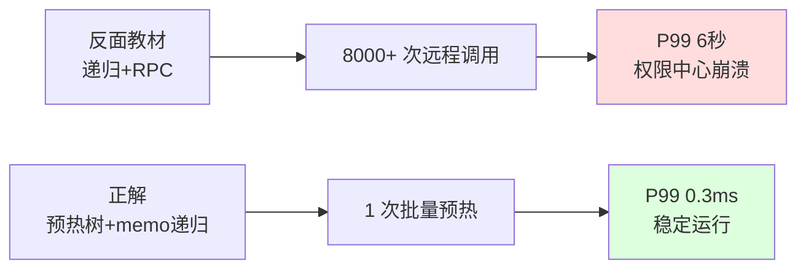
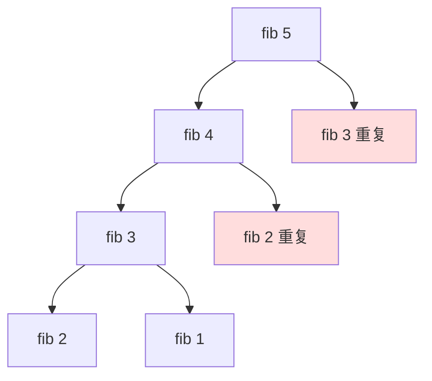

# 10.递归常见操作实践

#### 目录介绍
- [01. 从一个工作案例说起](#01-从一个工作案例说起)
- [02. 递归的本质与三要素](#02-递归的本质与三要素)
- [03. 调用栈与栈溢出](#03-调用栈与栈溢出)
- [04. 经典递归问题](#04-经典递归问题)
- [05. 递归优化：记忆化 尾递归 迭代化](#05-递归优化记忆化-尾递归-迭代化)
- [06. 树结构中的递归](#06-树结构中的递归)
- [07. 写好递归的方法论](#07-写好递归的方法论)
- [08. 本篇收获与案例回扣](#08-本篇收获与案例回扣)
- [09. 思考题](#09-思考题)
- [10. 课后作业](#10-课后作业)


## 01. 从一个工作案例说起

去年接手一个组织树的权限服务，同事写的"判断某用户是否属于某部门"代码长这样：

```python
# 反面教材：递归扫描组织树，没有缓存
def in_dept(user_id, dept_id):
    dept = get_dept(dept_id)   # 远程 RPC 查子部门列表
    if user_id in dept.users:
        return True
    for sub_id in dept.children:
        if in_dept(user_id, sub_id):
            return True
    return False
```

**线上炸点**：
- 组织树 7 层、约 1.8 万节点，一次权限校验平均触发 **8000+ 次 RPC**；
- 并发场景下，判断单次耗时 4~8 秒；
- 高峰期权限中心被打崩，整条业务线雪崩。

复盘后我改成两层递归 + memo：先一次性 DFS 把组织树加载进内存（一次调用 N 次 RPC），之后所有判断都是内存里 `O(深度)` 的递归，加上 memo 缓存，**单次耗时从 6s → 0.3ms**。



**这次事故教会我的事**：递归本身不慢，**慢的是重复子问题 + 副作用的嵌套**。这一篇就把递归的本质、陷阱、优化路径系统讲清。


## 02. 递归的本质与三要素

### 2.1 一句话定义

**递归就是把大问题拆成"结构相同、规模更小"的子问题，直到最小规模能直接解答。**

数学上对应归纳法：基础 + 归纳步骤。代码上体现为函数调用自己。

```
阶乘的数学定义就是一段递归：
  0! = 1                    ← 基础情况
  n! = n × (n-1)!            ← 递归步骤
```

### 2.2 递归的三要素

| 要素 | 说明 | 缺失后果 |
|------|------|----------|
| **基础情况** Base Case | 最小子问题直接给出答案 | 无限递归 → 栈溢出 |
| **递归步骤** Recursive Step | 把问题拆解成同构的小问题 | 无法递进 |
| **收敛性** Convergence | 每次递归都逼近基础情况 | 无限递归 |

```python
def factorial(n):
    if n == 0:          # 1. 基础情况
        return 1
    return n * factorial(n - 1)   # 2. 递归步骤；3. n→n-1 收敛
```

### 2.3 递归 ≡ 循环 + 栈

理论上递归和迭代计算能力完全等价 —— 所有递归都能用「显式栈 + 循环」模拟。

| 维度 | 递归 | 迭代 |
|------|------|------|
| 表达力 | 分治/树/图 特别清晰 | 简单线性问题直观 |
| 空间 | O(深度) 调用栈 | 通常 O(1) |
| 性能 | 函数调用有开销 | 稍快 |
| 栈溢出风险 | 有 | 无 |

记住一个原则：**当问题本身是"递归结构"（树、分治、回溯），用递归最清晰；当问题是"线性演进"，用迭代最高效。**


## 03. 调用栈与栈溢出

### 3.1 调用栈的工作方式

每次函数调用都会压入一个**栈帧**（参数 + 局部变量 + 返回地址）。递归就是不断压栈—压栈—直到命中基础情况，再逐层弹栈。

```
factorial(4) 的栈演化：

压栈阶段：                  弹栈阶段：
┌──────────────┐
│ fact(0)=1    │ ← 栈顶    fact(0) → 1
├──────────────┤           fact(1) = 1×1 = 1
│ fact(1)      │           fact(2) = 2×1 = 2
├──────────────┤           fact(3) = 3×2 = 6
│ fact(2)      │           fact(4) = 4×6 = 24
├──────────────┤
│ fact(3)      │
├──────────────┤
│ fact(4)      │
├──────────────┤
│ main()       │ ← 栈底
└──────────────┘
```

### 3.2 栈溢出的真实边界

操作系统给每个线程分配的栈空间是有限的：

| 平台 | 默认栈大小 | 可用递归深度（单栈帧约 100B） |
|------|-----------|-------------------------------|
| Linux 线程 | 8 MB | ~80000 |
| macOS 线程 | 8 MB | ~80000 |
| Windows 线程 | 1 MB | ~10000 |
| JVM 线程 | 512KB~1MB | ~5000~10000 |
| Python | 1000 层软限制 | 可调，但不建议 |
| Go goroutine | 初始 2KB 可增长 | 可到几十万 |

**实战经验**：写业务代码，**递归深度一旦接近 1 万就必须考虑改成迭代**。例如深组织树、JSON 深嵌套、语法树遍历等。

```python
# Python 查看和调整递归上限
import sys
print(sys.getrecursionlimit())   # 默认 1000
# sys.setrecursionlimit(100000)  # 不建议，治标不治本
```

### 3.3 空间复杂度 = 递归深度

**递归总调用次数 ≠ 空间复杂度**，空间只看**同时存在于栈上的最大深度**。

| 递归类型 | 总调用次数 | 最大深度 | 空间 |
|----------|-----------|----------|------|
| 线性递归 `fact(n)` | N | N | O(N) |
| 二叉递归 `fib(n)` | 2^N | N | O(N) |
| 平衡树遍历 | N | log N | O(log N) |
| 归并排序 | N log N | log N | O(log N) + O(N) 辅助数组 |
| 快排（最坏） | — | N | O(N) |


## 04. 经典递归问题

### 4.1 阶乘 — 最朴素的线性递归

```python
def factorial(n):
    return 1 if n == 0 else n * factorial(n - 1)
```

执行轨迹：`5! = 5×4×3×2×1×1 = 120`。没有重复子问题，O(N) 时间、O(N) 空间。

### 4.2 斐波那契 — 重复子问题的经典反面教材

```python
def fib(n):
    if n <= 1: return n
    return fib(n-1) + fib(n-2)
```



`fib(40)` 就要跑约 10 亿次 —— **朴素递归的 O(2^N) 是病，不是特性**。解药在第 05 节。

### 4.3 汉诺塔 — 递归思维的代表

把 N 个盘子从 A 搬到 C：

```
1. 把上面 N-1 个先搬到 B（借助 C）    ← 递归子问题
2. 把最大一个搬到 C                    ← 一步操作
3. 把 N-1 个再从 B 搬到 C（借助 A）    ← 递归子问题
```

```python
def hanoi(n, src, aux, dst):
    if n == 1:
        print(f"{src} → {dst}"); return
    hanoi(n-1, src, dst, aux)
    print(f"{src} → {dst}")
    hanoi(n-1, aux, src, dst)
```

移动次数 `T(N) = 2^N - 1`。64 个盘子需要 1.8×10¹⁹ 次，比宇宙年龄还长。**永远不要低估指数级的恐怖。**

### 4.4 全排列 — 回溯的基础

```python
def permutations(nums):
    res = []
    def backtrack(path, rest):
        if not rest:
            res.append(path[:]); return
        for i, x in enumerate(rest):
            path.append(x)
            backtrack(path, rest[:i] + rest[i+1:])
            path.pop()                    # 回溯
    backtrack([], nums)
    return res
```

"选一个 → 递归 → 撤销"三部曲，是 N 皇后、数独、子集等所有回溯问题的骨架。

### 4.5 归并排序 — 分治的典范

```python
def merge_sort(arr):
    if len(arr) <= 1: return arr
    m = len(arr) // 2
    left = merge_sort(arr[:m])
    right = merge_sort(arr[m:])
    return merge(left, right)

def merge(a, b):
    res, i, j = [], 0, 0
    while i < len(a) and j < len(b):
        if a[i] <= b[j]: res.append(a[i]); i += 1
        else:            res.append(b[j]); j += 1
    res += a[i:]; res += b[j:]
    return res
```

分（Divide）→ 治（Conquer）→ 合（Combine）—— 分治三段式的教科书模板。`O(N log N)` 时间、稳定、适合链表。


## 05. 递归优化：记忆化 / 尾递归 / 迭代化

### 5.1 记忆化（Memoization）

**核心思想**：把已算过的子问题结果缓存起来，下次直接查表。

```python
from functools import lru_cache

@lru_cache(maxsize=None)
def fib(n):
    return n if n <= 1 else fib(n-1) + fib(n-2)

fib(100)   # 毫秒返回 354224848179261915075
```

| 方法 | fib(40) | 时间 | 空间 |
|------|---------|------|------|
| 朴素递归 | ~60 秒 | O(2^N) | O(N) 栈 |
| 记忆化 | <1 ms | O(N) | O(N) 栈+缓存 |
| 迭代 DP | <1 ms | O(N) | **O(1)** |

### 5.2 尾递归

**尾递归**：递归调用是函数最后一个操作，后面再无计算。编译器可复用同一栈帧，空间从 O(N) 降到 O(1)。

```python
def fact(n, acc=1):
    if n == 0: return acc
    return fact(n-1, n * acc)    # 尾位置，无后续计算
```

| 语言 | 是否支持 TCO |
|------|-------------|
| Scheme / Erlang / Haskell | **强制支持** |
| Kotlin（`tailrec` 关键字） | 支持 |
| C / C++（-O2） | 编译器可优化 |
| Java / Python | **不支持**（与堆栈调试信息绑定） |

所以在 Java/Python 写尾递归没有空间收益，改成迭代才是正解。

### 5.3 递归转迭代

一个实用例子：二叉树前序遍历。

```python
def preorder(root):
    if not root: return
    stack = [root]
    while stack:
        node = stack.pop()
        print(node.val)
        if node.right: stack.append(node.right)   # 先右后左
        if node.left:  stack.append(node.left)
```

### 5.4 递归 → DP 的进化路径

```
朴素递归 → 记忆化递归(自顶向下) → 动态规划(自底向上) → 滚动数组(空间优化)
O(2^N)      O(N) / O(N)            O(N) / O(N)         O(N) / O(1)
```

```python
def fib_dp(n):
    if n <= 1: return n
    a, b = 0, 1
    for _ in range(2, n+1):
        a, b = b, a + b
    return b
```

**记住这个进化链**，面试里 80% 的递归/DP 题都能在这个框架里走通。


## 06. 树结构中的递归

树的定义本身就是递归的——"一棵树 = 根 + 若干子树"，所以它上面的几乎所有问题都能用递归优雅表达。

```
对树写递归的通用思路：
1. 在根节点上，问题的答案是什么？
2. 如果已知左子树、右子树的答案，能不能合成整棵树的答案？
3. 基础情况：空节点 / 叶子节点怎么处理？
```

### 6.1 最大深度

```python
def max_depth(root):
    if root is None: return 0
    return 1 + max(max_depth(root.left), max_depth(root.right))
```

### 6.2 路径和

```python
def has_path_sum(root, target):
    if root is None: return False
    if not root.left and not root.right:
        return root.val == target
    remain = target - root.val
    return has_path_sum(root.left, remain) or has_path_sum(root.right, remain)
```

### 6.3 序列化 / 反序列化

```python
def serialize(root):
    if root is None: return "#"
    return f"{root.val},{serialize(root.left)},{serialize(root.right)}"

def deserialize(s):
    it = iter(s.split(','))
    def build():
        v = next(it)
        if v == "#": return None
        node = TreeNode(int(v))
        node.left  = build()
        node.right = build()
        return node
    return build()
```

三道题的共同心法：**信任递归**——假设子函数已经正确处理了子树，你只管合并。


## 07. 写好递归的方法论

### 7.1 三步法

1. **先定义函数**：明确输入输出的含义，**不要纠结实现**；
2. **找基础情况**：最小规模直接返回；
3. **推导递推关系**：假设子问题已解决，怎么拼出当前解。

以反转链表为例：

```python
def reverse(head):
    # 1. 定义：返回反转后的头
    # 2. 基础：0/1 个节点直接返回
    if head is None or head.next is None:
        return head
    # 3. 递推：假设后半已经反转好了
    new_head = reverse(head.next)
    head.next.next = head       # 把自己挂到末尾
    head.next = None
    return new_head
```

**心法：信任递归**——把它当黑盒用，别一层一层去"脑内跟踪"。

### 7.2 调试技巧

```python
def fact(n, depth=0):
    pad = "  " * depth
    print(f"{pad}enter fact({n})")
    if n == 0:
        print(f"{pad}return 1"); return 1
    r = n * fact(n-1, depth+1)
    print(f"{pad}return {r}")
    return r
```

用缩进打印 enter/return，或者直接画递归树，是排查递归 bug 最快的办法。

### 7.3 四大陷阱清单

| 陷阱 | 典型症状 | 避免方式 |
|------|----------|---------|
| 忘了基础情况 | 无限递归，栈溢出 | 写函数时第一行先写 base case |
| 基础情况不完整 | 边界输入崩溃（负数、空指针） | 防御式编程，`<=` 代替 `==` |
| 参数不收敛 | 参数没改变，无限递归 | 每次必减少问题规模 |
| 重复子问题 | 指数级超时 | memo 或 DP |

### 7.4 选择矩阵

| 场景 | 选递归 | 选迭代 |
|------|--------|--------|
| 简单累加遍历 | | ✓ |
| 树、图遍历 | ✓ | |
| 分治（归并/快排） | ✓ | |
| 回溯（N 皇后/全排列） | ✓ | |
| 可能很深（> 1 万层） | | ✓（用显式栈） |
| 重复子问题多 | 记忆化 | DP |
| 性能极致路径 | | ✓ |


## 08. 本篇收获与案例回扣

回到开头那个"组织树权限校验 P99 6s"的线上事故，它的问题同时命中了本篇的**两个递归坑**：

**坑 1：副作用的递归放大**
- 每次递归里都在调用远程 RPC（`get_dept`），本应是 O(N) 的树搜索变成了 "O(N) × 每次 RPC 开销"；
- 修复：**预热 + 分层**——先一次性 DFS 加载整棵树到本地（只在这里付一次网络代价），之后所有判断都是纯内存递归。

**坑 2：缺少 memo，大量子问题重复算**
- 同一个 `dept_id` 在并发请求里被重复查询；
- 修复：`@lru_cache` 把 `in_dept(user_id, dept_id)` 结果缓存起来，同部门第二次判断就是 O(1)。

把这两条修上后，单次判断从 **6 秒 → 0.3 毫秒**，服务再没抖动过。

**更抽象的收获**：
- 递归的本质是"大问题 = 小问题 + 合并"，**不是函数调用自己这个表象**；
- 递归不会天然低效，**重复子问题才是慢的根**，解药是记忆化/DP；
- 递归的深度上限是硬约束（Java ~5000、Windows ~1 万），**业务里遇到可能很深的场景必须迭代化**；
- 树、图、分治、回溯这四类问题，递归写法几乎永远是最清晰的；
- 写递归的心法是**信任递归**——把子调用当黑盒，只关注"假设它对，怎么合并"。

这些思路，会在后面的 Hash、散列、List/Map/Set 三件套里反复出现——递归是数据结构这门课的"万能溶剂"。


## 09. 思考题

> 建议先独立思考 15 分钟，再查资料或看答案。

**1. 重复子问题可视化**：画出 `fib(6)` 的完整递归调用树。标出被重复计算的子问题。记忆化后的调用树变成了什么形状？（提示：从树变成了 DAG）

**2. 尾递归与 JVM**：为什么 Java 故意不做尾递归优化？（提示：和 `Thread.getStackTrace()`、安全管理器的栈检查有关）换成 Kotlin 的 `tailrec` 关键字行不行？它是在什么层做优化的？

**3. 递归转迭代**：请把二叉树**中序遍历**的递归版改成用显式栈的迭代版，不超过 12 行。思考一个更深的问题：**后序遍历**为什么比前序、中序都难写成迭代？（提示：根节点访问时机）

**4. 自顶向下 vs 自底向上**：同样是 O(N) 时间，记忆化递归（自顶向下）和 DP 数组（自底向上）各有什么利弊？在哪种场景自顶向下反而更优？（提示：只需要计算部分状态时）

**5. 线上经验**：假设你要处理一个深度可能达到 100 万层的 JSON，纯递归解析肯定栈溢出。设计一个既能保持"递归结构的代码清晰度"、又不会溢出的方案。（关键词：**蹦床 Trampoline** / **显式工作栈** / **延续传递风格 CPS**）


## 10. 课后作业

### 作业 1：实现六种斐波那契

同一道题（求 `fib(n)`）用 6 种方式实现，分别测量 n = 30/40/50/100/1000 的耗时：

1. 朴素递归（n=50 超时合理）；
2. 记忆化递归（字典手写）；
3. `@lru_cache` 装饰器；
4. 自底向上 DP 数组；
5. 滚动变量 O(1) 空间；
6. 矩阵快速幂 O(log N)（选做）。

用表格对比，加深"算法>实现方式"的体感。

### 作业 2：LeetCode 刷题清单

| 难度 | 题号 | 题目 | 核心考点 |
|------|------|------|---------|
| 简单 | 226 | 翻转二叉树 | 递归基础 |
| 简单 | 104 | 二叉树最大深度 | 分治递归 |
| 中等 | 46 | 全排列 | 回溯 |
| 中等 | 22 | 括号生成 | 回溯+剪枝 |
| 中等 | 78 | 子集 | 回溯 |
| 中等 | 95 | 不同的二叉搜索树 II | 分治+记忆化 |
| 中等 | 394 | 字符串解码 | 递归/栈 |
| 困难 | 51 | N 皇后 | 回溯经典 |
| 困难 | 124 | 二叉树最大路径和 | 后序+返回值设计 |

建议每道题都**先用递归实现 → 再尝试迭代改写 → 最后用 DP 优化**，感受三种思维的切换。

### 作业 3：实战重构一段递归（必做）

找到你工作代码里一段递归（目录扫描、嵌套 JSON 解析、依赖分析、组织树查询都可以）。按下面清单重构它：

- [ ] 明确写出基础情况、递归步骤、收敛性；
- [ ] 估计最大递归深度，评估是否可能栈溢出；
- [ ] 如果有 I/O 或 RPC 副作用，**把 I/O 从递归里剥离出来**；
- [ ] 如果存在重复子问题，加 memo 或改 DP；
- [ ] 写 5 个边界 case（空、单节点、深度极大、循环引用、超大规模）。

这套流程做完，你对递归的理解就从"知道"升级到"吃过亏"。

---

一句话收尾：

> **递归不是魔法，它是"相信自己能解决子问题"的信念。**
> 先定义、再基础、后递推；看到重复就 memo，看到很深就迭代化。
