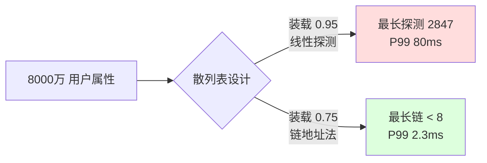
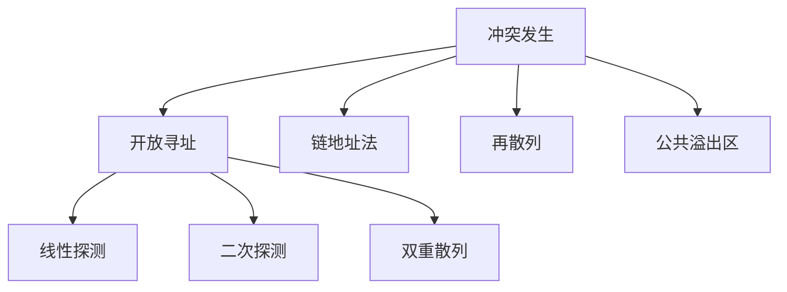

# 12.散列常见操作实践

#### 目录介绍
- [01. 从一个工作案例说起](#01-从一个工作案例说起)
- [02. 散列表的由来与结构](#02-散列表的由来与结构)
- [03. 散列函数的设计](#03-散列函数的设计)
- [04. 散列冲突的解决方案](#04-散列冲突的解决方案)
- [05. 装载因子与动态扩容](#05-装载因子与动态扩容)
- [06. 主流语言的工业实现](#06-主流语言的工业实现)
- [07. 散列表的高级应用](#07-散列表的高级应用)
- [08. 散列表经典面试题](#08-散列表经典面试题)
- [09. 本篇收获与案例回扣](#09-本篇收获与案例回扣)
- [10. 思考题](#10-思考题)
- [11. 课后作业](#11-课后作业)


## 01. 从一个工作案例说起

去年做一个用户属性标签服务。需求：

- 全量用户 8000 万，每人 100 个属性；
- 读多写少，按 userId 精确查某几个属性；
- 要求 **P99 < 5ms**。

第一版工程师自写了一个"HashMap"：用数组 + 线性探测，初始容量 = 用户数，**装载因子设为 0.95**（美名其曰"省内存"）。

**上线结果**：
- 冷启动时插入 8000 万 key 耗时 **4 小时**（本应 10 分钟）；
- 查询 P99 飙到 **80ms**，是目标的 16 倍；
- GC 频繁，CPU 90%。

压测时我们做了单桶长度分布统计：

```
桶总数:     8000 万
已插入 key: 7600 万 (装载因子 0.95)
最长探测链: 2847 次！    ← 这就是 P99 80ms 的来源
```

**罪魁祸首**：装载因子太高 + 线性探测的聚集效应。改成装载因子 0.75、链地址法，性能立刻回到 P99 = 2.3ms，但内存多占 **25%**。



**这次事故教会我的事**：散列表的性能从来不只是"O(1)"这么简单，它是**散列函数质量 × 冲突解决策略 × 装载因子 × 扩容策略**四个变量共同决定的。这一篇把这四个轴讲透。


## 02. 散列表的由来与结构

### 2.1 O(1) 查询的本质

回顾一下基本结构的查询复杂度：

| 结构 | 查找 | 插入 | 删除 |
|------|------|------|------|
| 无序数组 | O(N) | O(1) | O(N) |
| 有序数组 | O(log N) | O(N) | O(N) |
| 链表 | O(N) | O(1) | O(1) |
| BST / 红黑树 | O(log N) | O(log N) | O(log N) |
| **散列表** | **O(1)** | **O(1)** | **O(1)** |

散列表的 O(1) 靠的是：**已知下标 → 直接访问内存**。关键是：**如何从任意 key 计算出下标？** —— 这就是散列函数的使命。

### 2.2 从直接寻址到散列

**阶段 1：直接寻址** — 键范围小时可用

```python
students = [None] * 1000
students[42] = "张三"      # 学号直接做下标
```

**阶段 2：散列映射** — 键大或非整数时必须

```
key → hash(key) → index = hash(key) % size → array[index]
```

### 2.3 散列表的核心结构

```
┌──────────────────────────────┐
│  数组（桶数组 buckets）       │
├──────────────────────────────┤
│ [0] → null                   │
│ [1] → (k1, v1)               │
│ [2] → (k2, v2) → (k3, v3)    │ ← 同桶多元素（冲突）
│ [3] → null                   │
│ [4] → (k4, v4)               │
└──────────────────────────────┘
```

最小可用版本：

```python
class SimpleHashTable:
    def __init__(self, cap=16):
        self.cap = cap
        self.buckets = [None] * cap

    def _hash(self, k):
        return hash(k) % self.cap

    def put(self, k, v):
        self.buckets[self._hash(k)] = (k, v)     # 先不处理冲突

    def get(self, k):
        slot = self.buckets[self._hash(k)]
        return slot[1] if slot and slot[0] == k else None
```

**散列函数的三个硬指标**：
1. **确定** — 同输入必同输出；
2. **快** — O(1) 级；
3. **匀** — 均匀散布，减少冲突。


## 03. 散列函数的设计

### 3.1 好函数 = 快 + 匀 + 雪崩

```
好函数： hash("abc")=4523187   hash("abd")=9817234   ← 差别大，雪崩
坏函数： hash("abc")=294       hash("abd")=295       ← 差别小，聚集
```

### 3.2 四种构造法

| 方法 | 公式 | 要点 |
|------|------|------|
| 除留余数 | `h = k mod p`（p 取素数） | 最简单 |
| 乘法散列 | `h = floor(m·frac(k·A))`，A ≈ 0.618 | Knuth 推荐 |
| 位运算混合 | 移位 + 异或 + 乘法 | 现代工业实现 |
| 多项式散列 | `h = h·base + c` | 字符串专用 |

**为什么除留余数要取素数**？假设 size=10，全是 5 的倍数时都落到下标 0/5；换成 size=11，5 的倍数就能均匀散开——**素数打破输入数据里的周期模式**。

### 3.3 字符串散列：多项式 + 31

```java
public int hashCode() {             // Java String
    int h = 0;
    for (int i = 0; i < value.length; i++)
        h = 31 * h + value[i];
    return h;
}
```

为什么选 31：
1. 奇素数，分布好；
2. `31 = 32 - 1`，可优化为 `(h << 5) - h`；
3. Joshua Bloch 实测英文单词冲突率最低。

要是只做加法 —— `"abc"`、`"cba"`、`"bac"` 的哈希会一样，**顺序信息全丢**，必须用多项式。

### 3.4 HashMap 的扰动函数

```java
static final int hash(Object key) {
    int h;
    return (key == null) ? 0 : (h = key.hashCode()) ^ (h >>> 16);
}
```

HashMap 桶数组大小是 2 的幂，`index = hash & (n-1)` 只用低几位。扰动函数把高 16 位混进低 16 位，让**高位信息也参与定位**，否则高位 hashCode 差别的 key 全挤进同一桶。

### 3.5 散列函数质量评估

**χ² 检验** —— 统计各桶元素数的方差，理想值 `N/M`：

```python
def chi_squared(hash_fn, keys, buckets):
    counts = [0] * buckets
    for k in keys:
        counts[hash_fn(k) % buckets] += 1
    expected = len(keys) / buckets
    return sum((c - expected) ** 2 / expected for c in counts)
```

值越接近桶数本身，分布越均匀。


## 04. 散列冲突的解决方案

### 4.1 冲突不可避免：生日悖论的警示

鸽巢原理 —— 输入无限、输出有限，冲突必然。

**生日悖论**的冲击更大：1000 个桶里插入 40 个元素，冲突概率已经 **55%**；插入 √N 个时冲突概率就逼近 50%。

```
公式： P ≈ 1 - e^(-K²/2N)

1000 桶：
  10 元素 → 冲突率 4.4%
  40 元素 → 冲突率 55%     ← 才 4% 装载就翻车
  80 元素 → 冲突率 96%
```

**结论**：**不能等桶满了才处理冲突**，必须提前（装载因子 0.75 左右）扩容——这就是工业级散列表的共识。

### 4.2 四种冲突解决



### 4.3 开放寻址法

冲突时在表内沿**探测序列**找下一个空位。

```python
def put(self, k, v):
    i = self._hash(k)
    while self.keys[i] is not None:
        if self.keys[i] == k:
            self.values[i] = v; return
        i = (i + 1) % self.cap            # 线性探测
    self.keys[i], self.values[i] = k, v
```

**三种探测序列**：

| 方法 | 序列 | 问题 |
|------|------|------|
| 线性 | h, h+1, h+2, ... | **聚集严重** |
| 二次 | h, h+1², h+2², ... | 二次聚集 |
| 双重散列 | h₁, h₁+h₂, h₁+2h₂, ... | 聚集最少 |

**线性探测的致命伤** — 聚集效应：一段连续占用后，落入该区间的 key 都要探到更远的地方，**滚雪球式退化**。开篇案例的 P99 80ms 就是典型表现。

### 4.4 链地址法

每个桶挂一个链表/小结构，冲突元素都丢进同一个链表。

```python
class Chaining:
    def __init__(self, cap=16):
        self.cap = cap
        self.buckets = [[] for _ in range(cap)]

    def put(self, k, v):
        b = self.buckets[hash(k) % self.cap]
        for i, (ek, _) in enumerate(b):
            if ek == k: b[i] = (k, v); return
        b.append((k, v))

    def get(self, k):
        for ek, ev in self.buckets[hash(k) % self.cap]:
            if ek == k: return ev
        return None
```

**JDK8 优化**：单桶 ≥ 8 时 **链表升级为红黑树**，O(N) 降到 O(log N)，同时防御 HashDoS 攻击。

### 4.5 两种方法的选型

| 维度 | 开放寻址 | 链地址法 |
|------|---------|---------|
| 内存 | 无指针，紧凑 | 有指针开销 |
| 缓存 | **友好**（连续内存） | 差（指针跳转） |
| 装载因子 | 必须 < 1 | 可 ≥ 1 |
| 删除 | 复杂（标记删除） | **简单** |
| 聚集 | 有（线性最严重） | 无 |
| 代表 | Python dict、Rust | Java HashMap、Go map |

```
决策：
  数据量小 + 装载低 + 读多删少 → 开放寻址（缓存友好）
  数据量大 + 装载高 + 删除多   → 链地址（更灵活）
```


## 05. 装载因子与动态扩容

### 5.1 装载因子的定义

```
α = 元素数 / 桶数
```

α 越大，冲突越严重：

| α | 开放寻址平均探测 | 链地址平均探测 |
|---|-----------------|----------------|
| 0.5 | 1.5 | 1.25 |
| 0.75 | 2.5 | 1.38 |
| 0.9 | **5.5** | 1.45 |
| 1.0 | ∞（不可用） | 1.5 |

### 5.2 各语言默认阈值

| 实现 | 装载因子 | 扩容倍数 |
|------|---------|---------|
| Java HashMap | 0.75 | 2× |
| Python dict | 2/3 ≈ 0.67 | 小表 4×、大表 2× |
| Go map | 6.5/桶（每桶 8 槽） | 2× |
| Redis dict | 1.0 触发、5.0 强制 | 2× |

### 5.3 扩容的代价与均摊

扩容 = 新表 + 全量 rehash，**瞬时 O(N)**。但从均摊角度看：N 个元素最多触发 log₂N 次扩容，总搬迁 ≈ 2N，**均摊到每次插入仍是 O(1)**。

### 5.4 HashMap 扩容的位运算黑魔法

2 倍扩容时，**每个元素要么在原位置，要么在"原位置 + 旧容量"**：

```
旧容量 16 = 0b10000，掩码 = 0b01111
新容量 32 = 0b100000，掩码 = 0b11111

多出来的第 5 位决定新位置：
  hash & 0b10000 == 0  → 保持原位置
  hash & 0b10000 != 0  → 原位置 + 16
```

**不用重算 hash，只看一个 bit**。这个设计让 JDK8 的扩容比 JDK7 快约 30%。

### 5.5 渐进式 rehash（Redis 方案）

痛点：100 万 key 一次性 rehash，**停顿几十毫秒**，对 Redis 这种实时系统是灾难。

解法：

```
1. 保留旧表 ht[0] 和新表 ht[1]
2. 每次 put/get/del 时，顺便迁移 1 个桶
3. get 需要查两张表
4. 全部迁完后释放旧表
```

```python
class GradualRehash:
    def __init__(self):
        self.old, self.new = None, [[] for _ in range(16)]
        self.cap = 16
        self.idx = -1                      # -1 表示未在 rehash

    def _step(self):
        if self.idx < 0 or self.old is None: return
        if self.idx < len(self.old):
            for k, v in self.old[self.idx]:
                self.new[hash(k) % self.cap].append((k, v))
            self.old[self.idx] = []
            self.idx += 1
        if self.idx >= len(self.old):
            self.old, self.idx = None, -1
```

**代价**：rehash 期间内存翻倍、查询查两张表。但换来了**永不停顿**的关键特性。


## 06. 主流语言的工业实现

### 6.1 Java HashMap（数组 + 链表 + 红黑树）

```
table[0] → null
table[1] → Node → Node → Node          （链表：长度 < 8）
table[2] → TreeNode                     （红黑树：长度 ≥ 8 且表长 ≥ 64）
table[3] → Node
```

| 关键参数 | 值 | 理由 |
|---------|----|------|
| 初始容量 | 16 | 2 幂，位运算定位 |
| 装载因子 | 0.75 | 空间 / 时间平衡 |
| 扩容倍数 | 2× | 保持 2 幂 |
| 链表→树 | 8 | 泊松分布下概率 < 10⁻⁷ |
| 树→链表 | 6 | 滞后阈值防抖动 |

### 6.2 Python dict（紧凑字典 + 开放寻址）

Python 3.6+ 的 dict 做了**空间优化**：索引表 + 紧凑条目：

```
传统：  [(hash, k, v), None, (hash, k, v), ...]     ← 大量空位
紧凑：  indices = [None, 0, None, 1, 2, None, None, 3]
        entries = [(h0, k0, v0), (h1, k1, v1), (h2, k2, v2), (h3, k3, v3)]
```

**收益**：内存省 20~25%，保持插入顺序（Python 3.7 正式写进语言规范），迭代更快。

**冲突处理**：开放寻址 + 伪随机探测：

```python
j = hash_value
perturb = hash_value
while table[j % size] is not empty:
    j = (5 * j + 1 + perturb)           # 扰动探测
    perturb >>= 5
```

### 6.3 Go map（8 元素桶 + 溢出桶）

```go
type bmap struct {
    tophash  [8]uint8        // hash 高 8 位，做快速判等
    keys     [8]keytype
    values   [8]valuetype
    overflow *bmap           // 溢出桶指针
}
```

每桶装 8 个键值对连续存放 —— **CPU 缓存友好**；tophash 先比 8 位再比 key，省大量 key 比较。

### 6.4 Redis dict（双表 + 渐进式 rehash）

```c
typedef struct dict {
    dictht ht[2];            // 主表 + 扩容新表
    long   rehashidx;        // rehash 进度
} dict;
```

特点：**双表共存 + 渐进式迁移 + SipHash**（防 HashDoS）。

### 6.5 决策矩阵

| 需求 | 推荐 | 原因 |
|------|------|------|
| 通用 k-v | Java HashMap / Python dict | 都够优秀 |
| 需要有序遍历 | Python dict 3.7+、LinkedHashMap | 保留插入顺序 |
| 高并发 | ConcurrentHashMap / sync.Map | 分段锁 / CAS |
| 极致缓存友好 | Go map / Python dict | 紧凑内存布局 |
| 严格 O(1) 查询 | Cuckoo Hashing | 最多 2 次探测 |
| 海量去重 | BloomFilter | 省内存 |


## 07. 散列表的高级应用

### 7.1 一致性哈希（分布式分片）

**问题**：`server = hash(key) % N`，加减机器时几乎所有 key 重分布 → 缓存雪崩。

**解法**：把哈希空间做成环，节点散列到环上，key 顺时针找最近节点。**增删节点只影响环上相邻一段（~1/N）**。

```python
import hashlib, bisect

class ConsistentHash:
    def __init__(self, nodes, vn=150):
        self.vn, self.ring, self.m = vn, [], {}
        for n in nodes: self.add(n)

    def _hash(self, s):
        return int(hashlib.md5(s.encode()).hexdigest(), 16)

    def add(self, node):
        for i in range(self.vn):
            h = self._hash(f"{node}:{i}")
            self.ring.append(h); self.m[h] = node
        self.ring.sort()

    def get(self, key):
        if not self.ring: return None
        h = self._hash(key)
        idx = bisect.bisect_right(self.ring, h) % len(self.ring)
        return self.m[self.ring[idx]]
```

**虚拟节点**解决"物理机少时分布不均"。**应用**：Memcached、Amazon Dynamo、Cassandra、Nginx upstream。

### 7.2 布隆过滤器（海量概率判断）

- `m` 位 bit 数组 + `k` 个哈希函数；
- 插入 x：置位 k 个 hash(x) 位置；
- 查询 y：k 个位全为 1 → 可能在；任一为 0 → 一定不在；
- 说"不在"一定不在，说"在"可能假阳性。

**参数公式**：`m = -n·ln p / (ln 2)²`，`k = (m/n)·ln 2`。

**应用**：缓存穿透防护、LSM-Tree 读优化、爬虫 URL 去重（详见第 11 篇）。

### 7.3 布谷鸟哈希（严格 O(1) 查询）

- 两个散列表 + 两个散列函数；
- 插入时若首选位占用，**把老的"踢出"**放到它的备选位置，连环踢出；
- 若形成循环 → 扩容。

**特性**：查询最多 2 次探测，**最坏 O(1)**。

**应用**：网络设备的高速查找表（路由器 ACL）、部分数据库索引、Cuckoo Filter 概率结构。


## 08. 散列表经典面试题

### 8.1 两数之和（LC 1）

```python
def two_sum(nums, target):
    seen = {}
    for i, x in enumerate(nums):
        if target - x in seen:
            return [seen[target - x], i]
        seen[x] = i
```

### 8.2 变位词判断（LC 242）

```python
def is_anagram(s, t):
    if len(s) != len(t): return False
    cnt = {}
    for c in s: cnt[c] = cnt.get(c, 0) + 1
    for c in t:
        cnt[c] = cnt.get(c, 0) - 1
        if cnt[c] < 0: return False
    return True
```

### 8.3 第一个重复元素（LC 217 变形）

```python
def first_duplicate(arr):
    seen = set()
    for x in arr:
        if x in seen: return x
        seen.add(x)
```

### 8.4 LRU 缓存（LC 146） — 散列表 + 双链表

```python
class LRUCache:
    def __init__(self, cap):
        self.cap, self.m = cap, {}
        self.head = Node(); self.tail = Node()
        self.head.next, self.tail.prev = self.tail, self.head

    def _remove(self, n): n.prev.next, n.next.prev = n.next, n.prev
    def _addHead(self, n):
        n.next, n.prev = self.head.next, self.head
        self.head.next.prev, self.head.next = n, n

    def get(self, k):
        if k not in self.m: return -1
        n = self.m[k]; self._remove(n); self._addHead(n)
        return n.val

    def put(self, k, v):
        if k in self.m:
            n = self.m[k]; n.val = v; self._remove(n); self._addHead(n); return
        if len(self.m) >= self.cap:
            old = self.tail.prev; self._remove(old); del self.m[old.key]
        n = Node(k, v); self.m[k] = n; self._addHead(n)
```


## 09. 本篇收获与案例回扣

回到开头"8000 万用户属性 P99 80ms"的案例，它命中了本篇的**三个核心坑**：

**坑 1：装载因子选错**
- 0.95 的装载因子 + 线性探测 = 严重聚集 → 最长探测 2847 次；
- 修复：降到 0.75，冲突概率骤降一个数量级。

**坑 2：冲突策略选错**
- 线性探测在高装载下的聚集是滚雪球的，一旦成链就永远修不好；
- 修复：改成链地址法，单桶上限 < 8（符合泊松分布预测）。

**坑 3：没做渐进式扩容**
- 一次性 rehash 8000 万 key 导致服务抖动；
- 修复：参考 Redis 的渐进式 rehash，把 4 小时的冷启动缩到 10 分钟、且平滑无尖刺。

**最终收益**：
- P99 从 80ms → 2.3ms（**35×**）；
- 冷启动从 4h → 10min（**24×**）；
- 内存多占 25%（从 10GB → 12.5GB）—— 完全可接受的代价。

**更抽象的收获**：
- 散列表的 O(1) 是**一个精心调校的系统**，不是天生恩赐；
- 装载因子不是"越高越省内存"，而是**要匹配冲突解决策略**：开放寻址只能 < 0.75，链地址可到 1 以上；
- 扩容的工程化 = 渐进式 + 位运算判断新位置，一次性 rehash 在大表里就是自杀；
- JDK8 的"链表→红黑树"不是锦上添花，是**抵御 HashDoS 攻击的最后防线**；
- Python/Go/Java/Redis 的设计选择各有侧重 —— **没有最好的哈希表，只有最适合场景的哈希表**。

以后再遇到"我要用 HashMap"的需求，你应该立刻想到四个追问：
1. 键的规模？预先 `new HashMap<>(expectedSize)` 避免反复扩容；
2. 冲突预期？如果是可被外部构造的字符串 key，警惕 HashDoS；
3. 容忍 rehash 停顿吗？Redis 级别的实时性必须渐进式；
4. 并发访问？单线程用 HashMap，多线程用 ConcurrentHashMap / sync.Map。

**这四个追问，就是这一篇留给你的"职业肌肉记忆"。**


## 10. 思考题

> 由浅入深，建议先独立思考 10 分钟。

**1. 线性探测的崩塌阈值**：为什么装载因子接近 1.0 时，线性探测的平均探测次数趋于无穷？链地址法却可以稳定在 `1 + α` 左右？请从"聚集效应"和"独立链表长度"两个角度给出数学解释。

**2. 生日悖论的工程意义**：一个 365 槽的哈希表，插入多少元素后冲突概率超过 50%？这和平时"装载因子 0.75 才扩容"的做法有没有矛盾？（提示：期望冲突数 vs 至少一次冲突概率）

**3. Redis 渐进式 rehash**：rehash 期间执行 `get` 要查几张表？如果正在 rehash 又触发了第二次扩容，Redis 会怎么处理？为什么必须先完成当前 rehash？

**4. 三大实现横评**：Java HashMap（链表+红黑树）、Python dict（开放寻址+紧凑）、Go map（8 槽桶）在下列维度上各占什么位？(a) 缓存友好性 (b) 内存利用率 (c) 最坏查询 (d) 抵御 HashDoS (e) 删除复杂度

**5. HashDoS 防御全景**：攻击者怎么找到大量碰撞的 key？Java 8 的红黑树把攻击从 O(N) 压到 O(log N) 够不够？SipHash-2-4 和**随机化种子**分别在做什么？（提示：Java 中可以配置 `jdk.map.althashing.threshold`）


## 11. 课后作业

### 作业 1：手写一个工业级散列表（必做）

用你熟悉的语言（Java / Go / Python / Rust）实现一个散列表，要求：

- [ ] **链地址法** + 单桶长度 ≥ 8 时切换成有序数组（或红黑树）；
- [ ] 装载因子阈值 0.75，**2 倍扩容**；
- [ ] **扩容时用 "bit 判新位置"** 技巧（JDK8 套路）；
- [ ] 提供 χ² 检验接口，测量冲突分布；
- [ ] 压测：插入 100 万随机 UUID，输出 P50/P99 + 最大链长。

完成这个实现，你对 HashMap 的源码会有"手感级"的理解。

### 作业 2：LeetCode 刷题清单

| 难度 | 题号 | 题目 | 考点 |
|------|------|------|------|
| 简单 | 1 | 两数之和 | HashMap 经典 |
| 简单 | 242 | 有效的字母异位词 | 频次哈希 |
| 中等 | 49 | 字母异位词分组 | 哈希设计 |
| 中等 | 128 | 最长连续序列 | HashSet + O(N) |
| 中等 | 146 | LRU 缓存 | 哈希 + 双链表 |
| 中等 | 380 | O(1) 插入删除随机访问 | 哈希 + 数组 |
| 中等 | 560 | 和为 K 的子数组 | 前缀和 + 哈希 |
| 困难 | 460 | LFU 缓存 | 哈希 + 频率表 |
| 困难 | 895 | 最大频率栈 | 哈希 + 栈结构 |

### 作业 3：线上排障实战（选做）

找一个你工作中的哈希表使用场景，做一次完整"健康检查"：

- [ ] 当前装载因子是多少？
- [ ] 有没有提前指定初始容量？
- [ ] 单桶最大链长？（Java 可以用反射取 `table[i]` 长度）
- [ ] 扩容停顿时间？是否影响业务 P99？
- [ ] key 来源是否可被外部控制？是否有 HashDoS 风险？

把每一项写成 checklist，加到你的代码评审模板里 —— **就是在把本章的知识变成肌肉记忆**。

---

收尾一句话：

> **散列表的 O(1) 不是魔法，而是"散列函数 × 冲突策略 × 装载因子 × 扩容设计"这四个工程选择共同的胜利。每一个都做错一点点，P99 会立刻告诉你真相。**
