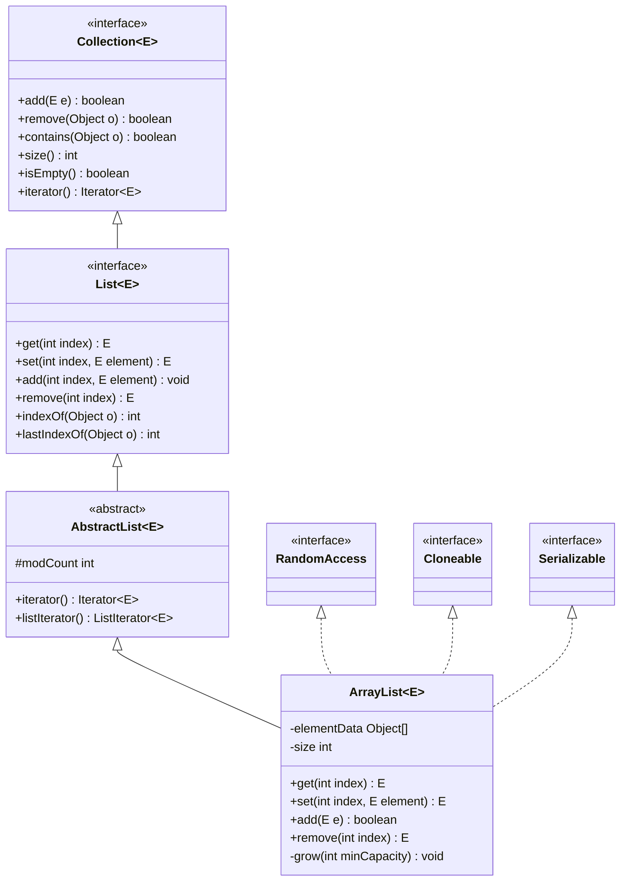
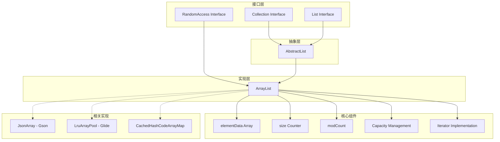
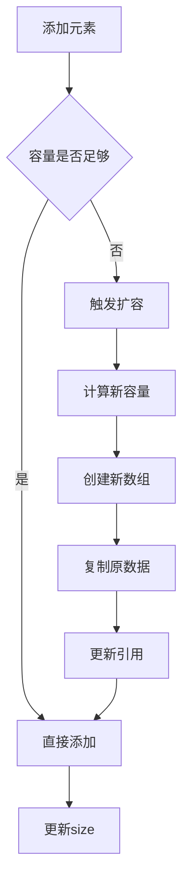
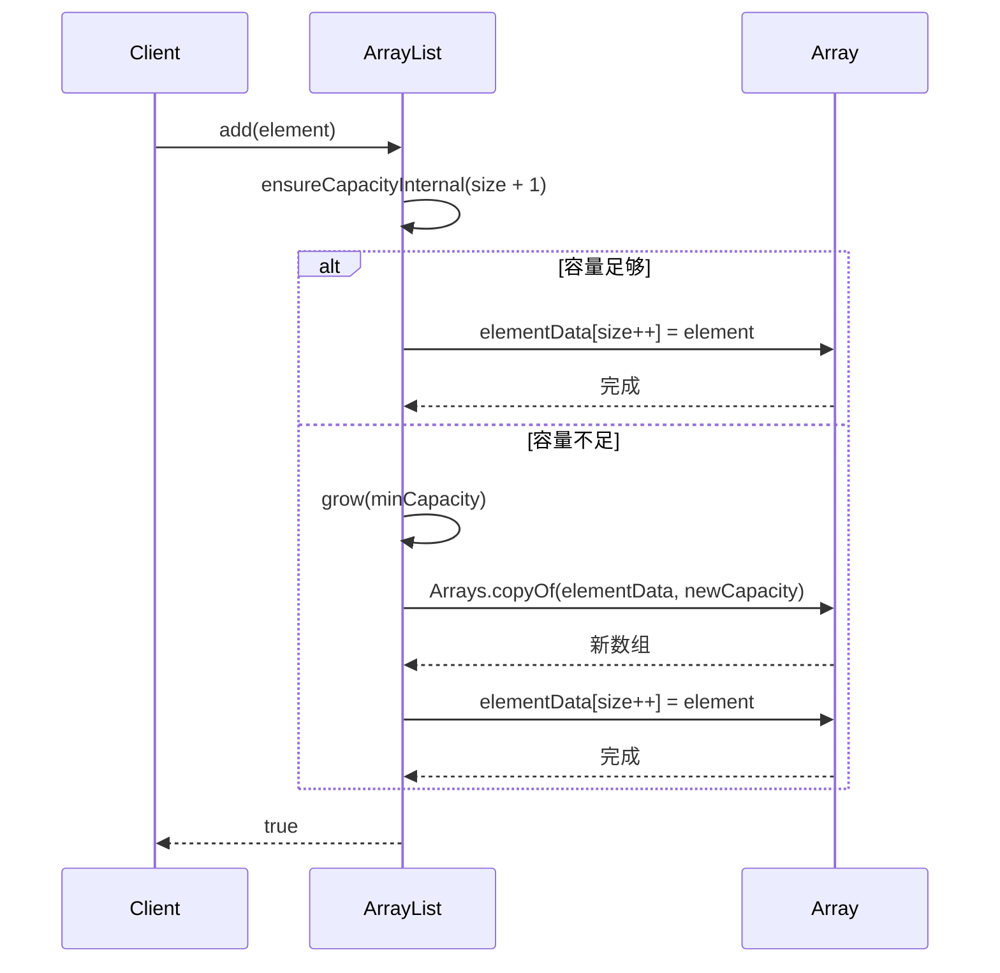
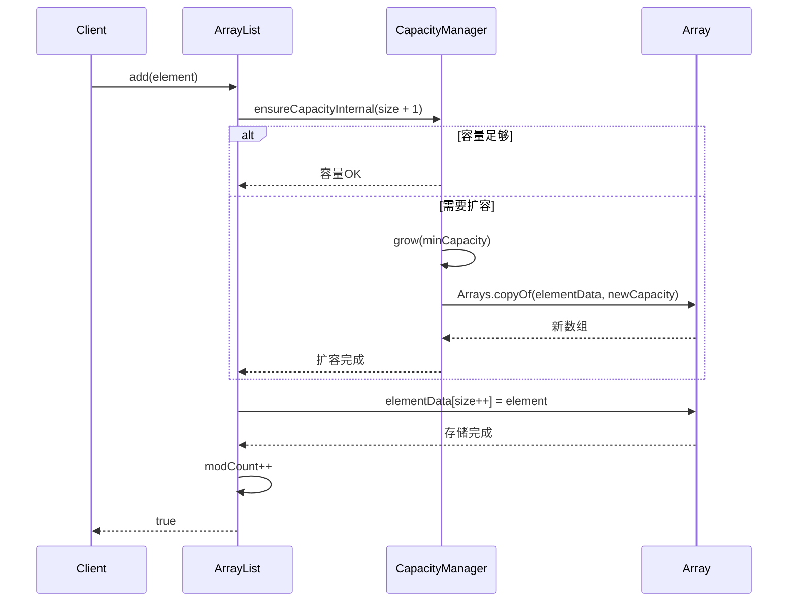
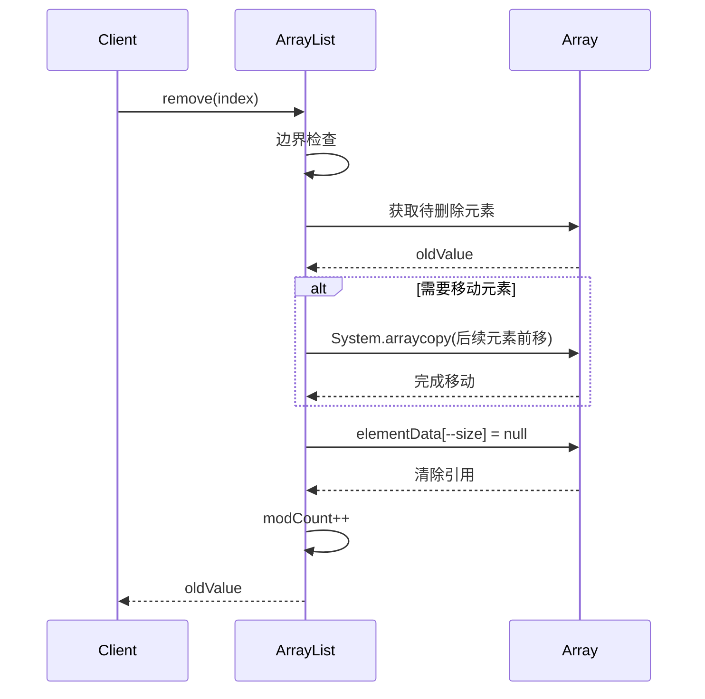
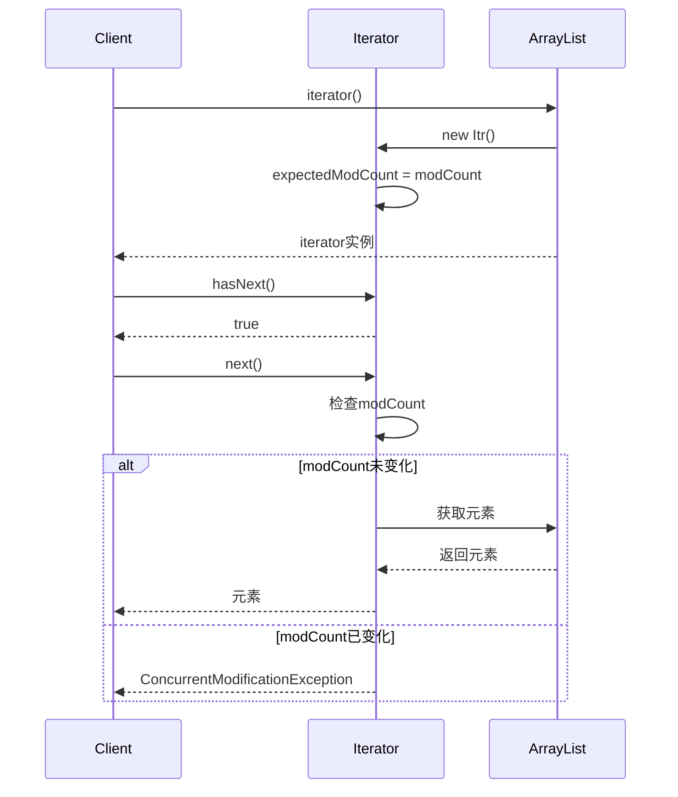
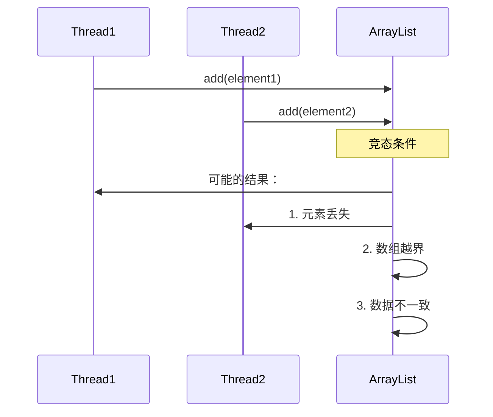
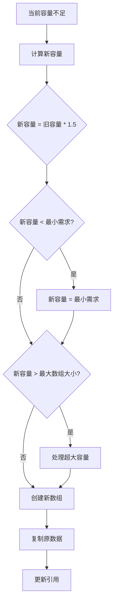
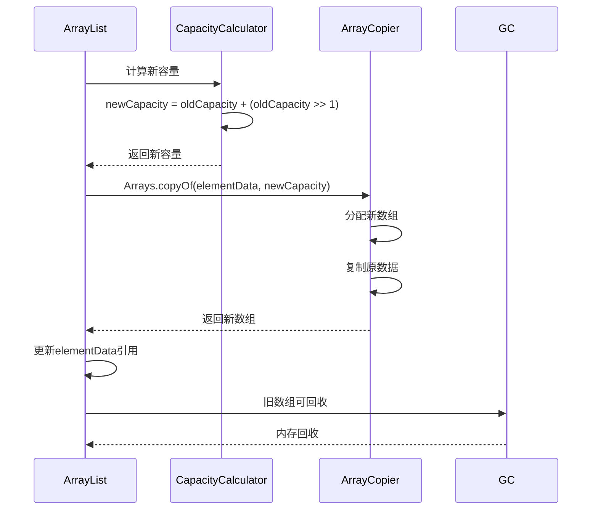

z s# 13.工业级List设计思想
#### 目录介绍
- [01.List核心思想](#01list核心思想)
  - [1.0 List面试题](#10-list面试题)
  - [1.1 核心设计理念](#11-核心设计理念)
  - [1.2 接口层次结构](#12-接口层次结构)
  - [1.3 整体架构图](#13-整体架构图)
- [02.List集合如何设计](#02list集合如何设计)
  - [2.1 使用数组设计](#21-使用数组设计)
  - [2.2 使用链表设计](#22-使用链表设计)
  - [2.3 设计考虑点](#23-设计考虑点)
  - [2.4 数据迁移和安全](#24-数据迁移和安全)
  - [2.5 元素效率考量](#25-元素效率考量)
- [03.动态数组设计](#03动态数组设计)
  - [3.1 解决核心痛点](#31-解决核心痛点)
  - [3.2 底层存储结构](#32-底层存储结构)
  - [3.3 容量管理策略](#33-容量管理策略)
  - [3.4 设计优势](#34-设计优势)
  - [3.5 设计缺陷与不足](#35-设计缺陷与不足)
- [04.添加元素设计](#04添加元素设计)
  - [4.1 添加元素思路](#41-添加元素思路)
  - [4.2 添加元素流程](#42-添加元素流程)
  - [4.3 容量确保机制](#43-容量确保机制)
  - [4.4 扩容算法详解](#44-扩容算法详解)
  - [4.5 数据存储和迁移策略](#45-数据存储和迁移策略)
  - [4.6 添加元素时序图](#46-添加元素时序图)
- [05.移除元素设计](#05移除元素设计)
  - [5.1 移除元素思路](#51-移除元素思路)
  - [5.2 移除元素实现](#52-移除元素实现)
  - [5.3 高效删除设计](#53-高效删除设计)
  - [5.4 删除操作时序图](#54-删除操作时序图)
  - [5.5 删除涉及扩容吗](#55-删除涉及扩容吗)
- [06.元素访问设计](#06元素访问设计)
  - [6.1 元素访问思路](#61-元素访问思路)
  - [6.2 随机访问实现](#62-随机访问实现)
  - [6.3 查找操作实现](#63-查找操作实现)
  - [6.4 访问性能特征](#64-访问性能特征)
- [07.线程安全性分析](#07线程安全性分析)
  - [7.1 并发修改问题](#71-并发修改问题)
  - [7.2 fail-fast机制](#72-fail-fast机制)
  - [7.3 并发安全解决](#73-并发安全解决)
  - [7.4 安全问题示例](#74-安全问题示例)
- [08.容量管理设计](#08容量管理设计)
  - [8.1 初始化策略](#81-初始化策略)
  - [8.2 动态扩容机制](#82-动态扩容机制)
  - [8.3 容量优化方法](#83-容量优化方法)
  - [8.4 扩容因子选择](#84-扩容因子选择)
  - [8.5 最大容量限制](#85-最大容量限制)
  - [8.6 扩容操作时序图](#86-扩容操作时序图)
- [09.性能分析测试](#09性能分析测试)
  - [9.1 时间复杂度分析](#91-时间复杂度分析)
  - [9.2 空间复杂度分析](#92-空间复杂度分析)
- [10.建议和总结](#10建议和总结)
  - [10.1 使用场景建议](#101-使用场景建议)
  - [10.2 设计优势总结](#102-设计优势总结)
  - [10.3 设计局限性](#103-设计局限性)
  - [10.4 关键设计决策](#104-关键设计决策)
  - [10.5 实际应用建议](#105-实际应用建议)
  - [10.6 ArrayList源代码](#106-arraylist源代码)


## 01.List核心思想

### 1.0 List面试题

- 在arrayList中System.arraycopy()和Arrays.copyOf()方法区别联系？System.arraycopy()和Arrays.copyOf()代码说明？
- ArrayList添加元素时如何扩容？如何理解扩容因子？如何添加元素到指定位置，该操作复制是深拷贝还是浅拷贝？
- 如何理解Java集合的快速失败机制 "fail-fast"？出现这个原因是什么？有何解决办法？
- 如何理解ArrayList的扩容消耗？Arrays.asList方法后的List可以扩容吗？ArrayList如何序列化？

**面试高频考点梳理**：

| 考点 | 核心知识 | 难度 |
|------|---------|------|
| 扩容机制 | 1.5倍扩容、延迟初始化、System.arraycopy | 中等 |
| 线程安全 | fail-fast机制、modCount、CopyOnWriteArrayList | 中等 |
| 内存管理 | 置null防泄漏、trimToSize、序列化优化 | 中高 |
| 深浅拷贝 | System.arraycopy是浅拷贝、clone()是浅拷贝 | 基础 |
| Arrays.asList | 返回固定大小List、不支持add/remove、会抛UnsupportedOperationException | 基础 |

### 1.1 核心设计理念

List集合的设计遵循以下核心理念：

- **有序性**：维护元素的插入顺序，支持基于索引的随机访问
- **动态性**：支持运行时动态调整容量，无需预先确定大小
- **通用性**：支持任意类型的对象存储（泛型支持）
- **兼容性**：实现Collection和List接口，保证API一致性

**设计理念背后的工程思考**：

```
为什么ArrayList是Java最常用的集合？

1. 80/20法则：80%的场景是"读多写少" → 数组随机访问O(1)完美契合
2. 缓存友好：连续内存 → CPU缓存命中率高 → 实际遍历速度比LinkedList快5-10倍
3. 内存紧凑：无额外指针开销 → 对比LinkedList每个元素省24字节(prev+next+对象头)
4. API简洁：get(i)、set(i)、add(e) 覆盖了绝大多数需求

ArrayList的设计目标不是"万能"，而是"在最常见的场景下做到最优"
```

### 1.2 接口层次结构



### 1.3 整体架构图



## 02.List集合如何设计

### 2.1 使用数组设计

ArrayList是一个相对来说比较简单的数据结构，最重要的一点就是它的自动扩容，可以认为就是我们常说的"动态数组"。底层通过 `Object[] elementData` 存储元素，通过 `int size` 记录实际元素数量。

```java
// ArrayList的核心字段
public class ArrayList<E> {
    transient Object[] elementData;  // 存储元素的数组
    private int size;                // 实际元素数量（≤ elementData.length）
    
    // 关键区分：size vs capacity
    // size = 实际元素数量（用户可见的）
    // capacity = elementData.length（数组真实长度）
    // 例如：elementData = [A, B, C, null, null, null, null, null, null, null]
    //       size = 3, capacity = 10
}
```

### 2.2 使用链表设计

LinkedList 同时实现了 List 接口和 Deque 接口，所以既可以将 LinkedList 当做一个有序容器，也可以将之看作一个队列（Queue），同时又可以看作一个栈（Stack）。

其底层是通过**双向链表**来实现的，所以 LinkedList 插入和删除元素的效率都要比 ArrayList 高，因此随机访问的效率也要比 ArrayList 低。

```java
// LinkedList的核心结构
public class LinkedList<E> {
    transient int size = 0;
    transient Node<E> first;  // 头节点
    transient Node<E> last;   // 尾节点
    
    private static class Node<E> {
        E item;
        Node<E> next;     // 后继指针
        Node<E> prev;     // 前驱指针
    }
    // 每个Node对象占：16(对象头) + 8(item) + 8(next) + 8(prev) = 40字节
    // 对比ArrayList每个元素只占：8字节（引用）
    // LinkedList每个元素的内存开销是ArrayList的5倍！
}
```

### 2.3 设计考虑点

**疑惑**：Java 为什么需要同时提供 ArrayList 和 LinkedList 两种 List 实现？一种不够吗？

**答疑**：这是由 **数组和链表的本质差异** 决定的，它们的性能特征互补：

| 操作 | ArrayList | LinkedList | 胜出者 |
|------|-----------|------------|--------|
| 随机访问 get(i) | O(1) | O(N) | ArrayList |
| 尾部添加 add(e) | 均摊 O(1) | O(1) | 持平 |
| 中间插入 add(i, e) | O(N) | O(1)* | LinkedList |
| 中间删除 remove(i) | O(N) | O(1)* | LinkedList |
| 内存占用 | 紧凑 | 每节点多24字节 | ArrayList |
| CPU 缓存友好性 | 好（连续内存） | 差（指针跳转） | ArrayList |

*注意：LinkedList 的 O(1) 是指「已定位到节点后」的操作，定位本身仍需 O(N)。

**结论**：在实际应用中，由于 CPU 缓存的影响，ArrayList **在绝大多数场景下性能更优**。LinkedList 只在需要频繁在头部/已知位置插入删除且不需要随机访问的场景下才有优势（如实现队列/栈）。

### 2.4 数据迁移和安全

ArrayList 的数据迁移涉及两个核心方法：

**System.arraycopy vs Arrays.copyOf**：

```java
// System.arraycopy：底层 native 方法，直接操作内存
// 用于数组内部的元素移动（插入/删除时后移/前移）
System.arraycopy(src, srcPos, dest, destPos, length);

// Arrays.copyOf：创建新数组并复制
// 用于扩容时整个数组的复制
Object[] newArray = Arrays.copyOf(elementData, newCapacity);
```

**关键区别**：
- `System.arraycopy` 可以在同一数组内复制（支持重叠），不创建新数组
- `Arrays.copyOf` 内部调用 `System.arraycopy`，但会先创建新数组
- 两者都是 **浅拷贝**——只复制引用，不复制对象本身

### 2.5 元素效率考量

**疑惑**：ArrayList 的尾部添加是 O(1)，但扩容时要复制整个数组，这不矛盾吗？

**答疑**：这就是 **均摊分析** 的经典应用。假设从空的 ArrayList 开始连续添加 N 个元素：

- 扩容发生在 size = 10, 15, 22, 33, ... 时
- 每次扩容复制的元素数构成等比数列：10 + 15 + 22 + ... ≈ 3N
- 总操作次数 = N 次赋值 + 约 3N 次复制 ≈ 4N
- 均摊每次添加 = 4N/N = O(1)

**实际测试**：添加 100 万个元素，ArrayList 预分配容量 vs 不预分配：

```
不预分配：~45ms（触发约 30 次扩容）
预分配 100 万：~15ms（0 次扩容）
```

结论：知道大致数量时，**一定要指定初始容量**。

## 03.动态数组设计

### 3.1 解决核心痛点

ArrayList的设计主要解决以下痛点：

- **固定数组容量限制**：传统数组创建后容量固定，无法动态调整
- **内存浪费**：预分配过大数组导致内存浪费
- **容量不足**：预分配过小数组导致频繁重新分配
- **操作复杂性**：手动管理数组扩容、元素移动等操作复杂

```java
// 传统数组的痛点
int[] arr = new int[10];  // 固定大小，用完怎么办？

// 手动扩容的繁琐
int[] newArr = new int[arr.length * 2];
System.arraycopy(arr, 0, newArr, 0, arr.length);
arr = newArr;

// ArrayList一行搞定
ArrayList<Integer> list = new ArrayList<>();
list.add(element);  // 容量不够？自动扩容！
```

### 3.2 底层存储结构

ArrayList类声明，从其实现的几个接口可以看出来，ArrayList 是支持快速访问，可克隆，可序列化的。

```java
public class ArrayList<E> extends AbstractList<E>
        implements List<E>, RandomAccess, Cloneable, java.io.Serializable
```

然后看一下成员属性

```java
// 核心存储数组
transient Object[] elementData;

// 实际元素数量
private int size;

// 默认初始容量
private static final int DEFAULT_CAPACITY = 10;

// 空数组实例
private static final Object[] EMPTY_ELEMENTDATA = {};
private static final Object[] DEFAULTCAPACITY_EMPTY_ELEMENTDATA = {};
```

### 3.3 容量管理策略



### 3.4 设计优势

- **摊销时间复杂度**：虽然单次扩容成本高，但摊销后添加操作仍为O(1)
- **内存局部性**：连续内存布局提供良好的缓存性能
- **随机访问**：O(1)时间复杂度的索引访问
- **空间效率**：相比链表结构，无需额外存储指针信息

**摊销分析的数学证明**：

```
假设ArrayList初始容量为1，每次2倍扩容：
  插入第1个：扩容到1，复制0个 → 总工作量=1
  插入第2个：扩容到2，复制1个 → 总工作量=2
  插入第3个：扩容到4，复制2个 → 总工作量=3
  插入第5个：扩容到8，复制4个 → 总工作量=5
  ...
  插入第N个：
    总复制次数 = 1 + 2 + 4 + ... + N/2 = N - 1
    总插入次数 = N
    总工作量 = N + (N-1) = 2N - 1
    每次插入的摊销成本 = (2N-1)/N ≈ 2 = O(1)
```

### 3.5 设计缺陷与不足

- **扩容成本**：扩容时需要复制整个数组，时间复杂度O(n)
- **内存峰值**：扩容瞬间需要2倍内存空间
- **插入/删除效率**：中间位置插入/删除需要移动大量元素
- **内存碎片**：频繁扩容可能导致内存碎片

**中间插入的实际代价**：

```java
// add(int index, E element) 的内部操作
// 假设size=1000，在index=0位置插入

// Step 1: 检查是否需要扩容
// Step 2: 将index到size-1的元素全部后移一位
System.arraycopy(elementData, 0, elementData, 1, 1000);
//               源数组    源起始  目标数组  目标起始 复制长度
// 移动了1000个元素！

// 实际测试：ArrayList vs LinkedList 的中间插入性能
// 10万元素，在中间位置插入1万次：
//   ArrayList：~1200ms（每次移动约5万个元素）
//   LinkedList：~2500ms（每次需要先遍历到中间位置！）
// 结论：即使是"不擅长"的中间插入，ArrayList也常常比LinkedList快
// 原因：数组的内存连续性 → System.arraycopy由CPU优化→比链表指针跳转更快
```

## 04.添加元素设计

### 4.1 添加元素思路

**疑惑**：ArrayList 的 add 操作看起来很简单，为什么说它是"均摊O(1)"而不是"O(1)"？

**答疑**：ArrayList 添加元素的核心挑战在于 **容量管理**。底层数组的长度是固定的，当元素数量超过数组容量时，必须分配新数组并复制所有元素。这就引出了两个关键设计决策：

**决策一：何时扩容？**

答案是"惰性扩容"——只有在 `add` 时发现容量不足才触发。不提前预分配，避免浪费内存。

**决策二：扩容多少？**

Java ArrayList 选择 **1.5倍扩容**（`newCapacity = oldCapacity + (oldCapacity >> 1)`），这是空间与时间的权衡：

| 扩容策略 | 优点 | 缺点 | 典型使用者 |
|---------|------|------|-----------|
| 2倍扩容 | 扩容次数少 | 最多浪费50%内存 | C++ `std::vector`、Go `slice` |
| 1.5倍扩容 | 内存利用率更高 | 扩容稍频繁 | Java `ArrayList` |
| 固定增量 | 内存可控 | 大量数据时扩容太频繁 | 特殊场景 |

**均摊分析**：假设初始容量为1，1.5倍扩容。插入N个元素时，总复制次数为：

```
1 + 1.5 + 2.25 + ... + N ≈ 3N（等比数列求和）
```

平均每次插入的复制成本为 `3N / N = 3`，即常数。所以单次 add 的均摊时间复杂度为 **O(1)**。

**添加元素的三种场景**：

```
场景1: 尾部追加（无需移动）
[A][B][C][ ][ ]  →  [A][B][C][D][ ]
                              ↑ 直接放入，O(1)

场景2: 中间插入（需要移动后续元素）
[A][B][C][D][ ]  →  [A][X][B][C][D]
      ↑ 插入位置       后续元素右移，O(N)

场景3: 尾部追加但需扩容
[A][B][C] → 容量不足 → [A][B][C][ ][ ] → [A][B][C][D][ ]
                        先复制到新数组        再追加
```

**多语言对比**——不同语言的动态数组添加策略：

```java
// Java ArrayList: 1.5倍扩容
list.add(element);         // 尾部追加
list.add(index, element);  // 指定位置插入
```

```go
// Go slice: 小于1024时2倍，大于1024时1.25倍
slice = append(slice, element)
```

```python
# Python list: 约1.125倍扩容（过度分配公式）
# new_allocated = (newsize >> 3) + (3 if newsize < 9 else 6) + newsize
lst.append(element)
```

```rust
// Rust Vec: 2倍扩容
vec.push(element);
vec.insert(index, element);
```

### 4.2 添加元素流程

> 1.尾部添加（add方法）。其操作是将指定的元素追加到此列表的末尾。

```java
public boolean add(E e) {
    ensureCapacityInternal(size + 1);  // 确保容量足够
    elementData[size++] = e;           // 添加元素并更新size
    return true;
}
```

可以看到它的实现其实最核心的内容就是`ensureCapacityInternal`。这个函数其实就是**自动扩容机制的核心**。

> 2.指定位置插入（add(index, element)方法）

```java
public void add(int index, E element) {
    if (index > size || index < 0)
        throw new IndexOutOfBoundsException(outOfBoundsMsg(index));

    ensureCapacityInternal(size + 1);  // 确保容量
    // 将index及之后的元素向后移动一位
    System.arraycopy(elementData, index, elementData, index + 1, size - index);
    elementData[index] = element;      // 插入新元素
    size++;
}
```

在指定索引处添加一个元素，先对index进行界限检查，然后调用 ensureCapacityInternal 方法保证capacity足够大，再将从index开始之后的所有成员后移一个位置；将element插入index位置；最后size加1。

可以看出它比add(index)方法还要多一个System.arraycopy。arraycopy()这个实现数组之间复制的方法一定要看一下，下面就用到了arraycopy()方法实现数组自己复制自己。

### 4.3 容量确保机制



### 4.4 扩容算法详解

```java
private void grow(int minCapacity) {
    int oldCapacity = elementData.length;
    // 新容量 = 旧容量 + 旧容量/2 (即1.5倍扩容)
    int newCapacity = oldCapacity + (oldCapacity >> 1);
    
    if (newCapacity - minCapacity < 0)
        newCapacity = minCapacity;
    if (newCapacity - MAX_ARRAY_SIZE > 0)
        newCapacity = hugeCapacity(minCapacity);
    
    // 创建新数组并复制数据
    elementData = Arrays.copyOf(elementData, newCapacity);
}
```

当增加数据的时候，如果ArrayList的大小已经不满足需求时，那么就将数组变为原长度的1.5倍，之后的操作就是把老的数组拷到新的数组里面。

例如，**默认的数组大小是10，也就是说当我们`add`10个元素之后，再进行一次add时，就会发生自动扩容，数组长度由10变为了15具体情况**。

### 4.5 数据存储和迁移策略

- **1.5倍扩容策略**：平衡内存使用和扩容频率
- **System.arraycopy**：使用本地方法实现高效数组复制
- **延迟初始化**：默认构造函数创建空数组，首次添加时才分配容量

**System.arraycopy vs Arrays.copyOf 的区别**：

```java
// System.arraycopy：底层native方法，复制到已有数组
// 参数：源数组、源起始位置、目标数组、目标起始位置、长度
System.arraycopy(src, 0, dest, 0, length);
// 特点：需要提前创建目标数组，更灵活（可指定目标偏移）

// Arrays.copyOf：创建新数组并复制
// 参数：源数组、新长度
int[] newArray = Arrays.copyOf(oldArray, newLength);
// 内部实现：先new数组，再调用System.arraycopy
// 特点：更简洁，适合扩容场景

// ArrayList扩容时用的是Arrays.copyOf：
elementData = Arrays.copyOf(elementData, newCapacity);
// ArrayList移除元素时用的是System.arraycopy：
System.arraycopy(elementData, index+1, elementData, index, numMoved);
```

**延迟初始化的精妙设计**：

```java
// 默认构造：不分配内存
public ArrayList() {
    this.elementData = DEFAULTCAPACITY_EMPTY_ELEMENTDATA; // 空数组常量
}

// 首次add时才分配：
// 如果是从默认空数组开始 → 直接分配DEFAULT_CAPACITY=10
// 避免了创建大量空ArrayList但从不使用的内存浪费
// 这在Spring等框架中非常常见（大量List字段声明但可能为空）
```

### 4.6 添加元素时序图




## 05.移除元素设计

### 5.1 移除元素思路

**疑惑**：ArrayList 的 remove 操作为什么要把最后一个位置置 null？

**答疑**：`elementData[--size] = null` 是为了 **防止内存泄漏**。

如果不置 null，虽然 size 已经减小（用户逻辑上看不到这个元素了），但数组仍然持有该对象的引用，GC 无法回收它。这在 ArrayList 生命周期很长、元素频繁增删的场景下会导致 **无意识的内存泄漏**。

这种模式在 Java 集合框架中随处可见——《Effective Java》中专门提到了这个问题。

```
内存泄漏的图解：

remove(1)前：elementData = [obj_A, obj_B, obj_C, null, null]
                                   size=3

不置null的错误做法：
  elementData = [obj_A, obj_C, obj_C, null, null]
                        size=2     ↑ 这个引用还在！
                                     obj_C无法被GC回收

正确做法（JDK源码）：
  elementData = [obj_A, obj_C, null, null, null]
                        size=2     ↑ 置null，允许GC回收

如果ArrayList存活很久（如作为Spring Bean的字段），
不断add/remove会导致"幽灵引用"持续占用内存，
最终可能引发OutOfMemoryError。
```
### 5.2 移除元素实现

按索引移除。删除该列表中指定位置的元素。将任何后续元素移动到左侧（从其索引中减去一个元素）。

```java
public E remove(int index) {
    if (index >= size)
        throw new IndexOutOfBoundsException(outOfBoundsMsg(index));

    modCount++;
    E oldValue = (E) elementData[index];

    int numMoved = size - index - 1;
    // 需要调用 System.arraycopy() 将 index+1 后面的元素都复制到 index 位置上，该操作的时间复杂度为 O(N)，可以看出 ArrayList 删除元素的代价是非常高的。
    if (numMoved > 0)
        // 将index+1及之后的元素向前移动一位
        System.arraycopy(elementData, index+1, elementData, index, numMoved);
    
    elementData[--size] = null; // 清除引用，帮助GC
    return oldValue;
}
```

按对象移除。从列表中删除指定元素的第一个出现（如果存在）。如果列表不包含该元素，则它不会更改。

```java
public boolean remove(Object o) {
    if (o == null) {
        for (int index = 0; index < size; index++)
            if (elementData[index] == null) {
                fastRemove(index);
                return true;
            }
    } else {
        for (int index = 0; index < size; index++)
            if (o.equals(elementData[index])) {
                fastRemove(index);
                return true;
            }
    }
    return false;
}
```

### 5.3 高效删除设计

快速删除方法

```java
private void fastRemove(int index) {
    modCount++;
    int numMoved = size - index - 1;
    if (numMoved > 0)
        System.arraycopy(elementData, index+1, elementData, index, numMoved);
    elementData[--size] = null; // 帮助GC
}
```

批量删除优化

```java
private boolean batchRemove(Collection<?> c, boolean complement) {
    final Object[] elementData = this.elementData;
    int r = 0, w = 0;
    boolean modified = false;
    try {
        for (; r < size; r++)
            if (c.contains(elementData[r]) == complement)
                elementData[w++] = elementData[r];
    } finally {
        // 保持与AbstractCollection的行为兼容性
        if (r != size) {
            System.arraycopy(elementData, r, elementData, w, size - r);
            w += size - r;
        }
        if (w != size) {
            // 清除引用帮助GC
            for (int i = w; i < size; i++)
                elementData[i] = null;
            modCount += size - w;
            size = w;
            modified = true;
        }
    }
    return modified;
}
```

### 5.4 删除操作时序图




### 5.5 删除涉及扩容吗

**疑惑**：ArrayList 删除元素后容量会缩小吗？如果一直删不缩容，岂不是浪费内存？

**答疑**：**Java ArrayList 删除元素后不会自动缩容**。这是一个深思熟虑的设计决策。

**为什么不自动缩容？**

1. **避免"乒乓扩缩"**：假设容量为100，阈值75%缩容。当 size 在74-76之间反复增删时，会不断触发扩容→缩容→扩容，性能灾难
2. **删除后很可能再添加**：大多数使用场景中，删除后会有新元素添加，保留容量可以避免不必要的重分配
3. **内存vs性能的取舍**：ArrayList 的设计哲学是优先保证时间性能

**源码论证**——看 `remove()` 方法的实现：

```java
public E remove(int index) {
    rangeCheck(index);
    modCount++;
    E oldValue = elementData(index);
    int numMoved = size - index - 1;
    if (numMoved > 0)
        System.arraycopy(elementData, index+1, elementData, index, numMoved);
    elementData[--size] = null; // 清除引用，帮助GC
    return oldValue;
    // 注意：没有任何缩容逻辑！
}
```

可以看到，删除只做了三件事：移动元素、置 null、更新 size。**完全没有容量相关的操作**。

**如果确实需要释放内存怎么办？**

Java 提供了手动缩容方法 `trimToSize()`：

```java
public void trimToSize() {
    modCount++;
    if (size < elementData.length) {
        elementData = (size == 0)
          ? EMPTY_ELEMENTDATA
          : Arrays.copyOf(elementData, size);
    }
}
```

**使用建议**：

```java
// 场景：大量数据处理完成后，List会长期存在但不再增长
ArrayList<Data> result = processLargeData();
result.trimToSize();  // 释放多余内存

// 场景：清空后不再使用，直接赋null让GC回收整个数组
list.clear();   // 只是把所有元素置null，容量不变
list = null;    // 让GC回收整个ArrayList对象及其底层数组
```

**不同语言的缩容策略对比**：

| 语言/容器 | 删除后缩容？ | 策略说明 |
|----------|------------|---------|
| Java ArrayList | ❌ 不自动缩容 | 提供 `trimToSize()` 手动缩容 |
| C++ vector | ❌ 不自动缩容 | 提供 `shrink_to_fit()` 手动缩容（非强制） |
| Go slice | ❌ 不自动缩容 | 需要手动 `copy` 到新 slice |
| Python list | ⚠️ 有限缩容 | 当 size < allocated/2 时，下次分配会缩小 |
| Rust Vec | ❌ 不自动缩容 | 提供 `shrink_to_fit()` / `shrink_to()` |

**结论**：工业级 List 普遍选择"不自动缩容"。这体现了一个重要原则——**可预测的性能比最优的内存使用更重要**。自动缩容会引入不可预测的性能抖动，而内存问题可以由开发者在合适的时机手动处理。

## 06.元素访问设计

### 6.1 元素访问思路

**疑惑**：为什么说 ArrayList 的随机访问是 O(1)？底层发生了什么？

**答疑**：ArrayList 底层是数组，数组的随机访问通过 **地址计算公式** 实现：

```
元素地址 = 基地址 + index × 元素大小
```

这只需要一次乘法和一次加法，不依赖于数组长度——所以是 O(1)。

Java 中 ArrayList 存储的是对象引用（8字节指针），所以：

```
引用地址 = elementData基地址 + index × 8
```

CPU 直接通过内存地址访问，无需遍历。这就是 `RandomAccess` 标记接口的含义——告诉 API 调用者可以安全地使用 `for (int i=0; i<list.size(); i++)` 方式遍历，性能优于 Iterator。

**对比 LinkedList**：LinkedList 的 `get(i)` 需要从头（或尾）遍历链表到第 i 个节点，时间复杂度 O(N)。
### 6.2 随机访问实现

```java
public E get(int index) {
    if (index >= size)
        throw new IndexOutOfBoundsException(outOfBoundsMsg(index));
    
    return (E) elementData[index];
}

public E set(int index, E element) {
    if (index >= size)
        throw new IndexOutOfBoundsException(outOfBoundsMsg(index));

    E oldValue = (E) elementData[index];
    elementData[index] = element;
    return oldValue;
}
```

### 6.3 查找操作实现

```java
public int indexOf(Object o) {
    if (o == null) {
        for (int i = 0; i < size; i++)
            if (elementData[i]==null)
                return i;
    } else {
        for (int i = 0; i < size; i++)
            if (o.equals(elementData[i]))
                return i;
    }
    return -1;
}

public int lastIndexOf(Object o) {
    if (o == null) {
        for (int i = size-1; i >= 0; i--)
            if (elementData[i]==null)
                return i;
    } else {
        for (int i = size-1; i >= 0; i--)
            if (o.equals(elementData[i]))
                return i;
    }
    return -1;
}
```

### 6.4 访问性能特征

- **随机访问**：O(1)时间复杂度，直接通过索引访问
- **顺序查找**：O(n)时间复杂度，需要遍历数组
- **边界检查**：每次访问都进行边界检查，保证安全性

**RandomAccess标记接口的工程意义**：

```java
// ArrayList实现了RandomAccess接口（空接口，仅作标记）
// 这是给算法层面的"提示"：

// Collections.binarySearch的源码中：
if (list instanceof RandomAccess || list.size() < BINARYSEARCH_THRESHOLD) {
    return indexedBinarySearch(list, key);  // 用索引访问
} else {
    return iteratorBinarySearch(list, key); // 用迭代器访问
}

// 遍历时的选择也有讲究：
// ArrayList（RandomAccess）→ for(int i=0; i<size; i++) list.get(i)  更快
// LinkedList              → for(E e : list) 或 iterator  更快
// 原因：LinkedList的get(i)是O(i)，遍历所有元素是O(N²)！
```

## 07.线程安全性分析

### 7.1 并发修改问题

ArrayList**不是线程安全的**，主要体现在：

```java
// 两个线程同时执行以下操作可能导致数据不一致
Thread1: list.add(element1);  // size++
Thread2: list.add(element2);  // size++
// 可能导致：1. 元素覆盖 2. size计算错误 3. 数组越界
```

**并发问题的根因分析**：

```java
// add操作不是原子的，包含多个步骤：
public boolean add(E e) {
    ensureCapacityInternal(size + 1);  // Step1: 检查容量
    elementData[size++] = e;            // Step2: 赋值 + size自增
    return true;
}

// 两个线程交错执行的灾难场景：
// 假设 size=9, capacity=10
Thread1: ensureCapacity(10) → 容量够，不扩容
Thread2: ensureCapacity(10) → 容量够，不扩容
Thread1: elementData[9] = e1; size=10  ← 正常
Thread2: elementData[10] = e2;         ← ArrayIndexOutOfBoundsException!

// 另一种场景：
Thread1: 读取 size=5
Thread2: 读取 size=5（同一时刻）
Thread1: elementData[5]=e1, size=6
Thread2: elementData[5]=e2, size=6  ← e1被覆盖！size也只增了1
```

**解决方案对比**：

| 方案 | 原理 | 读性能 | 写性能 | 适用场景 |
|------|------|--------|--------|---------|
| Vector | synchronized锁每个方法 | 低 | 低 | 已废弃 |
| synchronizedList | synchronized包装 | 低 | 低 | 简单同步 |
| CopyOnWriteArrayList | 写时复制整个数组 | O(1)无锁 | O(N)复制 | 读多写极少 |
| 手动加锁 | ReentrantLock/synchronized | 可控 | 可控 | 精细控制 |


### 7.2 fail-fast机制

```java
private class Itr implements Iterator<E> {
    int expectedModCount = modCount;
    
    public E next() {
        if (modCount != expectedModCount)
            throw new ConcurrentModificationException();
        // ...
    }
}
```

迭代器fail-fast时序图


### 7.3 并发安全解决

外部同步

```java
List list = Collections.synchronizedList(new ArrayList(...));
```

使用并发集合

```java
List<String> list = new CopyOnWriteArrayList<>();
```

### 7.4 安全问题示例



## 08.容量管理设计

### 8.1 初始化策略

```java
// 默认构造函数 - 延迟初始化
public ArrayList() {
    this.elementData = DEFAULTCAPACITY_EMPTY_ELEMENTDATA;
}

// 指定初始容量
public ArrayList(int initialCapacity) {
    if (initialCapacity > 0) {
        this.elementData = new Object[initialCapacity];
    } else if (initialCapacity == 0) {
        this.elementData = EMPTY_ELEMENTDATA;
    } else {
        throw new IllegalArgumentException("Illegal Capacity: " + initialCapacity);
    }
}
```

### 8.2 动态扩容机制



### 8.3 容量优化方法

```java
// 手动扩容
public void ensureCapacity(int minCapacity) {
    int minExpand = (elementData != DEFAULTCAPACITY_EMPTY_ELEMENTDATA) ? 0 : DEFAULT_CAPACITY;
    if (minCapacity > minExpand) {
        ensureExplicitCapacity(minCapacity);
    }
}

// 缩减到实际大小
public void trimToSize() {
    modCount++;
    if (size < elementData.length) {
        elementData = (size == 0) ? EMPTY_ELEMENTDATA : Arrays.copyOf(elementData, size);
    }
}
```

### 8.4 扩容因子选择

- **内存效率**：相比2倍扩容，1.5倍扩容减少内存浪费
- **性能平衡**：减少扩容频率，同时控制内存使用
- **数学优化**：1.5倍扩容使得旧数组可以被新数组的空间重用

**为什么是1.5倍而不是2倍？**

```
2倍扩容的问题（C++ std::vector早期设计）：
  容量变化：1 → 2 → 4 → 8 → 16 → 32 → 64
  
  当扩容到64时，之前释放的空间总和 = 1+2+4+8+16+32 = 63
  63 < 64！旧空间永远无法被新数组复用！
  → 每次扩容都必须在新的内存区域分配

1.5倍扩容的优势（Java ArrayList的选择）：
  容量变化：1 → 1 → 2 → 3 → 4 → 6 → 9 → 13 → 19...
  
  经过若干次扩容后，旧空间总和会超过新数组大小
  → 内存分配器有机会在旧位置分配新数组
  → 减少内存碎片，提高内存利用率

不同语言的选择：
  Java ArrayList: 1.5倍（偏保守，节省内存）
  C++ std::vector: 通常2倍（偏激进，减少扩容次数）
  Go slice: 小于256元素时2倍，之后约1.25倍（自适应）
  Rust Vec: 2倍（性能优先）
```

### 8.5 最大容量限制

```java
private static final int MAX_ARRAY_SIZE = Integer.MAX_VALUE - 8;

private static int hugeCapacity(int minCapacity) {
    if (minCapacity < 0) // overflow
        throw new OutOfMemoryError();
    return (minCapacity > MAX_ARRAY_SIZE) ? Integer.MAX_VALUE : MAX_ARRAY_SIZE;
}
```

### 8.6 扩容操作时序图



## 09.性能分析测试

### 9.1 时间复杂度分析

| 操作 | 平均时间复杂度 | 最坏时间复杂度 | 说明 |
|------|----------------|----------------|------|
| get(index) | O(1) | O(1) | 直接数组访问 |
| set(index, element) | O(1) | O(1) | 直接数组赋值 |
| add(element) | O(1) | O(n) | 摊销O(1)，扩容时O(n) |
| add(index, element) | O(n) | O(n) | 需要移动元素 |
| remove(index) | O(n) | O(n) | 需要移动元素 |
| indexOf(element) | O(n) | O(n) | 线性查找 |
| contains(element) | O(n) | O(n) | 线性查找 |

### 9.2 空间复杂度分析

- **存储空间**：O(n)，其中n为元素数量
- **额外空间**：O(1)，除了存储元素外的固定开销
- **扩容开销**：临时需要2倍空间进行数组复制

**空间浪费率分析**：

```
ArrayList的空间浪费 = (capacity - size) / capacity

最坏情况：刚扩容完毕
  扩容前：size=capacity=N
  扩容后：size=N, capacity=1.5N
  浪费率 = 0.5N / 1.5N = 33%

最好情况：即将触发扩容
  size=capacity=N
  浪费率 = 0%

平均浪费率 ≈ 16.7%（1.5倍扩容）
  对比LinkedList：每个元素固定浪费 24字节（prev+next+对象头）
  当元素是Integer时：ArrayList浪费16.7%，LinkedList浪费约75%
```

## 10.建议和总结

### 10.1 使用场景建议

适用场景

- **随机访问频繁**：需要大量get/set操作
- **尾部操作为主**：主要在末尾添加/删除元素
- **读多写少**：查询操作远多于修改操作
- **内存敏感**：相比LinkedList节省内存

不适用场景

- **频繁中间插入/删除**：考虑使用LinkedList
- **线程安全需求**：考虑使用Vector或CopyOnWriteArrayList
- **固定大小**：考虑使用数组
- **大量并发修改**：考虑使用ConcurrentLinkedQueue

### 10.2 设计优势总结

1. **高效随机访问**：O(1)时间复杂度的索引访问
2. **内存效率**：连续内存布局，良好的缓存局部性
3. **动态扩容**：自动管理容量，使用便捷
4. **摊销性能**：虽然扩容成本高，但摊销后性能优秀

**与其他语言的动态数组对比**：

| 特性 | Java ArrayList | Python list | Go slice | C++ vector |
|------|---------------|-------------|----------|------------|
| 扩容因子 | 1.5倍 | 约1.125倍(大数组) | 2倍→1.25倍 | 通常2倍 |
| 初始容量 | 0（延迟到10） | 0 | 0 | 0 |
| 缩容 | 手动trimToSize | 不自动缩 | 不自动缩 | shrink_to_fit |
| 泛型 | 擦除泛型（装箱） | 无泛型（动态类型） | 真泛型（1.18+） | 模板（真泛型） |
| 线程安全 | 否 | GIL保护 | 否 | 否 |

### 10.3 设计局限性

1. **插入/删除效率**：中间位置操作需要移动大量元素
2. **扩容成本**：扩容时需要复制整个数组
3. **线程安全**：非线程安全，需要外部同步
4. **内存峰值**：扩容时临时需要双倍内存

**Java中应该何时选择LinkedList？**

```
答案：几乎永远不应该。

现代硬件上ArrayList在几乎所有场景都优于LinkedList：
1. 随机访问：ArrayList O(1) vs LinkedList O(N) → ArrayList完胜
2. 头部插入：LinkedList O(1) vs ArrayList O(N) → 但实际因CPU缓存，差距远小于理论值
3. 遍历速度：ArrayList因缓存连续性，实测快5-10倍
4. 内存占用：LinkedList每元素多40字节(Node对象)

唯一适合LinkedList的场景：
  需要从链表中间频繁删除（已知节点引用），且列表很大
  但Java的LinkedList API不暴露Node引用，所以这个场景也用不上！
  
正确选择：ArrayDeque（替代栈/队列）+ ArrayList（替代其他场景）
```

### 10.4 关键设计决策

1. **1.5倍扩容策略**：平衡内存使用和性能
2. **延迟初始化**：节省初始内存开销
3. **fail-fast迭代器**：快速检测并发修改
4. **边界检查**：保证访问安全性

**为什么选择fail-fast而不是fail-safe？**

fail-fast在检测到并发修改时立即抛出`ConcurrentModificationException`，而不是返回可能不一致的数据。这是"快速失败"原则——**宁可立即报错，也不让程序在错误数据上继续运行**，因为后者可能导致更难排查的隐蔽bug。

### 10.5 实际应用建议

1. **合理预估容量**：减少扩容次数
2. **选择合适场景**：根据访问模式选择集合类型
3. **注意线程安全**：多线程环境下使用同步机制
4. **及时内存优化**：使用trimToSize()释放多余容量

```java
// 性能优化最佳实践：
// 1. 预设容量——避免多次扩容
List<User> users = new ArrayList<>(expectedSize);

// 2. 批量操作优于逐个操作
list.addAll(collection);  // 一次扩容
// 优于：for(E e : collection) list.add(e);  // 可能多次扩容

// 3. 遍历时不要用get(i)对LinkedList
// 错误：O(N²)
for (int i = 0; i < linkedList.size(); i++) linkedList.get(i);
// 正确：O(N)
for (E e : linkedList) { /* use e */ }

// 4. 大量删除时，考虑创建新列表而非逐个remove
List<E> filtered = list.stream().filter(predicate).collect(Collectors.toList());
```

### 10.6 ArrayList源代码

源码如下所示：

``` java
public class ArrayList<E> extends AbstractList<E> implements List<E>, RandomAccess, Cloneable, java.io.Serializable{
    private static final long serialVersionUID = 8683452581122892189L;

    /**
     * 默认初始容量大小
     */
    private static final int DEFAULT_CAPACITY = 10;

    /**
     * 空数组（用于空实例）。
     */
    private static final Object[] EMPTY_ELEMENTDATA = {};

     //用于默认大小空实例的共享空数组实例。
      //我们把它从EMPTY_ELEMENTDATA数组中区分出来，以知道在添加第一个元素时容量需要增加多少。
    private static final Object[] DEFAULTCAPACITY_EMPTY_ELEMENTDATA = {};

    /**
     * 保存ArrayList数据的数组
     */
    transient Object[] elementData; // non-private to simplify nested class access

    /**
     * ArrayList 所包含的元素个数
     */
    private int size;

    /**
     * 带初始容量参数的构造函数。（用户自己指定容量）
     */
    public ArrayList(int initialCapacity) {
        if (initialCapacity > 0) {
            //创建initialCapacity大小的数组
            this.elementData = new Object[initialCapacity];
        } else if (initialCapacity == 0) {
            //创建空数组
            this.elementData = EMPTY_ELEMENTDATA;
        } else {
            throw new IllegalArgumentException("Illegal Capacity: "+
                                               initialCapacity);
        }
    }

    /**
     *默认构造函数，其默认初始容量为10
     */
    public ArrayList() {
        this.elementData = DEFAULTCAPACITY_EMPTY_ELEMENTDATA;
    }

    /**
     * 构造一个包含指定集合的元素的列表，按照它们由集合的迭代器返回的顺序。
     */
    public ArrayList(Collection<? extends E> c) {
        //
        elementData = c.toArray();
        //如果指定集合元素个数不为0
        if ((size = elementData.length) != 0) {
            // c.toArray 可能返回的不是Object类型的数组所以加上下面的语句用于判断，
            //这里用到了反射里面的getClass()方法
            if (elementData.getClass() != Object[].class)
                elementData = Arrays.copyOf(elementData, size, Object[].class);
        } else {
            // 用空数组代替
            this.elementData = EMPTY_ELEMENTDATA;
        }
    }

    /**
     * 修改这个ArrayList实例的容量是列表的当前大小。 应用程序可以使用此操作来最小化ArrayList实例的存储。 
     */
    public void trimToSize() {
        modCount++;
        if (size < elementData.length) {
            elementData = (size == 0)
              ? EMPTY_ELEMENTDATA
              : Arrays.copyOf(elementData, size);
        }
    }
    
    //下面是ArrayList的扩容机制
    //ArrayList的扩容机制提高了性能，如果每次只扩充一个，
    //那么频繁的插入会导致频繁的拷贝，降低性能，而ArrayList的扩容机制避免了这种情况。
    /**
     * 如有必要，增加此ArrayList实例的容量，以确保它至少能容纳元素的数量
     * @param   minCapacity   所需的最小容量
     */
    public void ensureCapacity(int minCapacity) {
        int minExpand = (elementData != DEFAULTCAPACITY_EMPTY_ELEMENTDATA)
            // any size if not default element table
            ? 0
            // larger than default for default empty table. It's already
            // supposed to be at default size.
            : DEFAULT_CAPACITY;

        if (minCapacity > minExpand) {
            ensureExplicitCapacity(minCapacity);
        }
    }
   //得到最小扩容量
    private void ensureCapacityInternal(int minCapacity) {
        if (elementData == DEFAULTCAPACITY_EMPTY_ELEMENTDATA) {
              // 获取默认的容量和传入参数的较大值
            minCapacity = Math.max(DEFAULT_CAPACITY, minCapacity);
        }

        ensureExplicitCapacity(minCapacity);
    }
  //判断是否需要扩容
    private void ensureExplicitCapacity(int minCapacity) {
        modCount++;

        // overflow-conscious code
        if (minCapacity - elementData.length > 0)
            //调用grow方法进行扩容，调用此方法代表已经开始扩容了
            grow(minCapacity);
    }

    /**
     * 要分配的最大数组大小
     */
    private static final int MAX_ARRAY_SIZE = Integer.MAX_VALUE - 8;

    /**
     * ArrayList扩容的核心方法。
     */
    private void grow(int minCapacity) {
        // oldCapacity为旧容量，newCapacity为新容量
        int oldCapacity = elementData.length;
        //将oldCapacity 右移一位，其效果相当于oldCapacity /2，
        //我们知道位运算的速度远远快于整除运算，整句运算式的结果就是将新容量更新为旧容量的1.5倍，
        int newCapacity = oldCapacity + (oldCapacity >> 1);
        //然后检查新容量是否大于最小需要容量，若还是小于最小需要容量，那么就把最小需要容量当作数组的新容量，
        if (newCapacity - minCapacity < 0)
            newCapacity = minCapacity;
        //再检查新容量是否超出了ArrayList所定义的最大容量，
        //若超出了，则调用hugeCapacity()来比较minCapacity和 MAX_ARRAY_SIZE，
        //如果minCapacity大于最大容量，则新容量则为ArrayList定义的最大容量，否则，新容量大小则为 minCapacity。 
        if (newCapacity - MAX_ARRAY_SIZE > 0)
            newCapacity = hugeCapacity(minCapacity);
        // minCapacity is usually close to size, so this is a win:
        elementData = Arrays.copyOf(elementData, newCapacity);
    }
    
    
    //比较minCapacity和 MAX_ARRAY_SIZE
    private static int hugeCapacity(int minCapacity) {
        if (minCapacity < 0) // overflow
            throw new OutOfMemoryError();
        return (minCapacity > MAX_ARRAY_SIZE) ?
            Integer.MAX_VALUE :
            MAX_ARRAY_SIZE;
    }

    /**
     *返回此列表中的元素数。 
     */
    public int size() {
        return size;
    }

    /**
     * 如果此列表不包含元素，则返回 true 。
     */
    public boolean isEmpty() {
        //注意=和==的区别
        return size == 0;
    }

    /**
     * 如果此列表包含指定的元素，则返回true 。
     */
    public boolean contains(Object o) {
        //indexOf()方法：返回此列表中指定元素的首次出现的索引，如果此列表不包含此元素，则为-1 
        return indexOf(o) >= 0;
    }

    /**
     *返回此列表中指定元素的首次出现的索引，如果此列表不包含此元素，则为-1 
     */
    public int indexOf(Object o) {
        if (o == null) {
            for (int i = 0; i < size; i++)
                if (elementData[i]==null)
                    return i;
        } else {
            for (int i = 0; i < size; i++)
                //equals()方法比较
                if (o.equals(elementData[i]))
                    return i;
        }
        return -1;
    }

    /**
     * 返回此列表中指定元素的最后一次出现的索引，如果此列表不包含元素，则返回-1。.
     */
    public int lastIndexOf(Object o) {
        if (o == null) {
            for (int i = size-1; i >= 0; i--)
                if (elementData[i]==null)
                    return i;
        } else {
            for (int i = size-1; i >= 0; i--)
                if (o.equals(elementData[i]))
                    return i;
        }
        return -1;
    }

    /**
     * 返回此ArrayList实例的浅拷贝。 （元素本身不被复制。） 
     */
    public Object clone() {
        try {
            ArrayList<?> v = (ArrayList<?>) super.clone();
            //Arrays.copyOf功能是实现数组的复制，返回复制后的数组。参数是被复制的数组和复制的长度
            v.elementData = Arrays.copyOf(elementData, size);
            v.modCount = 0;
            return v;
        } catch (CloneNotSupportedException e) {
            // 这不应该发生，因为我们是可以克隆的
            throw new InternalError(e);
        }
    }

    /**
     *以正确的顺序（从第一个到最后一个元素）返回一个包含此列表中所有元素的数组。 
     *返回的数组将是"安全的"，因为该列表不保留对它的引用。 （换句话说，这个方法必须分配一个新的数组）。
     *因此，调用者可以自由地修改返回的数组。 此方法充当基于阵列和基于集合的API之间的桥梁。
     */
    public Object[] toArray() {
        return Arrays.copyOf(elementData, size);
    }

    /**
     * 以正确的顺序返回一个包含此列表中所有元素的数组（从第一个到最后一个元素）; 
     *返回的数组的运行时类型是指定数组的运行时类型。 如果列表适合指定的数组，则返回其中。 
     *否则，将为指定数组的运行时类型和此列表的大小分配一个新数组。 
     *如果列表适用于指定的数组，其余空间（即数组的列表数量多于此元素），则紧跟在集合结束后的数组中的元素设置为null 。
     *（这仅在调用者知道列表不包含任何空元素的情况下才能确定列表的长度。） 
     */
    @SuppressWarnings("unchecked")
    public <T> T[] toArray(T[] a) {
        if (a.length < size)
            // 新建一个运行时类型的数组，但是ArrayList数组的内容
            return (T[]) Arrays.copyOf(elementData, size, a.getClass());
            //调用System提供的arraycopy()方法实现数组之间的复制
        System.arraycopy(elementData, 0, a, 0, size);
        if (a.length > size)
            a[size] = null;
        return a;
    }

    // Positional Access Operations

    @SuppressWarnings("unchecked")
    E elementData(int index) {
        return (E) elementData[index];
    }

    /**
     * 返回此列表中指定位置的元素。
     */
    public E get(int index) {
        rangeCheck(index);

        return elementData(index);
    }

    /**
     * 用指定的元素替换此列表中指定位置的元素。 
     */
    public E set(int index, E element) {
        //对index进行界限检查
        rangeCheck(index);

        E oldValue = elementData(index);
        elementData[index] = element;
        //返回原来在这个位置的元素
        return oldValue;
    }

    /**
     * 将指定的元素追加到此列表的末尾。 
     */
    public boolean add(E e) {
        ensureCapacityInternal(size + 1);  // Increments modCount!!
        //这里看到ArrayList添加元素的实质就相当于为数组赋值
        elementData[size++] = e;
        return true;
    }

    /**
     * 在此列表中的指定位置插入指定的元素。 
     *先调用 rangeCheckForAdd 对index进行界限检查；然后调用 ensureCapacityInternal 方法保证capacity足够大；
     *再将从index开始之后的所有成员后移一个位置；将element插入index位置；最后size加1。
     */
    public void add(int index, E element) {
        rangeCheckForAdd(index);

        ensureCapacityInternal(size + 1);  // Increments modCount!!
        //arraycopy()这个实现数组之间复制的方法一定要看一下，下面就用到了arraycopy()方法实现数组自己复制自己
        System.arraycopy(elementData, index, elementData, index + 1,
                         size - index);
        elementData[index] = element;
        size++;
    }

    /**
     * 删除该列表中指定位置的元素。 将任何后续元素移动到左侧（从其索引中减去一个元素）。 
     */
    public E remove(int index) {
        rangeCheck(index);

        modCount++;
        E oldValue = elementData(index);

        int numMoved = size - index - 1;
        if (numMoved > 0)
            System.arraycopy(elementData, index+1, elementData, index,
                             numMoved);
        elementData[--size] = null; // clear to let GC do its work
      //从列表中删除的元素 
        return oldValue;
    }

    /**
     * 从列表中删除指定元素的第一个出现（如果存在）。 如果列表不包含该元素，则它不会更改。
     *返回true，如果此列表包含指定的元素
     */
    public boolean remove(Object o) {
        if (o == null) {
            for (int index = 0; index < size; index++)
                if (elementData[index] == null) {
                    fastRemove(index);
                    return true;
                }
        } else {
            for (int index = 0; index < size; index++)
                if (o.equals(elementData[index])) {
                    fastRemove(index);
                    return true;
                }
        }
        return false;
    }

    /*
     * Private remove method that skips bounds checking and does not
     * return the value removed.
     */
    private void fastRemove(int index) {
        modCount++;
        int numMoved = size - index - 1;
        if (numMoved > 0)
            System.arraycopy(elementData, index+1, elementData, index,
                             numMoved);
        elementData[--size] = null; // clear to let GC do its work
    }

    /**
     * 从列表中删除所有元素。 
     */
    public void clear() {
        modCount++;
        // 把数组中所有的元素的值设为null
        for (int i = 0; i < size; i++)
            elementData[i] = null;

        size = 0;
    }

    /**
     * 按指定集合的Iterator返回的顺序将指定集合中的所有元素追加到此列表的末尾。
     */
    public boolean addAll(Collection<? extends E> c) {
        Object[] a = c.toArray();
        int numNew = a.length;
        ensureCapacityInternal(size + numNew);  // Increments modCount
        System.arraycopy(a, 0, elementData, size, numNew);
        size += numNew;
        return numNew != 0;
    }

    /**
     * 将指定集合中的所有元素插入到此列表中，从指定的位置开始。
     */
    public boolean addAll(int index, Collection<? extends E> c) {
        rangeCheckForAdd(index);

        Object[] a = c.toArray();
        int numNew = a.length;
        ensureCapacityInternal(size + numNew);  // Increments modCount

        int numMoved = size - index;
        if (numMoved > 0)
            System.arraycopy(elementData, index, elementData, index + numNew,
                             numMoved);

        System.arraycopy(a, 0, elementData, index, numNew);
        size += numNew;
        return numNew != 0;
    }

    /**
     * 从此列表中删除所有索引为fromIndex （含）和toIndex之间的元素。
     *将任何后续元素移动到左侧（减少其索引）。
     */
    protected void removeRange(int fromIndex, int toIndex) {
        modCount++;
        int numMoved = size - toIndex;
        System.arraycopy(elementData, toIndex, elementData, fromIndex,
                         numMoved);

        // clear to let GC do its work
        int newSize = size - (toIndex-fromIndex);
        for (int i = newSize; i < size; i++) {
            elementData[i] = null;
        }
        size = newSize;
    }

    /**
     * 检查给定的索引是否在范围内。
     */
    private void rangeCheck(int index) {
        if (index >= size)
            throw new IndexOutOfBoundsException(outOfBoundsMsg(index));
    }

    /**
     * add和addAll使用的rangeCheck的一个版本
     */
    private void rangeCheckForAdd(int index) {
        if (index > size || index < 0)
            throw new IndexOutOfBoundsException(outOfBoundsMsg(index));
    }

    /**
     * 返回IndexOutOfBoundsException细节信息
     */
    private String outOfBoundsMsg(int index) {
        return "Index: "+index+", Size: "+size;
    }

    /**
     * 从此列表中删除指定集合中包含的所有元素。 
     */
    public boolean removeAll(Collection<?> c) {
        Objects.requireNonNull(c);
        //如果此列表被修改则返回true
        return batchRemove(c, false);
    }

    /**
     * 仅保留此列表中包含在指定集合中的元素。
     *换句话说，从此列表中删除其中不包含在指定集合中的所有元素。 
     */
    public boolean retainAll(Collection<?> c) {
        Objects.requireNonNull(c);
        return batchRemove(c, true);
    }


    /**
     * 从列表中的指定位置开始，返回列表中的元素（按正确顺序）的列表迭代器。
     *指定的索引表示初始调用将返回的第一个元素为next 。 初始调用previous将返回指定索引减1的元素。 
     *返回的列表迭代器是fail-fast 。 
     */
    public ListIterator<E> listIterator(int index) {
        if (index < 0 || index > size)
            throw new IndexOutOfBoundsException("Index: "+index);
        return new ListItr(index);
    }

    /**
     *返回列表中的列表迭代器（按适当的顺序）。 
     *返回的列表迭代器是fail-fast 。
     */
    public ListIterator<E> listIterator() {
        return new ListItr(0);
    }

    /**
     *以正确的顺序返回该列表中的元素的迭代器。 
     *返回的迭代器是fail-fast 。 
     */
    public Iterator<E> iterator() {
        return new Itr();
    }
}
```
