# 工业级Map的设计
#### 目录介绍
- [01.Map核心思想](#01map核心思想)
  - [1.1 基本特征](#11-基本特征)
  - [1.2 键值对映射思想](#12-键值对映射思想)
  - [1.3 核心设计原则](#13-核心设计原则)
  - [1.5 整体架构图](#15-整体架构图)
  - [1.6 核心设计理念](#16-核心设计理念)
- [02.核心设计思路](#02核心设计思路)
  - [2.1 解决核心痛点](#21-解决核心痛点)
  - [2.2 核心数据结构](#22-核心数据结构)
  - [2.3 哈希算法设计](#23-哈希算法设计)
  - [2.4 哈希冲突解决](#24-哈希冲突解决)
  - [2.5 设计缺陷说明](#25-设计缺陷说明)
- [03.插入元素设计](#03插入元素设计)
  - [3.1 插入元素思路](#31-插入元素思路)
  - [3.2 put操作流程](#32-put操作流程)
  - [3.3 核心实现代码](#33-核心实现代码)
- [04.扩容机制设计](#04扩容机制设计)
  - [4.1 扩容机制思路](#41-扩容机制思路)
  - [4.2 扩容触发条件](#42-扩容触发条件)
  - [4.3 扩容流程](#43-扩容流程)
  - [4.4 扩容机制架构](#44-扩容机制架构)
- [05.移除元素设计](#05移除元素设计)
  - [5.1 移除元素思路](#51-移除元素思路)
  - [5.2 remove操作流程](#52-remove操作流程)
  - [5.3 核心实现代码](#53-核心实现代码)
- [06.访问元素设计](#06访问元素设计)
  - [6.1 访问元素思路](#61-访问元素思路)
  - [6.2 get操作实现](#62-get操作实现)
  - [6.3 核心实现代码](#63-核心实现代码)
  - [6.4 查找性能分析](#64-查找性能分析)
- [07.线程安全性分析](#07线程安全性分析)
  - [7.1 数据竞争问题](#71-数据竞争问题)
  - [7.2 扩容时的问题](#72-扩容时的问题)
  - [7.3 fail-fast机制](#73-fail-fast机制)
  - [7.4 线程安全解决方案](#74-线程安全解决方案)
  - [7.5 性能对比](#75-性能对比)
- [08.容量管理设计](#08容量管理设计)
  - [8.1 容量设计思路](#81-容量设计思路)
  - [8.2 容量参数](#82-容量参数)
  - [8.3 容量计算算法](#83-容量计算算法)
  - [8.4 扩容时机](#84-扩容时机)
  - [8.5 扩容流程图](#85-扩容流程图)
  - [8.6 负载因子影响](#86-负载因子影响)
- [09.性能分析优化](#09性能分析优化)
  - [9.1 时间复杂度分析](#91-时间复杂度分析)
  - [9.2 空间复杂度分析](#92-空间复杂度分析)
  - [9.3 扩容性能影响](#93-扩容性能影响)
- [10.设计缺陷与改进](#10设计缺陷与改进)
  - [10.1 线程安全问题](#101-线程安全问题)
  - [10.2 哈希碰撞攻击](#102-哈希碰撞攻击)
  - [10.3 内存泄漏风险](#103-内存泄漏风险)
- [11.总结和建议](#11总结和建议)
  - [11.1 JDK版本历程](#111-jdk版本历程)
  - [11.2 核心优势](#112-核心优势)
  - [11.3 设计权衡](#113-设计权衡)
  - [11.4 使用建议](#114-使用建议)


## 01.Map核心思想

### 1.1 基本特征

- **数据结构**: 数组 + 链表 + 红黑树（JDK 1.8+）
- **时间复杂度**: 平均O(1)，最坏O(log n)
- **空间复杂度**: O(n)
- **线程安全**: 非线程安全
- **允许null**: 允许一个null键和多个null值

### 1.2 键值对映射思想

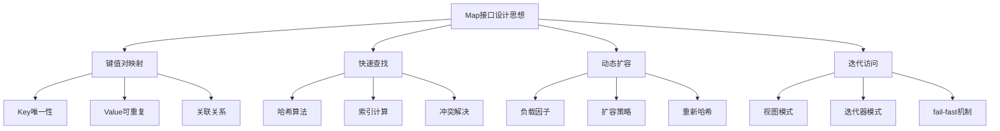

### 1.3 核心设计原则

1.高效性原则

- **O(1)平均时间复杂度**: 通过哈希算法实现常数时间的查找、插入、删除
- **空间时间权衡**: 通过负载因子平衡空间利用率和时间效率

2.灵活性原则

- **动态扩容**: 根据元素数量自动调整容量
- **null值支持**: 允许null键和null值，提高使用灵活性

一致性原则

- **哈希一致性**: 相同对象必须产生相同哈希值
- **equals一致性**: 哈希值相等的对象必须通过equals比较

### 1.5 整体架构图


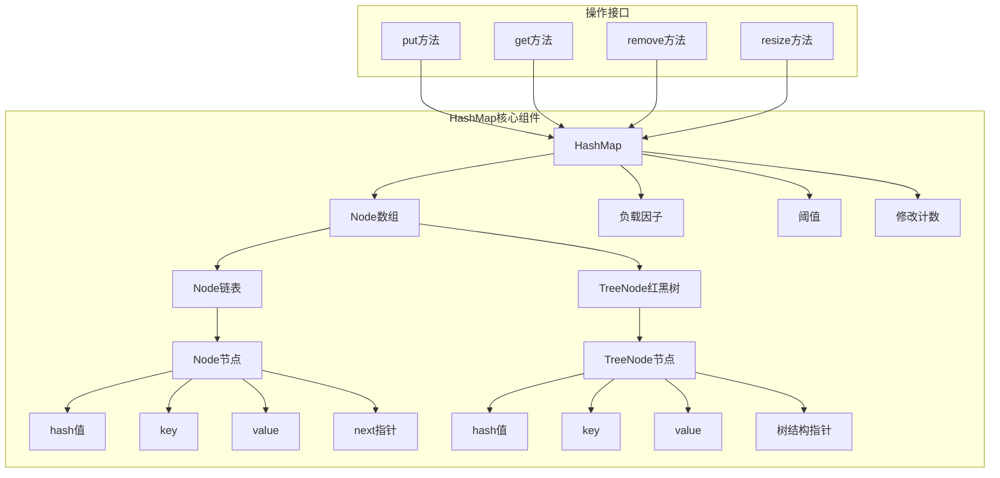

## 02.核心设计思路

### 2.1 解决核心痛点

数组查找痛点

```java
// 传统数组查找 - O(n)时间复杂度
for (int i = 0; i < array.length; i++) {
    if (array[i].key.equals(targetKey)) {
        return array[i].value;
    }
}
```

HashMap解决方案

```java
// HashMap查找 - O(1)平均时间复杂度
public V get(Object key) {
    Node<K,V> e;
    return (e = getNode(hash(key), key)) == null ? null : e.value;
}
```

### 2.2 核心数据结构

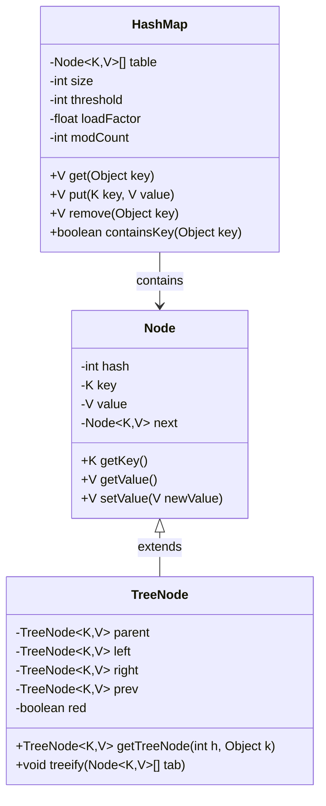

### 2.3 哈希算法设计

哈希函数

```java
static final int hash(Object key) {
    int h;
    return (key == null) ? 0 : (h = key.hashCode()) ^ (h >>> 16);
}
```

索引计算

```java
// 通过位运算快速计算索引
int index = (table.length - 1) & hash;
```

### 2.4 哈希冲突解决

```mermaid
graph TD
    A[哈希冲突] --> B[链地址法]
    B --> C[链表长度 < 8]
    B --> D[链表长度 >= 8]
    
    C --> E[使用链表]
    D --> F{数组长度 >= 64?}
    F -->|是| G[转换为红黑树]
    F -->|否| H[扩容数组]
    
    G --> I[O(log n)查找]
    E --> J[O(n)查找]
```

哈希冲突解决架构

```mermaid
graph TD
    A[哈希冲突] --> B{冲突处理策略}
    
    B --> C[开放地址法]
    B --> D[链地址法]
    B --> E[再哈希法]
    
    D --> F[HashMap采用]
    F --> G[链表结构]
    F --> H[红黑树优化]
    
    G --> I{链表长度 >= 8?}
    I -->|是| J{数组长度 >= 64?}
    I -->|否| K[保持链表]
    
    J -->|是| L[转换为红黑树]
    J -->|否| M[扩容数组]
    
    L --> N[O(log n)查找]
    K --> O[O(n)查找]
```

### 2.5 设计缺陷说明

线程安全问题

- **数据竞争**: 多线程并发修改可能导致数据不一致
- **死循环**: JDK 1.7中扩容时可能形成环形链表
- **数据丢失**: 并发put操作可能覆盖数据

性能退化问题

- **哈希碰撞攻击**: 恶意构造相同哈希值的key
- **内存碎片**: 频繁扩容可能导致内存碎片
- **缓存不友好**: 链表结构对CPU缓存不友好


## 03.插入元素设计

### 3.1 插入元素思路

**疑惑**：HashMap 的 put 操作流程看似简单，但隐藏了多少分支逻辑？

**答疑**：put 操作需要处理至少 6 种情况，这是 HashMap 最复杂的方法：

1. **首次插入**：table 为 null → 先初始化（懒加载设计）
2. **桶为空**：直接创建新节点
3. **桶首节点匹配**：key 相同 → 更新 value
4. **红黑树节点**：委托给 TreeNode.putTreeVal()
5. **链表遍历**：找到相同 key → 更新；到达末尾 → 追加新节点
6. **链表转树**：追加后长度 ≥ 8 → 考虑树化（数组长度 < 64 时优先扩容）

**关键设计决策**：

- **为什么链表转红黑树的阈值是 8？** 理想哈希分布下，链表长度服从泊松分布，长度达到 8 的概率约为 0.00000006（千万分之一）。设为 8 意味着只有极端冲突时才触发树化。
- **为什么退化阈值是 6 而不是 8？** 中间留 2 个缓冲，避免在 7~8 之间频繁树化/退化的抖动。
### 3.2 put操作流程

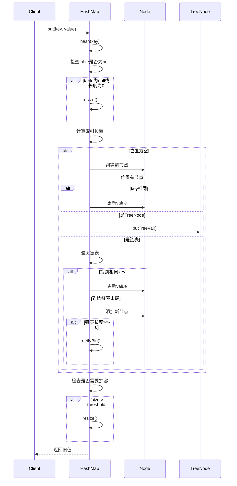

### 3.3 核心实现代码

核心实现代码分析，putVal方法

```java
final V putVal(int hash, K key, V value, boolean onlyIfAbsent, boolean evict) {
    Node<K,V>[] tab; Node<K,V> p; int n, i;
    
    // 1. 初始化或扩容
    if ((tab = table) == null || (n = tab.length) == 0)
        n = (tab = resize()).length;
    
    // 2. 计算索引，检查是否有冲突
    if ((p = tab[i = (n - 1) & hash]) == null)
        tab[i] = newNode(hash, key, value, null);
    else {
        Node<K,V> e; K k;
        
        // 3. 检查第一个节点
        if (p.hash == hash && ((k = p.key) == key || (key != null && key.equals(k))))
            e = p;
        // 4. 红黑树处理
        else if (p instanceof TreeNode)
            e = ((TreeNode<K,V>)p).putTreeVal(this, tab, hash, key, value);
        // 5. 链表处理
        else {
            for (int binCount = 0; ; ++binCount) {
                if ((e = p.next) == null) {
                    p.next = newNode(hash, key, value, null);
                    // 链表长度达到阈值，转换为红黑树
                    if (binCount >= TREEIFY_THRESHOLD - 1)
                        treeifyBin(tab, hash);
                    break;
                }
                if (e.hash == hash && ((k = e.key) == key || (key != null && key.equals(k))))
                    break;
                p = e;
            }
        }
        
        // 6. 更新已存在的key
        if (e != null) {
            V oldValue = e.value;
            if (!onlyIfAbsent || oldValue == null)
                e.value = value;
            afterNodeAccess(e);
            return oldValue;
        }
    }
    
    // 7. 修改计数和扩容检查
    ++modCount;
    if (++size > threshold)
        resize();
    afterNodeInsertion(evict);
    return null;
}
```

## 04.扩容机制设计

### 4.1 扩容机制思路


### 4.2 扩容触发条件

```java
// 当元素数量超过阈值时触发扩容
if (++size > threshold)
    resize();

// 阈值计算
threshold = capacity * loadFactor;
```

### 4.3 扩容流程

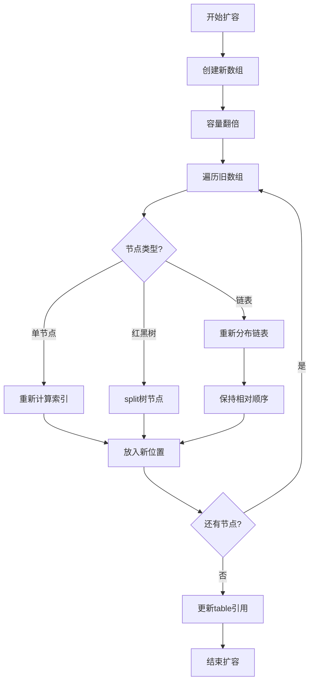

### 4.4 扩容机制架构

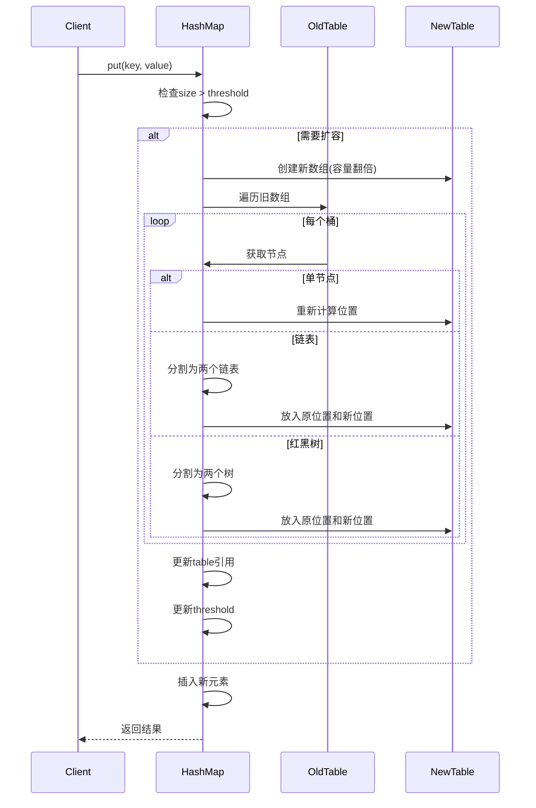

## 05.移除元素设计

### 5.1 移除元素思路

**疑惑**：HashMap 删除元素后，红黑树会退化回链表吗？什么时候退化？

**答疑**：是的。删除节点后，如果剩余节点数 ≤ `UNTREEIFY_THRESHOLD`（默认 6），红黑树会退化回链表。

退化的原因：红黑树虽然查找快（O(log N)），但每个 TreeNode 比普通 Node 多了 parent、left、right、prev、red 五个字段，占用更多内存。当节点数很少时，链表遍历的 O(N) 和红黑树的 O(log N) 差距不大，但链表的内存开销更小。

**删除流程**：
1. 定位桶 → 查找目标节点
2. 如果是 TreeNode → `removeTreeNode()`：红黑树删除 + 判断是否退化
3. 如果是链表节点 → 修改前驱的 next 指针
4. 更新 size 和 modCount
### 5.2 remove操作流程

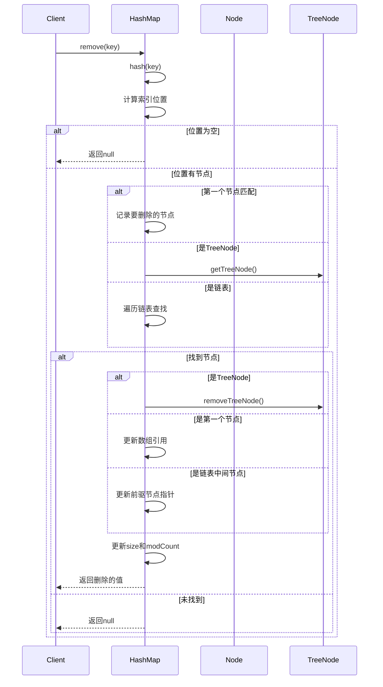

### 5.3 核心实现代码

```java
final Node<K,V> removeNode(int hash, Object key, Object value,
                           boolean matchValue, boolean movable) {
    Node<K,V>[] tab; Node<K,V> p; int n, index;
    
    // 1. 检查table和定位节点
    if ((tab = table) != null && (n = tab.length) > 0 &&
        (p = tab[index = (n - 1) & hash]) != null) {
        
        Node<K,V> node = null, e; K k; V v;
        
        // 2. 检查第一个节点
        if (p.hash == hash && ((k = p.key) == key || (key != null && key.equals(k))))
            node = p;
        else if ((e = p.next) != null) {
            // 3. 红黑树查找
            if (p instanceof TreeNode)
                node = ((TreeNode<K,V>)p).getTreeNode(hash, key);
            // 4. 链表查找
            else {
                do {
                    if (e.hash == hash &&
                        ((k = e.key) == key || (key != null && key.equals(k)))) {
                        node = e;
                        break;
                    }
                    p = e;
                } while ((e = e.next) != null);
            }
        }
        
        // 5. 删除找到的节点
        if (node != null && (!matchValue || (v = node.value) == value ||
                           (value != null && value.equals(v)))) {
            if (node instanceof TreeNode)
                ((TreeNode<K,V>)node).removeTreeNode(this, tab, movable);
            else if (node == p)
                tab[index] = node.next;
            else
                p.next = node.next;
            
            ++modCount;
            --size;
            afterNodeRemoval(node);
            return node;
        }
    }
    return null;
}
```

## 06.访问元素设计
### 6.1 访问元素思路


### 6.2 get操作实现

```mermaid
flowchart TD
    A[get(key)] --> B[计算hash值]
    B --> C[计算索引位置]
    C --> D{位置是否为空?}
    
    D -->|是| E[返回null]
    D -->|否| F[检查第一个节点]
    
    F --> G{key匹配?}
    G -->|是| H[返回value]
    G -->|否| I{是否有next节点?}
    
    I -->|否| E
    I -->|是| J{是TreeNode?}
    
    J -->|是| K[红黑树查找]
    J -->|否| L[链表遍历查找]
    
    K --> M{找到?}
    L --> M
    
    M -->|是| H
    M -->|否| E
```

### 6.3 核心实现代码

```java
final Node<K,V> getNode(int hash, Object key) {
    Node<K,V>[] tab; Node<K,V> first, e; int n; K k;
    
    // 1. 检查table并定位第一个节点
    if ((tab = table) != null && (n = tab.length) > 0 &&
        (first = tab[(n - 1) & hash]) != null) {
        
        // 2. 检查第一个节点
        if (first.hash == hash && 
            ((k = first.key) == key || (key != null && key.equals(k))))
            return first;
        
        // 3. 检查后续节点
        if ((e = first.next) != null) {
            // 红黑树查找
            if (first instanceof TreeNode)
                return ((TreeNode<K,V>)first).getTreeNode(hash, key);
            
            // 链表查找
            do {
                if (e.hash == hash &&
                    ((k = e.key) == key || (key != null && key.equals(k))))
                    return e;
            } while ((e = e.next) != null);
        }
    }
    return null;
}
```

### 6.4 查找性能分析

| 数据结构 | 平均时间复杂度 | 最坏时间复杂度 | 空间复杂度 |
|---------|---------------|---------------|-----------|
| 数组索引 | O(1) | O(1) | O(n) |
| 链表查找 | O(1) | O(n) | O(n) |
| 红黑树查找 | O(1) | O(log n) | O(n) |

## 07.线程安全性分析

### 7.1 数据竞争问题

```java
// 线程A和线程B同时执行put操作
Thread A: if ((p = tab[i = (n - 1) & hash]) == null)  // 检查位置为空
Thread B: if ((p = tab[i = (n - 1) & hash]) == null)  // 同样检查位置为空
Thread A: tab[i] = newNode(hash, key, value, null);   // 创建节点A
Thread B: tab[i] = newNode(hash, key, value, null);   // 覆盖节点A，数据丢失
```

### 7.2 扩容时的问题

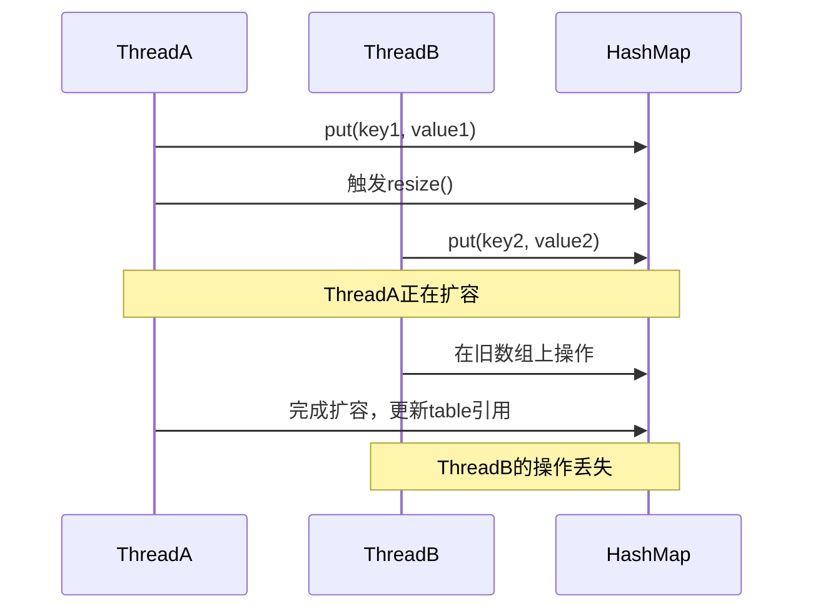

### 7.3 fail-fast机制

```java
// 迭代器检查并发修改
final class KeyIterator extends HashIterator implements Iterator<K> {
    public final K next() { 
        return nextNode().key; 
    }
}

abstract class HashIterator {
    int expectedModCount;  // 期望的修改次数
    
    HashIterator() {
        expectedModCount = modCount;
    }
    
    final Node<K,V> nextNode() {
        if (modCount != expectedModCount)
            throw new ConcurrentModificationException();
        // ...
    }
}
```

### 7.4 线程安全解决方案

Collections.synchronizedMap

```java
Map<String, String> syncMap = Collections.synchronizedMap(new HashMap<>());
```

ConcurrentHashMap

```java
Map<String, String> concurrentMap = new ConcurrentHashMap<>();
```

### 7.5 性能对比

| 方案 | 读性能 | 写性能 | 内存开销 | 适用场景 |
|------|--------|--------|----------|----------|
| HashMap | 最高 | 最高 | 最低 | 单线程 |
| synchronizedMap | 低 | 低 | 低 | 读写均衡，低并发 |
| ConcurrentHashMap | 高 | 中 | 中 | 高并发 |

## 08.容量管理设计

### 8.1 容量设计思路

**疑惑**：为什么 HashMap 的容量必须是 2 的幂？用素数不是冲突更少吗？

**答疑**：这是一个经典的 **性能 vs 均匀性** 权衡。

素数取模确实分布更均匀，但需要执行 **除法运算**（CPU 最慢的算术指令之一）。而 2 的幂允许用 **位运算** 替代取模：

```java
// 取模运算（慢）：index = hash % capacity
// 位运算（快）：index = hash & (capacity - 1)  // 当 capacity 是 2 的幂时等价
```

位运算比除法快 10-30 倍。HashMap 选择牺牲一点均匀性换取极致的定位速度，然后用 **扰动函数** `hash ^ (hash >>> 16)` 来弥补均匀性损失。

**tableSizeFor 算法**：保证任何输入都向上取到最近的 2 的幂。核心技巧是用 5 次右移+或运算，把最高位 1 后面的所有位都填充为 1，最后 +1 得到 2 的幂。

```
输入: 10 → 二进制 1010
  → 右移1: 1010 | 0101 = 1111
  → +1 = 10000 = 16
```
### 8.2 容量参数

```java
// 默认初始容量 - 必须是2的幂
static final int DEFAULT_INITIAL_CAPACITY = 1 << 4; // 16

// 最大容量
static final int MAXIMUM_CAPACITY = 1 << 30;

// 默认负载因子
static final float DEFAULT_LOAD_FACTOR = 0.75f;

// 树化阈值
static final int TREEIFY_THRESHOLD = 8;

// 反树化阈值
static final int UNTREEIFY_THRESHOLD = 6;

// 最小树化容量
static final int MIN_TREEIFY_CAPACITY = 64;
```

### 8.3 容量计算算法

tableSizeFor方法

```java
static final int tableSizeFor(int cap) {
    int n = cap - 1;
    n |= n >>> 1;   // 处理最高位
    n |= n >>> 2;   // 处理次高位
    n |= n >>> 4;   // 处理4位
    n |= n >>> 8;   // 处理8位
    n |= n >>> 16;  // 处理16位
    return (n < 0) ? 1 : (n >= MAXIMUM_CAPACITY) ? MAXIMUM_CAPACITY : n + 1;
}
```

算法原理

```mermaid
graph TD
    A[输入cap=10] --> B[n = cap-1 = 9]
    B --> C[n = 1001₂]
    C --> D[n |= n>>>1]
    D --> E[n = 1101₂]
    E --> F[n |= n>>>2]
    F --> G[n = 1111₂]
    G --> H[继续右移操作]
    H --> I[n = 1111₂ = 15]
    I --> J[返回 n+1 = 16]
```

### 8.4 扩容时机

```java
// 元素数量超过阈值时扩容
if (++size > threshold)
    resize();

// 阈值 = 容量 × 负载因子
threshold = (int)(capacity * loadFactor);
```

### 8.5 扩容流程图

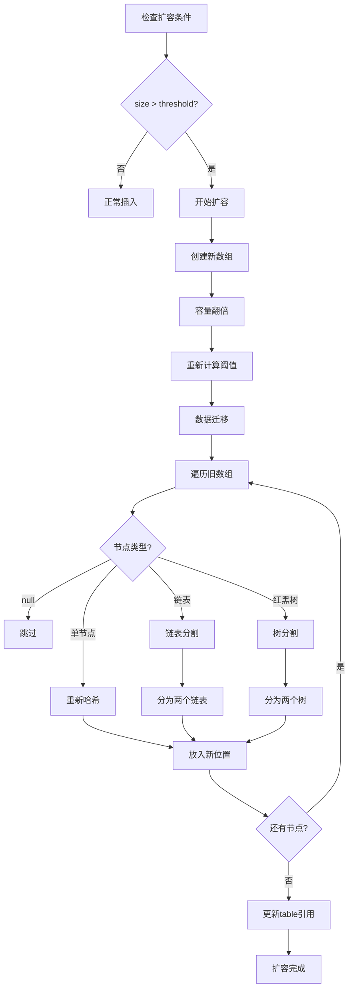

### 8.6 负载因子影响

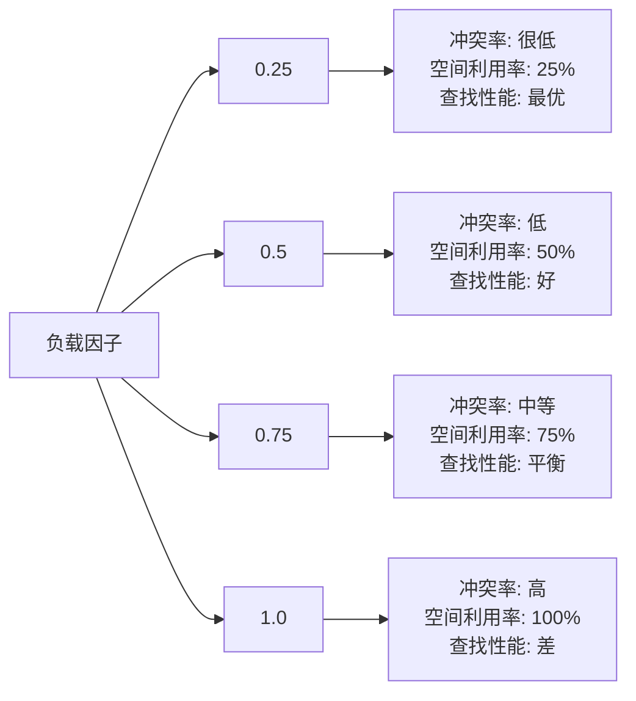

## 09.性能分析优化

### 9.1 时间复杂度分析

| 操作 | 平均情况 | 最坏情况 | 说明 |
|------|----------|----------|------|
| get | O(1) | O(log n) | 红黑树优化后最坏情况 |
| put | O(1) | O(log n) | 包含可能的扩容操作 |
| remove | O(1) | O(log n) | 红黑树优化后最坏情况 |
| containsKey | O(1) | O(log n) | 与get操作相同 |
| size | O(1) | O(1) | 直接返回size字段 |

### 9.2 空间复杂度分析

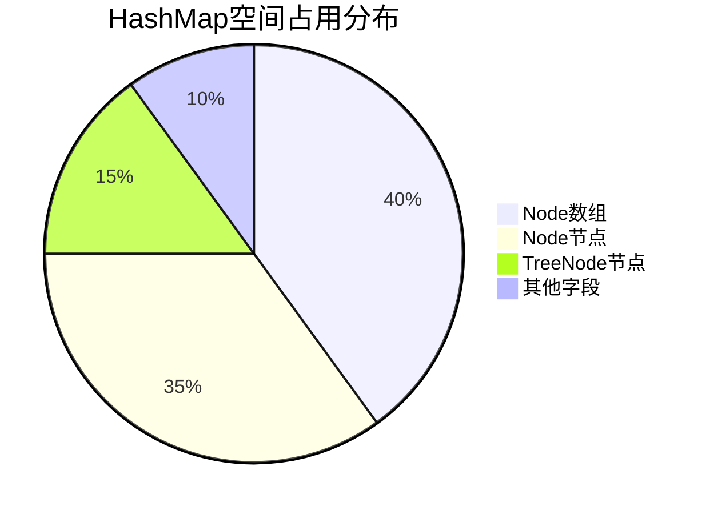

### 9.3 扩容性能影响

```java
// 扩容成本分析
public class ResizeCostAnalysis {
    // 扩容时间复杂度: O(n)
    // 其中n为当前元素数量
    
    // 摊销分析:
    // - 插入n个元素总成本: O(n)
    // - 扩容总成本: O(n)
    // - 平均每次插入成本: O(1)
}
```

## 10.设计缺陷与改进


### 10.1 线程安全问题

```java
// 问题: 并发修改导致数据不一致
// 解决方案: 使用ConcurrentHashMap或外部同步
Map<String, String> safeMap = new ConcurrentHashMap<>();
```

### 10.2 哈希碰撞攻击

```java
// 问题: 恶意构造相同哈希值的key
// 解决方案: 使用随机化哈希种子
static final int hash(Object key) {
    int h;
    return (key == null) ? 0 : (h = key.hashCode()) ^ (h >>> 16) ^ RANDOM_SEED;
}
```

### 10.3 内存泄漏风险

```java
// 问题: key对象无法被GC回收
// 解决方案: 使用WeakHashMap
Map<Object, String> weakMap = new WeakHashMap<>();
```

## 11.总结和建议


### 11.1 JDK版本历程

| JDK版本 | 主要改进 | 影响 |
|---------|----------|------|
| JDK 1.2 | 引入HashMap | 提供高性能Map实现 |
| JDK 1.4 | 优化哈希算法 | 减少哈希冲突 |
| JDK 1.7 | 优化扩容机制 | 提高扩容性能 |
| JDK 1.8 | 引入红黑树 | 解决最坏情况性能问题 |
| JDK 11+ | 字符串哈希优化 | 提高字符串key性能 |

Robin Hood Hashing

```java
// 改进的开放地址法，减少方差
public class RobinHoodHashMap<K, V> {
    // 每个元素记录距离理想位置的偏移
    // 插入时优先让偏移小的元素占据位置
}
```

Consistent Hashing

```java
// 分布式环境下的改进方案
public class ConsistentHashMap<K, V> {
    // 使用一致性哈希算法
    // 支持动态添加/删除节点
}
```

### 11.2 核心优势

- **高性能**: 平均O(1)时间复杂度
- **灵活性**: 支持null键值，动态扩容
- **优化策略**: 红黑树优化最坏情况
- **内存效率**: 合理的负载因子设计

### 11.3 设计权衡

- **时间vs空间**: 通过负载因子平衡
- **简单vs复杂**: 链表+红黑树混合结构
- **性能vs安全**: 非线程安全换取高性能

### 11.4 使用建议

容量规划

```java
// 根据预期元素数量设置初始容量
int expectedSize = 1000;
int initialCapacity = (int) (expectedSize / 0.75f) + 1;
Map<String, String> map = new HashMap<>(initialCapacity);
```

性能优化

```java
// 1. 合理设置初始容量，避免频繁扩容
// 2. 实现高质量的hashCode()方法
// 3. 避免在迭代过程中修改map
// 4. 考虑使用LinkedHashMap保持插入顺序
```

线程安全选择

```java
// 单线程: HashMap
Map<String, String> singleThreadMap = new HashMap<>();

// 低并发: Collections.synchronizedMap
Map<String, String> syncMap = Collections.synchronizedMap(new HashMap<>());

// 高并发: ConcurrentHashMap
Map<String, String> concurrentMap = new ConcurrentHashMap<>();
```
