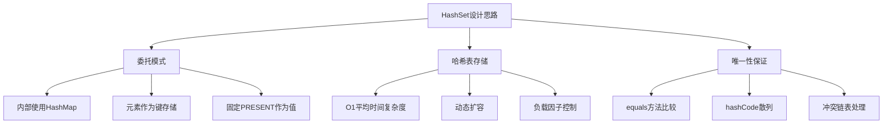
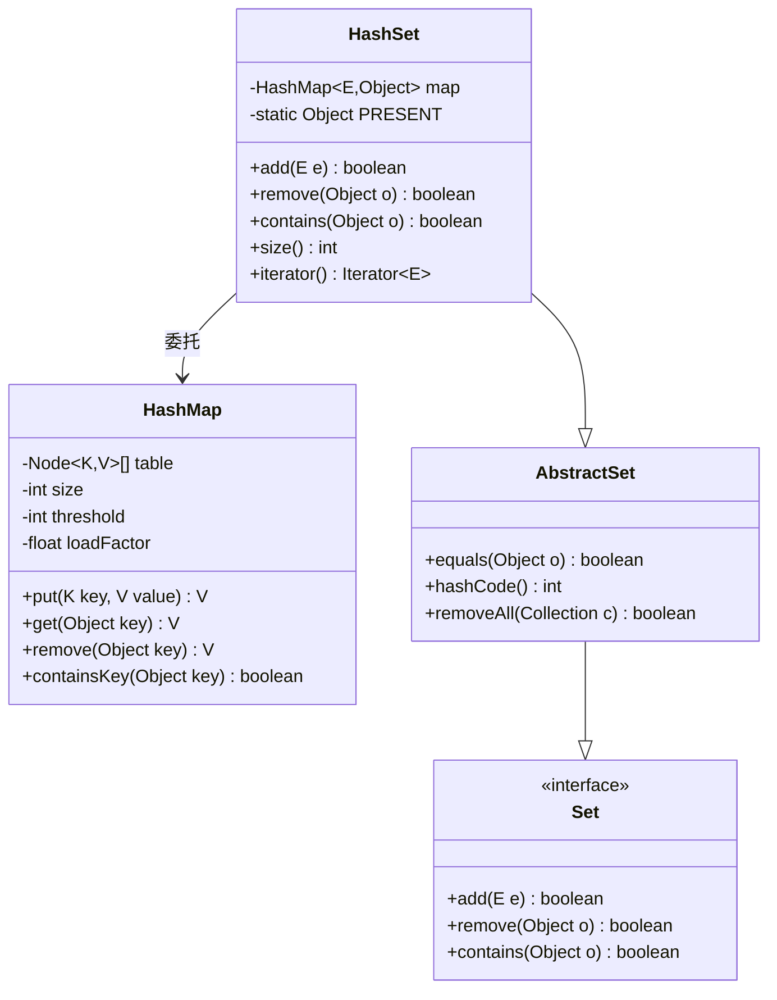
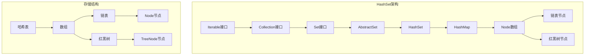
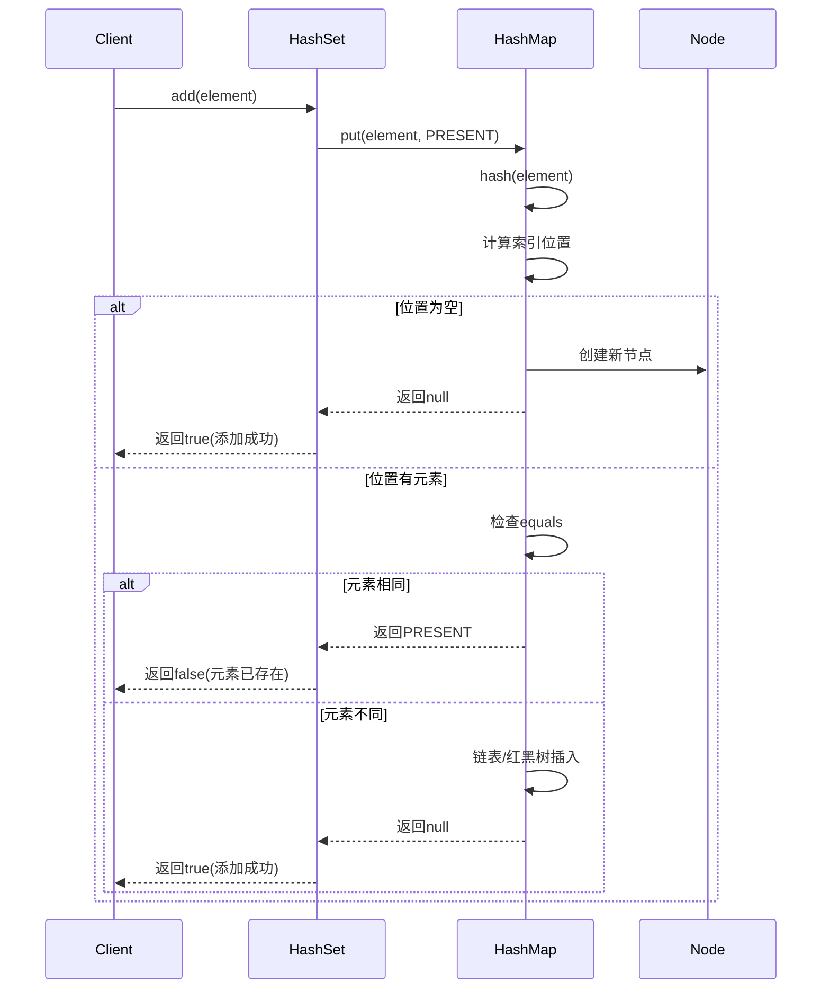
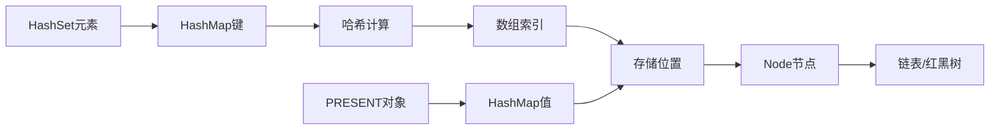
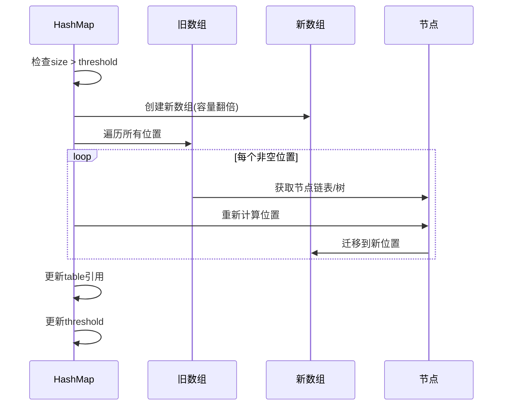
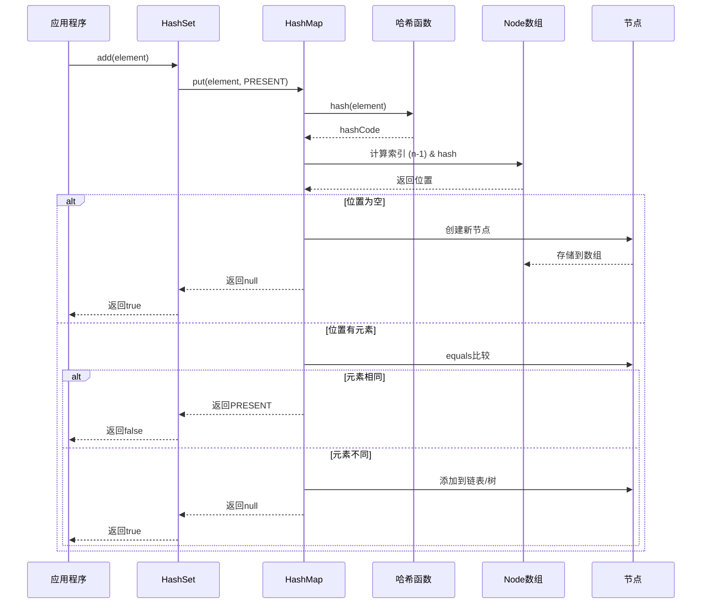
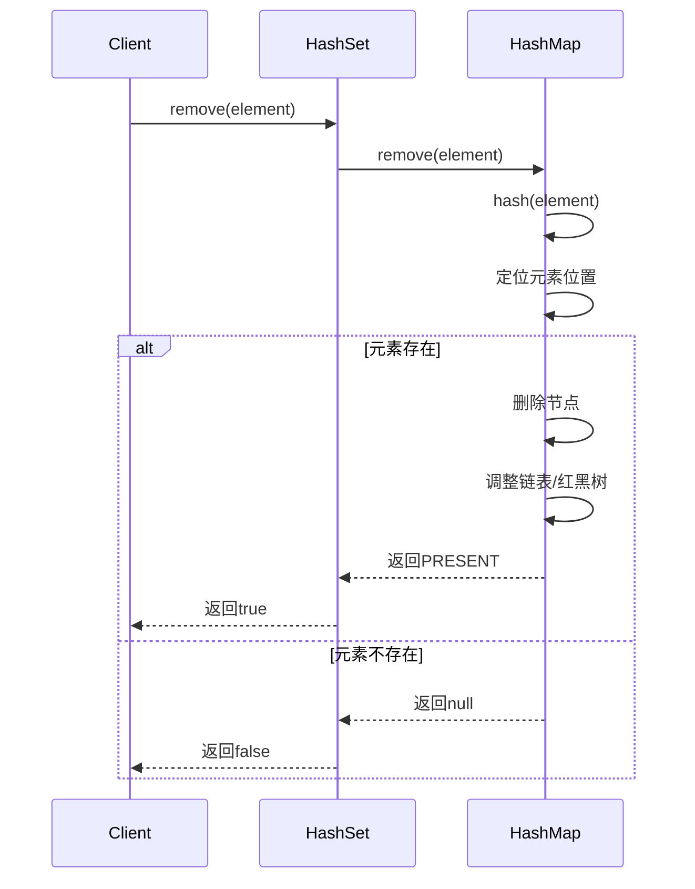
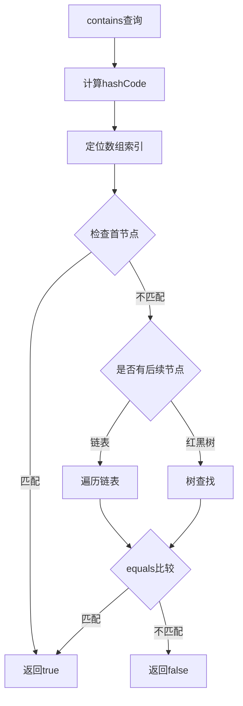
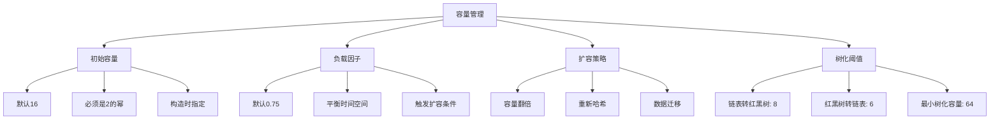

# 工业级Set设计思想
#### 目录介绍
- 01.Set核心思想
  - 1.1 核心设计理念
  - 1.2 核心设计思路
  - 1.3 类层次设计
  - 1.4 整体架构图
- 02.Set集合如何设计
  - 2.1 数据结构选型
  - 2.2 设计考虑点
  - 2.3 
  - 2.4 唯一性保证
  - 2.5 快速查找
  - 2.6 无序性特点
- 03.插入元素设计
  - 3.1 插入元素思路
  - 3.2 put操作流程
  - 3.3 核心实现代码
  - 3.4 数据存储机制
  - 3.5 扩容与迁移
  - 3.6 添加元素时序图
- 04.移除元素设计
  - 4.1 移除元素思路
  - 4.2 移除流程
  - 4.3 高效删除实现
  - 4.4 删除优化策略
- 05.访问元素设计
  - 5.1 访问元素思路
  - 5.2 查找机制
  - 5.3 核心查找代码
  - 5.4 迭代器设计
- 06.线程安全性分析
  - 6.1 非线程安全设计
  - 6.2 并发问题示例
  - 6.3 线程安全解决方案
- 07.容量管理设计
  - 7.1 容量参数
  - 7.2 容量管理策略
  - 7.3 性能优化
- 08.设计缺陷与不足
  - 8.1 线程安全问题
  - 8.2 内存开销
  - 8.3 哈希冲突性能退化
  - 8.4 无序性限制
  - 8.5 空间局部性差


## 01.Set核心思想

### 1.1 核心设计理念

HashSet是Java集合框架中Set接口的一个重要实现，基于HashMap的键值对存储机制实现。

通过分析源码可以发现，HashSet本质上是对HashMap的一个包装，利用HashMap的键来存储Set中的元素，而值则使用一个固定的PRESENT对象。

解决的痛点

1. **快速去重**: 传统数组或链表去重需要O(n²)时间复杂度，HashSet提供O(1)去重
2. **高效查找**: 避免线性搜索，通过哈希定位快速查找元素
3. **动态扩容**: 自动管理内存，无需手动调整容量
4. **标准化接口**: 实现Set接口，提供统一的集合操作API

### 1.2 核心设计思路



### 1.3 类层次设计



### 1.4 整体架构图



## 02.Set集合如何设计

### 2.1 数据结构选型

**疑惑**：实现 Set 集合有很多种选择——数组、链表、平衡树、哈希表，为什么 Java 选择用 HashMap 来实现 HashSet？

**答疑**：核心诉求是 **O(1) 时间复杂度的查找和去重**。逐一比较数据结构：

| 数据结构 | 查找 | 插入 | 删除 | 去重 | 选择理由 |
|---------|------|------|------|------|---------|
| 无序数组 | O(N) | O(1) | O(N) | O(N) | 去重太慢 |
| 有序数组 | O(log N) | O(N) | O(N) | O(log N) | 插入太慢 |
| 链表 | O(N) | O(1) | O(N) | O(N) | 查找太慢 |
| 平衡树 | O(log N) | O(log N) | O(log N) | O(log N) | 不够快 |
| **哈希表** | **O(1)** | **O(1)** | **O(1)** | **O(1)** | **最优** |

**论证**：HashMap 已经具备了哈希定位、冲突解决、动态扩容的完整能力。HashSet 只需要复用 HashMap 的 key 部分即可实现 Set 语义——这就是 **委托模式** 的典型应用。

### 2.2 设计考虑点

HashSet 的设计需要权衡以下因素：

1. **唯一性保证**：依赖 `hashCode()` + `equals()` 双重检查
2. **性能与内存**：HashMap 的 value 全部指向同一个 PRESENT 对象（节省内存）
3. **扩展性**：继承体系允许 LinkedHashSet（有序）、TreeSet（排序）等变种
4. **null 处理**：允许一个 null 元素（因为 HashMap 允许一个 null key）

### 2.3 Set 家族对比

**疑惑**：HashSet、LinkedHashSet、TreeSet 该怎么选？

**答疑**：

| 特性 | HashSet | LinkedHashSet | TreeSet |
|------|---------|---------------|---------|
| 底层结构 | HashMap | LinkedHashMap | TreeMap（红黑树） |
| 元素顺序 | 无序 | 插入顺序 | 自然排序/Comparator |
| 查找性能 | O(1) | O(1) | O(log N) |
| 插入性能 | O(1) | O(1) | O(log N) |
| 内存开销 | 中 | 较高（多维护链表） | 较高（树节点） |
| null 支持 | 允许1个 | 允许1个 | 不允许（排序需比较） |
| 典型场景 | 快速去重 | 需要保持插入顺序 | 需要排序的集合 |

**选择原则**：大多数场景用 HashSet；需要顺序用 LinkedHashSet；需要排序用 TreeSet。

### 2.4 唯一性保证

Set集合的核心思想是**元素唯一性**，即集合中不允许存在重复元素。HashSet通过以下机制保证唯一性：

```java
// HashSet中的核心字段
private transient HashMap<E,Object> map;
private static final Object PRESENT = new Object();

// 添加元素时的唯一性检查
public boolean add(E e) {
    return map.put(e, PRESENT)==null;
}
```

### 2.5 快速查找

基于哈希表的数据结构，提供O(1)平均时间复杂度的查找、插入和删除操作。

### 2.6 无序性特点

HashSet不保证元素的迭代顺序，这是为了获得最佳的性能表现。


## 03.插入元素设计

### 3.1 插入元素思路

**疑惑**：HashSet 的 add 方法只有一行代码 `map.put(e, PRESENT)==null`，这么简单？隐藏了什么？

**答疑**：看似简单，但这一行浓缩了 HashMap.put() 的完整流程：

1. **计算哈希**：`hash(key)` → 扰动函数混合高低位
2. **定位桶**：`(n-1) & hash` → 位运算取模
3. **检查冲突**：先比较 hash 值（快速排除），再比较 equals（精确确认）
4. **插入或跳过**：如果是新元素返回 null（add 返回 true），如果已存在返回旧 value PRESENT（add 返回 false）

**关键点**：HashSet 的去重完全依赖 `hashCode()` 和 `equals()` 的正确实现。如果重写了 equals 但没有重写 hashCode，会导致「逻辑相同的对象被当作不同元素」。

```java
// 经典错误示例
class Point {
    int x, y;
    
    @Override
    public boolean equals(Object o) {
        if (this == o) return true;
        if (!(o instanceof Point)) return false;
        Point p = (Point) o;
        return x == p.x && y == p.y;
    }
    // 忘记重写 hashCode!
}

Set<Point> set = new HashSet<>();
set.add(new Point(1, 2));
set.contains(new Point(1, 2));  // 可能返回 false！
```
### 3.2 put操作流程



### 3.3 核心实现代码

```java
public boolean add(E e) {
    // 调用HashMap的put方法，如果返回null说明是新元素
    return map.put(e, PRESENT)==null;
}
```

### 3.4 数据存储机制



### 3.5 扩容与迁移

当HashMap达到负载因子阈值时，会触发扩容：

1. **容量翻倍**: 新容量 = 旧容量 × 2
2. **重新哈希**: 所有元素重新计算位置
3. **数据迁移**: 将旧表数据迁移到新表

```java
// HashMap中的扩容逻辑
final Node<K,V>[] resize() {
    Node<K,V>[] oldTab = table;
    int oldCap = (oldTab == null) ? 0 : oldTab.length;
    int newCap = oldCap << 1; // 容量翻倍
    
    // 创建新表并迁移数据
    Node<K,V>[] newTab = (Node<K,V>[])new Node[newCap];
    // ... 数据迁移逻辑
}
```



### 3.6 添加元素时序图



## 04.移除元素设计
### 4.1 移除元素思路

**疑惑**：从 HashSet 中删除元素会触发什么操作？性能如何？

**答疑**：`remove()` 本质调用 `HashMap.remove()`，流程如下：

1. 计算元素的 hash 值
2. 定位到数组桶
3. 在桶内（链表或红黑树）查找目标节点
4. 找到后断开链接（链表修改 next 指针，红黑树执行删除再平衡）
5. size-- 并更新 modCount

**时间复杂度**：
- 平均 O(1)：大多数桶只有 1~2 个元素
- 最坏 O(log N)：红黑树中查找
- 删除后如果红黑树节点数 ≤ 6，会退化回链表（避免小规模数据维护树的开销）
### 4.2 移除流程




### 4.3 高效删除实现

```java
public boolean remove(Object o) {
    // 调用HashMap的remove方法，检查返回值是否为PRESENT
    return map.remove(o)==PRESENT;
}
```

### 4.4 删除优化策略

1. **链表删除**: O(n)时间复杂度，需要遍历链表
2. **红黑树删除**: O(log n)时间复杂度，树结构优化
3. **节点合并**: 删除后可能触发红黑树转链表

## 05.访问元素设计

### 5.1 访问元素思路

**疑惑**：Set 没有 get(index) 方法，怎么访问元素？

**答疑**：Set 的核心语义是 **集合成员关系判定**（contains），而非按索引访问。这是和 List 最根本的区别。

访问 Set 元素的方式：

1. **contains(Object o)**：O(1) 判断是否存在，这是 Set 最核心的操作
2. **迭代器遍历**：`for (E e : set)` 遍历所有元素
3. **转数组**：`set.toArray()` 后按索引访问
4. **Stream API**：`set.stream().filter(...)` 函数式访问

不提供 `get(index)` 是设计上的 **故意限制**——因为 HashSet 无序，索引访问没有语义意义。
### 5.2 查找机制



### 5.3 核心查找代码

```java
public boolean contains(Object o) {
    return map.containsKey(o);
}

// HashMap中的containsKey实现
public boolean containsKey(Object key) {
    return getNode(hash(key), key) != null;
}
```

### 5.4 迭代器设计

```java
public Iterator<E> iterator() {
    return map.keySet().iterator();
}
```

迭代器特性：

- **Fail-fast**: 检测并发修改，抛出ConcurrentModificationException
- **无序遍历**: 不保证元素顺序
- **支持删除**: 通过iterator.remove()安全删除

## 06.线程安全性分析

### 6.1 非线程安全设计

HashSet**不是线程安全**的，主要原因：

1. **无同步机制**: 没有使用synchronized或其他同步手段
2. **共享状态**: 多个线程可能同时修改内部HashMap
3. **数据竞争**: 并发修改可能导致数据不一致

### 6.2 并发问题示例

```java
// 线程安全问题示例
HashSet<String> set = new HashSet<>();

// 线程1
new Thread(() -> {
    for (int i = 0; i < 1000; i++) {
        set.add("Thread1-" + i);
    }
}).start();

// 线程2
new Thread(() -> {
    for (int i = 0; i < 1000; i++) {
        set.add("Thread2-" + i);
    }
}).start();
// 可能导致数据丢失或无限循环
```

### 6.3 线程安全解决方案

```java
// 方案1: Collections.synchronizedSet
Set<String> syncSet = Collections.synchronizedSet(new HashSet<>());

// 方案2: ConcurrentHashMap.newKeySet()
Set<String> concurrentSet = ConcurrentHashMap.newKeySet();

// 方案3: 手动同步
synchronized(set) {
    set.add(element);
}
```

## 07.容量管理设计
### 7.1 容量参数

```java
// HashMap中的容量相关常量
static final int DEFAULT_INITIAL_CAPACITY = 1 << 4; // 16
static final int MAXIMUM_CAPACITY = 1 << 30;
static final float DEFAULT_LOAD_FACTOR = 0.75f;
static final int TREEIFY_THRESHOLD = 8;
static final int UNTREEIFY_THRESHOLD = 6;
```

### 7.2 容量管理策略



### 7.3 性能优化


1. **预设容量**: 根据预期元素数量设置初始容量
```java
// 优化示例
int expectedSize = 1000;
HashSet<String> set = new HashSet<>(expectedSize * 4 / 3 + 1);
```

2. **负载因子调整**: 根据内存和性能需求调整
```java
// 更注重性能，牺牲内存
HashSet<String> set = new HashSet<>(16, 0.5f);
```

## 08.设计缺陷与不足

### 8.1 线程安全问题

**缺陷**: 非线程安全设计
- 并发修改可能导致数据不一致
- 扩容时可能出现无限循环
- 迭代器fail-fast机制不能保证线程安全

**影响**: 多线程环境下使用需要额外同步

### 8.2 内存开销

**缺陷**: 相对较高的内存开销
- 每个元素需要额外的PRESENT对象引用
- HashMap的Node节点包含hash、key、value、next字段
- 负载因子0.75意味着25%的空间浪费

**对比分析**:
```java
// HashSet内存结构
Element -> HashMap.Node {
    int hash;
    E key;           // 实际元素
    Object value;    // PRESENT对象
    Node<E,Object> next;
}

// 理想的Set内存结构
Element -> SetNode {
    int hash;
    E element;       // 实际元素
    SetNode next;
}
```

### 8.3 哈希冲突性能退化

**缺陷**: 哈希函数质量依赖

- 大量哈希冲突时性能退化到O(n)
- 虽然有红黑树优化，但仍不如理想的O(1)
- 恶意构造的hashCode可能导致拒绝服务攻击

### 8.4 无序性限制

**缺陷**: 不保证元素顺序

- 无法按插入顺序遍历
- 无法按自然顺序遍历
- 需要额外的LinkedHashSet或TreeSet来解决

### 8.5 空间局部性差

**缺陷**: 缓存友好性不佳

- 链表结构破坏空间局部性
- 频繁的指针跳转影响CPU缓存效率
- 相比数组结构的集合性能较差


