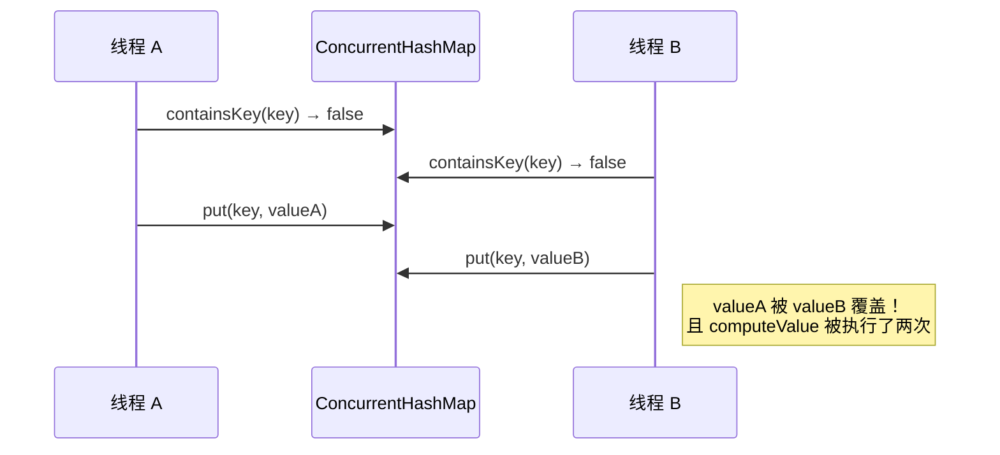
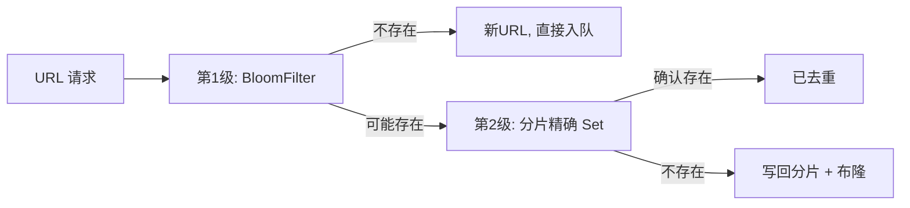

# 思考题和问答分析

> 本篇是数据结构算法专栏的收官总结，汇总前 19 篇的代表性思考题，给出结构化解题范式和参考答案要点。不是"标准答案大全"，而是"面试/面壁时该怎么想"的思维框架。


## 01. 从一个工作案例说起

### 1.1 面试现场：候选人的经典翻车

一位 5 年工龄的候选人面试 P6 岗位，面试官问：

> **"HashMap 的 put 扩容时，为什么新桶位置要么是原位置、要么是原位置 + oldCap？"**

候选人回答：

> "因为 HashMap 的容量是 2 的幂次方……然后……扩容的时候会 rehash……"

面试官追问："`(e.hash & oldCap) == 0` 这一行代码具体在判断什么？"

候选人沉默。

### 1.2 问题不在"记不住"，而在"没想通"

候选人不是不看源码，而是**只记结论，没画过图**：

```
oldCap = 16 = 0b010000
newCap = 32 = 0b100000

某个 hash 值：
  ...xxxxxx Y zzzz  （Y 是第 5 位，zzzz 是低 4 位）

旧 index = hash & (16-1) = hash & 0b01111 = zzzz          （只看低 4 位）
新 index = hash & (32-1) = hash & 0b11111 = Y zzzz        （多看了第 5 位 Y）

如果 Y = 0 → 新 index = 旧 index（留在原位）
如果 Y = 1 → 新 index = 旧 index + 16（移到新位）

"hash & oldCap" 正好提取的就是这个 Y 位！
```

**一旦画过这张图，这辈子都忘不了**。本篇的每一道题，都给你一张"让你忘不掉"的思维图。

### 1.3 本篇的打开方式

- **不是背答案**：每题先看"这类问题考什么"，再看"解题步骤"，最后才看"答案要点"。
- **不是穷举**：只挑 19 篇中最具代表性、最容易暴露理解深度的题目。
- **不是标准答案**：给出思考框架和关键要点，鼓励你补充自己的理解。


## 02. 内功题：时间与空间复杂度

### 2.1 代表题：以下代码的复杂度是多少？

```java
// 题1：ArrayList 头插 N 次
List<Integer> list = new ArrayList<>();
for (int i = 0; i < n; i++) list.add(0, i);

// 题2：LinkedList 下标遍历
for (int i = 0; i < linkedList.size(); i++) linkedList.get(i);

// 题3：HashMap 的 containsValue
map.containsValue(target);
```

### 2.2 解题步骤


### 2.3 答案要点

- **题 1**：ArrayList 每次 `add(0, e)` 要 `System.arraycopy` 移动全部已有元素，单次 O(N)，总共 **O(N²)**；10 万次 → 100 亿次元素搬移，实测约 1200ms。
- **题 2**：`LinkedList.get(i)` 是 O(N)，循环 N 次 → **O(N²)**；100 万元素会卡死在秒级以上。改为 `for (T t : linkedList)` → O(N)。
- **题 3**：`containsValue` 遍历所有桶的所有链表节点 → **O(N)**。对比 `containsKey` 是 O(1)。频繁按 value 查找应维护反向 Map。

### 2.4 延伸：均摊复杂度

```
ArrayList 的 add(e) 单次看可能触发扩容 → O(N)；
但 N 次 add 总共只触发 log N 次扩容，均摊到每次 → O(1)。

均摊分析的关键：用"总和 / 次数"而非"最坏单次"。
```


## 03. 设计题：HashMap 的扰动函数

### 3.1 代表题：为什么要 `h ^ (h >>> 16)`？

### 3.2 解题步骤

```
步骤 1：写出 HashMap 桶定位公式
  index = (n - 1) & hash

步骤 2：观察默认 n = 16 时 n-1 的二进制
  n - 1 = 0b00001111 → 只有低 4 位

步骤 3：思考"如果直接用 hashCode()"会怎样
  只有低 4 位参与，高 28 位完全浪费
  → 只要低 4 位相同的 key 就一定碰撞

步骤 4：思考"如何让高位信息也参与"
  把高 16 位异或到低 16 位
  → 一次异或，高低位都进入 index
```

### 3.3 答案要点

- 用"一次异或"让高位信息参与低位运算，**零成本**大幅降低碰撞率。
- 只做 16 位而不是每位都扰动，是**性能 vs 质量**的权衡：16 位足够降低碰撞，再多就是浪费 CPU。
- JDK 8 的扰动只有一步，JDK 7 有多步（`h ^= (h >>> 20) ^ (h >>> 12); h ^ (h >>> 7) ^ (h >>> 4)`）——简化的依据是"红黑树树化机制已经兜底"。

### 3.4 进阶：如果 n 不是 2 的幂呢？

```
index = hash % n    ← 取模，CPU 代价比 & 高一个数量级
       ↓
所以 HashMap 强制 n 是 2 的幂，就是为了用 & 代替 %。
扩容也只翻倍，保持 2 的幂。
```


## 04. 并发题：ConcurrentHashMap 的原子性

### 4.1 代表题：下面代码为什么并发不安全？

```java
if (!map.containsKey(key)) {
    map.put(key, computeValue(key));
}
```

### 4.2 解题步骤



### 4.3 答案要点

- **ConcurrentHashMap 的每个方法都是原子的**，但**复合调用不是原子的**——`containsKey + put` 两步之间，其他线程可以插入。
- 正确写法：

  ```java
  map.computeIfAbsent(key, k -> computeValue(k));
  ```

  同一 key 的桶级 synchronized 保证 lambda **只执行一次**，解决缓存击穿。

- 更深层：`computeIfAbsent` 内部 `synchronized (f)` 锁住桶头节点，其他 key 的并发写不受影响。

### 4.4 进阶：computeIfAbsent 能在 lambda 里递归调用自己吗？

- **不能**。lambda 里再调用 `map.computeIfAbsent(sameKey, ...)` 会**自死锁或抛 IllegalStateException**（JDK 14+ 增加检测）。
- 如果需要链式依赖，先查后写，或者用 `get + putIfAbsent` 组合。


## 05. 内存题：LinkedList 的真实代价

### 5.1 代表题：100 万个 Integer 在 ArrayList 和 LinkedList 中各占多少内存？

### 5.2 解题步骤

```
步骤 1：拆解单元素的组成
  ArrayList:
    element[] 槽位 (8B 引用) + Integer 对象 (16B 头 + 4B value + 4B 对齐 = 24B)
    单元素 = 8 + 24 = 32B

  LinkedList.Node:
    对象头 16B + prev 8B + next 8B + item 8B + 对齐 = 40B
    + Integer 24B
    单元素 = 40 + 24 = 64B

步骤 2：乘以规模 + 加上容器开销
  ArrayList: 100万 × 32B = 32 MB + 扩容冗余 25% ≈ 40 MB
  LinkedList: 100万 × 64B ≈ 64 MB（无扩容冗余）

步骤 3：得出结论
  LinkedList 比 ArrayList 多用 60% 内存。
  规模越大差距越绝对。
```

### 5.3 答案要点

- **LinkedList 每节点 40B 纯开销**，是 ArrayList 的 5 倍（8B/槽位）。
- **Integer 装箱**是另一重开销，基本类型集合考虑 Eclipse Collections / fastutil 的 `IntArrayList`。
- **小数据量 < 1000** 时一切都不重要，代码可读性优先。


## 06. 设计题：用 LinkedHashMap 5 行实现 LRU

### 6.1 代表题：为什么 `removeEldestEntry` 能让 LRU 代码优雅到 5 行？

```java
public class LRUCache<K, V> extends LinkedHashMap<K, V> {
    private final int maxSize;
    public LRUCache(int maxSize) {
        super(maxSize, 0.75f, true);  // accessOrder = true
        this.maxSize = maxSize;
    }
    @Override protected boolean removeEldestEntry(Map.Entry<K, V> eldest) {
        return size() > maxSize;
    }
}
```

### 6.2 答题框架

```
问题抽象：
  LRU = HashMap 的 O(1) 查 + 双向链表的 O(1) 淘汰

现成材料：
  LinkedHashMap 已经 = HashMap + 双向链表
  accessOrder=true 让 get/put 自动把节点移到尾部

关键钩子：
  每次 put 后，HashMap 回调 removeEldestEntry(head)
  返回 true 就删除链表头（最久未访问）

结果：
  get → O(1)
  put → O(1)
  淘汰 → O(1)
  总代码 5 行
```

### 6.3 答案要点

- **复用 > 重新发明**：与其手写双链表 + HashMap，不如继承 LinkedHashMap。
- **模板方法模式**：父类定义流程（put → 判断 → 删除），子类只实现决策点。
- **缺陷**：不是线程安全；生产环境推荐 Caffeine（W-TinyLFU，命中率更高）。


## 07. 跨语言题：Go 为什么没有 LinkedList？

### 7.1 代表题：Go 标准库没有 Set / LinkedList / TreeMap，为什么？

### 7.2 答题要点

- **设计哲学**：Go 强调"最小惊讶"和"少即是多"，不在标准库堆砌。
- **实用替代**：
  - Set → `map[T]struct{}`（struct{} 零字节）
  - LinkedList → `container/list`（标准库但很少人用，实战用 slice 替代）
  - TreeMap → 无内置，用 `github.com/google/btree` 或排序 slice + 二分
- **性能优先**：Go 的 slice（动态数组）已经覆盖 90% 场景，多一种数据结构 = 多一种选择困难 + 多一份维护成本。
- **对比 Java**：Java 集合框架教科书级别，但也背负了 Hashtable / Vector / Stack 等历史包袱。

### 7.3 两种哲学的取舍

| 哲学 | 优势 | 劣势 |
|------|------|------|
| 内置丰富（Java） | 开箱即用、标准化 API | 历史包袱、设计失误难纠正 |
| 保持简洁（Go） | 语言小、学习曲线低 | 社区碎片化、同一个需求多种轮子 |


## 08. 容量题：HashMap 初始容量怎么算？

### 8.1 代表题：要存 10000 个元素，HashMap 初始容量填多少？

### 8.2 公式推导

```
核心约束：size ≤ capacity × loadFactor 时不扩容
即：capacity ≥ size / loadFactor

initialCapacity = (int) (expectedSize / 0.75f) + 1
                = (int) (10000 / 0.75f) + 1
                = 13334

HashMap 会自动向上取 2 的幂 → 16384
此时 threshold = 16384 × 0.75 = 12288，足够放 10000 个元素，零扩容。
```

### 8.3 一行优雅写法

```java
// JDK 19+
Map<String, Object> map = HashMap.newHashMap(10000);

// Guava
Map<String, Object> map = Maps.newHashMapWithExpectedSize(10000);

// 手写
Map<String, Object> map = new HashMap<>((int) (10000 / 0.75f) + 1);
```


## 09. 架构题：100 亿 URL 如何去重？

### 9.1 代表题：URL 去重单机 HashSet 放不下（~480GB），怎么办？

### 9.2 三层方案



### 9.3 参数设计

| 层级 | 结构 | 容量 | 内存 | 假阳/假阴 |
|------|------|------|------|----------|
| 1 | BloomFilter（1% 误判） | 100 亿 | ~12 GB（单机） | 可能假阳性 |
| 2 | 分片 HashSet（10 台） | 10 亿/台 | ~48 GB/台 | 精确 |
| 3 | 可选：HBase/RocksDB | 全量 | 磁盘 | 精确持久化 |

### 9.4 答案要点

- **BloomFilter 永不漏判**（false negative = 0），只会假阳性，完美适配"先判再查"场景。
- **分片 Hash + 一致性哈希**：扩容时只迁移 1/N 的数据。
- **HyperLogLog**：如果只要**计数**（有多少不同 URL）而不是"是否存在"，HLL 只要 KB 级内存。


## 10. 本篇收获与案例回扣

回到开篇候选人的**HashMap 扩容**翻车：

| 问题 | 解题范式 | 本篇章节 |
|------|---------|---------|
| 为什么 `hash & oldCap` 判断新位置？ | 画二进制图，盯住多出来的那一位 | §3.2 |
| 复合操作为什么非原子？ | 画 sequence diagram，看两步之间的"时间缝" | §4.2 |
| 内存怎么估？ | 拆分对象头+字段+对齐，乘规模加冗余 | §5.2 |
| 容量怎么算？ | 从 threshold 公式反推 | §8.2 |

**本篇核心收获**：

- **答题四板斧**：识别结构 → 定位操作成本 → 累加到规模 → 给量化结论。
- **把抽象画成图**：二进制位图、sequence 时序、桶-链-树结构图——一旦画过，终生不忘。
- **背后的设计哲学**：复用优于重造（LRU 5 行）、简洁优于齐全（Go 无 Set）、零成本优于优雅（异或扰动）。
- **工程取舍矩阵**：时间 / 空间 / 并发 / 可读性 / 一致性 / 持久化，挑两三个做主战场，其他做牺牲。
- **架构级思维**：单机装不下 → 分层（布隆+精确）→ 分片（水平扩展）→ 降级（HLL 估算）。


## 11. 思考题（给你自己命题）

> 真正学通的标志不是"我会答别人的题"，而是"我能出好题"。

**1. 出一道你认为能筛掉 90% 候选人的 HashMap 题**：题目要让"只背 API 的人"必死，让"画过图的人"秒杀。附上你的解题思路和评分标准。

**2. 写一篇"我犯过的最蠢的集合选型错误"**：不要只写错误本身，要分析"当初为什么觉得对"、"怎么被发现"、"修复后指标变化"。

**3. 挑选 19 篇中的任意一篇**，给它出 3 道由浅入深的思考题，覆盖"记忆 / 理解 / 应用 / 分析 / 评价 / 创造"这 6 个认知层级中的至少 4 个。

**4. 挑一个你熟悉的业务系统**，画出它用到的所有集合，标注每个集合的选型理由，指出至少一个"现在看不太合理"的选型，提出优化方案。

**5. 面试官视角**：假设你要面试一个 5 年经验的候选人，只能问 3 道数据结构问题，你会问哪 3 道？为什么？用"考察点-区分度-参考答案"三元组写出。


## 12. 课后作业

### 作业 1：建立你的"错题本"

把本专栏 19 篇每篇的思考题抽出来，做成一张 Notion / 飞书文档，包含：

- 题干 + 所属章节 + 核心考点
- 你第一次的答题（不要看答案）
- 参考答案要点
- 你的反思与补充

坚持做完所有 100+ 道题，你的数据结构功底会直接上一个台阶。

### 作业 2：画 20 张"让你忘不掉"的图

选你最容易忘的 20 个知识点，每个画一张图：

- HashMap 扰动函数的位运算图
- ConcurrentHashMap JDK8 put 时序图
- LinkedHashMap LRU 双链表状态变化图
- 红黑树 5 规则示意图
- ArrayList 扩容前后数组布局图
- ……

画完后贴在工位或 wiki，自测"不看图能说清原理吗"。

### 作业 3：面试 / 被面试

找一位同事或朋友，互相用本专栏的题库做**白板面试**。你出题、他答题，反之亦然。重点关注：

- 他是"背答案"还是"现场推导"？
- 你能否仅凭"他的解题步骤"判断理解深度？
- 如何用一个追问暴露"只记结论没想通"？

三轮模拟之后，你会对"如何考察数据结构功底"有全新的体会。

### 作业 4：LeetCode 终极刷题清单（Top 50）

> 覆盖本专栏所有核心结构，按**由易到难**排序。要求每题都能"口述复杂度 + 画出数据流"。

**数组 & 字符串**：1, 15, 11, 42, 238, 560, 76, 76, 4, 239
**链表**：206, 21, 141, 142, 25, 92, 148, 160
**栈 & 队列**：20, 155, 232, 739, 84, 85, 496, 503
**Hash**：1, 49, 128, 138, 146, 460, 380, 3
**树 & 堆**：94, 104, 102, 236, 297, 215, 347, 295
**递归 & 回溯**：46, 78, 39, 51, 22, 79, 140

要求：每刷完 10 题，写一篇"我踩过的坑"短记，半年后回看你会感谢自己。

---

至此，数据结构算法专栏全部 20 篇落幕。**真正的成长不在读完，而在接下来你写的每一行代码里。**
