# 二叉树深入浅出技术文档

## 目录
- [1. 什么是二叉树](#1-什么是二叉树)
- [2. 为什么需要二叉树](#2-为什么需要二叉树)
- [3. 二叉树核心设计思想](#3-二叉树核心设计思想)
- [4. 二叉树的分类与特性](#4-二叉树的分类与特性)
- [5. 二叉树的应用场景](#5-二叉树的应用场景)
- [6. 二叉树的遍历算法](#6-二叉树的遍历算法)
- [7. 二叉树元素添加和移除](#7-二叉树元素添加和移除)
- [8. 二叉树效率分析](#8-二叉树效率分析)

## 1. 什么是二叉树

### 1.1 二叉树的定义

二叉树（Binary Tree）是一种树形数据结构，其中每个节点最多有两个子节点，通常称为左子节点和右子节点。二叉树是递归定义的：一个二叉树要么是空树，要么是由一个根节点和两个互不相交的、分别称为根的左子树和右子树的二叉树组成。

### 1.2 二叉树的基本结构

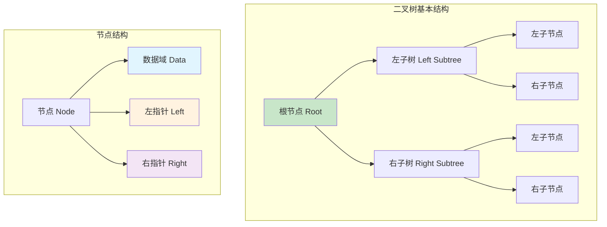

### 1.3 二叉树的基本概念

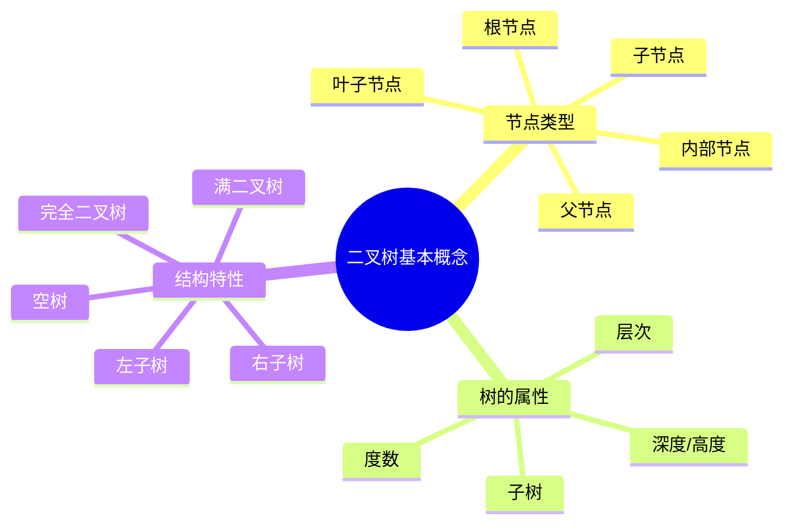

### 1.4 二叉树的节点关系

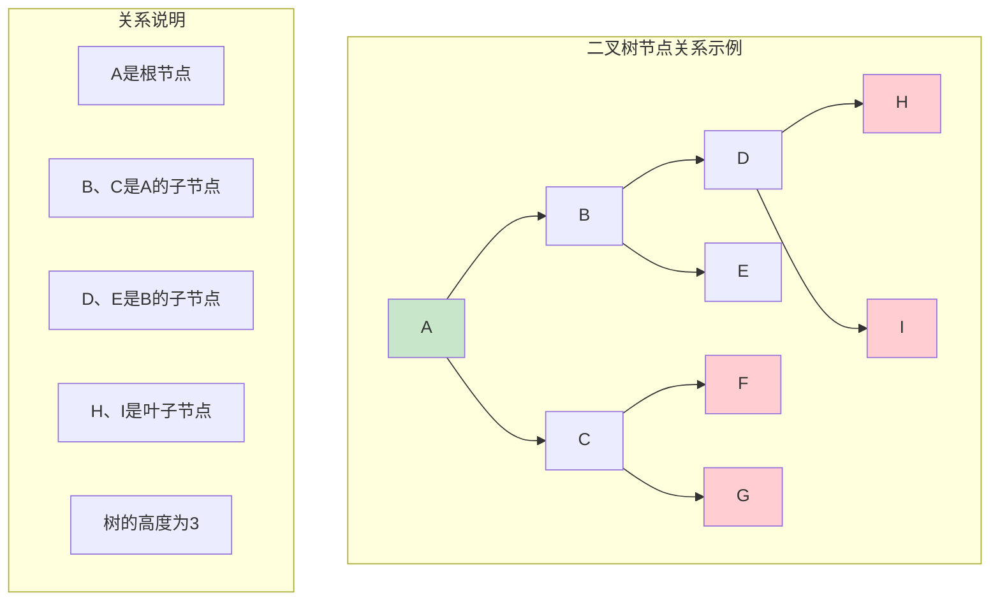

### 1.5 二叉树的数学性质

```mermaid
graph LR
    subgraph "二叉树数学性质"
        A[性质1] --> A1[第i层最多有2^(i-1)个节点]
        B[性质2] --> B1[深度为k的二叉树最多有2^k-1个节点]
        C[性质3] --> C1[n个节点的二叉树高度至少为⌈log₂(n+1)⌉]
        D[性质4] --> D1[叶子节点数 = 度为2的节点数 + 1]
        E[性质5] --> E1[完全二叉树的高度为⌊log₂n⌋+1]
    end
    
    style A1 fill:#c8e6c9
    style B1 fill:#e1f5fe
    style C1 fill:#fff3e0
    style D1 fill:#f3e5f5
    style E1 fill:#fce4ec
```

## 2. 为什么需要二叉树

### 2.1 线性结构的局限性

```mermaid
graph TB
    subgraph "线性结构局限性"
        A[数组] --> A1[查找效率低 O(n)]
        A --> A2[插入删除成本高]
        A --> A3[大小固定]
        
        B[链表] --> B1[随机访问困难]
        B --> B2[查找效率低 O(n)]
        B --> B3[额外指针开销]
        
        C[栈/队列] --> C1[访问受限]
        C --> C2[只能特定顺序操作]
        C --> C3[应用场景有限]
    end
    
    subgraph "二叉树优势"
        D[平衡查找效率]
        E[灵活的插入删除]
        F[层次化组织]
        G[递归结构天然]
    end
    
    style A1 fill:#ffcdd2
    style B1 fill:#ffcdd2
    style C1 fill:#ffcdd2
    style D fill:#c8e6c9
    style E fill:#c8e6c9
    style F fill:#c8e6c9
    style G fill:#c8e6c9
```

### 2.2 二叉树解决的核心问题

```mermaid
flowchart TD
    A[二叉树解决的问题] --> B[效率问题]
    A --> C[组织问题]
    A --> D[扩展问题]
    A --> E[算法问题]
    
    B --> B1[查找效率 O(log n)]
    B --> B2[插入删除效率]
    B --> B3[空间利用率]
    
    C --> C1[层次化数据组织]
    C --> C2[分类存储]
    C --> C3[关系表达]
    
    D --> D1[动态扩展]
    D --> D2[灵活调整]
    D --> D3[适应性强]
    
    E --> E1[分治算法支持]
    E --> E2[递归算法天然]
    E --> E3[搜索算法优化]
    
    style B1 fill:#c8e6c9
    style C1 fill:#e1f5fe
    style D1 fill:#fff3e0
    style E1 fill:#f3e5f5
```

### 2.3 二叉树在计算机科学中的重要性

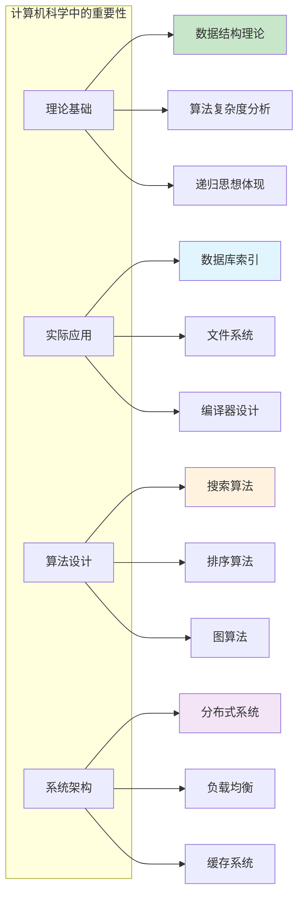

## 3. 二叉树核心设计思想

### 3.1 分治思想

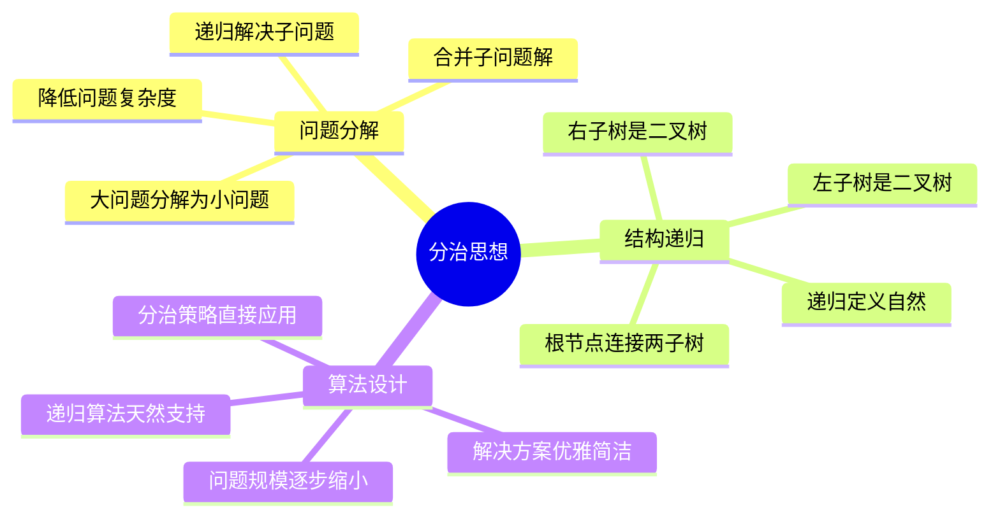

### 3.2 层次化组织思想

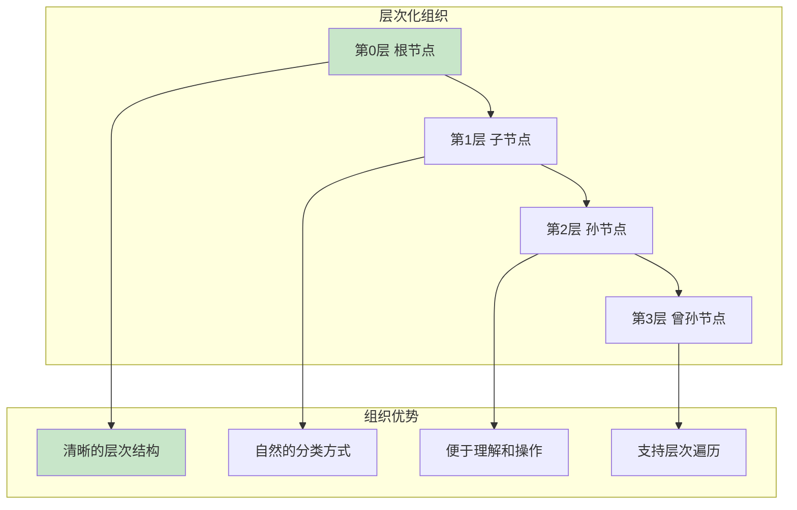

### 3.3 平衡与优化思想

```mermaid
flowchart TD
    A[平衡与优化] --> B[结构平衡]
    A --> C[操作优化]
    A --> D[空间优化]
    A --> E[时间优化]
    
    B --> B1[AVL树自平衡]
    B --> B2[红黑树近似平衡]
    B --> B3[B树多路平衡]
    
    C --> C1[查找路径最短]
    C --> C2[插入删除高效]
    C --> C3[遍历顺序优化]
    
    D --> D1[紧凑存储]
    D --> D2[指针优化]
    D --> D3[内存局部性]
    
    E --> E1[O(log n)复杂度]
    E --> E2[缓存友好访问]
    E --> E3[并行处理支持]
    
    style B1 fill:#c8e6c9
    style C1 fill:#e1f5fe
    style D1 fill:#fff3e0
    style E1 fill:#f3e5f5
```

### 3.4 抽象与封装思想

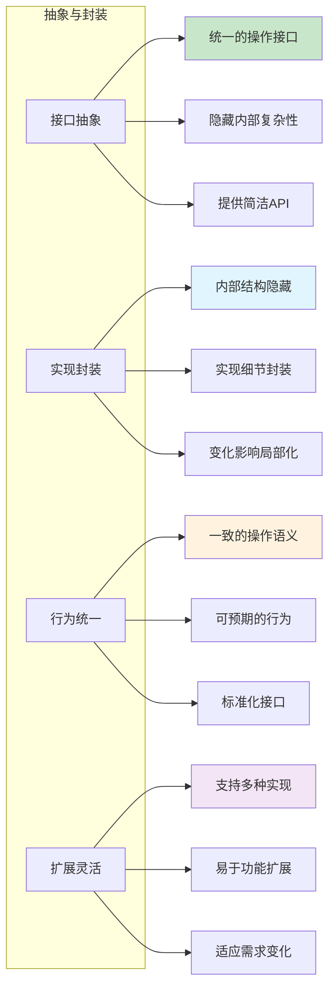

## 4. 二叉树的分类与特性

### 4.1 二叉树分类概览

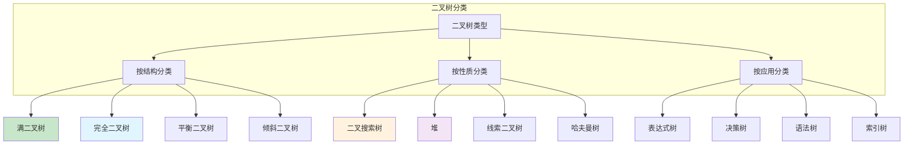

### 4.2 满二叉树

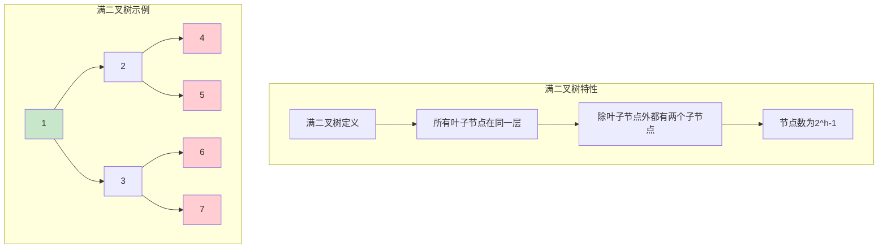

### 4.3 完全二叉树

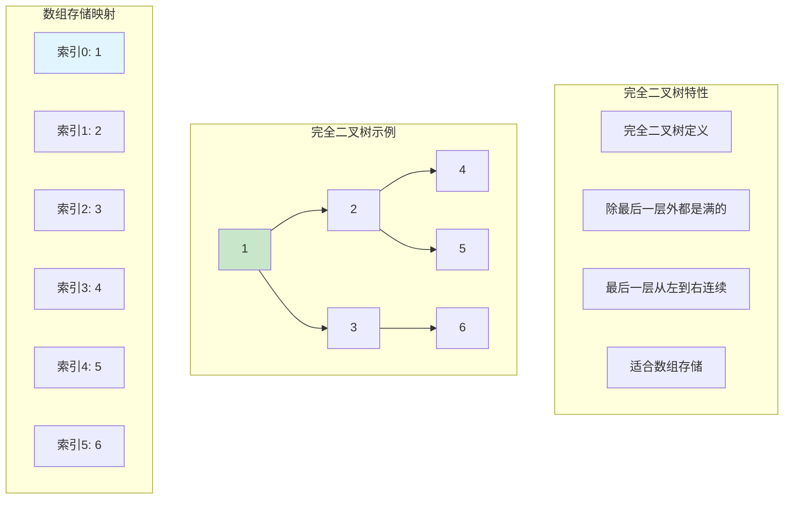

### 4.4 二叉搜索树(BST)

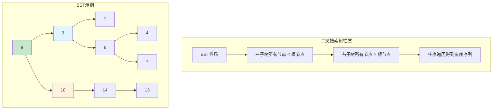

### 4.5 平衡二叉树(AVL树)

```mermaid
graph TB
    subgraph "AVL树特性"
        A[AVL树定义]
        B[任意节点的左右子树高度差≤1]
        C[自动保持平衡]
        D[查找效率O(log n)]
    end
    
    subgraph "平衡因子"
        E[平衡因子 = 左子树高度 - 右子树高度]
        F[平衡因子 ∈ {-1, 0, 1}]
        G[失衡时进行旋转调整]
    end
    
    subgraph "旋转类型"
        H[LL旋转 - 右旋]
        I[RR旋转 - 左旋]
        J[LR旋转 - 左右旋]
        K[RL旋转 - 右左旋]
    end
    
    A --> B
    B --> C
    C --> D
    E --> F
    F --> G
    
    style D fill:#c8e6c9
    style G fill:#e1f5fe
```

### 4.6 红黑树

```mermaid
graph TB
    subgraph "红黑树性质"
        A[红黑树规则]
        B[节点是红色或黑色]
        C[根节点是黑色]
        D[叶子节点(NIL)是黑色]
        E[红色节点的子节点必须是黑色]
        F[任一节点到叶子的路径包含相同数量的黑色节点]
    end
    
    A --> B
    B --> C
    C --> D
    D --> E
    E --> F
    
    subgraph "红黑树优势"
        G[近似平衡]
        H[插入删除效率高]
        I[最坏情况性能保证]
        J[广泛应用于标准库]
    end
    
    style C fill:#333
    style D fill:#333
    style G fill:#c8e6c9
    style H fill:#e1f5fe
```

### 4.7 堆

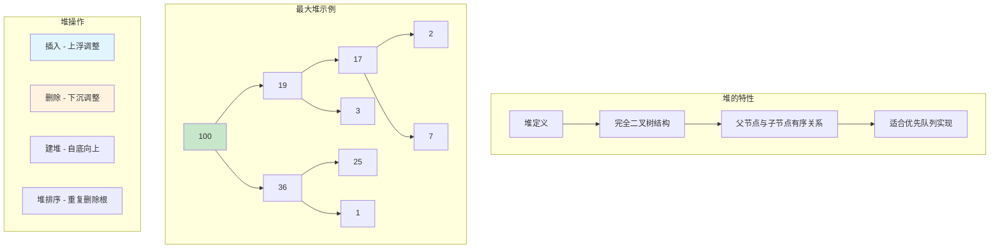

## 5. 二叉树的应用场景

### 5.1 数据库索引

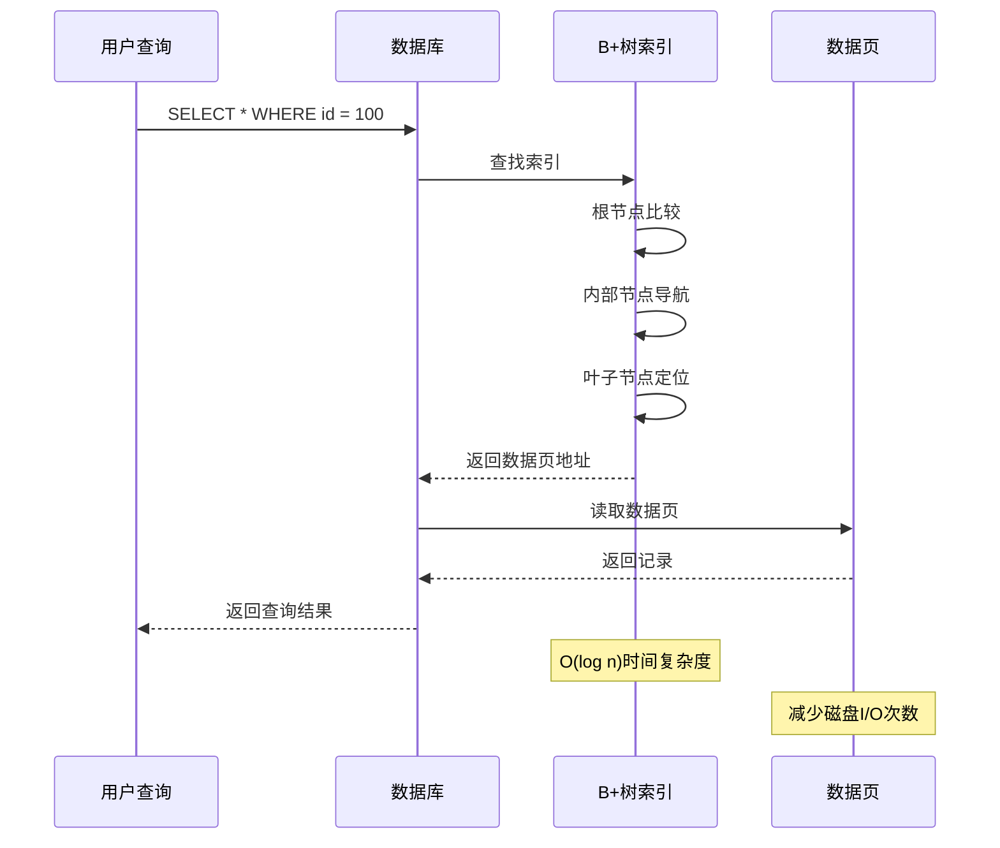

### 5.2 文件系统

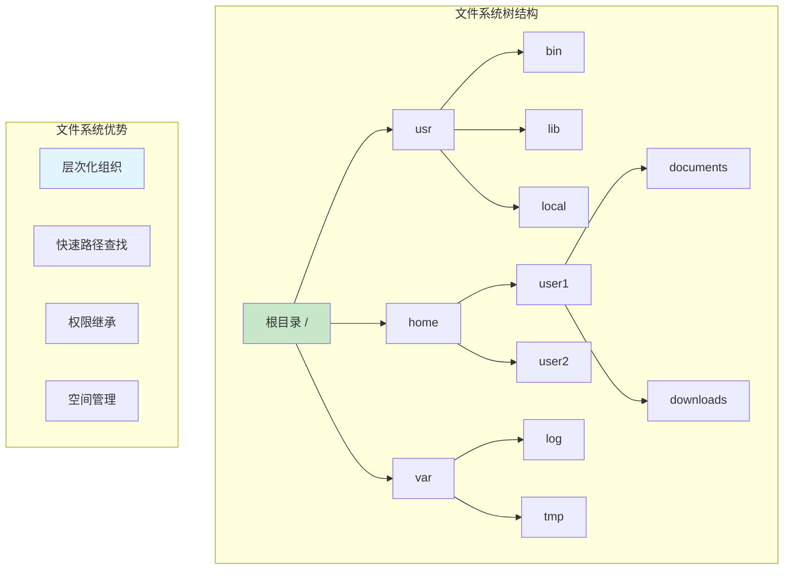

### 5.3 表达式解析

```mermaid
graph TB
    subgraph "表达式树示例: (a+b)*(c-d)"
        A[*] --> B[+]
        A --> C[-]
        B --> D[a]
        B --> E[b]
        C --> F[c]
        C --> G[d]
    end
    
    subgraph "解析过程"
        H[词法分析] --> I[语法分析]
        I --> J[构建表达式树]
        J --> K[树遍历求值]
    end
    
    subgraph "遍历求值"
        L[后序遍历]
        M[先计算子表达式]
        N[再计算根表达式]
        O[递归求值过程]
    end
    
    style A fill:#c8e6c9
    style L fill:#e1f5fe
```

### 5.4 决策树

```mermaid
graph TB
    subgraph "决策树示例"
        A[年龄 > 25?] --> B[是]
        A --> C[否]
        
        B --> D[收入 > 5万?]
        C --> E[学历 = 本科?]
        
        D --> F[批准贷款]
        D --> G[拒绝贷款]
        
        E --> H[批准贷款]
        E --> I[拒绝贷款]
    end
    
    subgraph "决策树特点"
        J[规则清晰]
        K[易于理解]
        L[支持分类]
        M[可解释性强]
    end
    
    style A fill:#c8e6c9
    style F fill:#c8e6c9
    style H fill:#c8e6c9
    style G fill:#ffcdd2
    style I fill:#ffcdd2
```

### 5.5 网络路由

```mermaid
graph LR
    subgraph "路由树结构"
        A[根路由器] --> B[区域1]
        A --> C[区域2]
        A --> D[区域3]
        
        B --> E[子网1]
        B --> F[子网2]
        
        C --> G[子网3]
        C --> H[子网4]
        
        D --> I[子网5]
        D --> J[子网6]
    end
    
    subgraph "路由优势"
        K[层次化路由]
        L[减少路由表大小]
        M[快速路径查找]
        N[故障隔离]
    end
    
    style A fill:#c8e6c9
    style K fill:#e1f5fe
```

### 5.6 游戏AI

```mermaid
graph TB
    subgraph "游戏决策树"
        A[当前游戏状态] --> B[玩家行动1]
        A --> C[玩家行动2]
        A --> D[玩家行动3]
        
        B --> E[对手响应1]
        B --> F[对手响应2]
        
        C --> G[对手响应3]
        C --> H[对手响应4]
        
        E --> I[评分: +5]
        F --> J[评分: -3]
        G --> K[评分: +2]
        H --> L[评分: -1]
    end
    
    subgraph "Minimax算法"
        M[最大化己方收益]
        N[最小化对手收益]
        O[递归搜索]
        P[剪枝优化]
    end
    
    style A fill:#c8e6c9
    style I fill:#c8e6c9
    style K fill:#c8e6c9
```

## 6. 二叉树的遍历算法

### 6.1 遍历算法概览

```mermaid
mindmap
  root((二叉树遍历))
    深度优先遍历
      前序遍历
        根-左-右
        递归实现
        栈实现
      中序遍历
        左-根-右
        BST有序输出
        线索化
      后序遍历
        左-右-根
        删除操作
        表达式求值
    广度优先遍历
      层序遍历
        逐层访问
        队列实现
        完全二叉树检查
    特殊遍历
      Morris遍历
        O(1)空间
        线索二叉树
        无需栈/递归
```

### 6.2 前序遍历

```mermaid
graph TB
    subgraph "前序遍历示例树"
        A[1] --> B[2]
        A --> C[3]
        B --> D[4]
        B --> E[5]
        C --> F[6]
        C --> G[7]
    end
    
    subgraph "前序遍历顺序"
        H[访问顺序: 1 → 2 → 4 → 5 → 3 → 6 → 7]
        I[规则: 根 → 左子树 → 右子树]
    end
    
    subgraph "前序遍历应用"
        J[复制二叉树]
        K[前缀表达式]
        L[目录结构遍历]
        M[语法树处理]
    end
    
    style A fill:#c8e6c9
    style H fill:#e1f5fe
```

### 6.3 前序遍历实现

```mermaid
sequenceDiagram
    participant Main as 主程序
    participant Func as 前序遍历函数
    participant Stack as 栈(迭代版本)
    participant Node as 当前节点
    
    Note over Main,Node: 递归实现
    Main->>Func: preorder(root)
    Func->>Node: 访问根节点
    Func->>Func: preorder(left)
    Func->>Func: preorder(right)
    
    Note over Main,Node: 迭代实现
    Main->>Stack: push(root)
    loop 栈不为空
        Stack->>Node: pop()
        Node->>Main: 访问节点
        alt 右子节点存在
            Node->>Stack: push(right)
        end
        alt 左子节点存在
            Node->>Stack: push(left)
        end
    end
```

### 6.4 中序遍历

```mermaid
graph TB
    subgraph "中序遍历示例树(BST)"
        A[4] --> B[2]
        A --> C[6]
        B --> D[1]
        B --> E[3]
        C --> F[5]
        C --> G[7]
    end
    
    subgraph "中序遍历顺序"
        H[访问顺序: 1 → 2 → 3 → 4 → 5 → 6 → 7]
        I[规则: 左子树 → 根 → 右子树]
        J[BST中序遍历得到有序序列]
    end
    
    subgraph "中序遍历应用"
        K[BST排序输出]
        L[中缀表达式]
        M[二叉树验证]
        N[线索二叉树构建]
    end
    
    style A fill:#c8e6c9
    style J fill:#c8e6c9
```

### 6.5 后序遍历

```mermaid
graph TB
    subgraph "后序遍历示例树"
        A[1] --> B[2]
        A --> C[3]
        B --> D[4]
        B --> E[5]
        C --> F[6]
        C --> G[7]
    end
    
    subgraph "后序遍历顺序"
        H[访问顺序: 4 → 5 → 2 → 6 → 7 → 3 → 1]
        I[规则: 左子树 → 右子树 → 根]
    end
    
    subgraph "后序遍历应用"
        J[安全删除节点]
        K[计算目录大小]
        L[后缀表达式求值]
        M[释放内存]
    end
    
    style A fill:#c8e6c9
    style H fill:#e1f5fe
    style J fill:#c8e6c9
```

### 6.6 层序遍历

```mermaid
sequenceDiagram
    participant Main as 主程序
    participant Queue as 队列
    participant Node as 当前节点
    participant Level as 层次计数
    
    Main->>Queue: enqueue(root)
    Main->>Level: level = 0
    
    loop 队列不为空
        Level->>Level: level++
        Queue->>Node: dequeue()
        Node->>Main: 访问节点
        
        alt 左子节点存在
            Node->>Queue: enqueue(left)
        end
        
        alt 右子节点存在
            Node->>Queue: enqueue(right)
        end
    end
    
    Note over Main,Level: 逐层访问，广度优先
```

### 6.7 遍历算法复杂度对比

```mermaid
graph TB
    subgraph "遍历算法复杂度"
        A[遍历类型] --> A1[时间复杂度]
        A --> A2[空间复杂度]
        A --> A3[实现方式]
        
        B[前序遍历] --> B1[O(n)]
        B --> B2[O(h) 递归栈]
        B --> B3[递归/迭代]
        
        C[中序遍历] --> C1[O(n)]
        C --> C2[O(h) 递归栈]
        C --> C3[递归/迭代/Morris]
        
        D[后序遍历] --> D1[O(n)]
        D --> D2[O(h) 递归栈]
        D --> D3[递归/迭代]
        
        E[层序遍历] --> E1[O(n)]
        E --> E2[O(w) 队列宽度]
        E --> E3[队列实现]
    end
    
    style B1 fill:#c8e6c9
    style C1 fill:#c8e6c9
    style D1 fill:#c8e6c9
    style E1 fill:#c8e6c9
```

### 6.8 Morris遍历

```mermaid
flowchart TD
    A[Morris遍历原理] --> B[利用线索指针]
    A --> C[O(1)空间复杂度]
    A --> D[无需递归栈]
    
    B --> B1[找到前驱节点]
    B --> B2[建立临时连接]
    B --> B3[遍历后恢复结构]
    
    C --> C1[不使用额外栈空间]
    C --> C2[不使用递归]
    C --> C3[原地算法]
    
    D --> D1[避免栈溢出]
    D --> D2[适合大数据]
    D --> D3[内存受限环境]
    
    style C1 fill:#c8e6c9
    style D1 fill:#e1f5fe
```

## 7. 二叉树元素添加和移除

### 7.1 二叉搜索树插入操作

```mermaid
flowchart TD
    A[BST插入操作] --> B{树是否为空?}
    
    B -->|是| C[创建根节点]
    B -->|否| D[从根节点开始比较]
    
    D --> E{新值 < 当前节点值?}
    
    E -->|是| F{左子节点存在?}
    E -->|否| G{右子节点存在?}
    
    F -->|是| H[移动到左子节点]
    F -->|否| I[创建左子节点]
    
    G -->|是| J[移动到右子节点]
    G -->|否| K[创建右子节点]
    
    H --> E
    J --> E
    
    I --> L[插入完成]
    K --> L
    C --> L
    
    style C fill:#c8e6c9
    style I fill:#c8e6c9
    style K fill:#c8e6c9
    style L fill:#e1f5fe
```

### 7.2 BST插入过程可视化

```mermaid
sequenceDiagram
    participant User as 用户
    participant BST as 二叉搜索树
    participant Node as 当前节点
    participant NewNode as 新节点
    
    User->>BST: insert(15)
    BST->>Node: 从根节点开始(20)
    
    Note over Node: 15 < 20, 向左
    Node->>Node: 移动到左子节点(10)
    
    Note over Node: 15 > 10, 向右
    Node->>Node: 移动到右子节点(NULL)
    
    Node->>NewNode: 创建新节点(15)
    NewNode->>BST: 连接到树中
    BST-->>User: 插入成功
    
    Note over BST: 保持BST性质不变
```

### 7.3 二叉搜索树删除操作

```mermaid
flowchart TD
    A[BST删除操作] --> B[查找要删除的节点]
    B --> C{节点类型?}
    
    C -->|叶子节点| D[直接删除]
    C -->|只有一个子节点| E[用子节点替换]
    C -->|有两个子节点| F[找到后继节点]
    
    F --> G[用后继节点值替换]
    G --> H[删除后继节点]
    
    D --> I[删除完成]
    E --> I
    H --> I
    
    style D fill:#c8e6c9
    style E fill:#e1f5fe
    style G fill:#fff3e0
    style I fill:#f3e5f5
```

### 7.4 删除操作的三种情况

```mermaid
graph TB
    subgraph "情况1: 删除叶子节点"
        A1[删除节点50] --> B1[直接删除]
        C1[20] --> D1[10]
        C1 --> E1[30]
        E1 --> F1[25]
        E1 --> G1[50删除]
    end
    
    subgraph "情况2: 删除只有一个子节点的节点"
        A2[删除节点30] --> B2[用子节点替换]
        C2[20] --> D2[10]
        C2 --> E2[25替换30]
        E2 --> F2[50]
    end
    
    subgraph "情况3: 删除有两个子节点的节点"
        A3[删除节点20] --> B3[找后继节点25]
        C3[25替换20] --> D3[10]
        C3 --> E3[30]
        E3 --> F3[50]
    end
    
    style B1 fill:#c8e6c9
    style B2 fill:#e1f5fe
    style B3 fill:#fff3e0
```

### 7.5 AVL树的旋转操作

```mermaid
graph TB
    subgraph "AVL树旋转类型"
        A[失衡类型]
        B[LL型 - 右旋]
        C[RR型 - 左旋]
        D[LR型 - 左右旋]
        E[RL型 - 右左旋]
    end
    
    A --> B
    A --> C
    A --> D
    A --> E
    
    subgraph "右旋操作(LL)"
        F[失衡节点A] --> G[左子节点B上升]
        G --> H[A成为B的右子节点]
        H --> I[调整子树连接]
    end
    
    subgraph "左旋操作(RR)"
        J[失衡节点A] --> K[右子节点B上升]
        K --> L[A成为B的左子节点]
        L --> M[调整子树连接]
    end
    
    style G fill:#c8e6c9
    style K fill:#e1f5fe
```

### 7.6 红黑树的调整操作

```mermaid
sequenceDiagram
    participant Insert as 插入操作
    participant RBTree as 红黑树
    participant Node as 新节点
    participant Parent as 父节点
    participant Uncle as 叔叔节点
    
    Insert->>RBTree: 插入新节点(红色)
    RBTree->>Node: 检查红黑树性质
    
    alt 父节点是黑色
        Node-->>RBTree: 无需调整
    else 父节点是红色
        Node->>Uncle: 检查叔叔节点颜色
        
        alt 叔叔节点是红色
            Uncle->>Parent: 父节点变黑
            Uncle->>Uncle: 叔叔节点变黑
            Uncle->>RBTree: 祖父节点变红
            RBTree->>RBTree: 向上递归调整
        else 叔叔节点是黑色
            RBTree->>RBTree: 进行旋转调整
            RBTree->>RBTree: 重新着色
        end
    end
```

### 7.7 堆的插入和删除

```mermaid
flowchart TD
    A[堆操作] --> B[插入操作]
    A --> C[删除操作]
    
    B --> B1[在末尾插入新元素]
    B1 --> B2[与父节点比较]
    B2 --> B3{满足堆性质?}
    B3 -->|否| B4[与父节点交换]
    B3 -->|是| B5[插入完成]
    B4 --> B2
    
    C --> C1[用最后一个元素替换根]
    C1 --> C2[删除最后一个元素]
    C2 --> C3[从根开始下沉调整]
    C3 --> C4{满足堆性质?}
    C4 -->|否| C5[与较大子节点交换]
    C4 -->|是| C6[删除完成]
    C5 --> C3
    
    style B5 fill:#c8e6c9
    style C6 fill:#e1f5fe
```

## 8. 二叉树效率分析

### 8.1 时间复杂度分析

```mermaid
graph TB
    subgraph "二叉树操作时间复杂度"
        A[树类型] --> A1[查找]
        A --> A2[插入]
        A --> A3[删除]
        A --> A4[遍历]
        
        B[普通二叉树] --> B1[O(n)]
        B --> B2[O(n)]
        B --> B3[O(n)]
        B --> B4[O(n)]
        
        C[平衡二叉树] --> C1[O(log n)]
        C --> C2[O(log n)]
        C --> C3[O(log n)]
        C --> C4[O(n)]
        
        D[完全二叉树] --> D1[O(log n)]
        D --> D2[O(log n)]
        D --> D3[O(log n)]
        D --> D4[O(n)]
        
        E[退化二叉树] --> E1[O(n)]
        E --> E2[O(n)]
        E --> E3[O(n)]
        E --> E4[O(n)]
    end
    
    style C1 fill:#c8e6c9
    style C2 fill:#c8e6c9
    style C3 fill:#c8e6c9
    style D1 fill:#e1f5fe
    style E1 fill:#ffcdd2
```

### 8.2 空间复杂度分析

```mermaid
graph LR
    subgraph "空间复杂度分析"
        A[存储方式] --> A1[链式存储]
        A --> A2[数组存储]
        
        B[链式存储] --> B1[节点数据: O(n)]
        B --> B2[指针开销: O(n)]
        B --> B3[总空间: O(n)]
        
        C[数组存储] --> C1[数据存储: O(n)]
        C --> C2[可能浪费空间]
        C --> C3[完全二叉树最优]
        
        D[递归操作] --> D1[栈空间: O(h)]
        D --> D2[h为树高度]
        D --> D3[最坏O(n), 最好O(log n)]
    end
    
    style B3 fill:#c8e6c9
    style C3 fill:#e1f5fe
    style D3 fill:#fff3e0
```

### 8.3 二叉树vs其他数据结构

```mermaid
graph TB
    subgraph "数据结构性能对比"
        A[操作类型] --> A1[数组]
        A --> A2[链表]
        A --> A3[哈希表]
        A --> A4[平衡二叉树]
        
        B[查找] --> B1[O(n)]
        B --> B2[O(n)]
        B --> B3[O(1)平均]
        B --> B4[O(log n)]
        
        C[插入] --> C1[O(n)]
        C --> C2[O(1)]
        C --> C3[O(1)平均]
        C --> C4[O(log n)]
        
        D[删除] --> D1[O(n)]
        D --> D2[O(n)]
        D --> D3[O(1)平均]
        D --> D4[O(log n)]
        
        E[有序遍历] --> E1[O(n)]
        E --> E2[O(n log n)]
        E --> E3[O(n log n)]
        E --> E4[O(n)]
    end
    
    style B4 fill:#c8e6c9
    style C4 fill:#c8e6c9
    style D4 fill:#c8e6c9
    style E4 fill:#c8e6c9
```

### 8.4 二叉树的优势

```mermaid
mindmap
  root((二叉树优势))
    查找效率
      平衡树O(log n)
      比线性查找快
      支持范围查询
      有序输出天然
    动态性
      动态插入删除
      大小可变
      结构自适应
      内存按需分配
    灵活性
      多种实现方式
      适应不同场景
      支持各种操作
      扩展性强
    算法支持
      递归算法天然
      分治思想体现
      搜索算法优化
      排序算法基础
```

### 8.5 二叉树的劣势与限制

```mermaid
graph TB
    subgraph "二叉树的劣势"
        A[性能问题]
        B[实现复杂性]
        C[内存开销]
        D[特殊情况]
    end
    
    A --> A1[退化为链表时性能差]
    A --> A2[需要平衡维护]
    A --> A3[缓存局部性较差]
    
    B --> B1[平衡算法复杂]
    B --> B2[删除操作复杂]
    B --> B3[并发控制困难]
    
    C --> C1[指针额外开销]
    C --> C2[内存碎片化]
    C --> C3[不如数组紧凑]
    
    D --> D1[最坏情况O(n)]
    D --> D2[不适合小数据集]
    D --> D3[随机访问不如数组]
    
    style A1 fill:#ffcdd2
    style B1 fill:#ffcdd2
    style C1 fill:#ffcdd2
    style D1 fill:#ffcdd2
```

### 8.6 性能优化策略

```mermaid
flowchart TD
    A[二叉树性能优化] --> B[结构优化]
    A --> C[算法优化]
    A --> D[内存优化]
    A --> E[并发优化]
    
    B --> B1[保持平衡]
    B --> B2[选择合适的树类型]
    B --> B3[动态调整策略]
    
    C --> C1[迭代替代递归]
    C --> C2[路径压缩]
    C --> C3[批量操作]
    
    D --> D1[内存池技术]
    D --> D2[节点复用]
    D --> D3[紧凑存储]
    
    E --> E1[读写锁分离]
    E --> E2[无锁算法]
    E --> E3[分段锁]
    
    style B1 fill:#c8e6c9
    style C1 fill:#e1f5fe
    style D1 fill:#fff3e0
    style E1 fill:#f3e5f5
```

### 8.7 实际应用中的性能考量

```mermaid
sequenceDiagram
    participant App as 应用程序
    participant Tree as 二叉树
    participant Memory as 内存管理
    participant Cache as 缓存系统
    
    Note over App,Cache: 性能优化实践
    
    App->>Tree: 批量插入操作
    Tree->>Memory: 预分配内存池
    Tree->>Tree: 构建平衡树
    
    App->>Tree: 频繁查询操作
    Tree->>Cache: 缓存热点数据
    Cache-->>Tree: 快速返回结果
    
    App->>Tree: 范围查询
    Tree->>Tree: 中序遍历优化
    Tree-->>App: 有序结果集
    
    Note over Tree: 根据访问模式调整结构
    Tree->>Tree: 动态重平衡
```

### 8.8 选择合适的二叉树类型

```mermaid
flowchart TD
    A[选择二叉树类型] --> B{主要操作类型?}
    
    B -->|频繁查找| C{数据是否有序?}
    B -->|频繁插入删除| D{需要严格平衡?}
    B -->|优先级处理| E[选择堆]
    B -->|表达式处理| F[选择表达式树]
    
    C -->|是| G[选择BST]
    C -->|否| H[选择AVL树]
    
    D -->|是| I[选择AVL树]
    D -->|否| J[选择红黑树]
    
    G --> K[简单高效]
    H --> L[查找性能稳定]
    I --> M[严格O(log n)]
    J --> N[插入删除高效]
    E --> O[优先队列应用]
    F --> P[编译器应用]
    
    style K fill:#c8e6c9
    style L fill:#e1f5fe
    style M fill:#fff3e0
    style N fill:#f3e5f5
```

## 总结

### 二叉树的核心价值

```mermaid
mindmap
  root((二叉树核心价值))
    理论价值
      数据结构基础
      算法设计基石
      递归思想体现
      分治策略应用
    实用价值
      高效查找
      动态维护
      有序组织
      灵活扩展
    教育价值
      概念清晰
      易于理解
      递归学习
      算法入门
    工程价值
      广泛应用
      性能优秀
      实现成熟
      标准化程度高
```

### 二叉树的设计哲学

二叉树体现了计算机科学中的重要设计原则：

1. **分治思想**：将复杂问题分解为子问题，递归解决
2. **平衡原则**：在时间和空间复杂度之间寻求平衡
3. **抽象原则**：通过简单的结构表达复杂的关系
4. **优化原则**：通过结构调整实现性能优化

### 实际应用指导

1. **选择合适的树类型**：
   - 简单查找：二叉搜索树
   - 频繁更新：红黑树
   - 严格平衡：AVL树
   - 优先级处理：堆

2. **性能优化建议**：
   - 保持树的平衡性
   - 使用迭代替代深递归
   - 考虑内存局部性
   - 实现并发安全

3. **常见陷阱避免**：
   - 防止树退化为链表
   - 注意递归栈溢出
   - 处理边界条件
   - 内存泄漏预防

### 二叉树的现代发展

1. **高性能树结构**：
   - B+树：数据库索引优化
   - LSM树：写优化存储
   - Trie树：字符串处理
   - 跳表：概率平衡结构

2. **并发树结构**：
   - 无锁二叉树
   - 读写分离树
   - 分段锁树
   - 版本控制树

3. **专用树结构**：
   - 空间索引树：R树、KD树
   - 压缩树：Patricia树、基数树
   - 近似树：布隆过滤器树
   - 分布式树：一致性哈希树

二叉树作为计算机科学的基础数据结构，不仅在理论研究中占据重要地位，更在实际应用中发挥着关键作用。从数据库索引到文件系统，从编译器设计到人工智能，二叉树的应用无处不在。深入理解二叉树的原理和实现，有助于我们更好地设计算法、优化程序性能，解决复杂的工程问题。

随着计算机技术的发展，二叉树也在不断演进，出现了更多专用的变种和优化版本。掌握二叉树的核心思想，不仅能帮助我们理解现有的数据结构，更能为我们设计新的数据结构提供思路和方法。