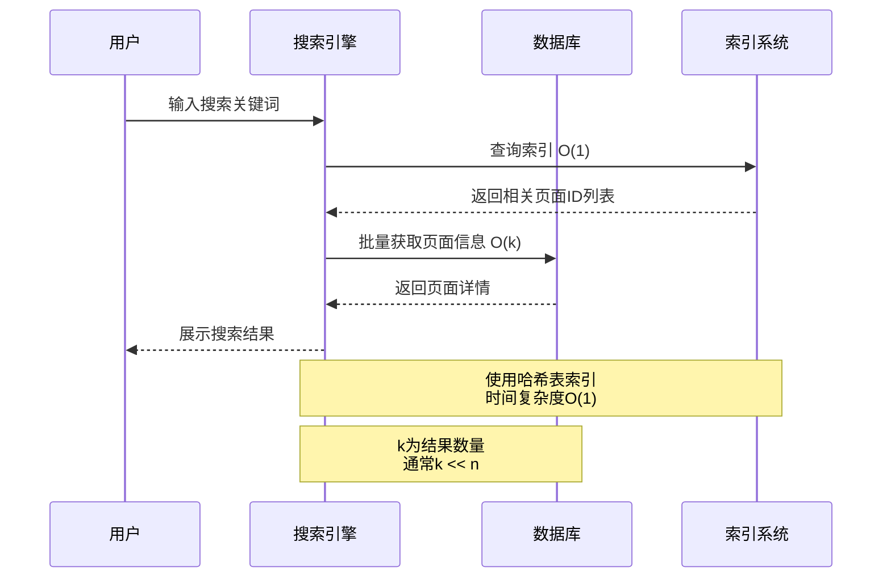
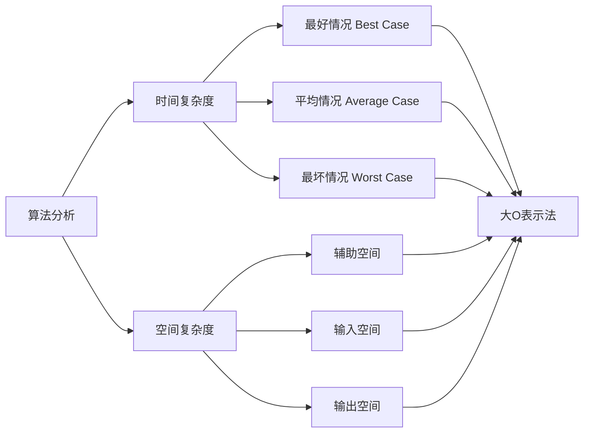
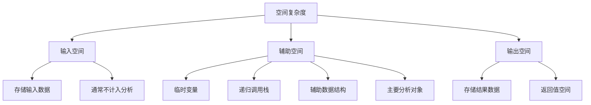
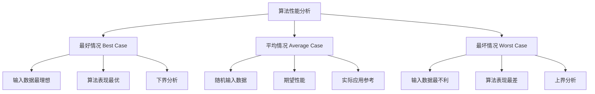
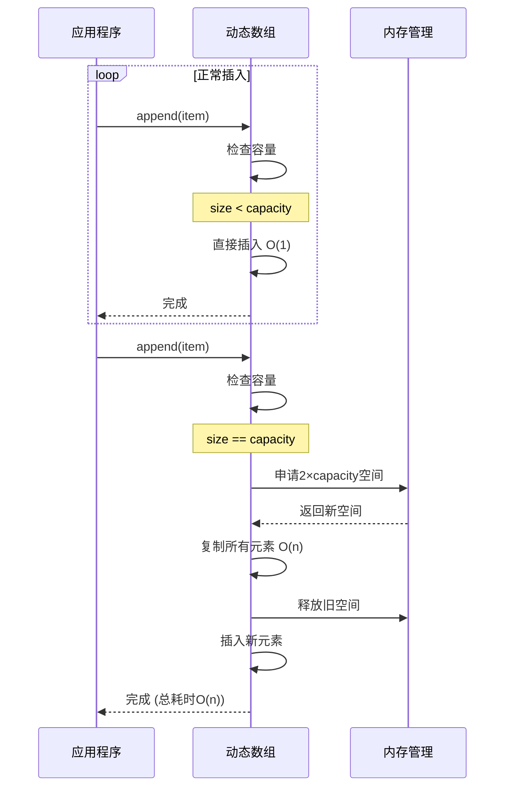
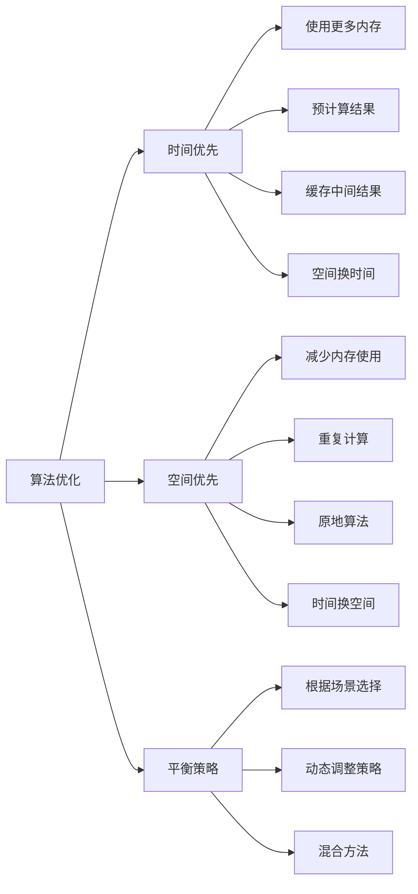
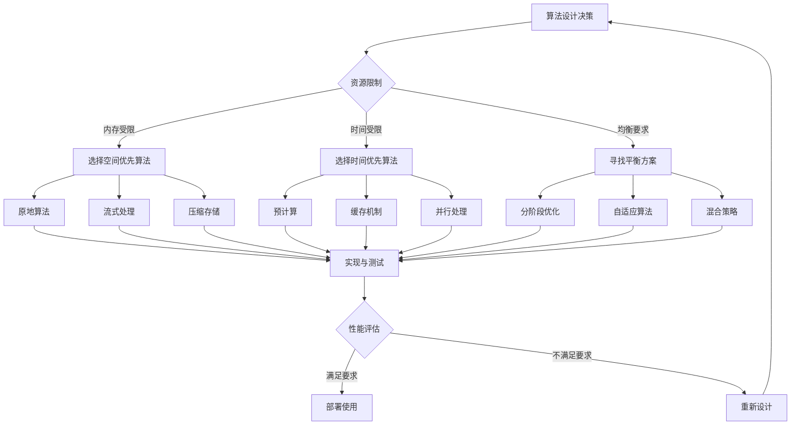

# 数据结构算法导论

## 目录
1. [为何要复杂度分析](#1-为何要复杂度分析)
2. [算法分析基础概念](#2-算法分析基础概念)
3. [大O复杂度表示法](#3-大o复杂度表示法)
4. [时间复杂度详解](#4-时间复杂度详解)
5. [空间复杂度详解](#5-空间复杂度详解)
6. [最好和最坏情况分析](#6-最好和最坏情况分析)
7. [时间和空间权衡](#7-时间和空间权衡)


### 1.2 复杂度分析的应用场景


### 1.3 实际案例：搜索引擎

考虑一个搜索引擎需要在10亿个网页中查找关键词：

- **线性搜索**：O(n) - 需要检查每个网页，耗时巨大
- **哈希表搜索**：O(1) - 几乎瞬时完成
- **二分搜索**：O(log n) - 在有序数据中快速定位



---

## 2. 算法分析基础概念

### 2.1 时间复杂度和空间复杂度概述

**时间复杂度（Time Complexity）**：算法执行所需的时间随输入规模增长的趋势

**空间复杂度（Space Complexity）**：算法执行所需的额外存储空间随输入规模增长的趋势

### 2.2 算法分析框架



### 2.3 分析方法

1. **渐近分析**：关注输入规模趋于无穷时的行为
2. **忽略常数因子**：关注增长趋势而非具体数值
3. **关注主导项**：忽略低阶项和常数项

---

## 3. 大O复杂度表示法

### 3.1 大O记号定义

大O记号描述函数的上界，即算法在最坏情况下的性能表现。

**数学定义**：存在正常数c和n₀，使得对所有n ≥ n₀，都有f(n) ≤ c·g(n)，则f(n) = O(g(n))

### 3.2 常见复杂度等级

```mermaid
graph TD
    A[复杂度等级] --> B[O(1) 常数时间]
    A --> C[O(log n) 对数时间]
    A --> D[O(n) 线性时间]
    A --> E[O(n log n) 线性对数时间]
    A --> F[O(n²) 平方时间]
    A --> G[O(n³) 立方时间]
    A --> H[O(2ⁿ) 指数时间]
    A --> I[O(n!) 阶乘时间]
    
    B --> B1[数组访问<br/>哈希表查找]
    C --> C1[二分搜索<br/>平衡树操作]
    D --> D1[线性搜索<br/>数组遍历]
    E --> E1[归并排序<br/>堆排序]
    F --> F1[冒泡排序<br/>选择排序]
    G --> G1[矩阵乘法<br/>三重循环]
    H --> H1[子集生成<br/>递归求解]
    I --> I1[旅行商问题<br/>全排列]
```

### 3.3 复杂度增长对比

| 输入规模n | O(1) | O(log n) | O(n) | O(n log n) | O(n²) | O(2ⁿ) |
|-----------|------|----------|------|------------|-------|-------|
| 10        | 1    | 3        | 10   | 33         | 100   | 1024  |
| 100       | 1    | 7        | 100  | 664        | 10K   | 10³⁰  |
| 1000      | 1    | 10       | 1K   | 9966       | 1M    | 10³⁰¹ |
| 10000     | 1    | 13       | 10K  | 132K       | 100M  | -     |

### 3.4 简单案例分析

#### 案例1：数组求和

```python
def array_sum(arr):
    total = 0          # O(1)
    for i in arr:      # O(n)
        total += i     # O(1)
    return total       # O(1)

# 总时间复杂度：O(1) + O(n) * O(1) + O(1) = O(n)
```

#### 案例2：嵌套循环

```python
def nested_loop(n):
    count = 0                    # O(1)
    for i in range(n):          # O(n)
        for j in range(n):      # O(n)
            count += 1          # O(1)
    return count                # O(1)

# 总时间复杂度：O(1) + O(n) * O(n) * O(1) + O(1) = O(n²)
```

#### 案例3：二分搜索

```python
def binary_search(arr, target):
    left, right = 0, len(arr) - 1    # O(1)
    
    while left <= right:             # O(log n)
        mid = (left + right) // 2    # O(1)
        if arr[mid] == target:       # O(1)
            return mid               # O(1)
        elif arr[mid] < target:      # O(1)
            left = mid + 1           # O(1)
        else:                        # O(1)
            right = mid - 1          # O(1)
    
    return -1                        # O(1)

# 总时间复杂度：O(log n)
```

---

## 4. 时间复杂度详解

### 4.1 时间复杂度定义

时间复杂度衡量算法执行时间随输入规模增长的速度，通常用基本操作的执行次数来衡量。

### 4.2 所有可能的时间复杂度等级

#### 4.2.1 O(1) - 常数时间复杂度

**特点**：执行时间不随输入规模变化

**典型操作**：
- 数组元素访问
- 哈希表查找（平均情况）
- 栈的push/pop操作
- 基本算术运算

```python
# 案例：数组元素访问
def get_first_element(arr):
    if len(arr) > 0:
        return arr[0]  # O(1) - 直接索引访问
    return None

# 案例：哈希表操作
def hash_lookup(hash_table, key):
    return hash_table.get(key)  # O(1) - 平均情况
```

#### 4.2.2 O(log n) - 对数时间复杂度

**特点**：每次操作将问题规模减半

**典型算法**：
- 二分搜索
- 平衡二叉搜索树操作
- 堆的插入/删除操作

```python
# 案例：二分搜索
def binary_search_recursive(arr, target, left, right):
    if left > right:
        return -1
    
    mid = (left + right) // 2
    if arr[mid] == target:
        return mid
    elif arr[mid] > target:
        return binary_search_recursive(arr, target, left, mid - 1)
    else:
        return binary_search_recursive(arr, target, mid + 1, right)

# 递归深度：log₂(n)，每层O(1)操作
```

#### 4.2.3 O(n) - 线性时间复杂度

**特点**：执行时间与输入规模成正比

**典型操作**：
- 数组遍历
- 线性搜索
- 链表操作

```python
# 案例：线性搜索
def linear_search(arr, target):
    for i, value in enumerate(arr):  # 最多遍历n个元素
        if value == target:
            return i
    return -1

# 案例：数组求最大值
def find_max(arr):
    if not arr:
        return None
    
    max_val = arr[0]
    for i in range(1, len(arr)):  # 遍历n-1个元素
        if arr[i] > max_val:
            max_val = arr[i]
    return max_val
```

#### 4.2.4 O(n log n) - 线性对数时间复杂度

**特点**：结合了线性和对数特性

**典型算法**：
- 归并排序
- 堆排序
- 快速排序（平均情况）

```python
# 案例：归并排序
def merge_sort(arr):
    if len(arr) <= 1:
        return arr
    
    mid = len(arr) // 2
    left = merge_sort(arr[:mid])      # T(n/2)
    right = merge_sort(arr[mid:])     # T(n/2)
    
    return merge(left, right)         # O(n)

def merge(left, right):
    result = []
    i = j = 0
    
    while i < len(left) and j < len(right):  # 最多n次比较
        if left[i] <= right[j]:
            result.append(left[i])
            i += 1
        else:
            result.append(right[j])
            j += 1
    
    result.extend(left[i:])
    result.extend(right[j:])
    return result

# 递推关系：T(n) = 2T(n/2) + O(n) = O(n log n)
```

#### 4.2.5 O(n²) - 平方时间复杂度

**特点**：嵌套循环，每个元素与其他元素比较

**典型算法**：
- 冒泡排序
- 选择排序
- 插入排序

```python
# 案例：冒泡排序
def bubble_sort(arr):
    n = len(arr)
    for i in range(n):              # 外层循环n次
        for j in range(0, n-i-1):   # 内层循环最多n-1次
            if arr[j] > arr[j+1]:
                arr[j], arr[j+1] = arr[j+1], arr[j]
    return arr

# 总比较次数：n(n-1)/2 ≈ n²/2 = O(n²)

# 案例：矩阵相加
def matrix_add(A, B):
    n = len(A)
    C = [[0] * n for _ in range(n)]
    
    for i in range(n):      # 外层循环n次
        for j in range(n):  # 内层循环n次
            C[i][j] = A[i][j] + B[i][j]  # O(1)操作
    
    return C
# 总操作次数：n × n = O(n²)
```

#### 4.2.6 O(n³) - 立方时间复杂度

**特点**：三层嵌套循环

**典型算法**：
- 矩阵乘法（朴素算法）
- Floyd-Warshall最短路径算法

```python
# 案例：矩阵乘法
def matrix_multiply(A, B):
    n = len(A)
    C = [[0] * n for _ in range(n)]
    
    for i in range(n):          # 第一层循环
        for j in range(n):      # 第二层循环
            for k in range(n):  # 第三层循环
                C[i][j] += A[i][k] * B[k][j]
    
    return C
# 总操作次数：n × n × n = O(n³)
```

#### 4.2.7 O(2ⁿ) - 指数时间复杂度

**特点**：每增加一个输入，计算量翻倍

**典型问题**：
- 递归计算斐波那契数列
- 子集生成
- 汉诺塔问题

```python
# 案例：递归斐波那契
def fibonacci_recursive(n):
    if n <= 1:
        return n
    return fibonacci_recursive(n-1) + fibonacci_recursive(n-2)

# 递归树深度：n，每层节点数翻倍，总节点数：O(2ⁿ)

# 案例：生成所有子集
def generate_subsets(arr):
    if not arr:
        return [[]]
    
    first = arr[0]
    rest_subsets = generate_subsets(arr[1:])  # T(n-1)
    
    new_subsets = []
    for subset in rest_subsets:               # 2^(n-1)个子集
        new_subsets.append([first] + subset)
    
    return rest_subsets + new_subsets
# 总子集数：2ⁿ个
```

#### 4.2.8 O(n!) - 阶乘时间复杂度

**特点**：生成所有排列或组合

**典型问题**：
- 旅行商问题（暴力解法）
- 全排列生成
- N皇后问题（暴力解法）

```python
# 案例：生成全排列
def permutations(arr):
    if len(arr) <= 1:
        return [arr]
    
    result = []
    for i in range(len(arr)):
        first = arr[i]
        rest = arr[:i] + arr[i+1:]
        for perm in permutations(rest):  # (n-1)!个排列
            result.append([first] + perm)
    
    return result
# 总排列数：n! = n × (n-1) × ... × 1
```

### 4.3 时间复杂度分析技巧

#### 4.3.1 循环分析

```mermaid
flowchart TD
    A[循环分析] --> B[单层循环]
    A --> C[嵌套循环]
    A --> D[递归循环]
    
    B --> B1[for i in range(n): O(n)]
    C --> C1[双重嵌套: O(n²)]
    C --> C2[三重嵌套: O(n³)]
    D --> D1[分治递归: O(n log n)]
    D --> D2[线性递归: O(n)]
    D --> D3[指数递归: O(2ⁿ)]
```

#### 4.3.2 递归分析 - 主定理

对于递归关系 T(n) = aT(n/b) + f(n)：

1. 如果 f(n) = O(n^(log_b(a) - ε))，则 T(n) = O(n^log_b(a))
2. 如果 f(n) = O(n^log_b(a))，则 T(n) = O(n^log_b(a) × log n)
3. 如果 f(n) = O(n^(log_b(a) + ε))，则 T(n) = O(f(n))

---

## 5. 空间复杂度详解

### 5.1 空间复杂度定义

空间复杂度衡量算法执行过程中所需的额外存储空间随输入规模增长的速度。

### 5.2 空间复杂度组成



### 5.3 所有可能的空间复杂度等级

#### 5.3.1 O(1) - 常数空间复杂度

**特点**：使用固定数量的额外空间

```python
# 案例：数组求和
def array_sum(arr):
    total = 0        # O(1) 空间
    for num in arr:
        total += num
    return total

# 案例：数组反转（原地操作）
def reverse_array_inplace(arr):
    left, right = 0, len(arr) - 1  # O(1) 空间
    while left < right:
        arr[left], arr[right] = arr[right], arr[left]
        left += 1
        right -= 1
    return arr
```

#### 5.3.2 O(log n) - 对数空间复杂度

**特点**：递归深度为log n的算法

```python
# 案例：二分搜索（递归实现）
def binary_search_recursive(arr, target, left, right):
    if left > right:
        return -1
    
    mid = (left + right) // 2
    if arr[mid] == target:
        return mid
    elif arr[mid] > target:
        return binary_search_recursive(arr, target, left, mid - 1)
    else:
        return binary_search_recursive(arr, target, mid + 1, right)

# 递归调用栈深度：O(log n)
# 每层递归使用O(1)空间
```

#### 5.3.3 O(n) - 线性空间复杂度

**特点**：需要与输入规模成正比的额外空间

```python
# 案例：数组复制
def copy_array(arr):
    new_arr = []           # O(n) 空间
    for item in arr:
        new_arr.append(item)
    return new_arr

# 案例：递归计算阶乘
def factorial_recursive(n):
    if n <= 1:
        return 1
    return n * factorial_recursive(n - 1)

# 递归调用栈深度：O(n)
# 每层递归使用O(1)空间

# 案例：哈希表存储
def count_frequency(arr):
    freq_map = {}          # 最坏情况O(n)空间
    for item in arr:
        freq_map[item] = freq_map.get(item, 0) + 1
    return freq_map
```

#### 5.3.4 O(n log n) - 线性对数空间复杂度

**特点**：分治算法中需要额外存储空间

```python
# 案例：归并排序
def merge_sort(arr):
    if len(arr) <= 1:
        return arr
    
    mid = len(arr) // 2
    left = merge_sort(arr[:mid])    # 递归调用栈O(log n)
    right = merge_sort(arr[mid:])   # 每层需要O(n)空间存储子数组
    
    return merge(left, right)       # merge需要O(n)空间

def merge(left, right):
    result = []                     # O(n) 空间
    i = j = 0
    
    while i < len(left) and j < len(right):
        if left[i] <= right[j]:
            result.append(left[i])
            i += 1
        else:
            result.append(right[j])
            j += 1
    
    result.extend(left[i:])
    result.extend(right[j:])
    return result

# 递归深度：O(log n)
# 每层递归需要：O(n)空间
# 总空间复杂度：O(n log n)
```

#### 5.3.5 O(n²) - 平方空间复杂度

**特点**：需要二维数据结构

```python
# 案例：动态规划 - 最长公共子序列
def lcs_dp(str1, str2):
    m, n = len(str1), len(str2)
    # 创建(m+1) × (n+1)的二维数组
    dp = [[0] * (n + 1) for _ in range(m + 1)]  # O(mn) ≈ O(n²)空间
    
    for i in range(1, m + 1):
        for j in range(1, n + 1):
            if str1[i-1] == str2[j-1]:
                dp[i][j] = dp[i-1][j-1] + 1
            else:
                dp[i][j] = max(dp[i-1][j], dp[i][j-1])
    
    return dp[m][n]

# 案例：邻接矩阵表示图
def create_adjacency_matrix(n):
    matrix = [[0] * n for _ in range(n)]  # O(n²) 空间
    return matrix
```

#### 5.3.6 O(2ⁿ) - 指数空间复杂度

**特点**：生成所有可能的组合或子集

```python
# 案例：生成所有子集
def generate_all_subsets(arr):
    if not arr:
        return [[]]
    
    first = arr[0]
    rest_subsets = generate_all_subsets(arr[1:])
    
    # 存储所有子集
    all_subsets = []
    for subset in rest_subsets:
        all_subsets.append(subset)           # 原子集
        all_subsets.append([first] + subset) # 包含first的子集
    
    return all_subsets

# 总共2ⁿ个子集，每个子集平均长度n/2
# 空间复杂度：O(n × 2ⁿ)

# 案例：递归生成排列（存储所有结果）
def generate_all_permutations(arr):
    if len(arr) <= 1:
        return [arr]
    
    all_perms = []
    for i in range(len(arr)):
        first = arr[i]
        rest = arr[:i] + arr[i+1:]
        for perm in generate_all_permutations(rest):
            all_perms.append([first] + perm)
    
    return all_perms

# 总共n!个排列，每个排列长度n
# 空间复杂度：O(n × n!)
```

### 5.4 空间优化技巧

#### 5.4.1 原地算法

```python
# 优化前：O(n)空间
def reverse_array(arr):
    return arr[::-1]  # 创建新数组

# 优化后：O(1)空间
def reverse_array_inplace(arr):
    left, right = 0, len(arr) - 1
    while left < right:
        arr[left], arr[right] = arr[right], arr[left]
        left += 1
        right -= 1
    return arr
```

#### 5.4.2 滚动数组优化

```python
# 优化前：O(n²)空间
def lcs_dp_2d(str1, str2):
    m, n = len(str1), len(str2)
    dp = [[0] * (n + 1) for _ in range(m + 1)]
    
    for i in range(1, m + 1):
        for j in range(1, n + 1):
            if str1[i-1] == str2[j-1]:
                dp[i][j] = dp[i-1][j-1] + 1
            else:
                dp[i][j] = max(dp[i-1][j], dp[i][j-1])
    
    return dp[m][n]

# 优化后：O(n)空间
def lcs_dp_1d(str1, str2):
    m, n = len(str1), len(str2)
    prev = [0] * (n + 1)
    curr = [0] * (n + 1)
    
    for i in range(1, m + 1):
        for j in range(1, n + 1):
            if str1[i-1] == str2[j-1]:
                curr[j] = prev[j-1] + 1
            else:
                curr[j] = max(prev[j], curr[j-1])
        prev, curr = curr, prev
    
    return prev[n]
```

---

## 6. 最好和最坏情况分析

### 6.1 分析维度



### 6.2 典型算法的三种情况分析

#### 6.2.1 快速排序

```python
def quick_sort(arr, low, high):
    if low < high:
        pi = partition(arr, low, high)
        quick_sort(arr, low, pi - 1)
        quick_sort(arr, pi + 1, high)

def partition(arr, low, high):
    pivot = arr[high]
    i = low - 1
    
    for j in range(low, high):
        if arr[j] <= pivot:
            i += 1
            arr[i], arr[j] = arr[j], arr[i]
    
    arr[i + 1], arr[high] = arr[high], arr[i + 1]
    return i + 1
```

**快速排序复杂度分析**：

| 情况 | 时间复杂度 | 空间复杂度 | 发生条件 |
|------|------------|------------|----------|
| 最好 | O(n log n) | O(log n) | 每次分割都均匀 |
| 平均 | O(n log n) | O(log n) | 随机输入数据 |
| 最坏 | O(n²) | O(n) | 数组已排序或逆序 |

```mermaid
graph TD
    A[快速排序分析] --> B[最好情况]
    A --> C[最坏情况]
    
    B --> B1[每次选择中位数作为pivot]
    B --> B2[分割均匀: T(n) = 2T(n/2) + O(n)]
    B --> B3[时间复杂度: O(n log n)]
    
    C --> C1[每次选择最大/最小值作为pivot]
    C --> C2[分割不均: T(n) = T(n-1) + O(n)]
    C --> C3[时间复杂度: O(n²)]
```

#### 6.2.2 哈希表操作

```python
class HashTable:
    def __init__(self, size=10):
        self.size = size
        self.table = [[] for _ in range(size)]
    
    def hash_function(self, key):
        return hash(key) % self.size
    
    def insert(self, key, value):
        index = self.hash_function(key)
        bucket = self.table[index]
        
        for i, (k, v) in enumerate(bucket):
            if k == key:
                bucket[i] = (key, value)
                return
        
        bucket.append((key, value))
    
    def search(self, key):
        index = self.hash_function(key)
        bucket = self.table[index]
        
        for k, v in bucket:
            if k == key:
                return v
        
        raise KeyError(key)
```

**哈希表复杂度分析**：

| 操作 | 最好情况 | 平均情况 | 最坏情况 |
|------|----------|----------|----------|
| 插入 | O(1) | O(1) | O(n) |
| 查找 | O(1) | O(1) | O(n) |
| 删除 | O(1) | O(1) | O(n) |

**最坏情况发生条件**：所有键都哈希到同一个桶中（哈希冲突严重）

#### 6.2.3 二分搜索

```python
def binary_search_analysis(arr, target):
    left, right = 0, len(arr) - 1
    comparisons = 0
    
    while left <= right:
        comparisons += 1
        mid = (left + right) // 2
        
        if arr[mid] == target:
            return mid, comparisons  # 找到目标
        elif arr[mid] < target:
            left = mid + 1
        else:
            right = mid - 1
    
    return -1, comparisons  # 未找到
```

**二分搜索复杂度分析**：

| 情况 | 时间复杂度 | 比较次数 | 发生条件 |
|------|------------|----------|----------|
| 最好 | O(1) | 1 | 目标在数组中间 |
| 平均 | O(log n) | log₂(n) | 随机位置 |
| 最坏 | O(log n) | ⌈log₂(n+1)⌉ | 目标不存在或在边界 |

### 6.3 摊还分析

#### 6.3.1 动态数组扩容

```python
class DynamicArray:
    def __init__(self):
        self.capacity = 1
        self.size = 0
        self.data = [None] * self.capacity
    
    def append(self, item):
        if self.size == self.capacity:
            self._resize()  # 扩容操作
        
        self.data[self.size] = item
        self.size += 1
    
    def _resize(self):
        old_capacity = self.capacity
        self.capacity *= 2  # 容量翻倍
        new_data = [None] * self.capacity
        
        for i in range(self.size):  # 复制所有元素
            new_data[i] = self.data[i]
        
        self.data = new_data
```

**摊还分析**：
- 单次append：O(1)（大多数情况）
- 扩容时append：O(n)（偶尔发生）
- 摊还时间复杂度：O(1)



### 6.4 概率分析

#### 6.4.1 随机化快速排序

```python
import random

def randomized_quick_sort(arr, low, high):
    if low < high:
        # 随机选择pivot
        random_index = random.randint(low, high)
        arr[random_index], arr[high] = arr[high], arr[random_index]
        
        pi = partition(arr, low, high)
        randomized_quick_sort(arr, low, pi - 1)
        randomized_quick_sort(arr, pi + 1, high)
```

**概率分析**：
- 最坏情况概率：极低（1/n!）
- 期望时间复杂度：O(n log n)
- 实际性能：接近最好情况

---

## 7. 时间和空间权衡

### 7.1 权衡原理

在算法设计中，时间复杂度和空间复杂度往往存在权衡关系：



### 7.2 典型权衡案例

#### 7.2.1 斐波那契数列计算

**方法1：递归（时间换空间）**
```python
def fibonacci_recursive(n):
    if n <= 1:
        return n
    return fibonacci_recursive(n-1) + fibonacci_recursive(n-2)

# 时间复杂度：O(2ⁿ)
# 空间复杂度：O(n) - 递归调用栈
```

**方法2：动态规划（空间换时间）**
```python
def fibonacci_dp(n):
    if n <= 1:
        return n
    
    dp = [0] * (n + 1)
    dp[1] = 1
    
    for i in range(2, n + 1):
        dp[i] = dp[i-1] + dp[i-2]
    
    return dp[n]

# 时间复杂度：O(n)
# 空间复杂度：O(n) - 存储数组
```

**方法3：优化动态规划（平衡方案）**
```python
def fibonacci_optimized(n):
    if n <= 1:
        return n
    
    prev2, prev1 = 0, 1
    
    for i in range(2, n + 1):
        current = prev1 + prev2
        prev2, prev1 = prev1, current
    
    return prev1

# 时间复杂度：O(n)
# 空间复杂度：O(1) - 只用常数空间
```

#### 7.2.2 字符串匹配算法

**方法1：暴力匹配（空间优先）**
```python
def brute_force_search(text, pattern):
    n, m = len(text), len(pattern)
    
    for i in range(n - m + 1):
        j = 0
        while j < m and text[i + j] == pattern[j]:
            j += 1
        if j == m:
            return i
    
    return -1

# 时间复杂度：O(nm)
# 空间复杂度：O(1)
```

**方法2：KMP算法（时间优先）**
```python
def kmp_search(text, pattern):
    def build_lps(pattern):
        m = len(pattern)
        lps = [0] * m
        length = 0
        i = 1
        
        while i < m:
            if pattern[i] == pattern[length]:
                length += 1
                lps[i] = length
                i += 1
            else:
                if length != 0:
                    length = lps[length - 1]
                else:
                    lps[i] = 0
                    i += 1
        return lps
    
    n, m = len(text), len(pattern)
    lps = build_lps(pattern)  # 预处理，需要额外空间
    
    i = j = 0
    while i < n:
        if text[i] == pattern[j]:
            i += 1
            j += 1
        
        if j == m:
            return i - j
        elif i < n and text[i] != pattern[j]:
            if j != 0:
                j = lps[j - 1]
            else:
                i += 1
    
    return -1

# 时间复杂度：O(n + m)
# 空间复杂度：O(m) - 存储LPS数组
```

#### 7.2.3 图的表示方法

**邻接矩阵（时间优先）**
```python
class GraphMatrix:
    def __init__(self, vertices):
        self.V = vertices
        self.graph = [[0] * vertices for _ in range(vertices)]
    
    def add_edge(self, u, v):
        self.graph[u][v] = 1
        self.graph[v][u] = 1  # 无向图
    
    def has_edge(self, u, v):
        return self.graph[u][v] == 1  # O(1) 查询
    
    def get_neighbors(self, u):
        neighbors = []
        for v in range(self.V):  # O(V) 遍历
            if self.graph[u][v] == 1:
                neighbors.append(v)
        return neighbors

# 空间复杂度：O(V²)
# 边查询时间：O(1)
# 获取邻居时间：O(V)
```

**邻接表（空间优先）**
```python
class GraphList:
    def __init__(self, vertices):
        self.V = vertices
        self.graph = [[] for _ in range(vertices)]
    
    def add_edge(self, u, v):
        self.graph[u].append(v)
        self.graph[v].append(u)  # 无向图
    
    def has_edge(self, u, v):
        return v in self.graph[u]  # O(degree(u)) 查询
    
    def get_neighbors(self, u):
        return self.graph[u]  # O(1) 获取

# 空间复杂度：O(V + E)
# 边查询时间：O(degree(u))
# 获取邻居时间：O(1)
```

### 7.3 权衡决策框架



### 7.4 实际应用中的权衡

#### 7.4.1 数据库索引

**B+树索引（平衡方案）**
- 时间复杂度：O(log n) 查询
- 空间复杂度：O(n) 额外存储
- 适用场景：频繁查询，偶尔更新

**哈希索引（时间优先）**
- 时间复杂度：O(1) 查询
- 空间复杂度：O(n) 额外存储
- 适用场景：等值查询，内存充足

#### 7.4.2 缓存策略

**LRU缓存实现**
```python
from collections import OrderedDict

class LRUCache:
    def __init__(self, capacity):
        self.capacity = capacity
        self.cache = OrderedDict()
    
    def get(self, key):
        if key in self.cache:
            # 移到末尾（最近使用）
            self.cache.move_to_end(key)
            return self.cache[key]
        return -1
    
    def put(self, key, value):
        if key in self.cache:
            self.cache.move_to_end(key)
        else:
            if len(self.cache) >= self.capacity:
                # 删除最久未使用的项
                self.cache.popitem(last=False)
        
        self.cache[key] = value

# 时间复杂度：O(1) 平均情况
# 空间复杂度：O(capacity)
# 权衡：用空间换取快速访问
```

### 7.5 权衡原则总结

1. **了解约束条件**
   - 内存限制
   - 时间要求
   - 硬件特性

2. **分析使用场景**
   - 数据规模
   - 操作频率
   - 实时性要求

3. **选择合适策略**
   - 预计算 vs 实时计算
   - 存储 vs 重算
   - 精确 vs 近似

4. **持续优化**
   - 性能监控
   - 瓶颈识别
   - 动态调整

---

## 总结

本文档全面介绍了数据结构算法中的复杂度分析理论和实践：

1. **复杂度分析的重要性**：帮助我们选择最优算法，预测性能表现
2. **时间复杂度**：从O(1)到O(n!)的各种等级，每种都有典型应用场景
3. **空间复杂度**：算法所需额外存储空间的分析方法
4. **最好最坏情况**：全面评估算法在不同输入下的表现
5. **时空权衡**：在实际应用中平衡时间和空间需求

掌握这些概念和分析方法，能够帮助我们设计出更高效、更适合特定场景的算法解决方案。

```mermaid
mindmap
  root((算法复杂度分析))
    复杂度重要性
      性能预测
      算法比较
      资源规划
      系统扩展
    时间复杂度
      O(1) 常数
      O(log n) 对数
      O(n) 线性
      O(n log n) 线性对数
      O(n²) 平方
      O(2ⁿ) 指数
    空间复杂度
      输入空间
      辅助空间
      输出空间
      优化技巧
    情况分析
      最好情况
      平均情况
      最坏情况
      摊还分析
    时空权衡
      空间换时间
      时间换空间
      平衡策略
      决策框架