# 数据结构设计思想

## 目录
1. [什么是数据结构](#1-什么是数据结构)
2. [基本概念介绍](#2-基本概念介绍)
3. [四种基本类型](#3-四种基本类型)
4. [数据结构存储方式](#4-数据结构存储方式)
5. [数据结构的运算](#5-数据结构的运算)
6. [学习数据结构通用设计思想](#6-学习数据结构通用设计思想)


## 3. 四种基本类型

### 3.1 数据结构分类概述

### 3.2 集合（Set）

#### 3.2.1 集合的特点


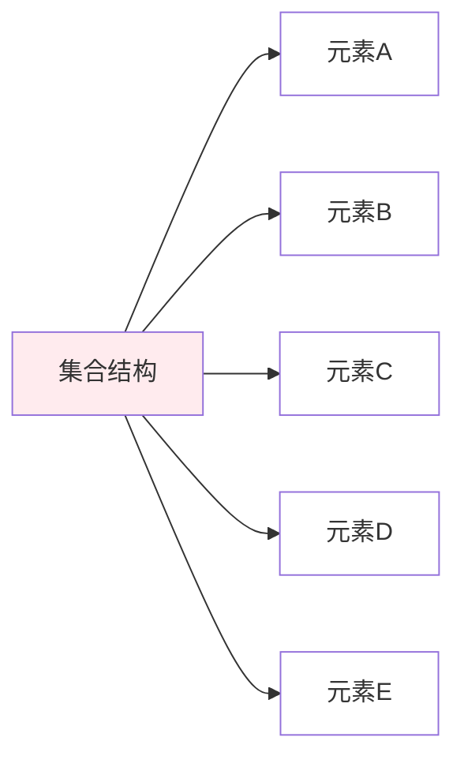

#### 3.2.2 集合的实现

```python
# 集合的基本实现
class SimpleSet:
    def __init__(self):
        self.elements = []
    
    def add(self, element):
        """添加元素（保证唯一性）"""
        if element not in self.elements:
            self.elements.append(element)
    
    def remove(self, element):
        """删除元素"""
        if element in self.elements:
            self.elements.remove(element)
    
    def contains(self, element):
        """检查元素是否存在"""
        return element in self.elements
    
    def size(self):
        """获取集合大小"""
        return len(self.elements)
    
    def union(self, other_set):
        """并集操作"""
        result = SimpleSet()
        for element in self.elements:
            result.add(element)
        for element in other_set.elements:
            result.add(element)
        return result
    
    def intersection(self, other_set):
        """交集操作"""
        result = SimpleSet()
        for element in self.elements:
            if other_set.contains(element):
                result.add(element)
        return result
```

### 3.3 线性表（Linear List）

#### 3.3.1 线性表的特点

**定义**：线性表是由n个数据元素组成的有限序列，元素间存在一对一的关系。

**特征**：
- 有序性：元素有先后顺序
- 有限性：元素个数有限
- 同质性：元素类型相同
- 线性关系：除首尾元素外，每个元素都有唯一前驱和后继

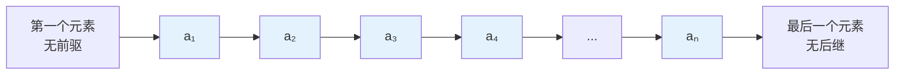

#### 3.3.2 线性表的分类

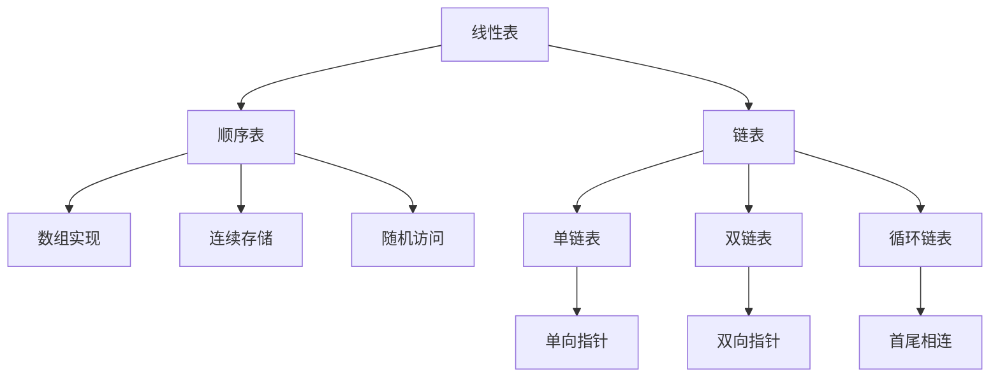

### 3.4 树（Tree）

#### 3.4.1 树的特点

**定义**：树是n个节点的有限集合，具有层次关系的数据结构。

**特征**：
- 层次性：有明确的层次结构
- 递归性：子树也是树
- 有序性：子树有左右顺序
- 连通性：任意两节点间有唯一路径

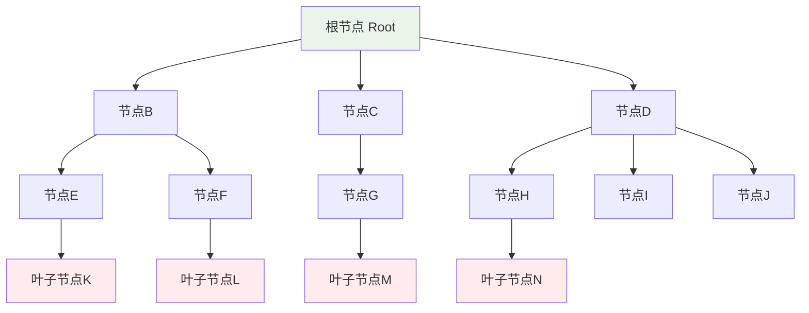

### 3.5 图（Graph）

#### 3.5.1 图的特点

**定义**：图是由顶点集合和边集合组成的数据结构，表示多对多的关系。

**特征**：
- 复杂关系：顶点间可以有任意关系
- 网状结构：非线性、非层次
- 连通性：可达性分析
- 路径概念：顶点间的连接序列

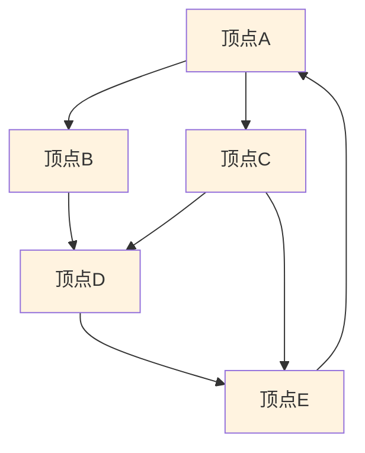

---

## 4. 数据结构存储方式

### 4.1 存储方式概述

数据结构在计算机中的存储方式决定了数据的组织形式和访问效率。主要有四种基本存储方式：

```mermaid
graph TD
    A[数据结构存储方式] --> B[顺序存储]
    A --> C[链式存储]
    A --> D[索引存储]
    A --> E[散列存储]
    
    B --> B1[连续内存空间]
    B --> B2[逻辑相邻物理相邻]
    B --> B3[随机访问]
    
    C --> C1[任意内存位置]
    C --> C2[指针连接]
    C --> C3[顺序访问]
    
    D --> D1[数据与索引分离]
    D --> D2[索引表指向数据]
    D --> D3[快速定位]
    
    E --> E1[散列函数映射]
    E --> E2[关键字直接寻址]
    E --> E3[平均O(1)访问]
    
    style B fill:#e3f2fd
    style C fill:#e8f5e8
    style D fill:#fff3e0
    style E fill:#ffebee
```

### 4.2 顺序存储

#### 4.2.1 顺序存储特点

**定义**：将数据元素存放在地址连续的存储单元里，逻辑关系和物理关系是一致的。

**优点**：
- 随机访问：可以通过下标直接访问
- 存储密度高：不需要额外的指针空间
- 实现简单：数组是最典型的实现

**缺点**：
- 插入删除效率低：需要移动大量元素
- 存储空间预分配：可能造成浪费或不足
- 大小固定：难以动态调整

```mermaid
graph LR
    A[内存地址] --> A1[1000]
    A --> A2[1004]
    A --> A3[1008]
    A --> A4[1012]
    A --> A5[1016]
    
    B[数据元素] --> B1[a₁]
    B --> B2[a₂]
    B --> B3[a₃]
    B --> B4[a₄]
    B --> B5[a₅]
    
    A1 --- B1
    A2 --- B2
    A3 --- B3
    A4 --- B4
    A5 --- B5
    
    C[地址计算] --> C1[addr(aᵢ) = base + i × size]
    
    style A1 fill:#e3f2fd
    style A2 fill:#e3f2fd
    style A3 fill:#e3f2fd
    style A4 fill:#e3f2fd
    style A5 fill:#e3f2fd
```

### 4.3 链式存储

#### 4.3.1 链式存储特点

**定义**：数据元素存储在任意的存储单元里，通过指针来表示元素间的逻辑关系。

**优点**：
- 动态分配：根据需要分配内存
- 插入删除高效：只需修改指针
- 灵活性强：大小可动态调整

**缺点**：
- 顺序访问：不能随机访问元素
- 额外空间：需要存储指针
- 内存不连续：缓存性能较差

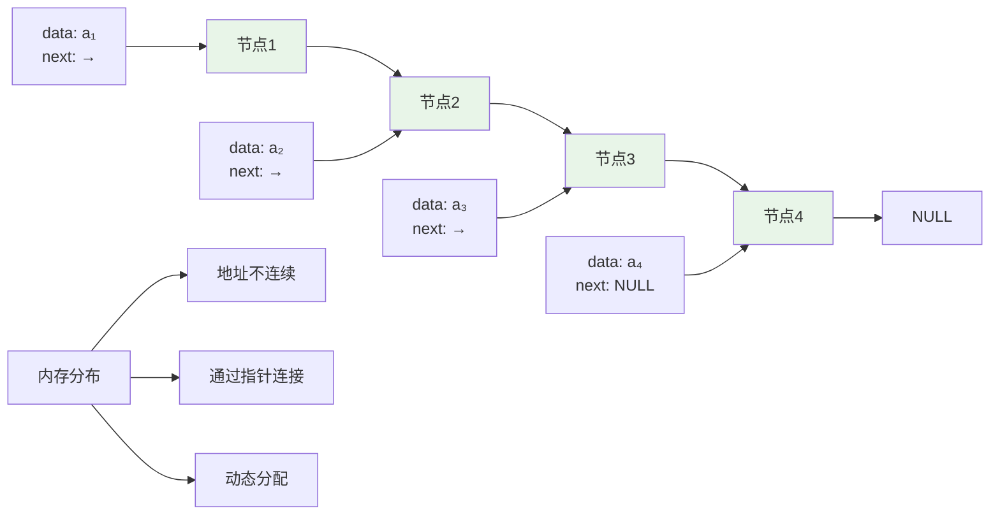

### 4.4 索引存储和散列存储

#### 4.4.1 索引存储特点

**定义**：除了存储数据元素外，还建立附加的索引表来指示元素的存储地址。

**优点**：
- 快速定位：通过索引快速找到数据
- 灵活访问：支持多种访问方式
- 空间效率：数据和索引分离

**缺点**：
- 额外开销：需要维护索引表
- 复杂性：实现相对复杂
- 更新成本：修改数据需要更新索引

#### 4.4.2 散列存储特点

**定义**：根据元素的关键字直接计算出该元素的存储地址，也称为哈希存储。

**优点**：
- 快速访问：平均O(1)时间复杂度
- 直接寻址：通过散列函数直接定位
- 高效查找：适合大量数据的快速检索

**缺点**：
- 散列冲突：不同关键字可能映射到同一地址
- 空间浪费：可能有空闲的存储位置
- 散列函数设计：需要设计好的散列函数

---

## 5. 数据结构的运算

### 5.1 基本运算概述

数据结构的运算是指对数据结构中的数据元素进行的各种操作。这些运算构成了数据结构的接口，定义了如何使用数据结构。

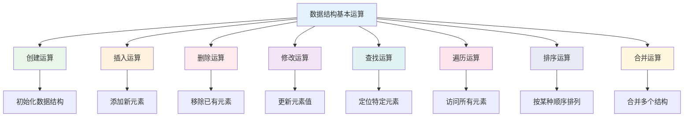

### 5.2 运算的时序图示例

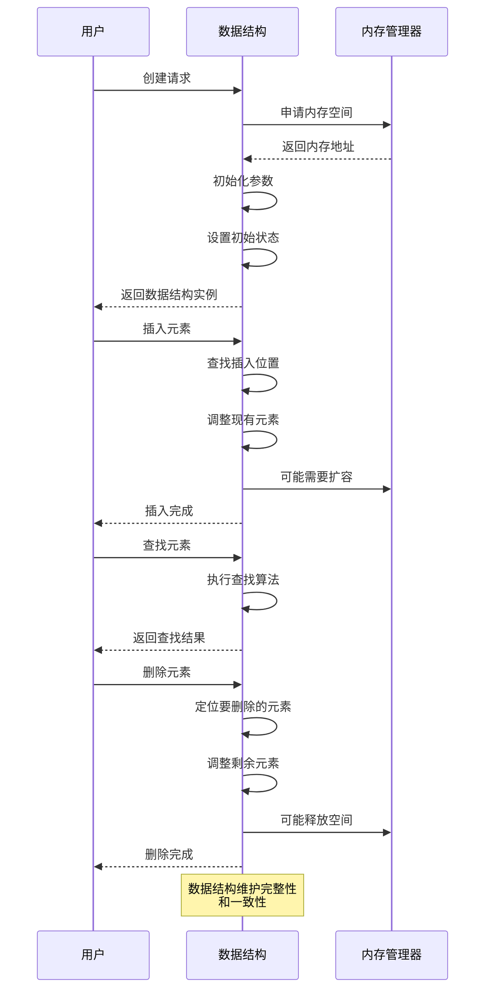

---

## 6. 学习数据结构通用设计思想

### 6.1 设计思想概述

学习数据结构不仅要掌握具体的实现，更重要的是理解其背后的设计思想和原理。这些思想是解决复杂问题的基础。

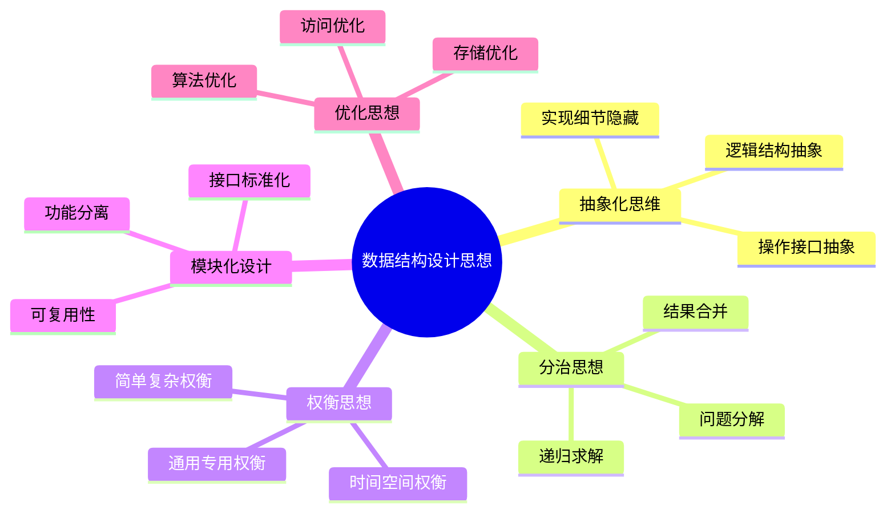

### 6.2 核心设计原则

#### 6.2.1 抽象化原则

**定义**：将复杂的现实问题抽象为数学模型，隐藏实现细节，突出本质特征。

**体现**：
- **数据抽象**：将现实中的对象抽象为数据元素
- **操作抽象**：将复杂操作抽象为简单接口
- **结构抽象**：将复杂关系抽象为简单的逻辑结构

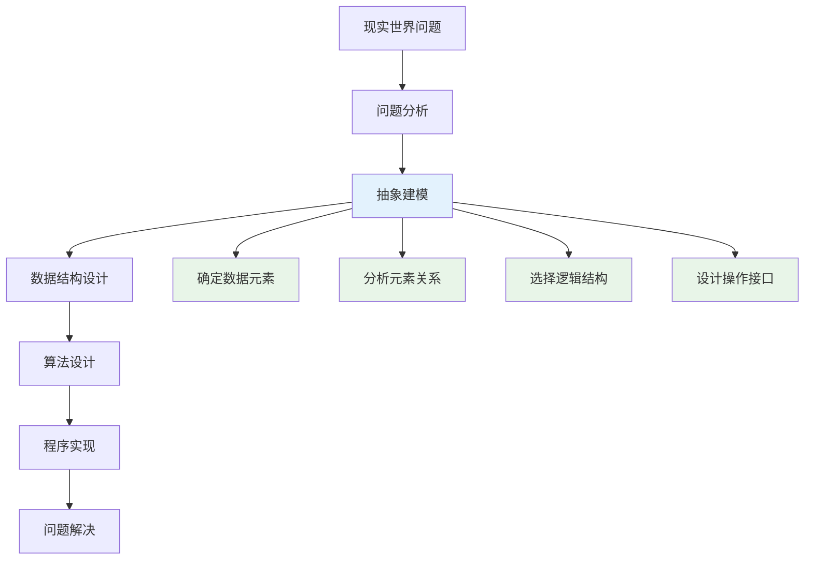

#### 6.2.2 分治思想

**定义**：将复杂问题分解为若干个规模较小的相同问题，递归求解，然后合并结果。

**应用场景**：
- 树的遍历和操作
- 归并排序和快速排序
- 二分查找
- 图的深度优先搜索

```python
# 分治思想示例：归并排序
def merge_sort(arr):
    """归并排序 - 分治思想的典型应用"""
    # 基本情况：数组长度小于等于1
    if len(arr) <= 1:
        return arr
    
    # 分解：将数组分为两半
    mid = len(arr) // 2
    left_half = arr[:mid]
    right_half = arr[mid:]
    
    # 递归求解：分别对两半进行排序
    left_sorted = merge_sort(left_half)
    right_sorted = merge_sort(right_half)
    
    # 合并：将两个有序数组合并为一个
    return merge(left_sorted, right_sorted)

def merge(left, right):
    """合并两个有序数组"""
    result = []
    i = j = 0
    
    while i < len(left) and j < len(right):
        if left[i] <= right[j]:
            result.append(left[i])
            i += 1
        else:
            result.append(right[j])
            j += 1
    
    # 添加剩余元素
    result.extend(left[i:])
    result.extend(right[j:])
    
    return result
```

#### 6.2.3 权衡思想

**定义**：在设计数据结构时，需要在多个目标之间进行权衡，找到最适合特定应用场景的解决方案。

**主要权衡**：
- **时间 vs 空间**：用空间换时间，或用时间换空间
- **简单 vs 复杂**：简单易懂 vs 功能强大
- **通用 vs 专用**：适用范围广 vs 特定场景优化

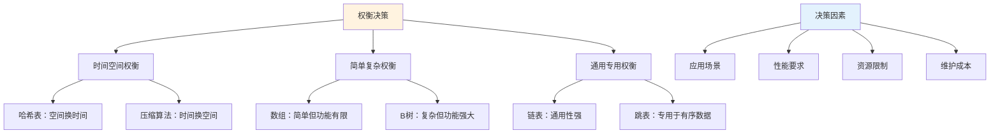

### 6.3 设计模式和原理

#### 6.3.1 封装原理

**定义**：将数据和操作数据的方法封装在一起，隐藏内部实现细节，只暴露必要的接口。

```python
class Stack:
    """栈的封装实现"""
    def __init__(self):
        self._items = []  # 私有属性，外部不能直接访问
    
    def push(self, item):
        """入栈操作 - 公共接口"""
        self._items.append(item)
    
    def pop(self):
        """出栈操作 - 公共接口"""
        if self.is_empty():
            raise IndexError("Stack is empty")
        return self._items.pop()
    
    def peek(self):
        """查看栈顶元素 - 公共接口"""
        if self.is_empty():
            raise IndexError("Stack is empty")
        return self._items[-1]
    
    def is_empty(self):
        """检查栈是否为空 - 公共接口"""
        return len(self._items) == 0
    
    def size(self):
        """获取栈的大小 - 公共接口"""
        return len(self._items)
    
    # 内部实现细节被隐藏，外部只能通过公共接口操作栈
```

#### 6.3.2 继承和多态原理

**定义**：通过继承建立类之间的层次关系，通过多态实现统一的接口。

```python
from abc import ABC, abstractmethod

class DataStructure(ABC):
    """数据结构抽象基类"""
    
    @abstractmethod
    def insert(self, item):
        """插入元素"""
        pass
    
    @abstractmethod
    def delete(self, item):
        """删除元素"""
        pass
    
    @abstractmethod
    def search(self, item):
        """查找元素"""
        pass
    
    @abstractmethod
    def is_empty(self):
        """检查是否为空"""
        pass

class ArrayList(DataStructure):
    """顺序表实现"""
    def __init__(self):
        self.items = []
    
    def insert(self, item):
        self.items.append(item)
    
    def delete(self, item):
        if item in self.items:
            self.items.remove(item)
    
    def search(self, item):
        return item in self.items
    
    def is_empty(self):
        return len(self.items) == 0

class LinkedList(DataStructure):
    """链表实现"""
    def __init__(self):
        self.head = None
        self.size = 0
    
    def insert(self, item):
        new_node = ListNode(item)
        new_node.next = self.head
        self.head = new_node
        self.size += 1
    
    def delete(self, item):
        # 删除实现...
        pass
    
    def search(self, item):
        current = self.head
        while current:
            if current.data == item:
                return True
            current = current.next
        return False
    
    def is_empty(self):
        return self.head is None

# 多态使用
def process_data_structure(ds: DataStructure, items):
    """处理任意数据结构，体现多态性"""
    for item in items:
        ds.insert(item)
    
    print(f"数据结构是否为空: {ds.is_empty()}")
    print(f"查找第一个元素: {ds.search(items[0]) if items else False}")
```

### 6.4 性能分析思想

#### 6.4.1 复杂度分析

**时间复杂度分析**：
- 最好情况：算法在最理想输入下的表现
- 平均情况：算法在随机输入下的期望表现
- 最坏情况：算法在最不利输入下的表现

**空间复杂度分析**：
- 输入空间：存储输入数据所需的空间
- 辅助空间：算法执行过程中额外需要的空间
- 输出空间：存储输出结果所需的空间

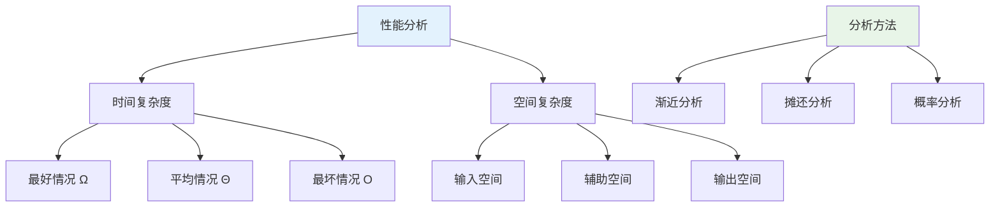

#### 6.4.2 优化策略

**算法优化**：
- 减少不必要的计算
- 使用更高效的算法
- 利用数据的特性

**数据结构优化**：
- 选择合适的存储方式
- 使用辅助数据结构
- 预处理和缓存

```python
# 优化示例：斐波那契数列计算

# 未优化版本 - O(2^n)
def fibonacci_naive(n):
    if n <= 1:
        return n
    return fibonacci_naive(n-1) + fibonacci_naive(n-2)

# 优化版本1：记忆化 - O(n)
def fibonacci_memo(n, memo={}):
    if n in memo:
        return memo[n]
    if n <= 1:
        return n
    memo[n] = fibonacci_memo(n-1, memo) + fibonacci_memo(n-2, memo)
    return memo[n]

# 优化版本2：动态规划 - O(n)
def fibonacci_dp(n):
    if n <= 1:
        return n
    
    dp = [0] * (n + 1)
    dp[1] = 1
    
    for i in range(2, n + 1):
        dp[i] = dp[i-1] + dp[i-2]
    
    return dp[n]

# 优化版本3：空间优化 - O(1)
def fibonacci_optimized(n):
    if n <= 1:
        return n
    
    prev2, prev1 = 0, 1
    
    for i in range(2, n + 1):
        current = prev1 + prev2
        prev2, prev1 = prev1, current
    
    return prev1
```

### 6.5 实际应用指导

#### 6.5.1 选择数据结构的原则

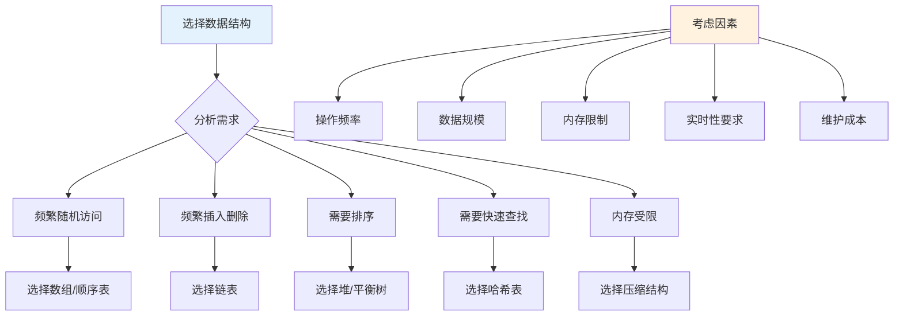

#### 6.5.2 设计模式应用

**迭代器模式**：提供统一的遍历接口
```python
class Iterator:
    def __init__(self, data_structure):
        self.data_structure = data_structure
        self.index = 0
    
    def __iter__(self):
        return self
    
    def __next__(self):
        if self.index >= len(self.data_structure):
            raise StopIteration
        value = self.data_structure[self.index]
        self.index += 1
        return value
```

**观察者模式**：数据变化时通知相关组件
```python
class Observable:
    def __init__(self):
        self._observers = []
    
    def add_observer(self, observer):
        self._observers.append(observer)
    
    def notify_observers(self, *args, **kwargs):
        for observer in self._observers:
            observer.update(self, *args, **kwargs)
```

### 6.6 学习方法和建议

#### 6.6.1 学习路径

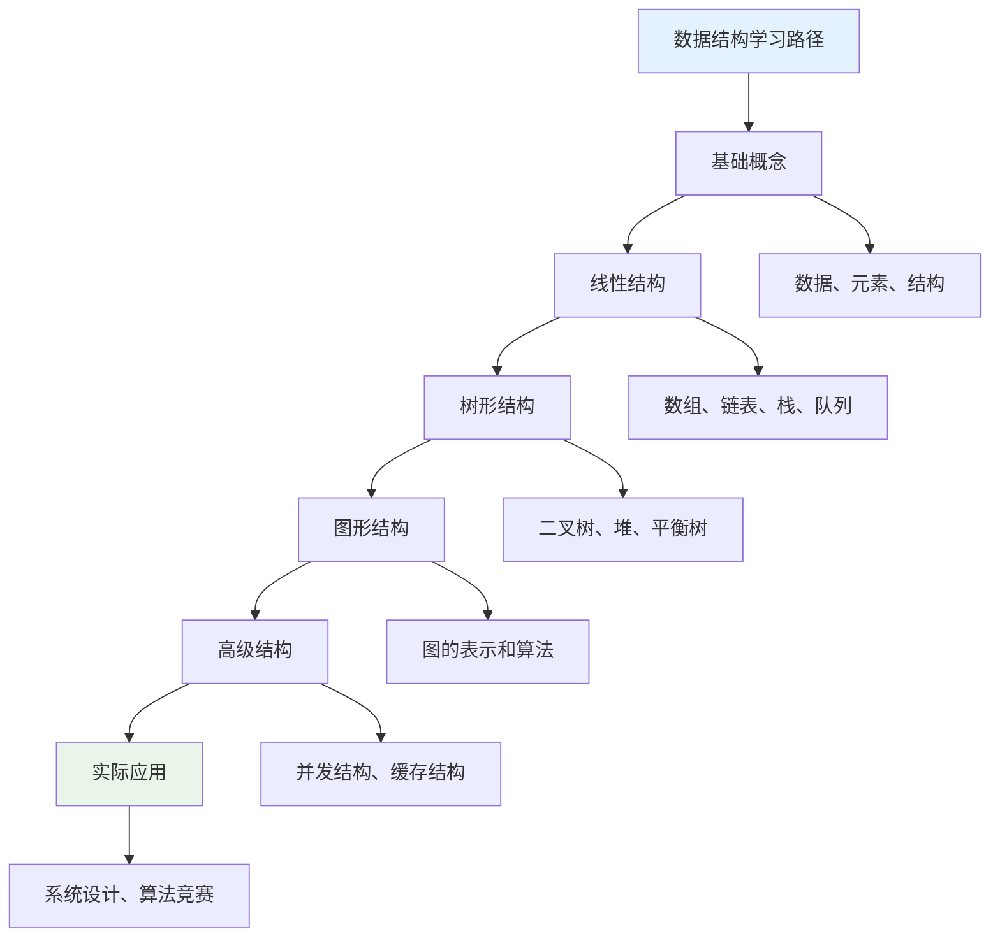

#### 6.6.2 实践建议

1. **理论与实践结合**：不仅要理解概念，更要动手实现
2. **多语言实现**：用不同编程语言实现相同的数据结构
3. **性能测试**：实际测量不同实现的性能差异
4. **应用导向**：结合实际问题选择和设计数据结构
5. **持续优化**：不断改进和优化已有的实现

---

## 总结

数据结构设计思想是计算机科学的核心内容，它不仅提供了组织和管理数据的方法，更重要的是培养了我们分析问题、抽象建模、优化设计的思维能力。

通过学习数据结构，我们掌握了：
- **抽象思维**：将复杂问题简化为数学模型
- **设计原则**：封装、继承、多态等面向对象思想
- **优化策略**：时间空间权衡、算法改进等
- **实践能力**：选择合适的数据结构解决实际问题

这些思想和方法将伴随我们整个编程生涯，帮助我们设计出更高效、更优雅的解决方案。

```mermaid
mindmap
  root((数据结构设计思想总结))
    核心概念
      数据抽象
      结构关系
      算法设计
    四种基本类型
      集合结构
      线性结构
      树形结构
      图形结构
    存储方式
      顺序存储
      链式存储
      索引存储
      散列存储
    基本运算
      创建插入删除
      修改查找遍历
      排序合并
    设计思想
      抽象化
      分治法
      权衡优化
      模块化
    实践应用
      性能分析
      结构选择
      系统设计
      问题求解