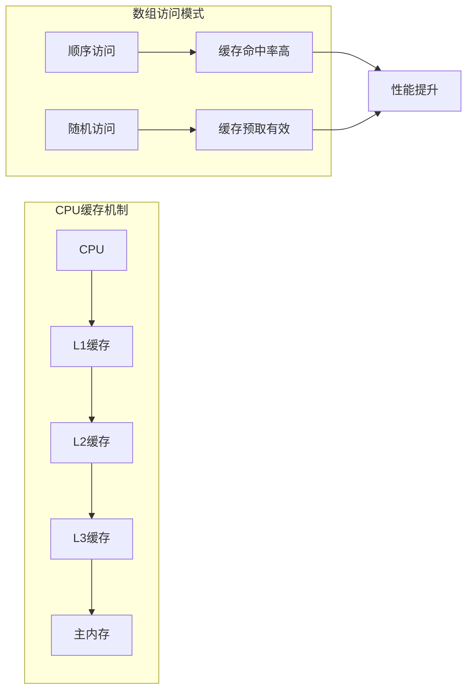
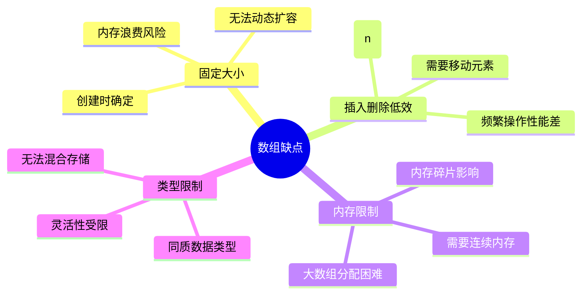
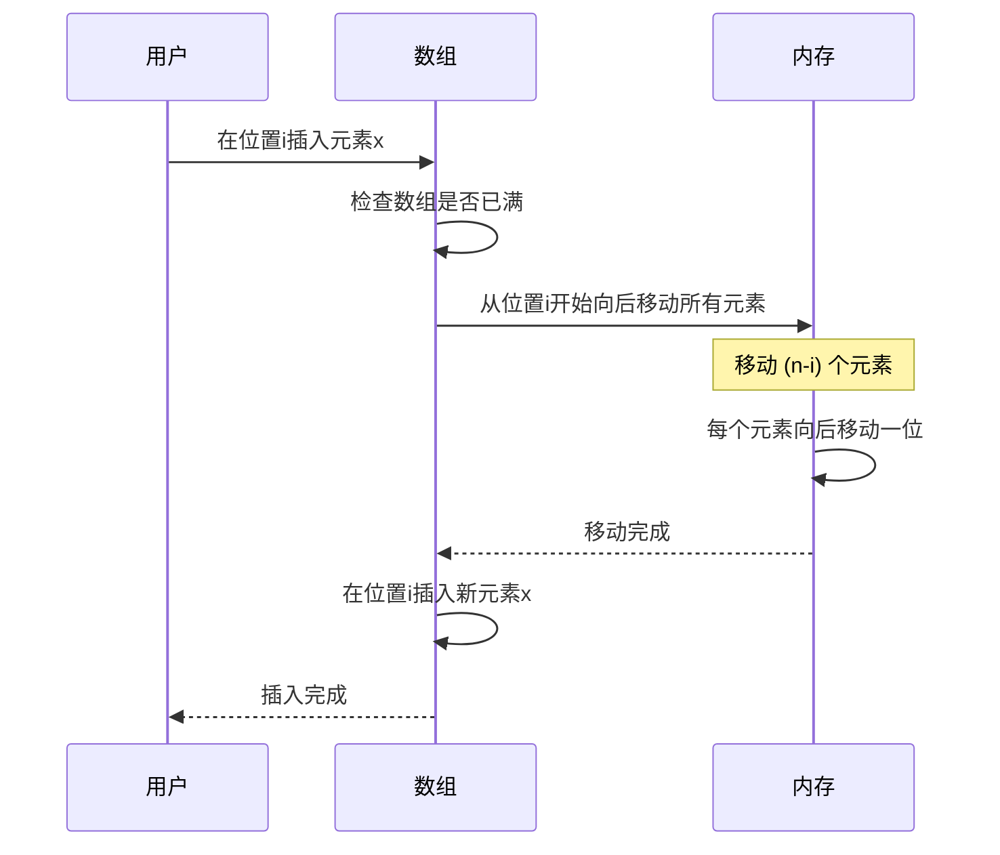
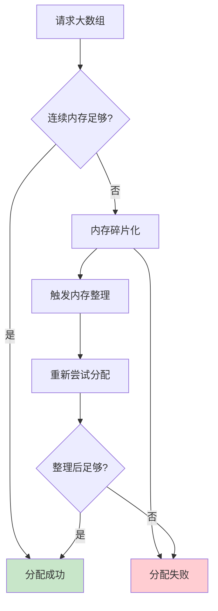
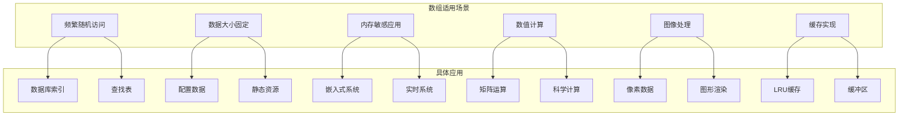
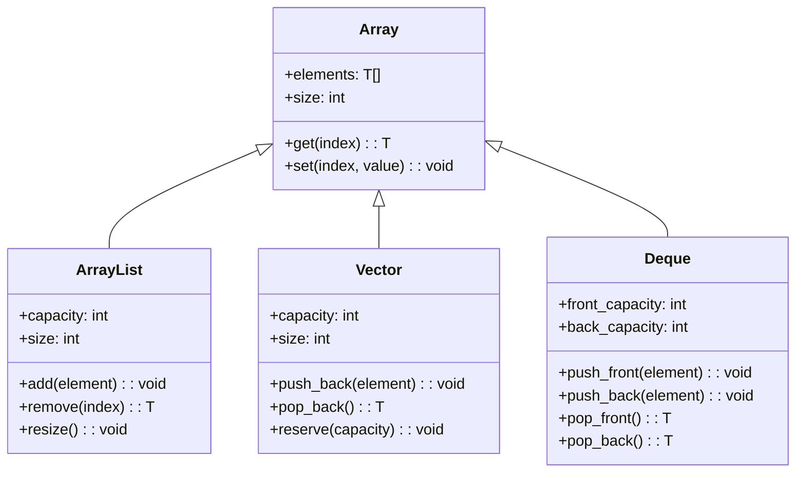
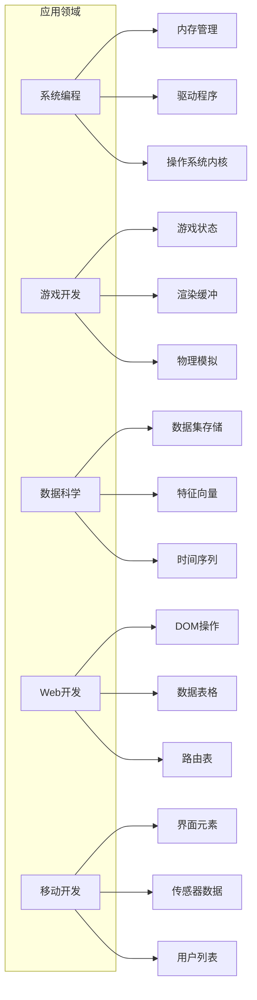
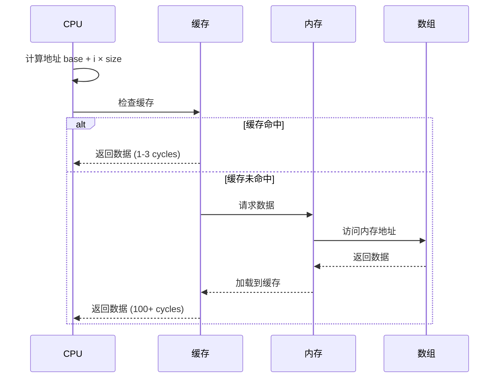
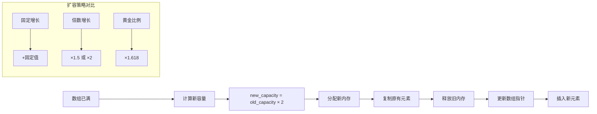

# 数组深入浅出技术文档

## 目录
- [1. 什么是数组](#1-什么是数组)
- [2. 数组的优缺点分析](#2-数组的优缺点分析)
- [3. 数组使用场景](#3-数组使用场景)
- [4. 数组访问机制](#4-数组访问机制)
- [5. 数组插入操作](#5-数组插入操作)
- [6. 数组删除操作](#6-数组删除操作)
- [7. 容器与数组](#7-容器与数组)
- [8. 数组下标设计原理](#8-数组下标设计原理)


### 1.2 数组内存设计


### 1.3 数组内存分配原理


### 1.4 数组复杂度分析

```mermaid
graph LR
    subgraph "时间复杂度"
        A[访问元素] --> A1[O(1)]
        B[查找元素] --> B1[O(n)]
        C[插入元素] --> C1[O(n)]
        D[删除元素] --> D1[O(n)]
        E[遍历数组] --> E1[O(n)]
    end
    
    subgraph "空间复杂度"
        F[存储空间] --> F1[O(n)]
        G[辅助空间] --> G1[O(1)]
    end
    
    style A1 fill:#c8e6c9
    style B1 fill:#ffcdd2
    style C1 fill:#ffcdd2
    style D1 fill:#ffcdd2
    style E1 fill:#fff3e0
    style F1 fill:#e3f2fd
    style G1 fill:#c8e6c9
```

### 1.5 数组与其他数据结构对比

```mermaid
graph TB
    subgraph "数据结构对比"
        A[数组 Array]
        B[链表 LinkedList]
        C[栈 Stack]
        D[队列 Queue]
        E[哈希表 HashMap]
    end
    
    subgraph "访问性能"
        A --> A1[O(1) 随机访问]
        B --> B1[O(n) 顺序访问]
        C --> C1[O(1) 栈顶访问]
        D --> D1[O(1) 队首队尾]
        E --> E1[O(1) 平均访问]
    end
    
    subgraph "插入性能"
        A --> A2[O(n) 需要移动]
        B --> B2[O(1) 任意位置]
        C --> C2[O(1) 栈顶插入]
        D --> D2[O(1) 队尾插入]
        E --> E2[O(1) 平均插入]
    end
```

## 2. 数组的优缺点分析

### 2.1 数组优点

```mermaid
mindmap
  root((数组优点))
    高效访问
      O(1)随机访问
      内存局部性好
      CPU缓存友好
    内存效率
      连续内存分配
      无额外指针开销
      内存利用率高
    简单易用
      语法简洁
      概念直观
      广泛支持
    性能稳定
      访问时间恒定
      无动态分配开销
      预测性强
```

#### 2.1.1 高效的随机访问

```mermaid
flowchart TD
    A[访问数组元素 arr[i]] --> B[计算内存地址]
    B --> C[地址 = 基址 + i × 元素大小]
    C --> D[直接内存访问]
    D --> E[返回元素值]
    
    style A fill:#e8f5e8
    style E fill:#e8f5e8
```

#### 2.1.2 内存局部性优势



### 2.2 数组缺点



#### 2.2.1 插入操作的性能问题



#### 2.2.2 内存分配挑战



## 3. 数组使用场景

### 3.1 适用场景分析



### 3.2 基于数组的集合类型



### 3.3 数组在不同领域的应用



## 4. 数组访问机制

### 4.1 数组地址计算原理

数组访问的核心是地址计算，这是数组能够实现O(1)随机访问的根本原因。

```mermaid
graph TB
    A[数组访问 arr[i]] --> B[地址计算公式]
    B --> C[地址 = base_address + i × element_size]
    C --> D[内存访问]
    D --> E[返回数据]
    
    subgraph "地址计算详解"
        F[基址 base_address] --> F1[数组起始内存地址]
        G[索引 i] --> G1[要访问的元素位置]
        H[元素大小 element_size] --> H1[单个元素占用字节数]
    end
    
    F1 --> C
    G1 --> C
    H1 --> C
```

### 4.2 多维数组访问

```mermaid
graph TB
    subgraph "二维数组内存布局"
        A[arr[0][0]] --> B[arr[0][1]]
        B --> C[arr[0][2]]
        C --> D[arr[1][0]]
        D --> E[arr[1][1]]
        E --> F[arr[1][2]]
    end
    
    subgraph "地址计算"
        G[arr[i][j]] --> H[地址计算]
        H --> I[base + (i × cols + j) × element_size]
    end
    
    subgraph "行优先存储"
        J[第0行] --> K[第1行]
        K --> L[第2行]
    end
```

### 4.3 数组访问性能分析



### 4.4 地址值设计核心思想

```mermaid
mindmap
  root((地址设计思想))
    数学映射
      线性映射关系
      索引到地址转换
      O(1)时间复杂度
    内存连续性
      物理地址连续
      逻辑地址连续
      缓存友好访问
    硬件优化
      CPU指令优化
      内存预取机制
      SIMD指令支持
    编译器优化
      地址计算优化
      循环展开
      向量化处理
```

## 5. 数组插入操作

### 5.1 插入操作低效的原因

数组插入操作效率低的根本原因是需要维护元素的连续性，这要求移动大量元素。

```mermaid
graph TB
    A[插入新元素] --> B{插入位置}
    B -->|末尾插入| C[O(1) 高效]
    B -->|中间插入| D[O(n) 低效]
    B -->|开头插入| E[O(n) 最低效]
    
    D --> F[需要移动后续元素]
    E --> G[需要移动所有元素]
    
    F --> H[时间复杂度分析]
    G --> H
    
    H --> I[平均移动 n/2 个元素]
    H --> J[最坏移动 n 个元素]
```

### 5.2 插入操作详细流程

```mermaid
sequenceDiagram
    participant User as 用户
    participant Array as 数组
    participant Memory as 内存管理
    
    User->>Array: insert(index, element)
    Array->>Array: 检查数组容量
    
    alt 容量不足
        Array->>Memory: 申请更大内存
        Memory-->>Array: 返回新内存地址
        Array->>Array: 复制所有元素到新内存
        Array->>Memory: 释放旧内存
    end
    
    Array->>Array: 从index开始向后移动元素
    note over Array: for i = size-1; i >= index; i--<br/>    arr[i+1] = arr[i]
    
    Array->>Array: 在index位置插入新元素
    Array->>Array: 更新数组大小
    Array-->>User: 插入完成
```

### 5.3 插入操作性能优化策略

```mermaid
graph TB
    subgraph "优化策略"
        A[预分配容量]
        B[批量插入]
        C[尾部插入优化]
        D[内存池技术]
        E[延迟移动]
    end
    
    A --> A1[减少扩容次数]
    A --> A2[amortized O(1)]
    
    B --> B1[一次移动多个元素]
    B --> B2[减少移动次数]
    
    C --> C1[避免元素移动]
    C --> C2[O(1)时间复杂度]
    
    D --> D1[减少内存分配开销]
    D --> D2[提高内存利用率]
    
    E --> E1[标记删除]
    E --> E2[批量整理]
```

### 5.4 动态数组扩容机制



### 5.5 插入性能测试对比

```mermaid
graph TB
    subgraph "插入位置性能对比"
        A[头部插入] --> A1[O(n) - 最慢]
        B[中间插入] --> B1[O(n) - 中等]
        C[尾部插入] --> C1[O(1) - 最快]
    end
    
    subgraph "不同数据结构插入性能"
        D[数组] --> D1[O(n)]
        E[链表] --> E1[O(1)]
        F[动态数组] --> F1[摊销O(1)]
        G[双端队列] --> G1[O(1)]
    end
    
    style A1 fill:#ffcdd2
    style B1 fill:#fff3e0
    style C1 fill:#c8e6c9
```

## 6. 数组删除操作

### 6.1 普通删除操作

单个元素删除需要移动后续所有元素来填补空隙，保持数组的连续性。

```mermaid
sequenceDiagram
    participant User as 用户
    participant Array as 数组
    participant Memory as 内存
    
    User->>Array: delete(index)
    Array->>Array: 检查索引有效性
    Array->>Array: 保存要删除的元素
    
    loop 移动元素
        Array->>Memory: arr[i] = arr[i+1]
        note over Array: for i = index; i < size-1; i++
    end
    
    Array->>Array: 减少数组大小 size--
    Array->>Array: 清理最后一个位置
    Array-->>User: 返回删除的元素
```

### 6.2 删除操作可视化

```mermaid
graph TB
    subgraph "删除前状态"
        A1[索引0: A] --> A2[索引1: B]
        A2 --> A3[索引2: C]
        A3 --> A4[索引3: D]
        A4 --> A5[索引4: E]
    end
    
    subgraph "删除索引2的元素C"
        B1[删除操作] --> B2[标记删除位置]
        B2 --> B3[移动后续元素]
    end
    
    subgraph "删除后状态"
        C1[索引0: A] --> C2[索引1: B]
        C2 --> C3[索引2: D]
        C3 --> C4[索引3: E]
    end
    
    style A3 fill:#ffcdd2
    style B2 fill:#ffcdd2
```

### 6.3 批量删除优化

集中删除多个元素时，可以通过优化算法减少元素移动次数。

```mermaid
graph TB
    subgraph "朴素批量删除"
        A[逐个删除] --> A1[每次删除移动所有后续元素]
        A1 --> A2[时间复杂度: O(n×k)]
        A2 --> A3[k为删除元素个数]
    end
    
    subgraph "优化批量删除"
        B[标记删除] --> B1[遍历一次标记所有删除位置]
        B1 --> B2[一次性移动保留元素]
        B2 --> B3[时间复杂度: O(n)]
    end
    
    style A2 fill:#ffcdd2
    style B3 fill:#c8e6c9
```

### 6.4 批量删除算法实现

```mermaid
flowchart TD
    A[开始批量删除] --> B[创建删除标记数组]
    B --> C[标记所有要删除的元素]
    C --> D[初始化读写指针]
    D --> E[遍历原数组]
    E --> F{当前元素需要删除?}
    F -->|否| G[复制到写指针位置]
    F -->|是| H[跳过该元素]
    G --> I[写指针后移]
    H --> J[读指针后移]
    I --> J
    J --> K{遍历完成?}
    K -->|否| E
    K -->|是| L[更新数组大小]
    L --> M[结束]
    
    style F fill:#fff3e0
    style G fill:#c8e6c9
    style H fill:#ffcdd2
```

### 6.5 删除操作性能分析

```mermaid
graph LR
    subgraph "删除性能对比"
        A[尾部删除] --> A1[O(1)]
        B[头部删除] --> B1[O(n)]
        C[中间删除] --> C1[O(n)]
        D[批量删除] --> D1[O(n)]
    end
    
    subgraph "优化策略"
        E[延迟删除] --> E1[标记删除，延后整理]
        F[交换删除] --> F1[与尾部元素交换]
        G[分块删除] --> G1[分批处理大量删除]
    end
    
    style A1 fill:#c8e6c9
    style B1 fill:#ffcdd2
    style C1 fill:#ffcdd2
    style D1 fill:#fff3e0
```

### 6.6 删除操作的内存管理

```mermaid
sequenceDiagram
    participant Array as 数组
    participant Memory as 内存管理器
    participant GC as 垃圾回收器
    
    Array->>Array: 执行删除操作
    Array->>Array: 移动元素填补空隙
    Array->>Array: 更新数组大小
    
    alt 数组大小显著减少
        Array->>Memory: 检查是否需要缩容
        Memory->>Memory: 计算新容量
        Memory->>Memory: 分配较小内存块
        Memory->>Array: 复制有效元素
        Array->>GC: 标记旧内存可回收
        GC->>GC: 回收旧内存
    end
```

## 7. 容器与数组

### 7.1 容器的概念与分类

容器是用来存储和管理数据集合的抽象数据类型，数组是最基础的容器实现。

```mermaid
graph TB
    subgraph "容器分类"
        A[顺序容器]
        B[关联容器]
        C[无序容器]
        D[适配器容器]
    end
    
    A --> A1[数组 Array]
    A --> A2[向量 Vector]
    A --> A3[列表 List]
    A --> A4[双端队列 Deque]
    
    B --> B1[集合 Set]
    B --> B2[映射 Map]
    B --> B3[多重集合 Multiset]
    B --> B4[多重映射 Multimap]
    
    C --> C1[无序集合 Unordered_set]
    C --> C2[无序映射 Unordered_map]
    
    D --> D1[栈 Stack]
    D --> D2[队列 Queue]
    D --> D3[优先队列 Priority_queue]
```

### 7.2 基于数组的容器实现

```mermaid
classDiagram
    class Container {
        <<abstract>>
        +size(): int
        +empty(): bool
        +clear(): void
    }
    
    class SequenceContainer {
        <<abstract>>
        +insert(pos, value): iterator
        +erase(pos): iterator
        +push_back(value): void
        +pop_back(): void
    }
    
    class Array {
        -data: T[]
        -capacity: int
        +operator[](index): T&
        +at(index): T&
        +front(): T&
        +back(): T&
    }
    
    class Vector {
        -data: T*
        -size: int
        -capacity: int
        +resize(new_size): void
        +reserve(new_capacity): void
        +shrink_to_fit(): void
    }
    
    class Deque {
        -chunks: T**
        -chunk_size: int
        -front_index: int
        -back_index: int
        +push_front(value): void
        +pop_front(): void
    }
    
    Container <|-- SequenceContainer
    SequenceContainer <|-- Array
    SequenceContainer <|-- Vector
    SequenceContainer <|-- Deque
```

### 7.3 容器选择决策树

```mermaid
flowchart TD
    A[选择容器] --> B{需要随机访问?}
    B -->|是| C{大小固定?}
    B -->|否| D{需要频繁插入删除?}
    
    C -->|是| E[Array 数组]
    C -->|否| F{主要在尾部操作?}
    
    F -->|是| G[Vector 向量]
    F -->|否| H[Deque 双端队列]
    
    D -->|是| I{在两端操作?}
    D -->|否| J[List 链表]
    
    I -->|是| H
    I -->|否| J
    
    style E fill:#c8e6c9
    style G fill:#e1f5fe
    style H fill:#fff3e0
    style J fill:#f3e5f5
```

### 7.4 容器性能对比

```mermaid
graph TB
    subgraph "操作性能对比表"
        A[容器类型] --> A1[随机访问]
        A --> A2[头部插入]
        A --> A3[尾部插入]
        A --> A4[中间插入]
        A --> A5[内存开销]
        
        B[Array] --> B1[O(1)]
        B --> B2[O(n)]
        B --> B3[O(n)]
        B --> B4[O(n)]
        B --> B5[最低]
        
        C[Vector] --> C1[O(1)]
        C --> C2[O(n)]
        C --> C3[O(1)摊销]
        C --> C4[O(n)]
        C --> C5[低]
        
        D[Deque] --> D1[O(1)]
        D --> D2[O(1)]
        D --> D3[O(1)]
        D --> D4[O(n)]
        D --> D5[中等]
        
        E[List] --> E1[O(n)]
        E --> E2[O(1)]
        E --> E3[O(1)]
        E --> E4[O(1)]
        E --> E5[高]
    end
    
    style B1 fill:#c8e6c9
    style C1 fill:#c8e6c9
    style D1 fill:#c8e6c9
    style B5 fill:#c8e6c9
```

### 7.5 容器内存布局对比

```mermaid
graph TB
    subgraph "Array内存布局"
        A1[元素0] --> A2[元素1]
        A2 --> A3[元素2]
        A3 --> A4[元素3]
    end
    
    subgraph "Vector内存布局"
        B1[元素0] --> B2[元素1]
        B2 --> B3[元素2]
        B3 --> B4[预留空间]
        B4 --> B5[预留空间]
    end
    
    subgraph "Deque内存布局"
        C1[块0] --> C2[块1]
        C2 --> C3[块2]
        C1 --> C11[元素0]
        C1 --> C12[元素1]
        C2 --> C21[元素2]
        C2 --> C22[元素3]
    end
    
    subgraph "List内存布局"
        D1[节点0] --> D2[节点1]
        D2 --> D3[节点2]
        D1 --> D11[数据+指针]
        D2 --> D21[数据+指针]
        D3 --> D31[数据+指针]
    end
```

## 8. 数组下标设计原理

### 8.1 为何数组从0开始

数组下标从0开始的设计有深刻的数学和工程原理。

```mermaid
graph TB
    subgraph "下标设计原理"
        A[数组下标从0开始] --> B[地址计算简化]
        A --> C[数学一致性]
        A --> D[硬件优化]
        A --> E[历史传承]
    end
    
    B --> B1[address = base + index × size]
    B --> B2[无需额外减法运算]
    
    C --> C1[与指针运算一致]
    C --> C2[与模运算对应]
    
    D --> D1[CPU指令优化]
    D --> D2[内存寻址效率]
    
    E --> E1[C语言传统]
    E --> E2[Unix系统设计]
```

### 8.2 下标计算的数学原理

```mermaid
sequenceDiagram
    participant Programmer as 程序员
    participant Compiler as 编译器
    participant CPU as 处理器
    participant Memory as 内存
    
    Programmer->>Compiler: arr[i]
    Compiler->>Compiler: 生成地址计算代码
    note over Compiler: address = base + i × element_size
    Compiler->>CPU: 执行地址计算指令
    CPU->>CPU: 计算有效地址
    CPU->>Memory: 访问计算出的地址
    Memory-->>CPU: 返回数据
    CPU-->>Programmer: 返回arr[i]的值
```

### 8.3 不同下标起始的对比

```mermaid
graph LR
    subgraph "从0开始 (C/Java/Python)"
        A[arr[0]] --> A1[base + 0×size]
        A --> A2[base]
        A --> A3[直接访问基址]
    end
    
    subgraph "从1开始 (Pascal/Fortran)"
        B[arr[1]] --> B1[base + (1-1)×size]
        B --> B2[base + 0×size]
        B --> B3[需要减法运算]
    end
    
    subgraph "性能对比"
        C[0-based] --> C1[更少CPU指令]
        D[1-based] --> D1[额外减法开销]
    end
    
    style A3 fill:#c8e6c9
    style B3 fill:#ffcdd2
    style C1 fill:#c8e6c9
    style D1 fill:#ffcdd2
```

### 8.4 下标设计的核心思想

```mermaid
mindmap
  root((下标设计核心))
    效率优先
      最少CPU指令
      最快内存访问
      编译器优化友好
    数学一致性
      偏移量概念
      指针运算对应
      模运算自然
    工程实用性
      简化实现
      减少错误
      提高性能
    历史延续性
      C语言传统
      系统编程习惯
      广泛接受度
```

### 8.5 下标边界检查机制

```mermaid
flowchart TD
    A[数组访问 arr[i]] --> B{启用边界检查?}
    B -->|是| C{i >= 0 && i < length?}
    B -->|否| D[直接内存访问]
    
    C -->|是| E[安全访问]
    C -->|否| F[抛出异常]
    
    E --> G[返回元素值]
    F --> H[IndexOutOfBoundsException]
    D --> I{访问有效内存?}
    
    I -->|是| G
    I -->|否| J[段错误/未定义行为]
    
    style E fill:#c8e6c9
    style F fill:#ffcdd2
    style G fill:#e8f5e8
    style J fill:#ffcdd2
```

### 8.6 多语言下标设计对比

```mermaid
graph TB
    subgraph "编程语言下标对比"
        A[C/C++] --> A1[0-based, 无边界检查]
        B[Java] --> B1[0-based, 运行时检查]
        C[Python] --> C1[0-based, 支持负索引]
        D[JavaScript] --> D1[0-based, 动态类型]
        E[Fortran] --> E1[1-based, 可自定义]
        F[Pascal] --> F1[可自定义起始索引]
        G[Matlab] --> G1[1-based, 数学导向]
    end
    
    subgraph "设计权衡"
        H[性能] --> H1[0-based更优]
        I[安全性] --> I1[边界检查重要]
        J[易用性] --> J1[1-based更直观]
        K[一致性] --> K1[语言生态统一]
    end
    
    style A1 fill:#e3f2fd
    style B1 fill:#e8f5e8
    style C1 fill:#fff3e0
    style E1 fill:#f3e5f5
```

### 8.7 下标优化技术

```mermaid
graph LR
    subgraph "编译器优化"
        A[循环展开] --> A1[减少边界检查]
        B[强度削减] --> B1[乘法转移位]
        C[边界检查消除] --> C1[静态分析优化]
    end
    
    subgraph "硬件优化"
        D[地址生成单元] --> D1[专用计算电路]
        E[预取机制] --> E1[提前加载数据]
        F[SIMD指令] --> F1[并行处理多元素]
    end
    
    subgraph "算法优化"
        G[缓存友好访问] --> G1[顺序访问模式]
        H[分块处理] --> H1[提高局部性]
        I[向量化] --> I1[批量操作]
    end
```

## 总结

### 核心要点回顾

```mermaid
mindmap
  root((数组核心要点))
    内存设计
      连续内存空间
      固定元素大小
      线性地址映射
    性能特征
      O(1)随机访问
      O(n)插入删除
      高缓存效率
    应用场景
      频繁随机访问
      数值计算
      系统编程
    设计原理
      0-based索引
      地址计算优化
      硬件友好
```

### 数组的设计哲学

数组作为最基础的数据结构，体现了计算机科学中"简单即美"的设计哲学：

1. **简单性**：概念直观，实现简单
2. **效率性**：访问速度快，内存利用率高
3. **通用性**：适用于各种应用场景
4. **可预测性**：性能特征明确，便于分析

### 实际应用建议

1. **选择合适的数组类型**：根据使用场景选择静态数组或动态数组
2. **优化访问模式**：尽量使用顺序访问提高缓存效率
3. **合理预分配容量**：避免频繁扩容带来的性能开销
4. **注意边界检查**：在安全性和性能之间找到平衡

数组虽然简单，但其设计思想和实现原理深刻影响了整个计算机科学的发展。理解数组的本质，有助于我们更好地设计和优化程序，选择合适的数据结构解决实际问题。