# 栈深入浅出技术文档

## 目录
- [1. 什么是栈](#1-什么是栈)
- [2. 栈的核心思想与原理](#2-栈的核心思想与原理)
- [3. 栈的实现方式](#3-栈的实现方式)
- [4. 动态扩容顺序栈](#4-动态扩容顺序栈)
- [5. 基于链表的栈实现](#5-基于链表的栈实现)
- [6. 栈的时间复杂度分析](#6-栈的时间复杂度分析)
- [7. 函数调用栈](#7-函数调用栈)
- [8. 浏览器前进后退实现](#8-浏览器前进后退实现)


### 3.4 栈操作的算法流程


## 4. 动态扩容顺序栈

### 4.1 动态

### 4.2 动态扩容策略


### 4.3 动态扩容实现流程


### 4.5 动态栈完整实现

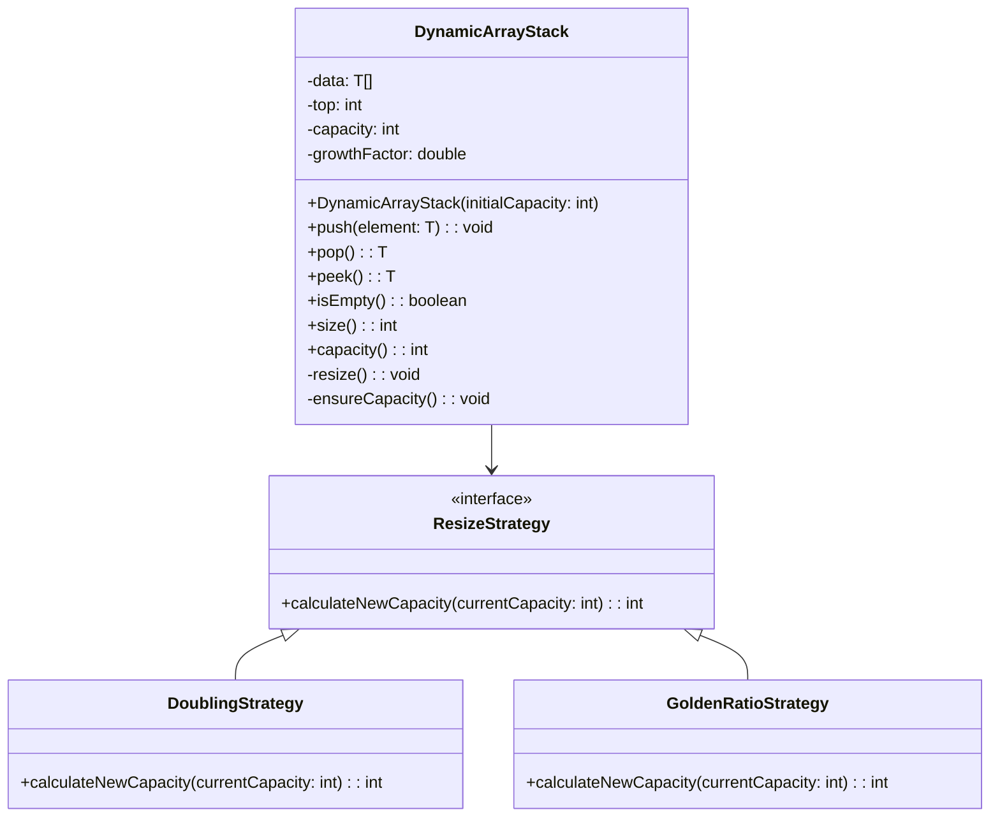

### 4.6 扩容内存视图


## 5. 基于链表的栈实现

### 5.1 链表栈的设计思想

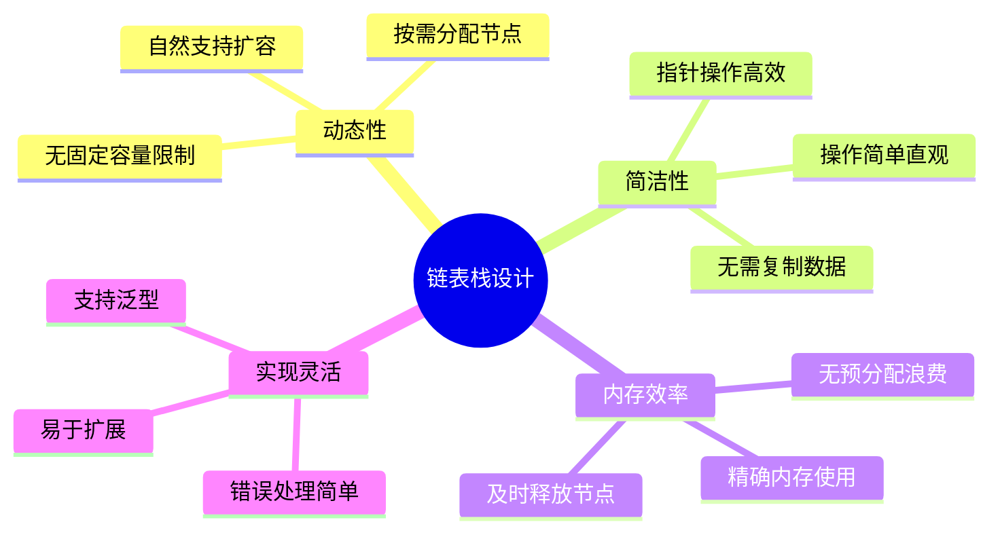

### 5.2 链表栈的节点结构

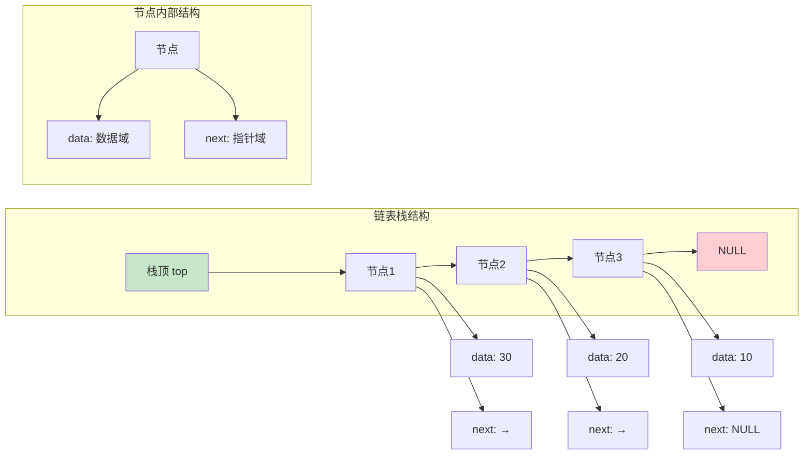

### 5.3 链表栈的类设计

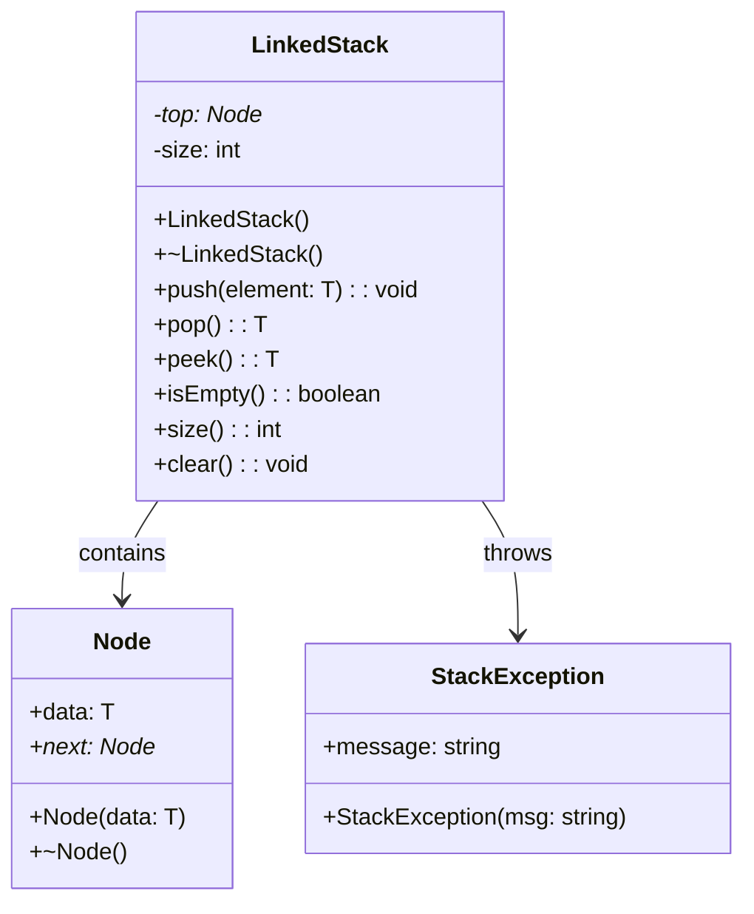

### 5.4 链表栈操作的详细流程

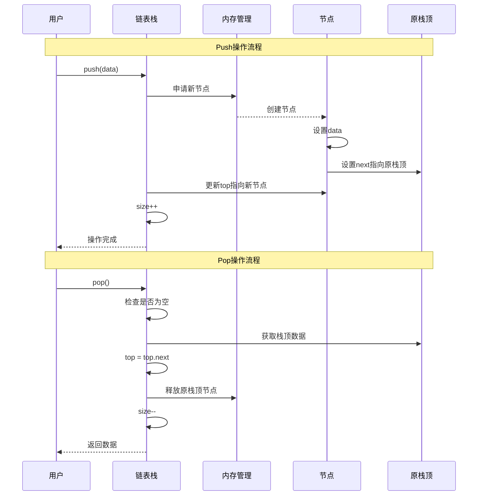

### 5.5 链表栈操作的可视化

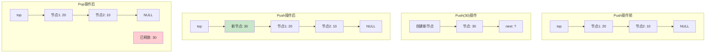

### 5.6 链表栈与数组栈的对比

```mermaid
graph TB
    subgraph "性能对比"
        A[特性] --> A1[数组栈]
        A --> A2[链表栈]
        
        B[内存使用] --> B1[预分配+浪费]
        B --> B2[按需分配]
        
        C[访问速度] --> C1[缓存友好]
        C --> C2[指针跳转]
        
        D[扩容成本] --> D1[O(n)复制]
        D --> D2[O(1)分配]
        
        E[内存开销] --> E1[连续存储]
        E --> E2[额外指针]
        
        F[实现复杂度] --> F1[简单]
        F --> F2[中等]
    end
    
    style B1 fill:#ffcdd2
    style B2 fill:#c8e6c9
    style C1 fill:#c8e6c9
    style C2 fill:#ffcdd2
    style D1 fill:#ffcdd2
    style D2 fill:#c8e6c9
```

## 6. 栈的时间复杂度分析

### 6.1 基本操作时间复杂度

```mermaid
graph TB
    subgraph "栈操作时间复杂度"
        A[操作类型] --> A1[数组栈]
        A --> A2[链表栈]
        A --> A3[动态数组栈]
        
        B[Push] --> B1[O(1)]
        B --> B2[O(1)]
        B --> B3[O(1)摊销]
        
        C[Pop] --> C1[O(1)]
        C --> C2[O(1)]
        C --> C3[O(1)]
        
        D[Peek] --> D1[O(1)]
        D --> D2[O(1)]
        D --> D3[O(1)]
        
        E[IsEmpty] --> E1[O(1)]
        E --> E2[O(1)]
        E --> E3[O(1)]
        
        F[Size] --> F1[O(1)]
        F --> F2[O(1)]
        F --> F3[O(1)]
    end
    
    style B1 fill:#c8e6c9
    style B2 fill:#c8e6c9
    style B3 fill:#fff3e0
    style C1 fill:#c8e6c9
    style C2 fill:#c8e6c9
    style C3 fill:#c8e6c9
```

### 6.2 空间复杂度分析

```mermaid
graph LR
    subgraph "空间复杂度对比"
        A[栈类型] --> A1[空间复杂度]
        A --> A2[额外开销]
        
        B[数组栈] --> B1[O(n)]
        B --> B2[预分配空间]
        
        C[链表栈] --> C1[O(n)]
        C --> C2[指针开销]
        
        D[动态数组栈] --> D1[O(n)]
        D --> D2[扩容预留]
    end
    
    subgraph "内存使用效率"
        E[数组栈] --> E1[可能浪费空间]
        F[链表栈] --> F1[精确使用]
        G[动态数组栈] --> G1[平衡效率]
    end
    
    style F1 fill:#c8e6c9
    style G1 fill:#e1f5fe
    style E1 fill:#ffcdd2
```

### 6.3 摊销分析详解

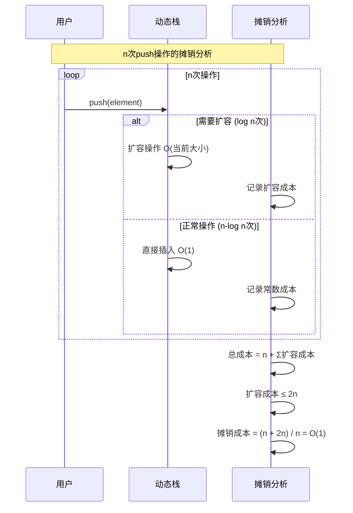

### 6.4 不同场景下的性能表现

```mermaid
graph TB
    subgraph "性能场景分析"
        A[使用场景]
        B[推荐实现]
        C[性能特点]
    end
    
    A --> A1[频繁push/pop]
    A --> A2[大量数据]
    A --> A3[内存受限]
    A --> A4[缓存敏感]
    
    A1 --> B1[链表栈]
    A2 --> B2[动态数组栈]
    A3 --> B3[链表栈]
    A4 --> B4[数组栈]
    
    B1 --> C1[无扩容开销]
    B2 --> C2[摊销O(1)]
    B3 --> C3[按需分配]
    B4 --> C4[缓存友好]
    
    style C1 fill:#c8e6c9
    style C2 fill:#e1f5fe
    style C3 fill:#c8e6c9
    style C4 fill:#fff3e0
```

## 7. 函数调用栈

### 7.1 函数调用栈的概念

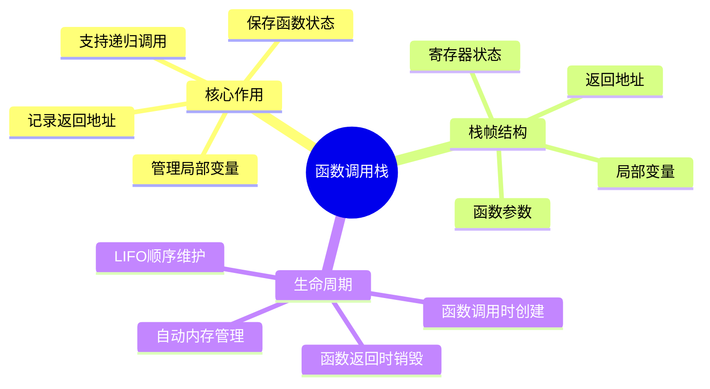

### 7.2 函数调用栈的结构

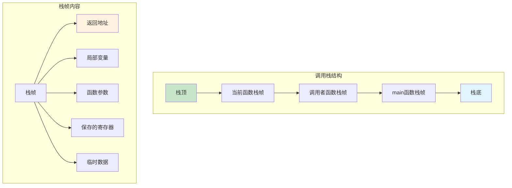

### 7.3 函数调用过程详解

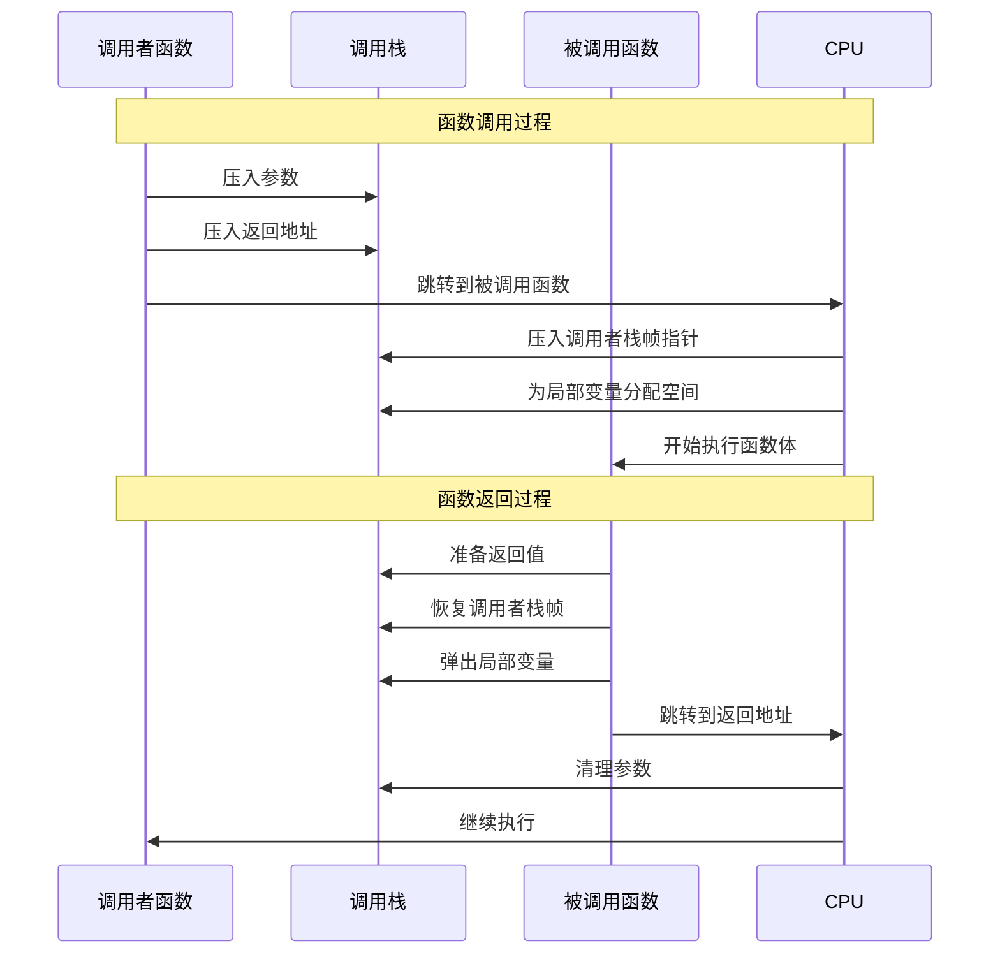

### 7.4 递归函数的栈使用

```mermaid
graph TB
    subgraph "递归调用栈示例: factorial(3)"
        A[factorial(3)] --> A1[n=3, 返回地址]
        A1 --> B[factorial(2)]
        B --> B1[n=2, 返回地址]
        B1 --> C[factorial(1)]
        C --> C1[n=1, 返回地址]
        C1 --> D[factorial(0)]
        D --> D1[n=0, 返回地址]
    end
    
    subgraph "返回过程"
        E[factorial(0) 返回 1]
        F[factorial(1) 返回 1×1=1]
        G[factorial(2) 返回 2×1=2]
        H[factorial(3) 返回 3×2=6]
    end
    
    D1 --> E
    E --> F
    F --> G
    G --> H
    
    style D1 fill:#c8e6c9
    style H fill:#c8e6c9
```

### 7.5 栈溢出问题分析

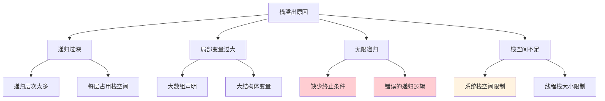

### 7.6 函数调用栈的优化策略

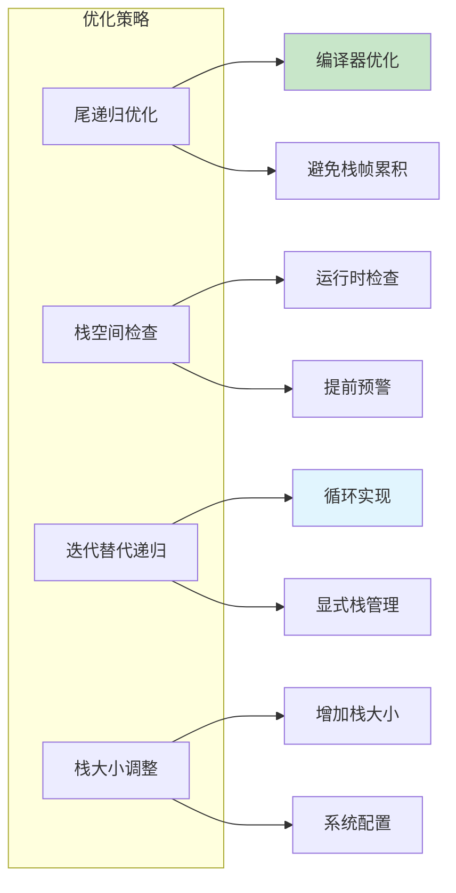

## 8. 浏览器前进后退实现

### 8.1 浏览器导航的需求分析

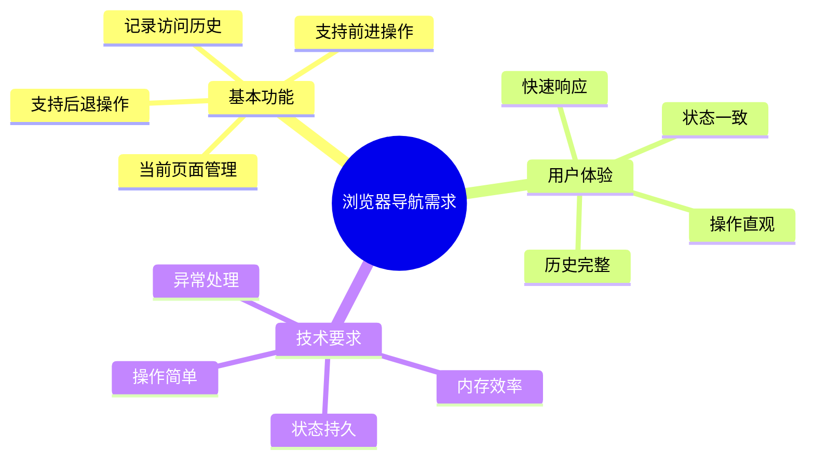

### 8.2 双栈设计方案

```mermaid
graph TB
    subgraph "双栈导航设计"
        A[后退栈 BackStack]
        B[当前页面 Current]
        C[前进栈 ForwardStack]
    end
    
    subgraph "栈内容示例"
        A --> A1[页面3]
        A1 --> A2[页面2]
        A2 --> A3[页面1]
        
        B --> B1[页面4]
        
        C --> C1[页面6]
        C1 --> C2[页面5]
    end
    
    subgraph "操作说明"
        D[后退: BackStack.pop() → Current]
        E[前进: ForwardStack.pop() → Current]
        F[新页面: Current → BackStack.push()]
    end
    
    style B1 fill:#c8e6c9
    style A fill:#e1f5fe
    style C fill:#fff3e0
```

### 8.3 浏览器导航类设计

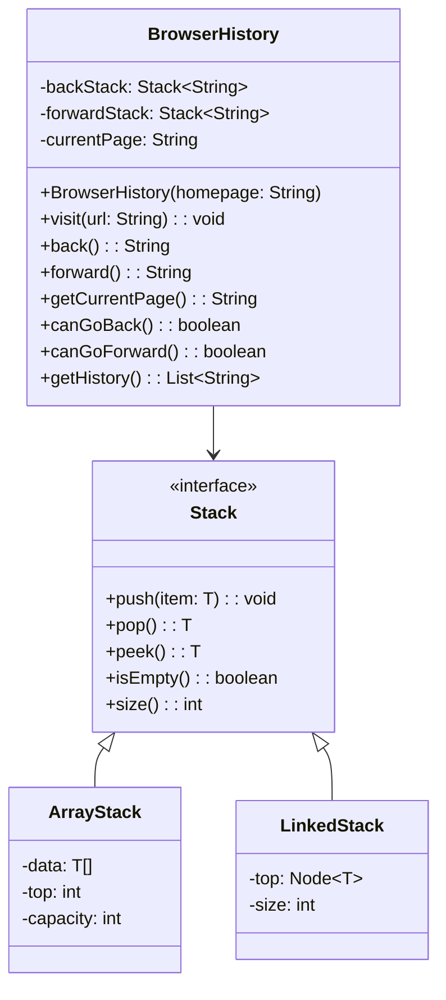

### 8.4 导航操作的详细流程

```mermaid
sequenceDiagram
    participant User as 用户
    participant Browser as 浏览器历史
    participant BackStack as 后退栈
    participant ForwardStack as 前进栈
    
    Note over User,ForwardStack: 访问新页面
    User->>Browser: visit("page2.html")
    Browser->>BackStack: push(currentPage)
    Browser->>Browser: currentPage = "page2.html"
    Browser->>ForwardStack: clear()
    
    Note over User,ForwardStack: 后退操作
    User->>Browser: back()
    Browser->>BackStack: pop() → previousPage
    Browser->>ForwardStack: push(currentPage)
    Browser->>Browser: currentPage = previousPage
    Browser-->>User: 显示previousPage
    
    Note over User,ForwardStack: 前进操作
    User->>Browser: forward()
    Browser->>ForwardStack: pop() → nextPage
    Browser->>BackStack: push(currentPage)
    Browser->>Browser: currentPage = nextPage
    Browser-->>User: 显示nextPage
```

### 8.5 导航状态变化图

```mermaid
stateDiagram-v2
    [*] --> HomePage : 初始化
    
    HomePage --> Page2 : visit(page2)
    Page2 --> Page3 : visit(page3)
    Page3 --> Page4 : visit(page4)
    
    Page4 --> Page3 : back()
    Page3 --> Page2 : back()
    Page2 --> HomePage : back()
    
    Page3 --> Page4 : forward()
    Page2 --> Page3 : forward()
    
    Page3 --> NewPage : visit(newpage)
    NewPage --> [*] : 清空前进栈
    
    note right of Page4 : 前进栈为空
    note right of HomePage : 后退栈为空
    note right of NewPage : 访问新页面清空前进历史
```

### 8.6 完整的浏览器历史实现

```mermaid
flowchart TD
    A[浏览器历史管理] --> B{操作类型}
    
    B -->|访问新页面| C[visit操作]
    B -->|后退| D[back操作]
    B -->|前进| E[forward操作]
    
    C --> C1[当前页面压入后退栈]
    C1 --> C2[设置新页面为当前页面]
    C2 --> C3[清空前进栈]
    C3 --> C4[更新UI状态]
    
    D --> D1{后退栈是否为空?}
    D1 -->|是| D2[无法后退]
    D1 -->|否| D3[从后退栈弹出页面]
    D3 --> D4[当前页面压入前进栈]
    D4 --> D5[设置弹出页面为当前页面]
    D5 --> D6[更新UI状态]
    
    E --> E1{前进栈是否为空?}
    E1 -->|是| E2[无法前进]
    E1 -->|否| E3[从前进栈弹出页面]
    E3 --> E4[当前页面压入后退栈]
    E4 --> E5[设置弹出页面为当前页面]
    E5 --> E6[更新UI状态]
    
    style C4 fill:#c8e6c9
    style D6 fill:#c8e6c9
    style E6 fill:#c8e6c9
    style D2 fill:#ffcdd2
    style E2 fill:#ffcdd2
```

### 8.7 浏览器历史的扩展功能

```mermaid
graph TB
    subgraph "扩展功能"
        A[历史记录持久化]
        B[历史记录搜索]
        C[收藏夹管理]
        D[标签页历史]
        E[隐私模式]
    end
    
    A --> A1[本地存储]
    A --> A2[数据库保存]
    A --> A3[会话恢复]
    
    B --> B1[关键词搜索]
    B --> B2[时间范围筛选]
    B --> B3[访问频率排序]
    
    C --> C1[快速访问]
    C --> C2[分类管理]
    C --> C3[同步功能]
    
    D --> D1[每个标签独立历史]
    D --> D2[标签间历史共享]
    D --> D3[标签历史合并]
    
    E --> E1[不记录历史]
    E --> E2[临时存储]
    E --> E3[自动清理]
    
    style A1 fill:#e1f5fe
    style B1 fill:#fff3e0
    style C1 fill:#c8e6c9
```

### 8.8 性能优化考虑

```mermaid
graph LR
    subgraph "性能优化策略"
        A[内存管理]
        B[存储优化]
        C[操作优化]
        D[用户体验]
    end
    
    A --> A1[限制历史记录数量]
    A --> A2[LRU淘汰策略]
    A --> A3[内存池技术]
    
    B --> B1[压缩存储]
    B --> B2[增量保存]
    B --> B3[异步持久化]
    
    C --> C1[批量操作]
    C --> C2[延迟加载]
    C --> C3[缓存机制]
    
    D --> D1[快速响应]
    D --> D2[状态反馈]
    D --> D3[平滑动画]
    
    style A1 fill:#c8e6c9
    style B2 fill:#e1f5fe
    style C3 fill:#fff3e0
    style D1 fill:#c8e6c9
```

## 总结

### 栈的核心价值

```mermaid
mindmap
  root((栈的核心价值))
    简单性
      概念直观
      操作简单
      实现容易
    高效性
      O(1)基本操作
      内存使用高效
      CPU缓存友好
    实用性
      函数调用支持
      表达式求值
      括号匹配
      浏览器历史
    扩展性
      支持多种实现
      易于优化
      适应不同场景
```

### 栈的设计哲学

栈体现了计算机科学中的重要设计原则：

1. **约束即力量**：通过限制访问方式，栈提供了强大的抽象能力
2. **简单即美**：简单的LIFO原则支撑了复杂的应用场景
3. **效率优先**：O(1)的基本操作保证了高效的性能表现
4. **自然映射**：栈的概念与现实世界和计算模型自然对应

### 实际应用指导

1. **选择合适的实现**：根据使用场景选择数组栈、链表栈或动态栈
2. **注意内存管理**：特别是在C/C++中，要正确处理栈的内存分配和释放
3. **处理边界条件**：空栈操作、栈满等情况需要适当处理
4. **考虑性能需求**：在内存使用、操作效率和实现复杂度之间找到平衡

### 栈的现代发展

1. **线程安全栈**：支持多线程并发访问的栈实现
2. **无锁栈**：使用原子操作实现的高性能并发栈
3. **持久化栈**：支持数据持久化的栈结构
4. **分布式栈**：在分布式系统中的栈应用

栈作为最基础的数据结构之一，不仅在算法和数据结构学习中占据重要地位，更在实际的软件开发中发挥着关键作用。从函数调用到浏览器导航，从表达式求值到撤销重做，栈的应用无处不在。深入理解栈的原理和实现，有助于我们更好地设计和优化程序，解决实际的工程问题。