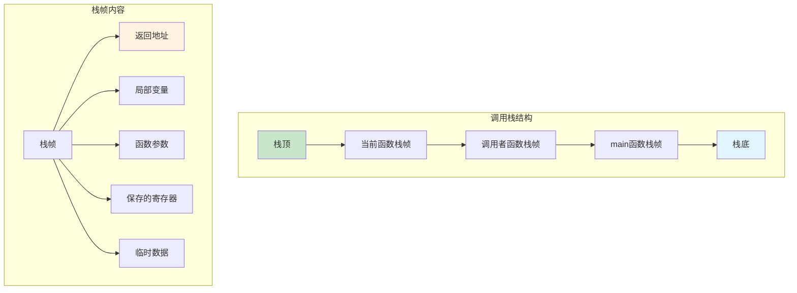
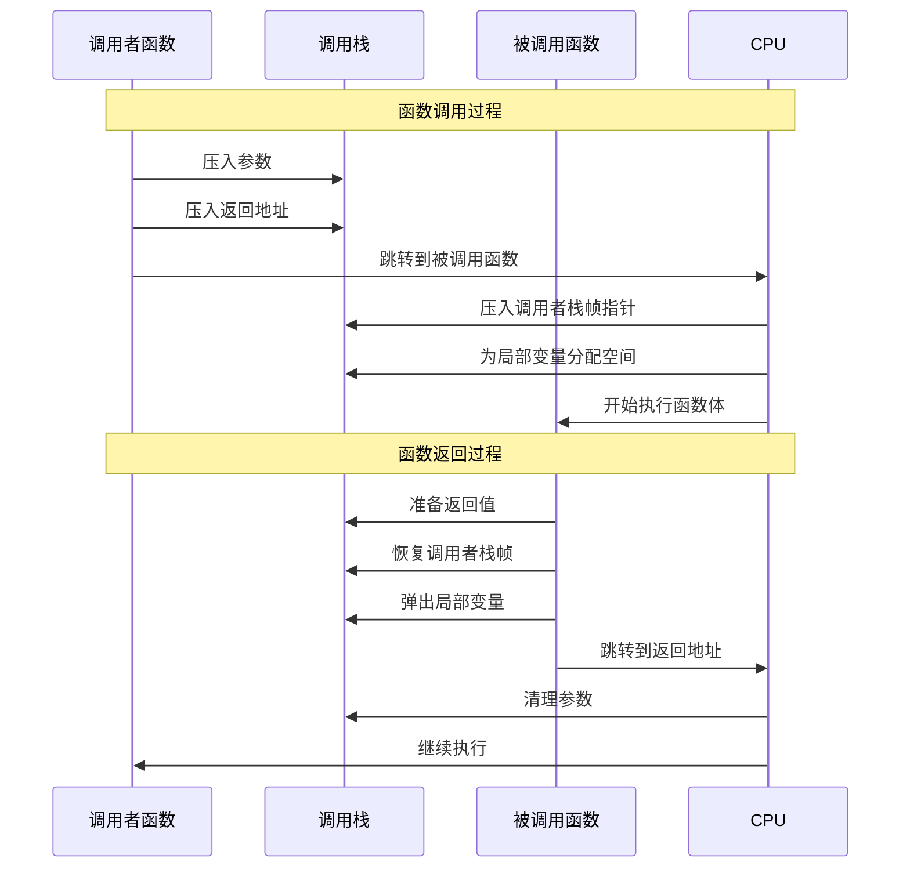
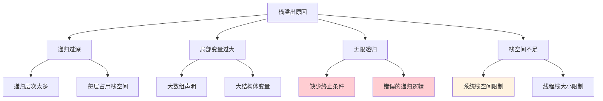
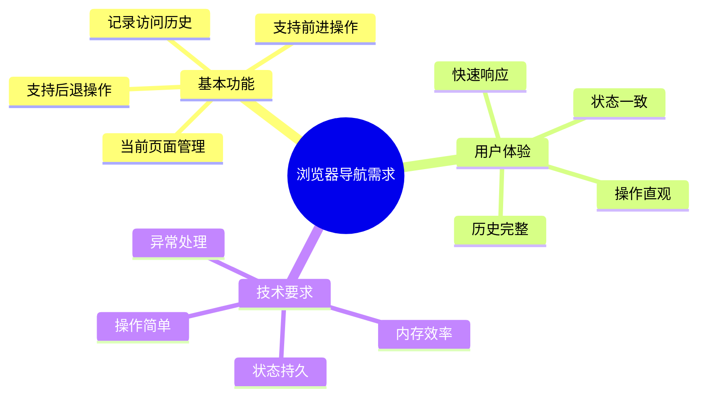
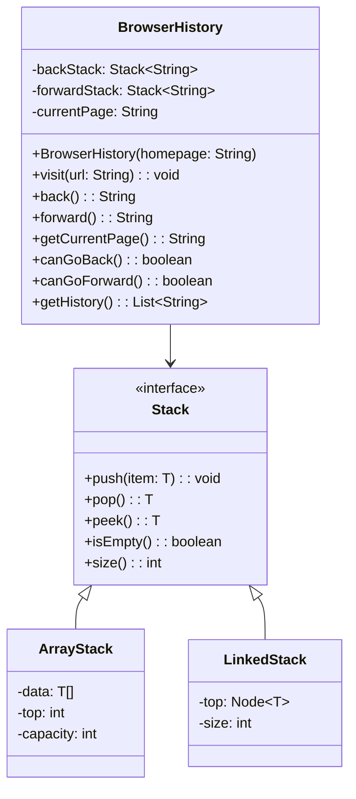
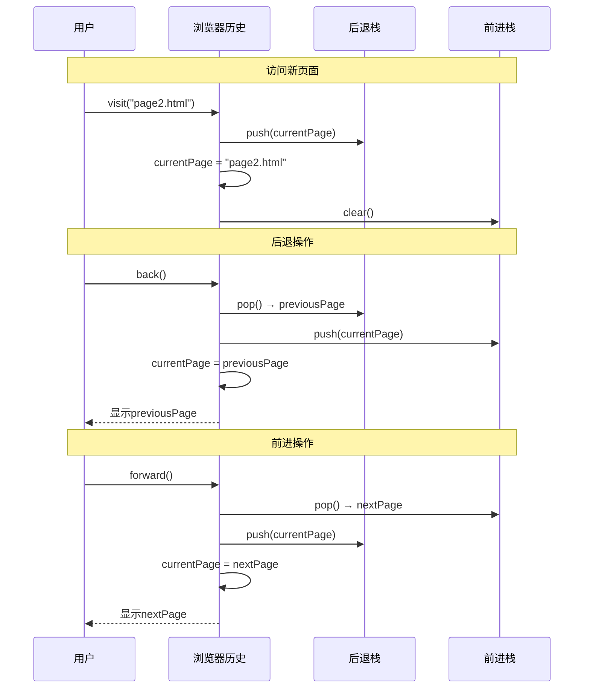
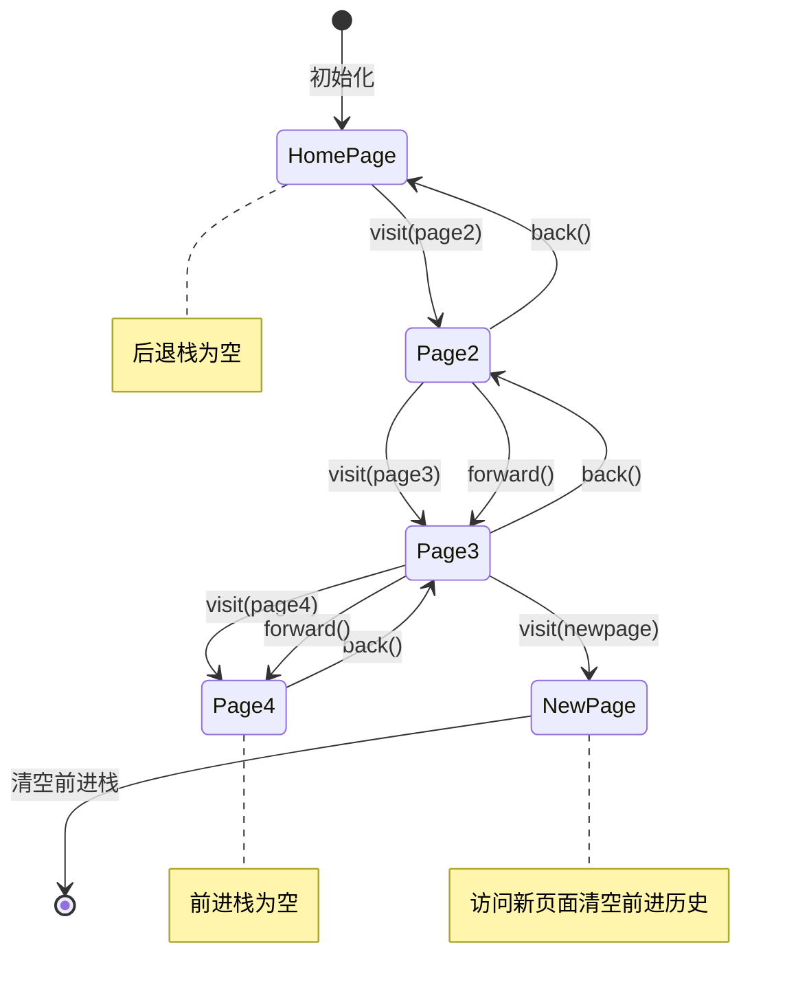
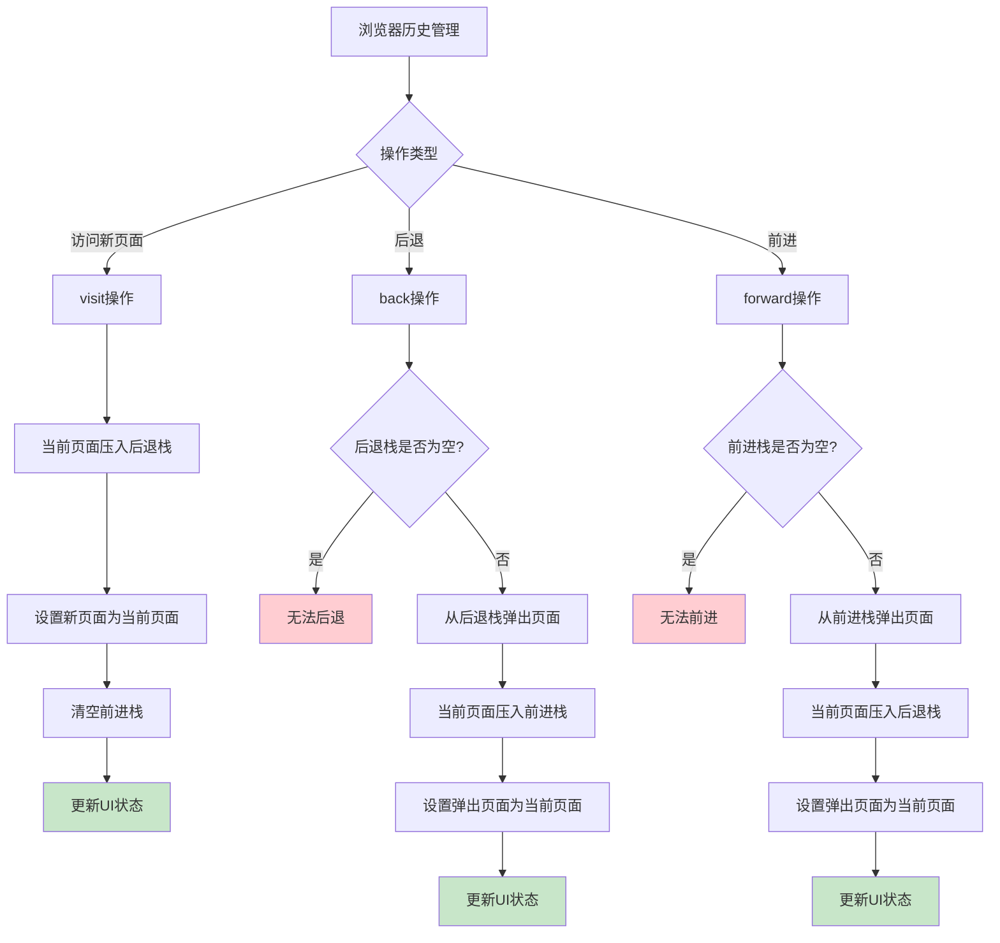
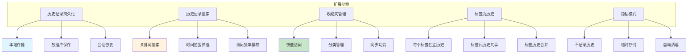
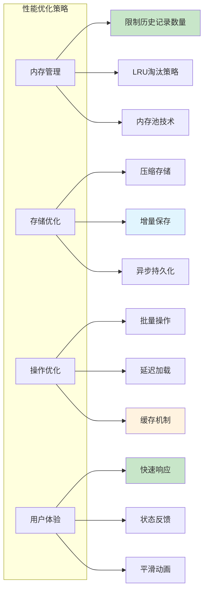

# 栈深入浅出技术文档

## 目录
- [1. 什么是栈](#1-什么是栈)
- [2. 栈的核心思想与原理](#2-栈的核心思想与原理)
- [3. 栈的实现方式](#3-栈的实现方式)
- [4. 动态扩容顺序栈](#4-动态扩容顺序栈)
- [5. 基于链表的栈实现](#5-基于链表的栈实现)
- [6. 栈的时间复杂度分析](#6-栈的时间复杂度分析)
- [7. 函数调用栈](#7-函数调用栈)
- [8. 浏览器前进后退实现](#8-浏览器前进后退实现)


## 7. 函数调用栈

### 7.1 函数调用栈概念


### 7.2 函数调用栈的结构



### 7.3 函数调用过程详解



### 7.4 递归函数的栈使用

```mermaid
graph TB
    subgraph "递归调用栈示例: factorial(3)"
        A[factorial(3)] --> A1[n=3, 返回地址]
        A1 --> B[factorial(2)]
        B --> B1[n=2, 返回地址]
        B1 --> C[factorial(1)]
        C --> C1[n=1, 返回地址]
        C1 --> D[factorial(0)]
        D --> D1[n=0, 返回地址]
    end
    
    subgraph "返回过程"
        E[factorial(0) 返回 1]
        F[factorial(1) 返回 1×1=1]
        G[factorial(2) 返回 2×1=2]
        H[factorial(3) 返回 3×2=6]
    end
    
    D1 --> E
    E --> F
    F --> G
    G --> H
    
    style D1 fill:#c8e6c9
    style H fill:#c8e6c9
```

### 7.5 栈溢出问题分析



## 8. 浏览器前进后退实现

### 8.1 浏览器导航的需求分析



### 8.2 双栈设计方案

```mermaid
graph TB
    subgraph "双栈导航设计"
        A[后退栈 BackStack]
        B[当前页面 Current]
        C[前进栈 ForwardStack]
    end
    
    subgraph "栈内容示例"
        A --> A1[页面3]
        A1 --> A2[页面2]
        A2 --> A3[页面1]
        
        B --> B1[页面4]
        
        C --> C1[页面6]
        C1 --> C2[页面5]
    end
    
    subgraph "操作说明"
        D[后退: BackStack.pop() → Current]
        E[前进: ForwardStack.pop() → Current]
        F[新页面: Current → BackStack.push()]
    end
    
    style B1 fill:#c8e6c9
    style A fill:#e1f5fe
    style C fill:#fff3e0
```

### 8.3 浏览器导航类设计



### 8.4 导航操作的详细流程



### 8.5 导航状态变化图



### 8.6 完整的浏览器历史实现



### 8.7 浏览器历史的扩展功能



### 8.8 性能优化考虑



## 总结

### 栈的核心价值

```mermaid
mindmap
  root((栈的核心价值))
    简单性
      概念直观
      操作简单
      实现容易
    高效性
      O(1)基本操作
      内存使用高效
      CPU缓存友好
    实用性
      函数调用支持
      表达式求值
      括号匹配
      浏览器历史
    扩展性
      支持多种实现
      易于优化
      适应不同场景
```

### 栈的设计哲学

栈体现了计算机科学中的重要设计原则：

1. **约束即力量**：通过限制访问方式，栈提供了强大的抽象能力
2. **简单即美**：简单的LIFO原则支撑了复杂的应用场景
3. **效率优先**：O(1)的基本操作保证了高效的性能表现
4. **自然映射**：栈的概念与现实世界和计算模型自然对应

### 实际应用指导

1. **选择合适的实现**：根据使用场景选择数组栈、链表栈或动态栈
2. **注意内存管理**：特别是在C/C++中，要正确处理栈的内存分配和释放
3. **处理边界条件**：空栈操作、栈满等情况需要适当处理
4. **考虑性能需求**：在内存使用、操作效率和实现复杂度之间找到平衡

### 栈的现代发展

1. **线程安全栈**：支持多线程并发访问的栈实现
2. **无锁栈**：使用原子操作实现的高性能并发栈
3. **持久化栈**：支持数据持久化的栈结构
4. **分布式栈**：在分布式系统中的栈应用

栈作为最基础的数据结构之一，不仅在算法和数据结构学习中占据重要地位，更在实际的软件开发中发挥着关键作用。从函数调用到浏览器导航，从表达式求值到撤销重做，栈的应用无处不在。深入理解栈的原理和实现，有助于我们更好地设计和优化程序，解决实际的工程问题。