# 红黑树深入浅出技术文档

## 目录
- [1. 什么是红黑树](#1-什么是红黑树)
- [2. 为什么需要红黑树](#2-为什么需要红黑树)
- [3. 红黑树核心设计思想](#3-红黑树核心设计思想)
- [4. 红黑树的分类与特性](#4-红黑树的分类与特性)
- [5. 红黑树的应用场景](#5-红黑树的应用场景)
- [6. 红黑树的遍历算法](#6-红黑树的遍历算法)
- [7. 红黑树元素添加和移除](#7-红黑树元素添加和移除)
- [8. 红黑树效率分析](#8-红黑树效率分析)

## 1. 什么是红黑树

### 1.1 红黑树的定义

红黑树（Red-Black Tree）是一种自平衡的二叉搜索树，它通过对节点进行红色或黑色的着色，并遵循特定的着色规则来保持树的近似平衡。红黑树是由Rudolf Bayer在1972年发明的，最初被称为"对称二叉B树"，后来被Leo J. Guibas和Robert Sedgewick重新命名为红黑树。

### 1.2 红黑树的基本结构

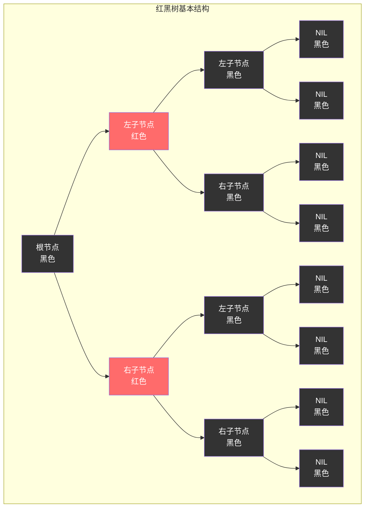

### 1.3 红黑树的五大性质

```mermaid
mindmap
  root((红黑树五大性质))
    性质1
      每个节点要么是红色
      要么是黑色
      二元着色规则
    性质2
      根节点必须是黑色
      树的起始点约束
      保证结构稳定性
    性质3
      所有叶子节点(NIL)都是黑色
      空节点统一着色
      简化边界处理
    性质4
      红色节点的子节点必须是黑色
      不能有连续的红色节点
      避免路径过短
    性质5
      从任一节点到其叶子节点的路径
      包含相同数量的黑色节点
      保证路径长度平衡
```

### 1.4 红黑树节点结构

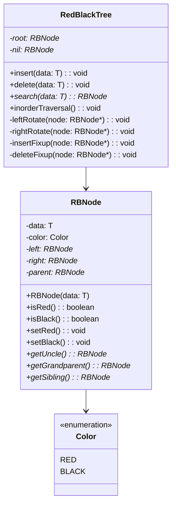

### 1.5 红黑树的数学性质

```mermaid
graph LR
    subgraph "红黑树数学性质"
        A[性质1] --> A1[树的高度最多为2log₂(n+1)]
        B[性质2] --> B1[最长路径不超过最短路径的2倍]
        C[性质3] --> C1[查找、插入、删除时间复杂度O(log n)]
        D[性质4] --> D1[黑高度定义了树的平衡程度]
        E[性质5] --> E1[任何子树都是红黑树]
    end
    
    style A1 fill:#c8e6c9
    style B1 fill:#e1f5fe
    style C1 fill:#fff3e0
    style D1 fill:#f3e5f5
    style E1 fill:#fce4ec
```

### 1.6 红黑树与AVL树的对比

```mermaid
graph TB
    subgraph "红黑树 vs AVL树"
        A[特性对比] --> A1[红黑树]
        A --> A2[AVL树]
        
        B[平衡程度] --> B1[近似平衡<br/>高度≤2log₂(n+1)]
        B --> B2[严格平衡<br/>|左右子树高度差|≤1]
        
        C[旋转次数] --> C1[插入最多2次<br/>删除最多3次]
        C --> C2[插入最多2次<br/>删除可能O(log n)次]
        
        D[查找性能] --> D1[O(log n)<br/>常数因子较大]
        D --> D2[O(log n)<br/>常数因子较小]
        
        E[插入删除性能] --> E1[较好<br/>旋转次数少]
        E --> E2[较差<br/>旋转次数多]
        
        F[应用场景] --> F1[频繁插入删除<br/>如STL容器]
        F --> F2[频繁查找<br/>如数据库索引]
    end
    
    style B1 fill:#ff6b6b,color:#fff
    style B2 fill:#4ecdc4,color:#fff
    style E1 fill:#c8e6c9
    style F2 fill:#e1f5fe
```

## 2. 为什么需要红黑树

### 2.1 二叉搜索树的问题

```mermaid
graph TB
    subgraph "普通BST的问题"
        A[数据有序插入] --> B[树退化为链表]
        B --> C[查找效率降为O(n)]
        C --> D[失去树结构优势]
        
        E[随机数据插入] --> F[树可能不平衡]
        F --> G[性能不稳定]
        G --> H[最坏情况难以预测]
    end
    
    subgraph "退化示例"
        I[插入序列: 1,2,3,4,5]
        J[1] --> K[2]
        K --> L[3]
        L --> M[4]
        M --> N[5]
    end
    
    style B fill:#ffcdd2
    style C fill:#ffcdd2
    style D fill:#ffcdd2
    style J fill:#ffcdd2
```

### 2.2 AVL树的局限性

```mermaid
flowchart TD
    A[AVL树的局限性] --> B[严格平衡要求]
    A --> C[频繁旋转操作]
    A --> D[实现复杂度高]
    A --> E[插入删除开销大]
    
    B --> B1[任何插入删除都可能破坏平衡]
    B --> B2[需要立即调整]
    B --> B3[维护成本高]
    
    C --> C1[删除操作可能需要O(log n)次旋转]
    C --> C2[影响性能]
    C --> C3[不适合频繁更新场景]
    
    D --> D1[平衡因子计算复杂]
    D --> D2[多种旋转情况]
    D --> D3[代码维护困难]
    
    E --> E1[每次操作都要检查平衡]
    E --> E2[调整开销大]
    E --> E3[实时性要求高的场景不适用]
    
    style B1 fill:#ffcdd2
    style C1 fill:#ffcdd2
    style D1 fill:#ffcdd2
    style E1 fill:#ffcdd2
```

### 2.3 红黑树的优势

```mermaid
mindmap
  root((红黑树优势))
    性能优势
      查找O(log n)保证
      插入删除高效
      旋转次数有限
      性能稳定可预测
    实现优势
      规则相对简单
      代码实现清晰
      调试维护容易
      标准库广泛采用
    平衡优势
      近似平衡足够好
      维护成本低
      适应性强
      实用性高
    应用优势
      适合频繁更新
      内存开销合理
      并发友好
      工程实践成熟
```

### 2.4 红黑树解决的核心问题

```mermaid
graph LR
    subgraph "红黑树解决的问题"
        A[性能问题]
        B[平衡问题]
        C[实现问题]
        D[应用问题]
    end
    
    A --> A1[保证O(log n)性能]
    A --> A2[避免最坏情况]
    A --> A3[性能稳定可预测]
    
    B --> B1[近似平衡即可]
    B --> B2[维护成本低]
    B --> B3[调整操作有限]
    
    C --> C1[规则清晰简单]
    C --> C2[实现相对容易]
    C --> C3[调试维护方便]
    
    D --> D1[适合实际应用]
    D --> D2[标准库采用]
    D --> D3[工程实践验证]
    
    style A1 fill:#c8e6c9
    style B1 fill:#e1f5fe
    style C1 fill:#fff3e0
    style D1 fill:#f3e5f5
```

## 3. 红黑树核心设计思想

### 3.1 近似平衡思想

```mermaid
flowchart TD
    A[近似平衡设计思想] --> B[完美平衡不必要]
    A --> C[适度平衡即可]
    A --> D[维护成本考虑]
    A --> E[实用性优先]
    
    B --> B1[严格平衡成本高]
    B --> B2[微小不平衡影响小]
    B --> B3[性能提升边际递减]
    
    C --> C1[最长路径≤2×最短路径]
    C --> C2[保证O(log n)性能]
    C --> C3[平衡程度足够]
    
    D --> D1[减少旋转操作]
    D --> D2[降低实现复杂度]
    D --> D3[提高更新效率]
    
    E --> E1[工程实践导向]
    E --> E2[标准库需求]
    E --> E3[广泛应用场景]
    
    style C1 fill:#c8e6c9
    style D1 fill:#e1f5fe
    style E1 fill:#fff3e0
```

### 3.2 着色规则设计

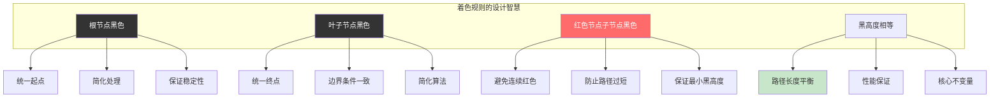

### 3.3 旋转与重着色策略

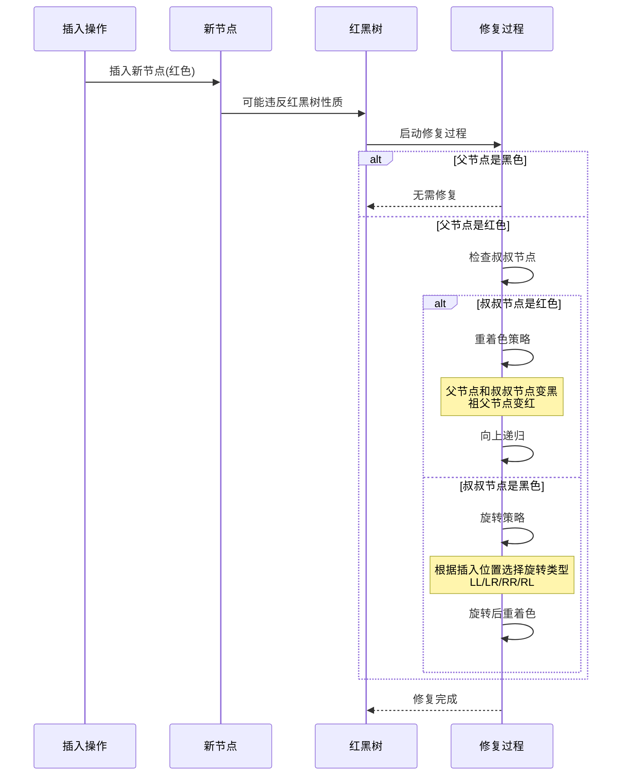

### 3.4 局部调整全局平衡

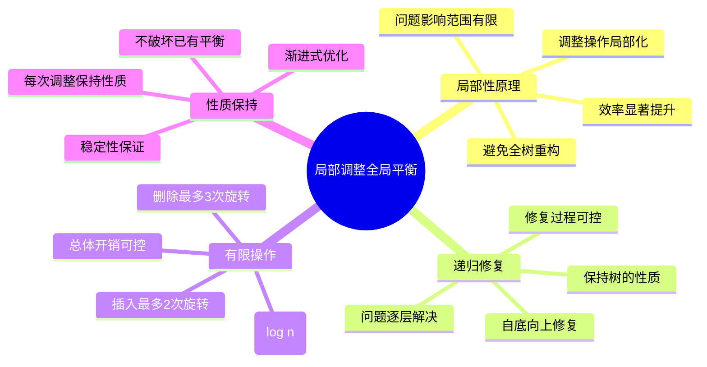

## 4. 红黑树的分类与特性

### 4.1 红黑树的变种

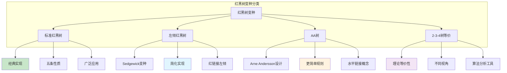

### 4.2 标准红黑树特性

```mermaid
graph LR
    subgraph "标准红黑树特性"
        A[结构特性]
        B[性能特性]
        C[操作特性]
        D[实现特性]
    end
    
    A --> A1[近似平衡二叉搜索树]
    A --> A2[节点着红色或黑色]
    A --> A3[满足五条性质]
    
    B --> B1[查找O(log n)]
    B --> B2[插入O(log n)]
    B --> B3[删除O(log n)]
    
    C --> C1[插入最多2次旋转]
    C --> C2[删除最多3次旋转]
    C --> C3[重着色O(log n)]
    
    D --> D1[实现相对复杂]
    D --> D2[需要维护颜色信息]
    D --> D3[调试较困难]
    
    style B1 fill:#c8e6c9
    style B2 fill:#c8e6c9
    style B3 fill:#c8e6c9
    style C1 fill:#e1f5fe
    style C2 fill:#e1f5fe
```

### 4.3 左倾红黑树特性

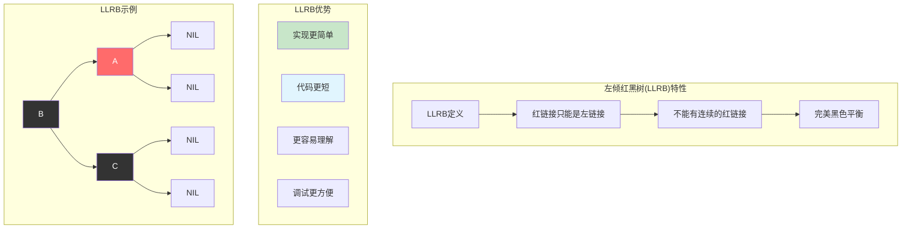

### 4.4 AA树特性

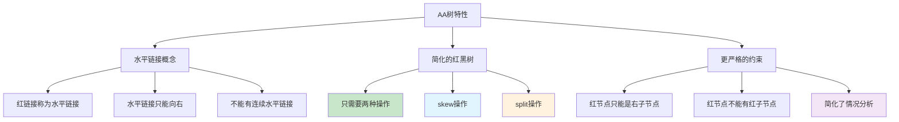

### 4.5 红黑树与2-3-4树的等价性

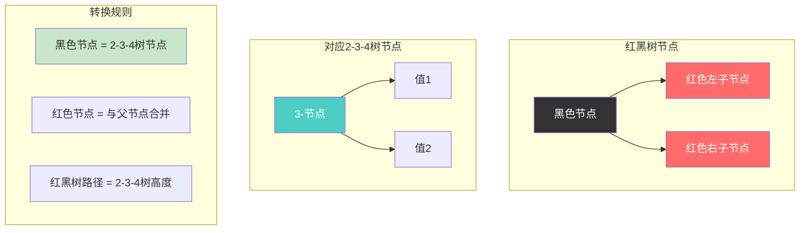

### 4.6 红黑树的不变量

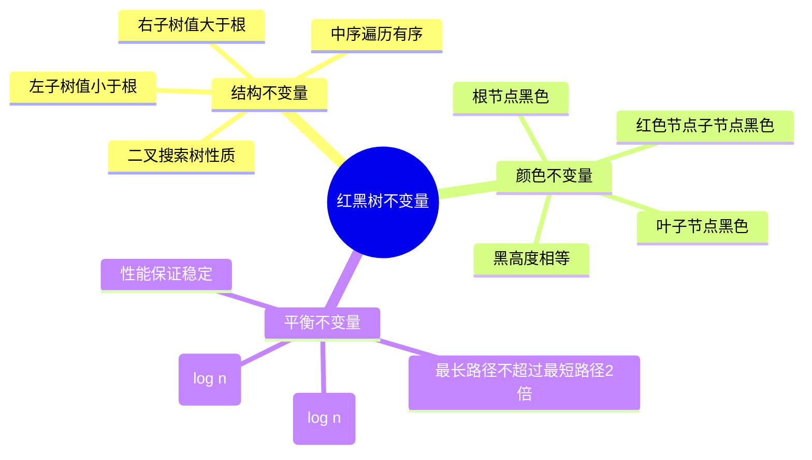

## 5. 红黑树的应用场景

### 5.1 标准库容器

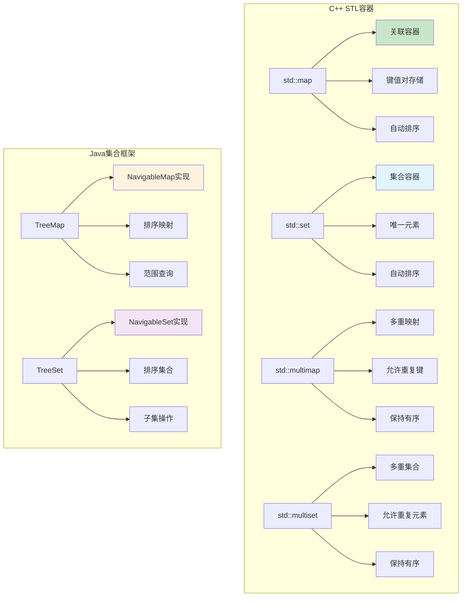

### 5.2 操作系统内核

```mermaid
sequenceDiagram
    participant Process as 进程调度
    participant RBTree as 红黑树
    participant CFS as 完全公平调度器
    participant VMA as 虚拟内存区域
    
    Note over Process,VMA: Linux内核中的红黑树应用
    
    Process->>RBTree: 进程调度队列
    RBTree->>CFS: 按虚拟运行时间排序
    CFS->>Process: O(log n)选择下一个进程
    
    Process->>RBTree: 虚拟内存管理
    RBTree->>VMA: 按地址范围组织VMA
    VMA->>Process: 快速查找内存区域
    
    Note over RBTree: 提供O(log n)的插入、删除、查找性能
    Note over CFS: 保证调度公平性和效率
```

### 5.3 数据库系统

```mermaid
graph LR
    subgraph "数据库中的红黑树应用"
        A[内存索引]
        B[查询优化]
        C[事务管理]
        D[缓存管理]
    end
    
    A --> A1[B+树的内存部分]
    A --> A2[临时索引结构]
    A --> A3[排序操作]
    
    B --> B1[执行计划优化]
    B --> B2[统计信息维护]
    B --> B3[成本估算]
    
    C --> C1[锁管理]
    C --> C2[事务日志]
    C --> C3[回滚段管理]
    
    D --> D1[LRU缓存实现]
    D --> D2[缓冲池管理]
    D --> D3[页面替换算法]
    
    style A1 fill:#c8e6c9
    style B1 fill:#e1f5fe
    style C1 fill:#fff3e0
    style D1 fill:#f3e5f5
```

### 5.4 网络协议栈

```mermaid
flowchart TD
    A[网络协议栈应用] --> B[路由表管理]
    A --> C[连接管理]
    A --> D[QoS调度]
    A --> E[防火墙规则]
    
    B --> B1[IP路由查找]
    B --> B2[最长前缀匹配]
    B --> B3[路由更新]
    
    C --> C1[TCP连接跟踪]
    C --> C2[NAT转换表]
    C --> C3[会话管理]
    
    D --> D1[流量分类]
    D --> D2[带宽分配]
    D --> D3[优先级队列]
    
    E --> E1[规则匹配]
    E --> E2[访问控制]
    E --> E3[流量过滤]
    
    style B1 fill:#c8e6c9
    style C1 fill:#e1f5fe
    style D1 fill:#fff3e0
    style E1 fill:#f3e5f5
```

### 5.5 编译器设计

```mermaid
graph TB
    subgraph "编译器中的红黑树应用"
        A[符号表管理]
        B[语法分析]
        C[代码优化]
        D[目标代码生成]
    end
    
    A --> A1[标识符存储]
    A --> A2[作用域管理]
    A --> A3[类型检查]
    
    B --> B1[语法树构建]
    B --> B2[错误恢复]
    B --> B3[语义分析]
    
    C --> C1[活跃变量分析]
    C --> C2[寄存器分配]
    C --> C3[死代码消除]
    
    D --> D1[指令调度]
    D --> D2[地址分配]
    D --> D3[重定位表]
    
    style A1 fill:#c8e6c9
    style B1 fill:#e1f5fe
    style C1 fill:#fff3e0
    style D1 fill:#f3e5f5
```

### 5.6 游戏引擎

```mermaid
sequenceDiagram
    participant Game as 游戏引擎
    participant RBTree as 红黑树
    participant Render as 渲染系统
    participant Physics as 物理系统
    participant AI as AI系统
    
    Note over Game,AI: 游戏引擎中的红黑树应用
    
    Game->>RBTree: 场景管理
    RBTree->>Render: 按深度排序渲染对象
    Render->>Game: 高效渲染
    
    Game->>RBTree: 碰撞检测
    RBTree->>Physics: 空间分割和查询
    Physics->>Game: 快速碰撞检测
    
    Game->>RBTree: AI决策
    RBTree->>AI: 状态空间搜索
    AI->>Game: 智能行为
    
    Note over RBTree: 提供O(log n)的空间查询和管理
```

### 5.7 实时系统

```mermaid
mindmap
  root((实时系统应用))
    任务调度
      优先级队列
      截止时间管理
      资源分配
      调度算法实现
    事件处理
      事件队列管理
      时间戳排序
      优先级处理
      实时响应保证
    资源管理
      内存分配器
      设备驱动
      中断处理
      系统调用
    性能监控
      性能计数器
      统计信息
      日志管理
      调试支持
```

## 6. 红黑树的遍历算法

### 6.1 遍历算法概览

```mermaid
graph TB
    subgraph "红黑树遍历算法"
        A[遍历类型]
        B[深度优先遍历]
        C[广度优先遍历]
        D[特殊遍历]
    end
    
    A --> B
    A --> C
    A --> D
    
    B --> B1[前序遍历<br/>根-左-右]
    B --> B2[中序遍历<br/>左-根-右]
    B --> B3[后序遍历<br/>左-右-根]
    
    C --> C1[层序遍历<br/>逐层访问]
    C --> C2[按颜色遍历<br/>红色/黑色节点]
    
    D --> D1[Morris遍历<br/>O(1)空间]
    D --> D2[范围遍历<br/>指定区间]
    D --> D3[条件遍历<br/>满足条件的节点]
    
    style B2 fill:#c8e6c9
    style C1 fill:#e1f5fe
    style D2 fill:#fff3e0
```

### 6.2 中序遍历(最重要)

```mermaid
sequenceDiagram
    participant User as 用户
    participant Tree as 红黑树
    participant Node as 当前节点
    participant Result as 结果序列
    
    User->>Tree: inorderTraversal()
    Tree->>Node: 从根节点开始
    
    loop 递归遍历
        alt 节点不为空
            Node->>Node: 遍历左子树
            Node->>Result: 访问当前节点
            Node->>Node: 遍历右子树
        else 节点为空
            Node-->>Tree: 返回
        end
    end
    
    Tree-->>User: 返回有序序列
    
    Note over Result: 中序遍历红黑树得到有序序列
    Note over Tree: 时间复杂度O(n)，空间复杂度O(h)
```

### 6.3 中序遍历示例

```mermaid
graph TB
    subgraph "红黑树示例"
        A[7] --> B[3]
        A --> C[18]
        B --> D[1]
        B --> E[5]
        C --> F[12]
        C --> G[20]
        E --> H[4]
        E --> I[6]
        F --> J[9]
        F --> K[15]
    end
    
    subgraph "中序遍历结果"
        L[遍历顺序: 1 → 3 → 4 → 5 → 6 → 7 → 9 → 12 → 15 → 18 → 20]
        M[特点: 严格递增的有序序列]
    end
    
    style A fill:#333,color:#fff
    style B fill:#ff6b6b,color:#fff
    style C fill:#ff6b6b,color:#fff
    style D fill:#333,color:#fff
    style E fill:#333,color:#fff
    style F fill:#333,color:#fff
    style G fill:#333,color:#fff
    style H fill:#ff6b6b,color:#fff
    style I fill:#ff6b6b,color:#fff
    style J fill:#ff6b6b,color:#fff
    style K fill:#ff6b6b,color:#fff
    style M fill:#c8e6c9
```

### 6.4 范围遍历实现

```mermaid
flowchart TD
    A[范围遍历 range(min, max)] --> B{当前节点为空?}
    
    B -->|是| C[返回]
    B -->|否| D{节点值 < min?}
    
    D -->|是| E[只遍历右子树]
    D -->|否| F{节点值 > max?}
    
    F -->|是| G[只遍历左子树]
    F -->|否| H[遍历左子树]
    
    H --> I[访问当前节点]
    I --> J[遍历右子树]
    
    E --> K[递归右子树]
    G --> L[递归左子树]
    J --> M[递归右子树]
    
    K --> C
    L --> C
    M --> C
    
    style I fill:#c8e6c9
    style H fill:#e1f5fe
    style J fill:#fff3e0
```

### 6.5 按颜色遍历

```mermaid
sequenceDiagram
    participant User as 用户
    participant Tree as 红黑树
    participant RedNodes as 红色节点集合
    participant BlackNodes as 黑色节点集合
    
    User->>Tree: traverseByColor()
    Tree->>Tree: 开始遍历
    
    loop 遍历所有节点
        Tree->>Tree: 检查节点颜色
        
        alt 节点是红色
            Tree->>RedNodes: 添加到红色节点集合
        else 节点是黑色
            Tree->>BlackNodes: 添加到黑色节点集合
        end
    end
    
    Tree-->>User: 返回分类结果
    
    Note over RedNodes: 红色节点通常较少
    Note over BlackNodes: 黑色节点构成树的骨架
```

### 6.6 迭代器实现

```mermaid
classDiagram
    class RBTreeIterator {
        -current: RBNode*
        -stack: Stack~RBNode*~
        -tree: RedBlackTree*
        +RBTreeIterator(tree: RedBlackTree*)
        +hasNext(): boolean
        +next(): T
        +remove(): void
        -pushLeft(node: RBNode*): void
        -findSuccessor(): RBNode*
    }
    
    class RedBlackTree {
        -root: RBNode*
        +begin(): RBTreeIterator
        +end(): RBTreeIterator
        +find(key: T): RBTreeIterator
        +lowerBound(key: T): RBTreeIterator
        +upperBound(key: T): RBTreeIterator
    }
    
    class Iterator {
        <<interface>>
        +hasNext(): boolean
        +next(): T
        +remove(): void
    }
    
    Iterator <|-- RBTreeIterator
    RedBlackTree --> RBTreeIterator
```

### 6.7 遍历性能分析

```mermaid
graph LR
    subgraph "遍历算法性能对比"
        A[遍历类型] --> A1[时间复杂度]
        A --> A2[空间复杂度]
        A --> A3[适用场景]
        
        B[完整遍历] --> B1[O(n)]
        B --> B2[O(h)递归栈]
        B --> B3[获取所有元素]
        
        C[范围遍历] --> C1[O(k + log n)]
        C --> C2[O(h)递归栈]
        C --> C3[区间查询]
        
        D[迭代器遍历] --> D1[O(1)均摊]
        D --> D2[O(h)栈空间]
        D --> D3[逐个访问]
        
        E[Morris遍历] --> E1[O(n)]
        E --> E2[O(1)]
        E --> E3[内存受限环境]
    end
    
    style C1 fill:#c8e6c9
    style D1 fill:#e1f5fe
    style E2 fill:#fff3e0
```

## 7. 红黑树元素添加和移除

### 7.1 插入操作总体流程

```mermaid
flowchart TD
    A[插入操作开始] --> B[按BST规则插入新节点]
    B --> C[将新节点着为红色]
    C --> D{违反红黑树性质?}
    
    D -->|否| E[插入完成]
    D -->|是| F[开始修复过程]
    
    F --> G{父节点是黑色?}
    G -->|是| E
    G -->|否| H{叔叔节点是红色?}
    
    H -->|是| I[重着色策略]
    H -->|否| J[旋转策略]
    
    I --> K[父节点和叔叔节点变黑]
    K --> L[祖父节点变红]
    L --> M[以祖父节点为当前节点继续修复]
    M --> G
    
    J --> N{插入位置?}
    N -->|LL| O[右旋转]
    N -->|LR| P[左旋转后右旋转]
    N -->|RR| Q[左旋转]
    N -->|RL| R[右旋转后左旋转]
    
    O --> S[重着色]
    P --> S
    Q --> S
    R --> S
    S --> E
    
    style C fill:#ff6b6b,color:#fff
    style I fill:#c8e6c9
    style J fill:#e1f5fe
    style E fill:#fff3e0
```

### 7.2 插入修复的三种情况

```mermaid
graph TB
    subgraph "情况1: 叔叔节点是红色"
        A1[祖父G] --> B1[父节点P]
        A1 --> C1[叔叔U]
        B1 --> D1[新节点N]
        
        E1[修复后]
        F1[祖父G] --> G1[父节点P]
        F1 --> H1[叔叔U]
        G1 --> I1[新节点N]
    end
    
    subgraph "情况2: 叔叔是黑色，N是P的右子节点"
        A2[祖父G] --> B2[父节点P]
        A2 --> C2[叔叔U]
        B2 --> D2[NIL]
        B2 --> E2[新节点N]
        
        F2[左旋转后转为情况3]
    end
    
    subgraph "情况3: 叔叔是黑色，N是P的左子节点"
        A3[祖父G] --> B3[父节点P]
        A3 --> C3[叔叔U]
        B3 --> D3[新节点N]
        B3 --> E3[NIL]
        
        F3[右旋转并重着色]
    end
    
    style A1 fill:#333,color:#fff
    style B1 fill:#ff6b6b,color:#fff
    style C1 fill:#ff6b6b,color:#fff
    style D1 fill:#ff6b6b,color:#fff
    
    style F1 fill:#ff6b6b,color:#fff
    style G1 fill:#333,color:#fff
    style H1 fill:#333,color:#fff
    style I1 fill:#ff6b6b,color:#fff
```

### 7.3 插入操作详细示例

```mermaid
sequenceDiagram
    participant User as 用户
    participant Tree as 红黑树
    participant Node as 新节点
    participant Parent as 父节点
    participant Uncle as 叔叔节点
    participant Grandpa as 祖父节点
    
    User->>Tree: insert(15)
    Tree->>Node: 创建新节点(红色)
    Tree->>Tree: 按BST规则找到插入位置
    Tree->>Node: 插入节点
    
    Node->>Parent: 检查父节点颜色
    
    alt 父节点是黑色
        Parent-->>Tree: 无需修复
    else 父节点是红色
        Parent->>Uncle: 检查叔叔节点
        
        alt 叔叔是红色
            Uncle->>Parent: 父节点变黑
            Uncle->>Uncle: 叔叔变黑
            Uncle->>Grandpa: 祖父变红
            Grandpa->>Tree: 向上继续检查
        else 叔叔是黑色
            Tree->>Tree: 执行旋转操作
            Tree->>Tree: 重新着色
        end
    end
    
    Tree-->>User: 插入完成
```

### 7.4 删除操作总体流程

```mermaid
flowchart TD
    A[删除操作开始] --> B[找到要删除的节点]
    B --> C{节点类型?}
    
    C -->|叶子节点| D[直接删除]
    C -->|只有一个子节点| E[用子节点替换]
    C -->|有两个子节点| F[找到后继节点]
    
    F --> G[用后继节点值替换]
    G --> H[删除后继节点]
    H --> I{删除的节点是红色?}
    
    D --> I
    E --> I
    
    I -->|是| J[删除完成]
    I -->|否| K[开始删除修复]
    
    K --> L{替换节点是红色?}
    L -->|是| M[将替换节点着为黑色]
    L -->|否| N[复杂的删除修复过程]
    
    M --> J
    N --> O[6种删除修复情况]
    O --> J
    
    style I fill:#ff6b6b,color:#fff
    style K fill:#333,color:#fff
    style N fill:#ffcdd2
    style J fill:#c8e6c9
```

### 7.5 删除修复的六种情况

```mermaid
graph TB
    subgraph "删除修复情况分类"
        A[删除修复情况]
        B[情况1: 兄弟节点是红色]
        C[情况2: 兄弟是黑色，兄弟的子节点都是黑色]
        D[情况3: 兄弟是黑色，兄弟的左子节点是红色，右子节点是黑色]
        E[情况4: 兄弟是黑色，兄弟的右子节点是红色]
        F[情况5: 镜像情况3]
        G[情况6: 镜像情况4]
    end
    
    A --> B
    A --> C
    A --> D
    A --> E
    A --> F
    A --> G
    
    B --> B1[左旋转父节点]
    B --> B2[交换父节点和兄弟节点颜色]
    B --> B3[转换为情况2、3、4]
    
    C --> C1[将兄弟节点着为红色]
    C --> C2[以父节点为新的当前节点]
    C --> C3[继续修复过程]
    
    D --> D1[右旋转兄弟节点]
    D --> D2[交换兄弟和其左子节点颜色]
    D --> D3[转换为情况4]
    
    E --> E1[左旋转父节点]
    E --> E2[设置颜色]
    E --> E3[修复完成]
    
    style B1 fill:#c8e6c9
    style C1 fill:#e1f5fe
    style D1 fill:#fff3e0
    style E3 fill:#f3e5f5
```

### 7.6 旋转操作详解

```mermaid
graph TB
    subgraph "左旋转操作"
        A1[左旋转前] 
        B1[x] --> C1[α]
        B1 --> D1[y]
        D1 --> E1[β]
        D1 --> F1[γ]
        
        A2[左旋转后]
        G1[y] --> H1[x]
        G1 --> I1[γ]
        H1 --> J1[α]
        H1 --> K1[β]
    end
    
    subgraph "右旋转操作"
        A3[右旋转前]
        B2[y] --> C2[x]
        B2 --> D2[γ]
        C2 --> E2[α]
        C2 --> F2[β]
        
        A4[右旋转后]
        G2[x] --> H2[α]
        G2 --> I2[y]
        I2 --> J2[β]
        I2 --> K2[γ]
    end
    
    style B1 fill:#c8e6c9
    style D1 fill:#e1f5fe
    style G1 fill:#e1f5fe
    style H1 fill:#c8e6c9
```

### 7.7 旋转操作的实现

```mermaid
sequenceDiagram
    participant Tree as 红黑树
    participant X as 节点X
    participant Y as 节点Y
    participant Parent as 父节点
    participant Subtree as 子树
    
    Note over Tree,Subtree: 左旋转操作实现
    
    Tree->>Y: 获取X的右子节点Y
    Tree->>X: 将Y的左子树设为X的右子树
    
    alt Y的左子树不为空
        Tree->>Subtree: 更新Y左子树的父节点为X
    end
    
    Tree->>Y: 设置Y的父节点为X的父节点
    
    alt X是根节点
        Tree->>Tree: 设置Y为新的根节点
    else X是父节点的左子节点
        Tree->>Parent: 设置父节点的左子节点为Y
    else X是父节点的右子节点
        Tree->>Parent: 设置父节点的右子节点为Y
    end
    
    Tree->>Y: 设置Y的左子节点为X
    Tree->>X: 设置X的父节点为Y
    
    Note over Tree: 旋转完成，保持BST性质
```

### 7.8 插入删除的时间复杂度分析

```mermaid
graph LR
    subgraph "操作复杂度分析"
        A[操作类型] --> A1[最坏时间复杂度]
        A --> A2[平均时间复杂度]
        A --> A3[旋转次数]
        A --> A4[重着色次数]
        
        B[插入操作] --> B1[O(log n)]
        B --> B2[O(log n)]
        B --> B3[最多2次]
        B --> B4[O(log n)]
        
        C[删除操作] --> C1[O(log n)]
        C --> C2[O(log n)]
        C --> C3[最多3次]
        C --> C4[O(log n)]
        
        D[查找操作] --> D1[O(log n)]
        D --> D2[O(log n)]
        D --> D3[0次]
        D --> D4[0次]
    end
    
    style B1 fill:#c8e6c9
    style B2 fill:#c8e6c9
    style C1 fill:#e1f5fe
    style C2 fill:#e1f5fe
    style B3 fill:#fff3e0
    style C3 fill:#f3e5f5
```

## 8. 红黑树效率分析

### 8.1 时间复杂度分析

```mermaid
graph TB
    subgraph "红黑树时间复杂度"
        A[操作类型] --> A1[最坏情况]
        A --> A2[平均情况]
        A --> A3[最好情况]
        
        B[查找Search] --> B1[O(log n)]
        B --> B2[O(log n)]
        B --> B3[O(log n)]
        
        C[插入Insert] --> C1[O(log n)]
        C --> C2[O(log n)]
        C --> C3[O(log n)]
        
        D[删除Delete] --> D1[O(log n)]
        D --> D2[O(log n)]
        D --> D3[O(log n)]
        
        E[遍历Traversal] --> E1[O(n)]
        E --> E2[O(n)]
        E --> E3[O(n)]
        
        F[范围查询Range] --> F1[O(k + log n)]
        F --> F2[O(k + log n)]
        F --> F3[O(k + log n)]
    end
    
    style B1 fill:#c8e6c9
    style C1 fill:#c8e6c9
    style D1 fill:#c8e6c9
    style F1 fill:#e1f5fe
```

### 8.2 空间复杂度分析

```mermaid
graph LR
    subgraph "红黑树空间复杂度"
        A[存储方式] --> A1[节点存储]
        A --> A2[额外开销]
        A --> A3[总空间复杂度]
        
        B[节点数据] --> B1[数据域: 每节点1个单位]
        B --> B2[指针域: 每节点3个指针]
        B --> B3[颜色域: 每节点1位]
        
        C[操作空间] --> C1[递归栈: O(log n)]
        C --> C2[临时变量: O(1)]
        C --> C3[迭代器: O(log n)]
        
        D[总体评估] --> D1[存储空间: O(n)]
        D --> D2[操作空间: O(log n)]
        D --> D3[实际开销: 约4n个指针大小]
    end
    
    style B3 fill:#c8e6c9
    style C1 fill:#e1f5fe
    style D1 fill:#fff3e0
    style D3 fill:#f3e5f5
```

### 8.3 与其他数据结构的性能对比

```mermaid
graph TB
    subgraph "数据结构性能对比"
        A[数据结构] --> A1[查找]
        A --> A2[插入]
        A --> A3[删除]
        A --> A4[有序遍历]
        A --> A5[空间开销]
        
        B[数组] --> B1[O(n)]
        B --> B2[O(n)]
        B --> B3[O(n)]
        B --> B4[O(n log n)]
        B --> B5[n]
        
        C[链表] --> C1[O(n)]
        C --> C2[O(1)]
        C --> C3[O(n)]
        C --> C4[O(n log n)]
        C --> C5[2n]
        
        D[哈希表] --> D1[O(1)平均]
        D --> D2[O(1)平均]
        D --> D3[O(1)平均]
        D --> D4[O(n log n)]
        D --> D5[>n]
        
        E[红黑树] --> E1[O(log n)]
        E --> E2[O(log n)]
        E --> E3[O(log n)]
        E --> E4[O(n)]
        E --> E5[4n]
        
        F[AVL树] --> F1[O(log n)]
        F --> F2[O(log n)]
        F --> F3[O(log n)]
        F --> F4[O(n)]
        F --> F5[4n]
    end
    
    style E1 fill:#c8e6c9
    style E2 fill:#c8e6c9
    style E3 fill:#c8e6c9
    style E4 fill:#c8e6c9
    style F1 fill:#e1f5fe
    style F2 fill:#e1f5fe
    style F3 fill:#e1f5fe
```

### 8.4 红黑树的优势

```mermaid
mindmap
  root((红黑树优势))
    性能优势
      查找O(log n)保证
      插入删除高效
      旋转次数有限
      性能稳定可预测
    平衡优势
      近似平衡足够
      维护成本低
      适应性强
      实用性高
    实现优势
      规则相对简单
      代码实现清晰
      调试维护容易
      标准库广泛采用
    应用优势
      适合频繁更新
      内存开销合理
      并发友好
      工程实践成熟
```

### 8.5 红黑树的劣势

```mermaid
flowchart TD
    A[红黑树的劣势] --> B[实现复杂性]
    A --> C[内存开销]
    A --> D[性能特点]
    A --> E[适用场景限制]
    
    B --> B1[插入删除逻辑复杂]
    B --> B2[多种修复情况]
    B --> B3[调试困难]
    
    C --> C1[每节点额外颜色位]
    C --> C2[三个指针开销]
    C --> C3[比数组占用更多空间]
    
    D --> D1[常数因子较大]
    D --> D2[缓存局部性较差]
    D --> D3[小数据集性能不如数组]
    
    E --> E1[不支持随机访问]
    E --> E2[不适合数值计算]
    E --> E3[并发控制复杂]
    
    style B1 fill:#ffcdd2
    style C1 fill:#ffcdd2
    style D1 fill:#ffcdd2
    style E1 fill:#ffcdd2
```

### 8.6 性能优化策略

```mermaid
graph LR
    subgraph "红黑树性能优化"
        A[内存优化]
        B[算法优化]
        C[实现优化]
        D[应用优化]
    end
    
    A --> A1[内存池分配]
    A --> A2[节点复用]
    A --> A3[紧凑存储]
    
    B --> B1[迭代替代递归]
    B --> B2[路径压缩]
    B --> B3[批量操作]
    
    C --> C1[内联小函数]
    C --> C2[减少函数调用]
    C --> C3[编译器优化]
    
    D --> D1[合适的使用场景]
    D --> D2[预分配空间]
    D --> D3[缓存友好访问模式]
    
    style A1 fill:#c8e6c9
    style B1 fill:#e1f5fe
    style C1 fill:#fff3e0
    style D1 fill:#f3e5f5
```

### 8.7 实际应用性能测试

```mermaid
sequenceDiagram
    participant Test as 性能测试
    participant RBTree as 红黑树
    participant AVLTree as AVL树
    participant HashMap as 哈希表
    participant Array as 数组
    
    Note over Test,Array: 性能测试对比
    
    Test->>RBTree: 插入100万个元素
    RBTree-->>Test: 时间: 2.1秒
    
    Test->>AVLTree: 插入100万个元素
    AVLTree-->>Test: 时间: 2.8秒
    
    Test->>HashMap: 插入100万个元素
    HashMap-->>Test: 时间: 1.2秒
    
    Test->>Array: 插入100万个元素(有序)
    Array-->>Test: 时间: 45秒
    
    Note over Test: 查找测试
    Test->>RBTree: 查找10万次
    RBTree-->>Test: 时间: 0.8秒
    
    Test->>HashMap: 查找10万次
    HashMap-->>Test: 时间: 0.3秒
    
    Note over RBTree: 红黑树在插入删除频繁的场景表现优秀
    Note over HashMap: 哈希表查找最快但不支持有序遍历
```

### 8.8 选择红黑树的决策因素

```mermaid
flowchart TD
    A[选择红黑树的决策] --> B{需要有序遍历?}
    
    B -->|否| C{查找频率高?}
    B -->|是| D{插入删除频繁?}
    
    C -->|是| E[考虑哈希表]
    C -->|否| F[考虑其他结构]
    
    D -->|是| G[选择红黑树]
    D -->|否| H{查找频率极高?}
    
    H -->|是| I[考虑AVL树]
    H -->|否| G
    
    G --> J[红黑树适合]
    E --> K[哈希表更适合]
    I --> L[AVL树更适合]
    F --> M[根据具体需求选择]
    
    style G fill:#c8e6c9
    style J fill:#c8e6c9
    style K fill:#e1f5fe
    style L fill:#fff3e0
```

### 8.9 红黑树在不同场景下的表现

```mermaid
graph TB
    subgraph "应用场景性能分析"
        A[应用场景] --> A1[性能表现]
        A --> A2[适用程度]
        A --> A3[推荐指数]
        
        B[STL容器] --> B1[优秀]
        B --> B2[非常适合]
        B --> B3[★★★★★]
        
        C[数据库索引] --> C1[良好]
        C --> C2[适合]
        C --> C3[★★★★☆]
        
        D[操作系统内核] --> D1[优秀]
        D --> D2[非常适合]
        D --> D3[★★★★★]
        
        E[实时系统] --> E1[良好]
        E --> E2[适合]
        E --> E3[★★★★☆]
        
        F[大数据处理] --> F1[一般]
        F --> F2[不太适合]
        F --> F3[★★☆☆☆]
        
        G[嵌入式系统] --> G1[一般]
        G --> G2[需要考虑内存]
        G --> G3[★★★☆☆]
    end
    
    style B1 fill:#c8e6c9
    style B3 fill:#c8e6c9
    style D1 fill:#c8e6c9
    style D3 fill:#c8e6c9
    style F1 fill:#ffcdd2
    style F3 fill:#ffcdd2
```

## 总结

### 红黑树的核心价值

```mermaid
mindmap
  root((红黑树核心价值))
    理论价值
      自平衡树理论
      算法复杂度保证
      数据结构设计典范
      平衡策略创新
    实用价值
      标准库基础
      系统软件核心
      高性能保证
      工程实践验证
    教育价值
      算法设计思想
      平衡策略学习
      复杂度分析
      工程权衡
    创新价值
      近似平衡思想
      颜色标记技巧
      局部调整策略
      性能优化典范
```

### 红黑树的设计哲学

红黑树体现了计算机科学中的重要设计原则：

1. **权衡原则**：在严格平衡和实现复杂度之间找到最佳平衡点
2. **实用原则**：近似平衡足以满足实际应用需求
3. **效率原则**：通过有限的调整操作保持树的平衡性
4. **简化原则**：用颜色标记简化平衡条件的表达和维护

### 实际应用指导

1. **何时选择红黑树**：
   - 需要有序数据结构
   - 插入删除操作频繁
   - 对性能稳定性有要求
   - 标准库容器需求

2. **实现注意事项**：
   - 正确理解五条性质
   - 仔细处理边界条件
   - 充分测试各种情况
   - 注意内存管理

3. **性能优化建议**：
   - 使用内存池减少分配开销
   - 考虑迭代实现减少递归
   - 针对特定应用场景优化
   - 合理设置初始容量

### 红黑树的现代发展

1. **并发红黑树**：
   - 无锁红黑树实现
   - 读写分离策略
   - 分段锁技术
   - 版本控制方法

2. **专用优化**：
   - 缓存友好的布局
   - SIMD指令优化
   - 内存预取技术
   - 分支预测优化

3. **应用扩展**：
   - 分布式数据结构
   - 持久化数据结构
   - 函数式数据结构
   - 近似数据结构

红黑树作为最成功的自平衡二叉搜索树之一，在计算机科学和软件工程中占据着重要地位。它不仅在理论上提供了优雅的平衡策略，更在实践中证明了其卓越的性能和实用性。从C++ STL到Linux内核，从数据库系统到网络协议栈，红黑树的应用无处不在。

深入理解红黑树的设计思想和实现细节，不仅能帮助我们更好地使用现有的数据结构，更能为我们设计新的算法和数据结构提供宝贵的经验和启发。红黑树体现的近似平衡思想、局部调整策略和工程权衡原则，都是计算机科学中值得深入学习和借鉴的重要思想。