# 链表深入浅出技术文档

## 目录
- [1. 什么是链表](#1-什么是链表)
- [2. 为何设计链表](#2-为何设计链表)
- [3. 链表设计思想](#3-链表设计思想)
- [4. 指针和引用的理解](#4-指针和引用的理解)
- [5. 链表插入设计](#5-链表插入设计)
- [6. 链表删除设计](#6-链表删除设计)
- [7. 链表指针丢失问题](#7-链表指针丢失问题)
- [8. 链表边界条件处理](#8-链表边界条件处理)
- [9. 链表的多种分类](#9-链表的多种分类)
- [10. 链表使用场景](#10-链表使用场景)


### 1.2 链表基本结构


### 2.2 链表的核心特点

### 2.3 链表适用场景分析

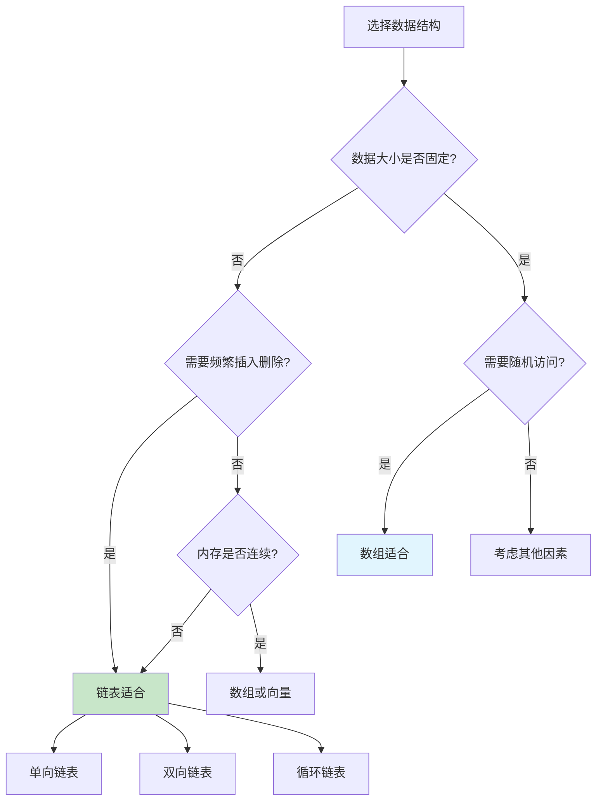

## 3. 链表设计思想

### 3.1 链表的核心设计理念

链表的设计体现了计算机科学中的几个重要思想：

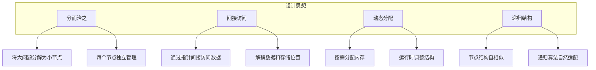

### 3.2 链表的数学模型

```mermaid
graph LR
    subgraph "数学抽象"
        A[链表] --> B[有向图]
        B --> C[节点集合 V]
        B --> D[边集合 E]
    end
    
    subgraph "图论性质"
        E[连通性] --> E1[从头节点可达所有节点]
        F[无环性] --> F1[单向链表无回路]
        G[路径唯一] --> G1[任意两节点间路径唯一]
    end
    
    C --> C1[V = {node1, node2, ..., nodeN}]
    D --> D1[E = {(node1,node2), (node2,node3), ...}]
```

### 3.3 链表设计模式

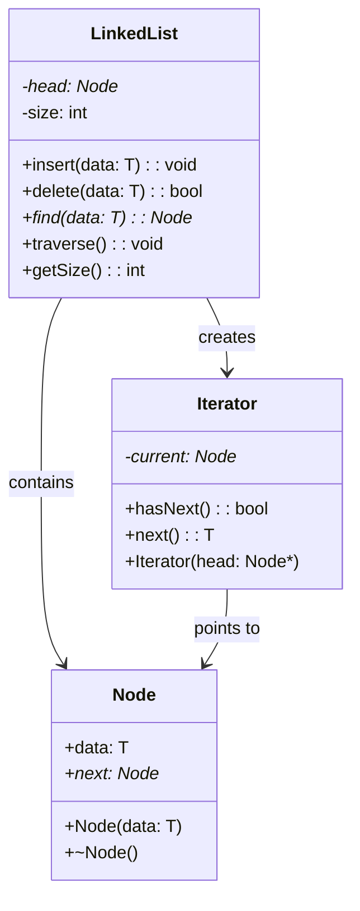

## 4. 指针和引用的理解

### 4.1 指针的本质

指针是链表实现的核心概念，理解指针对于掌握链表至关重要。

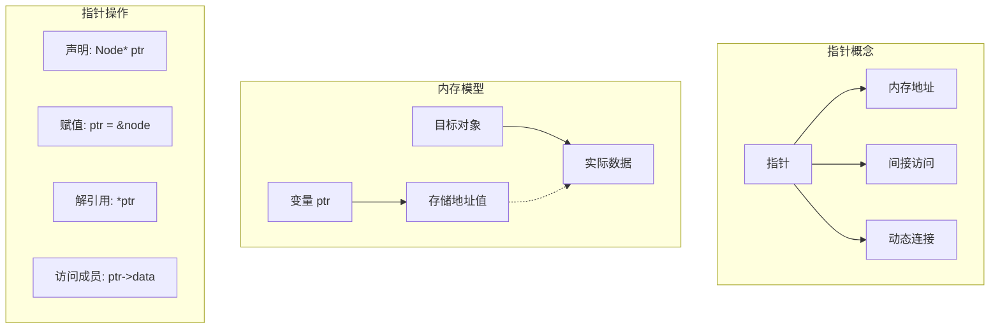

### 4.2 指针与引用的区别

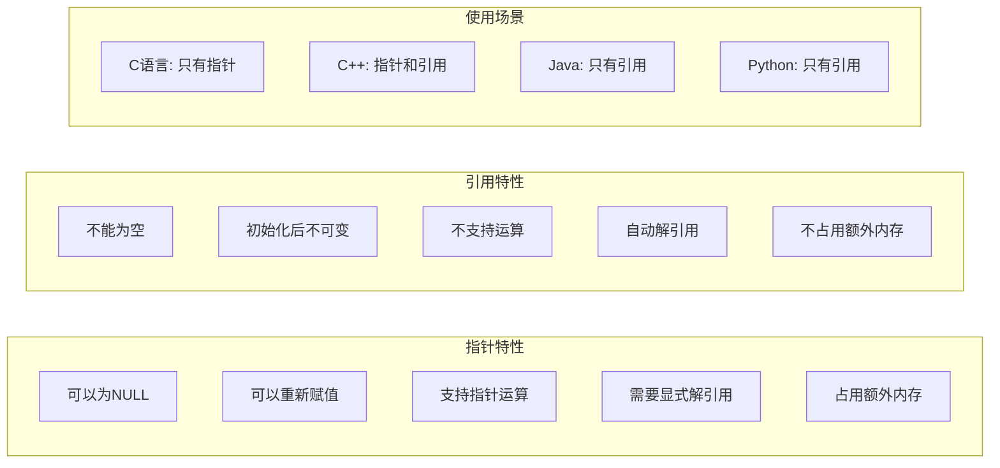

### 4.3 指针操作的内存视图

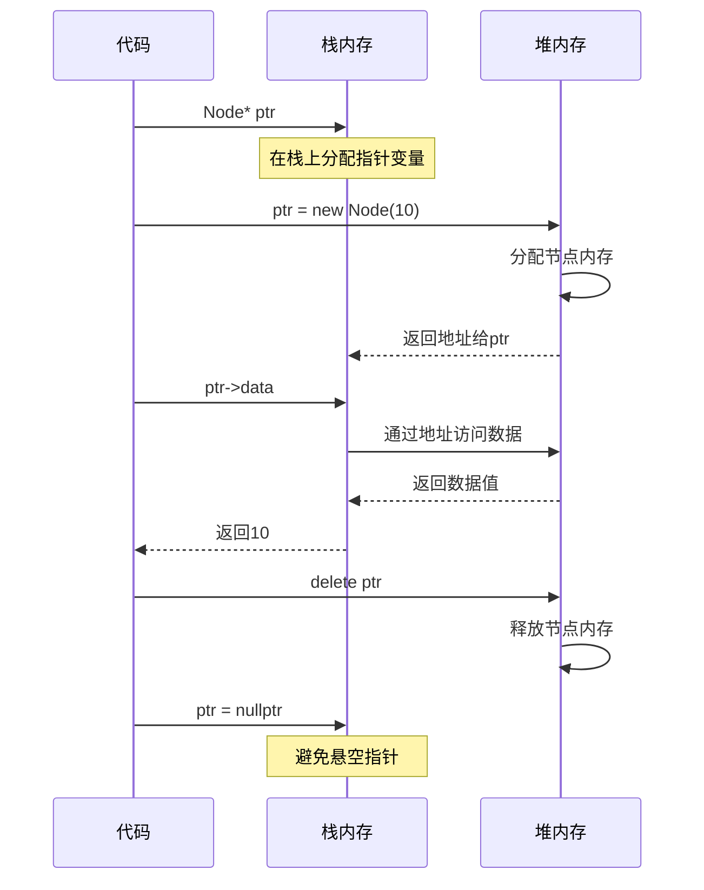

### 4.4 指针常见错误

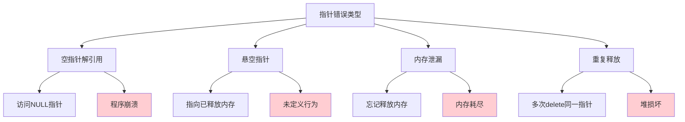

## 5. 链表插入设计

### 5.1 链表插入操作分类

```mermaid
graph TB
    subgraph "插入操作类型"
        A[头部插入]
        B[尾部插入]
        C[中间插入]
        D[有序插入]
    end
    
    A --> A1[时间复杂度: O(1)]
    A --> A2[最简单的操作]
    
    B --> B1[时间复杂度: O(n)]
    B --> B2[需要遍历到尾部]
    
    C --> C1[时间复杂度: O(n)]
    C --> C2[需要找到插入位置]
    
    D --> D1[时间复杂度: O(n)]
    D --> D2[维护有序性]
    
    style A1 fill:#c8e6c9
    style B1 fill:#fff3e0
    style C1 fill:#fff3e0
    style D1 fill:#fff3e0
```

### 5.2 头部插入详细流程

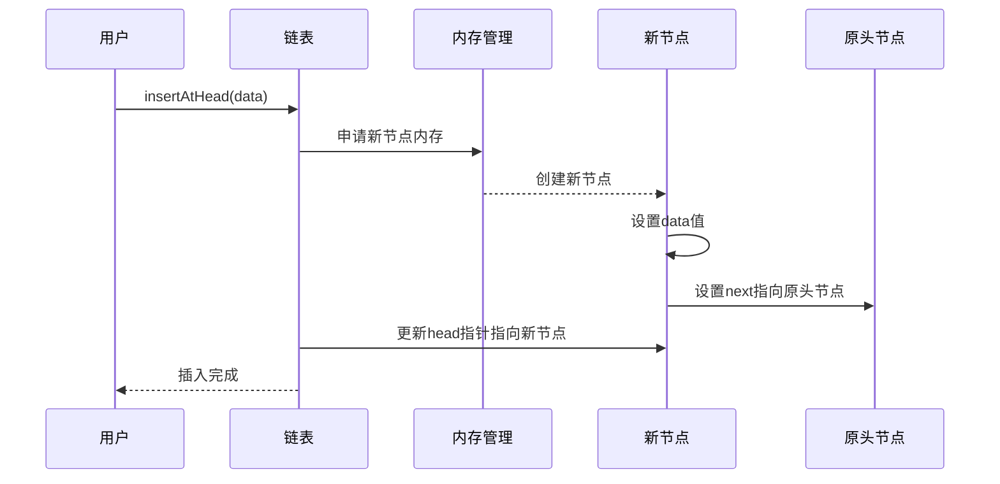

### 5.3 头部插入可视化

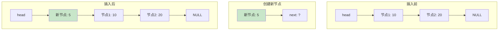

### 5.4 中间插入算法实现

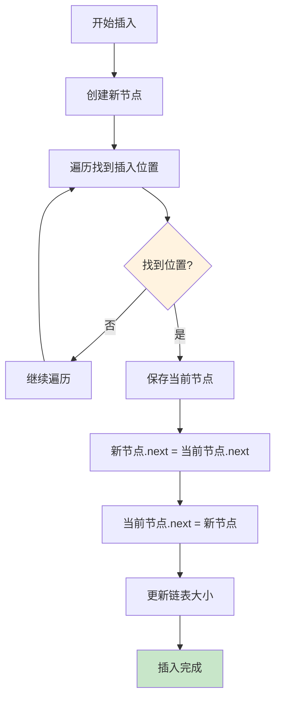

### 5.5 插入操作的边界情况

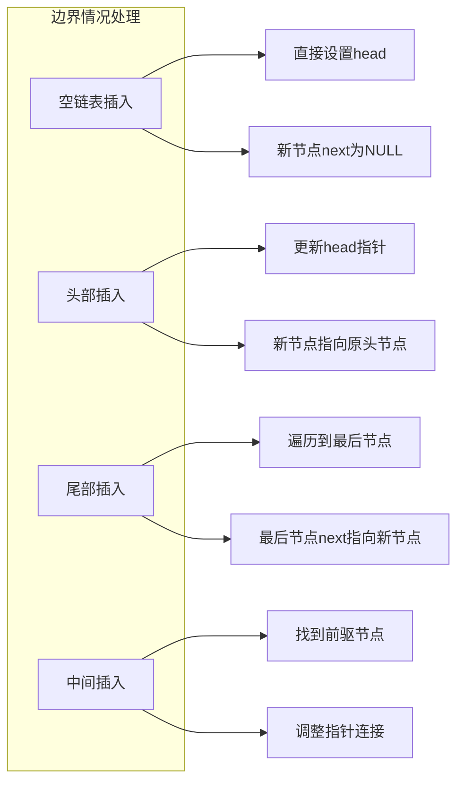

### 5.6 插入操作性能分析

```mermaid
graph TB
    subgraph "不同插入位置的性能"
        A[插入位置] --> A1[头部]
        A --> A2[第i个位置]
        A --> A3[尾部]
        A --> A4[有序位置]
    end
    
    A1 --> B1[时间: O(1)]
    A1 --> B2[空间: O(1)]
    
    A2 --> C1[时间: O(i)]
    A2 --> C2[空间: O(1)]
    
    A3 --> D1[时间: O(n)]
    A3 --> D2[空间: O(1)]
    
    A4 --> E1[时间: O(n)]
    A4 --> E2[空间: O(1)]
    
    style B1 fill:#c8e6c9
    style C1 fill:#fff3e0
    style D1 fill:#ffcdd2
    style E1 fill:#ffcdd2
```

## 6. 链表删除设计

### 6.1 链表删除操作分类

```mermaid
graph TB
    subgraph "删除操作类型"
        A[按位置删除]
        B[按值删除]
        C[删除头节点]
        D[删除尾节点]
        E[删除所有节点]
    end
    
    A --> A1[删除第i个节点]
    B --> B1[删除特定值的节点]
    C --> C1[删除链表头部]
    D --> D1[删除链表尾部]
    E --> E1[清空整个链表]
    
    A1 --> A2[O(i)时间复杂度]
    B1 --> B2[O(n)时间复杂度]
    C1 --> C2[O(1)时间复杂度]
    D1 --> D2[O(n)时间复杂度]
    E1 --> E2[O(n)时间复杂度]
```

### 6.2 删除节点的核心步骤

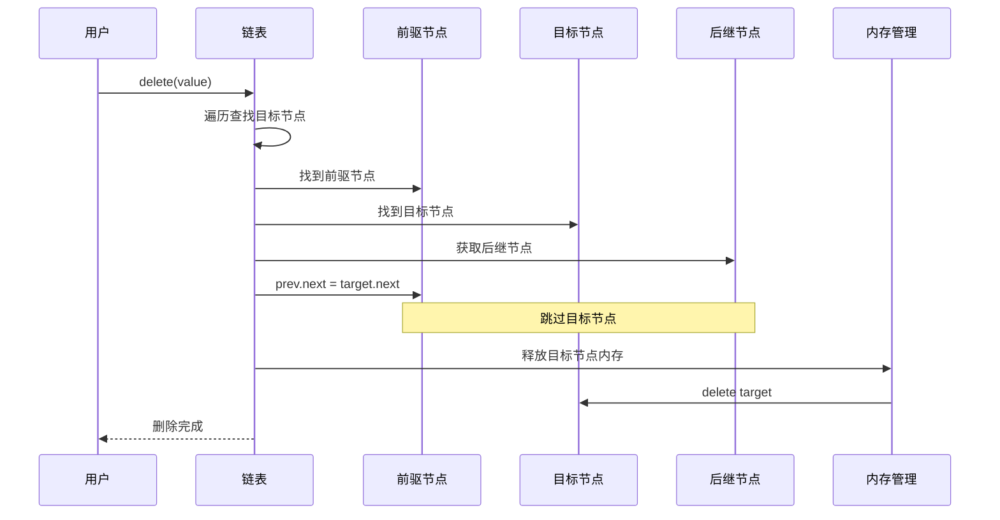

### 6.3 删除操作可视化

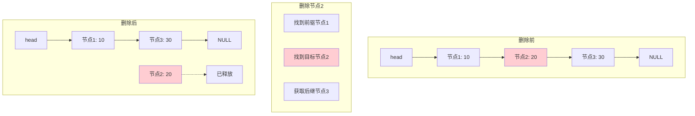

### 6.4 删除头节点的特殊处理

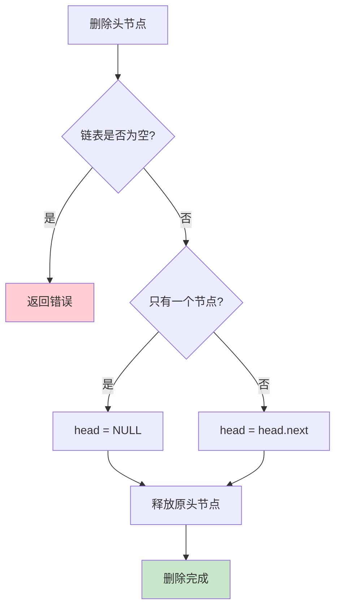

### 6.5 删除操作的内存管理

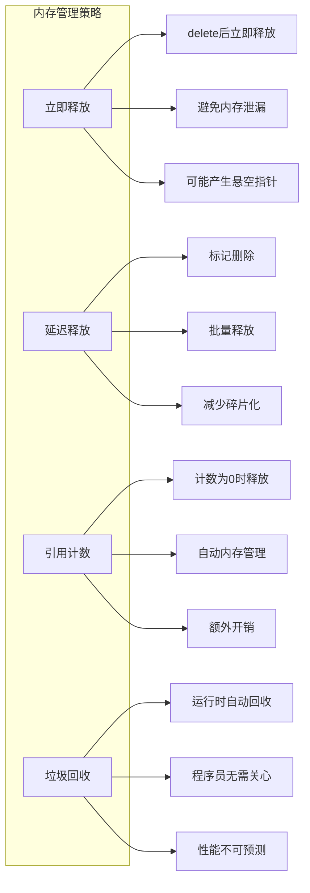

### 6.6 删除操作的错误处理

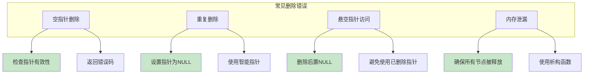

## 7. 链表指针丢失问题

### 7.1 指针丢失的常见场景

```mermaid
graph TB
    subgraph "指针丢失场景"
        A[插入操作错误]
        B[删除操作错误]
        C[指针赋值错误]
        D[异常处理不当]
    end
    
    A --> A1[新节点指针设置错误]
    A --> A2[原有连接断开]
    
    B --> B1[删除前未保存后继指针]
    B --> B2[前驱指针未更新]
    
    C --> C1[指针覆盖]
    C --> C2[循环引用]
    
    D --> D1[异常时指针未恢复]
    D --> D2[资源未正确释放]
```

### 7.2 插入操作中的指针丢失

```mermaid
sequenceDiagram
    participant Code as 代码
    participant Node1 as 节点1
    participant Node2 as 节点2
    participant NewNode as 新节点
    
    Note over Code: 错误的插入顺序
    Code->>Node1: node1.next = newNode
    Note over Node1,Node2: 原来的连接丢失!
    Code->>NewNode: newNode.next = node2
    Note over Code: node2变成孤立节点
    
    Note over Code: 正确的插入顺序
    Code->>NewNode: newNode.next = node1.next
    Code->>Node1: node1.next = newNode
    Note over Code: 保持所有连接完整
```

### 7.3 指针丢失的预防策略

```mermaid
mindmap
  root((指针丢失预防))
    操作顺序
      先建立新连接
      再断开旧连接
      保持链表完整性
    临时变量
      保存关键指针
      操作完成后清理
      避免指针覆盖
    异常安全
      RAII原则
      智能指针使用
      异常时自动清理
    代码审查
      检查指针操作
      验证连接完整性
      测试边界条件
```

### 7.4 指针丢失检测方法

```mermaid
flowchart TD
    A[指针丢失检测] --> B[静态分析]
    A --> C[动态检测]
    A --> D[内存工具]
    
    B --> B1[代码审查]
    B --> B2[静态分析工具]
    B --> B3[编译器警告]
    
    C --> C1[运行时检查]
    C --> C2[断言验证]
    C --> C3[单元测试]
    
    D --> D1[Valgrind]
    D --> D2[AddressSanitizer]
    D --> D3[内存泄漏检测器]
    
    style B1 fill:#e1f5fe
    style C1 fill:#fff3e0
    style D1 fill:#f3e5f5
```

### 7.5 指针丢失的修复策略

```mermaid
graph LR
    subgraph "修复策略"
        A[重建连接]
        B[回滚操作]
        C[数据恢复]
        D[预防机制]
    end
    
    A --> A1[遍历重建指针]
    A --> A2[基于数据重构]
    
    B --> B1[撤销错误操作]
    B --> B2[恢复原始状态]
    
    C --> C1[从备份恢复]
    C --> C2[重新计算连接]
    
    D --> D1[使用智能指针]
    D --> D2[实现RAII]
    D --> D3[增加检查点]
```

## 8. 链表边界条件处理

### 8.1 常见边界条件

```mermaid
graph TB
    subgraph "链表边界条件"
        A[空链表操作]
        B[单节点链表]
        C[头节点操作]
        D[尾节点操作]
        E[无效索引]
        F[重复元素]
    end
    
    A --> A1[插入到空链表]
    A --> A2[从空链表删除]
    A --> A3[遍历空链表]
    
    B --> B1[删除唯一节点]
    B --> B2[在唯一节点前后插入]
    
    C --> C1[删除头节点]
    C --> C2[在头节点前插入]
    
    D --> D1[删除尾节点]
    D --> D2[在尾节点后插入]
    
    E --> E1[负数索引]
    E --> E2[超出范围索引]
    
    F --> F1[查找重复元素]
    F --> F2[删除重复元素]
```

### 8.2 空链表处理策略

```mermaid
flowchart TD
    A[操作空链表] --> B{操作类型}
    B -->|插入| C[创建第一个节点]
    B -->|删除| D[返回错误或空值]
    B -->|查找| E[返回未找到]
    B -->|遍历| F[立即结束]
    
    C --> C1[head = newNode]
    C --> C2[newNode.next = NULL]
    C --> C3[size = 1]
    
    D --> D1[抛出异常]
    D --> D2[返回false]
    D --> D3[记录错误日志]
    
    style C fill:#c8e6c9
    style D fill:#ffcdd2
```

### 8.3 边界条件检查模板

```mermaid
sequenceDiagram
    participant Client as 客户端
    participant List as 链表
    participant Validator as 验证器
    
    Client->>List: 执行操作
    List->>Validator: 检查前置条件
    
    alt 边界条件检查
        Validator->>Validator: 检查链表是否为空
        Validator->>Validator: 检查索引是否有效
        Validator->>Validator: 检查参数是否合法
    end
    
    alt 检查通过
        Validator-->>List: 验证成功
        List->>List: 执行实际操作
        List-->>Client: 返回结果
    else 检查失败
        Validator-->>List: 验证失败
        List-->>Client: 返回错误
    end
```

### 8.4 边界条件处理的最佳实践

```mermaid
graph LR
    subgraph "最佳实践"
        A[防御性编程]
        B[早期检查]
        C[明确错误处理]
        D[完整测试覆盖]
    end
    
    A --> A1[假设输入可能错误]
    A --> A2[添加参数验证]
    A --> A3[处理异常情况]
    
    B --> B1[函数开始时检查]
    B --> B2[快速失败原则]
    B --> B3[减少后续错误]
    
    C --> C1[定义错误码]
    C --> C2[提供错误信息]
    C --> C3[统一错误处理]
    
    D --> D1[测试所有边界]
    D --> D2[自动化测试]
    D --> D3[回归测试]
```

### 8.5 边界条件测试用例

```mermaid
graph TB
    subgraph "测试用例设计"
        A[正常情况测试]
        B[边界值测试]
        C[异常情况测试]
        D[压力测试]
    end
    
    A --> A1[标准插入删除]
    A --> A2[正常遍历]
    
    B --> B1[空链表操作]
    B --> B2[单元素链表]
    B --> B3[最大长度链表]
    
    C --> C1[NULL指针输入]
    C --> C2[无效索引]
    C --> C3[内存不足]
    
    D --> D1[大量数据操作]
    D --> D2[频繁插入删除]
    D --> D3[并发访问]
```

## 9. 链表的多种分类

### 9.1 链表分类概览

```mermaid
graph TB
    subgraph "链表分类"
        A[按连接方向]
        B[按连接结构]
        C[按数据组织]
        D[按访问方式]
    end
    
    A --> A1[单向链表]
    A --> A2[双向链表]
    
    B --> B1[线性链表]
    B --> B2[循环链表]
    
    C --> C1[普通链表]
    C --> C2[有序链表]
    C --> C3[跳跃链表]
    
    D --> D1[顺序访问]
    D --> D2[随机访问]
```

### 9.2 单向链表

#### 9.2.1 单向链表结构

```mermaid
graph LR
    A[head] --> B[节点1]
    B --> C[节点2]
    C --> D[节点3]
    D --> E[NULL]
    
    B --> B1[data: 10]
    B --> B2[next: →]
    C --> C1[data: 20]
    C --> C2[next: →]
    D --> D1[data: 30]
    D --> D2[next: NULL]
    
    style A fill:#c8e6c9
    style E fill:#ffcdd2
```

#### 9.2.2 单向链表特点

```mermaid
mindmap
  root((单向链表))
    结构特点
      每个节点一个指针
      只能向前遍历
      内存开销最小
    操作特性
      头部插入O(1)
      尾部插入O(n)
      删除需要前驱节点
    适用场景
      简单的数据存储
      栈的实现
      单向数据流处理
```

### 9.3 双向链表

#### 9.3.1 双向链表结构

```mermaid
graph LR
    A[head] --> B[节点1]
    B <--> C[节点2]
    C <--> D[节点3]
    D --> E[NULL]
    F[NULL] --> B
    
    B --> B1[prev: NULL]
    B --> B2[data: 10]
    B --> B3[next: →]
    
    C --> C1[prev: ←]
    C --> C2[data: 20]
    C --> C3[next: →]
    
    D --> D1[prev: ←]
    D --> D2[data: 30]
    D --> D3[next: NULL]
    
    style A fill:#c8e6c9
    style E fill:#ffcdd2
    style F fill:#ffcdd2
```

#### 9.3.2 双向链表优势

```mermaid
graph TB
    subgraph "双向链表优势"
        A[双向遍历]
        B[高效删除]
        C[灵活插入]
        D[对称操作]
    end
    
    A --> A1[正向和反向遍历]
    A --> A2[从任意位置开始]
    
    B --> B1[删除时无需查找前驱]
    B --> B2[O(1)删除已知节点]
    
    C --> C1[在任意位置插入]
    C --> C2[头尾插入都是O(1)]
    
    D --> D1[头尾操作对称]
    D --> D2[算法实现简化]
```

#### 9.3.3 双向链表应用场景

```mermaid
graph LR
    subgraph "应用场景"
        A[LRU缓存]
        B[双端队列]
        C[浏览器历史]
        D[文本编辑器]
        E[音乐播放列表]
    end
    
    A --> A1[需要快速移动节点]
    B --> B1[两端都需要操作]
    C --> C1[前进后退功能]
    D --> D1[光标移动]
    E --> E1[上一首下一首]
```

### 9.4 循环链表

#### 9.4.1 循环链表结构

```mermaid
graph LR
    A[head] --> B[节点1]
    B --> C[节点2]
    C --> D[节点3]
    D --> B
    
    B --> B1[data: 10]
    C --> C1[data: 20]
    D --> D1[data: 30]
    
    style A fill:#c8e6c9
    style D fill:#fff3e0
```

#### 9.4.2 循环链表特点

```mermaid
mindmap
  root((循环链表))
    结构特点
      尾节点指向头节点
      形成环形结构
      无NULL指针
    操作特性
      遍历需要停止条件
      插入删除需要特殊处理
      可以从任意节点开始
    适用场景
      轮询调度
      循环缓冲区
      游戏中的循环列表
```

#### 9.4.3 循环链表遍历

```mermaid
flowchart TD
    A[开始遍历] --> B[记录起始节点]
    B --> C[访问当前节点]
    C --> D[移动到下一节点]
    D --> E{回到起始节点?}
    E -->|否| C
    E -->|是| F[遍历完成]
    
    style E fill:#fff3e0
    style F fill:#c8e6c9
```

### 9.5 链表类型对比

```mermaid
graph TB
    subgraph "性能对比"
        A[操作类型] --> A1[单向链表]
        A --> A2[双向链表]
        A --> A3[循环链表]
        
        B[头部插入] --> B1[O(1)]
        B --> B2[O(1)]
        B --> B3[O(1)]
        
        C[尾部插入] --> C1[O(n)]
        C --> C2[O(1)]
        C --> C3[O(1)]
        
        D[删除节点] --> D1[O(n)]
        D --> D2[O(1)]
        D --> D3[O(1)]
        
        E[内存开销] --> E1[最小]
        E --> E2[较大]
        E --> E3[中等]
        
        F[实现复杂度] --> F1[简单]
        F --> F2[复杂]
        F --> F3[中等]
    end
    
    style B1 fill:#c8e6c9
    style B2 fill:#c8e6c9
    style B3 fill:#c8e6c9
    style E1 fill:#c8e6c9
    style F1 fill:#c8e6c9
```

### 9.6 链表选择决策

```mermaid
flowchart TD
    A[选择链表类型] --> B{需要双向遍历?}
    B -->|是| C{需要循环结构?}
    B -->|否| D{需要循环结构?}
    
    C -->|是| E[双向循环链表]
    C -->|否| F[双向链表]
    
    D -->|是| G[单向循环链表]
    D -->|否| H[单向链表]
    
    E --> E1[复杂的双向循环操作]
    F --> F1[LRU缓存、双端队列]
    G --> G1[轮询调度、循环缓冲]
    H --> H1[简单的栈、队列]
    
    style E fill:#f3e5f5
    style F fill:#e1f5fe
    style G fill:#fff3e0
    style H fill:#c8e6c9
```

## 10. 链表使用场景

### 10.1 链表在数据结构中的应用

```mermaid
graph TB
    subgraph "基于链表的数据结构"
        A[栈 Stack]
        B[队列 Queue]
        C[哈希表 Hash Table]
        D[图 Graph]
        E[树 Tree]
    end
    
    A --> A1[链表实现栈]
    A --> A2[头部插入删除]
    
    B --> B1[链表实现队列]
    B --> B2[头部删除尾部插入]
    
    C --> C1[链地址法解决冲突]
    C --> C2[每个桶是一个链表]
    
    D --> D1[邻接表表示]
    D --> D2[每个顶点的邻居链表]
    
    E --> E1[子节点链表]
    E --> E2[兄弟节点链表]
```

### 10.2 链表在系统编程中的应用

```mermaid
mindmap
  root((系统编程应用))
    内存管理
      空闲块链表
      内存池管理
      垃圾回收链表
    进程调度
      就绪队列
      等待队列
      进程链表
    文件系统
      目录项链表
      inode链表
      缓存链表
    网络编程
      连接池
      数据包队列
      事件链表
```

### 10.3 链表在应用开发中的场景

```mermaid
graph LR
    subgraph "应用开发场景"
        A[Web开发]
        B[游戏开发]
        C[移动开发]
        D[桌面应用]
    end
    
    A --> A1[中间件链]
    A --> A2[请求处理链]
    A --> A3[插件系统]
    
    B --> B1[游戏对象列表]
    B --> B2[动画序列]
    B --> B3[AI状态机]
    
    C --> C1[界面导航栈]
    C --> C2[消息队列]
    C --> C3[数据缓存]
    
    D --> D1[撤销重做功能]
    D --> D2[最近文件列表]
    D --> D3[窗口管理]
```

### 10.4 链表与集合类的关系

```mermaid
classDiagram
    class Collection {
        <<interface>>
        +add(element): bool
        +remove(element): bool
        +contains(element): bool
        +size(): int
    }
    
    class List {
        <<interface>>
        +get(index): T
        +set(index, element): T
        +add(index, element): void
        +remove(index): T
    }
    
    class LinkedList {
        -head: Node
        -tail: Node
        -size: int
        +addFirst(element): void
        +addLast(element): void
        +removeFirst(): T
        +removeLast(): T
    }
    
    class ArrayList {
        -array: T[]
        -capacity: int
        -size: int
        +ensureCapacity(): void
        +trimToSize(): void
    }
    
    Collection <|-- List
    List <|-- LinkedList
    List <|-- ArrayList
```

### 10.5 链表性能特征总结

```mermaid
graph TB
    subgraph "链表 vs 数组性能对比"
        A[操作类型] --> A1[链表]
        A --> A2[数组]
        
        B[随机访问] --> B1[O(n)]
        B --> B2[O(1)]
        
        C[顺序访问] --> C1[O(n)]
        C --> C2[O(n)]
        
        D[插入操作] --> D1[O(1)]
        D --> D2[O(n)]
        
        E[删除操作] --> E1[O(1)]
        E --> E2[O(n)]
        
        F[内存使用] --> F1[额外指针开销]
        F --> F2[连续内存高效]
        
        G[缓存性能] --> G1[较差]
        G --> G2[较好]
    end
    
    style B1 fill:#ffcdd2
    style B2 fill:#c8e6c9
    style D1 fill:#c8e6c9
    style D2 fill:#ffcdd2
    style E1 fill:#c8e6c9
    style E2 fill:#ffcdd2
```

### 10.6 链表使用建议

```mermaid
flowchart TD
    A[选择数据结构] --> B{访问模式}
    B -->|随机访问频繁| C[选择数组]
    B -->|顺序访问为主| D{插入删除频繁?}
    
    D -->|是| E{在什么位置操作?}
    D -->|否| F[考虑数组]
    
    E -->|头部| G[单向链表]
    E -->|两端| H[双向链表]
    E -->|中间| I[考虑其他结构]
    
    C --> C1[ArrayList, Vector]
    F --> F1[Array, ArrayList]
    G --> G1[Stack, 简单队列]
    H --> H1[Deque, LRU缓存]
    I --> I1[平衡树, 跳表]
    
    style G1 fill:#c8e6c9
    style H1 fill:#e1f5fe
    style I1 fill:#fff3e0
```

## 总结

### 链表核心要点回顾

```mermaid
mindmap
  root((链表核心要点))
    基本概念
      节点结构
      指针连接
      动态内存
    设计思想
      间接访问
      动态分配
      递归结构
    操作特性
      O(1)插入删除
      O(n)随机访问
      灵活的大小
    应用场景
      频繁插入删除
      动态数据集
      系统编程
```

### 链表的设计哲学

链表体现了计算机科学中的重要设计思想：

1. **间接性**：通过指针间接访问数据，解耦了数据和存储位置
2. **动态性**：运行时动态分配内存，适应变化的数据需求
3. **递归性**：节点结构的自相似性，使得递归算法自然适配
4. **权衡性**：在时间和空间、灵活性和性能之间做出权衡

### 实际应用指导

1. **选择合适的链表类型**：根据访问模式和操作需求选择单向、双向或循环链表
2. **注意内存管理**：正确处理节点的创建和销毁，避免内存泄漏
3. **处理边界条件**：空链表、单节点等特殊情况需要特别处理
4. **优化性能**：合理使用缓存、减少指针操作、考虑内存局部性

### 链表的现代发展

随着编程语言和硬件的发展，链表的应用也在演进：

1. **智能指针**：现代C++中的智能指针简化了内存管理
2. **垃圾回收**：Java、Python等语言的垃圾回收机制减少了内存管理负担
3. **无锁数据结构**：并发编程中的无锁链表提高了多线程性能
4. **缓存友好设计**：针对现代CPU缓存特性优化的链表变种

链表作为基础数据结构，不仅是算法学习的重要内容，更是理解计算机科学核心概念的重要工具。掌握链表的设计原理和实现技巧，有助于我们更好地设计和优化程序，解决实际的工程问题。