# 队列深入浅出技术文档

## 目录
- [1. 什么是队列](#1-什么是队列)
- [2. 队列的使用场景](#2-队列的使用场景)
- [3. 常见队列类型详解](#3-常见队列类型详解)
- [4. 顺序队列实现](#4-顺序队列实现)
- [5. 队列的核心原理与思想](#5-队列的核心原理与思想)
- [6. 队列插入和移除原理](#6-队列插入和移除原理)


### 3.5 阻塞队列详解


### 3.6 并发队列的设计

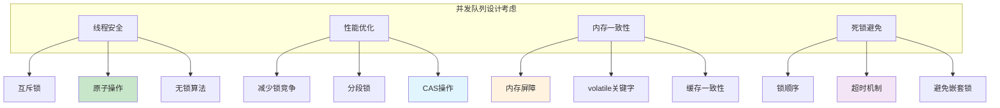

### 3.7 无锁队列原理

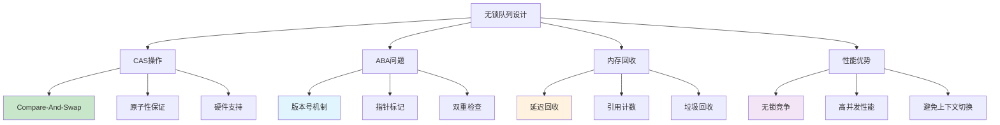

## 4. 顺序队列实现

### 4.1 基于数组的队列实现

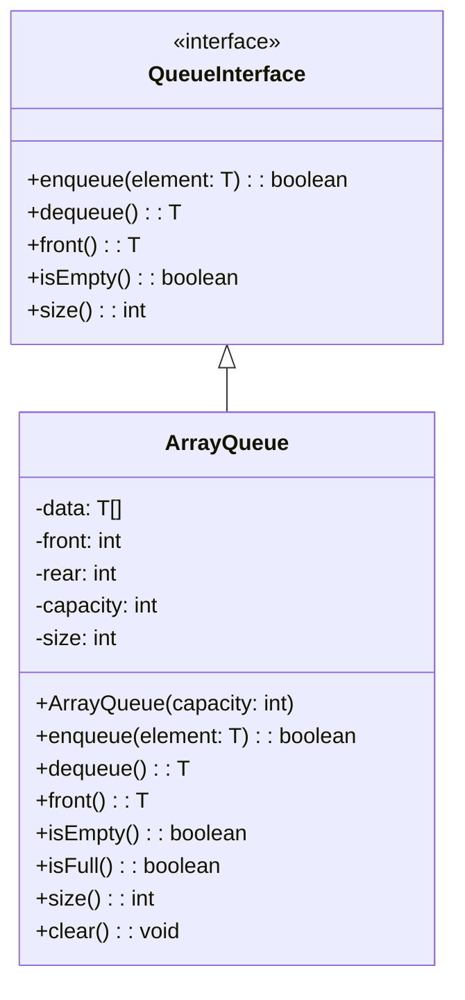

### 4.2 数组队列的内存布局

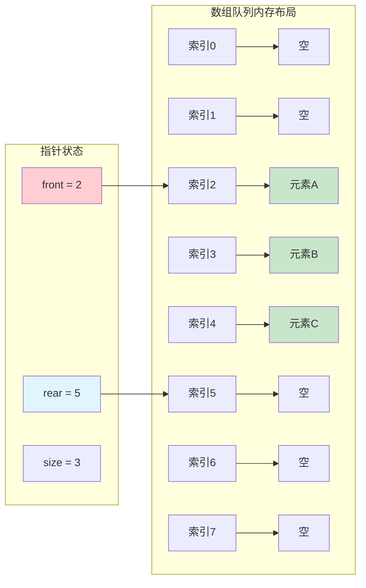

### 4.3 数组队列操作流程

```mermaid
flowchart TD
    A[队列操作] --> B{操作类型}
    
    B -->|Enqueue| C[入队操作]
    B -->|Dequeue| D[出队操作]
    
    C --> C1{队列是否已满?}
    C1 -->|是| C2[返回false或抛异常]
    C1 -->|否| C3[data[rear] = element]
    C3 --> C4[rear = (rear + 1) % capacity]
    C4 --> C5[size++]
    C5 --> C6[返回true]
    
    D --> D1{队列是否为空?}
    D1 -->|是| D2[抛出异常]
    D1 -->|否| D3[element = data[front]]
    D3 --> D4[front = (front + 1) % capacity]
    D4 --> D5[size--]
    D5 --> D6[返回element]
    
    style C2 fill:#ffcdd2
    style C6 fill:#c8e6c9
    style D2 fill:#ffcdd2
    style D6 fill:#c8e6c9
```

### 4.4 基于链表的队列实现

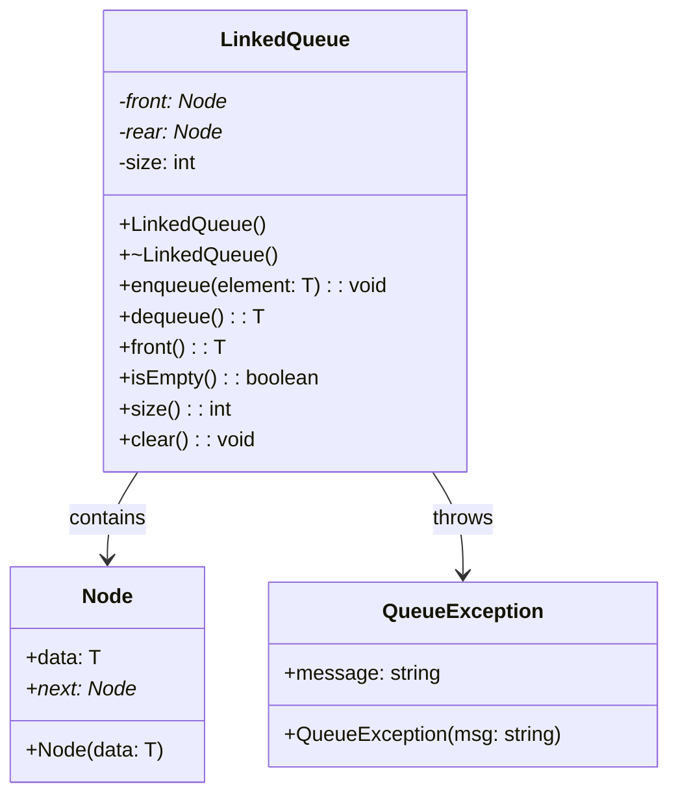

### 4.5 链表队列的结构示意

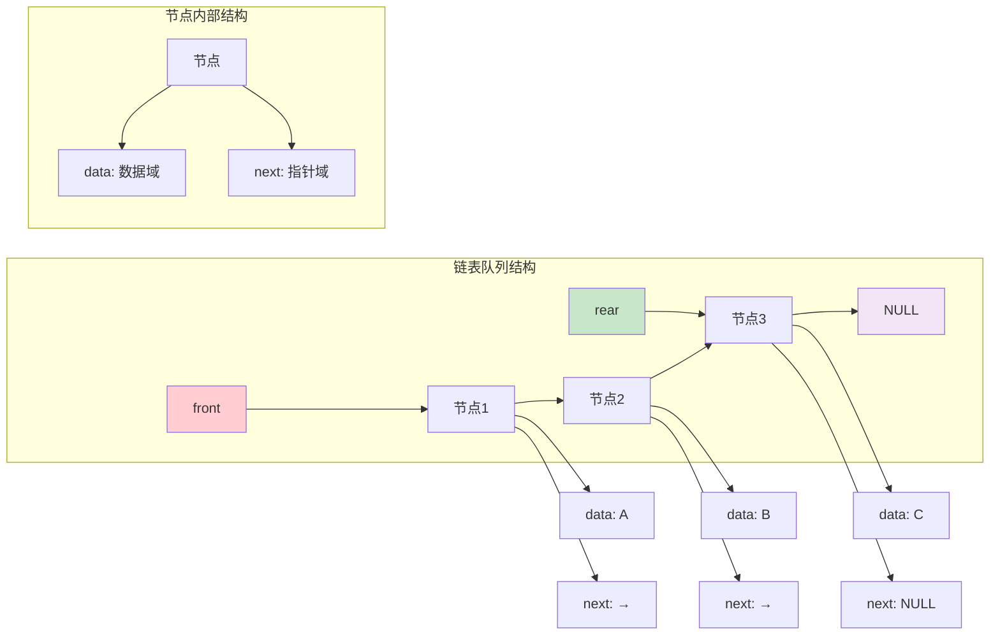

### 4.6 链表队列操作详解

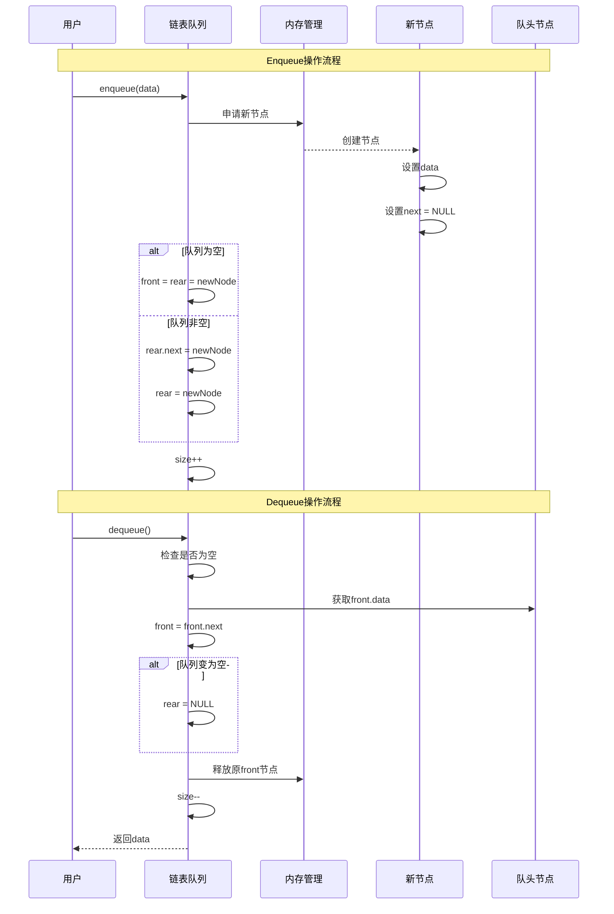

### 4.7 数组队列与链表队列对比

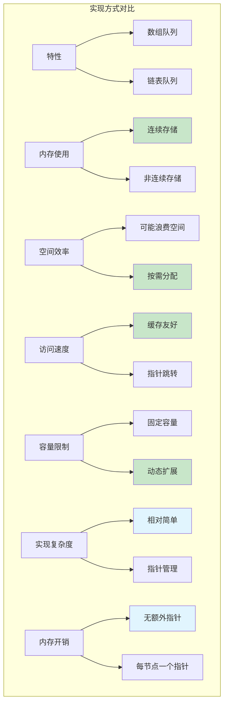

## 5. 队列的核心原理与思想

### 5.1 FIFO原理深度解析

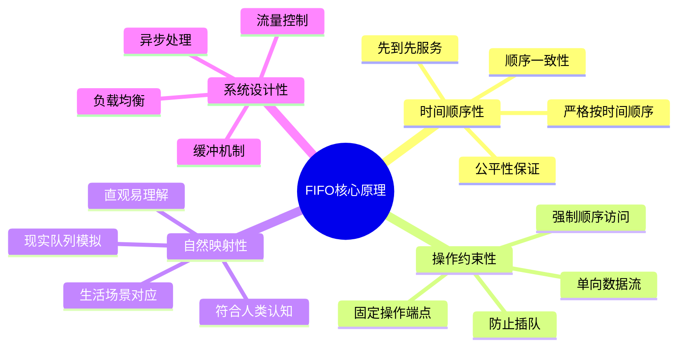

### 5.2 队列的数学模型

```mermaid
graph TB
    subgraph "队列的数学抽象"
        A[队列 Q] --> B[元素集合]
        A --> C[操作集合]
        A --> D[约束条件]
        A --> E[状态变量]
    end
    
    B --> B1[Q = {e1, e2, ..., en}]
    C --> C1[Enqueue: Q → Q ∪ {e}]
    C --> C2[Dequeue: Q → Q - {front(Q)}]
    C --> C3[Front: Q → element]
    
    D --> D1[只能队尾入队]
    D --> D2[只能队头出队]
    D --> D3[FIFO访问顺序]
    
    E --> E1[front指针]
    E --> E2[rear指针]
    E --> E3[size计数器]
    
    style C1 fill:#c8e6c9
    style C2 fill:#ffcdd2
    style D3 fill:#e1f5fe
```

### 5.3 队列的设计哲学

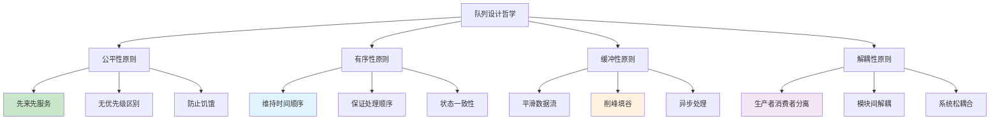

### 5.4 队列在系统设计中的作用

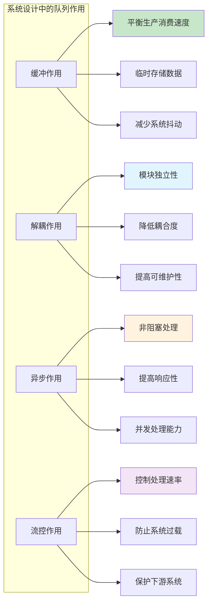

### 5.5 队列与其他数据结构的关系

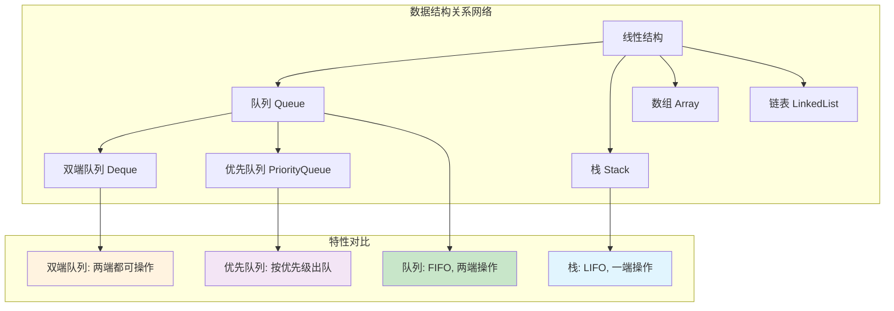

## 6. 队列插入和移除原理

### 6.1 队列操作的核心机制

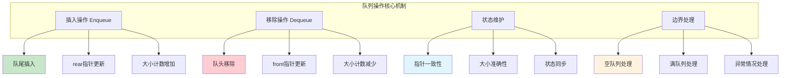

### 6.2 数组队列插入操作详解

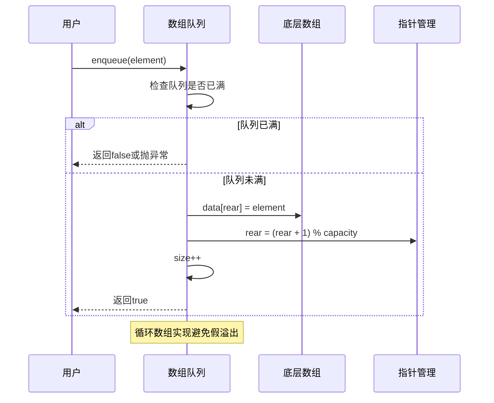

### 6.3 数组队列移除操作详解

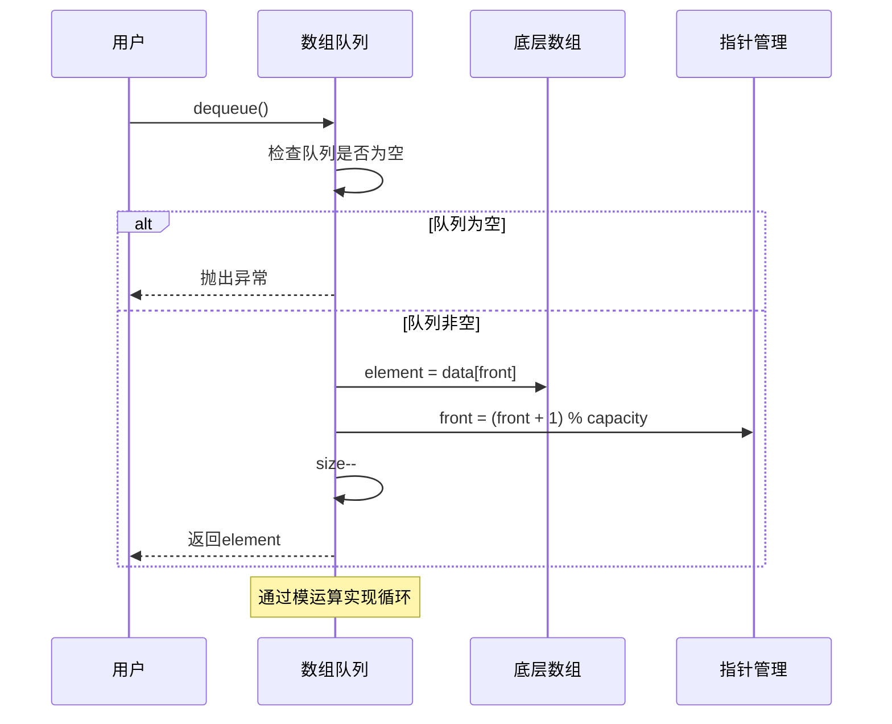

### 6.4 链表队列插入操作详解

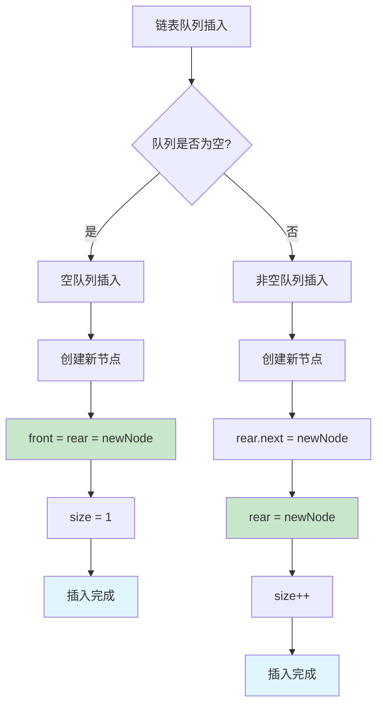

### 6.5 链表队列移除操作详解

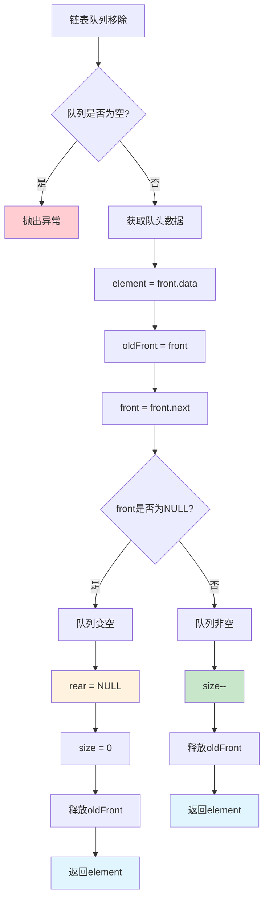

### 6.6 循环队列的边界处理

```mermaid
graph TB
    subgraph "循环队列边界情况"
        A[队列满的判断]
        B[队列空的判断]
        C[指针回绕处理]
        D[容量预留策略]
    end
    
    A --> A1[(rear + 1) % capacity == front]
    A --> A2[预留一个空位]
    A --> A3[避免满空混淆]
    
    B --> B1[front == rear]
    B --> B2[size == 0]
    B --> B3[简单直观]
    
    C --> C1[模运算实现]
    C --> C2[自动回绕]
    C --> C3[无需特殊处理]
    
    D --> D1[牺牲一个存储位]
    D --> D2[简化判断逻辑]
    D --> D3[提高代码可读性]
    
    style A1 fill:#c8e6c9
    style B1 fill:#e1f5fe
    style C1 fill:#fff3e0
    style D1 fill:#f3e5f5
```

### 6.7 队列操作的时间复杂度分析

```mermaid
graph LR
    subgraph "队列操作复杂度"
        A[操作类型] --> A1[数组队列]
        A --> A2[链表队列]
        A --> A3[循环队列]
        
        B[Enqueue] --> B1[O(1)]
        B --> B2[O(1)]
        B --> B3[O(1)]
        
        C[Dequeue] --> C1[O(1)]
        C --> C2[O(1)]
        C --> C3[O(1)]
        
        D[Front] --> D1[O(1)]
        D --> D2[O(1)]
        D --> D3[O(1)]
        
        E[IsEmpty] --> E1[O(1)]
        E --> E2[O(1)]
        E --> E3[O(1)]
        
        F[Size] --> F1[O(1)]
        F --> F2[O(1)]
        F --> F3[O(1)]
    end
    
    style B1 fill:#c8e6c9
    style B2 fill:#c8e6c9
    style B3 fill:#c8e6c9
    style C1 fill:#c8e6c9
    style C2 fill:#c8e6c9
    style C3 fill:#c8e6c9
```

### 6.8 队列操作的内存管理

```mermaid
sequenceDiagram
    participant App as 应用程序
    participant Queue as 队列
    participant Memory as 内存管理器
    participant GC as 垃圾回收器
    
    Note over App,GC: 内存管理生命周期
    
    App->>Queue: 创建队列
    Queue->>Memory: 申请初始内存
    
    loop 队列操作
        App->>Queue: enqueue/dequeue
        
        alt 需要扩容(动态队列)
            Queue->>Memory: 申请更多内存
            Queue->>Memory: 复制数据
            Queue->>Memory: 释放旧内存
        end
        
        alt 节点删除(链表队列)
            Queue->>Memory: 释放节点内存
            Memory->>GC: 标记可回收
        end
    end
    
    App->>Queue: 销毁队列
    Queue->>Memory: 释放所有内存
    Memory->>GC: 触发垃圾回收
```

### 6.9 队列操作的异常处理

```mermaid
flowchart TD
    A[队列操作异常处理] --> B[入队异常]
    A --> C[出队异常]
    A --> D[内存异常]
    A --> E[并发异常]
    
    B --> B1[队列已满]
    B --> B2[内存不足]
    B --> B3[参数无效]
    
    C --> C1[队列为空]
    C --> C2[并发冲突]
    C --> C3[状态不一致]
    
    D --> D1[内存分配失败]
    D --> D2[内存泄漏]
    D --> D3[野指针访问]
    
    E --> E1[竞态条件]
    E --> E2[死锁]
    E --> E3[数据竞争]
    
    B1 --> B11[返回错误码]
    B1 --> B12[抛出异常]
    B1 --> B13[阻塞等待]
    
    C1 --> C11[返回特殊值]
    C1 --> C12[抛出异常]
    C1 --> C13[阻塞等待]
    
    style B11 fill:#c8e6c9
    style B12 fill:#e1f5fe
    style B13 fill:#fff3e0
    style C11 fill:#c8e6c9
    style C12 fill:#e1f5fe
    style C13 fill:#fff3e0
```

## 总结

### 队列的核心价值

```mermaid
mindmap
  root((队列的核心价值))
    公平性
      先来先服务
      无歧视处理
      防止饥饿
      顺序保证
    缓冲性
      平滑数据流
      削峰填谷
      异步处理
      系统保护
    解耦性
      模块分离
      降低耦合
      提高灵活性
      易于维护
    扩展性
      多种实现方式
      适应不同场景
      性能可调优
      功能可扩展
```

### 队列的设计原则

队列体现了计算机科学中的重要设计原则：

1. **公平性原则**：FIFO保证了处理的公平性，避免了饥饿问题
2. **简单性原则**：简单的操作接口隐藏了复杂的内部实现
3. **效率性原则**：O(1)的基本操作保证了高效的性能
4. **灵活性原则**：多种实现方式适应不同的应用场景

### 实际应用指导

1. **选择合适的实现**：
   - 固定大小场景：使用数组队列
   - 动态大小场景：使用链表队列
   - 高性能场景：使用循环队列
   - 并发场景：使用阻塞队列或无锁队列

2. **注意事项**：
   - 边界条件处理：空队列和满队列的处理
   - 内存管理：特别是链表队列的节点回收
   - 线程安全：多线程环境下的同步机制
   - 性能优化：根据访问模式选择合适的实现

3. **常见陷阱**：
   - 数组队列的假溢出问题
   - 链表队列的内存泄漏
   - 并发队列的竞态条件
   - 阻塞队列的死锁风险

### 队列的现代发展

1. **高性能队列**：
   - 无锁队列：使用CAS操作实现高并发
   - 分段队列：减少锁竞争提高性能
   - 批量操作：减少系统调用开销

2. **分布式队列**：
   - 消息队列中间件：如RabbitMQ、Kafka
   - 分布式任务队列：如Celery、RQ
   - 云原生队列：如AWS SQS、Azure Service Bus

3. **专用队列**：
   - 优先队列：支持优先级的队列
   - 延迟队列：支持延迟处理的队列
   - 持久化队列：支持数据持久化的队列

队列作为最基础的数据结构之一，在现代软件系统中扮演着重要角色。从操作系统的进程调度到分布式系统的消息传递，从算法中的BFS到用户界面的事件处理，队列的应用无处不在。深入理解队列的原理和实现，有助于我们设计出更高效、更可靠的软件系统。