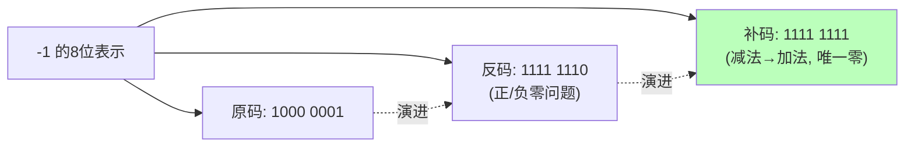
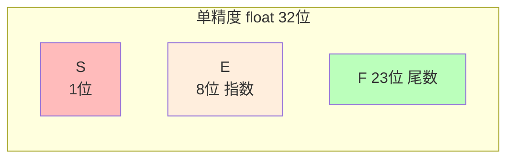
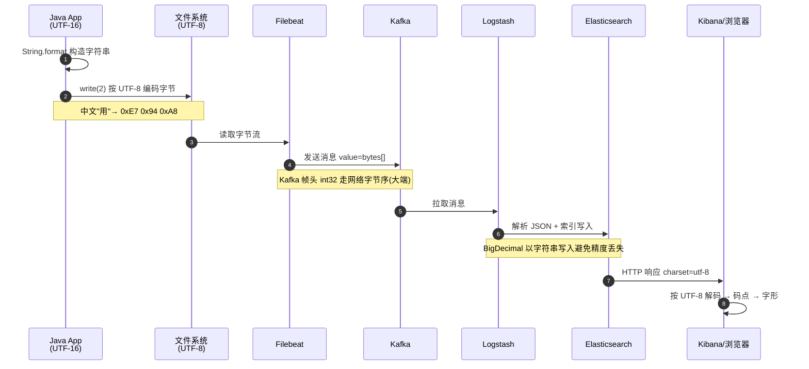

# 10.计算机二进制和字节
#### 目录介绍
- [01.工作案例引入](#01工作案例引入)
  - [1.1 对账的一分钱差异](#11-对账的一分钱差异)
  - [1.2 初步结论](#12-初步结论)
  - [1.3 本文要回答的问题](#13-本文要回答的问题)
- [02.进制数据的由来](#02进制数据的由来)
  - [2.1 先看一个场景](#21-先看一个场景)
  - [2.2 什么是进制](#22-什么是进制)
  - [2.3 进制设计背景](#23-进制设计背景)
  - [2.4 二进制数据传输](#24-二进制数据传输)
  - [2.5 为何不选十进制](#25-为何不选十进制)
- [03.为何选择二进制](#03为何选择二进制)
  - [3.1 计算机不选十进制](#31-计算机不选十进制)
  - [3.2 为何用二进制](#32-为何用二进制)
  - [3.3 理解逢二进一](#33-理解逢二进一)
  - [3.4 十进制转二进制](#34-十进制转二进制)
  - [3.5 数据大小端设计](#35-数据大小端设计)
  - [3.6 大端小端谁优](#36-大端小端谁优)
- [04.位和字节设计思想](#04位和字节设计思想)
  - [4.1 位的设计](#41-位的设计)
  - [4.2 字节的设计](#42-字节的设计)
  - [4.3 字符的设计](#43-字符的设计)
  - [4.4 字节字符区别](#44-字节字符区别)
- [05.字节到字符](#05字节到字符)
  - [5.1 从编码到数字](#51-从编码到数字)
  - [5.2 二进制存储空间](#52-二进制存储空间)
  - [5.3 字符集的由来](#53-字符集的由来)
  - [5.4 乱码为何出现](#54-乱码为何出现)
  - [5.5 编码设计由来](#55-编码设计由来)
  - [5.6 UTF-8如何统一](#56-utf-8如何统一)
- [06.有符号整数编码](#06有符号整数编码)
  - [6.1 如何表示符号](#61-如何表示符号)
  - [6.2 原码的设计意图](#62-原码的设计意图)
  - [6.3 反码的设计意图](#63-反码的设计意图)
  - [6.4 补码的设计意图](#64-补码的设计意图)
  - [6.5 正数和负数表达](#65-正数和负数表达)
  - [6.6 补码让减变加](#66-补码让减变加)
- [07.浮点数设计由来](#07浮点数设计由来)
  - [7.1 浮点数基本结构](#71-浮点数基本结构)
  - [7.2 IEEE754标准](#72-ieee754标准)
  - [7.3 浮点数的表示](#73-浮点数的表示)
  - [7.4 浮点数精度范围](#74-浮点数精度范围)
  - [7.5 二进制表示浮点](#75-二进制表示浮点)
  - [7.6 精度丢失原因](#76-精度丢失原因)
  - [7.7 为何0.1+0.2≠0.3](#77-为何0102≠03)
- [08.位运算的妙用](#08位运算的妙用)
  - [8.1 基本位运算操作](#81-基本位运算操作)
  - [8.2 位运算实际应用](#82-位运算实际应用)
  - [8.3 位运算优化技巧](#83-位运算优化技巧)
- [09.综合案例日志旅程](#09综合案例日志旅程)
  - [9.1 全景图](#91-全景图)
  - [9.2 每一步的变换](#92-每一步的变换)
  - [9.3 中间出错的情况](#93-中间出错的情况)
  - [9.4 这条日志的启示](#94-这条日志的启示)
- [10.思考题与作业](#10思考题与作业)
  - [10.1 基础理解题](#101-基础理解题)
  - [10.2 进阶思考题](#102-进阶思考题)
  - [10.3 动手作业](#103-动手作业)


## 01.工作案例引入

### 1.1 对账的一分钱差异

财务同学小薛凌晨打电话给后端开发：**当天的订单汇总金额与支付网关回传的对账文件差了 0.01 元**。

订单量 12 万笔，金额跨度从 0.01 元到几万元。小薛要求"哪一笔错的给我挑出来"。后端同学一开始怀疑网络丢包、数据库写失败，折腾半天没头绪，最后拉出 SQL：

```sql
SELECT user_id, SUM(amount) FROM orders WHERE ...
```

`amount` 字段当初为了"省事"设计成了 `DOUBLE`。真实一条 SQL 代码：

```java
double total = 0;
for (Order o : orders) {
    total += o.getAmount();     // o.getAmount() 是 double
}
```

本地复现也是神奇：

```java
double a = 0.1, b = 0.2;
System.out.println(a + b);              // 0.30000000000000004
System.out.println(0.1 + 0.2 == 0.3);   // false
```

- 12 万次累加后，`double` 的表示误差被不断放大；
- 不同的相加顺序（`SUM` 并行聚合）还会产生**不同的误差累积路径**；
- 于是对账差了 0.01 元，而且**这个差值每次对账结果还不一样**。

最后的修复：金额字段换成 `DECIMAL(18,4)`，应用内用 `BigDecimal`，彻底告别浮点。

### 1.2 初步结论

这次事故让小薛团队学到三件事：

1. 计算机里的"数"**不是数学里的实数**。它的底层是 **0 和 1 的二进制位**，表示范围和精度都是有限的。
2. `double` / `float` 本质上是 IEEE 754 的"**二进制科学计数法**"，`0.1`、`0.2` 在二进制里是无限循环，一存就丢精度。
3. 涉及到**金额、货币、精度**的场景，**必须用定点数**（整数或 `BigDecimal`）。

### 1.3 本文要回答的问题

- 为什么计算机要用二进制，而不是更像我们日常思维的十进制？
- 一个字节为什么是 8 位、能表示 256 个值？
- "锟斤拷" 和 "烫烫烫" 这些乱码是怎么出现的？
- 有符号整数的原码、反码、补码，为什么最后选了补码？
- 浮点数为什么算 0.1+0.2 也会错？IEEE 754 的设计动机是什么？
- 大小端为什么要区分？什么时候会"坑"到我？
- 位运算到底在工程上有什么价值？

文末我们会用一条"中文日志在服务器里的完整旅程"把本章所有概念串成一个故事。


## 02.进制数据的由来

### 2.1 先看一个场景

遇到的乱码究竟是怎么回事儿。我们平时在开发的时候，所说的 Unicode 和 UTF-8 之间有什么关系。

### 2.2 什么是进制

进制：就是进位制，是人们规定的一种进位方法。对于任何一种进制--X进制，就表示某一位置上的数运算时是逢X进一位

1. 二进制就是逢二进一，二进制: 由0,1组成。
2. 八进制是逢八进一，八进制: 由0,1,…7组成。以数字"0"开头
3. 十进制是逢十进一，十进制: 由0,1,…9组成。整数默认是十进制的
4. 十六进制是逢十六进一，十六进制: 由0,1,…9,a,b,c,d,e,f(大小写均可)。以0x开头

### 2.3 进制设计背景

**二进制的由来**

二进制，并认为这是世界上数学进制中最先进的，20世纪被称作第三次科技革命的重要标志之一的计算机的发明与应用，其运算模式正是二进制。

**八进制的由来**

二进制早期由电信号开关演变而来。一个整数在内存中一样也是二进制的，但是使用一大串的1或者0组成的数值进行使用很麻烦。

所以就想把一大串缩短点，将二进制中的三位用一位表示。这三位可以取到的最大值就是7，超过7就进位了，这就是八进制。

**十进制的由来**

最早的计数系统是一种基于指头和手指的十进制系统，每个手指代表一个单位。然后，人们开始使用更大的物体，如石块或棍棒，来表示更大的数量。这导致了一种更广义的计数系统，其中每个物体代表一个单位。

**十六进制的由来**

对于过长的二进制变成八进制还是较长，所以出现的用4个二进制位表示一位的情况，四个二进制位最大是15，这就是十六进制。

### 2.4 二进制数据传输

计算机中使用二进制传输数据是因为计算机内部的处理和存储都是以二进制形式进行的。

二进制是一种只包含0和1两个数字的数制系统，与计算机内部的电子元件工作原理相匹配。

以下是一些原因说明为什么计算机使用二进制传输数据：

1. 简单和可靠：二进制只有两个状态，0和1，使得数据传输和处理更加简单和可靠。计算机内部的电子元件可以轻松地识别和处理这两个状态。
2. 容易实现：计算机内部的逻辑门电路（如与门、或门、非门等）可以直接使用二进制信号进行操作。这样，计算机的设计和实现变得更加简单和高效。
3. 兼容性：二进制是一种通用的数制系统，可以表示和处理各种类型的数据，包括数字、文本、图像、音频等。通过使用二进制传输数据，计算机可以处理和存储各种不同类型的信息。
4. 可扩展性：二进制的位表示形式可以轻松地扩展到更高的位数，以适应更大范围的数值和数据。这使得计算机可以处理和存储非常大的数据量。
5. 效率和速度：二进制的传输和处理速度通常比其他数制系统更快。这是因为计算机内部的电子元件可以更快地切换和处理二进制信号。

### 2.5 为何不选十进制

**疑惑**：既然二进制表示数字需要很多位（比如十进制的255需要8位二进制11111111），用三进制或十进制不是更高效吗？

**答疑**：从信息理论的角度看，三进制确实比二进制的信息密度更高（最优进制是e≈2.718，即自然底数）。但计算机选择二进制的原因不在于数学效率，而在于**物理实现的可靠性**。

**物理实现的可靠性问题**：

电子元件要区分不同的电压等级来表示不同的数字：
- **二进制**：只需区分"高电平"和"低电平"两种状态，容错空间大
- **三进制**：需要区分"高/中/低"三种状态，每种状态的电压范围更窄
- **十进制**：需要区分10种电压等级，极易受到噪声干扰

```
电压范围 0V-5V：

二进制：  |◄──0──►|        |◄──1──►|
          0V    2.5V      2.5V    5V
          容错空间：2.5V（很大）

三进制：  |◄0►|   |◄1►|   |◄2►|
          0  1.67 1.67 3.33 3.33  5V
          容错空间：1.67V（较小）

十进制：  |0|1|2|3|4|5|6|7|8|9|
          每个状态只有0.5V的范围
          容错空间：0.5V（极小，容易出错）
```

**论证**：历史上确实有过三进制计算机——1958年苏联的Setun计算机。它使用三进制（-1, 0, +1），在某些运算上确实更高效。但由于二进制集成电路的制造工艺更成熟、成本更低、产业生态更完善，三进制最终没有普及。

**结论**：计算机选择二进制不是因为二进制在数学上最优，而是因为二进制在**工程实现上最可靠、最经济**。

## 03.为何选择二进制
### 3.1 计算机不选十进制

电报机只有一个按钮，按下就是输入信号，按的时间短一点，就是发出了一个"点"信号；按的时间长一些，就是一个"划"信号。只要一个手指，就能快速发送电报。

制造一台电报机也非常容易。电报机本质上就是一个"蜂鸣器 + 长长的电线 + 按钮开关"。

蜂鸣器装在接收方手里，开关留在发送方手里。双方用长长的电线连在一起。当按钮开关按下的时候，电线的电路接通了，蜂鸣器就会响。

短促地按下，就是一个短促的点信号；按的时间稍微长一些，就是一个稍长的划信号。

### 3.2 为何用二进制

计算机使用二进制是因为电子元件更容易表示和处理二进制信号。以下是计算机使用二进制的主要原因：

简单性：二进制是一种非常简单的进制系统，只有两个数字0和1。计算机内部的电子元件（如晶体管）可以通过开关的状态（开或关）来表示0和1，这种二元性质使得电子电路设计更简单。

可靠性：二进制系统更可靠，因为它只有两个状态，减少了数字的模糊性和误差。在电子电路中，判断高电平和低电平（1和0）更容易和准确，而十进制系统则需要更复杂的电路来表示和处理多个状态。

空间效率：二进制数据占用的存储空间更少。由于计算机内部使用二进制表示数据，使用更少的位数就可以表示相同的数值范围。这对于存储和传输数据来说是非常重要的。

兼容性：二进制与计算机内部的逻辑门电路和处理器指令集密切相关。计算机的处理器和其他硬件组件都是基于二进制操作的，因此使用二进制更符合计算机体系结构的设计。

### 3.3 理解逢二进一

二进制和我们平时用的十进制，其实并没有什么本质区别，只是平时我们是"逢十进一"，这里变成了"逢二进一"而已。

每一位，相比于十进制下的 0～9 这十个数字，我们只能用 0 和 1 这两个数字。

任何一个十进制的整数，都能通过二进制表示出来。

把一个二进制数，对应到十进制，非常简单，就是把从右到左的第 N 位，乘上一个 2 的 N 次方，然后加起来，就变成了一个十进制数。

当然，既然二进制是一个面向程序员的"语言"，这个从右到左的位置，自然是从 0 开始的。

比如 0011 这个二进制数，对应的十进制表示

就是 0*2^{3} + 0*2^{2} + 1*2^{1} + 1*2^{0}= 3，代表十进制的 3。


### 3.4 十进制转二进制

把一个十进制的数，转化成二进制，使用短除法就可以。

也就是，把十进制数除以 2 的余数，作为最右边的一位。然后用商继续除以 2，把对应的余数紧靠着刚才余数的右侧，这样递归迭代，直到商为 0 就可以了。

比如，我们想把 13 这个十进制数，用短除法转化成二进制，需要经历以下几个步骤：

因此，对应的二进制数，就是 1101。

```text
       商    余数   二进制位
13/2   6      1      1
6/2    3      0      0
3/2    1      1      1
1/2    0      1      1
```

### 3.5 数据大小端设计

数据大小端设计指的是在计算机系统中存储多字节数据（如整数、浮点数）时，字节的存储顺序。在不同的系统中，数据的存储顺序可能是不同的，主要有两种类型：大端序（Big-Endian）和小端序（Little-Endian）。

大端模式，是指数据的高字节保存在内存的低地址中，而数据的低字节保存在内存的高地址中，这样的存储模式有点儿类似于把数据当作字符串顺序处理：地址由小向大增加，而数据从高位往低位放；这和我们的阅读习惯一致。

小端模式，是指数据的高字节保存在内存的高地址中，而数据的低字节保存在内存的低地址中，这种存储模式将地址的高低和数据位权有效地结合起来，高地址部分权值高，低地址部分权值低。

为什么会有大小端模式之分呢？这是因为在计算机系统中，我们是以字节为单位的，每个地址单元都对应着一个字节，一个字节为 8bit。

例如这样一个数据：0x11223344 转为二进制为 00010001 00100010 00110011 01000100

大端存储后 我们看到的就是 00010001 00100010 00110011 01000100 即 16进制的 11 22 33 44

小端存储后 我们看到的就是 01000100 00110011 00100010 00010001 即 16进制的 44 33 22 11

### 3.6 大端小端谁优

**疑惑**：大端和小端各有什么优势？为什么不统一？

**答疑**：两种字节序各有适合的场景，所以一直共存至今。

**大端（Big-Endian）的优势**：
- 符合人类阅读习惯（高位在前）
- 比较大小时可以从第一个字节开始比较
- 网络协议统一使用大端（"网络字节序"）

**小端（Little-Endian）的优势**：
- 类型转换更方便：将int32强制转换为int16时，只需读取前2个字节
- 加法运算从低位开始，小端的低位在低地址，处理更自然
- x86/ARM（小端模式）占据主流市场

```c
// 小端的类型转换优势
uint32_t x = 0x12345678;
// 内存布局（小端）: [78] [56] [34] [12]
//                   低地址 ─────── 高地址

uint16_t y = *(uint16_t*)&x;
// 直接读取前2字节: [78] [56] = 0x5678  ✓ 正确截断低16位

// 如果是大端: [12] [34] [56] [78]
// 直接读取前2字节: [12] [34] = 0x1234  ✗ 错误，截到了高16位
```

**实际影响**：网络编程中需要注意字节序转换：

```c
#include <arpa/inet.h>

uint32_t host_value = 12345;
uint32_t network_value = htonl(host_value);  // host to network long
uint32_t back_to_host = ntohl(network_value); // network to host long
```

## 04.位和字节设计思想
### 4.1 位的设计

位:"位(bit)"是电子计算机中最小的数据单位。

1. 二进制数据中，每一位的状态只能是0或1。
2. 八进制数据中，每一位的状态只能是0,1,…9。
3. 十六进制数据中，每一位的状态只能是0,1,…9,a,b,c,d,e,f(大小写均可)。

不同进制的转化

1. 每1个八进制位对应2个二进制位。01 ——> 0001
2. 每1个十六进制位对应4个二进制位。OX01 ——> 0000 0001

### 4.2 字节的设计

字节：8个二进制位构成1个"字节(Byte)"，它是存储空间的基本计量单位。

一个字节（byte）由8个二进制位（bits）组成。

1. 每个二进制位可以表示0或1两个状态。
2. 因此，一个字节可以表示256（2的8次方）个不同的值，范围从0到255。

一个字节（byte）可以表示为2个十六进制位。

1. 每个十六进制位可以是0-9的数字（0-9）或A-F的字母（10-15），共16个可能的值。
2. 因此，一个字节的十六进制表示范围是00到FF。其中，00表示0，FF表示255。


### 4.3 字符的设计

- 字符流出现的原因
  - 字符流出现的原因:由于字节流操作中文不是特别方便，所以，java就提供了字符流。
  - 字符流:  字符流 = 字节流 + 编码表
- 字符流的由来：
  - 因为数据编码的不同，而有了对字符进行高效操作的流对象。本质其实就是基于字节流读取时，去查了指定的码表。
- 关于字符
  - 可能代表一个汉字或者英文字母。

一个字符（char）由16个二进制位（bits）组成。

- 每个二进制位可以表示0或1两个状态。
- 一个字符的二进制表示范围是0000000000000000到1111111111111111。其中，0000000000000000表示0，1111111111111111表示65535。

一个字符（char）占用2个字节（16位）。

Java使用Unicode字符编码，其中每个字符都用16位表示。Java的char类型是无符号的，范围从0到65535（0x0000到0xFFFF）。

一个字符（char）可以表示为4个十六进制位。

- 每个十六进制位可以是0-9的数字（0-9）或A-F的字母（10-15），共16个可能的值。
- 一个字符的十六进制表示范围是0000到FFFF。其中，0000表示0，FFFF表示65535。

设计字符（char）的主要原因是为了表示和处理文本数据。以下是一些原因：

1. 文本表示&处理：字符用于表示文本中的字母、数字、符号和其他可打印字符。通过字符，可以方便地处理和操作文本数据。
2. 字符编码：字符在计算机系统中使用字符编码来表示。常见的字符编码方案如ASCII、Unicode等，它们将字符映射到数字值，使得计算机能够处理和存储文本数据。
3. 字符串操作：字符是构建字符串（String）的基本单位。字符串是一系列字符的集合，用于表示和处理更复杂的文本数据。

### 4.4 字节字符区别

字节流和字符流和用法几乎完全一样，区别在于字节流和字符流所操作的数据单元不同。

字节流和字符流的区别：

- 读写单位不同：字节流以字节（8bit）为单位，字符流以字符为单位，根据码表映射字符，一次可能读多个字节。
- 处理对象不同：字节流能处理所有类型的数据（如图片、avi等），而字符流只能处理字符类型的数据，比如文本内容。

## 05.字节到字符
### 5.1 从编码到数字

不仅数值可以用二进制表示，字符乃至更多的信息都能用二进制表示。

最典型的例子就是字符串（Character String）。最早计算机只需要使用英文字符，加上数字和一些特殊符号，然后用 8 位的二进制，就能表示我们日常需要的所有字符了，这个就是我们常常说的 ASCII 码。

ASCII 码就好比一个字典，用 8 位二进制中的 128 个不同的数，映射到 128 个不同的字符里。

1. 比如，小写字母 a 在 ASCII 里面，就是第 97 个，也就是二进制的 0110 0001，对应的十六进制表示就是 61。
2. 比如，大写字母 A，就是第 65 个，也就是二进制的 0100 0001，对应的十六进制表示就是 41。
3. 比如，在 ASCII 码里面，数字 9 不再像整数表示法里一样，用 0000 1001 来表示，而是用 0011 1001 来表示。
4. 比如，字符串 15 也不是用 0000 1111 这 8 位来表示，而是变成两个字符 1 和 5 连续放在一起，也就是 0011 0001 和 0011 0101，需要用两个 8 位来表示。

### 5.2 二进制存储空间

最大的 32 位整数，就是 2147483647。

如果用整数表示法，只需要 32 位就能表示了。但是如果用字符串来表示，一共有 10 个字符，每个字符用 8 位的话，需要整整 80 位。比起整数表示法，要多占很多空间。

这也是为什么，很多时候我们在存储数据的时候，要采用二进制序列化这样的方式，而不是简单地把数据通过JSON，这样的文本格式存储来进行序列化。

不管是整数也好，浮点数也好，采用二进制序列化会比存储文本省下不少空间。

### 5.3 字符集的由来

字符集的由来主要是为了增加计算机字符的表示

ASCII 码只表示了 128 个字符，一开始倒也堪用，毕竟计算机是在美国发明的。

然而随着越来越多的不同国家的人都用上了计算机，想要表示譬如中文这样的文字，128 个字符显然是不太够用的。

于是，计算机工程师们开始各显神通，给自己国家的语言创建了对应的字符集（Charset）和字符编码（Character Encoding）。

字符集，表示的可以是字符的一个集合。

比如"中文"就是一个字符集，不过这样描述一个字符集并不准确。

想要更精确一点，我们可以说，"第一版《新华字典》里面出现的所有汉字"，这是一个字符集。

这样，我们才能明确知道，一个字符在不在这个集合里面。比如，我们日常说的 Unicode，其实就是一个字符集，包含了 150 种语言的 14 万个不同的字符。

字符编码则是对于字符集里的这些字符，怎么一一用二进制表示出来的一个字典。

Unicode，就可以用 UTF-8、UTF-16，乃至 UTF-32 来进行编码，存储成二进制。

所以，有了 Unicode，其实我们可以用不止 UTF-8 一种编码形式，我们也可以自己发明一套 GT-32 编码，比如就叫作 Geek Time 32 好了。只要别人知道这套编码规则，就可以正常传输、显示这段代码。

### 5.4 乱码为何出现

同样的文本，采用不同的编码存储下来。如果另外一个程序，用一种不同的编码方式来进行解码和展示，就会出现乱码。
这就好像两个军队用密语通信，如果用错了密码本，那看到的消息就会不知所云。
来看一个乱码的案例

在中文世界里，最典型的就是"手持两把锟斤拷，口中疾呼烫烫烫"的典故。
既然今天要彻底搞清楚编码知识，我们就来弄清楚"锟斤拷"和"烫烫烫"的来龙去脉。
首先，"锟斤拷"的来源是这样的。
如果我们想要用 Unicode 编码记录一些文本，特别是一些遗留的老字符集内的文本，但是这些字符在 Unicode 中可能并不存在。
于是，Unicode 会统一把这些字符记录为 U+FFFD 这个编码。如果用 UTF-8 的格式存储下来，就是\xef\xbf\xbd。
如果连续两个这样的字符放在一起，\xef\xbf\xbd\xef\xbf\xbd，这个时候，如果程序把这个字符，用 GB2312 的方式进行 decode，就会变成"锟斤拷"。
这就好比我们用 GB2312 这本密码本，去解密别人用 UTF-8 加密的信息，自然没办法读出有用的信息。
而"烫烫烫"，则是因为如果你用了 Visual Studio 的调试器，默认使用 MBCS 字符集。
"烫"在里面是由 0xCCCC 来表示的，而 0xCC 又恰好是未初始化的内存的赋值。于是，在读到没有赋值的内存地址或者变量的时候，电脑就开始大叫"烫烫烫"了。

### 5.5 编码设计由来

字符编码经历了从简单到复杂的演变过程：

```
ASCII（1963年）
│  7位编码，128个字符（英文字母+数字+符号）
│  问题：无法表示其他语言
│
├── 各国自行扩展（1970s-1980s）
│   GB2312（中国）、Shift-JIS（日本）、EUC-KR（韩国）
│   ISO-8859系列（欧洲各国）
│   问题：互不兼容，同一个编码在不同字符集中代表不同字符
│
▼
Unicode（1991年）
│  统一字符集，为全世界所有字符分配唯一编号
│  但Unicode只是字符集，不是编码方式
│
├── UTF-32：每个字符固定4字节，简单但浪费空间
├── UTF-16：每个字符2或4字节，Java/Windows内部使用
└── UTF-8：每个字符1-4字节，变长编码，互联网首选
```

### 5.6 UTF-8如何统一

**疑惑**：Unicode有UTF-8、UTF-16、UTF-32三种编码，为什么UTF-8成为了互联网的事实标准？

**答疑**：UTF-8的设计极其精妙，解决了多个关键问题：

**1. 向后兼容ASCII**：ASCII字符在UTF-8中仍然是1个字节，编码值完全相同。这意味着所有只使用ASCII的程序和协议不需要任何修改。

```
字符 'A' : ASCII = 0x41, UTF-8 = 0x41        完全相同！
字符 '中': UTF-8 = 0xE4B8AD（3字节）
字符 '😀': UTF-8 = 0xF09F9880（4字节）
```

**2. 自同步**：从UTF-8编码的任意字节位置开始，都能正确找到字符边界。

```
UTF-8编码规则：
0xxxxxxx                → 1字节字符（ASCII）
110xxxxx 10xxxxxx       → 2字节字符
1110xxxx 10xxxxxx 10xxxxxx → 3字节字符
11110xxx 10xxxxxx 10xxxxxx 10xxxxxx → 4字节字符

每个字节的前缀位明确标识了它是首字节还是续字节
```

**3. 空间效率**：对英文（互联网主要内容）只需1字节，对中文需要3字节。虽然中文比UTF-16多1字节，但考虑到HTML标签、URL、JSON格式等大量ASCII字符，总体上UTF-8在混合内容中更节省空间。

**论证**：UTF-8的市场占有率从2000年的不到1%，到2024年已超过**98%**的网页使用UTF-8编码。它已成为互联网的通用语言。


## 06.有符号整数编码
### 6.1 如何表示符号

在计算机中，使用二进制表示数据是最为常见的方式。对于无符号整数，直接使用二进制表示即可。但对于有符号整数，需要一种方法来表示正负号。那么该如何设计呢？

### 6.2 原码的设计意图

设计意图：原码是最简单的表示方法，其中最高位表示符号位，0表示正数，1表示负数。

存在的问题：原码的问题在于加法和减法运算比较复杂，需要额外的处理。

如何理解原码中加减法比较复杂：在进行加法和减法运算时，需要对符号位进行特殊处理。进位的处理也是原码加法和减法复杂性的一个因素。

1. 加法运算增加了复杂性：对于两个原码表示的数相加，首先要判断符号位是否相同。如果符号位相同，直接将各位相加即可，最后的结果的符号位与原数相同。如果符号位不同，需要进行额外的处理。首先，将两个数的绝对值相加，然后根据符号位确定结果的符号位。如果两个数的符号位不同，结果为负数，需要在最后的结果上加上一个负号。
2. 进位的处理也是原码加法和减法复杂性的一个因素。在原码加法中，如果最高位的进位产生了，需要将进位位添加到结果中。而在原码减法中，如果最高位的借位产生了，需要将借位位添加到结果中。

### 6.3 反码的设计意图

反码设计意图：为了解决原码的问题，反码被引入。反码的表示方法是，对于正数，与原码相同；对于负数，符号位不变，其余位按位取反。

对比原码它的优势：减法运算可以转换为加法运算，简化了运算过程。

存在的问题：反码的问题在于存在两个零的表示，即正零和负零。

如何理解反码存在两个零的问题：

### 6.4 补码的设计意图

补码设计意图：为了解决反码的问题，补码被引入。补码的表示方法是，对于正数，与原码相同；对于负数，符号位不变，其余位按位取反，然后加1。

补码的优势：在于只有一个零的表示，同时简化了加法和减法运算。补码也可以通过减法运算得到负数的补码表示。

补码的设计背景是为了简化计算机中的运算操作，特别是加法和减法。它在硬件电路中的实现更加高效，同时也提供了一种统一的表示方法，使得计算机可以使用相同的算术逻辑来处理无符号和有符号整数。



### 6.5 正数和负数表达

正数表示法，假设机器字长(处理的位数为8位)，数字:1 原码,反码,补码

- 原码:00000001
- 反码:00000001
- 补码:00000001

负数表示法，数字:-1 原码，反码，补码

- 原码：符号位为1其余各位不变 1000 0001
- 反码：符号位不变，其余各位取反 1111 1110
- 补码：符号位不变，其位各位取反后加1（对补码取反加1 得到原码） 1111 1111

### 6.6 补码让减变加

**疑惑**：补码的设计看起来很"人为"，为什么取反加1就能让减法变成加法？这背后有什么数学原理？

**答疑**：补码的数学本质是**模运算**（时钟算术）。

**用时钟理解补码**：

想象一个12小时制的时钟。现在是10点，你想拨到3点：
- 方法A（减法）：倒拨 10 - 3 = 7 小时
- 方法B（加法）：正拨 12 - 7 = 5 小时

两种方法结果相同！因为时钟是模12的系统，在模12下：-7 和 +5 是等价的（-7 + 12 = 5）。

**计算机中的模运算**：

8位二进制数的范围是0-255，总共256个数。256就是模。

在模256的系统中：
- -1 等价于 +255（-1 + 256 = 255，即 1111 1111）
- -127 等价于 +129（-127 + 256 = 129，即 1000 0001）

```
以8位为例：
-1 的补码 = 256 - 1 = 255 = 1111 1111
-1 的补码 = ~1 + 1 = 1111 1110 + 1 = 1111 1111  ✓ 结果一致

验证：5 + (-3) = 5 - 3 = 2
  0000 0101  （5）
+ 1111 1101  （-3的补码 = 253）
-----------
1 0000 0010  （截掉溢出的1，得到2）✓
```

**结论**：补码不是凭空设计的，它是模运算的自然结果。CPU只需要一个加法器就能同时处理加法和减法，硬件设计大幅简化。这就是补码被所有现代计算机采用的根本原因。

## 07.浮点数设计由来

### 7.1 浮点数基本结构

浮点数由三部分组成：

1. **符号位（Sign）**：表示数的正负。
2. **指数位（Exponent）**：表示数的规模（大小范围）。
3. **尾数位（Mantissa/Fraction）**：表示数的精度。

以 **32 位单精度浮点数**（float）为例：

- **1 位符号位**：0 表示正数，1 表示负数。
- **8 位指数位**：表示数的指数部分。
- **23 位尾数位**：表示数的小数部分。



### 7.2 IEEE754标准

IEEE 754 是浮点数设计的国际标准，定义了单精度（32 位）和双精度（64 位）浮点数的表示方式。

**单精度浮点数（32 位）（4 字节）**

| 部分     | 位数 | 说明                     |
|----------|------|--------------------------|
| 符号位   | 1    | 0 表示正数，1 表示负数    |
| 指数位   | 8    | 偏移量为 127（Excess-127）|
| 尾数位   | 23   | 隐含的 1 和小数部分       |

**双精度浮点数（64 位）（8 字节）**

| 部分     | 位数 | 说明                     |
|----------|------|--------------------------|
| 符号位   | 1    | 0 表示正数，1 表示负数    |
| 指数位   | 11   | 偏移量为 1023（Excess-1023）|
| 尾数位   | 52   | 隐含的 1 和小数部分       |


### 7.3 浮点数的表示

浮点数的值通过以下公式计算：
\[
\text{Value} = (-1)^{\text{Sign}} \times (1.\text{Mantissa}) \times 2^{\text{Exponent} - \text{Bias}}
\]

其中：

- **Bias** 是偏移量，单精度为 127，双精度为 1023。
- **1.Mantissa** 表示隐含的 1 和小数部分。

**示例：单精度浮点数**，假设一个 32 位浮点数的二进制表示为：

```
0 10000010 11000000000000000000000
```

- 符号位：`0`（正数）
- 指数位：`10000010`（二进制） = 130（十进制）
- 尾数位：`11000000000000000000000`（二进制）

计算过程：

1. 指数 = 130 - 127 = 3
2. 尾数 = 1.11000000000000000000000（二进制） = 1.75（十进制）
3. 值 = \(1 \times 1.75 \times 2^3 = 14.0\)

**示例：双精度浮点数**，假设一个 64 位浮点数的二进制表示为：

```
0 10000000010 1100000000000000000000000000000000000000000000000000
```

- **符号位**：`0`（正数）
- **指数位**：`10000000010`（二进制） = 1026（十进制）
- **尾数位**：`1100000000000000000000000000000000000000000000000000`（二进制）

计算过程：

1. 指数 = 1026 - 1023 = 3
2. 尾数 = 1.1100000000000000000000000000000000000000000000000000（二进制） = 1.75（十进制）
3. 值 = \(1 \times 1.75 \times 2^3 = 14.0\)


### 7.4 浮点数精度范围

**单精度（32 位）**：

- 范围：约 \( \pm 1.18 \times 10^{-38} \) 到 \( \pm 3.4 \times 10^{38} \)
- 精度：约 7 位十进制有效数字。

**双精度（64 位）**：

- 范围：约 \( \pm 2.23 \times 10^{-308} \) 到 \( \pm 1.80 \times 10^{308} \)
- 精度：约 15 位十进制有效数字。

### 7.5 二进制表示浮点

将 14.375 转换为二进制，该怎么做？浮点数的二进制表示步骤如下：

1. 将十进制数转换为二进制。
2. 规范化二进制数。
3. 计算偏移指数。
4. 填充尾数。
5. 确定符号位。
6. 组合符号位、指数位和尾数位。
7. 验证结果。


### 7.5.1 转换为二进制

1. **整数部分**：`14`
- 14 ÷ 2 = 7 余 0
- 7 ÷ 2 = 3 余 1
- 3 ÷ 2 = 1 余 1
- 1 ÷ 2 = 0 余 1
- 从下往上读取余数：`1110`
2. **小数部分**：`0.375`
- 0.375 × 2 = 0.75 → 取整数部分 `0`
- 0.75 × 2 = 1.5 → 取整数部分 `1`
- 0.5 × 2 = 1.0 → 取整数部分 `1`
- 从上往下读取整数部分：`011`
3. **合并**：`14.375` = `1110.011`（二进制）

### 7.5.2 规范化二进制数

将二进制数规范化为 \(1.\text{Mantissa} \times 2^{\text{Exponent}}\) 的形式。

**示例：规范化 `1110.011`**

1. 将小数点左移，直到整数部分为 `1`：
   \[
   1110.011 = 1.110011 \times 2^3
   \]
2. **尾数**：`110011`
3. **指数**：`3`

#### 6.5.3 计算偏移指数

IEEE 754 标准中，指数需要加上一个偏移量（Bias）：

- 单精度浮点数的偏移量为 `127`。
- 双精度浮点数的偏移量为 `1023`。

**示例：计算偏移指数**

\[
\text{Exponent} = 3 + 127 = 130
\]

将 130 转换为 8 位二进制：`10000010`

#### 6.5.4 填充尾数

尾数部分需要填充到固定位数：

- 单精度浮点数的尾数位为 23 位。
- 双精度浮点数的尾数位为 52 位。

**示例：填充尾数**

尾数部分为 `110011`，需要在右侧补零至 23 位：

\[
11001100000000000000000
\]

#### 6.5.5 确定符号位

符号位表示数的正负：
- `0` 表示正数。
- `1` 表示负数。

**示例：确定符号位**

`14.375` 是正数，符号位为 `0`。

#### 6.5.6 按顺序组合

将符号位、指数位和尾数位按顺序组合，得到最终的二进制表示。**示例：组合二进制表示**

- 符号位：`0`
- 指数位：`10000010`
- 尾数位：`11001100000000000000000`

最终二进制表示：

```
0 10000010 11001100000000000000000
```

#### 6.5.7 验证结果

将二进制浮点数转换回十进制，验证是否正确。**示例：验证 `0 10000010 11001100000000000000000`**

1. 符号位：`0`（正数）
2. 指数位：`10000010`（二进制） = 130（十进制）
3. 尾数位：`11001100000000000000000`（二进制）
4. 计算：
   \[
   \text{Value} = (-1)^0 \times (1.110011) \times 2^{130 - 127} = 1 \times 1.796875 \times 8 = 14.375
   \]

验证结果正确。


### 7.6 精度丢失原因


精度丢失主要由以下原因引起：

**(1) 有限位数表示**

浮点数的尾数位是有限的（单精度 23 位，双精度 52 位），无法精确表示所有实数。例如：十进制数 `0.1` 在二进制中是无限循环小数

  \[
  0.1_{10} = 0.0001100110011001100110011001100110011001100110011\ldots_{2}
  \]

由于尾数位有限，计算机只能存储近似值，导致精度丢失。

**(2) 大数加小数**

当两个浮点数相差较大时，较小的数可能被忽略。例如：

\[
10^{20} + 1 = 10^{20}
\]

因为 `1` 相对于 `10^{20}` 太小，无法在有限的尾数位中表示。

**(3) 相近数相减**

当两个相近的浮点数相减时，有效位数减少，导致精度丢失。例如：

\[
1.000001 - 1.000000 = 0.000001
\]

结果的有效位数可能远小于原始数。

**(4) 二进制与十进制转换**

二进制浮点数无法精确表示某些十进制数（如 `0.1`），导致转换时出现误差。

### 7.7 为何0.1+0.2≠0.3

**疑惑**：几乎所有编程语言中，`0.1 + 0.2` 的结果都不是 `0.3`，而是 `0.30000000000000004`。这到底是为什么？

**答疑**：因为0.1和0.2在二进制中都是无限循环小数，存储时被截断，累积误差导致结果偏差。

**论证**：一步步看误差如何产生

```
0.1 的二进制表示：
0.1 × 2 = 0.2  → 0
0.2 × 2 = 0.4  → 0
0.4 × 2 = 0.8  → 0
0.8 × 2 = 1.6  → 1
0.6 × 2 = 1.2  → 1
0.2 × 2 = 0.4  → 0  ← 开始循环
...

0.1₁₀ = 0.0001100110011001100110011...₂  （无限循环）

双精度存储时截断为52位尾数：
实际存储的值 ≈ 0.1000000000000000055511151231257827021181583404541015625

0.2₁₀ = 0.001100110011001100110011...₂  （也是无限循环）
实际存储的值 ≈ 0.2000000000000000111022302462515654042363166809082031250
```

两个近似值相加，误差累积：

```python
>>> 0.1 + 0.2
0.30000000000000004

>>> 0.1 + 0.2 == 0.3
False
```

**解决方案**：

```java
// Java：使用BigDecimal精确计算
BigDecimal a = new BigDecimal("0.1");
BigDecimal b = new BigDecimal("0.2");
BigDecimal c = a.add(b);  // 精确等于0.3

// 或者比较时使用误差范围
double a = 0.1 + 0.2;
double b = 0.3;
boolean equal = Math.abs(a - b) < 1e-10;  // true
```

```python
# Python：使用decimal模块
from decimal import Decimal
a = Decimal('0.1') + Decimal('0.2')  # 精确等于0.3

# 或者使用math.isclose
import math
math.isclose(0.1 + 0.2, 0.3)  # True
```

**设计启示**：涉及金额计算时，**永远不要使用float/double**，应使用整数（以"分"为单位）或专门的精确十进制类型（如Java的BigDecimal）。


## 08.位运算的妙用

### 8.1 基本位运算操作

位运算直接操作二进制位，是最接近硬件的运算方式，速度极快。

| 运算符 | 名称 | 规则 | 示例（a=0b1010, b=0b1100） |
|--------|------|------|---------------------------|
| & | 按位与 | 同1为1 | a & b = 0b1000 |
| \| | 按位或 | 有1为1 | a \| b = 0b1110 |
| ^ | 按位异或 | 不同为1 | a ^ b = 0b0110 |
| ~ | 按位取反 | 0变1，1变0 | ~a = 0b0101 |
| << | 左移 | 高位丢弃，低位补0 | a << 1 = 0b10100 |
| >> | 右移 | 低位丢弃（算术右移补符号位） | a >> 1 = 0b0101 |

### 8.2 位运算实际应用

**1. 权限管理（位掩码）**

Linux文件权限就是经典的位运算应用：

```c
#define READ    0b100  // 4
#define WRITE   0b010  // 2
#define EXECUTE 0b001  // 1

int permission = READ | WRITE;     // 设置读写权限 = 0b110 = 6

if (permission & READ) {           // 检查是否有读权限
    printf("可以读取\n");
}

permission |= EXECUTE;             // 添加执行权限
permission &= ~WRITE;              // 移除写权限
```

**2. 快速判断奇偶**

```c
// 比 n % 2 更快
if (n & 1) {
    // n是奇数（最低位为1）
} else {
    // n是偶数（最低位为0）
}
```

**3. 不用临时变量交换两个数**

```c
a = a ^ b;  // a现在是a和b的异或
b = a ^ b;  // b变成了原来的a
a = a ^ b;  // a变成了原来的b
```

**4. 快速乘除2的幂**

```c
n << k  // 等价于 n × 2^k
n >> k  // 等价于 n ÷ 2^k（整数除法）
```

### 8.3 位运算优化技巧

一些经典的位运算技巧：

```c
// 1. 获取最低位的1（lowbit）
int lowbit = n & (-n);

// 2. 清除最低位的1
n = n & (n - 1);

// 3. 判断是否是2的幂
bool isPowerOf2 = (n > 0) && (n & (n - 1)) == 0;

// 4. 取绝对值（不用分支）
int abs = (n ^ (n >> 31)) - (n >> 31);

// 5. 两数取较大值（不用分支）
int max = b ^ ((a ^ b) & -(a > b));
```

**结论**：二进制是计算机世界的基石语言。从数据表示（整数、浮点数、字符）到运算优化（位运算），从存储格式（大小端）到编码标准（Unicode/UTF-8），理解二进制的设计思想，就理解了计算机"思考"的方式。


## 09.综合案例日志旅程

让我们跟踪一句最平常的日志，看它是如何在二进制世界里穿越多道"翻译"的：

```java
log.info("用户 id={} 支付金额={} 元", 1001, new BigDecimal("99.99"));
```

最终在 Kibana 上看到这样一行：

```
2024-01-15 10:30:45 [main] INFO  UserService - 用户 id=1001 支付金额=99.99 元
```

这短短一行，背后走了多少段二进制旅程？

### 9.1 全景图

```
 Java 源码 "用户 id=..." (UTF-16 in JVM)
           │
           │ ① format 参数 + String.format
           ▼
 String final bytes[] (JDK9+ Latin-1 压缩, 非ASCII走UTF-16)
           │
           │ ② PrintStream.write
           ▼
 字节流（按 file.encoding，默认 UTF-8）
           │
           │ ③ write(2) 系统调用
           ▼
 文件描述符 → 内核缓冲 → disk (UTF-8 bytes)
           │
           │ ④ Filebeat 读 → 发 Kafka
           ▼
 Kafka 消息 value: bytes[] (UTF-8)
           │
           │ ⑤ Logstash 解析 + JSON 序列化
           ▼
 Elasticsearch 文档 (UTF-8 JSON)
           │
           │ ⑥ 浏览器 HTTP 响应, Content-Type: charset=utf-8
           ▼
 Kibana UI 渲染 (解码 UTF-8 → 显示字符)
```

用 mermaid 重画这条链路的时序图：



### 9.2 每一步的变换

| 步骤 | 关键二进制事件 | 涉及本章概念 |
|---|---|---|
| ① 构造字符串 | "用" 在 JVM 里是 `char = 0x7528`（UTF-16 BMP），"99.99" 是 `BigDecimal`，避免 `double` 精度丢失 | 3.3 字符设计、5.x 整数编码、6.6 精度丢失 |
| ② 转字节流 | "用" → UTF-8 = `0xE7 0x94 0xA8`（3 字节），"9" → `0x39`（1 字节）；UTF-8 对 ASCII 兼容，对中文 3 字节 | 4.5 编码设计、4.6 UTF-8 |
| ③ 写入磁盘 | 按字节序写入，**单字节**没有大小端问题；但如果换成 UTF-16 写文件，还得加 BOM `0xFF 0xFE`/`0xFE 0xFF` 指示小/大端 | 2.5 大小端 |
| ④ Filebeat→Kafka | 传输是字节流，收发两端都约定 UTF-8，**不存在字节序问题**；Kafka 里 `int32 length` 字段则用**网络字节序（大端）** | 2.5 大小端、2.6 哪种更好 |
| ⑤ Logstash 序列化 JSON | 把 `BigDecimal` 用**字符串形式**写进 JSON，避免 `double` 的 `99.99 → 99.98999999...` | 0.1+0.2 案例, 6.6/6.7 |
| ⑥ Kibana 渲染 | HTTP 响应头声明 `charset=utf-8`，浏览器按 UTF-8 解码字节→码点→字形；若中途有一方用了 GBK decode，就会出现"锟斤拷" | 4.4 乱码 |

### 9.3 中间出错的情况

| 错误原因 | 表现 | 本章哪一节能解释 |
|---|---|---|
| `file.encoding=GBK` 写入，下游 UTF-8 读取 | "用户"变成"鐢ㄦ埛"乱码 | 4.4 |
| UTF-8 字节流里随机截一半中文 | "用户 id=?? 支付..." 中间出现替换字符 U+FFFD 即 `0xEF 0xBF 0xBD`，三个连起来再被 GBK 重解 → **锟斤拷** 🎯 | 4.4 |
| 金额用 `float` 传输 | 99.99 经过几次 JSON 序列化/反序列化后变成 99.98999999 | 6.6, 6.7, §0 |
| Kafka 不同版本混用字节序 | 序列化的消息长度字段错位，反序列化崩溃 | 2.5, 2.6 |
| Visual Studio 里没初始化的 char 数组 | 显示 "烫烫烫烫" (`0xCCCC`)  | 4.4 |

### 9.4 这条日志的启示

一条"中文+数字"的日志，**至少经历了 UTF-16（内存）→ UTF-8（磁盘/网络）→ UTF-8 JSON→ UTF-8 HTTP→ 浏览器字形**这 5 次编码转换。每一次转换都可能因为**字符集不对、字节序不对、精度不对**出 bug。

这就是为什么：

- 线上日志永远用 **UTF-8**；
- **金额**永远用 `BigDecimal` 或整数分；
- 网络协议里的整型永远用**大端**（`htonl`）；
- 碰到乱码**先看双方的 charset 是否一致**，再看是否有 BOM 误伤。

当你理解了二进制的设计，你才真正理解一条日志背后发生了什么。


## 10.思考题与作业

### 10.1 基础理解题

1. 为什么计算机选择二进制而不是三进制？信息论上最优的底数是多少？
2. 位、字节、字、字符这四个概念有什么区别？Java 的 `char` 一定是 2 字节吗？
3. 原码、反码、补码各自的设计动机是什么？为什么最终选了补码？
4. IEEE 754 单精度浮点数的三个字段（符号、指数、尾数）各占多少位？指数为什么要加偏移量？
5. UTF-8 为什么能"自同步"？从任意字节开始读，是怎么判断这是不是字符首字节的？

### 10.2 进阶思考题

1. 以 8 位补码为例，可以表示的整数范围是多少？为什么最小值比最大值多 1？
2. 解释为什么 `int i = 0; i = i - 1;` 在溢出时变成 `-1` 而不是报错。
3. `double` 只能精确表示哪些小数？举几个二进制有限、十进制无限的反例。
4. 大端序为什么叫"网络字节序"？RFC 规定 TCP/IP 头都用大端，有什么历史原因？
5. Base64 编码为什么把 3 个字节编成 4 个字符？为什么这种编码对二进制安全却占 33% 更多空间？

### 10.3 动手作业

**作业 1：手算浮点数**

不查工具，把以下浮点数转成 IEEE 754 单精度的二进制：

- `0.0`、`-0.0`、`1.0`、`-1.5`、`0.1`

对比最后一个 `0.1` 的结果，解释为什么它无法被精确表示。

**作业 2：写一个简易的 UTF-8 解码器**

用你熟悉的语言写一个函数，输入 `byte[]`，返回 `int[] codepoints`（即 Unicode 码点数组）。要求**手动**处理 1~4 字节的 UTF-8 规则，不能直接调用 `new String(bytes, "UTF-8")`。

**作业 3：观察大小端**

在你的机器上跑这段 C 代码，看输出是什么：

```c
#include <stdio.h>
int main(void) {
    unsigned int x = 0x12345678;
    unsigned char *p = (unsigned char *)&x;
    printf("%02x %02x %02x %02x\n", p[0], p[1], p[2], p[3]);
    return 0;
}
```

然后用 `htonl` 把 `x` 转成网络字节序，再打印一次，看前后差异。

**作业 4：复现 0.01 元的对账 bug**

写一个小程序模拟 §0 场景：

- 生成 10 万个 `[0.01, 9999.99]` 之间的随机金额；
- 分别用 `double` 累加、`BigDecimal` 累加；
- 把同一组数据**打乱顺序再累加**，看 `double` 结果是否改变；
- 输出两种方式的差值。

用数据感受一下"为什么金额不能用浮点"。


