# 消息事件机制技术设计方案

## 1. 概述与背景

### 1.1 为什么要设计消息机制


#### 1.1.2 主要解决问题

### 1.2 设计目标


## 2. 系统架构设计

### 2.1 整体架构图

### 2.2 核心组件关系图

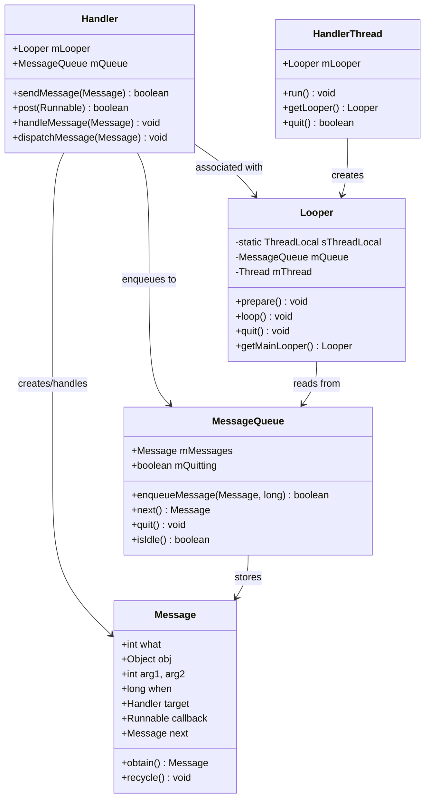

## 3. 消息设计原理

### 3.1 消息结构设计

消息是消息机制的基本单元，其设计需要考虑性能、内存管理和扩展性：

```java
public final class Message implements Parcelable {
    // 消息标识符
    public int what;
    
    // 简单数据参数
    public int arg1;
    public int arg2;
    
    // 复杂数据对象
    public Object obj;
    
    // 消息携带的数据包
    Bundle data;
    
    // 消息处理器
    Handler target;
    
    // 回调函数
    Runnable callback;
    
    // 消息发送时间
    long when;
    
    // 链表指针（用于消息队列）
    Message next;
    
    // 消息池相关
    private static final Object sPoolSync = new Object();
    private static Message sPool;
    private static int sPoolSize = 0;
    private static final int MAX_POOL_SIZE = 50;
}
```

### 3.2 同步消息与异步消息设计

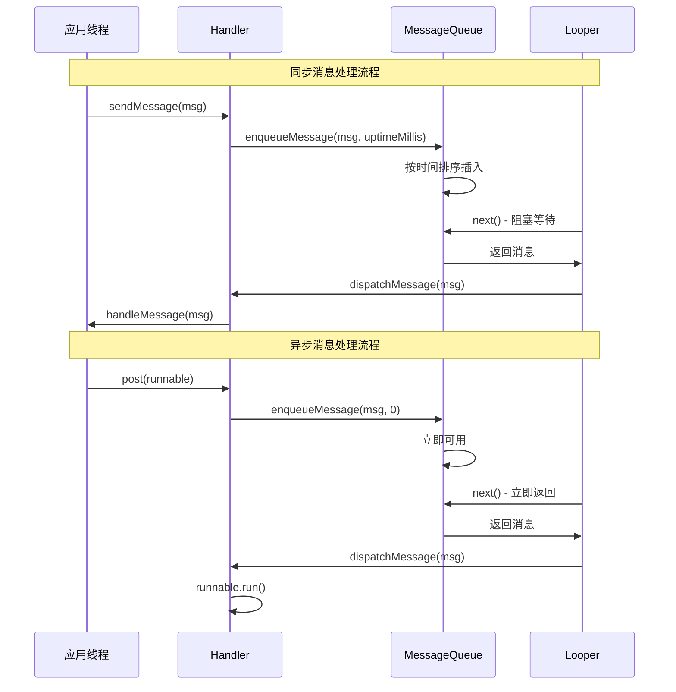

### 3.3 消息类型分类

| 消息类型 | 特点 | 使用场景 | 处理方式 |
|----------|------|----------|----------|
| **普通消息** | 按时间顺序处理 | 一般业务逻辑 | handleMessage() |
| **延时消息** | 指定时间后处理 | 定时任务、超时处理 | sendMessageDelayed() |
| **屏障消息** | 阻塞同步消息 | 优先处理异步消息 | postSyncBarrier() |
| **异步消息** | 不受屏障影响 | UI刷新、高优先级任务 | setAsynchronous(true) |
| **空闲消息** | 队列空闲时处理 | 资源清理、预加载 | IdleHandler |

## 4. 消息队列设计

### 4.1 消息队列数据结构

消息队列采用**单链表**结构，按照消息的执行时间进行排序：

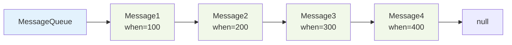

### 4.2 消息入队算法

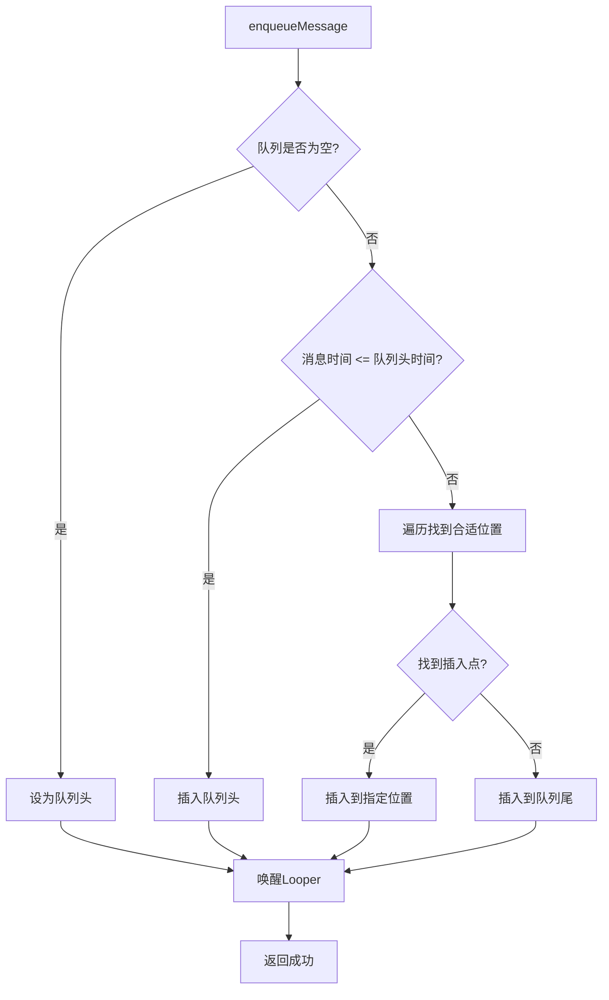

### 4.3 消息队列核心实现

```java
public final class MessageQueue {
    Message mMessages; // 队列头
    private final Object mLock = new Object();
    
    boolean enqueueMessage(Message msg, long when) {
        synchronized (mLock) {
            msg.when = when;
            Message p = mMessages;
            boolean needWake;
            
            // 插入到队列头部
            if (p == null || when == 0 || when < p.when) {
                msg.next = p;
                mMessages = msg;
                needWake = mBlocked;
            } else {
                // 找到合适的插入位置
                needWake = mBlocked && p.target == null && msg.isAsynchronous();
                Message prev;
                for (;;) {
                    prev = p;
                    p = p.next;
                    if (p == null || when < p.when) {
                        break;
                    }
                    if (needWake && p.isAsynchronous()) {
                        needWake = false;
                    }
                }
                msg.next = p;
                prev.next = msg;
            }
            
            // 唤醒等待的Looper
            if (needWake) {
                nativeWake(mPtr);
            }
        }
        return true;
    }
}
```

### 4.4 消息队列管理策略

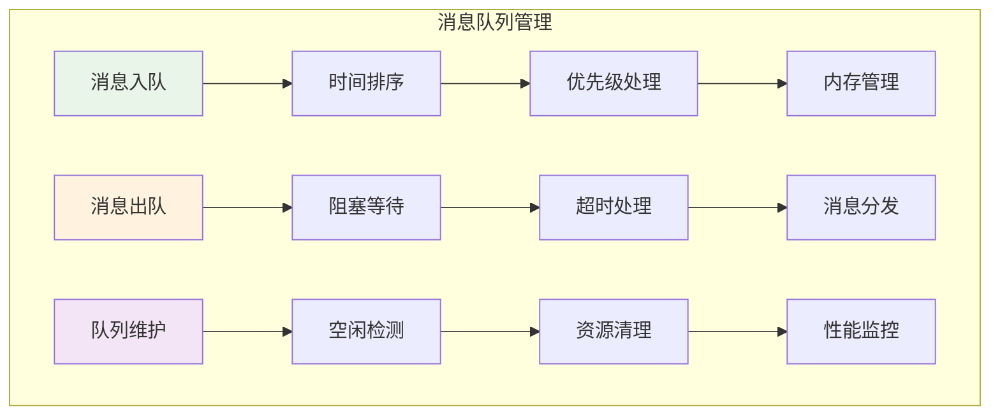

## 5. 消息处理器设计

### 5.1 Handler设计模式

Handler采用**策略模式**和**模板方法模式**，提供灵活的消息处理机制：

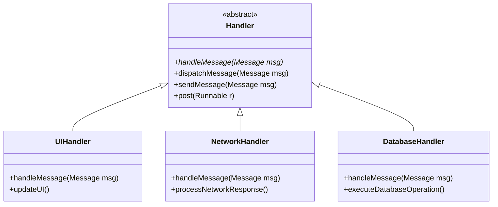

### 5.2 消息分发机制

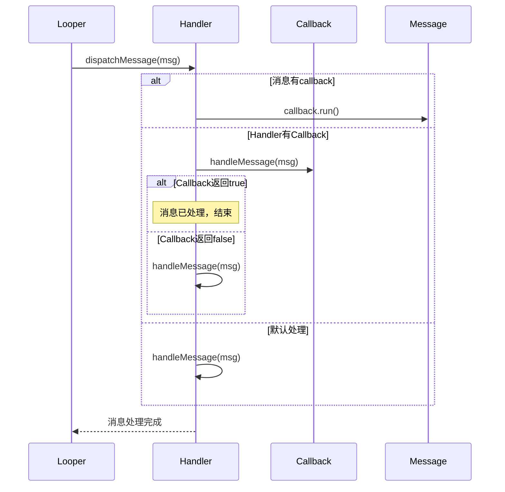

### 5.3 Handler生命周期管理

```java
public class LifecycleHandler extends Handler {
    private WeakReference<Context> mContextRef;
    
    public LifecycleHandler(Context context) {
        mContextRef = new WeakReference<>(context);
    }
    
    @Override
    public void handleMessage(Message msg) {
        Context context = mContextRef.get();
        if (context == null) {
            // Context已被回收，忽略消息
            return;
        }
        
        if (context instanceof Activity) {
            Activity activity = (Activity) context;
            if (activity.isFinishing() || activity.isDestroyed()) {
                // Activity已销毁，忽略消息
                return;
            }
        }
        
        // 安全处理消息
        handleMessageSafely(msg, context);
    }
    
    protected void handleMessageSafely(Message msg, Context context) {
        // 子类实现具体逻辑
    }
}
```

## 6. Looper设计原理

### 6.1 Looper设计思想

Looper是消息机制的核心驱动器，采用**事件循环**模式，其设计思想包括：

1. **单线程模型**: 每个线程最多只能有一个Looper
2. **事件驱动**: 基于消息队列的事件循环
3. **阻塞等待**: 没有消息时进入休眠状态
4. **优先级调度**: 支持不同优先级的消息处理

### 6.2 Looper工作流程

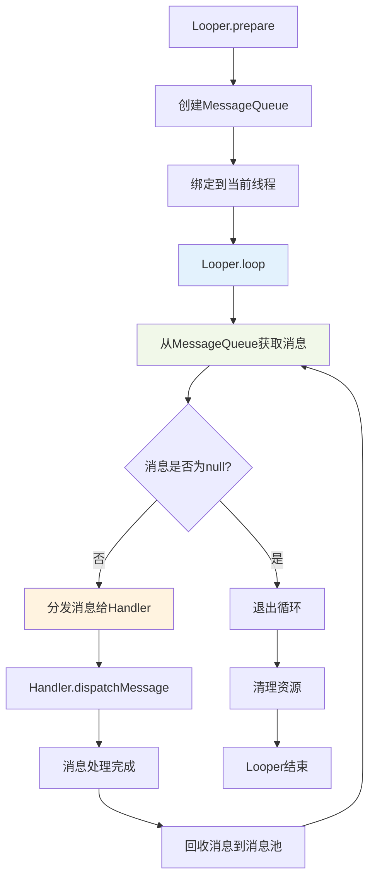

### 6.3 Looper核心实现

```java
public final class Looper {
    static final ThreadLocal<Looper> sThreadLocal = new ThreadLocal<Looper>();
    private static Looper sMainLooper;
    
    final MessageQueue mQueue;
    final Thread mThread;
    
    public static void prepare() {
        prepare(true);
    }
    
    private static void prepare(boolean quitAllowed) {
        if (sThreadLocal.get() != null) {
            throw new RuntimeException("Only one Looper may be created per thread");
        }
        sThreadLocal.set(new Looper(quitAllowed));
    }
    
    public static void loop() {
        final Looper me = myLooper();
        if (me == null) {
            throw new RuntimeException("No Looper; Looper.prepare() wasn't called on this thread.");
        }
        
        final MessageQueue queue = me.mQueue;
        
        for (;;) {
            Message msg = queue.next(); // 可能阻塞
            if (msg == null) {
                // 没有消息表示消息队列正在退出
                return;
            }
            
            try {
                msg.target.dispatchMessage(msg);
            } finally {
                msg.recycleUnchecked();
            }
        }
    }
}
```

### 6.4 多Looper架构设计

应用可以有多个Looper，每个线程最多一个：

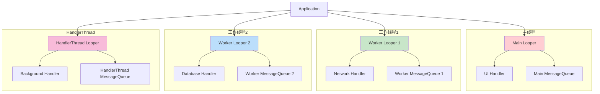

### 6.5 为什么支持多Looper

| 原因 | 说明 | 优势 |
|------|------|------|
| **线程隔离** | 不同线程处理不同类型任务 | 避免相互影响，提高稳定性 |
| **性能优化** | 分散处理负载 | 充分利用多核CPU资源 |
| **职责分离** | UI线程专注界面更新 | 后台线程处理耗时操作 |
| **优先级管理** | 不同优先级的任务分离 | 保证关键任务及时处理 |

## 7. 消息机制在不同平台的实现

### 7.1 Android消息机制

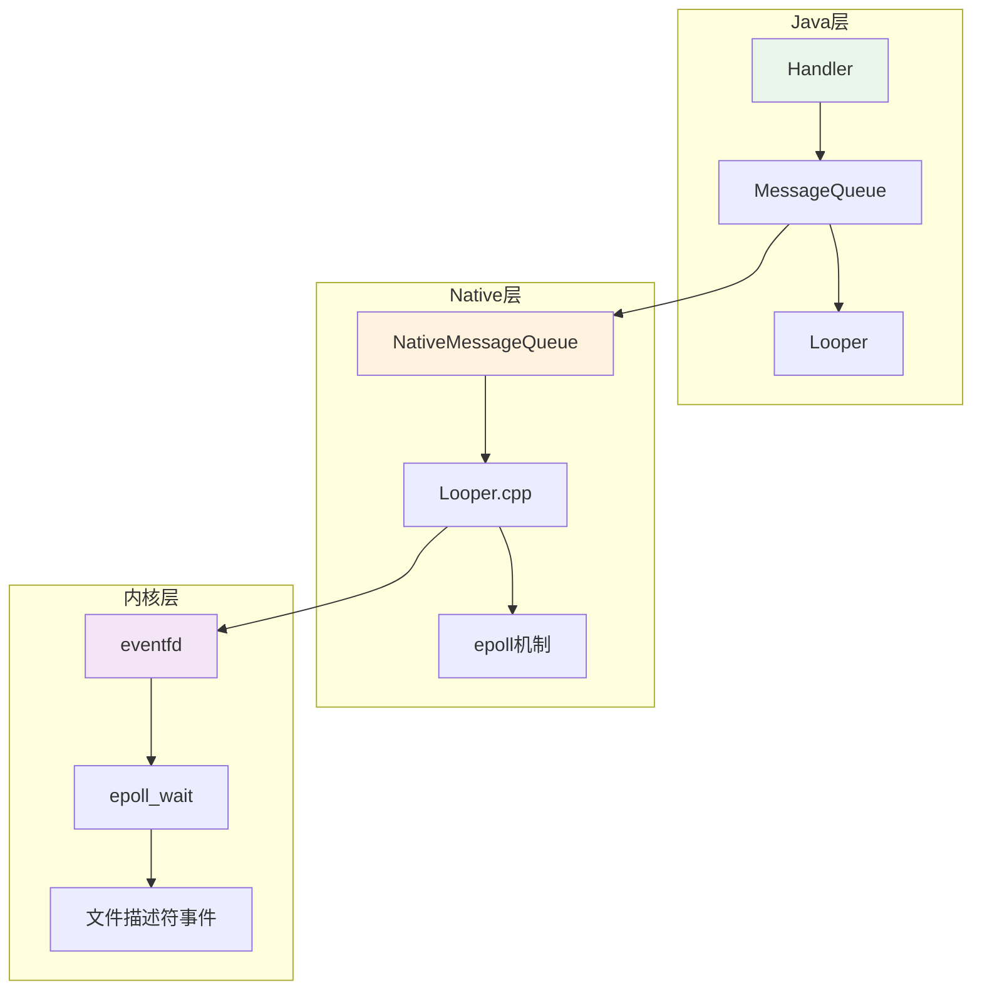

### 7.2 iOS消息机制（RunLoop）

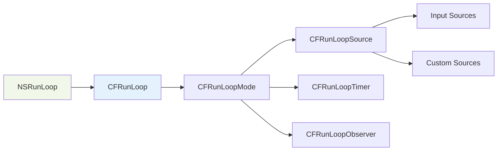

### 7.3 平台对比分析

| 特性 | Android Handler | iOS RunLoop | Web Event Loop |
|------|-----------------|-------------|----------------|
| **消息队列** | MessageQueue | CFRunLoopMode | Task Queue |
| **事件循环** | Looper.loop() | CFRunLoopRun | Event Loop |
| **线程模型** | 多线程支持 | 主要在主线程 | 单线程 |
| **底层机制** | epoll | kqueue/select | libuv |
| **优先级** | 时间排序 | Mode切换 | 微任务/宏任务 |

## 8. 性能优化与最佳实践

### 8.1 性能监控指标

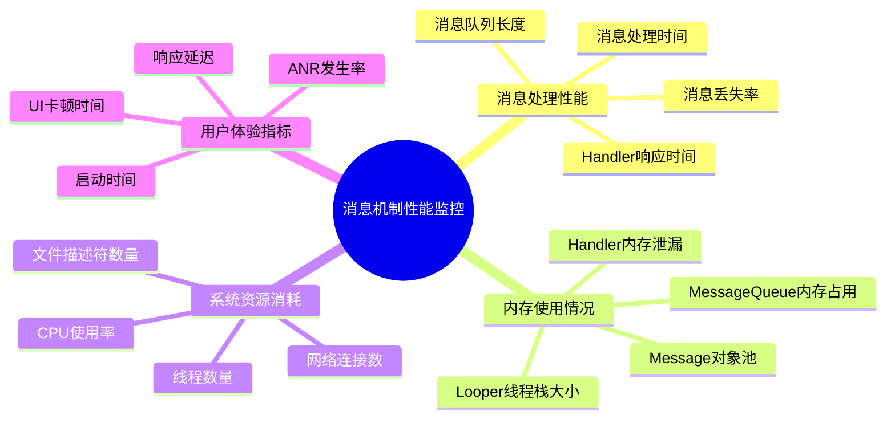

### 8.2 性能优化策略

```java
public class MessageOptimizer {
    
    // 1. 使用消息池避免频繁创建对象
    public static Message obtainMessage(Handler handler, int what) {
        Message msg = Message.obtain();
        msg.target = handler;
        msg.what = what;
        return msg;
    }
    
    // 2. 及时移除未处理的消息
    public static void cleanupMessages(Handler handler) {
        handler.removeCallbacksAndMessages(null);
    }
    
    // 3. 使用WeakReference避免内存泄漏
    public static class WeakHandler extends Handler {
        private final WeakReference<Callback> mCallbackRef;
        
        public WeakHandler(Callback callback) {
            mCallbackRef = new WeakReference<>(callback);
        }
        
        @Override
        public void handleMessage(Message msg) {
            Callback callback = mCallbackRef.get();
            if (callback != null) {
                callback.handleMessage(msg);
            }
        }
    }
    
    // 4. 批量处理消息
    public static void batchProcessMessages(Handler handler, List<Message> messages) {
        Message batchMsg = Message.obtain();
        batchMsg.obj = messages;
        handler.sendMessage(batchMsg);
    }
}
```

### 8.3 最佳实践建议

| 实践 | 说明 | 代码示例 |
|------|------|----------|
| **使用Message.obtain()** | 复用消息对象，减少GC | `Message.obtain(handler, what, obj)` |
| **及时清理Handler** | 避免内存泄漏 | `handler.removeCallbacksAndMessages(null)` |
| **使用WeakReference** | 防止Activity泄漏 | `WeakReference<Activity> activityRef` |
| **合理设置消息优先级** | 保证重要消息及时处理 | `msg.setAsynchronous(true)` |
| **避免在Handler中执行耗时操作** | 防止ANR | 使用线程池处理耗时任务 |

## 9. 异常处理与容错机制

### 9.1 异常处理流程

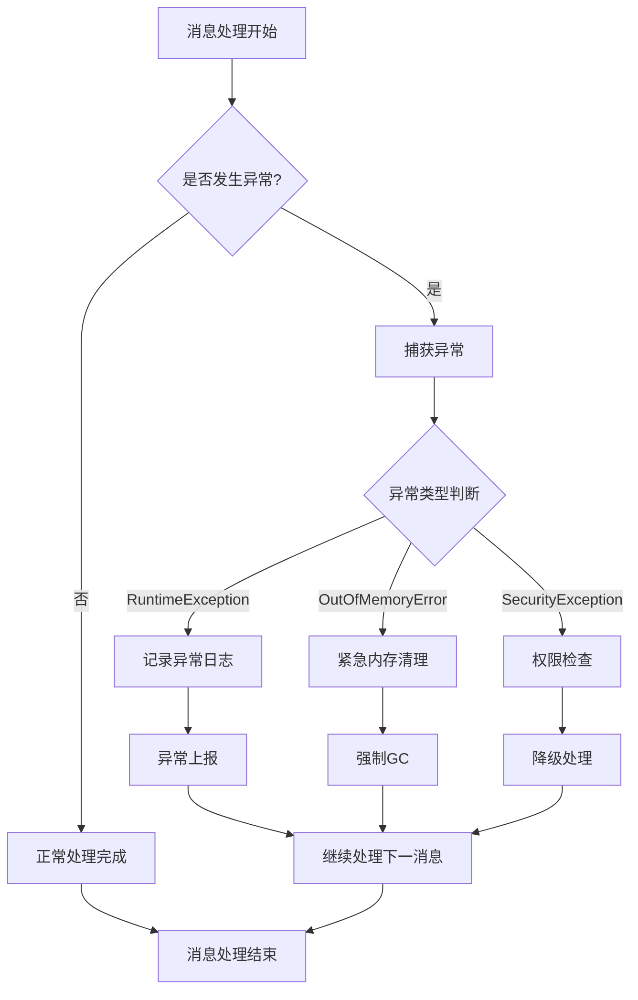

### 9.2 容错机制设计

```java
public class FaultTolerantHandler extends Handler {
    private static final int MAX_RETRY_COUNT = 3;
    private final Map<Message, Integer> retryCountMap = new ConcurrentHashMap<>();
    
    @Override
    public void dispatchMessage(Message msg) {
        try {
            super.dispatchMessage(msg);
            // 处理成功，清除重试计数
            retryCountMap.remove(msg);
        } catch (Exception e) {
            handleException(msg, e);
        }
    }
    
    private void handleException(Message msg, Exception e) {
        int retryCount = retryCountMap.getOrDefault(msg, 0);
        
        if (retryCount < MAX_RETRY_COUNT) {
            // 重试处理
            retryCountMap.put(msg, retryCount + 1);
            sendMessageDelayed(Message.obtain(msg), 1000 * (retryCount + 1));
            Log.w(TAG, "Message processing failed, retry " + (retryCount + 1), e);
        } else {
            // 达到最大重试次数，记录错误并放弃
            retryCountMap.remove(msg);
            Log.e(TAG, "Message processing failed after " + MAX_RETRY_COUNT + " retries", e);
            
            // 可以发送错误消息给上层处理
            Message errorMsg = obtainMessage(MSG_ERROR, e);
            sendMessage(errorMsg);
        }
    }
}
```

## 10. 扩展功能设计

### 10.1 消息拦截器

```java
public interface MessageInterceptor {
    boolean onMessageReceived(Message msg);
    void onMessageProcessed(Message msg, long processingTime);
    void onMessageError(Message msg, Exception e);
}

public class InterceptorHandler extends Handler {
    private final List<MessageInterceptor> interceptors = new ArrayList<>();
    
    public void addInterceptor(MessageInterceptor interceptor) {
        interceptors.add(interceptor);
    }
    
    @Override
    public void dispatchMessage(Message msg) {
        // 前置拦截
        for (MessageInterceptor interceptor : interceptors) {
            if (!interceptor.onMessageReceived(msg)) {
                return; // 被拦截，不继续处理
            }
        }
        
        long startTime = System.currentTimeMillis();
        try {
            super.dispatchMessage(msg);
            
            // 后置处理
            long processingTime = System.currentTimeMillis() - startTime;
            for (MessageInterceptor interceptor : interceptors) {
                interceptor.onMessageProcessed(msg, processingTime);
            }
        } catch (Exception e) {
            // 异常处理
            for (MessageInterceptor interceptor : interceptors) {
                interceptor.onMessageError(msg, e);
            }
            throw e;
        }
    }
}
```

### 10.2 消息总线设计

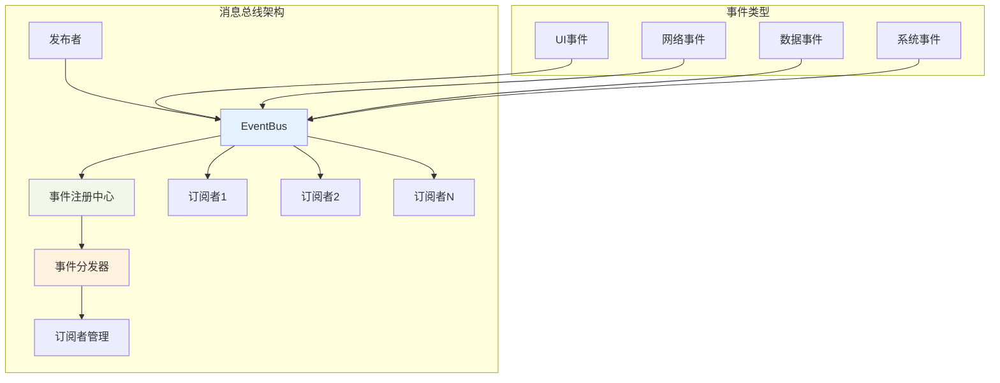

## 11. 测试与验证

### 11.1 单元测试设计

```java
@RunWith(AndroidJUnit4.class)
public class MessageMechanismTest {
    
    private HandlerThread testThread;
    private Handler testHandler;
    
    @Before
    public void setUp() {
        testThread = new HandlerThread("TestThread");
        testThread.start();
        testHandler = new Handler(testThread.getLooper());
    }
    
    @Test
    public void testMessageOrdering() {
        CountDownLatch latch = new CountDownLatch(3);
        List<Integer> executionOrder = Collections.synchronizedList(new ArrayList<>());
        
        // 发送延时消息
        testHandler.postDelayed(() -> {
            executionOrder.add(3);
            latch.countDown();
        }, 300);
        
        testHandler.postDelayed(() -> {
            executionOrder.add(1);
            latch.countDown();
        }, 100);
        
        testHandler.postDelayed(() -> {
            executionOrder.add(2);
            latch.countDown();
        }, 200);
        
        latch.await(1, TimeUnit.SECONDS);
        assertEquals(Arrays.asList(1, 2, 3), executionOrder);
    }
    
    @Test
    public void testMessageCancellation() {
        AtomicBoolean executed = new AtomicBoolean(false);
        Runnable task = () -> executed.set(true);
        
        testHandler.postDelayed(task, 1000);
        testHandler.removeCallbacks(task);
        
        SystemClock.sleep(1500);
        assertFalse(executed.get());
    }
    
    @After
    public void tearDown() {
        testThread.quitSafely();
    }
}
```

### 11.2 性能测试方案

```java
public class MessagePerformanceTest {
    
    @Test
    public void testMessageThroughput() {
        HandlerThread thread = new HandlerThread("PerformanceTest");
        thread.start();
        Handler handler = new Handler(thread.getLooper());
        
        int messageCount = 10000;
        CountDownLatch latch = new CountDownLatch(messageCount);
        
        long startTime = System.currentTimeMillis();
        
        for (int i = 0; i < messageCount; i++) {
            handler.post(latch::countDown);
        }
        
        latch.await();
        long endTime = System.currentTimeMillis();
        
        double throughput = messageCount * 1000.0 / (endTime - startTime);
        System.out.println("Message throughput: " + throughput + " messages/second");
        
        thread.quitSafely();
    }
}
```

## 12. 总结

### 12.1 消息机制核心价值

消息机制作为现代移动应用的基础设施，提供了：

1. **线程安全的通信机制**: 解决多线程环境下的数据同步问题
2. **异步任务处理能力**: 避免阻塞主线程，提升用户体验
3. **事件驱动的架构支持**: 实现松耦合的组件间通信
4. **高效的资源管理**: 通过消息池和队列优化内存使用

### 12.2 设计原则总结

| 原则 | 说明 | 实现方式 |
|------|------|----------|
| **单一职责** | 每个组件专注特定功能 | Handler处理消息，Looper驱动循环 |
| **开闭原则** | 对扩展开放，对修改封闭 | 支持自定义Handler和拦截器 |
| **依赖倒置** | 依赖抽象而非具体实现 | 基于接口的回调机制 |
| **最少知识** | 组件间最小化依赖 | 通过消息进行解耦通信 |

### 12.3 未来发展方向

1. **响应式编程支持**: 集成RxJava等响应式框架
2. **协程集成**: 支持Kotlin协程的异步处理
3. **跨进程消息**: 扩展到进程间通信场景
4. **AI驱动优化**: 基于机器学习的消息调度优化

消息机制将继续演进，为移动应用提供更高效、更智能的异步处理能力。