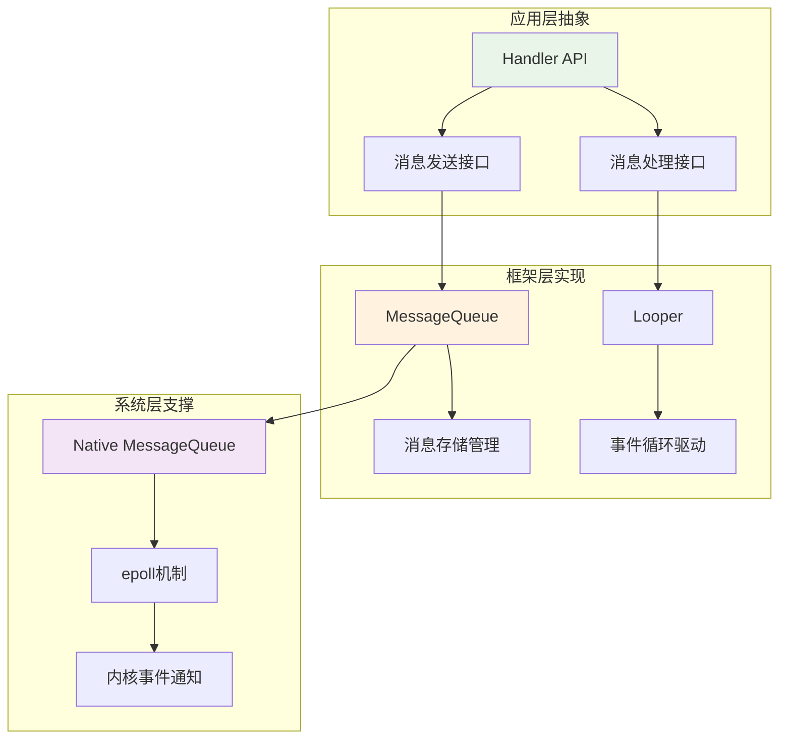
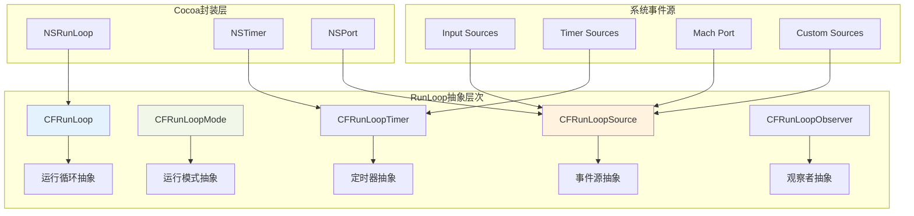
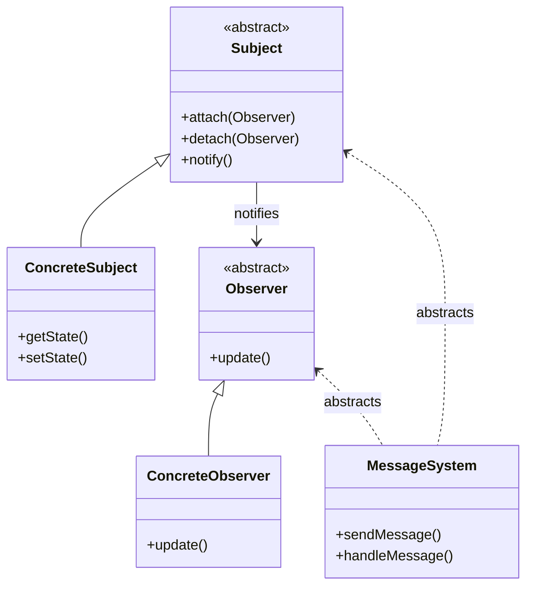
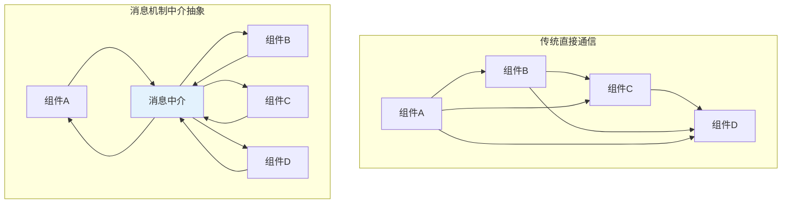
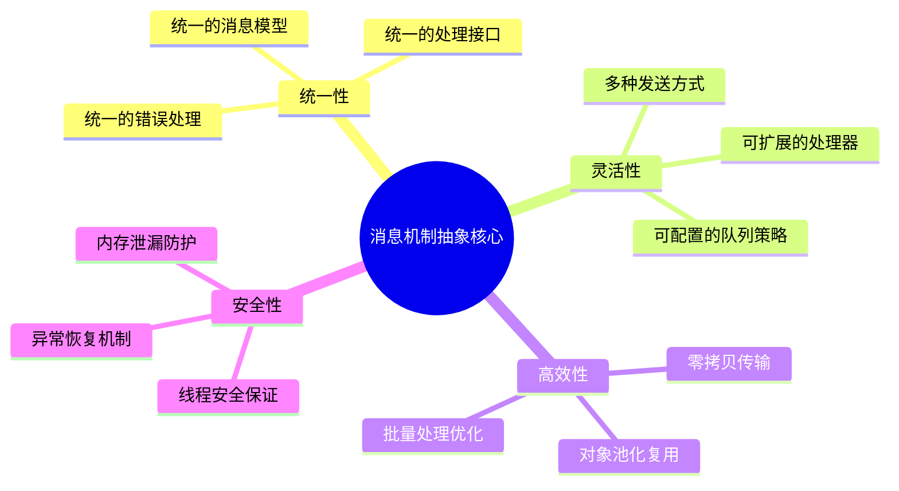

# 消息机制设计思想与抽象能力深度分析

## 1. 消息机制的核心设计思想

### 1.1 设计哲学概述


### 1.2 核心设计原则

| 设计原则 | Android实现 | iOS实现 | 设计意图 |
|----------|-------------|---------|----------|
| **单一职责** | Handler专注消息处理 | RunLoop专注事件循环 | 每个组件职责明确 |
| **开闭原则** | 可扩展Handler类型 | 可添加RunLoop Source | 对扩展开放，对修改封闭 |
| **依赖倒置** | 基于接口回调 | 基于delegate模式 | 依赖抽象而非具体实现 |
| **接口隔离** | 不同类型的消息接口 | 不同类型的事件源 | 客户端不依赖不需要的接口 |
| **最少知识** | 通过消息解耦 | 通过事件解耦 | 减少组件间直接依赖 |

## 2. Android消息机制的设计思想

### 2.1 架构设计思想

Android的消息机制体现了**分层架构**和**责任链模式**的设计思想：



### 2.2 核心抽象能力

#### 2.2.1 消息抽象（Message Abstraction）

```java
// 消息的高度抽象设计
public final class Message implements Parcelable {
    // 抽象层面1: 消息标识抽象
    public int what;        // 消息类型的抽象表示
    
    // 抽象层面2: 数据载荷抽象
    public Object obj;      // 任意对象的抽象承载
    public int arg1, arg2;  // 简单数据的抽象表示
    Bundle data;            // 复杂数据的抽象容器
    
    // 抽象层面3: 处理逻辑抽象
    Handler target;         // 处理器的抽象引用
    Runnable callback;      // 回调逻辑的抽象封装
    
    // 抽象层面4: 时间维度抽象
    long when;              // 执行时机的抽象表示
    
    // 抽象层面5: 链式结构抽象
    Message next;           // 队列结构的抽象实现
}
```

**设计思想分析**：
- **数据抽象**: 通过`what`、`obj`、`Bundle`等提供多层次的数据抽象
- **行为抽象**: 通过`Handler`和`Runnable`抽象消息的处理行为
- **时间抽象**: 通过`when`字段抽象消息的时间属性
- **结构抽象**: 通过链表结构抽象队列的存储方式

#### 2.2.2 处理器抽象（Handler Abstraction）

```java
public class Handler {
    // 抽象能力1: 消息分发的抽象
    public void dispatchMessage(Message msg) {
        if (msg.callback != null) {
            handleCallback(msg);        // 回调方式抽象
        } else {
            if (mCallback != null) {
                if (mCallback.handleMessage(msg)) {
                    return;             // 拦截器方式抽象
                }
            }
            handleMessage(msg);         // 继承方式抽象
        }
    }
    
    // 抽象能力2: 消息发送的抽象
    public final boolean sendMessage(Message msg) {
        return sendMessageDelayed(msg, 0);
    }
    
    public final boolean sendMessageDelayed(Message msg, long delayMillis) {
        if (delayMillis < 0) {
            delayMillis = 0;
        }
        return sendMessageAtTime(msg, SystemClock.uptimeMillis() + delayMillis);
    }
    
    // 抽象能力3: 时间处理的抽象
    public boolean sendMessageAtTime(Message msg, long uptimeMillis) {
        MessageQueue queue = mQueue;
        if (queue == null) {
            return false;
        }
        return enqueueMessage(queue, msg, uptimeMillis);
    }
}
```

**抽象能力体现**：
1. **处理方式抽象**: 支持回调、拦截器、继承三种处理方式
2. **时间维度抽象**: 将立即发送、延时发送、定时发送统一抽象
3. **错误处理抽象**: 统一的异常处理和容错机制

#### 2.2.3 队列抽象（Queue Abstraction）

```java
public final class MessageQueue {
    // 抽象能力1: 存储结构抽象
    Message mMessages;  // 将复杂的优先级队列抽象为简单的链表
    
    // 抽象能力2: 同步机制抽象
    private final Object mLock = new Object();
    
    // 抽象能力3: 阻塞等待抽象
    Message next() {
        final long ptr = mPtr;
        if (ptr == 0) {
            return null;
        }
        
        int pendingIdleHandlerCount = -1;
        int nextPollTimeoutMillis = 0;
        
        for (;;) {
            if (nextPollTimeoutMillis != 0) {
                Binder.flushPendingCommands();
            }
            
            // 抽象的阻塞等待机制
            nativePollOnce(ptr, nextPollTimeoutMillis);
            
            synchronized (mLock) {
                // 抽象的消息获取逻辑
                final long now = SystemClock.uptimeMillis();
                Message prevMsg = null;
                Message msg = mMessages;
                
                // 处理同步屏障
                if (msg != null && msg.target == null) {
                    do {
                        prevMsg = msg;
                        msg = msg.next;
                    } while (msg != null && !msg.isAsynchronous());
                }
                
                if (msg != null) {
                    if (now < msg.when) {
                        nextPollTimeoutMillis = (int) Math.min(msg.when - now, Integer.MAX_VALUE);
                    } else {
                        // 获取消息
                        mBlocked = false;
                        if (prevMsg != null) {
                            prevMsg.next = msg.next;
                        } else {
                            mMessages = msg.next;
                        }
                        msg.next = null;
                        return msg;
                    }
                } else {
                    nextPollTimeoutMillis = -1;
                }
            }
        }
    }
}
```

**抽象设计特点**：
1. **存储抽象**: 将优先级队列抽象为时间排序的链表
2. **同步抽象**: 通过锁机制抽象多线程访问控制
3. **等待抽象**: 通过native层抽象系统级的阻塞等待

### 2.3 Looper的抽象设计

```java
public final class Looper {
    // 抽象能力1: 线程绑定抽象
    static final ThreadLocal<Looper> sThreadLocal = new ThreadLocal<Looper>();
    
    // 抽象能力2: 事件循环抽象
    public static void loop() {
        final Looper me = myLooper();
        final MessageQueue queue = me.mQueue;
        
        // 无限循环的抽象实现
        for (;;) {
            Message msg = queue.next(); // 可能阻塞
            if (msg == null) {
                return; // 退出循环的抽象条件
            }
            
            // 消息分发的抽象
            try {
                msg.target.dispatchMessage(msg);
            } catch (Exception exception) {
                throw exception;
            } finally {
                msg.recycleUnchecked();
            }
        }
    }
    
    // 抽象能力3: 生命周期抽象
    public void quit() {
        mQueue.quit(false);
    }
    
    public void quitSafely() {
        mQueue.quit(true);
    }
}
```

## 3. iOS消息机制（RunLoop）的设计思想

### 3.1 RunLoop的抽象架构

iOS的RunLoop体现了**模式驱动**和**事件源抽象**的设计思想：



### 3.2 RunLoop的核心抽象能力

#### 3.2.1 模式抽象（Mode Abstraction）

```objc
// RunLoop模式的抽象设计
typedef struct __CFRunLoopMode {
    CFStringRef _name;              // 模式名称抽象
    CFMutableSetRef _sources0;      // Source0事件源集合抽象
    CFMutableSetRef _sources1;      // Source1事件源集合抽象
    CFMutableArrayRef _observers;   // 观察者集合抽象
    CFMutableArrayRef _timers;      // 定时器集合抽象
    CFMutableDictionaryRef _portToV1SourceMap; // 端口映射抽象
} CFRunLoopMode;

// 预定义模式的抽象
FOUNDATION_EXPORT CFStringRef const kCFRunLoopDefaultMode;     // 默认模式
FOUNDATION_EXPORT CFStringRef const kCFRunLoopCommonModes;     // 通用模式标记
```

**抽象设计特点**：
1. **模式隔离**: 不同模式下的事件源完全隔离，实现了运行时的上下文抽象
2. **集合管理**: 通过集合抽象管理不同类型的事件源
3. **动态切换**: 支持运行时动态切换模式，实现了行为的抽象切换

#### 3.2.2 事件源抽象（Source Abstraction）

```objc
// Source0: 用户事件源抽象
typedef struct {
    CFIndex version;
    void *  info;
    const void *(*retain)(const void *info);
    void    (*release)(const void *info);
    CFStringRef (*copyDescription)(const void *info);
    Boolean (*equal)(const void *info1, const void *info2);
    CFHashCode  (*hash)(const void *info);
    void    (*schedule)(void *info, CFRunLoopRef rl, CFStringRef mode);
    void    (*cancel)(void *info, CFRunLoopRef rl, CFStringRef mode);
    void    (*perform)(void *info);  // 事件处理抽象
} CFRunLoopSourceContext;

// Source1: 系统事件源抽象
typedef struct {
    CFIndex version;
    void *  info;
    const void *(*retain)(const void *info);
    void    (*release)(const void *info);
    CFStringRef (*copyDescription)(const void *info);
    Boolean (*equal)(const void *info1, const void *info2);
    CFHashCode  (*hash)(const void *info);
    mach_port_t (*getPort)(void *info);     // 端口获取抽象
    void *  (*perform)(void *msg, CFIndex size, CFAllocatorRef allocator, void *info);
} CFRunLoopSourceContext1;
```

**抽象能力体现**：
1. **事件类型抽象**: Source0抽象用户事件，Source1抽象系统事件
2. **生命周期抽象**: 通过函数指针抽象事件源的生命周期管理
3. **处理逻辑抽象**: 通过回调函数抽象事件的具体处理逻辑

#### 3.2.3 观察者抽象（Observer Abstraction）

```objc
// RunLoop状态观察抽象
typedef CF_OPTIONS(CFOptionFlags, CFRunLoopActivity) {
    kCFRunLoopEntry         = (1UL << 0),    // 进入RunLoop
    kCFRunLoopBeforeTimers  = (1UL << 1),    // 处理Timer前
    kCFRunLoopBeforeSources = (1UL << 2),    // 处理Source前
    kCFRunLoopBeforeWaiting = (1UL << 5),    // 进入休眠前
    kCFRunLoopAfterWaiting  = (1UL << 6),    // 休眠后唤醒
    kCFRunLoopExit          = (1UL << 7),    // 退出RunLoop
    kCFRunLoopAllActivities = 0x0FFFFFFFU    // 所有状态
};

// 观察者回调抽象
typedef void (*CFRunLoopObserverCallBack)(CFRunLoopObserverRef observer, 
                                          CFRunLoopActivity activity, 
                                          void *info);
```

**抽象设计优势**：
1. **状态抽象**: 将RunLoop的复杂状态抽象为有限的几个关键节点
2. **监控抽象**: 提供统一的监控接口，抽象了状态变化的通知机制
3. **扩展抽象**: 支持自定义观察者，实现了监控逻辑的抽象扩展

## 4. 跨平台消息机制的抽象对比

### 4.1 抽象层次对比

```mermaid
graph TB
    subgraph "Android抽象层次"
        A1[Handler API] --> A2[Message抽象]
        A2 --> A3[MessageQueue抽象]
        A3 --> A4[Looper抽象]
        A4 --> A5[Native层抽象]
        A5 --> A6[epoll系统调用]
    end
    
    subgraph "iOS抽象层次"
        B1[NSRunLoop API] --> B2[CFRunLoop抽象]
        B2 --> B3[CFRunLoopMode抽象]
        B3 --> B4[CFRunLoopSource抽象]
        B4 --> B5[Mach Port抽象]
        B5 --> B6[kqueue系统调用]
    end
    
    subgraph "Web抽象层次"
        C1[Event API] --> C2[Event Loop抽象]
        C2 --> C3[Task Queue抽象]
        C3 --> C4[Microtask抽象]
        C4 --> C5[libuv抽象]
        C5 --> C6[epoll/kqueue调用]
    end
    
    style A1 fill:#e8f5e8
    style B1 fill:#fff3e0
    style C1 fill:#f3e5f5
```



### 4.2 抽象能力对比分析

| 抽象维度 | Android | iOS | Web | 抽象程度评价 |
|----------|---------|-----|-----|--------------|
| **消息抽象** | Message类统一抽象 | 多种Source类型抽象 | Event对象抽象 | Android最统一 |
| **队列抽象** | 单一MessageQueue | 多Mode管理 | 多Queue分层 | iOS最灵活 |
| **处理抽象** | Handler统一处理 | 回调函数处理 | Promise/async处理 | Web最现代 |
| **时间抽象** | when字段+延时 | Timer独立抽象 | setTimeout分离 | iOS最清晰 |
| **生命周期** | prepare/loop/quit | run/stop模式 | 自动管理 | Android最明确 |

### 4.3 设计思想的共同点

#### 4.3.1 事件驱动抽象

所有平台都采用了事件驱动的抽象模型：

```mermaid
sequenceDiagram
    participant Producer as 事件生产者
    participant Queue as 事件队列
    participant Loop as 事件循环
    participant Handler as 事件处理器
    
    Note over Producer,Handler: 通用事件驱动抽象模型
    
    Producer->>Queue: 产生事件
    Queue->>Queue: 事件排队
    Loop->>Queue: 获取事件
    Queue->>Loop: 返回事件
    Loop->>Handler: 分发事件
    Handler->>Handler: 处理事件
    Handler-->>Loop: 处理完成
    Loop->>Queue: 继续获取
```

#### 4.3.2 异步处理抽象

```java
// Android异步抽象
handler.post(() -> {
    // 异步执行的抽象封装
    performBackgroundTask();
});

// iOS异步抽象
dispatch_async(dispatch_get_main_queue(), ^{
    // 异步执行的抽象封装
    [self performBackgroundTask];
});

// Web异步抽象
setTimeout(() => {
    // 异步执行的抽象封装
    performBackgroundTask();
}, 0);
```

## 5. 消息机制的高级抽象模式

### 5.1 观察者模式抽象

消息机制本质上是观察者模式的高级抽象：



### 5.2 命令模式抽象

消息机制也体现了命令模式的抽象思想：

```java
// 命令抽象接口
public interface Command {
    void execute();
    void undo();
}

// 消息作为命令的抽象实现
public class MessageCommand implements Command {
    private final Message message;
    private final Handler handler;
    
    public MessageCommand(Message message, Handler handler) {
        this.message = message;
        this.handler = handler;
    }
    
    @Override
    public void execute() {
        handler.dispatchMessage(message);
    }
    
    @Override
    public void undo() {
        // 消息的撤销逻辑抽象
        handler.removeMessages(message.what);
    }
}
```

### 5.3 中介者模式抽象

消息机制实现了组件间通信的中介者抽象：



## 6. 抽象能力的演进趋势

### 6.1 响应式编程抽象

现代消息机制正在向响应式编程抽象演进：

```java
// 传统消息处理
handler.post(() -> {
    String result = networkCall();
    handler.post(() -> updateUI(result));
});

// 响应式抽象
Observable.fromCallable(() -> networkCall())
    .subscribeOn(Schedulers.io())
    .observeOn(AndroidSchedulers.mainThread())
    .subscribe(result -> updateUI(result));
```

### 6.2 协程抽象

协程提供了更高级的异步抽象：

```kotlin
// 传统Handler方式
handler.post {
    val result = withContext(Dispatchers.IO) {
        networkCall()
    }
    updateUI(result)
}

// 协程抽象
lifecycleScope.launch {
    val result = withContext(Dispatchers.IO) {
        networkCall()
    }
    updateUI(result)
}
```

### 6.3 函数式抽象

函数式编程为消息处理提供了新的抽象方式：

```javascript
// 传统事件处理
element.addEventListener('click', function(event) {
    handleClick(event);
});

// 函数式抽象
const clickStream = fromEvent(element, 'click');
const processedStream = clickStream
    .map(event => processEvent(event))
    .filter(data => data.isValid)
    .debounceTime(300);

processedStream.subscribe(data => handleProcessedData(data));
```

## 7. 抽象设计的最佳实践

### 7.1 抽象层次设计原则

```mermaid
pyramid
    title 消息机制抽象层次金字塔
    
    "应用接口层" : "简单易用的API抽象"
    "框架服务层" : "通用功能的抽象封装"
    "平台适配层" : "跨平台差异的抽象"
    "系统调用层" : "操作系统接口抽象"
```

### 7.2 抽象接口设计

```java
// 消息系统的抽象接口设计
public interface MessageSystem {
    // 基础抽象能力
    void sendMessage(Message message);
    void sendDelayedMessage(Message message, long delay);
    void removeMessage(int what);
    
    // 生命周期抽象
    void start();
    void stop();
    void pause();
    void resume();
    
    // 监控抽象能力
    void addObserver(MessageObserver observer);
    void removeObserver(MessageObserver observer);
    
    // 扩展抽象能力
    void addInterceptor(MessageInterceptor interceptor);
    void setErrorHandler(ErrorHandler handler);
}
```

### 7.3 抽象实现的评价标准

| 评价维度 | 优秀标准 | 实现方式 |
|----------|----------|----------|
| **易用性** | API简洁直观 | 合理的默认值和重载方法 |
| **扩展性** | 支持自定义扩展 | 插件化架构和回调机制 |
| **性能** | 最小化抽象开销 | 零拷贝和对象池技术 |
| **可靠性** | 异常情况处理完善 | 完整的错误处理和恢复机制 |
| **可测试性** | 支持单元测试 | 依赖注入和模拟对象支持 |

## 8. 总结：消息机制抽象的价值

### 8.1 抽象带来的核心价值

1. **复杂性隐藏**: 将底层的系统调用、线程同步等复杂性抽象为简单的API
2. **平台无关性**: 通过抽象层屏蔽不同平台的实现差异
3. **可维护性**: 抽象接口的稳定性降低了系统维护成本
4. **可扩展性**: 良好的抽象设计支持功能的平滑扩展
5. **可重用性**: 抽象组件可以在不同场景中重复使用

### 8.2 设计思想的核心洞察



### 8.3 未来发展方向

消息机制的抽象能力将继续向以下方向演进：

1. **更高级的抽象**: 从命令式向声明式、从同步向异步、从回调向流式处理
2. **更智能的调度**: 基于AI的消息优先级调度和资源分配
3. **更好的可观测性**: 内置的监控、追踪和调试能力
4. **更强的类型安全**: 编译时类型检查和运行时类型验证

消息机制作为现代软件架构的基础设施，其抽象设计的优劣直接影响整个系统的质量。通过深入理解其设计思想和抽象能力，我们能够更好地设计和实现高质量的软件系统。