# 单线程模型技术设计方案

## 1. 概述与背景

### 1.1 单线程模型的核心理念

### 1.2 设计背景与问题解决

#### 1.2.1 传统多线程模型的挑战

#### 1.2.2 解决的核心问题

| 问题领域 | 传统方案 | 单线程模型方案 | 优势 |
|----------|----------|----------------|------|
| **并发处理** | 多线程+锁 | 协程+事件循环 | 无锁、高效 |
| **I/O密集型** | 线程池+阻塞I/O | 异步I/O+回调 | 资源利用率高 |
| **内存管理** | 每线程独立栈 | 共享堆+协程栈 | 内存效率优化 |
| **错误处理** | 异常跨线程传播 | 统一错误处理 | 简化异常管理 |
| **调试测试** | 不确定性执行 | 确定性执行 | 可重现性好 |

## 2. 核心设计思想

### 2.1 协作式 vs 抢占式调度

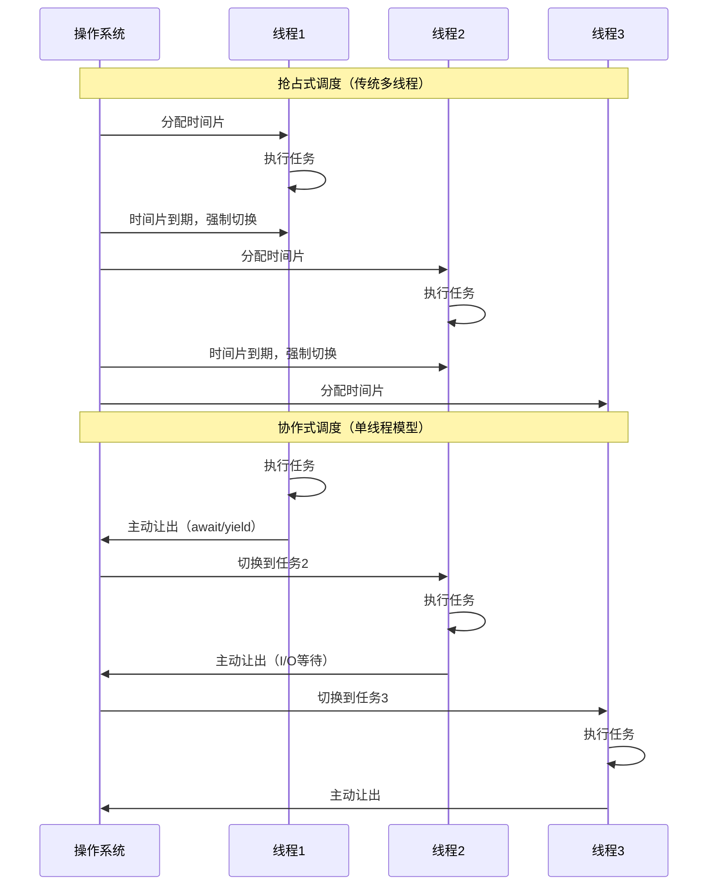

### 2.2 协作式调度的设计原理

#### 2.2.1 核心机制

```java
// 协作式调度的核心抽象
public abstract class Coroutine {
    private CoroutineState state = CoroutineState.CREATED;
    private Object yieldValue;
    
    // 协程的执行入口
    public abstract void run();
    
    // 主动让出控制权
    protected void yield() {
        this.state = CoroutineState.YIELDED;
        // 保存当前执行状态
        saveExecutionContext();
        // 切换到调度器
        Scheduler.getInstance().schedule();
    }
    
    // 等待异步操作完成
    protected void await(Future<?> future) {
        this.state = CoroutineState.WAITING;
        future.onComplete(() -> {
            this.state = CoroutineState.READY;
            Scheduler.getInstance().wakeup(this);
        });
        yield();
    }
    
    // 恢复执行
    public void resume() {
        this.state = CoroutineState.RUNNING;
        restoreExecutionContext();
        run();
    }
}
```

#### 2.2.2 状态转换模型

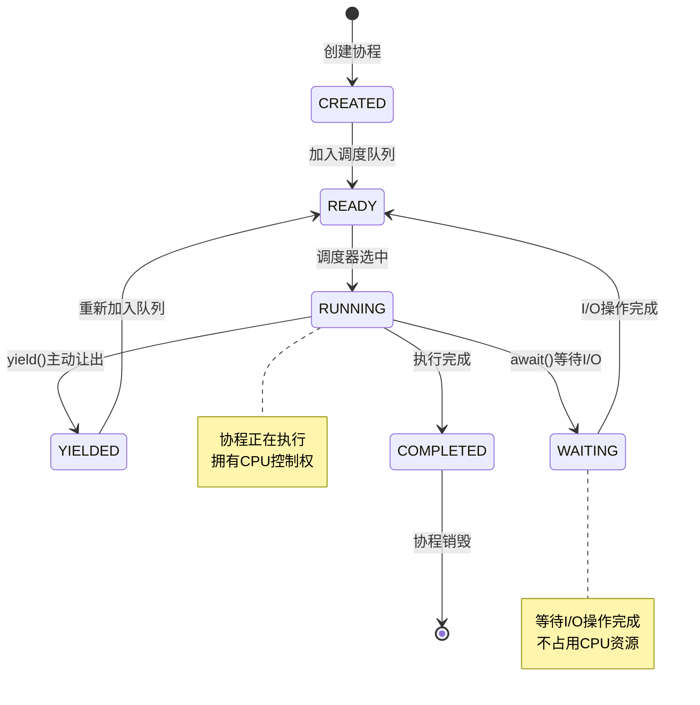

## 3. 协程实现"多任务"的设计思想

### 3.1 并发 vs 并行的概念区分

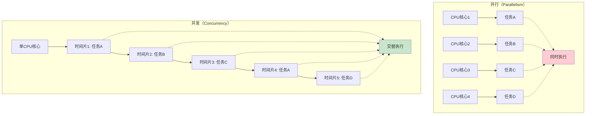

### 3.2 协程多任务实现机制

#### 3.2.1 任务调度器设计

```java
public class CoroutineScheduler {
    private final Queue<Coroutine> readyQueue = new LinkedList<>();
    private final Set<Coroutine> waitingSet = new HashSet<>();
    private Coroutine currentCoroutine;
    
    // 事件循环：单线程多任务的核心
    public void eventLoop() {
        while (!readyQueue.isEmpty() || !waitingSet.isEmpty()) {
            // 1. 处理就绪的协程
            if (!readyQueue.isEmpty()) {
                currentCoroutine = readyQueue.poll();
                currentCoroutine.resume();
            }
            
            // 2. 检查等待中的I/O操作
            checkIOCompletion();
            
            // 3. 处理定时器事件
            processTimerEvents();
            
            // 4. 如果没有就绪任务，等待I/O事件
            if (readyQueue.isEmpty()) {
                waitForIOEvents();
            }
        }
    }
    
    // 协程主动让出时的调度逻辑
    public void yield(Coroutine coroutine) {
        if (coroutine.getState() == CoroutineState.YIELDED) {
            readyQueue.offer(coroutine);
        } else if (coroutine.getState() == CoroutineState.WAITING) {
            waitingSet.add(coroutine);
        }
        // 继续事件循环，执行下一个任务
    }
}
```

#### 3.2.2 多任务执行时序图

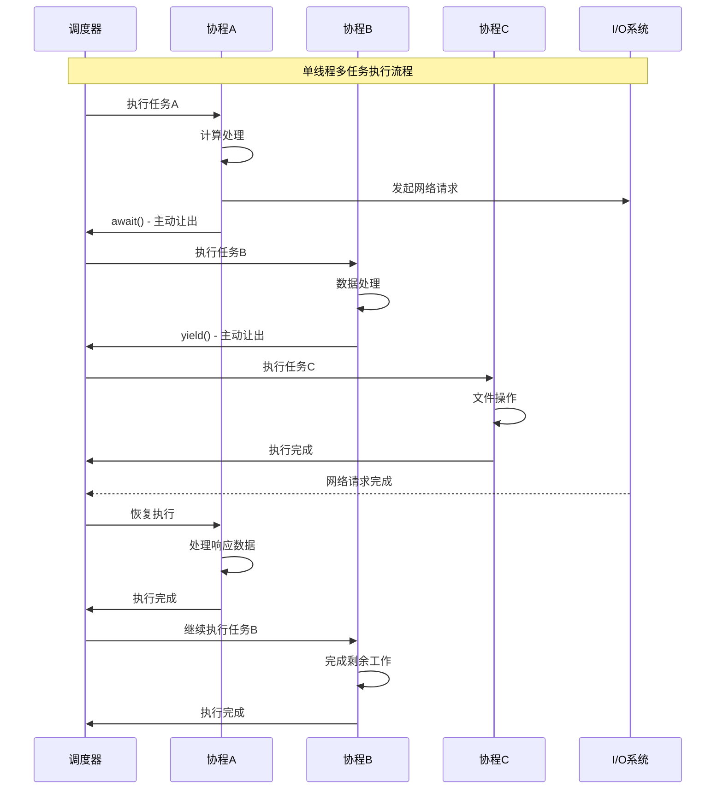

### 3.3 协程栈管理

#### 3.3.1 栈切换机制

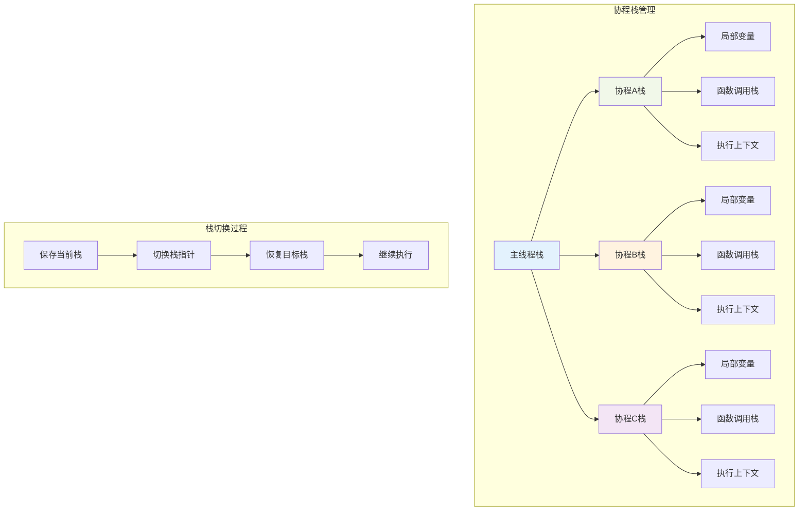

#### 3.3.2 栈内存优化

```java
public class CoroutineStack {
    private static final int DEFAULT_STACK_SIZE = 64 * 1024; // 64KB
    private static final Stack<CoroutineStack> stackPool = new Stack<>();
    
    private byte[] stackMemory;
    private int stackPointer;
    private boolean inUse;
    
    // 栈池化管理，减少内存分配
    public static CoroutineStack allocate() {
        synchronized (stackPool) {
            if (!stackPool.isEmpty()) {
                CoroutineStack stack = stackPool.pop();
                stack.reset();
                return stack;
            }
        }
        return new CoroutineStack(DEFAULT_STACK_SIZE);
    }
    
    public static void deallocate(CoroutineStack stack) {
        synchronized (stackPool) {
            if (stackPool.size() < MAX_POOL_SIZE) {
                stack.inUse = false;
                stackPool.push(stack);
            }
        }
    }
    
    // 栈上下文保存和恢复
    public void saveContext(CoroutineContext context) {
        context.stackPointer = this.stackPointer;
        context.registers = getCurrentRegisters();
    }
    
    public void restoreContext(CoroutineContext context) {
        this.stackPointer = context.stackPointer;
        setCurrentRegisters(context.registers);
    }
}
```

## 4. 单线程处理多请求的设计原理

### 4.1 请求处理架构

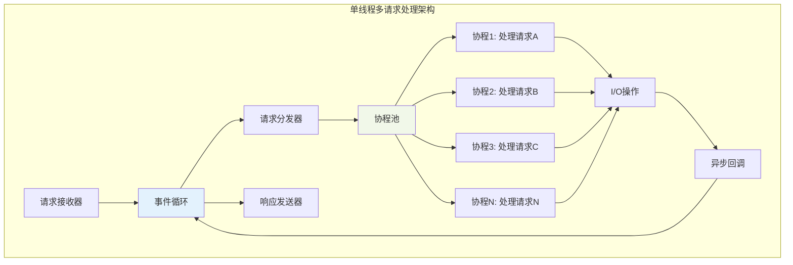

### 4.2 请求顺序保证机制

#### 4.2.1 FIFO队列保证

```java
public class RequestProcessor {
    private final Queue<Request> requestQueue = new ConcurrentLinkedQueue<>();
    private final Map<String, Queue<Request>> sessionQueues = new ConcurrentHashMap<>();
    
    // 全局请求顺序保证
    public void processRequest(Request request) {
        requestQueue.offer(request);
        wakeupEventLoop();
    }
    
    // 会话级别顺序保证
    public void processSessionRequest(Request request) {
        String sessionId = request.getSessionId();
        sessionQueues.computeIfAbsent(sessionId, k -> new LinkedList<>())
                    .offer(request);
        wakeupEventLoop();
    }
    
    // 事件循环中的顺序处理
    public void eventLoop() {
        while (running) {
            // 1. 处理全局队列（FIFO顺序）
            Request globalRequest = requestQueue.poll();
            if (globalRequest != null) {
                processInCoroutine(globalRequest);
            }
            
            // 2. 处理会话队列（每个会话内部FIFO）
            for (Queue<Request> sessionQueue : sessionQueues.values()) {
                Request sessionRequest = sessionQueue.poll();
                if (sessionRequest != null) {
                    processInCoroutine(sessionRequest);
                    break; // 轮询处理，保证公平性
                }
            }
            
            // 3. 处理I/O完成事件
            processIOCompletion();
        }
    }
}
```

#### 4.2.2 优先级队列设计

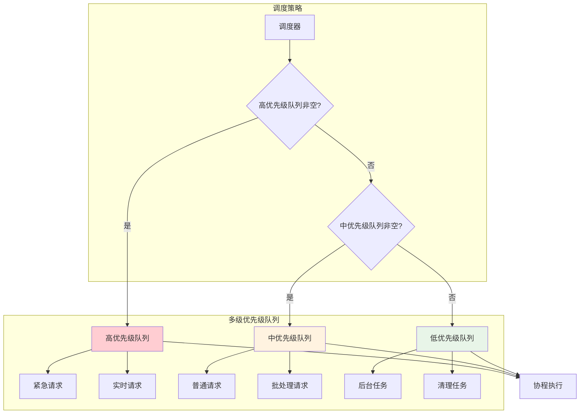

### 4.3 并发请求处理策略

```java
public class ConcurrentRequestHandler {
    private final CoroutineScheduler scheduler;
    private final Map<String, RequestContext> activeRequests = new ConcurrentHashMap<>();
    
    // 并发处理多个请求
    public void handleRequest(Request request) {
        String requestId = request.getId();
        RequestContext context = new RequestContext(request);
        activeRequests.put(requestId, context);
        
        // 创建协程处理请求
        Coroutine coroutine = new Coroutine() {
            @Override
            public void run() {
                try {
                    // 业务逻辑处理
                    processBusinessLogic(request);
                    
                    // 可能的I/O操作
                    if (needDatabaseAccess(request)) {
                        DatabaseResult result = await(database.queryAsync(request.getQuery()));
                        request.setDatabaseResult(result);
                    }
                    
                    if (needNetworkCall(request)) {
                        NetworkResponse response = await(httpClient.getAsync(request.getUrl()));
                        request.setNetworkResponse(response);
                    }
                    
                    // 生成响应
                    Response response = generateResponse(request);
                    sendResponse(response);
                    
                } finally {
                    activeRequests.remove(requestId);
                }
            }
        };
        
        scheduler.schedule(coroutine);
    }
    
    // 请求取消处理
    public void cancelRequest(String requestId) {
        RequestContext context = activeRequests.get(requestId);
        if (context != null) {
            context.cancel();
            activeRequests.remove(requestId);
        }
    }
}
```

## 5. 事件循环机制设计

### 5.1 事件循环核心架构

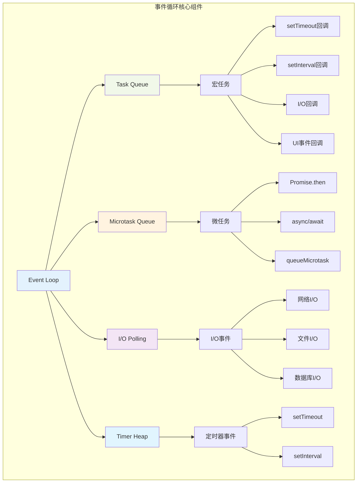

### 5.2 事件循环执行流程

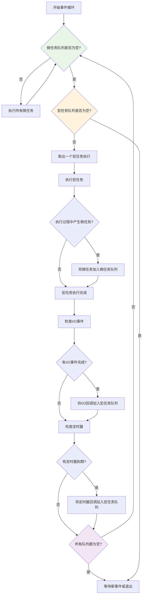

### 5.3 I/O等待时间利用机制

#### 5.3.1 非阻塞I/O设计

```java
public class NonBlockingIOManager {
    private final Selector selector;
    private final Map<SelectionKey, IOCallback> callbacks = new HashMap<>();
    
    // 注册非阻塞I/O操作
    public Future<ByteBuffer> readAsync(SocketChannel channel) {
        CompletableFuture<ByteBuffer> future = new CompletableFuture<>();
        
        try {
            channel.configureBlocking(false);
            SelectionKey key = channel.register(selector, SelectionKey.OP_READ);
            
            callbacks.put(key, new IOCallback() {
                @Override
                public void onReady(SelectionKey key) {
                    try {
                        ByteBuffer buffer = ByteBuffer.allocate(1024);
                        int bytesRead = channel.read(buffer);
                        buffer.flip();
                        future.complete(buffer);
                    } catch (IOException e) {
                        future.completeExceptionally(e);
                    }
                }
            });
        } catch (IOException e) {
            future.completeExceptionally(e);
        }
        
        return future;
    }
    
    // I/O事件轮询
    public void pollIOEvents(long timeoutMs) {
        try {
            int readyChannels = selector.select(timeoutMs);
            if (readyChannels > 0) {
                Set<SelectionKey> selectedKeys = selector.selectedKeys();
                for (SelectionKey key : selectedKeys) {
                    IOCallback callback = callbacks.get(key);
                    if (callback != null) {
                        callback.onReady(key);
                        callbacks.remove(key);
                    }
                }
                selectedKeys.clear();
            }
        } catch (IOException e) {
            // 处理I/O异常
        }
    }
}
```

#### 5.3.2 I/O时间利用效率分析

```mermaid
gantt
    title I/O等待时间利用对比
    dateFormat X
    axisFormat %s
    
    section 传统阻塞模型
    线程1执行    :active, t1, 0, 1
    线程1等待I/O :crit, t1-io, 1, 4
    线程1继续执行 :active, t1-cont, 4, 5
    线程2执行    :active, t2, 0, 2
    线程2等待I/O :crit, t2-io, 2, 6
    线程2继续执行 :active, t2-cont, 6, 7
    
    section 单线程异步模型
    任务1执行    :active, a1, 0, 1
    任务2执行    :active, a2, 1, 2
    任务3执行    :active, a3, 2, 3
    任务1恢复    :active, a1-resume, 4, 5
    任务2恢复    :active, a2-resume, 5, 6
    任务3恢复    :active, a3-resume, 6, 7
```

## 6. 跨语言单线程模型对比分析

### 6.1 不同语言的实现方式

#### 6.1.1 JavaScript (Node.js)

```javascript
// JavaScript事件循环模型
class EventLoop {
    constructor() {
        this.macroTaskQueue = [];
        this.microTaskQueue = [];
        this.running = false;
    }
    
    // 添加宏任务
    setTimeout(callback, delay) {
        const task = {
            callback,
            executeTime: Date.now() + delay
        };
        this.macroTaskQueue.push(task);
        this.wakeup();
    }
    
    // 添加微任务
    queueMicrotask(callback) {
        this.microTaskQueue.push(callback);
    }
    
    // 事件循环主逻辑
    run() {
        this.running = true;
        while (this.running) {
            // 1. 执行所有微任务
            while (this.microTaskQueue.length > 0) {
                const microtask = this.microTaskQueue.shift();
                microtask();
            }
            
            // 2. 执行一个宏任务
            if (this.macroTaskQueue.length > 0) {
                const now = Date.now();
                const task = this.macroTaskQueue.find(t => t.executeTime <= now);
                if (task) {
                    this.macroTaskQueue.splice(this.macroTaskQueue.indexOf(task), 1);
                    task.callback();
                }
            }
            
            // 3. 检查I/O事件
            this.pollIOEvents();
        }
    }
}
```

#### 6.1.2 Python (asyncio)

```python
import asyncio
import heapq
from typing import Any, Callable, Optional

class AsyncEventLoop:
    def __init__(self):
        self.ready_queue = []
        self.scheduled_tasks = []  # 最小堆，按时间排序
        self.io_selector = selectors.DefaultSelector()
        self.running = False
    
    async def sleep(self, delay: float):
        """异步睡眠，不阻塞事件循环"""
        future = asyncio.Future()
        self.call_later(delay, future.set_result, None)
        return await future
    
    def call_later(self, delay: float, callback: Callable, *args):
        """延时调用"""
        when = time.time() + delay
        task = (when, callback, args)
        heapq.heappush(self.scheduled_tasks, task)
    
    def call_soon(self, callback: Callable, *args):
        """立即调用"""
        self.ready_queue.append((callback, args))
    
    def run_forever(self):
        """事件循环主逻辑"""
        self.running = True
        while self.running:
            # 1. 执行就绪任务
            while self.ready_queue:
                callback, args = self.ready_queue.popleft()
                callback(*args)
            
            # 2. 处理定时任务
            now = time.time()
            while self.scheduled_tasks and self.scheduled_tasks[0][0] <= now:
                when, callback, args = heapq.heappop(self.scheduled_tasks)
                callback(*args)
            
            # 3. 等待I/O事件
            timeout = self._calculate_timeout()
            events = self.io_selector.select(timeout)
            for key, mask in events:
                callback = key.data
                callback(key.fileobj, mask)
```

#### 6.1.3 Go (Goroutine)

```go
package main

import (
    "context"
    "runtime"
    "sync"
    "time"
)

// Go的协程调度器简化模型
type GoroutineScheduler struct {
    runQueue    chan *Goroutine
    ioWaitQueue map[int]*Goroutine
    timerHeap   []*TimerEvent
    mu          sync.Mutex
}

type Goroutine struct {
    id       int
    stack    []byte
    state    GoroutineState
    function func()
}

type GoroutineState int

const (
    GoroutineReady GoroutineState = iota
    GoroutineRunning
    GoroutineWaiting
    GoroutineDead
)

func (s *GoroutineScheduler) Schedule() {
    for {
        select {
        case g := <-s.runQueue:
            // 执行协程
            s.runGoroutine(g)
            
        case <-time.After(10 * time.Millisecond):
            // 检查定时器和I/O事件
            s.checkTimers()
            s.checkIOEvents()
        }
    }
}

func (s *GoroutineScheduler) runGoroutine(g *Goroutine) {
    g.state = GoroutineRunning
    
    // 设置协程栈
    runtime.SetStack(g.stack)
    
    // 执行协程函数
    g.function()
    
    g.state = GoroutineDead
}

// 协程主动让出
func Yield() {
    // 保存当前协程状态
    currentGoroutine := getCurrentGoroutine()
    currentGoroutine.state = GoroutineReady
    
    // 切换回调度器
    scheduler.runQueue <- currentGoroutine
    runtime.Gosched()
}
```

### 6.2 共同设计思想分析

#### 6.2.1 核心设计模式

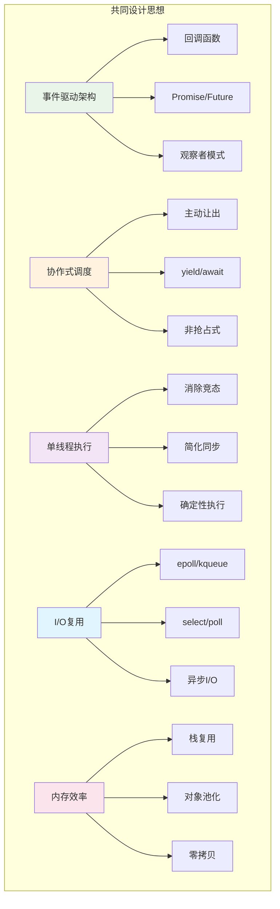

#### 6.2.2 实现策略对比

| 特性 | JavaScript | Python | Go | Rust | 设计理念 |
|------|------------|--------|----|----- |----------|
| **协程实现** | 基于Promise | async/await | goroutine | async/await | 语法糖简化异步编程 |
| **调度策略** | 事件循环 | 事件循环 | M:N调度 | 事件循环 | 协作式调度避免竞争 |
| **I/O模型** | libuv | asyncio | netpoller | tokio | 非阻塞I/O最大化吞吐 |
| **内存管理** | V8 GC | 引用计数+GC | GC | 所有权系统 | 自动内存管理减少错误 |
| **错误处理** | try/catch | try/except | panic/recover | Result<T,E> | 统一错误处理机制 |

### 6.3 性能特征分析

#### 6.3.1 吞吐量对比

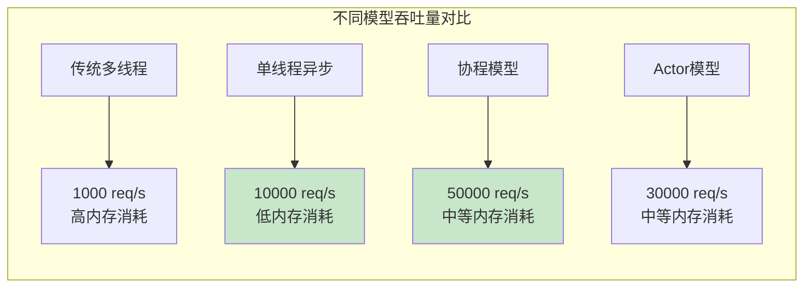

#### 6.3.2 延迟特征

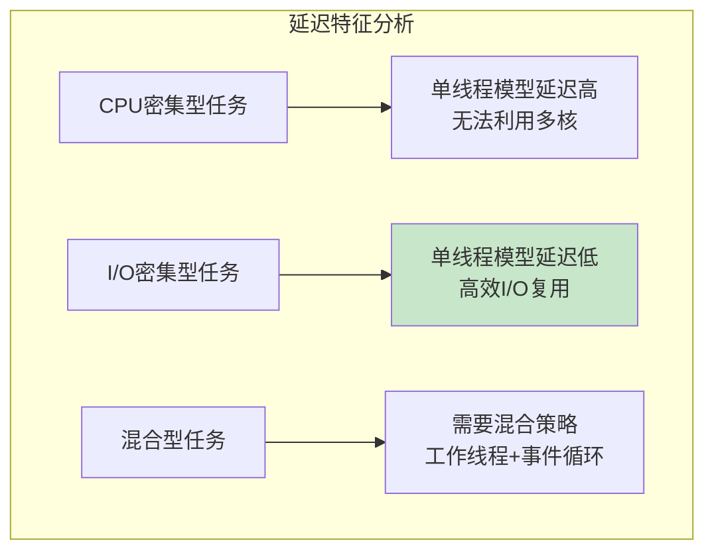

## 7. 高级优化技术

### 7.1 协程池化管理

```java
public class CoroutinePool {
    private final Queue<Coroutine> availableCoroutines = new ConcurrentLinkedQueue<>();
    private final Set<Coroutine> activeCoroutines = ConcurrentHashMap.newKeySet();
    private final int maxPoolSize;
    private final AtomicInteger currentSize = new AtomicInteger(0);
    
    public CoroutinePool(int maxPoolSize) {
        this.maxPoolSize = maxPoolSize;
        // 预创建一些协程
        for (int i = 0; i < Math.min(10, maxPoolSize); i++) {
            availableCoroutines.offer(createCoroutine());
            currentSize.incrementAndGet();
        }
    }
    
    public Coroutine acquire() {
        Coroutine coroutine = availableCoroutines.poll();
        if (coroutine == null && currentSize.get() < maxPoolSize) {
            coroutine = createCoroutine();
            currentSize.incrementAndGet();
        }
        
        if (coroutine != null) {
            activeCoroutines.add(coroutine);
            coroutine.reset(); // 重置协程状态
        }
        
        return coroutine;
    }
    
    public void release(Coroutine coroutine) {
        if (activeCoroutines.remove(coroutine)) {
            coroutine.cleanup(); // 清理协程资源
            availableCoroutines.offer(coroutine);
        }
    }
    
    private Coroutine createCoroutine() {
        return new PooledCoroutine(this);
    }
}
```

### 7.2 智能负载均衡

```java
public class LoadBalancedScheduler {
    private final List<CoroutineScheduler> schedulers;
    private final AtomicInteger roundRobinIndex = new AtomicInteger(0);
    private final LoadBalanceStrategy strategy;
    
    public enum LoadBalanceStrategy {
        ROUND_ROBIN,    // 轮询
        LEAST_LOADED,   // 最少负载
        WEIGHTED,       // 权重分配
        ADAPTIVE        // 自适应
    }
    
    public void scheduleTask(Runnable task) {
        CoroutineScheduler scheduler = selectScheduler();
        scheduler.schedule(new TaskCoroutine(task));
    }
    
    private CoroutineScheduler selectScheduler() {
        switch (strategy) {
            case ROUND_ROBIN:
                return roundRobinSelect();
            case LEAST_LOADED:
                return leastLoadedSelect();
            case WEIGHTED:
                return weightedSelect();
            case ADAPTIVE:
                return adaptiveSelect();
            default:
                return schedulers.get(0);
        }
    }
    
    private CoroutineScheduler leastLoadedSelect() {
        return schedulers.stream()
            .min(Comparator.comparingInt(CoroutineScheduler::getActiveTaskCount))
            .orElse(schedulers.get(0));
    }
    
    private CoroutineScheduler adaptiveSelect() {
        // 基于历史性能数据的自适应选择
        return schedulers.stream()
            .min(Comparator.comparingDouble(this::calculateScore))
            .orElse(schedulers.get(0));
    }
    
    private double calculateScore(CoroutineScheduler scheduler) {
        double loadFactor = scheduler.getActiveTaskCount() / (double) scheduler.getMaxCapacity();
        double avgResponseTime = scheduler.getAverageResponseTime();
        double errorRate = scheduler.getErrorRate();
        
        // 综合评分：负载 + 响应时间 + 错误率
        return loadFactor * 0.4 + avgResponseTime * 0.4 + errorRate * 0.2;
    }
}
```

### 7.3 内存优化策略

#### 7.3.1 对象池化

```java
public class ObjectPoolManager {
    private final Map<Class<?>, ObjectPool<?>> pools = new ConcurrentHashMap<>();
    
    @SuppressWarnings("unchecked")
    public <T> T acquire(Class<T> clazz) {
        ObjectPool<T> pool = (ObjectPool<T>) pools.computeIfAbsent(clazz, 
            k -> new ObjectPool<>(clazz, 100));
        return pool.acquire();
    }
    
    public <T> void release(T object) {
        ObjectPool<T> pool = (ObjectPool<T>) pools.get(object.getClass());
        if (pool != null) {
            pool.release(object);
        }
    }
    
    private static class ObjectPool<T> {
        private final Queue<T> available = new ConcurrentLinkedQueue<>();
        private final Class<T> clazz;
        private final int maxSize;
        private final AtomicInteger currentSize = new AtomicInteger(0);
        
        public ObjectPool(Class<T> clazz, int maxSize) {
            this.clazz = clazz;
            this.maxSize = maxSize;
        }
        
        public T acquire() {
            T object = available.poll();
            if (object == null) {
                try {
                    object = clazz.getDeclaredConstructor().newInstance();
                } catch (Exception e) {
                    throw new RuntimeException("Failed to create object", e);
                }
            }
            return object;
        }
        
        public void release(T object) {
            if (currentSize.get() < maxSize) {
                // 重置对象状态
                resetObject(object);
                available.offer(object);
                currentSize.incrementAndGet();
            }
        }
        
        private void resetObject(T object) {
            // 通过反射或接口重置对象状态
            if (object instanceof Resettable) {
                ((Resettable) object).reset();
            }
        }
    }
}
```

#### 7.3.2 零拷贝优化

```java
public class ZeroCopyBuffer {
    private ByteBuffer directBuffer;
    private final int capacity;
    
    public ZeroCopyBuffer(int capacity) {
        this.capacity = capacity;
        this.directBuffer = ByteBuffer.allocateDirect(capacity);
    }
    
    // 零拷贝文件传输
    public long transferTo(FileChannel source, WritableByteChannel target) throws IOException {
        return source.transferTo(0, source.size(), target);
    }
    
    // 内存映射文件读取
    public MappedByteBuffer mapFile(FileChannel channel, long position, long size) throws IOException {
        return channel.map(FileChannel.MapMode.READ_ONLY, position, size);
    }
    
    // 直接内存操作
    public void writeDirectly(byte[] data) {
        directBuffer.clear();
        directBuffer.put(data);
        directBuffer.flip();
    }
    
    public byte[] readDirectly() {
        byte[] data = new byte[directBuffer.remaining()];
        directBuffer.get(data);
        return data;
    }
}
```

## 8. 性能监控与调优

### 8.1 性能指标监控

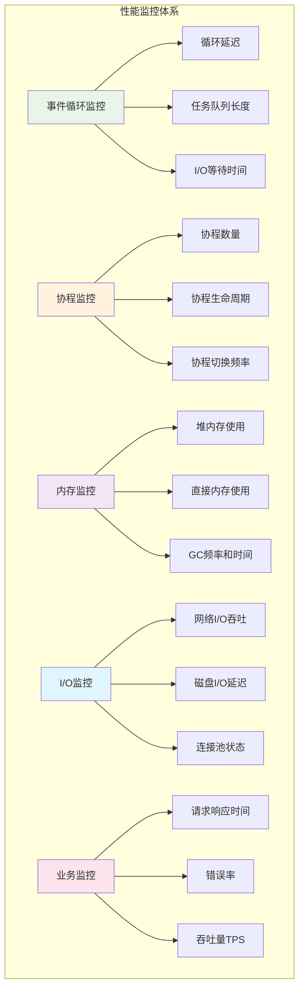

### 8.2 性能调优策略

```java
public class PerformanceTuner {
    private final MetricsCollector metrics;
    private final ConfigurationManager config;
    
    // 自适应调优
    public void autoTune() {
        PerformanceMetrics current = metrics.getCurrentMetrics();
        
        // 1. 事件循环调优
        tuneEventLoop(current);
        
        // 2. 协程池调优
        tuneCoroutinePool(current);
        
        // 3. I/O参数调优
        tuneIOParameters(current);
        
        // 4. 内存参数调优
        tuneMemoryParameters(current);
    }
    
    private void tuneEventLoop(PerformanceMetrics metrics) {
        double avgLoopDelay = metrics.getAverageLoopDelay();
        int queueLength = metrics.getTaskQueueLength();
        
        if (avgLoopDelay > 10.0) { // 10ms延迟阈值
            // 增加工作线程处理CPU密集型任务
            config.setWorkerThreadCount(config.getWorkerThreadCount() + 1);
        }
        
        if (queueLength > 1000) { // 队列长度阈值
            // 启用背压机制
            config.setBackpressureEnabled(true);
            config.setMaxQueueSize(queueLength * 2);
        }
    }
    
    private void tuneCoroutinePool(PerformanceMetrics metrics) {
        int activeCoroutines = metrics.getActiveCoroutineCount();
        int maxCoroutines = config.getMaxCoroutineCount();
        double utilizationRate = activeCoroutines / (double) maxCoroutines;
        
        if (utilizationRate > 0.8) {
            // 扩容协程池
            config.setMaxCoroutineCount((int) (maxCoroutines * 1.2));
        } else if (utilizationRate < 0.3) {
            // 缩容协程池
            config.setMaxCoroutineCount(Math.max(10, (int) (maxCoroutines * 0.8)));
        }
    }
}
```

## 9. 最佳实践与设计模式

### 9.1 错误处理最佳实践

```java
public class ErrorHandlingBestPractices {
    
    // 1. 统一错误处理
    public class GlobalErrorHandler {
        public void handleError(Throwable error, CoroutineContext context) {
            // 记录错误日志
            logger.error("Coroutine error in context: " + context, error);
            
            // 错误分类处理
            if (error instanceof TimeoutException) {
                handleTimeout(context);
            } else if (error instanceof IOException) {
                handleIOError(error, context);
            } else if (error instanceof OutOfMemoryError) {
                handleOOMError(context);
            } else {
                handleGenericError(error, context);
            }
            
            // 错误恢复
            attemptRecovery(context);
        }
        
        private void handleTimeout(CoroutineContext context) {
            // 超时处理：重试或降级
            if (context.getRetryCount() < MAX_RETRY) {
                context.incrementRetry();
                scheduler.scheduleWithDelay(context.getCoroutine(), RETRY_DELAY);
            } else {
                // 降级处理
                context.setResult(getDefaultResult());
            }
        }
    }
    
    // 2. 优雅降级
    public class GracefulDegradation {
        public <T> T executeWithFallback(Supplier<T> primary, Supplier<T> fallback) {
            try {
                return primary.get();
            } catch (Exception e) {
                logger.warn("Primary execution failed, using fallback", e);
                return fallback.get();
            }
        }
        
        public <T> CompletableFuture<T> executeAsyncWithFallback(
                Supplier<CompletableFuture<T>> primary,
                Supplier<T> fallback,
                Duration timeout) {
            
            return primary.get()
                .orTimeout(timeout.toMillis(), TimeUnit.MILLISECONDS)
                .exceptionally(throwable -> {
                    logger.warn("Async execution failed, using fallback", throwable);
                    return fallback.get();
                });
        }
    }
}
```

### 9.2 资源管理模式

```java
public class ResourceManagementPatterns {
    
    // 1. 资源池模式
    public class ResourcePool<T extends AutoCloseable> {
        private final Queue<T> available = new ConcurrentLinkedQueue<>();
        private final Set<T> inUse = ConcurrentHashMap.newKeySet();
        private final Supplier<T> factory;
        private final int maxSize;
        
        public ResourcePool(Supplier<T> factory, int maxSize) {
            this.factory = factory;
            this.maxSize = maxSize;
        }
        
        public T acquire() throws Exception {
            T resource = available.poll();
            if (resource == null && getTotalSize() < maxSize) {
                resource = factory.get();
            }
            
            if (resource != null) {
                inUse.add(resource);
            }
            
            return resource;
        }
        
        public void release(T resource) {
            if (inUse.remove(resource)) {
                if (isHealthy(resource)) {
                    available.offer(resource);
                } else {
                    closeQuietly(resource);
                }
            }
        }
        
        private int getTotalSize() {
            return available.size() + inUse.size();
        }
        
        private boolean isHealthy(T resource) {
            // 检查资源健康状态
            return true; // 简化实现
        }
    }
    
    // 2. 自动资源管理
    public class AutoResourceManager {
        public <T extends AutoCloseable, R> R withResource(
                Supplier<T> resourceSupplier,
                Function<T, R> operation) throws Exception {
            
            try (T resource = resourceSupplier.get()) {
                return operation.apply(resource);
            }
        }
        
        public <T extends AutoCloseable> CompletableFuture<Void> withResourceAsync(
                Supplier<T> resourceSupplier,
                Consumer<T> operation) {
            
            return CompletableFuture.runAsync(() -> {
                try (T resource = resourceSupplier.get()) {
                    operation.accept(resource);
                } catch (Exception e) {
                    throw new RuntimeException(e);
                }
            });
        }
    }
}
```

## 10. 总结与展望

### 10.1 单线程模型的核心价值

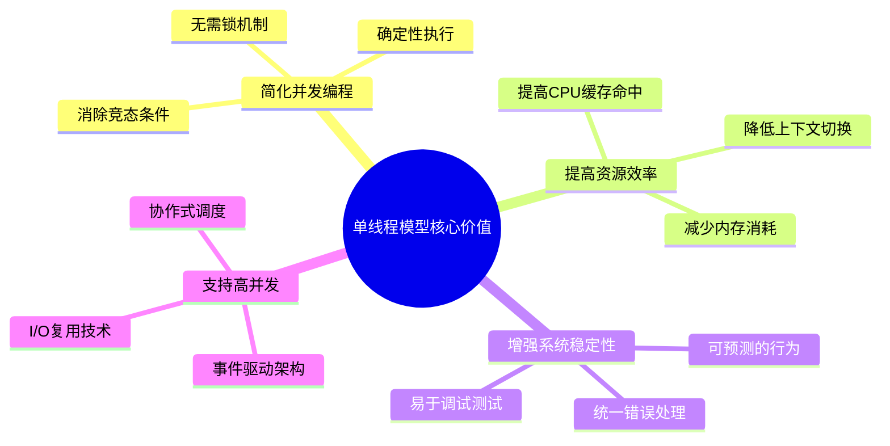

### 10.2 设计思想总结

单线程模型的设计思想体现了以下核心理念：

1. **协作优于竞争**: 通过协作式调度避免线程间的资源竞争
2. **事件驱动优于轮询**: 基于事件的响应式编程模型
3. **异步优于同步**: 非阻塞I/O最大化系统吞吐量
4. **简单优于复杂**: 单线程执行模型简化了并发编程的复杂性

### 10.3 适用场景分析

| 场景类型 | 适用性 | 原因 | 注意事项 |
|----------|--------|------|----------|
| **I/O密集型** | ⭐⭐⭐⭐⭐ | 高效的I/O复用，低资源消耗 | 避免阻塞操作 |
| **网络服务** | ⭐⭐⭐⭐⭐ | 高并发连接处理能力 | 需要负载均衡 |
| **实时系统** | ⭐⭐⭐⭐ | 可预测的响应时间 | 避免长时间计算 |
| **CPU密集型** | ⭐⭐ | 无法利用多核优势 | 需要工作线程池 |
| **混合负载** | ⭐⭐⭐ | 需要混合架构设计 | 合理任务分离 |

### 10.4 未来发展趋势

1. **更智能的调度**: 基于机器学习的自适应调度算法
2. **更好的工具支持**: 可视化调试和性能分析工具
3. **更强的类型安全**: 编译时协程安全检查
4. **更广泛的应用**: 从服务端扩展到客户端和嵌入式系统

单线程模型作为现代高性能系统的重要架构选择，其设计思想和实现技术将继续演进，为构建高效、可靠的并发系统提供强有力的支持。