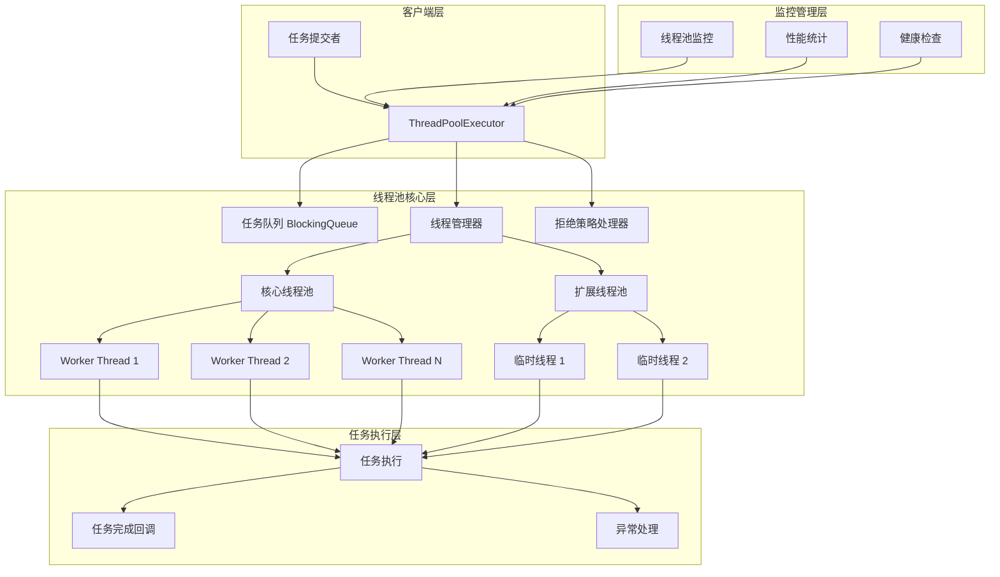
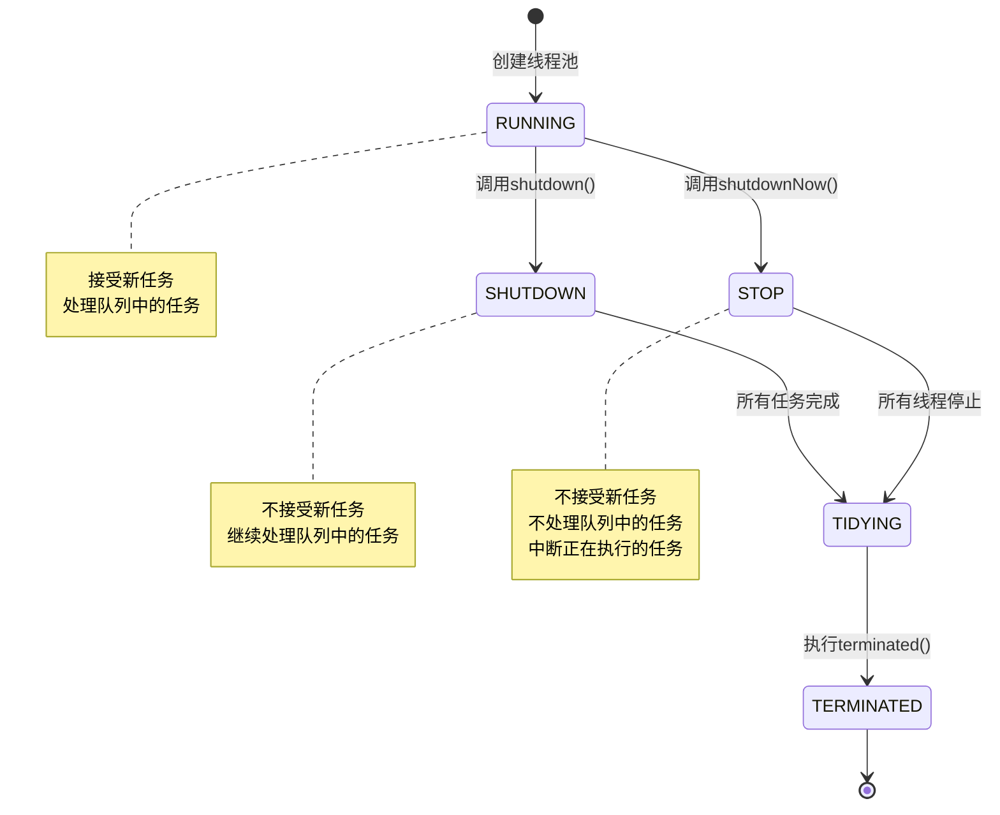
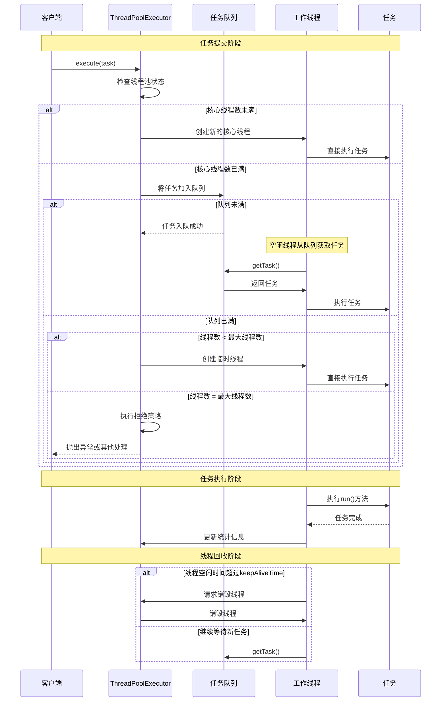
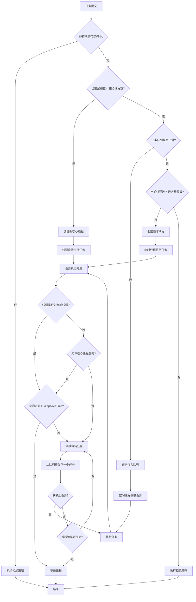
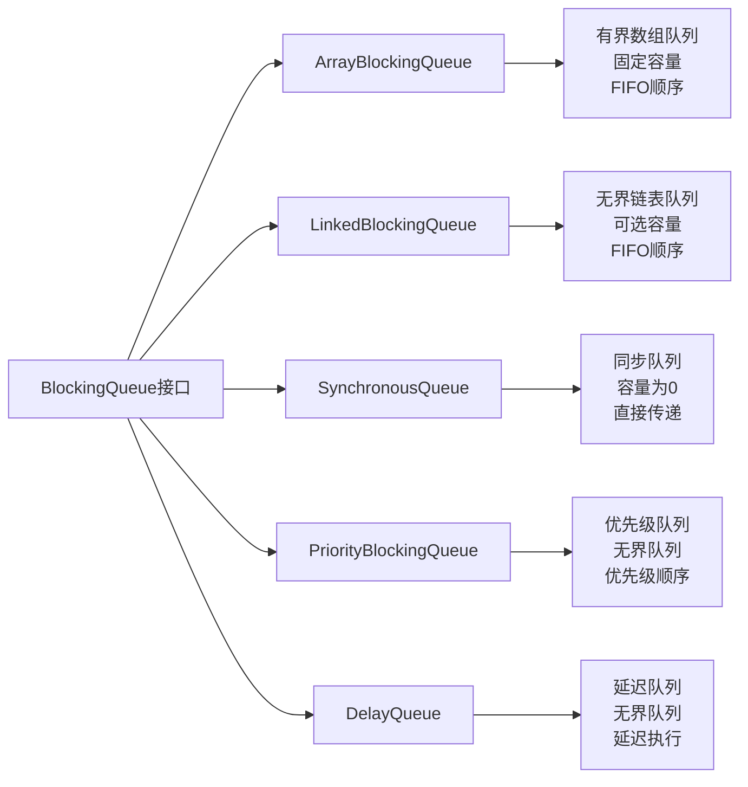
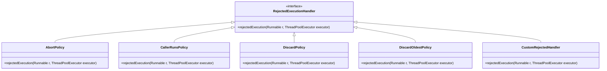
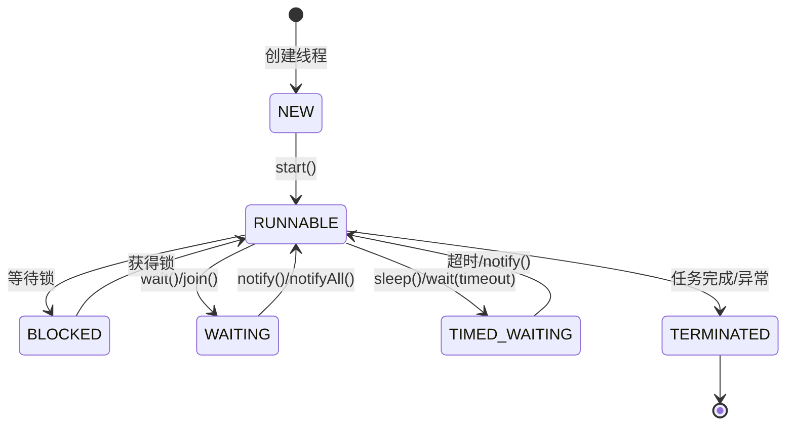
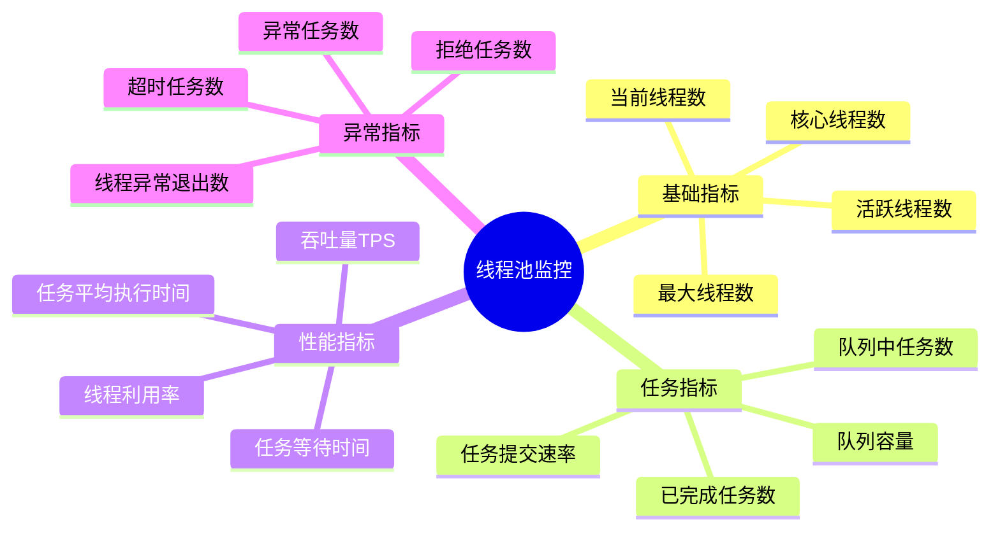
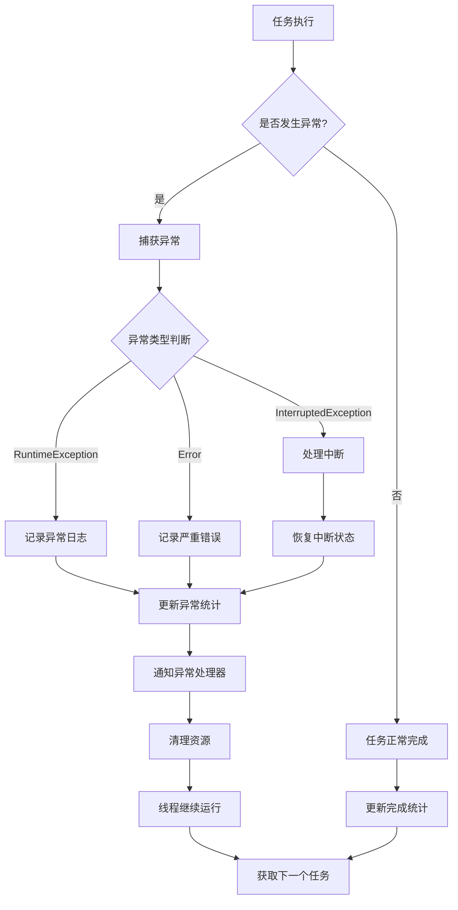
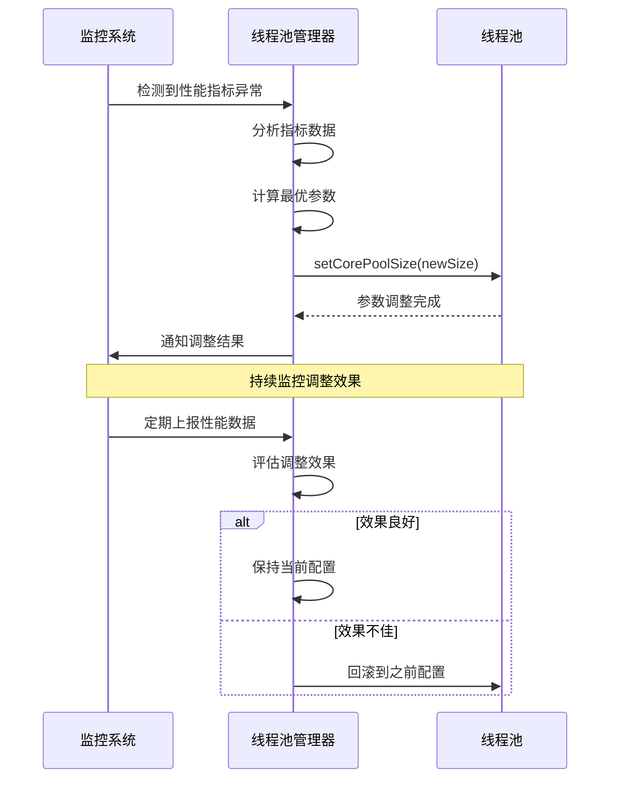

# 线程池技术设计方案

## 1. 概述

### 1.1 背景
在现代多线程应用程序中，频繁创建和销毁线程会带来巨大的性能开销。线程池作为一种重要的并发编程技术，通过预先创建一定数量的线程并重复使用它们来执行任务，有效解决了线程创建销毁的性能问题，提高了系统的响应速度和资源利用率。

### 1.2 设计目标
- **性能优化**: 减少线程创建和销毁的开销
- **资源控制**: 限制并发线程数量，防止系统资源耗尽
- **任务管理**: 提供灵活的任务提交和执行机制
- **可扩展性**: 支持动态调整线程池大小
- **可靠性**: 提供完善的异常处理和资源回收机制

## 2. 系统架构设计

### 2.1 整体架构图



### 2.2 核心组件说明

| 组件 | 职责 | 实现方式 |
|------|------|----------|
| ThreadPoolExecutor | 线程池主控制器 | 管理线程生命周期和任务调度 |
| BlockingQueue | 任务队列 | 存储待执行任务，支持阻塞操作 |
| Worker Thread | 工作线程 | 从队列获取并执行任务 |
| RejectedExecutionHandler | 拒绝策略 | 处理无法执行的任务 |
| ThreadFactory | 线程工厂 | 创建新线程 |

## 3. 线程池状态管理

### 3.1 线程池状态图



### 3.2 状态定义

| 状态 | 值 | 描述 |
|------|----|----- |
| RUNNING | -1 | 接受新任务并处理队列中的任务 |
| SHUTDOWN | 0 | 不接受新任务，但会处理队列中的任务 |
| STOP | 1 | 不接受新任务，不处理队列中的任务，并中断正在执行的任务 |
| TIDYING | 2 | 所有任务已终止，工作线程数为0 |
| TERMINATED | 3 | terminated()方法已完成 |

## 4. 任务执行流程设计

### 4.1 任务提交与执行时序图



### 4.2 详细执行流程图



## 5. 核心参数配置

### 5.1 关键参数说明

```java
public class ThreadPoolConfig {
    // 核心线程数：始终保持活跃的线程数量
    private int corePoolSize;
    
    // 最大线程数：线程池允许的最大线程数量
    private int maximumPoolSize;
    
    // 线程空闲时间：非核心线程的最大空闲时间
    private long keepAliveTime;
    
    // 时间单位
    private TimeUnit unit;
    
    // 任务队列：存储待执行任务的队列
    private BlockingQueue<Runnable> workQueue;
    
    // 线程工厂：用于创建新线程
    private ThreadFactory threadFactory;
    
    // 拒绝策略：当任务无法执行时的处理策略
    private RejectedExecutionHandler handler;
}
```

### 5.2 参数配置建议

| 应用场景 | 核心线程数 | 最大线程数 | 队列类型 | 队列大小 |
|----------|------------|------------|----------|----------|
| CPU密集型 | CPU核心数 | CPU核心数+1 | LinkedBlockingQueue | 无界 |
| IO密集型 | 2*CPU核心数 | 4*CPU核心数 | ArrayBlockingQueue | 1000-5000 |
| 混合型 | CPU核心数+1 | 2*CPU核心数 | LinkedBlockingQueue | 2000-10000 |
| 高并发短任务 | 10-50 | 100-200 | SynchronousQueue | 0 |

## 6. 任务队列设计

### 6.1 队列类型对比



### 6.2 队列选择策略

| 队列类型 | 适用场景 | 优点 | 缺点 |
|----------|----------|------|------|
| ArrayBlockingQueue | 有界缓冲，防止内存溢出 | 内存占用可控 | 容量固定，可能阻塞 |
| LinkedBlockingQueue | 高吞吐量场景 | 吞吐量高 | 可能导致内存溢出 |
| SynchronousQueue | 直接传递，快速响应 | 响应速度快 | 需要足够多的线程 |
| PriorityBlockingQueue | 任务有优先级要求 | 支持优先级 | 排序开销 |

## 7. 拒绝策略设计

### 7.1 拒绝策略类图



### 7.2 拒绝策略对比

| 策略 | 行为 | 适用场景 | 优缺点 |
|------|------|----------|--------|
| AbortPolicy | 抛出RejectedExecutionException | 需要感知任务被拒绝 | 默认策略，简单直接 |
| CallerRunsPolicy | 调用者线程执行任务 | 降低任务提交速度 | 提供降级机制，但可能阻塞调用者 |
| DiscardPolicy | 静默丢弃任务 | 任务丢失可接受 | 简单，但任务会丢失 |
| DiscardOldestPolicy | 丢弃最老的任务 | 新任务优先级更高 | 保证新任务执行，但老任务丢失 |

## 8. 线程管理机制

### 8.1 线程生命周期管理



### 8.2 Worker线程设计

```java
private final class Worker extends AbstractQueuedSynchronizer implements Runnable {
    final Thread thread;
    Runnable firstTask;
    volatile long completedTasks;
    
    Worker(Runnable firstTask) {
        setState(-1); // 禁止中断直到runWorker
        this.firstTask = firstTask;
        this.thread = getThreadFactory().newThread(this);
    }
    
    public void run() {
        runWorker(this);
    }
    
    // 其他方法...
}
```

## 9. 性能监控与调优

### 9.1 监控指标体系



### 9.2 性能调优策略

| 问题现象 | 可能原因 | 调优建议 |
|----------|----------|----------|
| CPU利用率低 | 线程数过少 | 增加核心线程数 |
| 内存占用高 | 队列积压严重 | 减少队列大小或增加线程数 |
| 响应时间长 | 任务排队等待 | 增加最大线程数或优化任务逻辑 |
| 频繁拒绝任务 | 线程池容量不足 | 调整线程数和队列大小 |
| 线程频繁创建销毁 | keepAliveTime过短 | 增加线程存活时间 |

## 10. 异常处理机制

### 10.1 异常处理流程



### 10.2 异常处理策略

```java
public class ThreadPoolExceptionHandler implements Thread.UncaughtExceptionHandler {
    @Override
    public void uncaughtException(Thread t, Throwable e) {
        // 记录异常日志
        logger.error("Thread {} threw exception", t.getName(), e);
        
        // 更新监控指标
        exceptionCounter.increment();
        
        // 通知监控系统
        alertManager.sendAlert("ThreadPool异常", e.getMessage());
        
        // 根据异常类型决定是否重启线程
        if (e instanceof OutOfMemoryError) {
            // 内存溢出，需要紧急处理
            emergencyShutdown();
        }
    }
}
```

## 11. 最佳实践与使用建议

### 11.1 线程池创建最佳实践

```java
public class ThreadPoolFactory {
    
    /**
     * 创建CPU密集型任务线程池
     */
    public static ThreadPoolExecutor createCpuIntensivePool() {
        int coreSize = Runtime.getRuntime().availableProcessors();
        return new ThreadPoolExecutor(
            coreSize,                           // 核心线程数
            coreSize + 1,                       // 最大线程数
            60L, TimeUnit.SECONDS,              // 空闲时间
            new LinkedBlockingQueue<>(),        // 无界队列
            new CustomThreadFactory("cpu-"),    // 线程工厂
            new ThreadPoolExecutor.AbortPolicy() // 拒绝策略
        );
    }
    
    /**
     * 创建IO密集型任务线程池
     */
    public static ThreadPoolExecutor createIoIntensivePool() {
        int coreSize = Runtime.getRuntime().availableProcessors() * 2;
        return new ThreadPoolExecutor(
            coreSize,                           // 核心线程数
            coreSize * 2,                       // 最大线程数
            60L, TimeUnit.SECONDS,              // 空闲时间
            new ArrayBlockingQueue<>(1000),     // 有界队列
            new CustomThreadFactory("io-"),     // 线程工厂
            new CallerRunsPolicy()              // 调用者执行策略
        );
    }
}
```

### 11.2 使用注意事项

1. **合理设置线程数量**
  - CPU密集型：线程数 = CPU核心数 + 1
  - IO密集型：线程数 = CPU核心数 × (1 + IO等待时间/CPU计算时间)

2. **选择合适的队列**
  - 有界队列：防止内存溢出，但可能导致任务被拒绝
  - 无界队列：不会拒绝任务，但可能导致内存溢出

3. **设置合理的拒绝策略**
  - 根据业务需求选择合适的拒绝策略
  - 可以自定义拒绝策略实现特殊需求

4. **及时关闭线程池**
  - 使用shutdown()优雅关闭
  - 使用shutdownNow()强制关闭
  - 使用awaitTermination()等待关闭完成

## 12. 扩展功能设计

### 12.1 动态调整功能



### 12.2 任务优先级支持

```java
public class PriorityTask implements Runnable, Comparable<PriorityTask> {
    private final int priority;
    private final Runnable task;
    
    public PriorityTask(Runnable task, int priority) {
        this.task = task;
        this.priority = priority;
    }
    
    @Override
    public void run() {
        task.run();
    }
    
    @Override
    public int compareTo(PriorityTask other) {
        return Integer.compare(other.priority, this.priority); // 高优先级优先
    }
}
```

## 13. 测试与验证

### 13.1 性能测试方案

```java
public class ThreadPoolPerformanceTest {
    
    @Test
    public void testThroughput() {
        ThreadPoolExecutor executor = createTestPool();
        int taskCount = 10000;
        CountDownLatch latch = new CountDownLatch(taskCount);
        
        long startTime = System.currentTimeMillis();
        
        for (int i = 0; i < taskCount; i++) {
            executor.execute(() -> {
                // 模拟任务执行
                doWork();
                latch.countDown();
            });
        }
        
        latch.await();
        long endTime = System.currentTimeMillis();
        
        double throughput = taskCount * 1000.0 / (endTime - startTime);
        System.out.println("吞吐量: " + throughput + " tasks/second");
    }
    
    @Test
    public void testLatency() {
        // 测试任务响应时间
    }
    
    @Test
    public void testResourceUsage() {
        // 测试资源使用情况
    }
}
```

### 13.2 压力测试场景

| 测试场景 | 测试目标 | 关键指标 |
|----------|----------|----------|
| 高并发提交 | 验证线程池稳定性 | TPS、响应时间、错误率 |
| 长时间运行 | 验证内存泄漏 | 内存使用量、GC频率 |
| 异常场景 | 验证异常处理 | 异常恢复时间、数据一致性 |
| 资源限制 | 验证资源控制 | CPU使用率、内存使用率 |

## 14. 总结

本线程池技术设计方案提供了完整的线程池实现架构，包括：

1. **完整的生命周期管理**: 从初始化到销毁的全过程控制
2. **灵活的任务调度机制**: 支持多种队列类型和拒绝策略
3. **完善的监控体系**: 提供全方位的性能监控和调优建议
4. **健壮的异常处理**: 确保系统在异常情况下的稳定性
5. **可扩展的设计**: 支持功能扩展和定制化需求

该方案可以作为高性能并发系统的核心组件，为应用程序提供稳定、高效的多线程执行环境。通过合理的参数配置和监控调优，能够显著提升系统的并发处理能力和资源利用效率。