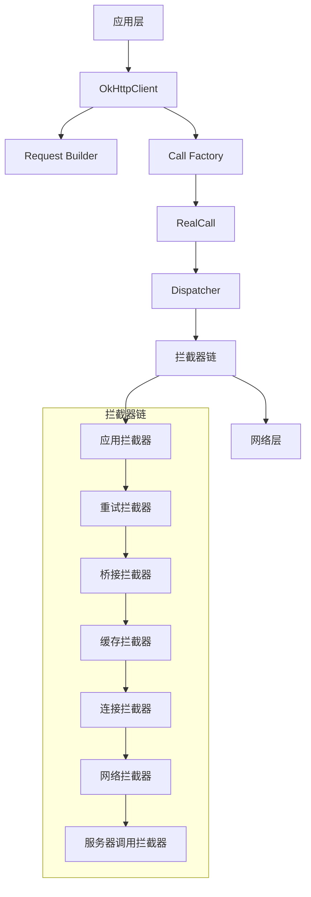
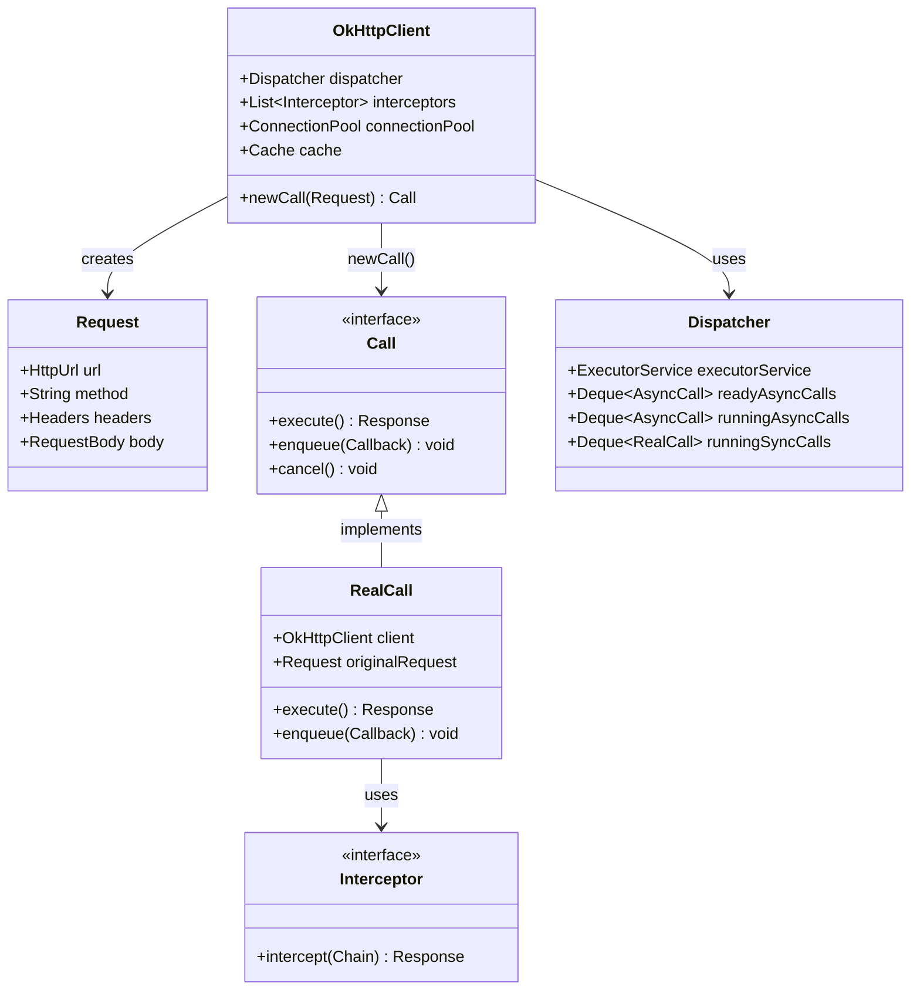
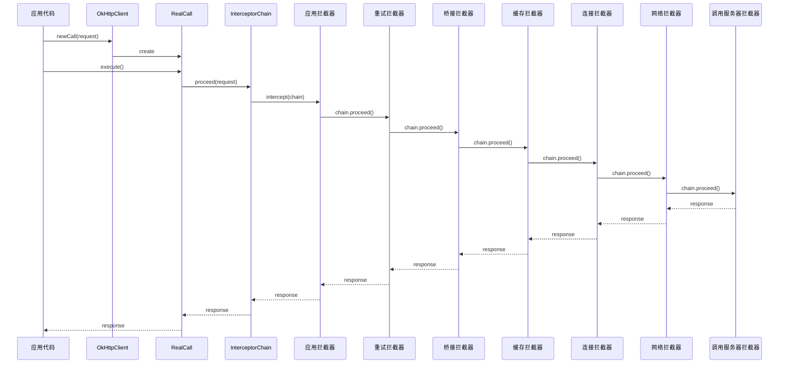
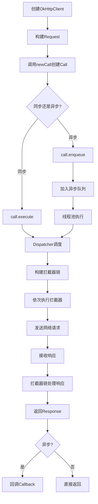
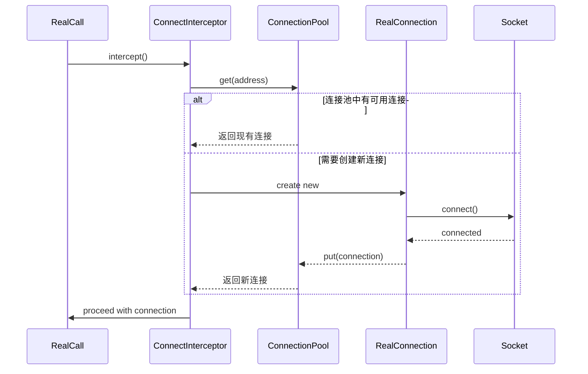
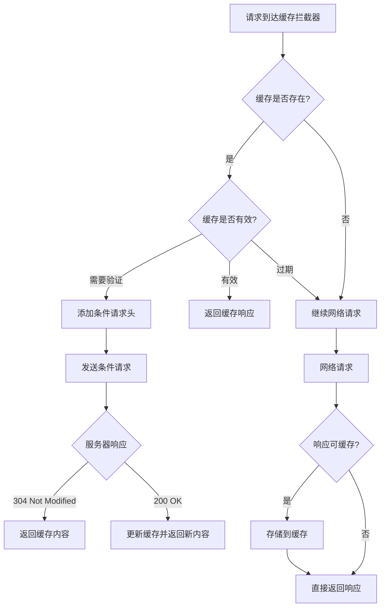
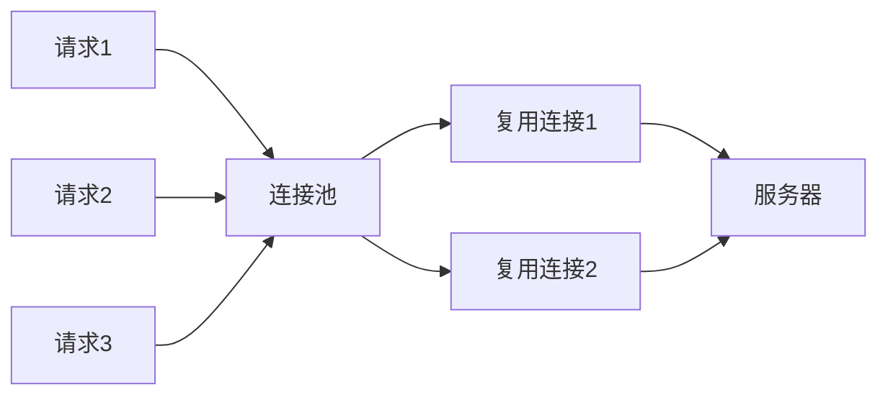

# 03.OkHttp网络请求设计
#### 目录介绍
- 01.整体概述介绍
  - 1.1 概述介绍
  - 1.2 核心特性说明
  - 1.3 技术架构概览
  - 1.4 问题思考
- 02.核心架构设计
  - 2.1 整体架构设计
  - 2.2 整体设计思路
  - 2.3 核心组件关系图
- 03.核心组件详解
  - 3.1 OkHttpClient
  - 3.2 Request请求封装


## 01.整体概述介绍

### 1.1 概述介绍

OkHttp是一个高效的HTTP客户端库，专为Android和Java应用程序设计。本技术方案基于OkHttpLib模块的源码分析，详细阐述了OkHttp的架构设计、核心组件、工作流程和技术特性。

### 1.2 核心特性说明

- **高效的HTTP/2支持**：完整支持HTTP/2协议，包括连接复用、服务器推送等特性
- **连接池管理**：自动管理连接池，减少连接建立的开销
- **透明的GZIP压缩**：自动处理响应压缩，减少网络传输量
- **响应缓存**：支持HTTP缓存，避免重复请求
- **请求/响应拦截**：灵活的拦截器机制，支持请求和响应的定制化处理
- **故障恢复**：自动重试机制，提高网络请求的可靠性

### 1.3 技术架构概览



### 1.4 问题思考

- OkHttp设计：OkHttp整体设计思路是什么样的？request和respond分别如何设计？如何设计call请求操作？
- OkHttp同步异步：如何设计同步和异步请求？同步操作做了什么？异步操作如何处理逻辑？
- OkHttp拦截器：拦截器是如何设计的？为什么需要拦截器？拦截器如何处理拦截，和向下分发逻辑？如何做重试机制的设计？
- OkHttp缓存：如何设计缓存？什么情况下会用到网络缓存？缓存拦截器的核心思想是什么？
- OkHttp分发器：同步和异步请求的Dispatcher是如何调度的？设计的巧妙之处是什么？
- OkHttp线程池：使用了什么线程池？是如何管理线程任务？跟普通线程池使用有何区别？

## 02.核心架构设计

### 2.1 整体架构设计

OkHttp采用分层架构设计，主要包括以下几个层次：

1. **应用接口层**：提供简洁的API接口，包括OkHttpClient、Request、Response等
2. **调度管理层**：Dispatcher负责请求的调度和线程池管理
3. **拦截器链层**：责任链模式实现的拦截器机制
4. **连接管理层**：ConnectionPool管理HTTP连接的复用
5. **网络传输层**：底层的Socket连接和数据传输

### 2.2 整体设计思路

首先放一张完整流程图（看不懂没关系，慢慢往后看）：


网络请求到响应大概流程图如下所示


整体设计思路大概如下所示：

- 第一步：创建OkHttpClient对象，由于创建这个对象十分复杂，因此采用builder设计模式构造
- 第二步：包装Request请求体对象，主要是存放url，header，get请求，post请求等等属性
- 第三步：通过newCall(request)去创建一个call请求
- 第四步：开始执行同步execute或者enqueue请求，这里会使用到线程池
- 第五步：添加各种拦截器，缓存拦截器，
- 第六步：处理缓存拦截，数据复用的技术逻辑
- 第七步：创建连接请求的操作，给服务端发送请求
- 第八步：获取返回response数据，这里主要是处理code和body数据


### 2.3 核心组件关系图



## 03.核心组件详解

### 3.1 OkHttpClient

OkHttpClient是整个框架的入口点，采用建造者模式进行配置：

```java
public class OkHttpClient implements Cloneable, Call.Factory, WebSocket.Factory {
    final Dispatcher dispatcher;
    final @Nullable Proxy proxy;
    final List<Protocol> protocols;
    final List<ConnectionSpec> connectionSpecs;
    final List<Interceptor> interceptors;
    final List<Interceptor> networkInterceptors;
    final EventListener.Factory eventListenerFactory;
    final ProxySelector proxySelector;
    final CookieJar cookieJar;
    final @Nullable Cache cache;
    final @Nullable InternalCache internalCache;
    final SocketFactory socketFactory;
    final SSLSocketFactory sslSocketFactory;
    final ConnectionPool connectionPool;
    // ... 更多配置项
}
```

**主要职责**：
- 管理全局配置（超时、代理、SSL等）
- 创建Call对象
- 管理拦截器链
- 管理连接池和缓存

### 3.2 Request请求封装

Request类封装了HTTP请求的所有信息：

```java
public final class Request {
    final HttpUrl url;
    final String method;
    final Headers headers;
    final @Nullable RequestBody body;
    final Map<Class<?>, Object> tags;
    
    public static class Builder {
        @Nullable HttpUrl url;
        String method;
        Headers.Builder headers;
        @Nullable RequestBody body;
        Map<Class<?>, Object> tags = Collections.emptyMap();
    }
}
```

**核心特性**：
- 不可变对象设计，线程安全
- 建造者模式构建
- 支持多种HTTP方法（GET、POST、PUT、DELETE等）
- 灵活的Header管理

### 3.3 Call - 请求执行接口

Call接口定义了请求执行的标准：

```java
public interface Call extends Cloneable {
    Request request();
    Response execute() throws IOException;
    void enqueue(Callback responseCallback);
    void cancel();
    boolean isExecuted();
    boolean isCanceled();
    Timeout timeout();
    Call clone();
}
```

**RealCall实现**：
- 同步执行：`execute()`方法直接在当前线程执行
- 异步执行：`enqueue()`方法提交到线程池执行
- 请求取消：支持请求的取消操作

### 3.4 Dispatcher - 请求调度器

Dispatcher负责管理请求的执行调度：

```java
public final class Dispatcher {
    private int maxRequests = 64;
    private int maxRequestsPerHost = 5;
    private @Nullable Runnable idleCallback;
    
    private @Nullable ExecutorService executorService;
    private final Deque<AsyncCall> readyAsyncCalls = new ArrayDeque<>();
    private final Deque<AsyncCall> runningAsyncCalls = new ArrayDeque<>();
    private final Deque<RealCall> runningSyncCalls = new ArrayDeque<>();
}
```

**调度策略**：
- 最大并发请求数限制（默认64个）
- 单主机最大并发数限制（默认5个）
- 使用双端队列管理等待和运行中的请求
- 自动的线程池管理

### 3.5 拦截器机制

OkHttp的拦截器采用责任链模式，每个拦截器负责特定的功能：



#### 3.5.1 内置拦截器详解

1. **应用拦截器（Application Interceptors）**
  - 用户自定义的拦截器
  - 在请求发送前和响应接收后执行
  - 可以修改请求和响应

2. **重试和重定向拦截器（RetryAndFollowUpInterceptor）**
  - 处理请求失败重试
  - 处理HTTP重定向
  - 管理连接的获取和释放

3. **桥接拦截器（BridgeInterceptor）**
  - 将用户请求转换为网络请求
  - 添加必要的HTTP头（Content-Type、Content-Length等）
  - 处理Cookie
  - 处理GZIP压缩

4. **缓存拦截器（CacheInterceptor）**
  - 实现HTTP缓存策略
  - 处理缓存的读取和写入
  - 支持强制缓存和协商缓存

5. **连接拦截器（ConnectInterceptor）**
  - 建立与服务器的连接
  - 管理连接池
  - 处理HTTP/2连接复用

6. **网络拦截器（Network Interceptors）**
  - 用户自定义的网络级拦截器
  - 在实际网络请求前后执行

7. **调用服务器拦截器（CallServerInterceptor）**
  - 实际的网络IO操作
  - 发送请求数据
  - 读取响应数据

## 4. 核心流程分析

### 4.1 请求执行流程



### 4.2 连接管理流程



### 4.3 缓存处理流程



## 5. 关键技术特性

### 5.1 连接池管理

OkHttp使用连接池来复用HTTP连接，提高性能：

```java
public final class ConnectionPool {
    private static final Executor executor = new ThreadPoolExecutor(
        0, Integer.MAX_VALUE, 60L, TimeUnit.SECONDS,
        new SynchronousQueue<>(), 
        Util.threadFactory("OkHttp ConnectionPool", true)
    );
    
    private final RealConnectionPool delegate;
    
    public ConnectionPool() {
        this(5, 5, TimeUnit.MINUTES);
    }
    
    public ConnectionPool(int maxIdleConnections, long keepAliveDuration, TimeUnit timeUnit) {
        this.delegate = new RealConnectionPool(taskRunner, maxIdleConnections, keepAliveDuration, timeUnit);
    }
}
```

**连接池特性**：
- 默认最大空闲连接数：5个
- 默认连接保活时间：5分钟
- 自动清理过期连接
- 支持HTTP/1.1和HTTP/2连接复用

### 5.2 HTTP/2支持

OkHttp完整支持HTTP/2协议：

- **多路复用**：单个连接上并发处理多个请求
- **服务器推送**：服务器主动推送资源
- **头部压缩**：HPACK算法压缩HTTP头部
- **流量控制**：精确控制数据传输速率

### 5.3 缓存机制

实现完整的HTTP缓存策略：

```java
public final class CacheInterceptor implements Interceptor {
    @Override 
    public Response intercept(Chain chain) throws IOException {
        Response cacheCandidate = cache != null ? cache.get(chain.request()) : null;
        
        long now = System.currentTimeMillis();
        CacheStrategy strategy = new CacheStrategy.Factory(now, chain.request(), cacheCandidate).get();
        Request networkRequest = strategy.networkRequest;
        Response cacheResponse = strategy.cacheResponse;
        
        // 缓存策略处理逻辑
        if (networkRequest == null && cacheResponse == null) {
            return new Response.Builder()
                .request(chain.request())
                .protocol(Protocol.HTTP_1_1)
                .code(504)
                .message("Unsatisfiable Request (only-if-cached)")
                .build();
        }
        
        if (networkRequest == null) {
            return cacheResponse.newBuilder()
                .cacheResponse(stripBody(cacheResponse))
                .build();
        }
        
        // 继续网络请求...
    }
}
```

### 5.4 安全特性

- **TLS支持**：支持TLS 1.2和1.3
- **证书锁定**：Certificate Pinning防止中间人攻击
- **主机名验证**：严格的主机名验证
- **协议降级保护**：防止协议降级攻击

## 6. 性能优化策略

### 6.1 连接复用



### 6.2 请求合并

对于相同的请求，OkHttp会自动合并，避免重复请求。

### 6.3 压缩传输

- 自动GZIP压缩响应体
- 支持Brotli压缩算法
- 透明的压缩/解压缩处理

### 6.4 内存管理

- 使用Okio进行高效的IO操作
- 智能的缓冲区管理
- 及时释放不需要的资源

## 7. 使用示例

### 7.1 基本使用

```java
// 创建客户端
OkHttpClient client = new OkHttpClient.Builder()
    .connectTimeout(10, TimeUnit.SECONDS)
    .readTimeout(30, TimeUnit.SECONDS)
    .writeTimeout(30, TimeUnit.SECONDS)
    .build();

// 构建请求
Request request = new Request.Builder()
    .url("https://api.example.com/data")
    .header("Authorization", "Bearer token")
    .build();

// 同步执行
try (Response response = client.newCall(request).execute()) {
    if (response.isSuccessful()) {
        String result = response.body().string();
        // 处理响应数据
    }
}

// 异步执行
client.newCall(request).enqueue(new Callback() {
    @Override
    public void onFailure(Call call, IOException e) {
        // 处理失败
    }
    
    @Override
    public void onResponse(Call call, Response response) throws IOException {
        if (response.isSuccessful()) {
            String result = response.body().string();
            // 处理响应数据
        }
    }
});
```

### 7.2 高级配置

```java
OkHttpClient client = new OkHttpClient.Builder()
    // 连接池配置
    .connectionPool(new ConnectionPool(10, 5, TimeUnit.MINUTES))
    
    // 缓存配置
    .cache(new Cache(cacheDir, 50 * 1024 * 1024)) // 50MB缓存
    
    // 拦截器
    .addInterceptor(new LoggingInterceptor())
    .addNetworkInterceptor(new NetworkInterceptor())
    
    // 重试配置
    .retryOnConnectionFailure(true)
    
    // 代理配置
    .proxy(new Proxy(Proxy.Type.HTTP, new InetSocketAddress("proxy.example.com", 8080)))
    
    // SSL配置
    .sslSocketFactory(sslSocketFactory, trustManager)
    .hostnameVerifier(hostnameVerifier)
    
    .build();
```

## 8. 最佳实践

### 8.1 客户端复用

```java
// 推荐：全局单例
public class HttpClient {
    private static final OkHttpClient instance = new OkHttpClient.Builder()
        .connectTimeout(10, TimeUnit.SECONDS)
        .readTimeout(30, TimeUnit.SECONDS)
        .build();
    
    public static OkHttpClient getInstance() {
        return instance;
    }
}
```

### 8.2 请求取消

```java
Call call = client.newCall(request);
call.enqueue(callback);

// 在适当的时机取消请求
call.cancel();
```

### 8.3 错误处理

```java
client.newCall(request).enqueue(new Callback() {
    @Override
    public void onFailure(Call call, IOException e) {
        if (e instanceof SocketTimeoutException) {
            // 处理超时
        } else if (e instanceof ConnectException) {
            // 处理连接失败
        } else {
            // 处理其他网络错误
        }
    }
    
    @Override
    public void onResponse(Call call, Response response) throws IOException {
        if (!response.isSuccessful()) {
            // 处理HTTP错误状态码
            switch (response.code()) {
                case 401:
                    // 未授权
                    break;
                case 404:
                    // 资源不存在
                    break;
                case 500:
                    // 服务器错误
                    break;
            }
        }
    }
});
```

## 9. 架构优势

### 9.1 设计模式应用

1. **建造者模式**：OkHttpClient和Request的构建
2. **工厂模式**：Call的创建
3. **责任链模式**：拦截器链的实现
4. **单例模式**：连接池和缓存的管理
5. **策略模式**：缓存策略的实现

### 9.2 SOLID原则体现

- **单一职责**：每个类都有明确的职责
- **开闭原则**：通过拦截器支持扩展
- **里氏替换**：接口和实现的良好分离
- **接口隔离**：精简的接口设计
- **依赖倒置**：面向接口编程

### 9.3 性能优势

- **连接复用**：减少连接建立开销
- **多路复用**：HTTP/2支持提高并发性能
- **智能缓存**：减少不必要的网络请求
- **压缩传输**：减少网络传输量
- **异步处理**：非阻塞的网络操作

## 10. 总结

OkHttp作为一个成熟的HTTP客户端库，其架构设计体现了以下核心思想：

1. **模块化设计**：清晰的职责分离，易于维护和扩展
2. **性能优化**：连接池、缓存、压缩等多重优化策略
3. **灵活性**：丰富的配置选项和拦截器机制
4. **可靠性**：完善的错误处理和重试机制
5. **标准兼容**：严格遵循HTTP协议规范

通过深入理解OkHttp的架构设计和实现原理，我们可以更好地利用其强大功能，构建高性能、可靠的网络应用。同时，其优秀的架构设计也为我们提供了宝贵的学习参考，有助于提升我们的系统设计能力。

---

*本技术方案基于OkHttpLib模块源码分析，详细阐述了OkHttp的架构设计、核心组件和工作原理，为开发者提供了全面的技术参考。*