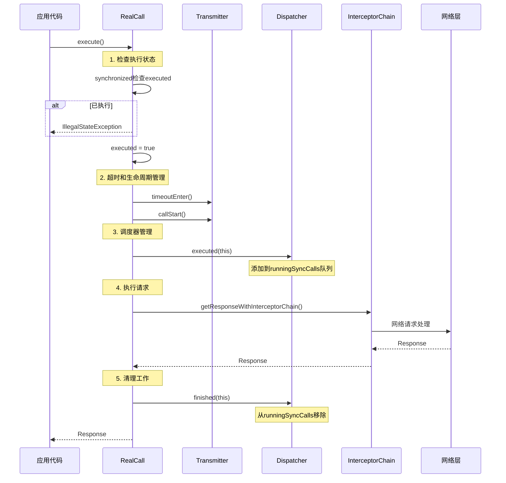
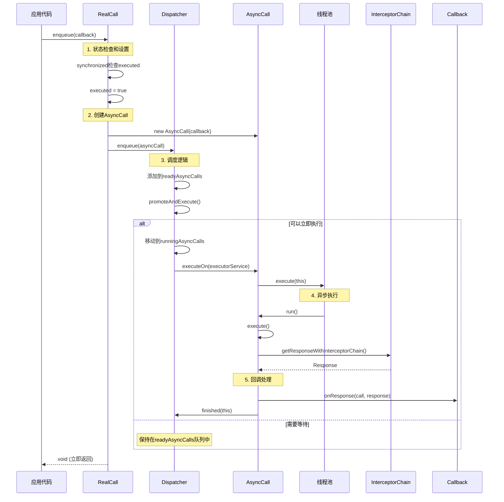
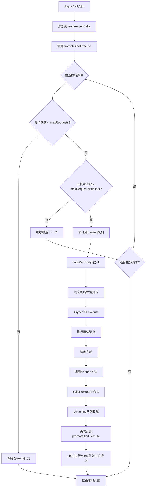
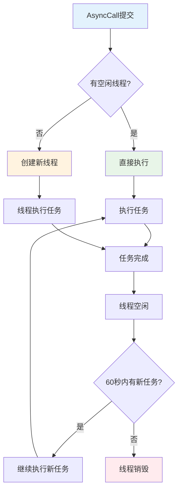
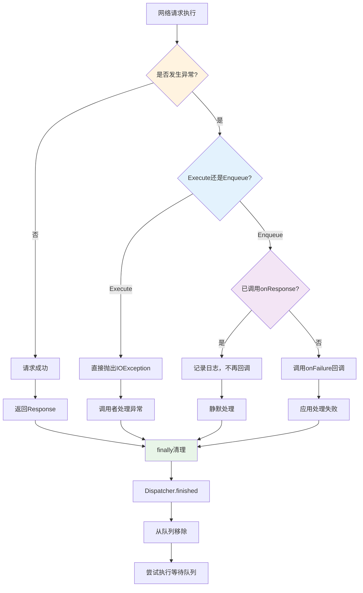

# OkHttp Execute和Enqueue方法设计流程深度分析

## 1. 概述

本文档深入分析OkHttp网络库中`execute()`和`enqueue()`两个核心方法的设计流程。这两个方法分别代表了同步和异步网络请求的实现机制，是OkHttp架构设计的核心体现。

### 1.1 核心方法对比

## 2. 整体架构设计

### 2.1 核心类关系图

```mermaid
classDiagram
    class Call {
        <<interface>>
        +execute() Response
        +enqueue(Callback) void
        +cancel() void
        +isExecuted() boolean
    }
    
    class RealCall {
        -OkHttpClient client
        -Request originalRequest
        -Transmitter transmitter
        -boolean executed
        +execute() Response
        +enqueue(Callback) void
        +getResponseWithInterceptorChain() Response
    }
    
    class Dispatcher {
        -ExecutorService executorService
        -Deque~AsyncCall~ readyAsyncCalls
        -Deque~AsyncCall~ runningAsyncCalls
        -Deque~RealCall~ runningSyncCalls
        +executed(RealCall) void
        +enqueue(AsyncCall) void
        +finished(RealCall) void
        +promoteAndExecute() boolean
    }
    
    class AsyncCall {
        -Callback responseCallback
        -AtomicInteger callsPerHost
        +executeOn(ExecutorService) void
        +execute() void
    }
    
    class Transmitter {
        -OkHttpClient client
        -Call call
        +timeoutEnter() void
        +callStart() void
        +cancel() void
    }
    
    class Callback {
        <<interface>>
        +onFailure(Call, IOException) void
        +onResponse(Call, Response) void
    }
    
    Call <|-- RealCall : implements
    RealCall --> Dispatcher : uses
    RealCall +-- AsyncCall : inner class
    AsyncCall --> Callback : uses
    RealCall --> Transmitter : uses
    AsyncCall --|> NamedRunnable : extends
```

### 2.2 执行流程架构图


## 3. Execute方法详细分析

### 3.1 Execute方法源码分析

```java
@Override
public Response execute() throws IOException {
    synchronized (this) {
        if (executed) throw new IllegalStateException("Already Executed");
        executed = true;
    }
    transmitter.timeoutEnter();
    transmitter.callStart();
    try {
        client.dispatcher().executed(this);
        return getResponseWithInterceptorChain();
    } finally {
        client.dispatcher().finished(this);
    }
}
```

### 3.2 Execute执行时序图



### 3.3 Execute方法关键特性

#### 3.3.1 状态管理
```java
synchronized (this) {
    if (executed) throw new IllegalStateException("Already Executed");
    executed = true;
}
```
- **线程安全**：使用synchronized确保状态检查和设置的原子性
- **单次执行**：防止同一个Call被多次执行
- **快速失败**：立即抛出异常，避免资源浪费

#### 3.3.2 超时管理
```java
transmitter.timeoutEnter();
```
- **超时计时开始**：启动整个请求的超时计时
- **资源跟踪**：Transmitter负责管理连接和超时

#### 3.3.3 调度器集成
```java
client.dispatcher().executed(this);
// ... 执行请求 ...
client.dispatcher().finished(this);
```
- **统计管理**：Dispatcher记录正在执行的同步请求
- **资源监控**：便于监控和管理并发请求数量

## 4. Enqueue方法详细分析

### 4.1 Enqueue方法源码分析

```java
@Override
public void enqueue(Callback responseCallback) {
    synchronized (this) {
        if (executed) throw new IllegalStateException("Already Executed");
        executed = true;
    }
    transmitter.callStart();
    client.dispatcher().enqueue(new AsyncCall(responseCallback));
}
```

### 4.2 AsyncCall内部类分析

```java
final class AsyncCall extends NamedRunnable {
    private final Callback responseCallback;
    private volatile AtomicInteger callsPerHost = new AtomicInteger(0);

    AsyncCall(Callback responseCallback) {
        super("OkHttp %s", redactedUrl());
        this.responseCallback = responseCallback;
    }

    void executeOn(ExecutorService executorService) {
        assert (!Thread.holdsLock(client.dispatcher()));
        boolean success = false;
        try {
            executorService.execute(this);
            success = true;
        } catch (RejectedExecutionException e) {
            InterruptedIOException ioException = new InterruptedIOException("executor rejected");
            ioException.initCause(e);
            transmitter.noMoreExchanges(ioException);
            responseCallback.onFailure(RealCall.this, ioException);
        } finally {
            if (!success) {
                client.dispatcher().finished(this);
            }
        }
    }

    @Override
    protected void execute() {
        boolean signalledCallback = false;
        transmitter.timeoutEnter();
        try {
            Response response = getResponseWithInterceptorChain();
            signalledCallback = true;
            responseCallback.onResponse(RealCall.this, response);
        } catch (IOException e) {
            if (signalledCallback) {
                Platform.get().log(INFO, "Callback failure for " + toLoggableString(), e);
            } else {
                responseCallback.onFailure(RealCall.this, e);
            }
        } finally {
            client.dispatcher().finished(this);
        }
    }
}
```

### 4.3 Enqueue执行时序图



### 4.4 Dispatcher调度机制详细分析

#### 4.4.1 Dispatcher核心字段

```java
public final class Dispatcher {
    private int maxRequests = 64;  // 最大并发请求数
    private int maxRequestsPerHost = 5;  // 单主机最大并发数
    
    // 等待执行的异步请求队列
    private final Deque<AsyncCall> readyAsyncCalls = new ArrayDeque<>();
    // 正在执行的异步请求队列
    private final Deque<AsyncCall> runningAsyncCalls = new ArrayDeque<>();
    // 正在执行的同步请求队列
    private final Deque<RealCall> runningSyncCalls = new ArrayDeque<>();
}
```

#### 4.4.2 调度策略流程图



#### 4.4.3 promoteAndExecute方法详细分析

```java
private boolean promoteAndExecute() {
    assert (!Thread.holdsLock(this));

    List<AsyncCall> executableCalls = new ArrayList<>();
    boolean isRunning;
    synchronized (this) {
        for (Iterator<AsyncCall> i = readyAsyncCalls.iterator(); i.hasNext(); ) {
            AsyncCall asyncCall = i.next();

            // 检查总并发数限制
            if (runningAsyncCalls.size() >= maxRequests) break;
            // 检查单主机并发数限制
            if (asyncCall.callsPerHost().get() >= maxRequestsPerHost) continue;

            i.remove();  // 从ready队列移除
            asyncCall.callsPerHost().incrementAndGet();  // 主机计数+1
            executableCalls.add(asyncCall);  // 添加到可执行列表
            runningAsyncCalls.add(asyncCall);  // 添加到running队列
        }
        isRunning = runningCallsCount() > 0;
    }

    // 在同步块外执行，避免死锁
    for (int i = 0, size = executableCalls.size(); i < size; i++) {
        AsyncCall asyncCall = executableCalls.get(i);
        asyncCall.executeOn(executorService());
    }

    return isRunning;
}
```

## 5. 线程池设计分析

### 5.1 线程池配置

```java
public synchronized ExecutorService executorService() {
    if (executorService == null) {
        executorService = new ThreadPoolExecutor(
            0,                      // 核心线程数
            Integer.MAX_VALUE,      // 最大线程数
            60L,                    // 空闲超时时间
            TimeUnit.SECONDS,       // 时间单位
            new SynchronousQueue<>(), // 工作队列
            Util.threadFactory("OkHttp Dispatcher", false) // 线程工厂
        );
    }
    return executorService;
}
```

### 5.2 线程池设计特点

#### 5.2.1 设计理念
- **无界线程池**：最大线程数为Integer.MAX_VALUE
- **零核心线程**：没有常驻线程，按需创建
- **快速回收**：空闲60秒后自动销毁
- **同步队列**：SynchronousQueue不存储任务，直接传递

#### 5.2.2 线程池工作流程



## 6. 错误处理和异常管理

### 6.1 Execute方法异常处理

```java
public Response execute() throws IOException {
    // ... 状态检查 ...
    transmitter.timeoutEnter();
    transmitter.callStart();
    try {
        client.dispatcher().executed(this);
        return getResponseWithInterceptorChain();  // 可能抛出IOException
    } finally {
        client.dispatcher().finished(this);  // 确保清理工作
    }
}
```

**特点**：
- **直接抛出**：IOException直接向上抛出
- **资源清理**：finally块确保Dispatcher清理
- **简单明了**：调用者直接处理异常

### 6.2 Enqueue方法异常处理

```java
@Override
protected void execute() {
    boolean signalledCallback = false;
    transmitter.timeoutEnter();
    try {
        Response response = getResponseWithInterceptorChain();
        signalledCallback = true;
        responseCallback.onResponse(RealCall.this, response);
    } catch (IOException e) {
        if (signalledCallback) {
            // 已经调用了onResponse，只记录日志
            Platform.get().log(INFO, "Callback failure for " + toLoggableString(), e);
        } else {
            // 还没调用onResponse，通知失败
            responseCallback.onFailure(RealCall.this, e);
        }
    } finally {
        client.dispatcher().finished(this);
    }
}
```

**特点**：
- **回调通知**：通过Callback.onFailure通知异常
- **防重复调用**：signalledCallback防止重复回调
- **日志记录**：回调异常时记录日志而不是崩溃

### 6.3 异常处理流程图



## 7. 性能优化设计

### 7.1 并发控制优化

#### 7.1.1 分级限制策略
```java
// 全局并发限制
if (runningAsyncCalls.size() >= maxRequests) break;
// 单主机并发限制  
if (asyncCall.callsPerHost().get() >= maxRequestsPerHost) continue;
```

**优势**：
- **防止雪崩**：避免对单个服务器造成过大压力
- **资源均衡**：确保多个主机请求的公平性
- **系统稳定**：防止创建过多连接导致系统资源耗尽

#### 7.1.2 主机计数共享机制

```java
// 在enqueue时查找现有的主机计数
if (!call.get().forWebSocket) {
    AsyncCall existingCall = findExistingCallWithHost(call.host());
    if (existingCall != null) call.reuseCallsPerHostFrom(existingCall);
}
```

**优势**：
- **精确计数**：多个请求共享同一主机的计数器
- **避免竞争**：减少计数器的创建和销毁开销
- **内存优化**：复用AtomicInteger对象

### 7.2 队列管理优化

#### 7.2.1 双队列设计
```java
private final Deque<AsyncCall> readyAsyncCalls = new ArrayDeque<>();    // 等待队列
private final Deque<AsyncCall> runningAsyncCalls = new ArrayDeque<>();  // 执行队列
```

**优势**：
- **状态清晰**：明确区分等待和执行状态
- **高效调度**：O(1)时间复杂度的队列操作
- **内存友好**：ArrayDeque比LinkedList更节省内存

#### 7.2.2 批量提升机制

```java
List<AsyncCall> executableCalls = new ArrayList<>();
// 在同步块内批量选择可执行任务
synchronized (this) {
    // ... 选择逻辑 ...
}
// 在同步块外批量执行，避免长时间持锁
for (int i = 0, size = executableCalls.size(); i < size; i++) {
    AsyncCall asyncCall = executableCalls.get(i);
    asyncCall.executeOn(executorService());
}
```

**优势**：
- **减少锁竞争**：最小化同步块持有时间
- **批量处理**：一次性处理多个任务，提高效率
- **避免死锁**：执行任务在同步块外进行

### 7.3 内存管理优化

#### 7.3.1 对象复用设计
```java
// AsyncCall复用Callback对象
private final Callback responseCallback;

// 复用主机计数器
void reuseCallsPerHostFrom(AsyncCall other) {
    this.callsPerHost = other.callsPerHost;
}
```

#### 7.3.2 及时清理机制
```java
void finished(AsyncCall call) {
    call.callsPerHost().decrementAndGet();  // 立即减少计数
    finished(runningAsyncCalls, call);      // 从队列移除
}
```

## 8. 监控和调试支持

### 8.1 状态查询接口

```java
// 获取队列状态
public synchronized List<Call> queuedCalls() {
    List<Call> result = new ArrayList<>();
    for (AsyncCall asyncCall : readyAsyncCalls) {
        result.add(asyncCall.get());
    }
    return Collections.unmodifiableList(result);
}

public synchronized List<Call> runningCalls() {
    List<Call> result = new ArrayList<>();
    result.addAll(runningSyncCalls);
    for (AsyncCall asyncCall : runningAsyncCalls) {
        result.add(asyncCall.get());
    }
    return Collections.unmodifiableList(result);
}
```

### 8.2 调试信息支持

```java
// AsyncCall继承NamedRunnable，提供线程名称
AsyncCall(Callback responseCallback) {
    super("OkHttp %s", redactedUrl());  // 包含URL信息的线程名
    this.responseCallback = responseCallback;
}

// 提供日志记录
String toLoggableString() {
    return (isCanceled() ? "canceled " : "")
            + (forWebSocket ? "web socket" : "call")
            + " to " + redactedUrl();
}
```

## 9. 最佳实践和使用建议

### 9.1 Execute使用场景

**适用情况**：
- **简单请求**：不需要复杂的异步处理
- **同步流程**：需要在当前线程获取结果
- **错误处理**：希望直接捕获和处理异常
- **测试代码**：单元测试中的同步验证

**示例代码**：
```java
try {
    Response response = client.newCall(request).execute();
    if (response.isSuccessful()) {
        String result = response.body().string();
        // 处理结果
    }
} catch (IOException e) {
    // 处理网络异常
}
```

### 9.2 Enqueue使用场景

**适用情况**：
- **UI线程**：避免阻塞用户界面
- **高并发**：需要同时处理多个请求
- **异步流程**：结果处理可以延后进行
- **生产环境**：大多数实际应用场景

**示例代码**：
```java
client.newCall(request).enqueue(new Callback() {
    @Override
    public void onFailure(Call call, IOException e) {
        // 在后台线程处理失败
        runOnUiThread(() -> showError(e.getMessage()));
    }
    
    @Override
    public void onResponse(Call call, Response response) throws IOException {
        if (response.isSuccessful()) {
            String result = response.body().string();
            // 在后台线程处理成功结果
            runOnUiThread(() -> updateUI(result));
        }
    }
});
```

### 9.3 性能调优建议

#### 9.3.1 合理配置并发参数
```java
Dispatcher dispatcher = new Dispatcher();
dispatcher.setMaxRequests(100);        // 根据服务器能力调整
dispatcher.setMaxRequestsPerHost(10);  // 根据服务器策略调整

OkHttpClient client = new OkHttpClient.Builder()
    .dispatcher(dispatcher)
    .build();
```

#### 9.3.2 避免常见陷阱
- **不要在UI线程调用execute()**
- **及时关闭Response.body()**
- **合理设置超时时间**
- **避免创建过多OkHttpClient实例**

## 10. 总结

### 10.1 设计优势

1. **清晰的职责分离**
   - RealCall负责请求执行逻辑
   - Dispatcher负责调度管理
   - AsyncCall负责异步执行

2. **高效的并发控制**
   - 多级并发限制策略
   - 智能的队列调度机制
   - 优化的线程池设计

3. **健壮的异常处理**
   - 同步异步不同的异常处理策略
   - 完善的资源清理机制
   - 防重复调用保护

4. **良好的可观测性**
   - 丰富的状态查询接口
   - 详细的调试信息支持
   - 完善的日志记录

### 10.2 架构价值

OkHttp的execute和enqueue方法设计体现了以下架构价值：

- **统一接口**：Call接口提供一致的使用体验
- **灵活选择**：支持同步和异步两种执行模式
- **性能优化**：通过调度器实现高效的并发控制
- **资源管理**：完善的生命周期和资源清理机制
- **可扩展性**：良好的模块化设计支持功能扩展

这种设计使得OkHttp既能满足简单的同步请求需求，又能支持复杂的高并发异步场景，是现代网络库设计的优秀范例。

---

*本文档基于OkHttp源码深度分析，详细阐述了execute和enqueue方法的设计原理、实现机制和最佳实践，为开发者提供了全面的技术参考。*