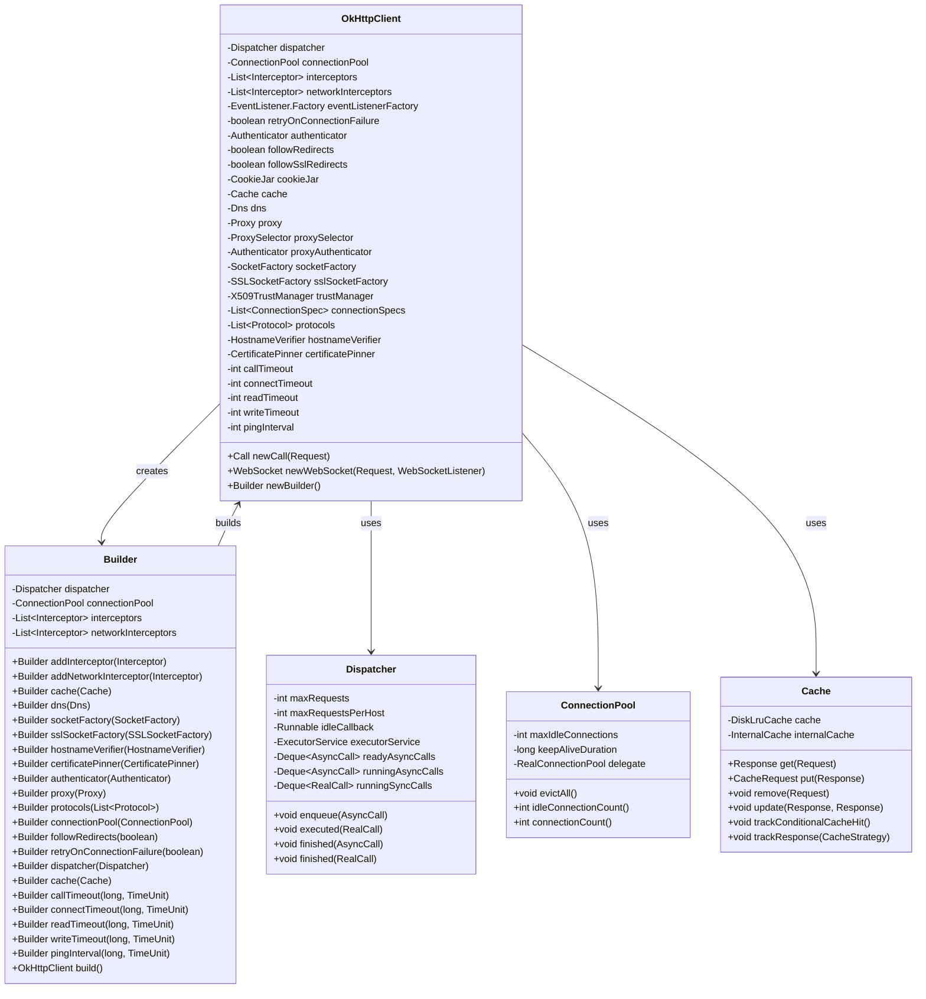
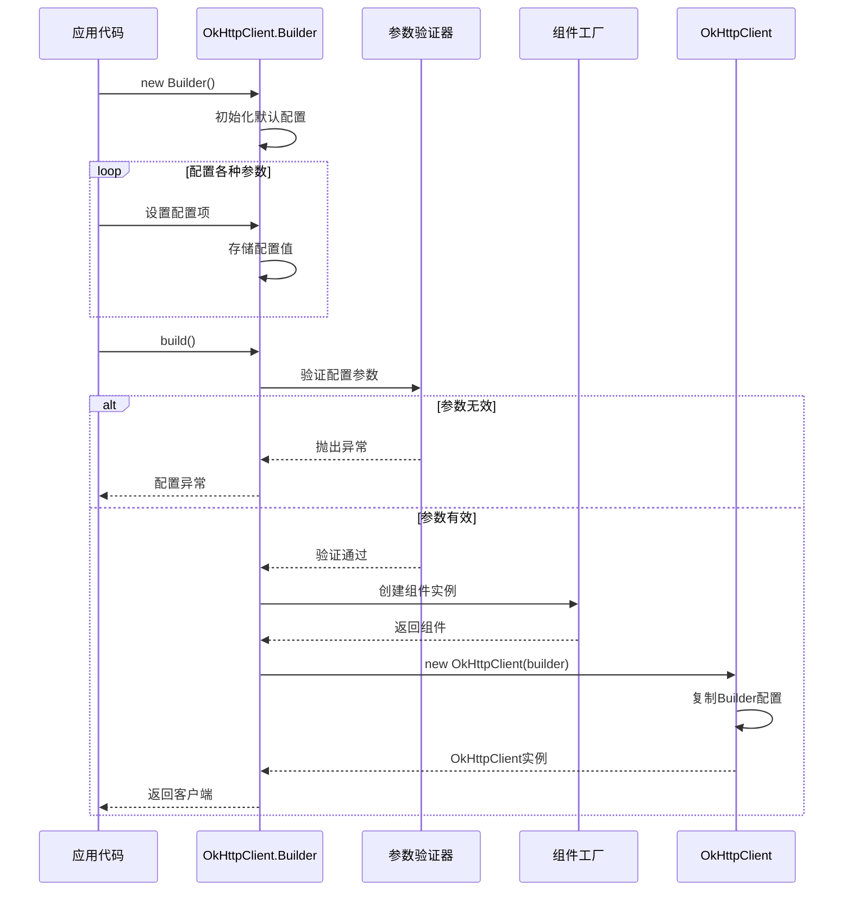
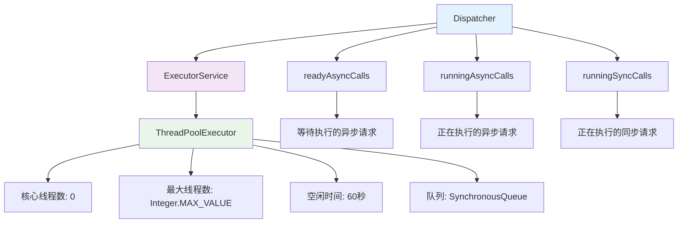
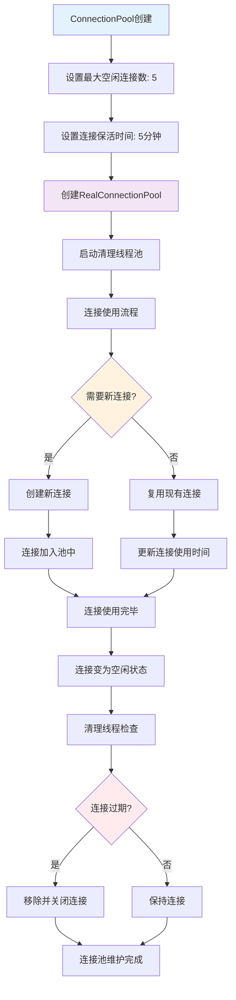
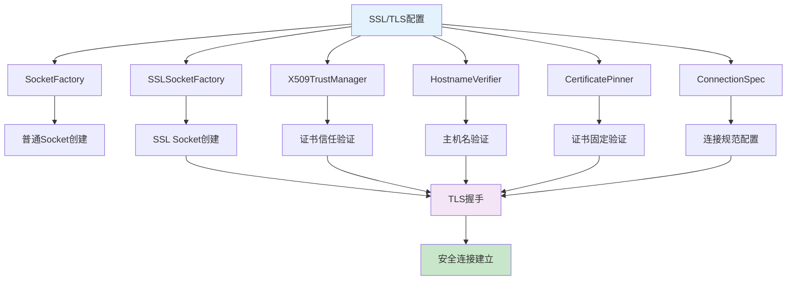
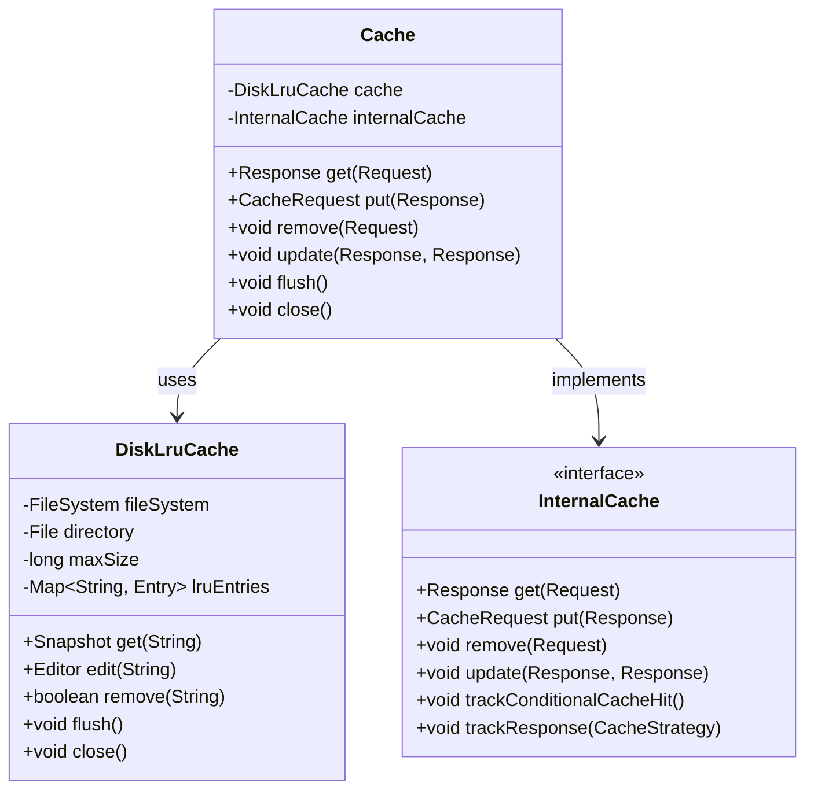
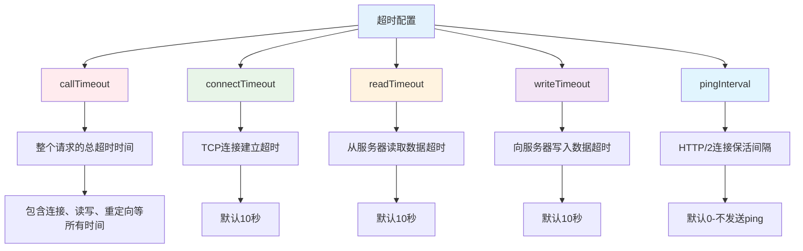
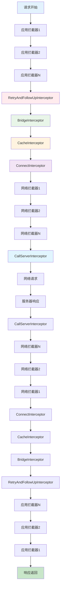
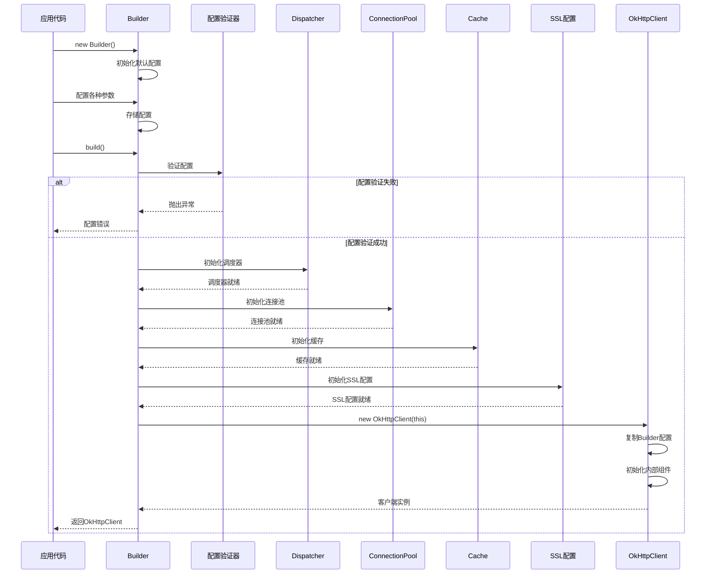
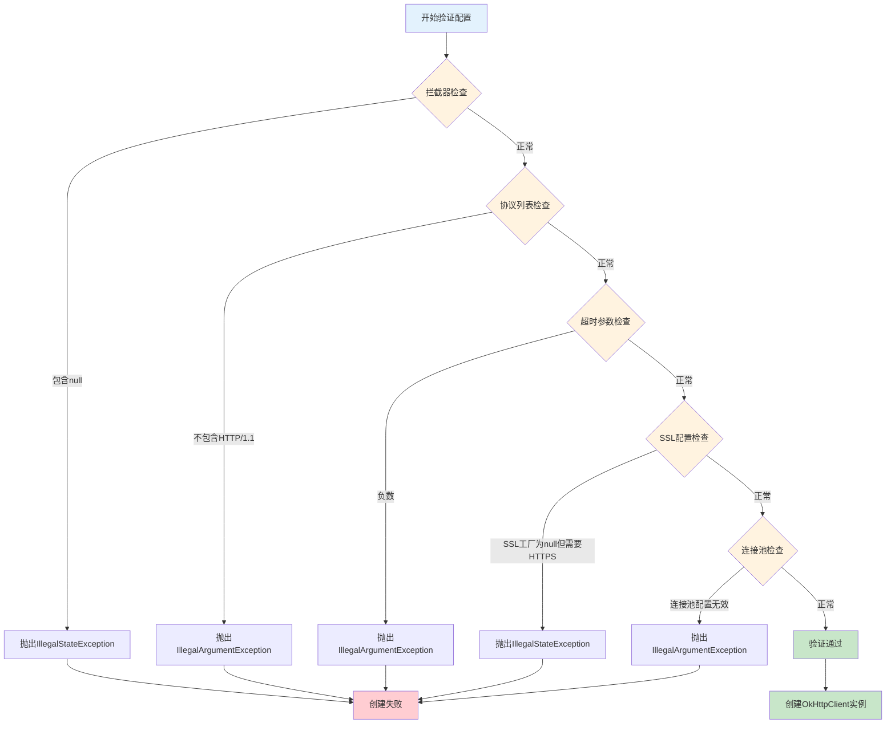

# OkHttp OkHttpClient创建方法设计流程深度分析

## 1. 概述

OkHttpClient是OkHttp网络库的核心入口类，采用建造者模式(Builder Pattern)进行配置和创建。它封装了HTTP客户端的所有配置选项，包括连接池、缓存、拦截器、超时设置、SSL配置等。本文档深入分析OkHttpClient的创建流程、配置机制、架构设计以及各种优化策略。

### 1.1 OkHttpClient核心职责

- **配置管理**：统一管理所有HTTP客户端配置
- **资源池化**：管理连接池、线程池等共享资源
- **请求调度**：通过Dispatcher管理请求的执行
- **安全控制**：SSL/TLS配置、证书验证、主机名验证
- **缓存管理**：HTTP缓存策略和存储
- **拦截器链**：应用拦截器和网络拦截器管理

## 2. OkHttpClient架构设计

### 2.1 核心类关系图



### 2.2 OkHttpClient创建流程架构图

```mermaid
flowchart TD
    A[开始创建OkHttpClient] --> B{使用方式}
    
    B -->|默认构造| C[new OkHttpClient()]
    B -->|Builder模式| D[new OkHttpClient.Builder()]
    
    C --> E[使用默认配置]
    D --> F[配置各种参数]
    
    E --> G[创建默认组件]
    F --> H[验证配置参数]
    
    G --> I[初始化Dispatcher]
    H --> I
    
    I --> J[初始化ConnectionPool]
    J --> K[初始化SSL配置]
    K --> L[初始化拦截器链]
    L --> M[初始化缓存配置]
    M --> N[初始化超时配置]
    N --> O[初始化事件监听器]
    O --> P[创建OkHttpClient实例]
    
    P --> Q[客户端就绪]
    
    style C fill:#e3f2fd
    style D fill:#f3e5f5
    style G fill:#e8f5e8
    style H fill:#fff3e0
    style Q fill:#c8e6c9
```

## 3. Builder模式详细实现

### 3.1 Builder模式设计原理

OkHttpClient采用Builder模式的主要原因：

1. **参数众多**：OkHttpClient有30+个配置参数
2. **可选配置**：大部分参数都有合理的默认值
3. **不可变性**：创建后的OkHttpClient实例不可修改
4. **链式调用**：提供流畅的API体验
5. **参数验证**：在build()时统一验证参数合法性

### 3.2 Builder类实现分析

```java
public static final class Builder {
    Dispatcher dispatcher;
    @Nullable Proxy proxy;
    List<Protocol> protocols;
    List<ConnectionSpec> connectionSpecs;
    final List<Interceptor> interceptors = new ArrayList<>();
    final List<Interceptor> networkInterceptors = new ArrayList<>();
    EventListener.Factory eventListenerFactory;
    ProxySelector proxySelector;
    CookieJar cookieJar;
    @Nullable Cache cache;
    @Nullable InternalCache internalCache; // Visible for testing.
    SocketFactory socketFactory;
    @Nullable SSLSocketFactory sslSocketFactory;
    @Nullable CertificateChainCleaner certificateChainCleaner;
    HostnameVerifier hostnameVerifier;
    CertificatePinner certificatePinner;
    Authenticator proxyAuthenticator;
    Authenticator authenticator;
    ConnectionPool connectionPool;
    Dns dns;
    boolean followSslRedirects;
    boolean followRedirects;
    boolean retryOnConnectionFailure;
    int callTimeout;
    int connectTimeout;
    int readTimeout;
    int writeTimeout;
    int pingInterval;

    public Builder() {
        dispatcher = new Dispatcher();
        protocols = DEFAULT_PROTOCOLS;
        connectionSpecs = DEFAULT_CONNECTION_SPECS;
        eventListenerFactory = EventListener.factory(EventListener.NONE);
        proxySelector = ProxySelector.getDefault();
        if (proxySelector == null) {
            proxySelector = new NullProxySelector();
        }
        cookieJar = CookieJar.NO_COOKIES;
        socketFactory = SocketFactory.getDefault();
        hostnameVerifier = OkHostnameVerifier.INSTANCE;
        certificatePinner = CertificatePinner.DEFAULT;
        proxyAuthenticator = Authenticator.NONE;
        authenticator = Authenticator.NONE;
        connectionPool = new ConnectionPool();
        dns = Dns.SYSTEM;
        followSslRedirects = true;
        followRedirects = true;
        retryOnConnectionFailure = true;
        callTimeout = 0;
        connectTimeout = 10_000;
        readTimeout = 10_000;
        writeTimeout = 10_000;
        pingInterval = 0;
    }

    Builder(OkHttpClient okHttpClient) {
        this.dispatcher = okHttpClient.dispatcher;
        this.proxy = okHttpClient.proxy;
        this.protocols = okHttpClient.protocols;
        this.connectionSpecs = okHttpClient.connectionSpecs;
        this.interceptors.addAll(okHttpClient.interceptors);
        this.networkInterceptors.addAll(okHttpClient.networkInterceptors);
        this.eventListenerFactory = okHttpClient.eventListenerFactory;
        this.proxySelector = okHttpClient.proxySelector;
        this.cookieJar = okHttpClient.cookieJar;
        this.internalCache = okHttpClient.internalCache;
        this.cache = okHttpClient.cache;
        this.socketFactory = okHttpClient.socketFactory;
        this.sslSocketFactory = okHttpClient.sslSocketFactory;
        this.certificateChainCleaner = okHttpClient.certificateChainCleaner;
        this.hostnameVerifier = okHttpClient.hostnameVerifier;
        this.certificatePinner = okHttpClient.certificatePinner;
        this.proxyAuthenticator = okHttpClient.proxyAuthenticator;
        this.authenticator = okHttpClient.authenticator;
        this.connectionPool = okHttpClient.connectionPool;
        this.dns = okHttpClient.dns;
        this.followSslRedirects = okHttpClient.followSslRedirects;
        this.followRedirects = okHttpClient.followRedirects;
        this.retryOnConnectionFailure = okHttpClient.retryOnConnectionFailure;
        this.callTimeout = okHttpClient.callTimeout;
        this.connectTimeout = okHttpClient.connectTimeout;
        this.readTimeout = okHttpClient.readTimeout;
        this.writeTimeout = okHttpClient.writeTimeout;
        this.pingInterval = okHttpClient.pingInterval;
    }
}
```

### 3.3 Builder配置流程图



## 4. 核心组件初始化

### 4.1 Dispatcher调度器初始化

```java
public final class Dispatcher {
    private int maxRequests = 64;
    private int maxRequestsPerHost = 5;
    private @Nullable Runnable idleCallback;

    /** Executes calls. Created lazily. */
    private @Nullable ExecutorService executorService;

    /** Ready async calls in the order they'll be run. */
    private final Deque<AsyncCall> readyAsyncCalls = new ArrayDeque<>();

    /** Running asynchronous calls. Includes canceled calls that haven't finished yet. */
    private final Deque<AsyncCall> runningAsyncCalls = new ArrayDeque<>();

    /** Running synchronous calls. Includes canceled calls that haven't finished yet. */
    private final Deque<RealCall> runningSyncCalls = new ArrayDeque<>();

    public Dispatcher() {
    }

    public Dispatcher(ExecutorService executorService) {
        this.executorService = executorService;
    }

    public synchronized ExecutorService executorService() {
        if (executorService == null) {
            executorService = new ThreadPoolExecutor(0, Integer.MAX_VALUE, 60, TimeUnit.SECONDS,
                new SynchronousQueue<>(), Util.threadFactory("OkHttp Dispatcher", false));
        }
        return executorService;
    }
}
```

#### 4.1.1 Dispatcher架构图



### 4.2 ConnectionPool连接池初始化

```java
public final class ConnectionPool {
    /**
     * Background threads are used to cleanup expired connections. There will be at most a single
     * thread running per connection pool. The thread pool executor permits the pool itself to be
     * garbage collected.
     */
    private static final Executor executor = new ThreadPoolExecutor(0 /* corePoolSize */,
        Integer.MAX_VALUE /* maximumPoolSize */, 60L /* keepAliveTime */, TimeUnit.SECONDS,
        new SynchronousQueue<>(), Util.threadFactory("OkHttp ConnectionPool", true));

    /** The maximum number of idle connections for each address. */
    private final int maxIdleConnections;
    private final long keepAliveDurationNs;
    private final RealConnectionPool delegate;

    /**
     * Create a new connection pool with tuning parameters appropriate for a single-user application.
     * The tuning parameters in this pool are subject to change in future OkHttp releases. Currently
     * this pool holds up to 5 idle connections which will be evicted after 5 minutes of inactivity.
     */
    public ConnectionPool() {
        this(5, 5, TimeUnit.MINUTES);
    }

    public ConnectionPool(int maxIdleConnections, long keepAliveDuration, TimeUnit timeUnit) {
        this.maxIdleConnections = maxIdleConnections;
        this.keepAliveDurationNs = timeUnit.toNanos(keepAliveDuration);

        // Put a floor on the keep alive duration, otherwise cleanup will spin loop.
        if (keepAliveDuration <= 0) {
            throw new IllegalArgumentException("keepAliveDuration <= 0: " + keepAliveDuration);
        }

        this.delegate = new RealConnectionPool(executor, maxIdleConnections, keepAliveDurationNs);
    }
}
```

#### 4.2.1 ConnectionPool管理流程



### 4.3 SSL/TLS配置初始化

```java
// OkHttpClient.Builder默认SSL配置
public Builder() {
    // ... 其他初始化代码
    socketFactory = SocketFactory.getDefault();
    hostnameVerifier = OkHostnameVerifier.INSTANCE;
    certificatePinner = CertificatePinner.DEFAULT;
    
    // 默认连接规范
    connectionSpecs = DEFAULT_CONNECTION_SPECS;
}

// 默认连接规范定义
static {
    DEFAULT_CONNECTION_SPECS = Util.immutableList(
        ConnectionSpec.MODERN_TLS,
        ConnectionSpec.CLEARTEXT);
}
```

#### 4.3.1 SSL配置层次图



### 4.4 缓存系统初始化

```java
public final class Cache implements Closeable, Flushable {
    private final DiskLruCache cache;
    private final InternalCache internalCache = new InternalCache() {
        @Override public @Nullable Response get(Request request) throws IOException {
            return Cache.this.get(request);
        }

        @Override public @Nullable CacheRequest put(Response response) throws IOException {
            return Cache.this.put(response);
        }

        @Override public void remove(Request request) throws IOException {
            Cache.this.remove(request);
        }

        @Override public void update(Response cached, Response network) {
            Cache.this.update(cached, network);
        }

        @Override public void trackConditionalCacheHit() {
            Cache.this.trackConditionalCacheHit();
        }

        @Override public void trackResponse(CacheStrategy cacheStrategy) {
            Cache.this.trackResponse(cacheStrategy);
        }
    };

    public Cache(File directory, long maxSize) {
        this(directory, maxSize, FileSystem.SYSTEM);
    }

    Cache(File directory, long maxSize, FileSystem fileSystem) {
        this.cache = DiskLruCache.create(fileSystem, directory, VERSION, ENTRY_COUNT, maxSize);
    }
}
```

#### 4.4.1 缓存系统架构



## 5. 配置参数详细分析

### 5.1 超时配置

```java
public static final class Builder {
    int callTimeout;      // 完整请求超时
    int connectTimeout;   // 连接超时
    int readTimeout;      // 读取超时
    int writeTimeout;     // 写入超时
    int pingInterval;     // HTTP/2 ping间隔

    public Builder callTimeout(long timeout, TimeUnit unit) {
        callTimeout = checkDuration("timeout", timeout, unit);
        return this;
    }

    public Builder connectTimeout(long timeout, TimeUnit unit) {
        connectTimeout = checkDuration("timeout", timeout, unit);
        return this;
    }

    public Builder readTimeout(long timeout, TimeUnit unit) {
        readTimeout = checkDuration("timeout", timeout, unit);
        return this;
    }

    public Builder writeTimeout(long timeout, TimeUnit unit) {
        writeTimeout = checkDuration("timeout", timeout, unit);
        return this;
    }

    public Builder pingInterval(long interval, TimeUnit unit) {
        pingInterval = checkDuration("interval", interval, unit);
        return this;
    }
}
```

#### 5.1.1 超时配置关系图



### 5.2 拦截器配置

```java
public static final class Builder {
    final List<Interceptor> interceptors = new ArrayList<>();
    final List<Interceptor> networkInterceptors = new ArrayList<>();

    public Builder addInterceptor(Interceptor interceptor) {
        if (interceptor == null) throw new IllegalArgumentException("interceptor == null");
        interceptors.add(interceptor);
        return this;
    }

    public Builder addNetworkInterceptor(Interceptor interceptor) {
        if (interceptor == null) throw new IllegalArgumentException("interceptor == null");
        networkInterceptors.add(interceptor);
        return this;
    }

    public List<Interceptor> interceptors() {
        return interceptors;
    }

    public List<Interceptor> networkInterceptors() {
        return networkInterceptors;
    }
}
```

#### 5.2.1 拦截器链架构



### 5.3 协议和连接规范配置

```java
// 默认支持的协议
public static final List<Protocol> DEFAULT_PROTOCOLS = Util.immutableList(
    Protocol.HTTP_2,
    Protocol.HTTP_1_1);

// 默认连接规范
public static final List<ConnectionSpec> DEFAULT_CONNECTION_SPECS = Util.immutableList(
    ConnectionSpec.MODERN_TLS,
    ConnectionSpec.CLEARTEXT);

public Builder protocols(List<Protocol> protocols) {
    // Clone the list since we mutate it below.
    protocols = new ArrayList<>(protocols);
    
    // Validate that the list contains HTTP/1.1.
    if (!protocols.contains(Protocol.HTTP_1_1)) {
        throw new IllegalArgumentException("protocols must contain http/1.1: " + protocols);
    }
    
    // Remove protocols that we no longer support.
    protocols.remove(Protocol.HTTP_1_0);
    protocols.remove(Protocol.SPDY_3);
    
    this.protocols = Collections.unmodifiableList(protocols);
    return this;
}

public Builder connectionSpecs(List<ConnectionSpec> connectionSpecs) {
    this.connectionSpecs = Util.immutableList(connectionSpecs);
    return this;
}
```

## 6. 客户端创建完整流程

### 6.1 创建时序图



### 6.2 配置验证流程

```java
public OkHttpClient build() {
    return new OkHttpClient(this);
}

OkHttpClient(Builder builder) {
    this.dispatcher = builder.dispatcher;
    this.proxy = builder.proxy;
    this.protocols = builder.protocols;
    this.connectionSpecs = builder.connectionSpecs;
    this.interceptors = Util.immutableList(builder.interceptors);
    this.networkInterceptors = Util.immutableList(builder.networkInterceptors);
    this.eventListenerFactory = builder.eventListenerFactory;
    this.proxySelector = builder.proxySelector;
    this.cookieJar = builder.cookieJar;
    this.cache = builder.cache;
    this.internalCache = builder.internalCache;
    this.socketFactory = builder.socketFactory;
    this.sslSocketFactory = builder.sslSocketFactory;
    this.certificateChainCleaner = builder.certificateChainCleaner;
    this.hostnameVerifier = builder.hostnameVerifier;
    this.certificatePinner = builder.certificatePinner;
    this.proxyAuthenticator = builder.proxyAuthenticator;
    this.authenticator = builder.authenticator;
    this.connectionPool = builder.connectionPool;
    this.dns = builder.dns;
    this.followSslRedirects = builder.followSslRedirects;
    this.followRedirects = builder.followRedirects;
    this.retryOnConnectionFailure = builder.retryOnConnectionFailure;
    this.callTimeout = builder.callTimeout;
    this.connectTimeout = builder.connectTimeout;
    this.readTimeout = builder.readTimeout;
    this.writeTimeout = builder.writeTimeout;
    this.pingInterval = builder.pingInterval;

    if (interceptors.contains(null)) {
        throw new IllegalStateException("Null interceptor: " + interceptors);
    }
    if (networkInterceptors.contains(null)) {
        throw new IllegalStateException("Null network interceptor: " + networkInterceptors);
    }
}
```

### 6.3 配置验证规则



## 7. 性能优化与最佳实践

### 7.1 客户端复用策略

```java
// ✅ 推荐：单例模式复用客户端
public class HttpClientManager {
    private static final OkHttpClient CLIENT = new OkHttpClient.Builder()
        .connectTimeout(10, TimeUnit.SECONDS)
        .readTimeout(30, TimeUnit.SECONDS)
        .writeTimeout(30, TimeUnit.SECONDS)
        .connectionPool(new ConnectionPool(5, 5, TimeUnit.MINUTES))
        .build();
    
    public static OkHttpClient getClient() {
        return CLIENT;
    }
}

// ✅ 推荐：基于现有客户端创建新配置
OkHttpClient baseClient = HttpClientManager.getClient();
OkHttpClient customClient = baseClient.newBuilder()
    .addInterceptor(new LoggingInterceptor())
    .build();

// ❌ 不推荐：频繁创建新客户端
for (int i = 0; i < 100; i++) {
    OkHttpClient client = new OkHttpClient(); // 每次都创建新的连接池和线程池
    // 使用client...
}
```

### 7.2 连接池优化配置

```java
// 根据应用场景调整连接池参数
ConnectionPool connectionPool;

// 高并发场景
connectionPool = new ConnectionPool(
    20,                    // 最大空闲连接数
    5, TimeUnit.MINUTES    // 连接保活时间
);

// 移动应用场景
connectionPool = new ConnectionPool(
    5,                     // 较少的空闲连接
    1, TimeUnit.MINUTES    // 较短的保活时间
);

// 服务器端场景
connectionPool = new ConnectionPool(
    50,                    // 大量空闲连接
    10, TimeUnit.MINUTES   // 较长的保活时间
);
```

### 7.3 缓存配置优化

```java
// 缓存配置最佳实践
File cacheDir = new File(context.getCacheDir(), "http_cache");
long cacheSize = 50 * 1024 * 1024; // 50MB

Cache cache = new Cache(cacheDir, cacheSize);

OkHttpClient client = new OkHttpClient.Builder()
    .cache(cache)
    .addNetworkInterceptor(new CacheControlInterceptor())
    .build();

// 自定义缓存控制拦截器
class CacheControlInterceptor implements Interceptor {
    @Override
    public Response intercept(Chain chain) throws IOException {
        Request request = chain.request();
        
        // 根据网络状态调整缓存策略
        if (!isNetworkAvailable()) {
            request = request.newBuilder()
                .cacheControl(CacheControl.FORCE_CACHE)
                .build();
        }
        
        Response response = chain.proceed(request);
        
        // 为响应添加缓存控制头
        if (isNetworkAvailable()) {
            return response.newBuilder()
                .header("Cache-Control", "public, max-age=60")
                .build();
        } else {
            return response.newBuilder()
                .header("Cache-Control", "public, only-if-cached, max-stale=86400")
                .build();
        }
    }
}
```

## 8. 常见配置场景

### 8.1 基础HTTP客户端

```java
OkHttpClient client = new OkHttpClient.Builder()
    .connectTimeout(10, TimeUnit.SECONDS)
    .readTimeout(30, TimeUnit.SECONDS)
    .writeTimeout(30, TimeUnit.SECONDS)
    .retryOnConnectionFailure(true)
    .followRedirects(true)
    .build();
```

### 8.2 HTTPS客户端配置

```java
// 信任所有证书（仅用于开发环境）
private static OkHttpClient getUnsafeOkHttpClient() {
    try {
        final TrustManager[] trustAllCerts = new TrustManager[] {
            new X509TrustManager() {
                @Override
                public void checkClientTrusted(X509Certificate[] chain, String authType) {}
                @Override
                public void checkServerTrusted(X509Certificate[] chain, String authType) {}
                @Override
                public X509Certificate[] getAcceptedIssuers() { return new X509Certificate[]{}; }
            }
        };

        final SSLContext sslContext = SSLContext.getInstance("SSL");
        sslContext.init(null, trustAllCerts, new java.security.SecureRandom());
        final SSLSocketFactory sslSocketFactory = sslContext.getSocketFactory();

        return new OkHttpClient.Builder()
            .sslSocketFactory(sslSocketFactory, (X509TrustManager)trustAllCerts[0])
            .hostnameVerifier((hostname, session) -> true)
            .build();
    } catch (Exception e) {
        throw new RuntimeException(e);
    }
}

// 生产环境证书固定
OkHttpClient client = new OkHttpClient.Builder()
    .certificatePinner(new CertificatePinner.Builder()
        .add("api.example.com", "sha256/AAAAAAAAAAAAAAAAAAAAAAAAAAAAAAAAAAAAAAAAAAA=")
        .build())
    .build();
```

### 8.3 带认证的客户端

```java
OkHttpClient client = new OkHttpClient.Builder()
    .authenticator(new Authenticator() {
        @Override
        public Request authenticate(Route route, Response response) throws IOException {
            if (response.request().header("Authorization") != null) {
                return null; // 已经尝试过认证，放弃
            }
            
            String credential = Credentials.basic("username", "password");
            return response.request().newBuilder()
                .header("Authorization", credential)
                .build();
        }
    })
    .build();
```

### 8.4 代理配置客户端

```java
// HTTP代理
Proxy proxy = new Proxy(Proxy.Type.HTTP, new InetSocketAddress("proxy.example.com", 8080));

OkHttpClient client = new OkHttpClient.Builder()
    .proxy(proxy)
    .proxyAuthenticator(new Authenticator() {
        @Override
        public Request authenticate(Route route, Response response) throws IOException {
            String credential = Credentials.basic("proxyUser", "proxyPassword");
            return response.request().newBuilder()
                .header("Proxy-Authorization", credential)
                .build();
        }
    })
    .build();

// SOCKS代理
Proxy socksProxy = new Proxy(Proxy.Type.SOCKS, new InetSocketAddress("socks.example.com", 1080));
OkHttpClient socksClient = new OkHttpClient.Builder()
    .proxy(socksProxy)
    .build();
```

## 9. 监控和调试

### 9.1 事件监听器配置

```java
class CustomEventListener extends EventListener {
    private long startTime;
    
    @Override
    public void callStart(Call call) {
        startTime = System.nanoTime();
        System.out.println("Call started: " + call.request().url());
    }
    
    @Override
    public void dnsStart(Call call, String domainName) {
        System.out.println("DNS lookup started: " + domainName);
    }
    
    @Override
    public void dnsEnd(Call call, String domainName, List<InetAddress> inetAddressList) {
        System.out.println("DNS lookup completed: " + domainName + " -> " + inetAddressList);
    }
    
    @Override
    public void connectStart(Call call, InetSocketAddress inetSocketAddress, Proxy proxy) {
        System.out.println("Connect started: " + inetSocketAddress);
    }
    
    @Override
    public void connectEnd(Call call, InetSocketAddress inetSocketAddress, Proxy proxy, Protocol protocol) {
        System.out.println("Connect completed: " + inetSocketAddress + " via " + protocol);
    }
    
    @Override
    public void callEnd(Call call) {
        long duration = System.nanoTime() - startTime;
        System.out.println("Call completed in " + duration / 1_000_000 + "ms");
    }
    
    @Override
    public void callFailed(Call call, IOException ioe) {
        System.out.println("Call failed: " + ioe.getMessage());
    }
}

OkHttpClient client = new OkHttpClient.Builder()
    .eventListener(new CustomEventListener())
    .build();
```

### 9.2 网络日志拦截器

```java
class LoggingInterceptor implements Interceptor {
    @Override
    public Response intercept(Chain chain) throws IOException {
        Request request = chain.request();
        
        long startTime = System.nanoTime();
        System.out.println("Sending request: " + request.url());
        System.out.println("Headers: " + request.headers());
        
        Response response = chain.proceed(request);
        
        long endTime = System.nanoTime();
        System.out.println("Received response in " + (endTime - startTime) / 1_000_000 + "ms");
        System.out.println("Response code: " + response.code());
        System.out.println("Response headers: " + response.headers());
        
        return response;
    }
}

OkHttpClient client = new OkHttpClient.Builder()
    .addInterceptor(new LoggingInterceptor())
    .build();
```

## 10. 错误处理和异常管理

### 10.1 常见配置错误

```java
// 错误处理示例
public class OkHttpClientFactory {
    public static OkHttpClient createClient() {
        try {
            return new OkHttpClient.Builder()
                .connectTimeout(10, TimeUnit.SECONDS)
                .readTimeout(30, TimeUnit.SECONDS)
                .writeTimeout(30, TimeUnit.SECONDS)
                .protocols(Arrays.asList(Protocol.HTTP_2, Protocol.HTTP_1_1))
                .connectionSpecs(Arrays.asList(
                    ConnectionSpec.MODERN_TLS,
                    ConnectionSpec.CLEARTEXT))
                .build();
        } catch (IllegalArgumentException e) {
            System.err.println("Invalid configuration: " + e.getMessage());
            // 返回默认配置的客户端
            return new OkHttpClient();
        } catch (IllegalStateException e) {
            System.err.println("Invalid state: " + e.getMessage());
            throw e;
        }
    }
}
```

### 10.2 配置验证工具

```java
public class OkHttpConfigValidator {
    public static void validateConfig(OkHttpClient.Builder builder) {
        // 验证超时配置
        if (builder.connectTimeout < 0) {
            throw new IllegalArgumentException("Connect timeout cannot be negative");
        }
        
        // 验证拦截器
        for (Interceptor interceptor : builder.interceptors()) {
            if (interceptor == null) {
                throw new IllegalArgumentException("Interceptor cannot be null");
            }
        }
        
        // 验证协议配置
        if (!builder.protocols().contains(Protocol.HTTP_1_1)) {
            throw new IllegalArgumentException("HTTP/1.1 must be included in protocols");
        }
        
        // 验证连接池配置
        ConnectionPool pool = builder.connectionPool();
        if (pool.maxIdleConnections() <= 0) {
            throw new IllegalArgumentException("Max idle connections must be positive");
        }
    }
}
```

## 11. 总结

### 11.1 OkHttpClient设计优势

1. **Builder模式**
   - 灵活的配置方式
   - 参数验证和默认值处理
   - 不可变对象保证线程安全

2. **组件化设计**
   - 各组件职责清晰
   - 可插拔的架构设计
   - 易于扩展和定制

3. **性能优化**
   - 连接池复用
   - 多路复用支持
   - 智能缓存策略

4. **安全性**
   - 完善的SSL/TLS支持
   - 证书固定验证
   - 主机名验证

### 11.2 最佳实践总结

1. **客户端复用**：使用单例模式共享OkHttpClient实例
2. **合理配置**：根据应用场景调整超时和连接池参数
3. **缓存策略**：合理使用HTTP缓存减少网络请求
4. **监控调试**：使用EventListener和拦截器进行监控
5. **错误处理**：完善的异常处理和降级策略

### 11.3 架构价值

OkHttpClient的创建流程体现了以下架构价值：

- **可配置性**：丰富的配置选项满足各种使用场景
- **可扩展性**：拦截器机制支持功能扩展
- **高性能**：连接池、缓存、多路复用等优化
- **安全性**：完善的SSL/TLS和证书验证机制
- **易用性**：Builder模式提供流畅的API体验

这种设计使得OkHttpClient能够适应从简单的HTTP请求到复杂的企业级应用的各种需求，是现代HTTP客户端库的优秀实现。

---

*本文档基于OkHttp源码深度分析，全面阐述了OkHttpClient创建方法的设计原理、配置机制和最佳实践，为开发者提供了完整的技术参考。*