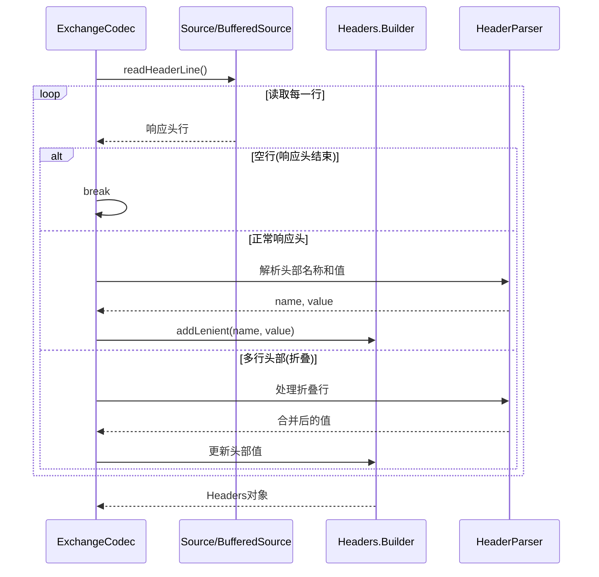
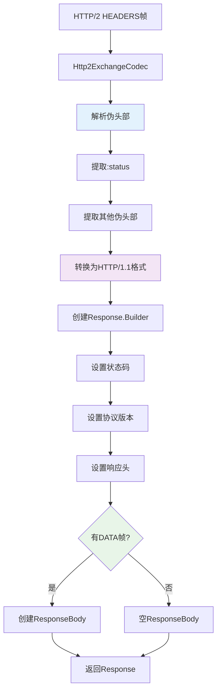
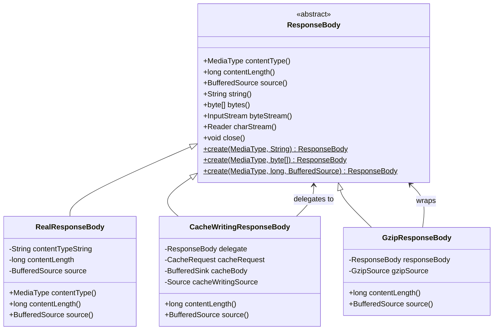
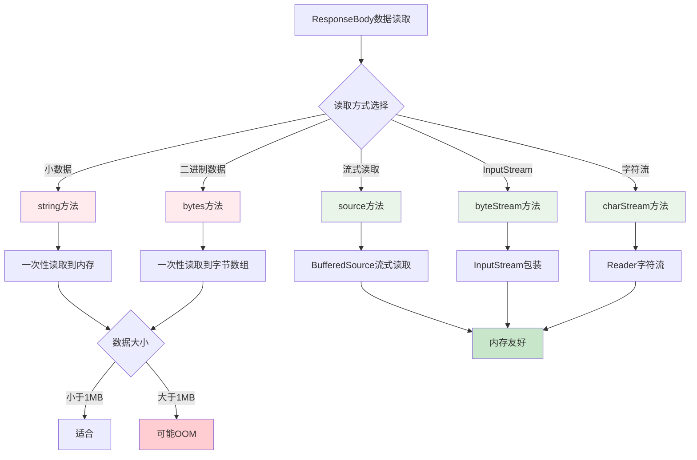
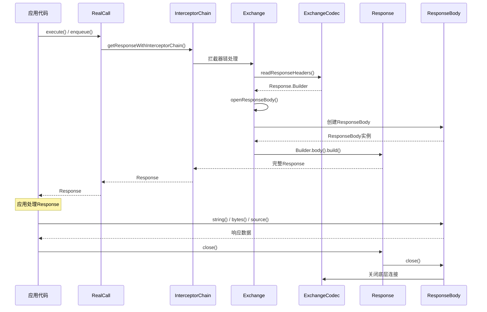
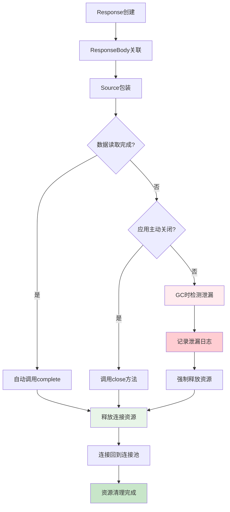
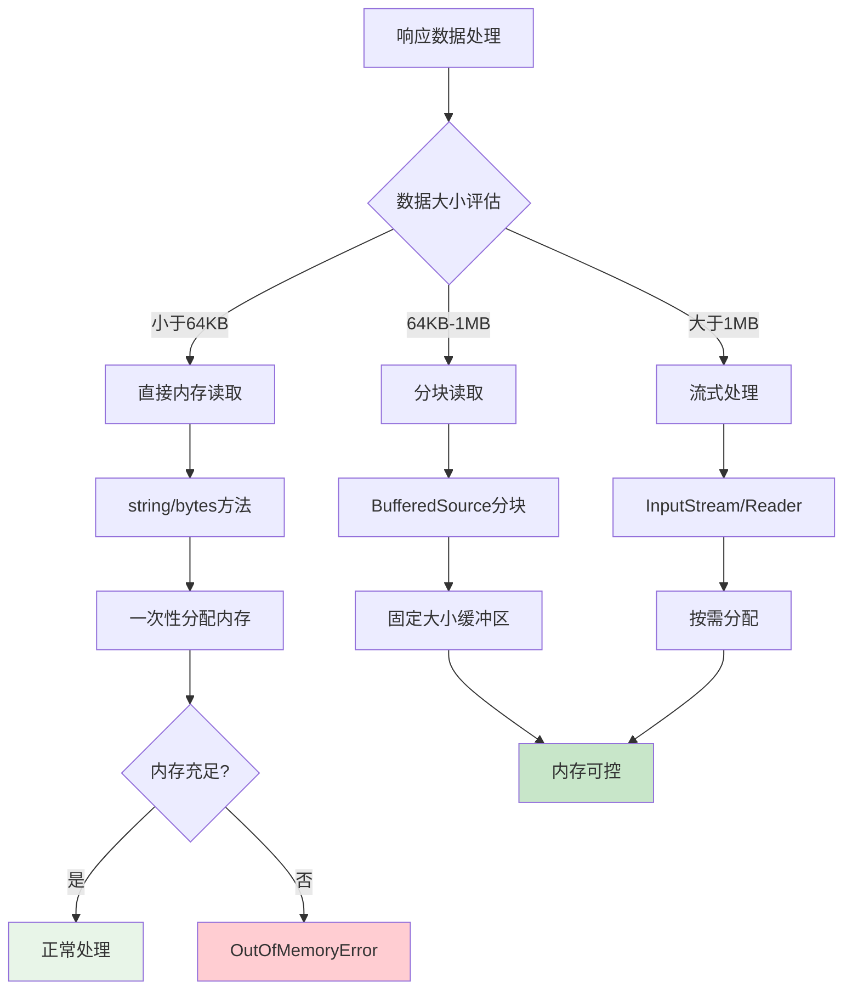
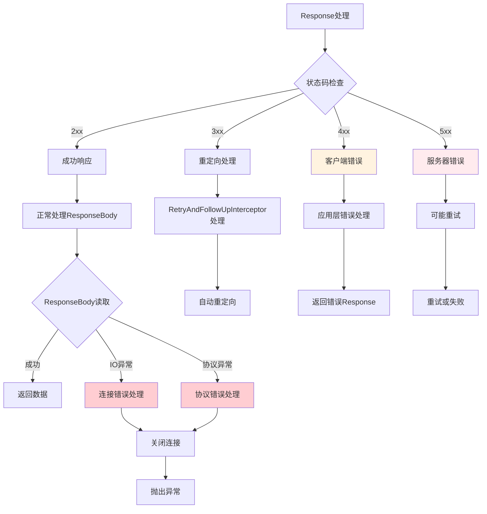
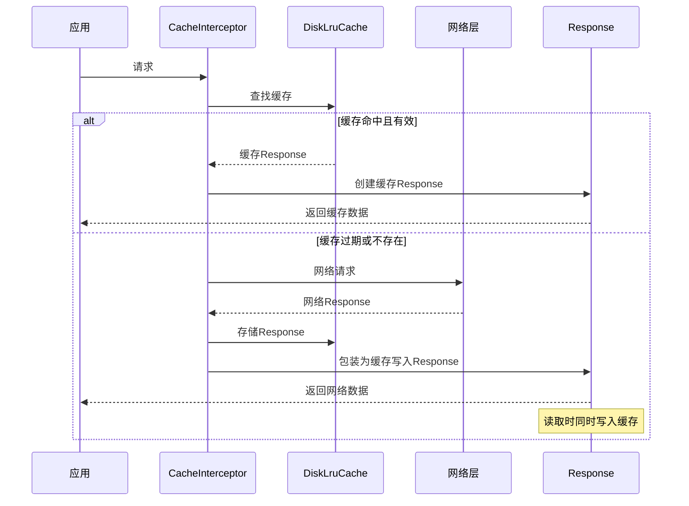
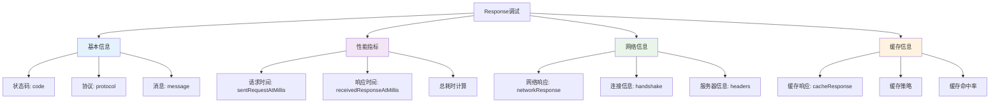

# OkHttp Response返回方法设计流程深度分析

## 1. 概述

Response是OkHttp中表示HTTP响应的核心类，它封装了服务器返回的所有信息，包括状态码、响应头、响应体等。本文档深入分析Response的设计架构、创建流程、数据处理机制以及各种优化策略。

## 2. Response架构设计

### 2.1 

## 3. Response创建详细流程

### 3.1 HTTP/1.1响应解析

#### 3.1.1 状态行解析

```java
// Http1ExchangeCodec.java
@Override public Response.Builder readResponseHeaders(boolean expectContinue) throws IOException {
    try {
        StatusLine statusLine = StatusLine.parse(readHeaderLine());

        Response.Builder responseBuilder = new Response.Builder()
            .protocol(statusLine.protocol)
            .code(statusLine.code)
            .message(statusLine.message)
            .headers(readHeaders());

        if (expectContinue && statusLine.code == HTTP_CONTINUE) {
            return null;
        } else if (statusLine.code == HTTP_CONTINUE) {
            return responseBuilder;
        }

        return responseBuilder;
    } catch (EOFException e) {
        // Provide more context if the server ends the stream before sending a response.
        String address = "unknown";
        if (realConnection != null) {
            address = realConnection.route().address().url().redact();
        }
        throw new IOException("unexpected end of stream on " + address, e);
    }
}
```

#### 3.1.2 状态行解析流程图

#### 3.1.3 StatusLine解析实现

```java
public final class StatusLine {
    public static final int HTTP_CONTINUE = 100;
    public static final int HTTP_TEMP_REDIRECT = 307;
    public static final int HTTP_PERM_REDIRECT = 308;

    public final Protocol protocol;
    public final int code;
    public final String message;

    public StatusLine(Protocol protocol, int code, String message) {
        this.protocol = protocol;
        this.code = code;
        this.message = message;
    }

    public static StatusLine parse(String statusLine) throws IOException {
        // H T T P / 1 . 1   2 0 0   T e m p o r a r y   R e d i r e c t
        // 0 1 2 3 4 5 6 7 8 9 0 1 2 3 4 5 6 7 8 9 0 1 2 3 4 5 6 7 8 9 0

        int codeStart;
        Protocol protocol;
        if (statusLine.startsWith("HTTP/1.")) {
            if (statusLine.length() < 9 || statusLine.charAt(8) != ' ') {
                throw new ProtocolException("Unexpected status line: " + statusLine);
            }
            int httpMinorVersion = statusLine.charAt(7) - '0';
            codeStart = 9;
            if (httpMinorVersion == 0) {
                protocol = Protocol.HTTP_1_0;
            } else if (httpMinorVersion == 1) {
                protocol = Protocol.HTTP_1_1;
            } else {
                throw new ProtocolException("Unexpected status line: " + statusLine);
            }
        } else if (statusLine.startsWith("ICY ")) {
            // Shoutcast uses ICY instead of "HTTP/1.0".
            protocol = Protocol.HTTP_1_0;
            codeStart = 4;
        } else {
            throw new ProtocolException("Unexpected status line: " + statusLine);
        }

        // Parse response code like "200". Always 3 digits.
        if (statusLine.length() < codeStart + 3) {
            throw new ProtocolException("Unexpected status line: " + statusLine);
        }
        int code;
        try {
            code = Integer.parseInt(statusLine.substring(codeStart, codeStart + 3));
        } catch (NumberFormatException e) {
            throw new ProtocolException("Unexpected status line: " + statusLine);
        }

        // Parse an optional response message like "OK" or "Not Modified". If it
        // exists, it is separated from the response code by a space.
        String message = "";
        if (statusLine.length() > codeStart + 3) {
            if (statusLine.charAt(codeStart + 3) != ' ') {
                throw new ProtocolException("Unexpected status line: " + statusLine);
            }
            message = statusLine.substring(codeStart + 4);
        }

        return new StatusLine(protocol, code, message);
    }

    @Override public String toString() {
        StringBuilder result = new StringBuilder();
        result.append(protocol == Protocol.HTTP_1_0 ? "HTTP/1.0" : "HTTP/1.1");
        result.append(' ').append(code);
        if (message != null) {
            result.append(' ').append(message);
        }
        return result.toString();
    }
}
```

### 3.2 响应头解析

#### 3.2.1 Headers解析流程



#### 3.2.2 Headers类实现分析

```java
public final class Headers {
    private final String[] namesAndValues;

    Headers(Builder builder) {
        this.namesAndValues = builder.namesAndValues.toArray(new String[builder.namesAndValues.size()]);
    }

    /** Returns the last value corresponding to the specified field, or null. */
    public @Nullable String get(String name) {
        return get(namesAndValues, name);
    }

    /**
     * Returns the last value corresponding to the specified field parsed as an HTTP date, or null if
     * either the field is absent or cannot be parsed as a date.
     */
    public @Nullable Date getDate(String name) {
        String value = get(name);
        return value != null ? HttpDate.parse(value) : null;
    }

    /** Returns the number of field values. */
    public int size() {
        return namesAndValues.length / 2;
    }

    /** Returns the field name at {@code index}. */
    public String name(int index) {
        return namesAndValues[index * 2];
    }

    /** Returns the field value at {@code index}. */
    public String value(int index) {
        return namesAndValues[index * 2 + 1];
    }

    /** Returns an immutable list of the header values for {@code name}. */
    public List<String> values(String name) {
        List<String> result = null;
        for (int i = 0, size = size(); i < size; i++) {
            if (name.equalsIgnoreCase(name(i))) {
                if (result == null) result = new ArrayList<>(2);
                result.add(value(i));
            }
        }
        return result != null ? Collections.unmodifiableList(result) : Collections.emptyList();
    }

    private static String get(String[] namesAndValues, String name) {
        for (int i = namesAndValues.length - 2; i >= 0; i -= 2) {
            if (name.equalsIgnoreCase(namesAndValues[i])) {
                return namesAndValues[i + 1];
            }
        }
        return null;
    }

    public static final class Builder {
        final List<String> namesAndValues = new ArrayList<>(20);

        /** Add a field with the specified value. */
        public Builder add(String name, String value) {
            checkName(name);
            checkValue(value, name);
            addLenient(name, value);
            return this;
        }

        /** Add a field with the specified value without any validation. */
        Builder addLenient(String name, String value) {
            namesAndValues.add(name);
            namesAndValues.add(value);
            return this;
        }

        public Headers build() {
            return new Headers(this);
        }
    }
}
```

### 3.3 HTTP/2响应处理

#### 3.3.1 HTTP/2响应流程



#### 3.3.2 HTTP/2伪头部处理

```java
// Http2ExchangeCodec.java
@Override public Response.Builder readResponseHeaders(boolean expectContinue) throws IOException {
    Headers headers = stream.takeHeaders();
    Response.Builder responseBuilder = readHttp2HeadersList(headers, protocol);
    if (expectContinue && Internal.instance.code(responseBuilder) == HTTP_CONTINUE) {
        return null;
    }
    return responseBuilder;
}

/** Returns headers for a name value block containing an HTTP/2 response. */
public static Response.Builder readHttp2HeadersList(Headers headerBlock, Protocol protocol)
    throws IOException {
    String status = null;
    String statusMessage = "";

    Headers.Builder headersBuilder = new Headers.Builder();
    for (int i = 0, size = headerBlock.size(); i < size; i++) {
        String name = headerBlock.name(i);
        String value = headerBlock.value(i);
        if (":status".equals(name)) {
            status = value;
            if (value.length() > 3) {
                statusMessage = value.substring(4);
            }
        } else if (!HTTP_2_SKIPPED_RESPONSE_HEADERS.contains(name)) {
            Internal.instance.addLenient(headersBuilder, name, value);
        }
    }
    if (status == null) throw new ProtocolException("Expected ':status' header");

    StatusLine statusLine = StatusLine.parse("HTTP/1.1 " + status + " " + statusMessage);
    return new Response.Builder()
        .protocol(protocol)
        .code(statusLine.code)
        .message(statusLine.message)
        .headers(headersBuilder.build());
}
```

## 4. ResponseBody设计与实现

### 4.1 ResponseBody架构设计



### 4.2 ResponseBody创建流程

#### 4.2.1 普通ResponseBody创建

```java
// Exchange.java
public ResponseBody openResponseBody(Response response) throws IOException {
    try {
        eventListener.responseBodyStart(call);
        String contentType = response.header("Content-Type");
        long contentLength = codec.reportedContentLength(response);
        Source rawSource = codec.openResponseBodySource(response);
        ResponseBodySource source = new ResponseBodySource(rawSource, contentLength);
        return new RealResponseBody(contentType, contentLength, Okio.buffer(source));
    } catch (IOException e) {
        eventListener.responseFailed(call, e);
        trackFailure(e);
        throw e;
    }
}
```

#### 4.2.2 缓存写入ResponseBody

```java
// CacheInterceptor.java
private Response cacheWritingResponse(final CacheRequest cacheRequest, Response response)
    throws IOException {
    if (cacheRequest == null) return response;
    Sink cacheBodyUnbuffered = cacheRequest.body();
    if (cacheBodyUnbuffered == null) return response;

    final BufferedSource source = response.body().source();
    final BufferedSink cacheBody = Okio.buffer(cacheBodyUnbuffered);

    Source cacheWritingSource = new Source() {
        boolean cacheRequestClosed;

        @Override public long read(Buffer sink, long byteCount) throws IOException {
            long bytesRead;
            try {
                bytesRead = source.read(sink, byteCount);
            } catch (IOException e) {
                if (!cacheRequestClosed) {
                    cacheRequestClosed = true;
                    cacheRequest.abort();
                }
                throw e;
            }

            if (bytesRead == -1) {
                if (!cacheRequestClosed) {
                    cacheRequestClosed = true;
                    cacheBody.close();
                }
                return -1;
            }

            sink.copyTo(cacheBody.buffer(), sink.size() - bytesRead, bytesRead);
            cacheBody.emitCompleteSegments();
            return bytesRead;
        }

        @Override public Timeout timeout() {
            return source.timeout();
        }

        @Override public void close() throws IOException {
            if (!cacheRequestClosed
                && !discard(this, ExchangeCodec.DISCARD_STREAM_TIMEOUT_MILLIS, MILLISECONDS)) {
                cacheRequestClosed = true;
                cacheRequest.abort();
            }
            source.close();
        }
    };

    String contentType = response.header("Content-Type");
    long contentLength = response.body().contentLength();
    return response.newBuilder()
        .body(new RealResponseBody(contentType, contentLength, Okio.buffer(cacheWritingSource)))
        .build();
}
```

### 4.3 ResponseBody数据读取

#### 4.3.1 数据读取方式对比



#### 4.3.2 ResponseBody读取实现

```java
public abstract class ResponseBody implements Closeable {
    /** Returns the response as a string decoded with the charset of the Content-Type header. */
    public final String string() throws IOException {
        BufferedSource source = source();
        try {
            Charset charset = Util.bomAwareCharset(source, charset());
            return source.readString(charset);
        } finally {
            Util.closeQuietly(source);
        }
    }

    /** Returns the response as a byte array. */
    public final byte[] bytes() throws IOException {
        long contentLength = contentLength();
        if (contentLength > Integer.MAX_VALUE) {
            throw new IOException("Cannot buffer entire body for content length: " + contentLength);
        }

        BufferedSource source = source();
        byte[] bytes;
        try {
            bytes = source.readByteArray();
        } finally {
            Util.closeQuietly(source);
        }
        if (contentLength != -1 && contentLength != bytes.length) {
            throw new IOException("Content-Length ("
                + contentLength
                + ") and stream length ("
                + bytes.length
                + ") disagree");
        }
        return bytes;
    }

    /** Returns the response as an input stream. */
    public final InputStream byteStream() {
        return source().inputStream();
    }

    /** Returns the response as a character stream. */
    public final Reader charStream() {
        Reader reader = charStream;
        return reader != null ? reader : (charStream = new BomAwareReader(source(), charset()));
    }
}
```

## 5. Response生命周期管理

### 5.1 Response创建到销毁流程



### 5.2 资源管理机制

#### 5.2.1 自动资源管理

```java
// Exchange.ResponseBodySource
final class ResponseBodySource extends ForwardingSource {
    private final long contentLength;
    private long bytesReceived;
    private boolean completed;
    private boolean closed;

    @Override public long read(Buffer sink, long byteCount) throws IOException {
        if (closed) throw new IllegalStateException("closed");
        try {
            long read = delegate().read(sink, byteCount);
            if (read == -1L) {
                complete(null);
                return -1L;
            }

            long newBytesReceived = bytesReceived + read;
            if (contentLength != -1L && newBytesReceived > contentLength) {
                throw new ProtocolException("expected " + contentLength
                    + " bytes but received " + newBytesReceived);
            }

            bytesReceived = newBytesReceived;
            if (newBytesReceived == contentLength) {
                complete(null);
            }

            return read;
        } catch (IOException e) {
            throw complete(e);
        }
    }

    @Override public void close() throws IOException {
        if (closed) return;
        closed = true;
        try {
            super.close();
            complete(null);
        } catch (IOException e) {
            throw complete(e);
        }
    }

    @Nullable IOException complete(@Nullable IOException e) {
        if (completed) return e;
        completed = true;
        return bodyComplete(bytesReceived, true, false, e);
    }
}
```

#### 5.2.2 资源泄漏防护



## 6. 协议适配与优化

### 6.1 HTTP/1.1 vs HTTP/2响应处理差异

| 特性 | HTTP/1.1 | HTTP/2 |
|------|----------|--------|
| 状态行格式 | `HTTP/1.1 200 OK` | `:status: 200` |
| 头部格式 | 文本行 | 二进制帧 |
| 多路复用 | 不支持 | 支持 |
| 服务器推送 | 不支持 | 支持 |
| 头部压缩 | 不支持 | HPACK压缩 |
| 流控制 | TCP层 | 应用层 |

### 6.2 协议适配实现

```java
// ExchangeCodec接口统一协议处理
public interface ExchangeCodec {
    /** Returns an output stream where the request body can be streamed. */
    Sink createRequestBody(Request request, long contentLength) throws IOException;

    /** This should update the HTTP engine's sentRequestMillis field. */
    void writeRequestHeaders(Request request) throws IOException;

    /** Flush the request to the underlying socket. */
    void flushRequest() throws IOException;

    /** Flush the request to the underlying socket and signal no more bytes will be transmitted. */
    void finishRequest() throws IOException;

    /**
     * Parses bytes of a response header from an HTTP transport.
     *
     * @param expectContinue true to return null if this is an intermediate response with a "100"
     *     response code. Otherwise intermediate responses are forbidden.
     */
    @Nullable Response.Builder readResponseHeaders(boolean expectContinue) throws IOException;

    /** Returns the trailer after the HTTP response, which may be empty. */
    Headers trailers() throws IOException;

    /**
     * Returns a stream that reads the response body. If {@code expectContinue} is true and the
     * response doesn't have a body, this may return null to indicate that the response is malformed
     * (which is not necessarily an error: in this case the caller should proceed to read the next
     * response).
     */
    Source openResponseBodySource(Response response) throws IOException;

    /**
     * Returns the content length or -1 if it is unknown.
     */
    long reportedContentLength(Response response) throws IOException;

    /** Cancel this stream. */
    void cancel();

    RealConnection connection();
}
```

### 6.3 性能优化策略

#### 6.3.1 内存优化



#### 6.3.2 连接复用优化

```java
// RealConnection.java
public boolean isEligible(Address address, @Nullable List<Route> routes) {
    // If this connection is not accepting new exchanges, we're done.
    if (transmitters.size() >= allocationLimit || noNewExchanges) return false;

    // If the non-host fields of the address don't overlap, we're done.
    if (!Internal.instance.equalsNonHost(this.route.address(), address)) return false;

    // If the host exactly matches, we're done: this connection can carry the address.
    if (address.url().host().equals(this.route().address().url().host())) {
        return true; // This connection is a perfect match.
    }

    // At this point we don't have a hostname match. But we still be able to carry the request if
    // our connection coalescing requirements are met. See also:
    // https://hpbn.co/optimizing-application-delivery/#eliminate-domain-sharding
    // https://daniel.haxx.se/blog/2016/08/18/http2-connection-coalescing/

    // 1. This connection must be HTTP/2.
    if (http2Connection == null) return false;

    // 2. The routes must share an IP address.
    if (routes == null || !routeMatchesAny(routes)) return false;

    // 3. This connection's server certificate's must cover the new host.
    if (address.hostnameVerifier() != OkHostnameVerifier.INSTANCE) return false;
    if (!supportsUrl(address.url())) return false;

    // 4. Certificate pinning must match the host.
    try {
        address.certificatePinner().check(address.url().host(), handshake().peerCertificates());
    } catch (SSLPeerUnverifiedException e) {
        return false;
    }

    return true; // The caller's address can be carried by this connection.
}
```

## 7. 错误处理与异常管理

### 7.1 Response错误处理策略



### 7.2 异常处理实现

```java
// Response.java
public boolean isSuccessful() {
    return code >= 200 && code < 300;
}

public boolean isRedirect() {
    switch (code) {
        case HTTP_PERM_REDIRECT:
        case HTTP_TEMP_REDIRECT:
        case HTTP_MULT_CHOICE:
        case HTTP_MOVED_PERM:
        case HTTP_MOVED_TEMP:
        case HTTP_SEE_OTHER:
            return true;
        default:
            return false;
    }
}

// ResponseBody读取异常处理
public final String string() throws IOException {
    BufferedSource source = source();
    try {
        Charset charset = Util.bomAwareCharset(source, charset());
        return source.readString(charset);
    } catch (IOException e) {
        // 确保资源被正确关闭
        Util.closeQuietly(source);
        throw e;
    } finally {
        Util.closeQuietly(source);
    }
}
```

## 8. 缓存集成与优化

### 8.1 Response缓存机制



### 8.2 缓存Response实现

```java
// CacheInterceptor.java - 缓存Response创建
if (cacheResponse != null) {
    if (networkResponse.code() == HTTP_NOT_MODIFIED) {
        Response response = cacheResponse.newBuilder()
            .headers(combine(cacheResponse.headers(), networkResponse.headers()))
            .sentRequestAtMillis(networkResponse.sentRequestAtMillis())
            .receivedResponseAtMillis(networkResponse.receivedResponseAtMillis())
            .cacheResponse(stripBody(cacheResponse))
            .networkResponse(stripBody(networkResponse))
            .build();
        networkResponse.body().close();

        // Update the cache after combining headers but before stripping the
        // Content-Encoding header (as performed by initContentStream()).
        cache.trackConditionalCacheHit();
        cache.update(cacheResponse, response);
        return response;
    } else {
        closeQuietly(cacheResponse.body());
    }
}

Response response = networkResponse.newBuilder()
    .cacheResponse(stripBody(cacheResponse))
    .networkResponse(stripBody(networkResponse))
    .build();

if (cache != null) {
    if (HttpHeaders.hasBody(response) && CacheStrategy.isCacheable(response, networkRequest)) {
        // Offer this request to the cache.
        CacheRequest cacheRequest = cache.put(response);
        return cacheWritingResponse(cacheRequest, response);
    }
}
```

## 9. 监控与调试

### 9.1 Response事件监听

```java
// EventListener.java - Response相关事件
public abstract class EventListener {
    public void responseHeadersStart(Call call) {}
    public void responseHeadersEnd(Call call, Response response) {}
    public void responseBodyStart(Call call) {}
    public void responseBodyEnd(Call call, long byteCount) {}
    public void responseFailed(Call call, IOException ioe) {}
}

// 使用示例
OkHttpClient client = new OkHttpClient.Builder()
    .eventListener(new EventListener() {
        @Override public void responseHeadersEnd(Call call, Response response) {
            System.out.println("Response headers: " + response.headers());
        }
        
        @Override public void responseBodyEnd(Call call, long byteCount) {
            System.out.println("Response body size: " + byteCount + " bytes");
        }
    })
    .build();
```

### 9.2 Response调试信息



## 10. 最佳实践与使用建议

### 10.1 Response使用最佳实践

#### 10.1.1 正确的资源管理

```java
// ✅ 正确的使用方式
Response response = client.newCall(request).execute();
try {
    if (response.isSuccessful()) {
        String result = response.body().string();
        // 处理结果
    }
} finally {
    response.close(); // 确保资源被释放
}

// ✅ 使用try-with-resources
try (Response response = client.newCall(request).execute()) {
    if (response.isSuccessful()) {
        String result = response.body().string();
        // 处理结果
    }
}

// ❌ 错误的使用方式
Response response = client.newCall(request).execute();
String result = response.body().string();
// 忘记关闭response，可能导致连接泄漏
```

#### 10.1.2 大文件处理

```java
// ✅ 流式处理大文件
try (Response response = client.newCall(request).execute()) {
    if (response.isSuccessful()) {
        try (InputStream inputStream = response.body().byteStream();
             FileOutputStream outputStream = new FileOutputStream("large_file.dat")) {
            
            byte[] buffer = new byte[8192];
            int bytesRead;
            while ((bytesRead = inputStream.read(buffer)) != -1) {
                outputStream.write(buffer, 0, bytesRead);
            }
        }
    }
}

// ❌ 错误的大文件处理
try (Response response = client.newCall(request).execute()) {
    byte[] data = response.body().bytes(); // 可能导致OOM
    Files.write(Paths.get("large_file.dat"), data);
}
```

### 10.2 性能优化建议

#### 10.2.1 Response读取优化

```java
// 1. 根据Content-Length选择读取方式
long contentLength = response.body().contentLength();
if (contentLength > 0 && contentLength < 1024 * 1024) { // 小于1MB
    String result = response.body().string();
} else {
    // 使用流式读取
    try (BufferedSource source = response.body().source()) {
        // 分块处理
    }
}

// 2. 预估内存使用
MediaType mediaType = response.body().contentType();
if (mediaType != null && mediaType.type().equals("application")) {
    // JSON/XML等结构化数据，可以直接读取
    String json = response.body().string();
} else {
    // 二进制数据，使用流式处理
    InputStream stream = response.body().byteStream();
}
```

#### 10.2.2 缓存优化配置

```java
// 配置合适的缓存
Cache cache = new Cache(cacheDir, 50 * 1024 * 1024); // 50MB缓存
OkHttpClient client = new OkHttpClient.Builder()
    .cache(cache)
    .build();

// 缓存控制
Request request = new Request.Builder()
    .url(url)
    .cacheControl(new CacheControl.Builder()
        .maxAge(5, TimeUnit.MINUTES)
        .build())
    .build();
```

## 11. 总结

### 11.1 Response设计优势

1. **统一的抽象模型**
   - 屏蔽了HTTP/1.1和HTTP/2的协议差异
   - 提供了一致的API接口
   - 支持多种数据读取方式

2. **高效的内存管理**
   - 流式数据处理，避免大文件OOM
   - 自动资源管理和泄漏检测
   - 智能的缓存策略

3. **强大的扩展性**
   - 支持自定义ResponseBody实现
   - 丰富的事件监听机制
   - 灵活的拦截器集成

4. **完善的错误处理**
   - 多层次的异常处理机制
   - 自动重试和恢复策略
   - 详细的调试信息

### 11.2 架构价值

OkHttp的Response设计体现了以下架构价值：

- **抽象与封装**：隐藏协议复杂性，提供简洁API
- **性能优化**：流式处理、连接复用、智能缓存
- **资源管理**：自动化的生命周期管理
- **可扩展性**：灵活的插件机制和事件系统
- **健壮性**：完善的错误处理和恢复机制

这种设计使得OkHttp能够高效处理各种HTTP响应场景，从简单的API调用到大文件下载，都能提供优秀的性能和用户体验。

---

*本文档基于OkHttp源码深度分析，全面阐述了Response返回方法的设计原理、实现机制和最佳实践，为开发者提供了完整的技术参考。*