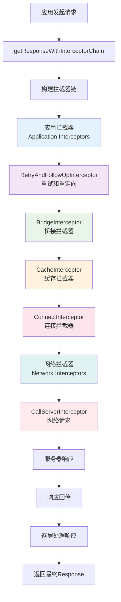
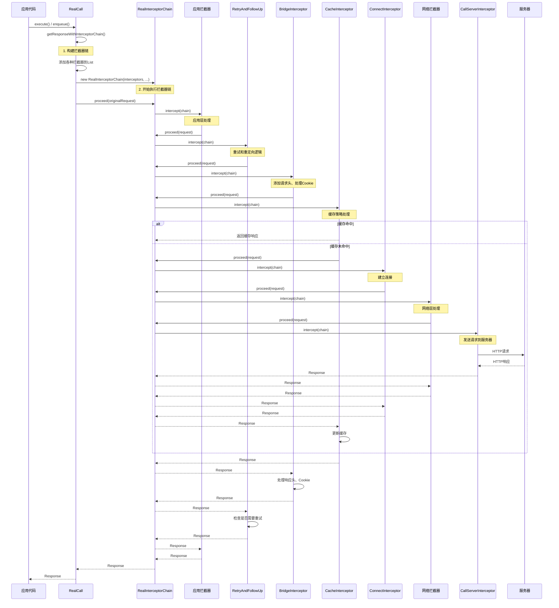
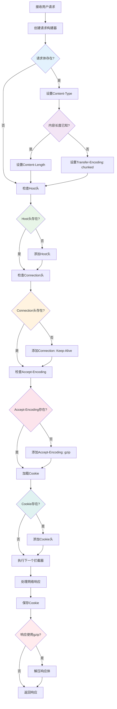
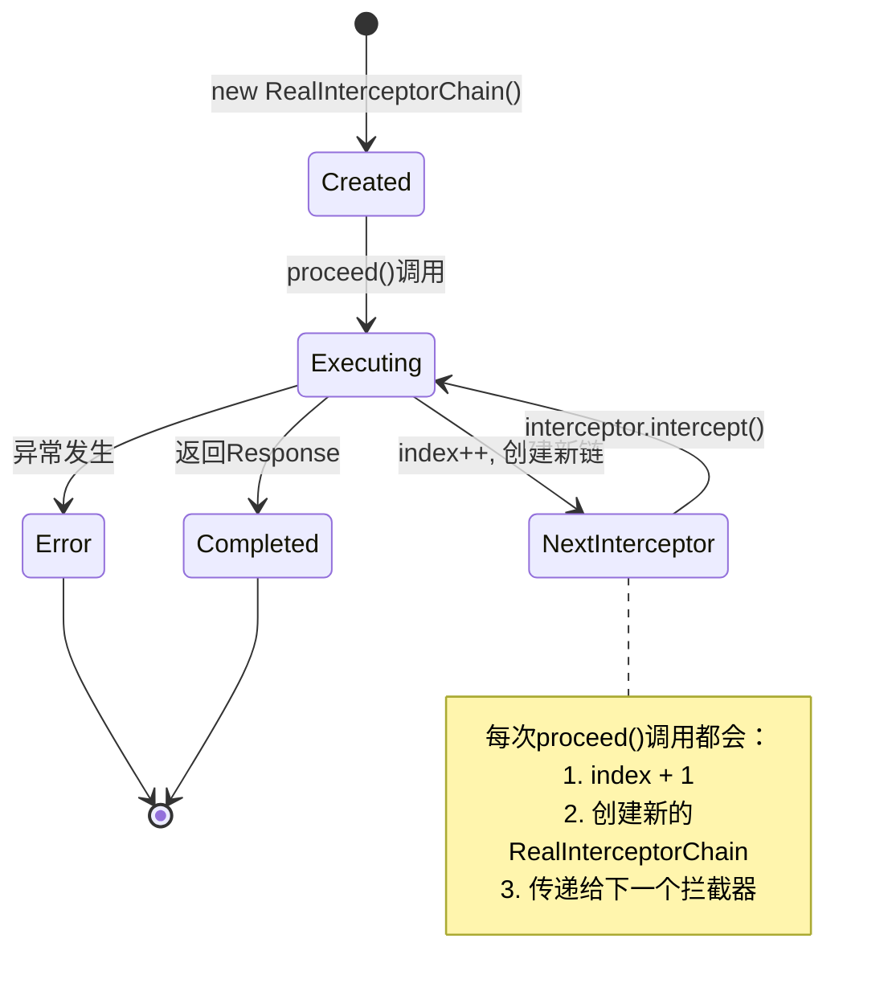
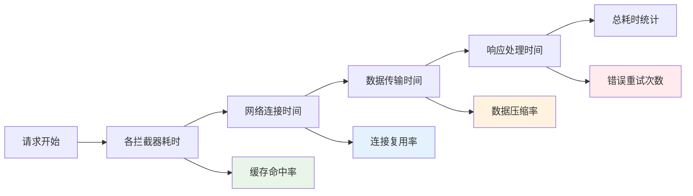

# OkHttp getResponseWithInterceptorChain方法设计流程深度分析

## 1. 概述

`getResponseWithInterceptorChain()` 是OkHttp架构的核心方法，它实现了责任链模式，通过一系列拦截器来处理HTTP请求和响应。这个方法体现了OkHttp的设计精髓：将复杂的网络请求处理过程分解为多个独立的、可组合的拦截器。

### 1.1 核心职责

- **拦截器链构建**：组装所有必要的拦截器
- **请求流转控制**：管理请求在拦截器间的传递
- **异常处理机制**：统一处理各种异常情况
- **资源生命周期管理**：确保连接和资源的正确释放

## 2. 整体架构设计

### 2.1 拦截器架构图



### 2.2 拦截器类关系图

## 3. getResponseWithInterceptorChain方法详细分析

### 3.1 源码解析

```java
Response getResponseWithInterceptorChain() throws IOException {
    // Build a full stack of interceptors.
    List<Interceptor> interceptors = new ArrayList<>();
    
    // 1. 添加应用层自定义拦截器
    interceptors.addAll(client.interceptors());
    
    // 2. 添加重试和重定向拦截器
    interceptors.add(new RetryAndFollowUpInterceptor(client));
    
    // 3. 添加桥接拦截器（处理请求头、Cookie等）
    interceptors.add(new BridgeInterceptor(client.cookieJar()));
    
    // 4. 添加缓存拦截器
    interceptors.add(new CacheInterceptor(client.internalCache()));
    
    // 5. 添加连接拦截器
    interceptors.add(new ConnectInterceptor(client));
    
    // 6. 添加网络层自定义拦截器（仅非WebSocket）
    if (!forWebSocket) {
        interceptors.addAll(client.networkInterceptors());
    }
    
    // 7. 添加网络请求拦截器
    interceptors.add(new CallServerInterceptor(forWebSocket));

    // 8. 创建拦截器链
    Interceptor.Chain chain = new RealInterceptorChain(
        interceptors, transmitter, null, 0,
        originalRequest, this, client.connectTimeoutMillis(),
        client.readTimeoutMillis(), client.writeTimeoutMillis()
    );

    boolean calledNoMoreExchanges = false;
    try {
        // 9. 启动拦截器链执行
        Response response = chain.proceed(originalRequest);
        if (transmitter.isCanceled()) {
            closeQuietly(response);
            throw new IOException("Canceled");
        }
        return response;
    } catch (IOException e) {
        calledNoMoreExchanges = true;
        throw transmitter.noMoreExchanges(e);
    } finally {
        if (!calledNoMoreExchanges) {
            transmitter.noMoreExchanges(null);
        }
    }
}
```

### 3.2 拦截器链执行时序图



## 4. 各拦截器详细分析

### 4.1 RetryAndFollowUpInterceptor（重试和重定向拦截器）

#### 4.1.1 
#### 4.1.2 处理流程图

#### 4.1.3 关键代码分析

```java
@Override public Response intercept(Chain chain) throws IOException {
    Request request = chain.request();
    RealInterceptorChain realChain = (RealInterceptorChain) chain;
    Transmitter transmitter = realChain.transmitter();

    int followUpCount = 0;
    Response priorResponse = null;
    
    while (true) {  // 无限循环处理重试和重定向
        transmitter.prepareToConnect(request);

        if (transmitter.isCanceled()) {
            throw new IOException("Canceled");
        }

        Response response;
        boolean success = false;
        try {
            response = realChain.proceed(request, transmitter, null);
            success = true;
        } catch (RouteException e) {
            // 路由异常处理
            if (!recover(e.getLastConnectException(), transmitter, false, request)) {
                throw e.getFirstConnectException();
            }
            continue;
        } catch (IOException e) {
            // IO异常处理
            boolean requestSendStarted = !(e instanceof ConnectionShutdownException);
            if (!recover(e, transmitter, requestSendStarted, request)) throw e;
            continue;
        } finally {
            if (!success) {
                transmitter.exchangeDoneDueToException();
            }
        }

        // 检查是否需要重定向
        Request followUp = followUpRequest(response, route);
        if (followUp == null) {
            return response;  // 不需要重定向，返回响应
        }

        // 检查重定向次数限制
        if (++followUpCount > MAX_FOLLOW_UPS) {
            throw new ProtocolException("Too many follow-up requests: " + followUpCount);
        }

        request = followUp;
        priorResponse = response;
    }
}
```

### 4.2 BridgeInterceptor（桥接拦截器）

#### 4.2.1 核心功能
- **请求头处理**：添加必要的HTTP请求头
- **内容编码**：处理Content-Type、Content-Length等
- **Cookie管理**：自动处理Cookie的发送和接收
- **压缩处理**：自动添加Accept-Encoding并处理响应解压

#### 4.2.2 请求处理流程



#### 4.2.3 关键代码分析

```java
@Override public Response intercept(Chain chain) throws IOException {
    Request userRequest = chain.request();
    Request.Builder requestBuilder = userRequest.newBuilder();

    // 处理请求体相关头部
    RequestBody body = userRequest.body();
    if (body != null) {
        MediaType contentType = body.contentType();
        if (contentType != null) {
            requestBuilder.header("Content-Type", contentType.toString());
        }

        long contentLength = body.contentLength();
        if (contentLength != -1) {
            requestBuilder.header("Content-Length", Long.toString(contentLength));
            requestBuilder.removeHeader("Transfer-Encoding");
        } else {
            requestBuilder.header("Transfer-Encoding", "chunked");
            requestBuilder.removeHeader("Content-Length");
        }
    }

    // 添加必要的请求头
    if (userRequest.header("Host") == null) {
        requestBuilder.header("Host", hostHeader(userRequest.url(), false));
    }

    if (userRequest.header("Connection") == null) {
        requestBuilder.header("Connection", "Keep-Alive");
    }

    // 处理压缩
    boolean transparentGzip = false;
    if (userRequest.header("Accept-Encoding") == null && userRequest.header("Range") == null) {
        transparentGzip = true;
        requestBuilder.header("Accept-Encoding", "gzip");
    }

    // 处理Cookie
    List<Cookie> cookies = cookieJar.loadForRequest(userRequest.url());
    if (!cookies.isEmpty()) {
        requestBuilder.header("Cookie", cookieHeader(cookies));
    }

    // 执行网络请求
    Response networkResponse = chain.proceed(requestBuilder.build());

    // 保存响应Cookie
    HttpHeaders.receiveHeaders(cookieJar, userRequest.url(), networkResponse.headers());

    // 处理响应
    Response.Builder responseBuilder = networkResponse.newBuilder()
        .request(userRequest);

    // 处理gzip解压
    if (transparentGzip
        && "gzip".equalsIgnoreCase(networkResponse.header("Content-Encoding"))
        && HttpHeaders.hasBody(networkResponse)) {
        GzipSource responseBody = new GzipSource(networkResponse.body().source());
        Headers strippedHeaders = networkResponse.headers().newBuilder()
            .removeAll("Content-Encoding")
            .removeAll("Content-Length")
            .build();
        responseBuilder.headers(strippedHeaders);
        String contentType = networkResponse.header("Content-Type");
        responseBuilder.body(new RealResponseBody(contentType, -1L, Okio.buffer(responseBody)));
    }

    return responseBuilder.build();
}
```

### 4.3 CacheInterceptor（缓存拦截器）

#### 4.3.1 
#### 4.3.2 缓存策略流程图

#### 4.3.3 缓存策略类

```java
public final class CacheStrategy {
    /** 网络请求，如果为null则不使用网络 */
    public final @Nullable Request networkRequest;
    
    /** 缓存响应，如果为null则不使用缓存 */
    public final @Nullable Response cacheResponse;

    CacheStrategy(Request networkRequest, Response cacheResponse) {
        this.networkRequest = networkRequest;
        this.cacheResponse = cacheResponse;
    }

    /**
     * 缓存策略工厂类，根据请求和缓存响应计算最佳策略
     */
    public static class Factory {
        final long nowMillis;
        final Request request;
        final Response cacheResponse;
        
        /** 缓存响应的Date头部时间 */
        private Date servedDate;
        
        /** 缓存响应的Last-Modified头部时间 */
        private Date lastModified;
        
        /** 缓存响应的Expires头部时间 */
        private Date expires;
        
        /** 缓存响应的max-age指令值 */
        private long sentRequestMillis;
        private long receivedResponseMillis;
        private String etag;
        private int ageSeconds = -1;

        public CacheStrategy get() {
            CacheStrategy candidate = getCandidate();
            
            // 如果网络请求存在但没有网络连接，返回失败响应
            if (candidate.networkRequest != null && request.cacheControl().onlyIfCached()) {
                return new CacheStrategy(null, null);
            }
            
            return candidate;
        }

        private CacheStrategy getCandidate() {
            // 没有缓存响应，必须使用网络
            if (cacheResponse == null) {
                return new CacheStrategy(request, null);
            }

            // HTTPS请求但缺少握手信息，必须使用网络
            if (request.isHttps() && cacheResponse.handshake() == null) {
                return new CacheStrategy(request, null);
            }

            // 检查响应是否可缓存
            if (!isCacheable(cacheResponse, request)) {
                return new CacheStrategy(request, null);
            }

            CacheControl requestCaching = request.cacheControl();
            
            // 请求指定不使用缓存
            if (requestCaching.noCache() || hasConditions(request)) {
                return new CacheStrategy(request, null);
            }

            CacheControl responseCaching = cacheResponse.cacheControl();
            
            // 计算缓存年龄
            long ageMillis = cacheAgeMillis();
            long freshMillis = computeFreshnessLifetime();
            
            if (requestCaching.maxAgeSeconds() != -1) {
                freshMillis = Math.min(freshMillis, SECONDS.toMillis(requestCaching.maxAgeSeconds()));
            }

            long minFreshMillis = 0;
            if (requestCaching.minFreshSeconds() != -1) {
                minFreshMillis = SECONDS.toMillis(requestCaching.minFreshSeconds());
            }

            long maxStaleMillis = 0;
            if (!responseCaching.mustRevalidate() && requestCaching.maxStaleSeconds() != -1) {
                maxStaleMillis = SECONDS.toMillis(requestCaching.maxStaleSeconds());
            }

            // 缓存仍然新鲜
            if (!responseCaching.noCache() && ageMillis + minFreshMillis < freshMillis + maxStaleMillis) {
                Response.Builder builder = cacheResponse.newBuilder();
                if (ageMillis + minFreshMillis >= freshMillis) {
                    builder.addHeader("Warning", "110 HttpURLConnection \"Response is stale\"");
                }
                if (ageMillis > 24 * 60 * 60 * 1000L && isFreshnessLifetimeHeuristic()) {
                    builder.addHeader("Warning", "113 HttpURLConnection \"Heuristic expiration\"");
                }
                return new CacheStrategy(null, builder.build());
            }

            // 缓存过期，需要条件请求验证
            String conditionName;
            String conditionValue;
            if (etag != null) {
                conditionName = "If-None-Match";
                conditionValue = etag;
            } else if (lastModified != null) {
                conditionName = "If-Modified-Since";
                conditionValue = lastModifiedString;
            } else if (servedDate != null) {
                conditionName = "If-Modified-Since";
                conditionValue = servedDateString;
            } else {
                return new CacheStrategy(request, null); // 无条件请求
            }

            Headers.Builder conditionalRequestHeaders = request.headers().newBuilder();
            Internal.instance.addLenient(conditionalRequestHeaders, conditionName, conditionValue);

            Request conditionalRequest = request.newBuilder()
                .headers(conditionalRequestHeaders.build())
                .build();
            return new CacheStrategy(conditionalRequest, cacheResponse);
        }
    }
}
```

### 4.4 ConnectInterceptor（连接拦截器）

#### 4.4.1 核心功能
- **连接建立**：建立到目标服务器的连接
- **连接复用**：复用现有的连接
- **协议协商**：处理HTTP/1.1、HTTP/2协议选择
- **Exchange创建**：创建用于数据交换的Exchange对象

#### 4.4.2 连接建立流程图

```mermaid
flowchart TD
    A[接收请求] --> B[获取Transmitter]
    B --> C[创建Exchange]
    C --> D[ExchangeFinder.find]
    D --> E{连接池中有可用连接?}
    
    E -->|是| F[复用现有连接]
    E -->|否| G[创建新连接]
    
    F --> H[验证连接有效性]
    G --> I[建立TCP连接]
    
    H --> J{连接有效?}
    J -->|否| G
    J -->|是| K[创建ExchangeCodec]
    
    I --> L[TLS握手(HTTPS)]
    L --> M[协议协商]
    M --> N[连接加入连接池]
    N --> K
    
    K --> O[创建Exchange对象]
    O --> P[执行下一个拦截器]
    P --> Q[获取响应]
    Q --> R[返回响应]
    
    style E fill:#e3f2fd
    style J fill:#f3e5f5
    style H fill:#e8f5e8
    style L fill:#fff3e0
    style M fill:#fce4ec
```

#### 4.4.3 关键代码分析

```java
@Override public Response intercept(Chain chain) throws IOException {
    RealInterceptorChain realChain = (RealInterceptorChain) chain;
    Request request = realChain.request();
    Transmitter transmitter = realChain.transmitter();

    // 我们需要网络来满足这个请求。可能是验证条件GET。
    boolean doExtensiveHealthChecks = !request.method().equals("GET");
    
    // 创建Exchange对象，这里会建立连接
    Exchange exchange = transmitter.newExchange(chain, doExtensiveHealthChecks);

    // 继续执行拦截器链，传递Exchange对象
    return realChain.proceed(request, transmitter, exchange);
}
```


#### 4.5.2 请求响应流程图

#### 4.5.3 关键代码分析

```java
@Override public Response intercept(Chain chain) throws IOException {
    RealInterceptorChain realChain = (RealInterceptorChain) chain;
    Exchange exchange = realChain.exchange();
    Request request = realChain.request();

    long sentRequestMillis = System.currentTimeMillis();
    
    // 1. 发送请求头
    exchange.writeRequestHeaders(request);

    Response.Builder responseBuilder = null;
    if (HttpMethod.permitsRequestBody(request.method()) && request.body() != null) {
        // 如果请求有"Expect: 100-continue"头部，等待"HTTP/1.1 100 Continue"响应
        // 在发送请求体之前。如果我们没有得到它，返回我们得到的响应（比如4xx响应）
        // 而不发送请求体。
        if ("100-continue".equalsIgnoreCase(request.header("Expect"))) {
            exchange.flushRequest();
            responseBuilder = exchange.readResponseHeaders(true);
        }

        if (responseBuilder == null) {
            if (request.body().isDuplex()) {
                // 为双工请求体准备双工体，以便应用程序可以在我们读取响应头之前发送请求体。
                // 这只对HTTP/2有效。
                exchange.flushRequest();
                BufferedSink bufferedRequestBody = Okio.buffer(
                    exchange.createRequestBody(request, true));
                request.body().writeTo(bufferedRequestBody);
            } else {
                // 2. 发送请求体
                BufferedSink bufferedRequestBody = Okio.buffer(
                    exchange.createRequestBody(request, false));
                request.body().writeTo(bufferedRequestBody);
                bufferedRequestBody.close();
            }
        } else {
            exchange.noRequestBody();
            if (!exchange.connection().isMultiplexed()) {
                // 如果"Expect: 100-continue"期望没有得到满足，阻止HTTP/1连接被重用。
                // 否则我们仍然有义务传输请求体来完成请求。
                exchange.noNewExchangesOnConnection();
            }
        }
    } else {
        exchange.noRequestBody();
    }

    if (request.body() == null || !request.body().isDuplex()) {
        exchange.finishRequest();
    }
    
    // 3. 读取响应头
    if (responseBuilder == null) {
        responseBuilder = exchange.readResponseHeaders(false);
    }

    Response response = responseBuilder
        .request(request)
        .handshake(exchange.connection().handshake())
        .sentRequestAtMillis(sentRequestMillis)
        .receivedResponseAtMillis(System.currentTimeMillis())
        .build();

    int code = response.code();
    if (code == 100) {
        // 服务器发送了100-continue，即使我们没有请求。再次尝试读取实际响应状态。
        response = exchange.readResponseHeaders(false)
            .request(request)
            .handshake(exchange.connection().handshake())
            .sentRequestAtMillis(sentRequestMillis)
            .receivedResponseAtMillis(System.currentTimeMillis())
            .build();
        code = response.code();
    }

    exchange.responseHeadersStart();
    
    // 4. 处理响应体
    if (forWebSocket && code == 101) {
        // 连接升级，但我们需要确保拦截器看到非null响应体。
        response = response.newBuilder()
            .body(Util.EMPTY_RESPONSE)
            .build();
    } else {
        response = response.newBuilder()
            .body(exchange.openResponseBody(response))
            .build();
    }

    if ("close".equalsIgnoreCase(response.request().header("Connection"))
        || "close".equalsIgnoreCase(response.header("Connection"))) {
        exchange.noNewExchangesOnConnection();
    }

    if ((code == 204 || code == 205) && response.body().contentLength() > 0) {
        throw new ProtocolException(
            "HTTP " + code + " had non-zero Content-Length: " + response.body().contentLength());
    }

    return response;
}
```

## 5. RealInterceptorChain执行机制

### 5.1 责任链模式实现

```java
public Response proceed(Request request, Transmitter transmitter, @Nullable Exchange exchange)
    throws IOException {
    // 1. 检查索引边界
    if (index >= interceptors.size()) throw new AssertionError();
    
    calls++;

    // 2. 验证网络拦截器的约束
    if (this.exchange != null && !this.exchange.connection().supportsUrl(request.url())) {
        throw new IllegalStateException("network interceptor " + interceptors.get(index - 1)
            + " must retain the same host and port");
    }

    if (this.exchange != null && calls > 1) {
        throw new IllegalStateException("network interceptor " + interceptors.get(index - 1)
            + " must call proceed() exactly once");
    }

    // 3. 创建下一个拦截器链
    RealInterceptorChain next = new RealInterceptorChain(interceptors, transmitter, exchange,
        index + 1, request, call, connectTimeout, readTimeout, writeTimeout);
        
    // 4. 获取当前拦截器
    Interceptor interceptor = interceptors.get(index);
    
    // 5. 执行当前拦截器
    Response response = interceptor.intercept(next);

    // 6. 验证网络拦截器调用约束
    if (exchange != null && index + 1 < interceptors.size() && next.calls != 1) {
        throw new IllegalStateException("network interceptor " + interceptor
            + " must call proceed() exactly once");
    }

    // 7. 验证响应不为null
    if (response == null) {
        throw new NullPointerException("interceptor " + interceptor + " returned null");
    }

    if (response.body() == null) {
        throw new IllegalStateException(
            "interceptor " + interceptor + " returned a response with no body");
    }

    return response;
}
```

### 5.2 拦截器链状态管理



## 6. 异常处理和资源管理

### 6.1 异常处理策略

```java
Response getResponseWithInterceptorChain() throws IOException {
    // ... 构建拦截器链 ...
    
    boolean calledNoMoreExchanges = false;
    try {
        Response response = chain.proceed(originalRequest);
        if (transmitter.isCanceled()) {
            closeQuietly(response);
            throw new IOException("Canceled");
        }
        return response;
    } catch (IOException e) {
        calledNoMoreExchanges = true;
        throw transmitter.noMoreExchanges(e);  // 通知Transmitter不再有交换
    } finally {
        if (!calledNoMoreExchanges) {
            transmitter.noMoreExchanges(null);  // 正常完成时也要通知
        }
    }
}
```

### 6.2 资源生命周期管理

```mermaid
flowchart TD
    A[开始请求] --> B[Transmitter.callStart]
    B --> C[构建拦截器链]
    C --> D[执行拦截器链]
    D --> E{是否成功?}
    
    E -->|是| F[检查是否取消]
    E -->|否| G[捕获IOException]
    
    F --> H{是否取消?}
    H -->|是| I[关闭响应]
    H -->|否| J[返回响应]
    
    G --> K[transmitter.noMoreExchanges(e)]
    I --> L[抛出Canceled异常]
    
    J --> M[transmitter.noMoreExchanges(null)]
    K --> N[重新抛出异常]
    L --> M
    
    M --> O[资源清理完成]
    N --> O
    
    style E fill:#fff3e0
    style H fill:#e3f2fd
    style G fill:#ffebee
    style M fill:#e8f5e8
```

## 7. 性能优化设计

### 7.1 拦截器顺序优化

拦截器的顺序经过精心设计，以实现最佳性能：

1. **应用拦截器**：最先执行，可以修改原始请求
2. **RetryAndFollowUpInterceptor**：处理重试，避免不必要的后续处理
3. **BridgeInterceptor**：添加必要头部，为后续拦截器准备完整请求
4. **CacheInterceptor**：尽早检查缓存，避免网络请求
5. **ConnectInterceptor**：只在需要网络时建立连接
6. **网络拦截器**：在实际网络请求前的最后处理
7. **CallServerInterceptor**：执行实际网络请求

### 7.2 内存优化策略

```java
// 1. 对象复用
RealInterceptorChain next = new RealInterceptorChain(
    interceptors,        // 复用拦截器列表
    transmitter,         // 复用Transmitter
    exchange,            // 传递Exchange对象
    index + 1,           // 只改变索引
    request, call, 
    connectTimeout, readTimeout, writeTimeout
);

// 2. 延迟创建
if (!forWebSocket) {
    interceptors.addAll(client.networkInterceptors());  // 只在需要时添加
}

// 3. 及时释放
try {
    Response response = chain.proceed(originalRequest);
    // ... 处理响应 ...
} finally {
    if (!calledNoMoreExchanges) {
        transmitter.noMoreExchanges(null);  // 确保资源释放
    }
}
```

## 8. 扩展性设计

### 8.1 自定义拦截器集成

```java
// 应用层拦截器 - 在重试之前执行
OkHttpClient client = new OkHttpClient.Builder()
    .addInterceptor(new LoggingInterceptor())      // 日志拦截器
    .addInterceptor(new AuthInterceptor())         // 认证拦截器
    .addNetworkInterceptor(new MonitorInterceptor()) // 网络监控拦截器
    .build();
```

### 8.2 拦截器接口设计

```java
public interface Interceptor {
    Response intercept(Chain chain) throws IOException;

    interface Chain {
        Request request();
        Response proceed(Request request) throws IOException;
        
        // 连接信息（仅网络拦截器可用）
        @Nullable Connection connection();
        
        // 超时控制
        Chain withConnectTimeout(int timeout, TimeUnit unit);
        Chain withReadTimeout(int timeout, TimeUnit unit);
        Chain withWriteTimeout(int timeout, TimeUnit unit);
        
        // 调用信息
        Call call();
    }
}
```

## 9. 监控和调试

### 9.1 拦截器执行追踪

```java
// 自定义调试拦截器
public class DebugInterceptor implements Interceptor {
    @Override
    public Response intercept(Chain chain) throws IOException {
        Request request = chain.request();
        long startTime = System.nanoTime();
        
        System.out.printf("发送请求: %s%n", request.url());
        
        Response response = chain.proceed(request);
        
        long endTime = System.nanoTime();
        System.out.printf("接收响应: %s (耗时: %.1fms)%n", 
            response.code(), (endTime - startTime) / 1e6d);
            
        return response;
    }
}
```

### 9.2 性能监控指标



## 10. 最佳实践和使用建议

### 10.1 拦截器使用原则

1. **应用拦截器 vs 网络拦截器**
   - 应用拦截器：修改原始请求，添加通用头部
   - 网络拦截器：监控网络传输，处理网络层逻辑

2. **拦截器职责单一**
   - 每个拦截器只处理一种类型的逻辑
   - 避免在拦截器中进行复杂的业务处理

3. **异常处理**
   - 在拦截器中妥善处理异常
   - 不要吞噬异常，应该适当传播

### 10.2 性能优化建议

```java
// 1. 合理配置缓存
OkHttpClient client = new OkHttpClient.Builder()
    .cache(new Cache(cacheDir, cacheSize))
    .build();

// 2. 复用OkHttpClient实例
private static final OkHttpClient client = new OkHttpClient();

// 3. 合理设置超时
OkHttpClient client = new OkHttpClient.Builder()
    .connectTimeout(10, TimeUnit.SECONDS)
    .readTimeout(30, TimeUnit.SECONDS)
    .writeTimeout(30, TimeUnit.SECONDS)
    .build();

// 4. 使用连接池
ConnectionPool connectionPool = new ConnectionPool(5, 5, TimeUnit.MINUTES);
OkHttpClient client = new OkHttpClient.Builder()
    .connectionPool(connectionPool)
    .build();
```

## 11. 总结

### 11.1 设计优势

1. **责任链模式的完美实现**
   - 清晰的职责分离
   - 灵活的扩展机制
   - 统一的接口设计

2. **高效的执行流程**
   - 优化的拦截器顺序
   - 智能的缓存策略
   - 完善的连接管理

3. **健壮的异常处理**
   - 多层次的异常捕获
   - 完善的资源清理
   - 优雅的错误恢复

4. **良好的可扩展性**
   - 标准的拦截器接口
   - 灵活的插入点
   - 丰富的上下文信息

### 11.2 架构价值

`getResponseWithInterceptorChain()` 方法体现了以下架构价值：

- **模块化设计**：每个拦截器都是独立的模块
- **可组合性**：拦截器可以灵活组合和配置
- **可测试性**：每个拦截器都可以独立测试
- **可维护性**：清晰的代码结构和职责分离
- **高性能**：优化的执行流程和资源管理

这种设计使得OkHttp既能处理简单的HTTP请求，又能支持复杂的企业级应用场景，是现代网络库架构设计的典型范例。

---

*本文档基于OkHttp源码深度分析，全面阐述了getResponseWithInterceptorChain方法的设计原理、实现机制和架构价值，为开发者提供了完整的技术参考。*