# OkHttp安全设计深度分析

## 1. 概述

本文档深入分析OkHttp的安全架构设计、实现机制以及最佳实践。

### 1.1 安全设计核心原则

- **默认安全**：采用安全的默认配置
- **深度防御**：多层安全验证机制
- **灵活配置**：支持自定义安全策略
- **向前兼容**：支持最新的安全标准
- **透明性**：提供详细的安全事件监听

## 2. OkHttp安全架构总览

### 2.1 安全组件架构图

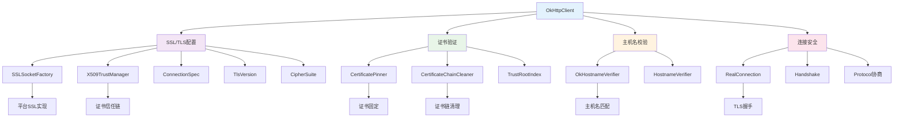

### 2.2 安全数据流图

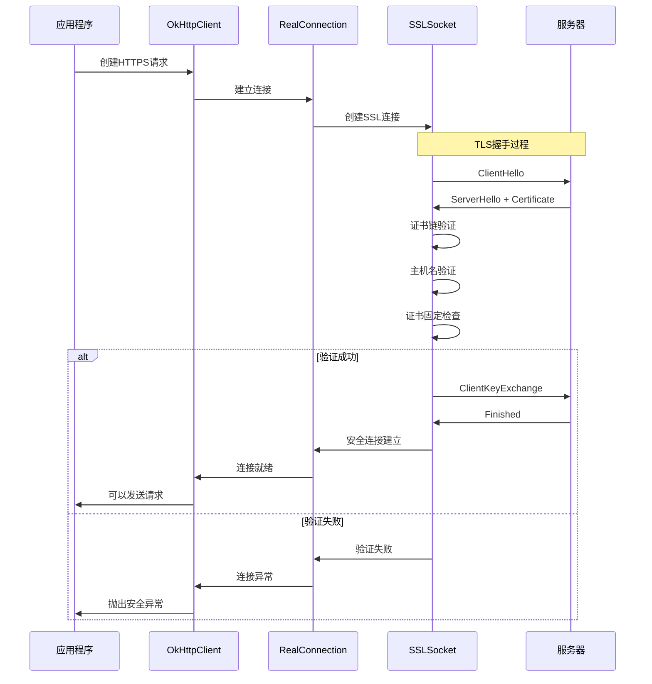

## 3. TLS/SSL支持

### 3.1 TLS版本支持

OkHttp支持多个TLS版本，并提供了灵活的配置机制：

```java
public enum TlsVersion {
  TLS_1_3("TLSv1.3"), // jdk11+, android10+
  TLS_1_2("TLSv1.2"), // jdk7+, android16+
  TLS_1_1("TLSv1.1"), // jdk7+, android16+
  TLS_1_0("TLSv1.0"), // jdk7+, android16+
  SSL_3_0("SSLv3");   // jdk6+, android9+

  public static final TlsVersion[] DEFAULT = {
    TLS_1_3, TLS_1_2, TLS_1_1, TLS_1_0
  };
}
```

#### 3.1.1 TLS版本选择策略

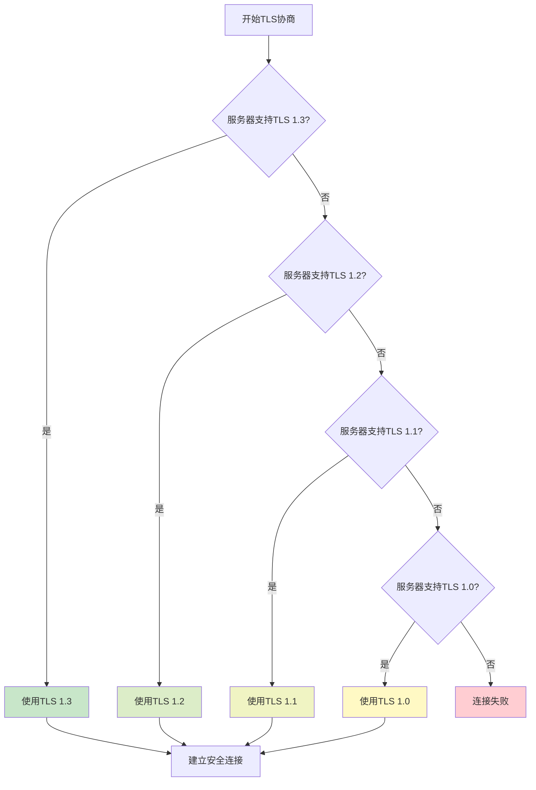

### 3.2 连接规范(ConnectionSpec)

ConnectionSpec定义了TLS连接的安全参数：

```java
public final class ConnectionSpec {
  // 现代TLS配置 - 推荐用于生产环境
  public static final ConnectionSpec MODERN_TLS = new Builder(true)
      .cipherSuites(APPROVED_CIPHER_SUITES)
      .tlsVersions(TlsVersion.TLS_1_3, TlsVersion.TLS_1_2)
      .supportsTlsExtensions(true)
      .build();

  // 兼容TLS配置 - 兼容旧系统
  public static final ConnectionSpec COMPATIBLE_TLS = new Builder(true)
      .cipherSuites(APPROVED_CIPHER_SUITES)
      .tlsVersions(TlsVersion.TLS_1_3, TlsVersion.TLS_1_2, TlsVersion.TLS_1_1, TlsVersion.TLS_1_0)
      .supportsTlsExtensions(true)
      .build();

  // 明文连接 - 仅用于HTTP
  public static final ConnectionSpec CLEARTEXT = new Builder(false).build();
}
```

#### 3.2.1 连接规范选择流程

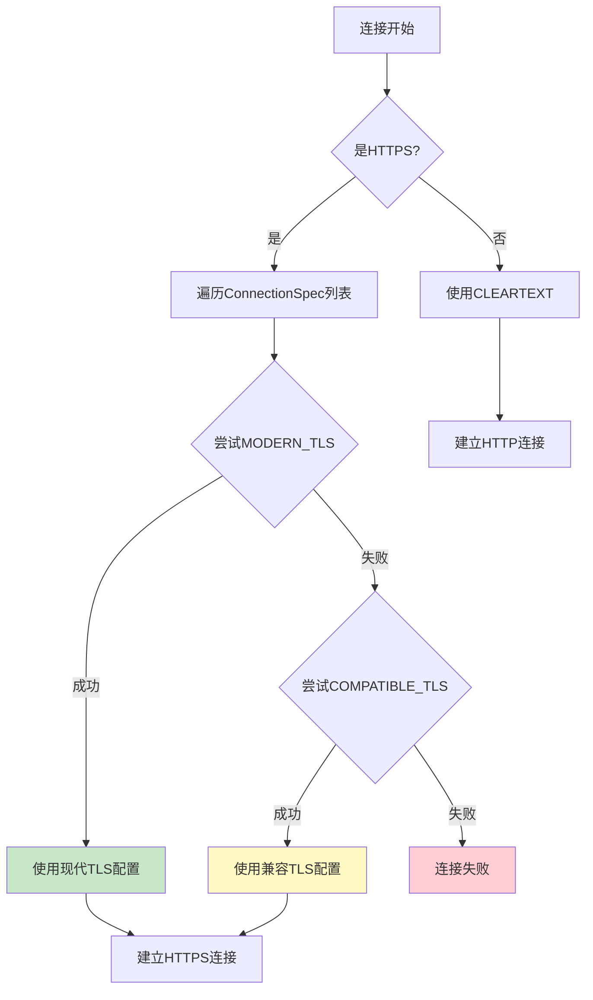

### 3.3 密码套件(CipherSuite)

OkHttp维护了一个安全的密码套件列表：

```java
public enum CipherSuite {
  // TLS 1.3 密码套件
  TLS_AES_128_GCM_SHA256("TLS_AES_128_GCM_SHA256"),
  TLS_AES_256_GCM_SHA384("TLS_AES_256_GCM_SHA384"),
  TLS_CHACHA20_POLY1305_SHA256("TLS_CHACHA20_POLY1305_SHA256"),

  // TLS 1.2 ECDHE 密码套件
  TLS_ECDHE_ECDSA_WITH_AES_128_GCM_SHA256("TLS_ECDHE_ECDSA_WITH_AES_128_GCM_SHA256"),
  TLS_ECDHE_RSA_WITH_AES_128_GCM_SHA256("TLS_ECDHE_RSA_WITH_AES_128_GCM_SHA256"),
  TLS_ECDHE_ECDSA_WITH_AES_256_GCM_SHA384("TLS_ECDHE_ECDSA_WITH_AES_256_GCM_SHA384"),
  TLS_ECDHE_RSA_WITH_AES_256_GCM_SHA384("TLS_ECDHE_RSA_WITH_AES_256_GCM_SHA384"),
  TLS_ECDHE_ECDSA_WITH_CHACHA20_POLY1305_SHA256("TLS_ECDHE_ECDSA_WITH_CHACHA20_POLY1305_SHA256"),
  TLS_ECDHE_RSA_WITH_CHACHA20_POLY1305_SHA256("TLS_ECDHE_RSA_WITH_CHACHA20_POLY1305_SHA256");

  // 批准的密码套件列表
  private static final CipherSuite[] APPROVED_CIPHER_SUITES = new CipherSuite[] {
    // TLS 1.3
    TLS_AES_128_GCM_SHA256,
    TLS_AES_256_GCM_SHA384,
    TLS_CHACHA20_POLY1305_SHA256,
    
    // TLS 1.2
    TLS_ECDHE_ECDSA_WITH_AES_128_GCM_SHA256,
    TLS_ECDHE_RSA_WITH_AES_128_GCM_SHA256,
    TLS_ECDHE_ECDSA_WITH_AES_256_GCM_SHA384,
    TLS_ECDHE_RSA_WITH_AES_256_GCM_SHA384,
    TLS_ECDHE_ECDSA_WITH_CHACHA20_POLY1305_SHA256,
    TLS_ECDHE_RSA_WITH_CHACHA20_POLY1305_SHA256
  };
}
```

#### 3.3.1 密码套件安全等级

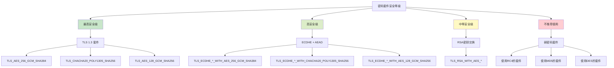

## 4. 证书验证机制

### 4.1 证书链验证

OkHttp使用CertificateChainCleaner来清理和验证证书链：

```java
public abstract class CertificateChainCleaner {
  public abstract List<Certificate> clean(List<Certificate> chain, String hostname)
      throws SSLPeerUnverifiedException;

  public static CertificateChainCleaner get(X509TrustManager trustManager) {
    return Platform.get().buildCertificateChainCleaner(trustManager);
  }

  public static CertificateChainCleaner get(X509TrustManager trustManager, TrustRootIndex trustRootIndex) {
    return new BasicCertificateChainCleaner(trustRootIndex);
  }
}
```

#### 4.1.1 证书链验证流程

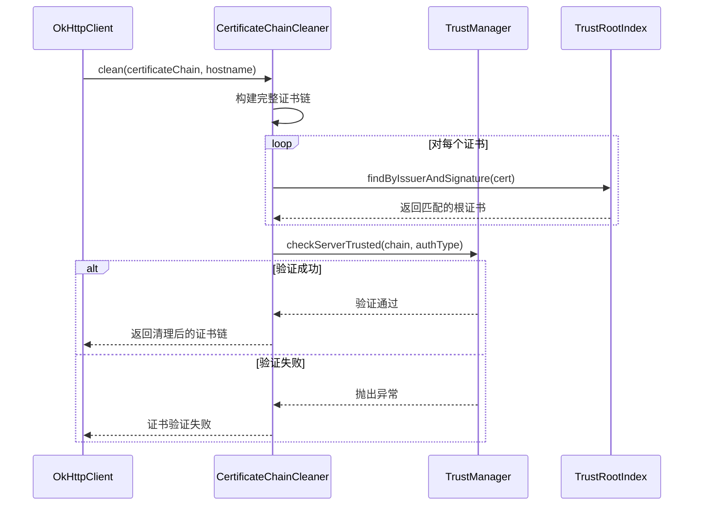

### 4.2 证书固定(Certificate Pinning)

证书固定是一种高级安全机制，用于防止中间人攻击：

```java
public final class CertificatePinner {
  public static final CertificatePinner DEFAULT = new Builder().build();

  public void check(String hostname, List<Certificate> peerCertificates)
      throws SSLPeerUnverifiedException {
    List<Pin> pins = findMatchingPins(hostname);
    if (pins.isEmpty()) return;

    if (certificateChainCleaner != null) {
      peerCertificates = certificateChainCleaner.clean(peerCertificates, hostname);
    }

    for (Certificate certificate : peerCertificates) {
      X509Certificate x509Certificate = (X509Certificate) certificate;
      
      // 计算证书的SHA-256指纹
      ByteString sha256 = sha256(x509Certificate);
      ByteString sha1 = sha1(x509Certificate);
      
      for (Pin pin : pins) {
        if (pin.matches(sha256, sha1)) {
          return; // 找到匹配的固定证书
        }
      }
    }
    
    // 没有找到匹配的证书，抛出异常
    throw new SSLPeerUnverifiedException("Certificate pinning failure!");
  }

  public static String pin(Certificate certificate) {
    if (!(certificate instanceof X509Certificate)) {
      throw new IllegalArgumentException("Certificate pinning requires X509 certificates");
    }
    return "sha256/" + sha256((X509Certificate) certificate).base64();
  }
}
```

#### 4.2.1 证书固定验证流程

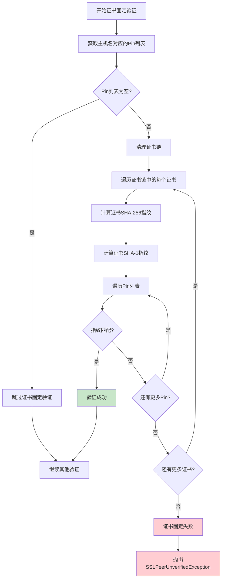

### 4.3 信任根索引(TrustRootIndex)

TrustRootIndex用于快速查找受信任的根证书：

```java
public interface TrustRootIndex {
  X509Certificate findByIssuerAndSignature(X509Certificate cert);
}

public final class BasicTrustRootIndex implements TrustRootIndex {
  private final Map<X500Principal, Set<X509Certificate>> subjectToCaCerts;

  public BasicTrustRootIndex(X509Certificate... caCerts) {
    this.subjectToCaCerts = new LinkedHashMap<>();
    for (X509Certificate caCert : caCerts) {
      X500Principal subject = caCert.getSubjectX500Principal();
      Set<X509Certificate> subjectCaCerts = subjectToCaCerts.get(subject);
      if (subjectCaCerts == null) {
        subjectCaCerts = new LinkedHashSet<>(1);
        subjectToCaCerts.put(subject, subjectCaCerts);
      }
      subjectCaCerts.add(caCert);
    }
  }

  @Override public X509Certificate findByIssuerAndSignature(X509Certificate cert) {
    X500Principal issuer = cert.getIssuerX500Principal();
    Set<X509Certificate> subjectCaCerts = subjectToCaCerts.get(issuer);
    if (subjectCaCerts == null) return null;

    for (X509Certificate caCert : subjectCaCerts) {
      PublicKey publicKey = caCert.getPublicKey();
      try {
        cert.verify(publicKey);
        return caCert;
      } catch (Exception ignored) {
      }
    }
    return null;
  }
}
```

## 5. 主机名验证

### 5.1 OkHostnameVerifier实现

OkHttp实现了符合RFC 2818标准的主机名验证器：

```java
public final class OkHostnameVerifier implements HostnameVerifier {
  public static final OkHostnameVerifier INSTANCE = new OkHostnameVerifier();

  @Override
  public boolean verify(String host, SSLSession session) {
    try {
      Certificate[] certificates = session.getPeerCertificates();
      return verify(host, (X509Certificate) certificates[0]);
    } catch (SSLException e) {
      return false;
    }
  }

  public boolean verify(String host, X509Certificate certificate) {
    return verifyAsIpAddress(host)
        ? verifyIpAddress(host, certificate)
        : verifyHostname(host, certificate);
  }

  private boolean verifyHostname(String hostname, X509Certificate certificate) {
    hostname = hostname.toLowerCase(Locale.US);
    List<String> altNames = getSubjectAltNames(certificate, ALT_DNS_NAME);
    
    for (String altName : altNames) {
      if (verifyHostname(hostname, altName)) {
        return true;
      }
    }
    return false;
  }

  public boolean verifyHostname(String hostname, String pattern) {
    // 基本检查
    if (hostname == null || hostname.isEmpty() || hostname.startsWith(".") || hostname.endsWith("..")) {
      return false;
    }
    if (pattern == null || pattern.isEmpty() || pattern.startsWith(".") || pattern.endsWith("..")) {
      return false;
    }

    // 标准化为绝对域名
    if (!hostname.endsWith(".")) hostname += '.';
    if (!pattern.endsWith(".")) pattern += '.';
    
    pattern = pattern.toLowerCase(Locale.US);

    // 非通配符模式
    if (!pattern.contains("*")) {
      return hostname.equals(pattern);
    }

    // 通配符模式验证
    if (!pattern.startsWith("*.") || pattern.indexOf('*', 1) != -1) {
      return false;
    }

    if (hostname.length() < pattern.length()) {
      return false;
    }

    if ("*.".equals(pattern)) {
      return false; // 单标签域名不允许通配符
    }

    String suffix = pattern.substring(1);
    if (!hostname.endsWith(suffix)) {
      return false;
    }

    // 检查通配符没有跨域名标签匹配
    int suffixStartIndexInHostname = hostname.length() - suffix.length();
    if (suffixStartIndexInHostname > 0 
        && hostname.lastIndexOf('.', suffixStartIndexInHostname - 1) != -1) {
      return false;
    }

    return true;
  }
}
```

#### 5.1.1 主机名验证规则

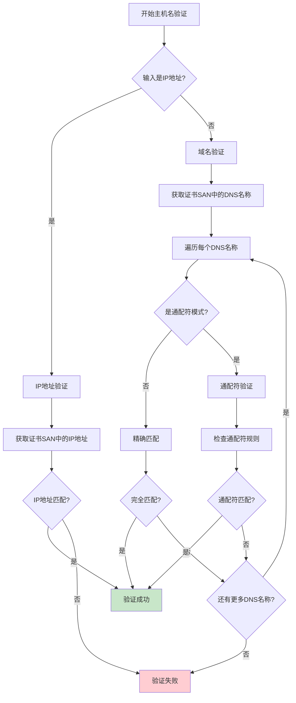

### 5.2 通配符证书支持

OkHttp支持通配符证书，但有严格的规则：

1. **星号位置**：只能在最左侧的域名标签中
2. **星号数量**：每个域名只能有一个星号
3. **匹配范围**：星号不能跨域名标签匹配
4. **单标签限制**：不允许单标签域名使用通配符

#### 5.2.1 通配符匹配示例

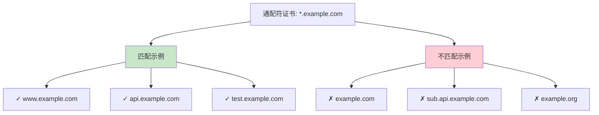

## 6. 安全连接建立

### 6.1 TLS握手过程

RealConnection负责建立安全的TLS连接：

```java
public final class RealConnection extends Http2Connection.Listener implements Connection {
  
  private void connectTls(ConnectionSpecSelector connectionSpecSelector) throws IOException {
    Address address = route.address();
    SSLSocketFactory sslSocketFactory = address.sslSocketFactory();
    boolean success = false;
    SSLSocket sslSocket = null;
    
    try {
      // 创建SSL Socket
      sslSocket = (SSLSocket) sslSocketFactory.createSocket(
          rawSocket, address.url().host(), address.url().port(), true);

      // 应用连接规范
      ConnectionSpec connectionSpec = connectionSpecSelector.configureSecureSocket(sslSocket);
      if (connectionSpec.supportsTlsExtensions()) {
        Platform.get().configureTlsExtensions(
            sslSocket, address.url().host(), address.protocols());
      }

      // 开始TLS握手
      sslSocket.startHandshake();
      
      // 获取握手结果
      SSLSession sslSocketSession = sslSocket.getSession();
      Handshake unverifiedHandshake = Handshake.get(sslSocketSession);

      // 验证主机名
      if (!address.hostnameVerifier().verify(address.url().host(), sslSocketSession)) {
        X509Certificate cert = (X509Certificate) unverifiedHandshake.peerCertificates().get(0);
        throw new SSLPeerUnverifiedException("Hostname " + address.url().host() + " not verified:\n"
            + "    certificate: " + CertificatePinner.pin(cert) + "\n"
            + "    DN: " + cert.getSubjectDN().getName() + "\n"
            + "    subjectAltNames: " + OkHostnameVerifier.allSubjectAltNames(cert));
      }

      // 证书固定检查
      address.certificatePinner().check(address.url().host(),
          unverifiedHandshake.peerCertificates());

      // 选择应用层协议
      String maybeProtocol = connectionSpec.supportsTlsExtensions()
          ? Platform.get().getSelectedProtocol(sslSocket)
          : null;
      
      socket = sslSocket;
      source = Okio.buffer(Okio.source(socket));
      sink = Okio.buffer(Okio.sink(socket));
      handshake = unverifiedHandshake;
      protocol = maybeProtocol != null
          ? Protocol.get(maybeProtocol)
          : Protocol.HTTP_1_1;
      success = true;
      
    } catch (AssertionError e) {
      if (Util.isAndroidGetsocknameError(e)) throw new IOException(e);
      throw e;
    } finally {
      if (sslSocket != null) {
        Platform.get().afterHandshake(sslSocket);
      }
      if (!success) {
        closeQuietly(sslSocket);
      }
    }
  }
}
```

#### 6.1.1 TLS握手时序图

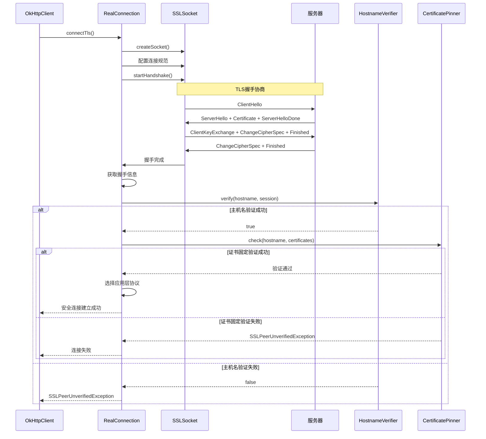

### 6.2 握手信息(Handshake)

Handshake类封装了TLS握手的结果信息：

```java
public final class Handshake {
  private final TlsVersion tlsVersion;
  private final CipherSuite cipherSuite;
  private final List<Certificate> peerCertificates;
  private final List<Certificate> localCertificates;

  public static Handshake get(SSLSession session) throws IOException {
    String cipherSuiteString = session.getCipherSuite();
    if (cipherSuiteString == null) throw new IllegalStateException("cipherSuite == null");
    if ("SSL_NULL_WITH_NULL_NULL".equals(cipherSuiteString)) {
      throw new IOException("cipherSuite == SSL_NULL_WITH_NULL_NULL");
    }
    CipherSuite cipherSuite = CipherSuite.forJavaName(cipherSuiteString);

    String tlsVersionString = session.getProtocol();
    if (tlsVersionString == null) throw new IllegalStateException("tlsVersion == null");
    if ("NONE".equals(tlsVersionString)) throw new IOException("tlsVersion == NONE");
    TlsVersion tlsVersion = TlsVersion.forJavaName(tlsVersionString);

    Certificate[] peerCertificates;
    try {
      peerCertificates = session.getPeerCertificates();
    } catch (SSLPeerUnverifiedException ignored) {
      peerCertificates = null;
    }
    List<Certificate> peerCertificatesList = peerCertificates != null
        ? Util.immutableList(peerCertificates)
        : Collections.<Certificate>emptyList();

    Certificate[] localCertificates = session.getLocalCertificates();
    List<Certificate> localCertificatesList = localCertificates != null
        ? Util.immutableList(localCertificates)
        : Collections.<Certificate>emptyList();

    return new Handshake(tlsVersion, cipherSuite, peerCertificatesList, localCertificatesList);
  }
}
```

## 7. 平台安全适配

### 7.1 Platform抽象层

OkHttp通过Platform类适配不同平台的安全实现：

```java
public class Platform {
  private static final Platform PLATFORM = findPlatform();

  public static Platform get() {
    return PLATFORM;
  }

  private static Platform findPlatform() {
    Platform android = AndroidPlatform.buildIfSupported();
    if (android != null) {
      return android;
    }

    Platform jdk9 = Jdk9Platform.buildIfSupported();
    if (jdk9 != null) {
      return jdk9;
    }

    Platform jdkWithJettyBoot = JdkWithJettyBootPlatform.buildIfSupported();
    if (jdkWithJettyBoot != null) {
      return jdkWithJettyBoot;
    }

    return new Platform();
  }

  // SSL相关方法
  public SSLContext getSSLContext() {
    try {
      return SSLContext.getInstance("TLS");
    } catch (NoSuchAlgorithmException e) {
      throw new IllegalStateException("No TLS provider", e);
    }
  }

  public X509TrustManager platformTrustManager() {
    try {
      TrustManagerFactory factory = TrustManagerFactory.getInstance(
          TrustManagerFactory.getDefaultAlgorithm());
      factory.init((KeyStore) null);
      TrustManager[] trustManagers = factory.getTrustManagers();
      if (trustManagers.length != 1 || !(trustManagers[0] instanceof X509TrustManager)) {
        throw new IllegalStateException("Unexpected default trust managers:"
            + Arrays.toString(trustManagers));
      }
      return (X509TrustManager) trustManagers[0];
    } catch (GeneralSecurityException e) {
      throw new AssertionError("No System TLS", e);
    }
  }

  public CertificateChainCleaner buildCertificateChainCleaner(X509TrustManager trustManager) {
    return new BasicCertificateChainCleaner(TrustRootIndex.get(trustManager));
  }
}
```

#### 7.1.1 平台适配架构

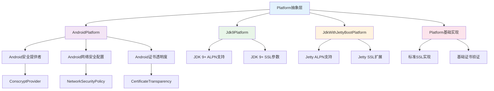

### 7.2 Android平台特殊处理

Android平台有特殊的安全要求和优化：

```java
class AndroidPlatform extends Platform {
  @Override public X509TrustManager platformTrustManager() {
    // Android使用系统证书存储
    return super.platformTrustManager();
  }

  @Override public CertificateChainCleaner buildCertificateChainCleaner(X509TrustManager trustManager) {
    try {
      // 尝试使用Android的证书链清理器
      Class<?> extensionsClass = Class.forName("android.net.http.X509TrustManagerExtensions");
      Constructor<?> constructor = extensionsClass.getConstructor(X509TrustManager.class);
      Object extensions = constructor.newInstance(trustManager);
      Method checkServerTrusted = extensionsClass.getMethod(
          "checkServerTrusted", X509Certificate[].class, String.class, String.class);
      return new AndroidCertificateChainCleaner(extensions, checkServerTrusted);
    } catch (Exception e) {
      return super.buildCertificateChainCleaner(trustManager);
    }
  }

  @Override public boolean isCleartextTrafficPermitted(String hostname) {
    try {
      Class<?> networkPolicyClass = Class.forName("android.security.NetworkSecurityPolicy");
      Method getInstanceMethod = networkPolicyClass.getMethod("getInstance");
      Object networkSecurityPolicy = getInstanceMethod.invoke(null);
      Method isCleartextTrafficPermittedMethod = networkPolicyClass
          .getMethod("isCleartextTrafficPermitted", String.class);
      return (boolean) isCleartextTrafficPermittedMethod.invoke(networkSecurityPolicy, hostname);
    } catch (Exception e) {
      return super.isCleartextTrafficPermitted(hostname);
    }
  }
}
```

## 8. 安全配置最佳实践

### 8.1 生产环境安全配置

```java
public class SecureOkHttpClientBuilder {
  
  public static OkHttpClient createSecureClient() {
    return new OkHttpClient.Builder()
        // 使用现代TLS配置
        .connectionSpecs(Arrays.asList(
            ConnectionSpec.MODERN_TLS,
            ConnectionSpec.COMPATIBLE_TLS))
        
        // 配置证书固定
        .certificatePinner(new CertificatePinner.Builder()
            .add("api.example.com", "sha256/AAAAAAAAAAAAAAAAAAAAAAAAAAAAAAAAAAAAAAAAAAA=")
            .add("api.example.com", "sha256/BBBBBBBBBBBBBBBBBBBBBBBBBBBBBBBBBBBBBBBBBBB=")
            .build())
        
        // 使用自定义主机名验证器（如果需要）
        .hostnameVerifier(OkHostnameVerifier.INSTANCE)
        
        // 配置超时
        .connectTimeout(30, TimeUnit.SECONDS)
        .readTimeout(30, TimeUnit.SECONDS)
        .writeTimeout(30, TimeUnit.SECONDS)
        
        // 添加安全拦截器
        .addInterceptor(new SecurityHeadersInterceptor())
        .addNetworkInterceptor(new CertificateTransparencyInterceptor())
        
        .build();
  }
  
  // 安全头拦截器
  static class SecurityHeadersInterceptor implements Interceptor {
    @Override
    public Response intercept(Chain chain) throws IOException {
      Request request = chain.request().newBuilder()
          .addHeader("User-Agent", "SecureApp/1.0")
          .addHeader("X-Requested-With", "XMLHttpRequest")
          .build();
      
      Response response = chain.proceed(request);
      
      // 检查安全响应头
      String hsts = response.header("Strict-Transport-Security");
      if (hsts == null) {
        Log.w("Security", "Missing HSTS header for " + request.url().host());
      }
      
      return response;
    }
  }
}
```

### 8.2 证书固定配置策略

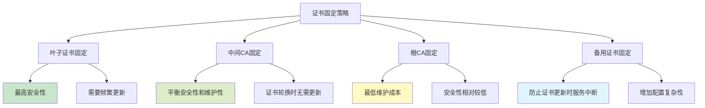

### 8.3 安全事件监听

```java
public class SecurityEventListener extends EventListener {
  private static final String TAG = "OkHttpSecurity";
  
  @Override
  public void secureConnectStart(Call call) {
    Log.d(TAG, "Starting TLS handshake for " + call.request().url().host());
  }
  
  @Override
  public void secureConnectEnd(Call call, Handshake handshake) {
    if (handshake != null) {
      Log.i(TAG, "TLS handshake completed: " + 
          "protocol=" + handshake.tlsVersion() + 
          ", cipher=" + handshake.cipherSuite() + 
          ", peer=" + handshake.peerPrincipal());
      
      // 检查弱密码套件
      if (isWeakCipherSuite(handshake.cipherSuite())) {
        Log.w(TAG, "Weak cipher suite detected: " + handshake.cipherSuite());
      }
      
      // 检查TLS版本
      if (handshake.tlsVersion().compareTo(TlsVersion.TLS_1_2) < 0) {
        Log.w(TAG, "Old TLS version detected: " + handshake.tlsVersion());
      }
    }
  }
  
  @Override
  public void connectFailed(Call call, InetSocketAddress inetSocketAddress, 
                           Proxy proxy, Protocol protocol, IOException ioe) {
    if (ioe instanceof SSLException) {
      Log.e(TAG, "SSL connection failed for " + call.request().url().host(), ioe);
      
      // 分析SSL错误类型
      if (ioe instanceof SSLPeerUnverifiedException) {
        Log.e(TAG, "Certificate verification failed");
      } else if (ioe instanceof SSLHandshakeException) {
        Log.e(TAG, "SSL handshake failed");
      }
    }
  }
  
  private boolean isWeakCipherSuite(CipherSuite cipherSuite) {
    String name = cipherSuite.javaName();
    return name.contains("RC4") || 
           name.contains("DES") || 
           name.contains("MD5") ||
           name.contains("NULL");
  }
}
```

## 9. 安全威胁防护

### 9.1 中间人攻击防护

OkHttp通过多层防护机制防止中间人攻击：

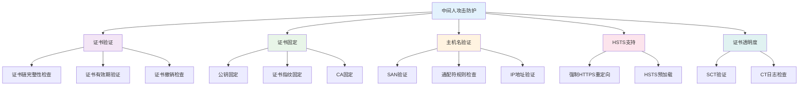

### 9.2 SSL剥离攻击防护

```java
public class SSLStrippingProtection {
  
  // HSTS预加载列表检查
  public static boolean isHSTSPreloaded(String hostname) {
    // 检查域名是否在HSTS预加载列表中
    return HSTSPreloadList.contains(hostname);
  }
  
  // 强制HTTPS拦截器
  public static class ForceHTTPSInterceptor implements Interceptor {
    private final Set<String> httpsOnlyHosts;
    
    public ForceHTTPSInterceptor(Set<String> httpsOnlyHosts) {
      this.httpsOnlyHosts = httpsOnlyHosts;
    }
    
    @Override
    public Response intercept(Chain chain) throws IOException {
      Request request = chain.request();
      String host = request.url().host();
      
      // 强制使用HTTPS
      if ("http".equals(request.url().scheme()) && httpsOnlyHosts.contains(host)) {
        HttpUrl httpsUrl = request.url().newBuilder()
            .scheme("https")
            .build();
        request = request.newBuilder()
            .url(httpsUrl)
            .build();
      }
      
      Response response = chain.proceed(request);
      
      // 检查HSTS头
      String hsts = response.header("Strict-Transport-Security");
      if (hsts != null && "https".equals(request.url().scheme())) {
        // 解析HSTS头并更新本地策略
        parseAndUpdateHSTS(host, hsts);
      }
      
      return response;
    }
    
    private void parseAndUpdateHSTS(String host, String hstsHeader) {
      // 解析HSTS头部并更新本地HSTS策略
      // max-age=31536000; includeSubDomains; preload
    }
  }
}
```

### 9.3 证书透明度支持

```java
public class CertificateTransparencyInterceptor implements Interceptor {
  
  @Override
  public Response intercept(Chain chain) throws IOException {
    Response response = chain.proceed(chain.request());
    
    // 检查证书透明度
    if ("https".equals(chain.request().url().scheme())) {
      checkCertificateTransparency(response);
    }
    
    return response;
  }
  
  private void checkCertificateTransparency(Response response) {
    // 获取连接信息
    Handshake handshake = response.handshake();
    if (handshake == null) return;
    
    List<Certificate> peerCertificates = handshake.peerCertificates();
    if (peerCertificates.isEmpty()) return;
    
    X509Certificate leafCert = (X509Certificate) peerCertificates.get(0);
    
    // 检查SCT扩展
    byte[] sctExtension = leafCert.getExtensionValue("1.3.6.1.4.1.11129.2.4.2");
    if (sctExtension != null) {
      List<SignedCertificateTimestamp> scts = parseSCTs(sctExtension);
      validateSCTs(scts, leafCert);
    }
    
    // 检查TLS扩展中的SCT
    // 检查OCSP响应中的SCT
  }
  
  private List<SignedCertificateTimestamp> parseSCTs(byte[] extension) {
    // 解析SCT扩展
    return Collections.emptyList();
  }
  
  private void validateSCTs(List<SignedCertificateTimestamp> scts, X509Certificate cert) {
    // 验证SCT签名和时间戳
    for (SignedCertificateTimestamp sct : scts) {
      // 验证SCT
    }
  }
}
```

## 10. 安全配置验证工具

### 10.1 SSL配置检查器

```java
public class SSLConfigurationChecker {
  
  public static class SecurityReport {
    public final List<SecurityIssue> issues = new ArrayList<>();
    public final List<SecurityRecommendation> recommendations = new ArrayList<>();
    
    public boolean hasHighSeverityIssues() {
      return issues.stream().anyMatch(issue -> issue.severity == Severity.HIGH);
    }
  }
  
  public static SecurityReport checkConfiguration(OkHttpClient client) {
    SecurityReport report = new SecurityReport();
    
    // 检查TLS版本
    checkTlsVersions(client, report);
    
    // 检查密码套件
    checkCipherSuites(client, report);
    
    // 检查证书固定
    checkCertificatePinning(client, report);
    
    // 检查主机名验证
    checkHostnameVerification(client, report);
    
    return report;
  }
  
  private static void checkTlsVersions(OkHttpClient client, SecurityReport report) {
    List<ConnectionSpec> specs = client.connectionSpecs();
    for (ConnectionSpec spec : specs) {
      if (spec.isTls()) {
        List<TlsVersion> tlsVersions = spec.tlsVersions();
        if (tlsVersions != null) {
          for (TlsVersion version : tlsVersions) {
            if (version.compareTo(TlsVersion.TLS_1_2) < 0) {
              report.issues.add(new SecurityIssue(
                  Severity.MEDIUM,
                  "Old TLS version enabled: " + version,
                  "Consider disabling TLS versions older than 1.2"
              ));
            }
          }
        }
      }
    }
  }
  
  private static void checkCipherSuites(OkHttpClient client, SecurityReport report) {
    List<ConnectionSpec> specs = client.connectionSpecs();
    for (ConnectionSpec spec : specs) {
      if (spec.isTls()) {
        List<CipherSuite> cipherSuites = spec.cipherSuites();
        if (cipherSuites != null) {
          for (CipherSuite suite : cipherSuites) {
            if (isWeakCipherSuite(suite)) {
              report.issues.add(new SecurityIssue(
                  Severity.HIGH,
                  "Weak cipher suite enabled: " + suite,
                  "Remove weak cipher suites from configuration"
              ));
            }
          }
        }
      }
    }
  }
  
  private static boolean isWeakCipherSuite(CipherSuite suite) {
    String name = suite.javaName();
    return name.contains("RC4") || 
           name.contains("DES") || 
           name.contains("MD5") ||
           name.contains("NULL") ||
           name.contains("EXPORT");
  }
}
```

### 10.2 运行时安全监控

```java
public class SecurityMonitor {
  private final EventListener.Factory originalFactory;
  private final SecurityMetrics metrics;
  
  public SecurityMonitor(EventListener.Factory factory) {
    this.originalFactory = factory;
    this.metrics = new SecurityMetrics();
  }
  
  public EventListener.Factory createFactory() {
    return call -> new SecurityEventListener(originalFactory.create(call), metrics);
  }
  
  private static class SecurityEventListener extends EventListener {
    private final EventListener delegate;
    private final SecurityMetrics metrics;
    
    SecurityEventListener(EventListener delegate, SecurityMetrics metrics) {
      this.delegate = delegate;
      this.metrics = metrics;
    }
    
    @Override
    public void secureConnectEnd(Call call, Handshake handshake) {
      delegate.secureConnectEnd(call, handshake);
      
      if (handshake != null) {
        // 记录TLS版本使用情况
        metrics.recordTlsVersion(handshake.tlsVersion());
        
        // 记录密码套件使用情况
        metrics.recordCipherSuite(handshake.cipherSuite());
        
        // 检查安全性
        SecurityLevel level = assessSecurityLevel(handshake);
        metrics.recordSecurityLevel(level);
        
        if (level == SecurityLevel.LOW) {
          Log.w("Security", "Low security connection detected: " + 
              "TLS=" + handshake.tlsVersion() + 
              ", Cipher=" + handshake.cipherSuite());
        }
      }
    }
    
    @Override
    public void connectFailed(Call call, InetSocketAddress inetSocketAddress, 
                             Proxy proxy, Protocol protocol, IOException ioe) {
      delegate.connectFailed(call, inetSocketAddress, proxy, protocol, ioe);
      
      if (ioe instanceof SSLException) {
        metrics.recordSslError(ioe.getClass().getSimpleName());
        
        // 分析SSL错误模式
        if (ioe.getMessage() != null) {
          if (ioe.getMessage().contains("certificate")) {
            metrics.recordCertificateError();
          } else if (ioe.getMessage().contains("handshake")) {
            metrics.recordHandshakeError();
          }
        }
      }
    }
    
    private SecurityLevel assessSecurityLevel(Handshake handshake) {
      TlsVersion tlsVersion = handshake.tlsVersion();
      CipherSuite cipherSuite = handshake.cipherSuite();
      
      // TLS 1.3 + AEAD = 高安全级别
      if (tlsVersion == TlsVersion.TLS_1_3) {
        return SecurityLevel.HIGH;
      }
      
      // TLS 1.2 + ECDHE + AEAD = 中高安全级别
      if (tlsVersion == TlsVersion.TLS_1_2 && 
          cipherSuite.javaName().contains("ECDHE") &&
          (cipherSuite.javaName().contains("GCM") || 
           cipherSuite.javaName().contains("CHACHA20"))) {
        return SecurityLevel.MEDIUM_HIGH;
      }
      
      // TLS 1.2 + 其他 = 中等安全级别
      if (tlsVersion == TlsVersion.TLS_1_2) {
        return SecurityLevel.MEDIUM;
      }
      
      // TLS < 1.2 = 低安全级别
      return SecurityLevel.LOW;
    }
  }
}
```

## 11. 总结

### 11.1 OkHttp安全设计优势

1. **多层防护**
   - TLS协议支持
   - 证书验证机制
   - 主机名校验
   - 证书固定

2. **默认安全**
   - 安全的默认配置
   - 现代密码套件
   - 强制证书验证

3. **灵活配置**
   - 可定制安全策略
   - 平台适配能力
   - 扩展性设计

4. **透明监控**
   - 详细的安全事件
   - 运行时监控
   - 安全指标收集

### 11.2 安全最佳实践总结

1. **证书管理**
   - 使用证书固定防止中间人攻击
   - 定期更新固定的证书
   - 配置备用证书防止服务中断

2. **TLS配置**
   - 使用现代TLS版本(1.2+)
   - 选择安全的密码套件
   - 启用TLS扩展支持

3. **主机名验证**
   - 使用标准的主机名验证器
   - 正确处理通配符证书
   - 验证IP地址证书

4. **运行时监控**
   - 监控SSL连接质量
   - 记录安全事件
   - 分析安全指标

### 11.3 安全架构价值

OkHttp的安全设计体现了以下价值：

- **纵深防御**：多层安全机制确保连接安全
- **默认安全**：开箱即用的安全配置
- **灵活适配**：支持不同平台和需求
- **持续改进**：跟进最新安全标准和威胁

这种设计使得OkHttp能够在保证易用性的同时，提供企业级的安全保障，是现代网络通信安全的优秀实践。

---

*本文档基于OkHttp源码深度分析，全面阐述了OkHttp的安全架构设计、实现机制和最佳实践，为开发者提供了完整的安全技术参考。*